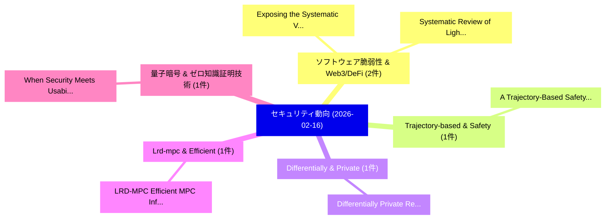

# 📅 02_daily: 日次エグゼクティブサマリー報告書 (2026-02-16)

**集計日時**: 2026-10-02 23:05:58 UTC  
**対象日付**: 2026-02-16  
**本日収集論文数**: 16 件  

---

## 💡 主要セキュリティ動向・脅威インサイト (Executive Insights)

本日の収集論文（計 16 件）において、以下の重点セキュリティ領域で活発な研究動向が確認されました：
- **ソフトウェア脆弱性 & Web3/DeFi** (2 件): 注目論文として 「Exposing the Systematic Vulner...」、「Systematic Review of Lightweig...」 等が発表され、実務防御および攻撃検証の進展が見られます。
- **Trajectory-based & Safety** (1 件): 注目論文として 「A Trajectory-Based Safety Audi...」 等が発表され、実務防御および攻撃検証の進展が見られます。
- **Differentially & Private** (1 件): 注目論文として 「Differentially Private Retriev...」 等が発表され、実務防御および攻撃検証の進展が見られます。
- **Lrd-mpc & Efficient** (1 件): 注目論文として 「LRD-MPC: Efficient MPC Inferen...」 等が発表され、実務防御および攻撃検証の進展が見られます。
- **量子暗号 & ゼロ知識証明技術** (1 件): 注目論文として 「When Security Meets Usability:...」 等が発表され、実務防御および攻撃検証の進展が見られます。

### 🗺️ 技術・脅威トピックマインドマップ

---

## 📌 日次セキュリティ論文一覧 (日本語表形式)

| No | arXiv ID | 論文タイトル (日本語訳) | 重要キーワード | 構造化エグゼクティブ要約 (背景・提案・影響) | 脅威分類 | 詳細リンク |
|---|---|---|---|---|---|---|
| 1 | `2602.14364v1` | [A Trajectory-Based Safety Audit of Clawdbot (OpenClaw)（セキュリティ分析論文）](../../okf/papers/2026-02-16/2602.14364.md) | `Based Safety Audit`, `Trajectory-Based Safety`, `Tianyu Chen` | 【提案】概要 (Overview & Key Finding) 本論文「A Trajectory-Based Safety Audit of Clawdbot (OpenClaw)（...。実証評価により経営層・セキュリティ管理者向け推奨アクション (E... | `cs.AI` | [arXiv](https://arxiv.org/abs/2602.14364v1) &#124; [OKF](../../okf/papers/2026-02-16/2602.14364.md) |
| 2 | `2602.14374v1` | [Differentially Private Retrieval-Augmented Generation（セキュリティ分析論文）](../../okf/papers/2026-02-16/2602.14374.md) | `Differentially Private Retrieval`, `Augmented Generation`, `Retrieval-Augmented Generation` | 【提案】概要 (Overview & Key Finding) 本論文「Differentially Private Retrieval-Augmented Generation（セ...。実証評価により経営層・セキュリティ管理者向け推奨アクション (E... | `cs.AI` | [arXiv](https://arxiv.org/abs/2602.14374v1) &#124; [OKF](../../okf/papers/2026-02-16/2602.14374.md) |
| 3 | `2602.14397v1` | [LRD-MPC: Efficient MPC Inference through Low-rank Decomposition（セキュリティ分析論文）](../../okf/papers/2026-02-16/2602.14397.md) | `Low-rank Decomposition`, `Tingting Tang`, `Yongqin Wang` | 【提案】概要 (Overview & Key Finding) 本論文「LRD-MPC: Efficient MPC Inference through Low-rank Decom...。実証評価により経営層・セキュリティ管理者向け推奨アクション (E... | `executive-summary` | [arXiv](https://arxiv.org/abs/2602.14397v1) &#124; [OKF](../../okf/papers/2026-02-16/2602.14397.md) |
| 4 | `2602.14539v1` | [When Security Meets Usability: An Empirical Investigation of Post-Quantum Cryptography APIs（セキュリティ分析論文）](../../okf/papers/2026-02-16/2602.14539.md) | `Quantum Cryptography`, `Post-Quantum Cryptography`, `Marthin Toruan` | 【提案】概要 (Overview & Key Finding) 本論文「When Security Meets Usability: An Empirical Investigati...。実証評価により経営層・セキュリティ管理者向け推奨アクション (E... | `executive-summary` | [arXiv](https://arxiv.org/abs/2602.14539v1) &#124; [OKF](../../okf/papers/2026-02-16/2602.14539.md) |
| 5 | `2602.14544v1` | [A New Approach in Cryptanalysis Through Combinatorial Equivalence of Cryptosystems（セキュリティ分析論文）](../../okf/papers/2026-02-16/2602.14544.md) | `Jaagup Sepp`, `Eric Filiol`, `Raw Meta` | 【提案】概要 (Overview & Key Finding) 本論文「A New Approach in Cryptanalysis Through Combinatorial E...。実証評価により経営層・セキュリティ管理者向け推奨アクション (E... | `cybersecurity` | [arXiv](https://arxiv.org/abs/2602.14544v1) &#124; [OKF](../../okf/papers/2026-02-16/2602.14544.md) |
| 6 | `2602.14598v1` | [Before the Vicious Cycle Starts: Preventing Burnout Across SOC Roles Through Flow-Aligned Design（セキュリティ分析論文）](../../okf/papers/2026-02-16/2602.14598.md) | `Vicious Cycle Starts`, `Preventing Burnout Across`, `Aligned Design` | 【提案】概要 (Overview & Key Finding) 本論文「Before the Vicious Cycle Starts: Preventing Burnout Acr...。実証評価により経営層・セキュリティ管理者向け推奨アクション (E... | `executive-summary` | [arXiv](https://arxiv.org/abs/2602.14598v1) &#124; [OKF](../../okf/papers/2026-02-16/2602.14598.md) |
| 7 | `2602.14689v1` | [Exposing the Systematic Vulnerability of Open-Weight Models to Prefill Attacks（セキュリティ分析論文）](../../okf/papers/2026-02-16/2602.14689.md) | `Systematic Vulnerability`, `Weight Models`, `Prefill Attacks` | 【提案】概要 (Overview & Key Finding) 本論文「Exposing the Systematic 脆弱性 of Open-Weight Models to Pr...。実証評価により経営層・セキュリティ管理者向け推奨アクション (E... | `cs.AI` | [arXiv](https://arxiv.org/abs/2602.14689v1) &#124; [OKF](../../okf/papers/2026-02-16/2602.14689.md) |
| 8 | `2602.14731v1` | [Systematic Review of Lightweight Cryptographic Algorithms（セキュリティ分析論文）](../../okf/papers/2026-02-16/2602.14731.md) | `Lightweight Cryptographic Algorithms`, `Systematic Review`, `Mohsin Khan` | 【提案】概要 (Overview & Key Finding) 本論文「Systematic Review of Lightweight Cryptographic Algorith...。実証評価により経営層・セキュリティ管理者向け推奨アクション (E... | `cybersecurity` | [arXiv](https://arxiv.org/abs/2602.14731v1) &#124; [OKF](../../okf/papers/2026-02-16/2602.14731.md) |
| 9 | `2602.14798v1` | [Overthinking Loops in Agents: A Structural Risk via MCP Tools（セキュリティ分析論文）](../../okf/papers/2026-02-16/2602.14798.md) | `Overthinking Loops`, `Structural Risk`, `Yohan Lee` | 【提案】概要 (Overview & Key Finding) 本論文「Overthinking Loops in Agents: A Structural Risk via MCP...。実証評価により経営層・セキュリティ管理者向け推奨アクション (E... | `executive-summary` | [arXiv](https://arxiv.org/abs/2602.14798v1) &#124; [OKF](../../okf/papers/2026-02-16/2602.14798.md) |
| 10 | `2602.14871v1` | [interID -- An Ecosystem-agnostic Verifier-as-a-Service with OpenID Connect Bridge（セキュリティ分析論文）](../../okf/papers/2026-02-16/2602.14871.md) | `Connect Bridge`, `Ecosystem-agnostic Verifier`, `Hakan Yildiz` | 【提案】概要 (Overview & Key Finding) 本論文「interID -- An Ecosystem-agnostic Verifier-as-a-Service ...。実証評価により経営層・セキュリティ管理者向け推奨アクション (E... | `cybersecurity` | [arXiv](https://arxiv.org/abs/2602.14871v1) &#124; [OKF](../../okf/papers/2026-02-16/2602.14871.md) |
| 11 | `2602.15135v2` | [State of Passkey Authentication in the Wild: A Census of the Top 100K sites（セキュリティ分析論文）](../../okf/papers/2026-02-16/2602.15135.md) | `Passkey Authentication`, `Prince Bhardwaj`, `Nishanth Sastry` | 【提案】概要 (Overview & Key Finding) 本論文「State of Passkey Authentication in the Wild: A Census o...。実証評価により経営層・セキュリティ管理者向け推奨アクション (E... | `cybersecurity` | [arXiv](https://arxiv.org/abs/2602.15135v2) &#124; [OKF](../../okf/papers/2026-02-16/2602.15135.md) |
| 12 | `2602.15161v1` | [Exploiting Layer-Specific Vulnerabilities to Backdoor Attack in 連合学習](../../okf/papers/2026-02-16/2602.15161.md) | `Exploiting Layer`, `Specific Vulnerabilities`, `Backdoor Attack` | 【提案】概要 (Overview & Key Finding) 本論文「Exploiting Layer-Specific Vulnerabilities to Backdoor A...。実証評価により経営層・セキュリティ管理者向け推奨アクション (E... | `cs.AI` | [arXiv](https://arxiv.org/abs/2602.15161v1) &#124; [OKF](../../okf/papers/2026-02-16/2602.15161.md) |
| 13 | `2602.15195v3` | [Weight space Backdoors in LoRA Adaptersの検出](../../okf/papers/2026-02-16/2602.15195.md) | `David Puertolas Merenciano`, `Ekaterina Vasyagina`, `Kevin Zhu` | 【提案】概要 (Overview & Key Finding) 本論文「Weight space Backdoors in LoRA Adaptersの検出」（原題: Weight ...。実証評価により経営層・セキュリティ管理者向け推奨アクション (E... | `cs.AI` | [arXiv](https://arxiv.org/abs/2602.15195v3) &#124; [OKF](../../okf/papers/2026-02-16/2602.15195.md) |
| 14 | `2602.15238v2` | [Closing the Distribution Gap in Adversarial Training for LLMs（セキュリティ分析論文）](../../okf/papers/2026-02-16/2602.15238.md) | `Distribution Gap`, `Adversarial Training`, `Chengzhi Hu` | 【提案】概要 (Overview & Key Finding) 本論文「Closing the Distribution Gap in Adversarial Training fo...。実証評価により経営層・セキュリティ管理者向け推奨アクション (E... | `cs.AI` | [arXiv](https://arxiv.org/abs/2602.15238v2) &#124; [OKF](../../okf/papers/2026-02-16/2602.15238.md) |
| 15 | `2602.15263v1` | [A Scan-Based Internet-Exposed IoT Devices Using Shodan Dataの分析](../../okf/papers/2026-02-16/2602.15263.md) | `Devices Using Shodan Data`, `Devices Using Shodan`, `Based Internet` | 【提案】概要 (Overview & Key Finding) 本論文「A Scan-Based Internet-Exposed IoT Devices Using Shodan ...。実証評価により経営層・セキュリティ管理者向け推奨アクション (E... | `cs.NI` | [arXiv](https://arxiv.org/abs/2602.15263v1) &#124; [OKF](../../okf/papers/2026-02-16/2602.15263.md) |
| 16 | `2602.16723v1` | [Is Mamba Reliable for Medical Imaging?（セキュリティ分析論文）](../../okf/papers/2026-02-16/2602.16723.md) | `Medical Imaging`, `Banafsheh Saber Latibari`, `Najmeh Nazari` | 【提案】### (日本語題名: Is Mamba Reliable for Medical Imaging?（セキュリティ分析論文）)  > [!NOTE] > **OKF Meta...。実証評価により経営層・セキュリティ管理者向け推奨アクション (E... | `cs.AI` | [arXiv](https://arxiv.org/abs/2602.16723v1) &#124; [OKF](../../okf/papers/2026-02-16/2602.16723.md) |

