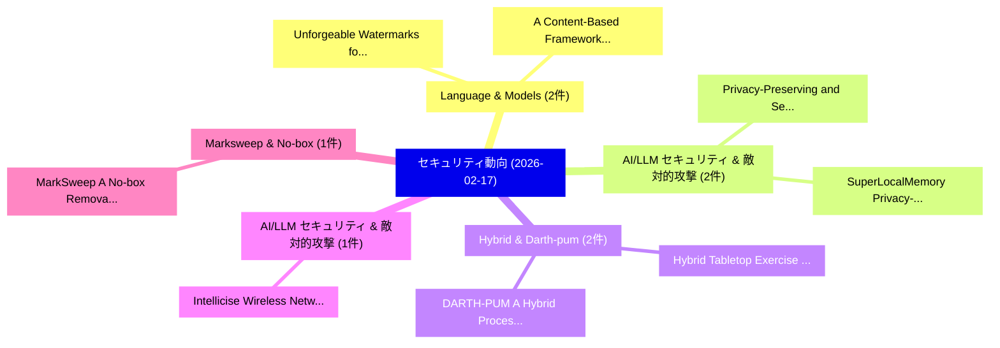

# 📅 02_daily: 日次エグゼクティブサマリー報告書 (2026-02-17)

**集計日時**: 2026-10-02 23:05:58 UTC  
**対象日付**: 2026-02-17  
**本日収集論文数**: 23 件  

---

## 💡 主要セキュリティ動向・脅威インサイト (Executive Insights)

本日の収集論文（計 23 件）において、以下の重点セキュリティ領域で活発な研究動向が確認されました：
- **Language & Models** (2 件): 注目論文として 「Unforgeable Watermarks for Lan...」、「A Content-Based Framework for ...」 等が発表され、実務防御および攻撃検証の進展が見られます。
- **AI/LLM セキュリティ & 敵対的攻撃** (2 件): 注目論文として 「Privacy-Preserving and Secure ...」、「SuperLocalMemory: Privacy-Pres...」 等が発表され、実務防御および攻撃検証の進展が見られます。
- **Hybrid & Darth-pum** (2 件): 注目論文として 「Hybrid Tabletop Exercise (TTX)...」、「DARTH-PUM: A Hybrid Processing...」 等が発表され、実務防御および攻撃検証の進展が見られます。
- **AI/LLM セキュリティ & 敵対的攻撃** (1 件): 注目論文として 「Intellicise Wireless Networks ...」 等が発表され、実務防御および攻撃検証の進展が見られます。
- **Marksweep & No-box** (1 件): 注目論文として 「MarkSweep: A No-box Removal At...」 等が発表され、実務防御および攻撃検証の進展が見られます。

### 🗺️ 技術・脅威トピックマインドマップ

---

## 📌 日次セキュリティ論文一覧 (日本語表形式)

| No | arXiv ID | 論文タイトル (日本語訳) | 重要キーワード | 構造化エグゼクティブ要約 (背景・提案・影響) | 脅威分類 | 詳細リンク |
|---|---|---|---|---|---|---|
| 1 | `2602.15290v1` | [Intellicise Wireless Networks Meet Agentic AI: A Security and Privacy Perspective（セキュリティ分析論文）](../../okf/papers/2026-02-17/2602.15290.md) | `Intellicise Wireless Networks Meet Agentic`, `Privacy Perspective`, `Rui Meng` | 【提案】概要 (Overview & Key Finding) 本論文「Intellicise Wireless Networks Meet Agentic AI: A Securi...。実証評価により経営層・セキュリティ管理者向け推奨アクション (E... | `executive-summary` | [arXiv](https://arxiv.org/abs/2602.15290v1) &#124; [OKF](../../okf/papers/2026-02-17/2602.15290.md) |
| 2 | `2602.15323v1` | [Unforgeable Watermarks for Language Models via Robust Signatures（セキュリティ分析論文）](../../okf/papers/2026-02-17/2602.15323.md) | `Unforgeable Watermarks`, `Language Models`, `Robust Signatures` | 【提案】概要 (Overview & Key Finding) 本論文「Unforgeable Watermarks for Language Models via Robust S...。実証評価により経営層・セキュリティ管理者向け推奨アクション (E... | `cs.AI` | [arXiv](https://arxiv.org/abs/2602.15323v1) &#124; [OKF](../../okf/papers/2026-02-17/2602.15323.md) |
| 3 | `2602.15364v1` | [MarkSweep: A No-box Removal Attack on AI-Generated Image Watermarking via Noise Intensification and Frequency-aware Denoising（セキュリティ分析論文）](../../okf/papers/2026-02-17/2602.15364.md) | `Generated Image Watermarking`, `Removal Attack`, `Noise Intensification` | 【提案】概要 (Overview & Key Finding) 本論文「MarkSweep: A No-box Removal Attack on AI-Generated Imag...。実証評価により経営層・セキュリティ管理者向け推奨アクション (E... | `cybersecurity` | [arXiv](https://arxiv.org/abs/2602.15364v1) &#124; [OKF](../../okf/papers/2026-02-17/2602.15364.md) |
| 4 | `2602.15376v1` | [A Unified Evaluation of Learning-Based Similarity Techniques for マルウェア検出](../../okf/papers/2026-02-17/2602.15376.md) | `Based Similarity Techniques`, `Learning-Based Similarity`, `Malware Detection` | 【提案】概要 (Overview & Key Finding) 本論文「A Unified Evaluation of Learning-Based Similarity Techn...。実証評価により経営層・セキュリティ管理者向け推奨アクション (E... | `cs.AI` | [arXiv](https://arxiv.org/abs/2602.15376v1) &#124; [OKF](../../okf/papers/2026-02-17/2602.15376.md) |
| 5 | `2602.15395v2` | [MEV in Binance Builder（セキュリティ分析論文）](../../okf/papers/2026-02-17/2602.15395.md) | `Binance Builder`, `Qin Wang`, `Ruiqiang Li` | 【提案】概要 (Overview & Key Finding) 本論文「MEV in Binance Builder（セキュリティ分析論文）」（原題: MEV in Binance ...。実証評価により経営層・セキュリティ管理者向け推奨アクション (E... | `cybersecurity` | [arXiv](https://arxiv.org/abs/2602.15395v2) &#124; [OKF](../../okf/papers/2026-02-17/2602.15395.md) |
| 6 | `2602.15485v2` | [SecCodeBench-V2 Technical Report（セキュリティ分析論文）](../../okf/papers/2026-02-17/2602.15485.md) | `V2 Technical Report`, `SecCodeBench-V2 Technical`, `Terry Yue Zhuo` | 【提案】概要 (Overview & Key Finding) 本論文「SecCodeBench-V2 Technical Report（セキュリティ分析論文）」（原題: SecCo...。実証評価により経営層・セキュリティ管理者向け推奨アクション (E... | `cs.AI` | [arXiv](https://arxiv.org/abs/2602.15485v2) &#124; [OKF](../../okf/papers/2026-02-17/2602.15485.md) |
| 7 | `2602.15614v1` | [Onto-DP: Constructing Neighborhoods for Differential Privacy on Ontological Databases（セキュリティ分析論文）](../../okf/papers/2026-02-17/2602.15614.md) | `Constructing Neighborhoods`, `Differential Privacy`, `Ontological Databases` | 【提案】概要 (Overview & Key Finding) 本論文「Onto-DP: Constructing Neighborhoods for 差分プライバシー on Ont...。実証評価により経営層・セキュリティ管理者向け推奨アクション (E... | `cybersecurity` | [arXiv](https://arxiv.org/abs/2602.15614v1) &#124; [OKF](../../okf/papers/2026-02-17/2602.15614.md) |
| 8 | `2602.15654v2` | [Zombie Agents: Persistent Control of Self-Evolving LLMエージェント via Self-Reinforcing Injections](../../okf/papers/2026-02-17/2602.15654.md) | `Zombie Agents`, `Persistent Control`, `Reinforcing Injections` | 【提案】概要 (Overview & Key Finding) 本論文「Zombie Agents: Persistent Control of Self-Evolving LLMエ...。実証評価により経営層・セキュリティ管理者向け推奨アクション (E... | `cs.AI` | [arXiv](https://arxiv.org/abs/2602.15654v2) &#124; [OKF](../../okf/papers/2026-02-17/2602.15654.md) |
| 9 | `2602.15671v1` | [Revisiting Backdoor Threat in Federated Instruction Tuning from a Signal Aggregation Perspective（セキュリティ分析論文）](../../okf/papers/2026-02-17/2602.15671.md) | `Revisiting Backdoor Threat`, `Federated Instruction Tuning`, `Signal Aggregation Perspective` | 【提案】概要 (Overview & Key Finding) 本論文「Revisiting Backdoor 脅威 in Federated Instruction Tuning ...。実証評価により経営層・セキュリティ管理者向け推奨アクション (E... | `cybersecurity` | [arXiv](https://arxiv.org/abs/2602.15671v1) &#124; [OKF](../../okf/papers/2026-02-17/2602.15671.md) |
| 10 | `2602.15689v2` | [A Content-Based Framework for Cybersecurity Refusal Decisions in 大規模言語モデル](../../okf/papers/2026-02-17/2602.15689.md) | `Cybersecurity Refusal Decisions`, `Large Language Models`, `Noa Linder` | 【提案】概要 (Overview & Key Finding) 本論文「A Content-Based Framework for Cybersecurity Refusal Dec...。実証評価により経営層・セキュリティ管理者向け推奨アクション (E... | `cs.AI` | [arXiv](https://arxiv.org/abs/2602.15689v2) &#124; [OKF](../../okf/papers/2026-02-17/2602.15689.md) |
| 11 | `2602.15705v2` | [Privacy-Preserving and Secure Spectrum Sharing for Database-Driven Cognitive Radio Networks（セキュリティ分析論文）](../../okf/papers/2026-02-17/2602.15705.md) | `Driven Cognitive Radio Networks`, `Secure Spectrum Sharing`, `Database-Driven Cognitive` | 【提案】概要 (Overview & Key Finding) 本論文「Privacy-Preserving and Secure Spectrum Sharing for Data...。実証評価により経営層・セキュリティ管理者向け推奨アクション (E... | `cybersecurity` | [arXiv](https://arxiv.org/abs/2602.15705v2) &#124; [OKF](../../okf/papers/2026-02-17/2602.15705.md) |
| 12 | `2602.15756v1` | [A Note on Non-Composability of Layerwise Approximate Verification for Neural Inference（セキュリティ分析論文）](../../okf/papers/2026-02-17/2602.15756.md) | `Layerwise Approximate Verification`, `Neural Inference`, `Raw Meta` | 【提案】概要 (Overview & Key Finding) 本論文「A Note on Non-Composability of Layerwise Approximate Ve...。実証評価により経営層・セキュリティ管理者向け推奨アクション (E... | `executive-summary` | [arXiv](https://arxiv.org/abs/2602.15756v1) &#124; [OKF](../../okf/papers/2026-02-17/2602.15756.md) |
| 13 | `2602.15802v2` | [Local Node Differential Privacy（セキュリティ分析論文）](../../okf/papers/2026-02-17/2602.15802.md) | `Local Node Differential Privacy`, `Sofya Raskhodnikova`, `Adam Smith` | 【提案】概要 (Overview & Key Finding) 本論文「Local Node 差分プライバシー（セキュリティ分析論文）」（原題: Local Node 差分プライバシ...。実証評価により経営層・セキュリティ管理者向け推奨アクション (E... | `executive-summary` | [arXiv](https://arxiv.org/abs/2602.15802v2) &#124; [OKF](../../okf/papers/2026-02-17/2602.15802.md) |
| 14 | `2602.15815v2` | [Privacy Filters are Captured by Residues: A Characterization of Free Natural Filters and the Cost of Adaptivity（セキュリティ分析論文）](../../okf/papers/2026-02-17/2602.15815.md) | `Free Natural Filters`, `Privacy Filters`, `Matthew Regehr` | 【提案】概要 (Overview & Key Finding) 本論文「Privacy Filters are Captured by Residues: A Characteriz...。実証評価により経営層・セキュリティ管理者向け推奨アクション (E... | `executive-summary` | [arXiv](https://arxiv.org/abs/2602.15815v2) &#124; [OKF](../../okf/papers/2026-02-17/2602.15815.md) |
| 15 | `2602.15945v1` | [From Tool Orchestration to Code Execution: A Study of MCP Design Choices（セキュリティ分析論文）](../../okf/papers/2026-02-17/2602.15945.md) | `Code Execution`, `Design Choices`, `Yuval Felendler` | 【提案】概要 (Overview & Key Finding) 本論文「From Tool Orchestration to Code Execution: A Study of M...。実証評価により経営層・セキュリティ管理者向け推奨アクション (E... | `cs.AI` | [arXiv](https://arxiv.org/abs/2602.15945v1) &#124; [OKF](../../okf/papers/2026-02-17/2602.15945.md) |
| 16 | `2602.15966v2` | [Hardware-Agnostic Modeling of Quantum Side-Channel Leakage via Conditional Dynamics and Learning from Full Correlation Data（セキュリティ分析論文）](../../okf/papers/2026-02-17/2602.15966.md) | `Full Correlation Data`, `Agnostic Modeling`, `Quantum Side` | 【提案】概要 (Overview & Key Finding) 本論文「Hardware-Agnostic Modeling of 量子 サイドチャネル攻撃 Leakage via ...。実証評価により経営層・セキュリティ管理者向け推奨アクション (E... | `executive-summary` | [arXiv](https://arxiv.org/abs/2602.15966v2) &#124; [OKF](../../okf/papers/2026-02-17/2602.15966.md) |
| 17 | `2602.15975v1` | [Hybrid Tabletop Exercise (TTX) based on a Mathematical Simulation-based Model for the Maritime Sector（セキュリティ分析論文）](../../okf/papers/2026-02-17/2602.15975.md) | `Hybrid Tabletop Exercise`, `Mathematical Simulation`, `Simulation-based Model` | 【提案】概要 (Overview & Key Finding) 本論文「Hybrid Tabletop Exercise (TTX) based on a Mathematical ...。実証評価により経営層・セキュリティ管理者向け推奨アクション (E... | `cybersecurity` | [arXiv](https://arxiv.org/abs/2602.15975v1) &#124; [OKF](../../okf/papers/2026-02-17/2602.15975.md) |
| 18 | `2602.15981v1` | [A Theoretical Approach to Stablecoin Design via Price Windows（セキュリティ分析論文）](../../okf/papers/2026-02-17/2602.15981.md) | `Stablecoin Design`, `Price Windows`, `Katherine Molinet` | 【提案】概要 (Overview & Key Finding) 本論文「A Theoretical Approach to Stablecoin Design via Price W...。実証評価により経営層・セキュリティ管理者向け推奨アクション (E... | `executive-summary` | [arXiv](https://arxiv.org/abs/2602.15981v1) &#124; [OKF](../../okf/papers/2026-02-17/2602.15981.md) |
| 19 | `2602.16075v2` | [DARTH-PUM: A Hybrid Processing-Using-Memory Architecture（セキュリティ分析論文）](../../okf/papers/2026-02-17/2602.16075.md) | `Hybrid Processing`, `Memory Architecture`, `Ryan Wong` | 【提案】概要 (Overview & Key Finding) 本論文「DARTH-PUM: A Hybrid Processing-Using-Memory Architectur...。実証評価により経営層・セキュリティ管理者向け推奨アクション (E... | `cs.ET` | [arXiv](https://arxiv.org/abs/2602.16075v2) &#124; [OKF](../../okf/papers/2026-02-17/2602.16075.md) |
| 20 | `2602.16729v3` | [Intent Laundering: AI Safety Datasets Are Not What They Seem（セキュリティ分析論文）](../../okf/papers/2026-02-17/2602.16729.md) | `Intent Laundering`, `Shahriar Golchin`, `Marc Wetter` | 【提案】背景とセキュリティ上の課題 (Background & Problem) 本研究はサイバー脅威環境におけるセキュリティ構造・脆弱性の検証を目的としています。(主要検出項目: ...。実証評価により経営層・セキュリティ管理者向け推奨アクション (E... | `cs.AI` | [arXiv](https://arxiv.org/abs/2602.16729v3) &#124; [OKF](../../okf/papers/2026-02-17/2602.16729.md) |
| 21 | `2603.02240v1` | [SuperLocalMemory: Privacy-Preserving Multi-Agent Memory with Bayesian Trust Defense Against Memory Poisoning（セキュリティ分析論文）](../../okf/papers/2026-02-17/2603.02240.md) | `Preserving Multi`, `Agent Memory`, `Privacy-Preserving Multi` | 【提案】概要 (Overview & Key Finding) 本論文「SuperLocalMemory: Privacy-Preserving Multi-Agent Memory...。実証評価により経営層・セキュリティ管理者向け推奨アクション (E... | `cs.AI` | [arXiv](https://arxiv.org/abs/2603.02240v1) &#124; [OKF](../../okf/papers/2026-02-17/2603.02240.md) |
| 22 | `2603.05521v2` | [Ecosystem Trust Profiles（セキュリティ分析論文）](../../okf/papers/2026-02-17/2603.05521.md) | `Ecosystem Trust Profiles`, `Raw Meta`, `Executive Summary` | 【提案】概要 (Overview & Key Finding) 本論文「Ecosystem Trust Profiles（セキュリティ分析論文）」（原題: Ecosystem Tru...。実証評価によりStrnadl - **公開日時**: `2026... | `cybersecurity` | [arXiv](https://arxiv.org/abs/2603.05521v2) &#124; [OKF](../../okf/papers/2026-02-17/2603.05521.md) |
| 23 | `2603.13237v1` | [A Dual-Path Generative Framework for Zero-Day Fraud Detection in Banking Systems（セキュリティ分析論文）](../../okf/papers/2026-02-17/2603.13237.md) | `Day Fraud Detection`, `Banking Systems`, `Dual-Path Generative` | 【提案】概要 (Overview & Key Finding) 本論文「A Dual-Path Generative Framework for Zero-Day Fraud Det...。実証評価により経営層・セキュリティ管理者向け推奨アクション (E... | `cs.AI` | [arXiv](https://arxiv.org/abs/2603.13237v1) &#124; [OKF](../../okf/papers/2026-02-17/2603.13237.md) |

