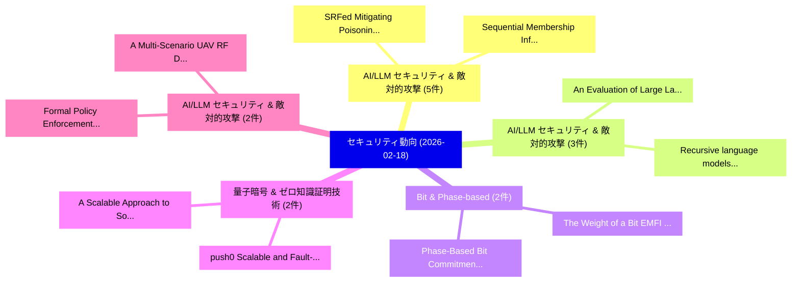

# 📅 02_daily: 日次エグゼクティブサマリー報告書 (2026-02-18)

**集計日時**: 2026-10-02 23:05:58 UTC  
**対象日付**: 2026-02-18  
**本日収集論文数**: 25 件  

---

## 💡 主要セキュリティ動向・脅威インサイト (Executive Insights)

本日の収集論文（計 25 件）において、以下の重点セキュリティ領域で活発な研究動向が確認されました：
- **AI/LLM セキュリティ & 敵対的攻撃** (5 件): 注目論文として 「SRFed: Mitigating Poisoning At...」、「Sequential Membership Inferenc...」 等が発表され、実務防御および攻撃検証の進展が見られます。
- **AI/LLM セキュリティ & 敵対的攻撃** (3 件): 注目論文として 「An Evaluation of Large Languag...」、「Recursive language models for ...」 等が発表され、実務防御および攻撃検証の進展が見られます。
- **Bit & Phase-based** (2 件): 注目論文として 「The Weight of a Bit: EMFI Sens...」、「Phase-Based Bit Commitment Pro...」 等が発表され、実務防御および攻撃検証の進展が見られます。
- **量子暗号 & ゼロ知識証明技術** (2 件): 注目論文として 「push0: Scalable and Fault-Tole...」、「A Scalable Approach to Solving...」 等が発表され、実務防御および攻撃検証の進展が見られます。
- **AI/LLM セキュリティ & 敵対的攻撃** (2 件): 注目論文として 「Formal Policy Enforcement for ...」、「A Multi-Scenario UAV RF Datase...」 等が発表され、実務防御および攻撃検証の進展が見られます。

### 🗺️ 技術・脅威トピックマインドマップ

---

## 📌 日次セキュリティ論文一覧 (日本語表形式)

| No | arXiv ID | 論文タイトル (日本語訳) | 重要キーワード | 構造化エグゼクティブ要約 (背景・提案・影響) | 脅威分類 | 詳細リンク |
|---|---|---|---|---|---|---|
| 1 | `2602.16098v1` | [Collaborative Zone-Adaptive Zero-Day Intrusion Detection for IoBT（セキュリティ分析論文）](../../okf/papers/2026-02-18/2602.16098.md) | `Day Intrusion Detection`, `Collaborative Zone`, `Adaptive Zero` | 【提案】概要 (Overview & Key Finding) 本論文「Collaborative Zone-Adaptive Zero-Day Intrusion Detectio...。実証評価により経営層・セキュリティ管理者向け推奨アクション (E... | `executive-summary` | [arXiv](https://arxiv.org/abs/2602.16098v1) &#124; [OKF](../../okf/papers/2026-02-18/2602.16098.md) |
| 2 | `2602.16109v1` | [Federated Graph AGI for Cross-Border Insider Threat Intelligence in Government Financial Schemes（セキュリティ分析論文）](../../okf/papers/2026-02-18/2602.16109.md) | `Border Insider Threat Intelligence`, `Government Financial Schemes`, `Federated Graph` | 【提案】概要 (Overview & Key Finding) 本論文「Federated Graph AGI for Cross-Border Insider 脅威 Intelli...。実証評価により経営層・セキュリティ管理者向け推奨アクション (E... | `cs.CE` | [arXiv](https://arxiv.org/abs/2602.16109v1) &#124; [OKF](../../okf/papers/2026-02-18/2602.16109.md) |
| 3 | `2602.16130v2` | [ZK-AMS: Credibly Anonymous Admission for Web 3.0 Platforms via Recursive Proof Aggregation（セキュリティ分析論文）](../../okf/papers/2026-02-18/2602.16130.md) | `Credibly Anonymous Admission`, `Recursive Proof Aggregation`, `Zibin Lin` | 【提案】概要 (Overview & Key Finding) 本論文「ZK-AMS: Credibly Anonymous Admission for Web 3.0 Platfo...。実証評価により経営層・セキュリティ管理者向け推奨アクション (E... | `cs.NI` | [arXiv](https://arxiv.org/abs/2602.16130v2) &#124; [OKF](../../okf/papers/2026-02-18/2602.16130.md) |
| 4 | `2602.16156v1` | [Weak Zero-Knowledge and One-Way Functions（セキュリティ分析論文）](../../okf/papers/2026-02-18/2602.16156.md) | `Weak Zero`, `Way Functions`, `One-Way Functions` | 【提案】概要 (Overview & Key Finding) 本論文「Weak Zero-Knowledge and One-Way Functions（セキュリティ分析論文）」（...。実証評価により経営層・セキュリティ管理者向け推奨アクション (E... | `cybersecurity` | [arXiv](https://arxiv.org/abs/2602.16156v1) &#124; [OKF](../../okf/papers/2026-02-18/2602.16156.md) |
| 5 | `2602.16268v1` | [Quantum Oracle Distribution Switching and its Applications to Fully Anonymous Ring Signatures（セキュリティ分析論文）](../../okf/papers/2026-02-18/2602.16268.md) | `Quantum Oracle Distribution Switching`, `Fully Anonymous Ring Signatures`, `Marvin Beckmann` | 【提案】概要 (Overview & Key Finding) 本論文「量子 Oracle Distribution Switching and its Applications t...。実証評価により経営層・セキュリティ管理者向け推奨アクション (E... | `cybersecurity` | [arXiv](https://arxiv.org/abs/2602.16268v1) &#124; [OKF](../../okf/papers/2026-02-18/2602.16268.md) |
| 6 | `2602.16304v3` | [An Evaluation of Large Language Models for Malicious Python Packagesの検出](../../okf/papers/2026-02-18/2602.16304.md) | `Large Language Models`, `Malicious Python Packages`, `Malicious Python` | 【提案】概要 (Overview & Key Finding) 本論文「An Evaluation of Large Language Models for Malicious Py...。実証評価により経営層・セキュリティ管理者向け推奨アクション (E... | `executive-summary` | [arXiv](https://arxiv.org/abs/2602.16304v3) &#124; [OKF](../../okf/papers/2026-02-18/2602.16304.md) |
| 7 | `2602.16309v2` | [The Weight of a Bit: EMFI Sensitivity Embedded Deep Learning Modelsの分析](../../okf/papers/2026-02-18/2602.16309.md) | `Embedded Deep Learning Models`, `Sensitivity Embedded Deep Learning`, `Jakub Breier` | 【提案】概要 (Overview & Key Finding) 本論文「The Weight of a Bit: EMFI Sensitivity Embedded Deep Lea...。実証評価により経営層・セキュリティ管理者向け推奨アクション (E... | `cs.AI` | [arXiv](https://arxiv.org/abs/2602.16309v2) &#124; [OKF](../../okf/papers/2026-02-18/2602.16309.md) |
| 8 | `2602.16338v1` | [push0: Scalable and Fault-Tolerant Orchestration for Zero-Knowledge Proof Generation（セキュリティ分析論文）](../../okf/papers/2026-02-18/2602.16338.md) | `Knowledge Proof Generation`, `Tolerant Orchestration`, `Fault-Tolerant Orchestration` | 【提案】概要 (Overview & Key Finding) 本論文「push0: Scalable and Fault-Tolerant Orchestration for ゼロ...。実証評価により経営層・セキュリティ管理者向け推奨アクション (E... | `executive-summary` | [arXiv](https://arxiv.org/abs/2602.16338v1) &#124; [OKF](../../okf/papers/2026-02-18/2602.16338.md) |
| 9 | `2602.16436v1` | [Learning with Locally Private Examples by Inverse Weierstrass Private Stochastic Gradient Descent（セキュリティ分析論文）](../../okf/papers/2026-02-18/2602.16436.md) | `Inverse Weierstrass Private Stochastic Gradient Descent`, `Locally Private Examples`, `Inverse Weierstrass Private Stochastic Gradient` | 【提案】概要 (Overview & Key Finding) 本論文「Learning with Locally Private Examples by Inverse Weier...。実証評価により経営層・セキュリティ管理者向け推奨アクション (E... | `executive-summary` | [arXiv](https://arxiv.org/abs/2602.16436v1) &#124; [OKF](../../okf/papers/2026-02-18/2602.16436.md) |
| 10 | `2602.16480v1` | [SRFed: Mitigating Poisoning Attacks in Privacy-Preserving 連合学習 with Heterogeneous Data](../../okf/papers/2026-02-18/2602.16480.md) | `Mitigating Poisoning Attacks`, `Heterogeneous Data`, `Preserving Federated Learning` | 【提案】概要 (Overview & Key Finding) 本論文「SRFed: Mitigating Poisoning Attacks in Privacy-Preservi...。実証評価により経営層・セキュリティ管理者向け推奨アクション (E... | `executive-summary` | [arXiv](https://arxiv.org/abs/2602.16480v1) &#124; [OKF](../../okf/papers/2026-02-18/2602.16480.md) |
| 11 | `2602.16489v1` | [Phase-Based Bit Commitment Protocol（セキュリティ分析論文）](../../okf/papers/2026-02-18/2602.16489.md) | `Based Bit Commitment Protocol`, `Phase-Based Bit`, `Anshul Singhal` | 【提案】概要 (Overview & Key Finding) 本論文「Phase-Based Bit Commitment Protocol（セキュリティ分析論文）」（原題: Ph...。実証評価により経営層・セキュリティ管理者向け推奨アクション (E... | `math-ph` | [arXiv](https://arxiv.org/abs/2602.16489v1) &#124; [OKF](../../okf/papers/2026-02-18/2602.16489.md) |
| 12 | `2602.16520v1` | [Recursive language models for jailbreak detection: a procedural defense for tool-augmented agents（セキュリティ分析論文）](../../okf/papers/2026-02-18/2602.16520.md) | `tool-augmented agents`, `Doron Shavit`, `Raw Meta` | 【提案】概要 (Overview & Key Finding) 本論文「Recursive language models for ジェイルブレイク detection: a pro...。実証評価により経営層・セキュリティ管理者向け推奨アクション (E... | `cs.AI` | [arXiv](https://arxiv.org/abs/2602.16520v1) &#124; [OKF](../../okf/papers/2026-02-18/2602.16520.md) |
| 13 | `2602.16564v2` | [A Scalable Approach to Solving Simulation-Based Network Security Games（セキュリティ分析論文）](../../okf/papers/2026-02-18/2602.16564.md) | `Based Network Security Games`, `Solving Simulation`, `Simulation-Based Network` | 【提案】概要 (Overview & Key Finding) 本論文「A Scalable Approach to Solving Simulation-Based Network...。実証評価により経営層・セキュリティ管理者向け推奨アクション (E... | `executive-summary` | [arXiv](https://arxiv.org/abs/2602.16564v2) &#124; [OKF](../../okf/papers/2026-02-18/2602.16564.md) |
| 14 | `2602.16569v1` | [Arc2Morph: Identity-Preserving Facial Morphing with Arc2Face（セキュリティ分析論文）](../../okf/papers/2026-02-18/2602.16569.md) | `Preserving Facial Morphing`, `Identity-Preserving Facial`, `Di Domenico` | 【提案】概要 (Overview & Key Finding) 本論文「Arc2Morph: Identity-Preserving Facial Morphing with Arc...。実証評価により経営層・セキュリティ管理者向け推奨アクション (E... | `cs.CV` | [arXiv](https://arxiv.org/abs/2602.16569v1) &#124; [OKF](../../okf/papers/2026-02-18/2602.16569.md) |
| 15 | `2602.16596v2` | [Sequential Membership Inference Attacks（セキュリティ分析論文）](../../okf/papers/2026-02-18/2602.16596.md) | `Sequential Membership Inference Attacks`, `Thomas Michel`, `Debabrota Basu` | 【提案】概要 (Overview & Key Finding) 本論文「Sequential Membership Inference Attacks（セキュリティ分析論文）」（原題...。実証評価により経営層・セキュリティ管理者向け推奨アクション (E... | `executive-summary` | [arXiv](https://arxiv.org/abs/2602.16596v2) &#124; [OKF](../../okf/papers/2026-02-18/2602.16596.md) |
| 16 | `2602.16700v1` | [The Role of Common Randomness Replication in Symmetric PIR on Graph-Based Replicated Systems（セキュリティ分析論文）](../../okf/papers/2026-02-18/2602.16700.md) | `Common Randomness Replication`, `Based Replicated Systems`, `Graph-Based Replicated` | 【提案】概要 (Overview & Key Finding) 本論文「The Role of Common Randomness Replication in Symmetric ...。実証評価により経営層・セキュリティ管理者向け推奨アクション (E... | `cs.NI` | [arXiv](https://arxiv.org/abs/2602.16700v1) &#124; [OKF](../../okf/papers/2026-02-18/2602.16700.md) |
| 17 | `2602.16708v3` | [Formal Policy Enforcement for Real-World Agentic Systems（セキュリティ分析論文）](../../okf/papers/2026-02-18/2602.16708.md) | `Formal Policy Enforcement`, `World Agentic Systems`, `Real-World Agentic` | 【提案】概要 (Overview & Key Finding) 本論文「Formal Policy Enforcement for Real-World Agentic System...。実証評価により経営層・セキュリティ管理者向け推奨アクション (E... | `cs.AI` | [arXiv](https://arxiv.org/abs/2602.16708v3) &#124; [OKF](../../okf/papers/2026-02-18/2602.16708.md) |
| 18 | `2602.16741v1` | [Can Adversarial Code Comments Fool AI Security Reviewers -- Large-Scale Empirical Study of Comment-Based Attacks and Defenses Against LLM Code Analysis（セキュリティ分析論文）](../../okf/papers/2026-02-18/2602.16741.md) | `Can Adversarial Code Comments Fool`, `Security Reviewers`, `Based Attacks` | 【提案】概要 (Overview & Key Finding) 本論文「Can Adversarial Code Comments Fool AI Security Reviewer...。実証評価により経営層・セキュリティ管理者向け推奨アクション (E... | `cs.AI` | [arXiv](https://arxiv.org/abs/2602.16741v1) &#124; [OKF](../../okf/papers/2026-02-18/2602.16741.md) |
| 19 | `2602.16752v1` | [The Vulnerability of LLM Rankers to Prompt Injection Attacks（セキュリティ分析論文）](../../okf/papers/2026-02-18/2602.16752.md) | `Prompt Injection Attacks`, `Yu Yin`, `Shuai Wang` | 【提案】概要 (Overview & Key Finding) 本論文「The 脆弱性 of LLM Rankers to プロンプトインジェクション Attacks（セキュリティ分...。実証評価により経営層・セキュリティ管理者向け推奨アクション (E... | `cybersecurity` | [arXiv](https://arxiv.org/abs/2602.16752v1) &#124; [OKF](../../okf/papers/2026-02-18/2602.16752.md) |
| 20 | `2602.16756v1` | [NESSiE: The Necessary Safety Benchmark -- Identifying Errors that should not Exist（セキュリティ分析論文）](../../okf/papers/2026-02-18/2602.16756.md) | `Identifying Errors`, `Johannes Bertram`, `Jonas Geiping` | 【提案】背景とセキュリティ上の課題 (Background & Problem) 本研究はサイバー脅威環境におけるセキュリティ構造・脆弱性の検証を目的としています。(主要検出項目: ...。実証評価により経営層・セキュリティ管理者向け推奨アクション (E... | `executive-summary` | [arXiv](https://arxiv.org/abs/2602.16756v1) &#124; [OKF](../../okf/papers/2026-02-18/2602.16756.md) |
| 21 | `2602.16760v1` | [Privacy-Aware Split Inference with Speculative Decoding for 大規模言語モデル over Wide-Area Networks](../../okf/papers/2026-02-18/2602.16760.md) | `Aware Split Inference`, `Speculative Decoding`, `Privacy-Aware Split` | 【提案】概要 (Overview & Key Finding) 本論文「Privacy-Aware Split Inference with Speculative Decoding...。実証評価により経営層・セキュリティ管理者向け推奨アクション (E... | `executive-summary` | [arXiv](https://arxiv.org/abs/2602.16760v1) &#124; [OKF](../../okf/papers/2026-02-18/2602.16760.md) |
| 22 | `2602.16800v2` | [Large-scale online deanonymization with LLMs（セキュリティ分析論文）](../../okf/papers/2026-02-18/2602.16800.md) | `Large-scale online`, `Simon Lermen`, `Daniel Paleka` | 【提案】概要 (Overview & Key Finding) 本論文「Large-scale online deanonymization with LLMs（セキュリティ分析論文...。実証評価により経営層・セキュリティ管理者向け推奨アクション (E... | `cs.AI` | [arXiv](https://arxiv.org/abs/2602.16800v2) &#124; [OKF](../../okf/papers/2026-02-18/2602.16800.md) |
| 23 | `2602.16835v2` | [NeST: Neuron Selective Tuning for LLM Safety（セキュリティ分析論文）](../../okf/papers/2026-02-18/2602.16835.md) | `Neuron Selective Tuning`, `Sasha Behrouzi`, `Lichao Wu` | 【提案】概要 (Overview & Key Finding) 本論文「NeST: Neuron Selective Tuning for LLM Safety（セキュリティ分析論文...。実証評価により経営層・セキュリティ管理者向け推奨アクション (E... | `executive-summary` | [arXiv](https://arxiv.org/abs/2602.16835v2) &#124; [OKF](../../okf/papers/2026-02-18/2602.16835.md) |
| 24 | `2602.16891v2` | [OpenSage: Self-programming Agent Generation Engine（セキュリティ分析論文）](../../okf/papers/2026-02-18/2602.16891.md) | `Agent Generation Engine`, `Self-programming Agent`, `Hongwei Li` | 【提案】概要 (Overview & Key Finding) 本論文「OpenSage: Self-programming Agent Generation Engine（セキュリ...。実証評価により経営層・セキュリティ管理者向け推奨アクション (E... | `cs.AI` | [arXiv](https://arxiv.org/abs/2602.16891v2) &#124; [OKF](../../okf/papers/2026-02-18/2602.16891.md) |
| 25 | `2603.00106v1` | [A Multi-Scenario UAV RF Dataset with Real-World Acquisition and Signal Processing Benchmarking（セキュリティ分析論文）](../../okf/papers/2026-02-18/2603.00106.md) | `Signal Processing Benchmarking`, `World Acquisition`, `Multi-Scenario UAV` | 【提案】概要 (Overview & Key Finding) 本論文「A Multi-Scenario UAV RF Dataset with Real-World Acquisi...。実証評価により経営層・セキュリティ管理者向け推奨アクション (E... | `executive-summary` | [arXiv](https://arxiv.org/abs/2603.00106v1) &#124; [OKF](../../okf/papers/2026-02-18/2603.00106.md) |

