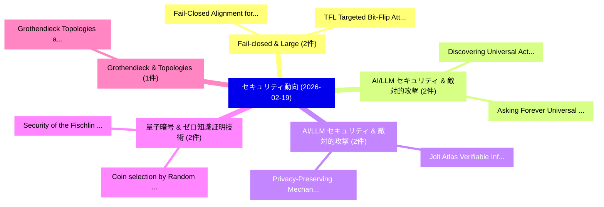

# 📅 02_daily: 日次エグゼクティブサマリー報告書 (2026-02-19)

**集計日時**: 2026-10-02 23:05:58 UTC  
**対象日付**: 2026-02-19  
**本日収集論文数**: 21 件  

---

## 💡 主要セキュリティ動向・脅威インサイト (Executive Insights)

本日の収集論文（計 21 件）において、以下の重点セキュリティ領域で活発な研究動向が確認されました：
- **Fail-closed & Large** (2 件): 注目論文として 「Fail-Closed Alignment for 大規模言...」、「TFL: Targeted Bit-Flip Attack ...」 等が発表され、実務防御および攻撃検証の進展が見られます。
- **AI/LLM セキュリティ & 敵対的攻撃** (2 件): 注目論文として 「Discovering Universal Activati...」、「Asking Forever: Universal Acti...」 等が発表され、実務防御および攻撃検証の進展が見られます。
- **AI/LLM セキュリティ & 敵対的攻撃** (2 件): 注目論文として 「Privacy-Preserving Mechanisms ...」、「Jolt Atlas: Verifiable Inferen...」 等が発表され、実務防御および攻撃検証の進展が見られます。
- **量子暗号 & ゼロ知識証明技術** (2 件): 注目論文として 「Security of the Fischlin Trans...」、「Coin selection by Random Draw ...」 等が発表され、実務防御および攻撃検証の進展が見られます。
- **Grothendieck & Topologies** (1 件): 注目論文として 「Grothendieck Topologies and Sh...」 等が発表され、実務防御および攻撃検証の進展が見られます。

### 🗺️ 技術・脅威トピックマインドマップ

---

## 📌 日次セキュリティ論文一覧 (日本語表形式)

| No | arXiv ID | 論文タイトル (日本語訳) | 重要キーワード | 構造化エグゼクティブ要約 (背景・提案・影響) | 脅威分類 | 詳細リンク |
|---|---|---|---|---|---|---|
| 1 | `2602.16977v1` | [Fail-Closed Alignment for 大規模言語モデル](../../okf/papers/2026-02-19/2602.16977.md) | `Closed Alignment`, `Fail-Closed Alignment`, `Large Language Models` | 【提案】概要 (Overview & Key Finding) 本論文「Fail-Closed Alignment for 大規模言語モデル」（原題: Fail-Closed Ali...。実証評価により経営層・セキュリティ管理者向け推奨アクション (E... | `executive-summary` | [arXiv](https://arxiv.org/abs/2602.16977v1) &#124; [OKF](../../okf/papers/2026-02-19/2602.16977.md) |
| 2 | `2602.16980v1` | [Discovering Universal Activation Directions for PII Leakage in Language Models（セキュリティ分析論文）](../../okf/papers/2026-02-19/2602.16980.md) | `Discovering Universal Activation Directions`, `Language Models`, `Leo Marchyok` | 【提案】概要 (Overview & Key Finding) 本論文「Discovering Universal Activation Directions for PII Lea...。実証評価により経営層・セキュリティ管理者向け推奨アクション (E... | `executive-summary` | [arXiv](https://arxiv.org/abs/2602.16980v1) &#124; [OKF](../../okf/papers/2026-02-19/2602.16980.md) |
| 3 | `2602.17223v1` | [Privacy-Preserving Mechanisms Enable Cheap Verifiable Inference of LLMs（セキュリティ分析論文）](../../okf/papers/2026-02-19/2602.17223.md) | `Preserving Mechanisms Enable Cheap Verifiable Inference`, `Privacy-Preserving Mechanisms`, `Arka Pal` | 【提案】概要 (Overview & Key Finding) 本論文「Privacy-Preserving Mechanisms Enable Cheap Verifiable I...。実証評価により経営層・セキュリティ管理者向け推奨アクション (E... | `executive-summary` | [arXiv](https://arxiv.org/abs/2602.17223v1) &#124; [OKF](../../okf/papers/2026-02-19/2602.17223.md) |
| 4 | `2602.17301v1` | [Grothendieck Topologies and Sheaf-Theoretic Foundations of Cryptographic Security: Attacker Models and $Σ$-Protocols as the First Step（セキュリティ分析論文）](../../okf/papers/2026-02-19/2602.17301.md) | `Grothendieck Topologies`, `Theoretic Foundations`, `Cryptographic Security` | 【提案】概要 (Overview & Key Finding) 本論文「Grothendieck Topologies and Sheaf-Theoretic Foundations...。実証評価により経営層・セキュリティ管理者向け推奨アクション (E... | `cs.LO` | [arXiv](https://arxiv.org/abs/2602.17301v1) &#124; [OKF](../../okf/papers/2026-02-19/2602.17301.md) |
| 5 | `2602.17307v2` | [Security of the Fischlin Transform in Quantum Random Oracle Model（セキュリティ分析論文）](../../okf/papers/2026-02-19/2602.17307.md) | `Quantum Random Oracle Model`, `Fischlin Transform`, `Christian Majenz` | 【提案】概要 (Overview & Key Finding) 本論文「Security of the Fischlin Transform in 量子 Random Oracle ...。実証評価により経営層・セキュリティ管理者向け推奨アクション (E... | `cybersecurity` | [arXiv](https://arxiv.org/abs/2602.17307v2) &#124; [OKF](../../okf/papers/2026-02-19/2602.17307.md) |
| 6 | `2602.17345v1` | [What Breaks Embodied AI Security:LLM Vulnerabilities, CPS Flaws,or Something Else?（セキュリティ分析論文）](../../okf/papers/2026-02-19/2602.17345.md) | `Something Else`, `Boyang Ma`, `Hechuan Guo` | 【提案】### (日本語題名: What Breaks Embodied AI Security:LLM Vulnerabilities, CPS Flaws,or Somethin...。実証評価により経営層・セキュリティ管理者向け推奨アクション (E... | `cs.AI` | [arXiv](https://arxiv.org/abs/2602.17345v1) &#124; [OKF](../../okf/papers/2026-02-19/2602.17345.md) |
| 7 | `2602.17413v1` | [DAVE: A Policy-Enforcing LLM Spokesperson for Secure Multi-Document Data Sharing（セキュリティ分析論文）](../../okf/papers/2026-02-19/2602.17413.md) | `Document Data Sharing`, `Secure Multi`, `Policy-Enforcing LLM` | 【提案】概要 (Overview & Key Finding) 本論文「DAVE: A Policy-Enforcing LLM Spokesperson for Secure Mu...。実証評価により経営層・セキュリティ管理者向け推奨アクション (E... | `executive-summary` | [arXiv](https://arxiv.org/abs/2602.17413v1) &#124; [OKF](../../okf/papers/2026-02-19/2602.17413.md) |
| 8 | `2602.17452v1` | [Jolt Atlas: Verifiable Inference via Lookup Arguments in Zero Knowledge（セキュリティ分析論文）](../../okf/papers/2026-02-19/2602.17452.md) | `Jolt Atlas`, `Verifiable Inference`, `Lookup Arguments` | 【提案】概要 (Overview & Key Finding) 本論文「Jolt Atlas: Verifiable Inference via Lookup Arguments i...。実証評価により経営層・セキュリティ管理者向け推奨アクション (E... | `cs.AI` | [arXiv](https://arxiv.org/abs/2602.17452v1) &#124; [OKF](../../okf/papers/2026-02-19/2602.17452.md) |
| 9 | `2602.17454v1` | [Privacy in Theory, Bugs in Practice: Grey-Box Auditing of Differential Privacy Libraries（セキュリティ分析論文）](../../okf/papers/2026-02-19/2602.17454.md) | `Differential Privacy Libraries`, `Box Auditing`, `Grey-Box Auditing` | 【提案】概要 (Overview & Key Finding) 本論文「Privacy in Theory, Bugs in Practice: Grey-Box Auditing ...。実証評価により経営層・セキュリティ管理者向け推奨アクション (E... | `cybersecurity` | [arXiv](https://arxiv.org/abs/2602.17454v1) &#124; [OKF](../../okf/papers/2026-02-19/2602.17454.md) |
| 10 | `2602.17458v3` | [The CTI Echo Chamber: Fragmentation, Overlap, and Vendor Specificity in Twenty Years of Cyber Threat Reporting（セキュリティ分析論文）](../../okf/papers/2026-02-19/2602.17458.md) | `Cyber Threat Reporting`, `Echo Chamber`, `Vendor Specificity` | 【提案】概要 (Overview & Key Finding) 本論文「The CTI Echo Chamber: Fragmentation, Overlap, and Vendo...。実証評価により経営層・セキュリティ管理者向け推奨アクション (E... | `AI/ML Security` | [arXiv](https://arxiv.org/abs/2602.17458v3) &#124; [OKF](../../okf/papers/2026-02-19/2602.17458.md) |
| 11 | `2602.17488v1` | [Computational Hardness of Private Coreset（セキュリティ分析論文）](../../okf/papers/2026-02-19/2602.17488.md) | `Computational Hardness`, `Private Coreset`, `Badih Ghazi` | 【提案】概要 (Overview & Key Finding) 本論文「Computational Hardness of Private Coreset（セキュリティ分析論文）」（...。実証評価により経営層・セキュリティ管理者向け推奨アクション (E... | `executive-summary` | [arXiv](https://arxiv.org/abs/2602.17488v1) &#124; [OKF](../../okf/papers/2026-02-19/2602.17488.md) |
| 12 | `2602.17490v1` | [Coin selection by Random Draw according to the Boltzmann distribution（セキュリティ分析論文）](../../okf/papers/2026-02-19/2602.17490.md) | `Random Draw`, `Jan Lennart`, `Michael Maurer` | 【提案】概要 (Overview & Key Finding) 本論文「Coin selection by Random Draw according to the Boltzman...。実証評価により経営層・セキュリティ管理者向け推奨アクション (E... | `cybersecurity` | [arXiv](https://arxiv.org/abs/2602.17490v1) &#124; [OKF](../../okf/papers/2026-02-19/2602.17490.md) |
| 13 | `2602.17590v1` | [BMC4TimeSec: Verification Of Timed Security Protocols（セキュリティ分析論文）](../../okf/papers/2026-02-19/2602.17590.md) | `Raw Meta`, `Executive Summary`, `Key Finding` | 【提案】概要 (Overview & Key Finding) 本論文「BMC4TimeSec: Verification Of Timed Security Protocols（セ...。実証評価によりZbrzezny - **公開日時**: `202... | `executive-summary` | [arXiv](https://arxiv.org/abs/2602.17590v1) &#124; [OKF](../../okf/papers/2026-02-19/2602.17590.md) |
| 14 | `2602.17622v1` | [What Makes a Good LLM Agent for Real-world Penetration Testing?（セキュリティ分析論文）](../../okf/papers/2026-02-19/2602.17622.md) | `Penetration Testing`, `Real-world Penetration`, `Gelei Deng` | 【提案】### (日本語題名: What Makes a Good LLM Agent for Real-world Penetration Testing?（セキュリティ分析論文）...。実証評価により経営層・セキュリティ管理者向け推奨アクション (E... | `executive-summary` | [arXiv](https://arxiv.org/abs/2602.17622v1) &#124; [OKF](../../okf/papers/2026-02-19/2602.17622.md) |
| 15 | `2602.17651v1` | [Non-Trivial Zero-Knowledge Implies One-Way Functions（セキュリティ分析論文）](../../okf/papers/2026-02-19/2602.17651.md) | `Knowledge Implies One`, `Trivial Zero`, `Way Functions` | 【提案】概要 (Overview & Key Finding) 本論文「Non-Trivial Zero-Knowledge Implies One-Way Functions（セキ...。実証評価により経営層・セキュリティ管理者向け推奨アクション (E... | `cybersecurity` | [arXiv](https://arxiv.org/abs/2602.17651v1) &#124; [OKF](../../okf/papers/2026-02-19/2602.17651.md) |
| 16 | `2602.17778v1` | [Asking Forever: Universal Activations Behind Turn Amplification in Conversational LLMs（セキュリティ分析論文）](../../okf/papers/2026-02-19/2602.17778.md) | `Universal Activations Behind Turn Amplification`, `Asking Forever`, `Zachary Coalson` | 【提案】概要 (Overview & Key Finding) 本論文「Asking Forever: Universal Activations Behind Turn Ampli...。実証評価により経営層・セキュリティ管理者向け推奨アクション (E... | `executive-summary` | [arXiv](https://arxiv.org/abs/2602.17778v1) &#124; [OKF](../../okf/papers/2026-02-19/2602.17778.md) |
| 17 | `2602.17805v1` | [Exploiting Liquidity Exhaustion Attacks in Intent-Based Cross-Chain Bridges（セキュリティ分析論文）](../../okf/papers/2026-02-19/2602.17805.md) | `Exploiting Liquidity Exhaustion Attacks`, `Based Cross`, `Chain Bridges` | 【提案】概要 (Overview & Key Finding) 本論文「Exploiting Liquidity Exhaustion Attacks in Intent-Based...。実証評価により経営層・セキュリティ管理者向け推奨アクション (E... | `cybersecurity` | [arXiv](https://arxiv.org/abs/2602.17805v1) &#124; [OKF](../../okf/papers/2026-02-19/2602.17805.md) |
| 18 | `2602.17837v1` | [TFL: Targeted Bit-Flip Attack on Large Language Model（セキュリティ分析論文）](../../okf/papers/2026-02-19/2602.17837.md) | `Large Language Model`, `Targeted Bit`, `Flip Attack` | 【提案】概要 (Overview & Key Finding) 本論文「TFL: Targeted Bit-Flip Attack on Large Language Model（セ...。実証評価により経営層・セキュリティ管理者向け推奨アクション (E... | `executive-summary` | [arXiv](https://arxiv.org/abs/2602.17837v1) &#124; [OKF](../../okf/papers/2026-02-19/2602.17837.md) |
| 19 | `2602.17842v2` | [StableAML: Machine Learning for Behavioral Wallet Detection in Stablecoin Anti-Money Laundering on Ethereum（セキュリティ分析論文）](../../okf/papers/2026-02-19/2602.17842.md) | `Behavioral Wallet Detection`, `Machine Learning`, `Stablecoin Anti` | 【提案】概要 (Overview & Key Finding) 本論文「StableAML: Machine Learning for Behavioral Wallet Detec...。実証評価により経営層・セキュリティ管理者向け推奨アクション (E... | `cs.CE` | [arXiv](https://arxiv.org/abs/2602.17842v2) &#124; [OKF](../../okf/papers/2026-02-19/2602.17842.md) |
| 20 | `2602.17900v1` | [Symfrog-512: High-Capacity Sponge-Based AEAD Cipher (1024-bit State)（セキュリティ分析論文）](../../okf/papers/2026-02-19/2602.17900.md) | `Capacity Sponge`, `High-Capacity Sponge`, `1024-bit State` | 【提案】概要 (Overview & Key Finding) 本論文「Symfrog-512: High-Capacity Sponge-Based AEAD Cipher (10...。実証評価により経営層・セキュリティ管理者向け推奨アクション (E... | `cybersecurity` | [arXiv](https://arxiv.org/abs/2602.17900v1) &#124; [OKF](../../okf/papers/2026-02-19/2602.17900.md) |
| 21 | `2602.18514v1` | [Trojan Horses in Recruiting: A Red-Teaming Case Study on Indirect Prompt Injection in Standard vs. Reasoning Models（セキュリティ分析論文）](../../okf/papers/2026-02-19/2602.18514.md) | `Indirect Prompt Injection`, `Trojan Horses`, `Red-Teaming Case` | 【提案】概要 (Overview & Key Finding) 本論文「Trojan Horses in Recruiting: A Red-Teaming Case Study o...。実証評価により経営層・セキュリティ管理者向け推奨アクション (E... | `cs.AI` | [arXiv](https://arxiv.org/abs/2602.18514v1) &#124; [OKF](../../okf/papers/2026-02-19/2602.18514.md) |

