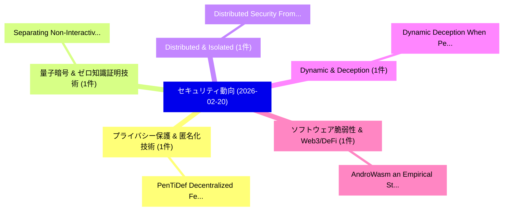

# 📅 02_daily: 日次エグゼクティブサマリー報告書 (2026-02-20)

**集計日時**: 2026-10-02 23:05:58 UTC  
**対象日付**: 2026-02-20  
**本日収集論文数**: 15 件  

---

## 💡 主要セキュリティ動向・脅威インサイト (Executive Insights)

本日の収集論文（計 15 件）において、以下の重点セキュリティ領域で活発な研究動向が確認されました：
- **プライバシー保護 & 匿名化技術** (1 件): 注目論文として 「PenTiDef: Decentralized Federa...」 等が発表され、実務防御および攻撃検証の進展が見られます。
- **量子暗号 & ゼロ知識証明技術** (1 件): 注目論文として 「Separating Non-Interactive Cla...」 等が発表され、実務防御および攻撃検証の進展が見られます。
- **Distributed & Isolated** (1 件): 注目論文として 「Distributed Security: From Iso...」 等が発表され、実務防御および攻撃検証の進展が見られます。
- **Dynamic & Deception** (1 件): 注目論文として 「Dynamic Deception: When Pedest...」 等が発表され、実務防御および攻撃検証の進展が見られます。
- **ソフトウェア脆弱性 & Web3/DeFi** (1 件): 注目論文として 「AndroWasm: an Empirical Study ...」 等が発表され、実務防御および攻撃検証の進展が見られます。

### 🗺️ 技術・脅威トピックマインドマップ

---

## 📌 日次セキュリティ論文一覧 (日本語表形式)

| No | arXiv ID | 論文タイトル (日本語訳) | 重要キーワード | 構造化エグゼクティブ要約 (背景・提案・影響) | 脅威分類 | 詳細リンク |
|---|---|---|---|---|---|---|
| 1 | `2602.17973v2` | [PenTiDef: Decentralized Federated Intrusion Detection System with Differential Privacy and Latent-Space Defense via Blockchain Coordination in IIoT（セキュリティ分析論文）](../../okf/papers/2026-02-20/2602.17973.md) | `Decentralized Federated Intrusion Detection System`, `Differential Privacy`, `Space Defense` | 【提案】概要 (Overview & Key Finding) 本論文「PenTiDef: Decentralized Federated Intrusion Detection S...。実証評価により経営層・セキュリティ管理者向け推奨アクション (E... | `cs.AI` | [arXiv](https://arxiv.org/abs/2602.17973v2) &#124; [OKF](../../okf/papers/2026-02-20/2602.17973.md) |
| 2 | `2602.18034v1` | [Separating Non-Interactive Classical Verification of Quantum Computation from Falsifiable Assumptions（セキュリティ分析論文）](../../okf/papers/2026-02-20/2602.18034.md) | `Interactive Classical Verification`, `Separating Non`, `Quantum Computation` | 【提案】概要 (Overview & Key Finding) 本論文「Separating Non-Interactive Classical Verification of 量子...。実証評価により経営層・セキュリティ管理者向け推奨アクション (E... | `executive-summary` | [arXiv](https://arxiv.org/abs/2602.18034v1) &#124; [OKF](../../okf/papers/2026-02-20/2602.18034.md) |
| 3 | `2602.18063v1` | [Distributed Security: From Isolated Properties to Synergistic Trust（セキュリティ分析論文）](../../okf/papers/2026-02-20/2602.18063.md) | `Distributed Security`, `Synergistic Trust`, `Minghui Xu` | 【提案】概要 (Overview & Key Finding) 本論文「Distributed Security: From Isolated Properties to Syner...。実証評価により経営層・セキュリティ管理者向け推奨アクション (E... | `executive-summary` | [arXiv](https://arxiv.org/abs/2602.18063v1) &#124; [OKF](../../okf/papers/2026-02-20/2602.18063.md) |
| 4 | `2602.18079v1` | [Dynamic Deception: When Pedestrians Team Up to Fool Autonomous Cars（セキュリティ分析論文）](../../okf/papers/2026-02-20/2602.18079.md) | `Fool Autonomous Cars`, `Dynamic Deception`, `Masoud Jamshidiyan Tehrani` | 【提案】概要 (Overview & Key Finding) 本論文「Dynamic Deception: When Pedestrians Team Up to Fool Aut...。実証評価により経営層・セキュリティ管理者向け推奨アクション (E... | `executive-summary` | [arXiv](https://arxiv.org/abs/2602.18079v1) &#124; [OKF](../../okf/papers/2026-02-20/2602.18079.md) |
| 5 | `2602.18082v1` | [AndroWasm: an Empirical Study on Android Malware Obfuscation through WebAssembly（セキュリティ分析論文）](../../okf/papers/2026-02-20/2602.18082.md) | `Android Malware Obfuscation`, `Silvia Lucia Sanna`, `Diego Soi` | 【提案】概要 (Overview & Key Finding) 本論文「AndroWasm: an Empirical Study on Android マルウェア Obfuscat...。実証評価により経営層・セキュリティ管理者向け推奨アクション (E... | `cybersecurity` | [arXiv](https://arxiv.org/abs/2602.18082v1) &#124; [OKF](../../okf/papers/2026-02-20/2602.18082.md) |
| 6 | `2602.18165v1` | [Uncertainty-Aware Jamming Mitigation with Active RIS: A Robust Stackelberg Game Approach（セキュリティ分析論文）](../../okf/papers/2026-02-20/2602.18165.md) | `Aware Jamming Mitigation`, `Uncertainty-Aware Jamming`, `Xiao Tang` | 【提案】概要 (Overview & Key Finding) 本論文「Uncertainty-Aware Jamming Mitigation with Active RIS: A...。実証評価により# Uncertainty-Aware Jammi... | `executive-summary` | [arXiv](https://arxiv.org/abs/2602.18165v1) &#124; [OKF](../../okf/papers/2026-02-20/2602.18165.md) |
| 7 | `2602.18172v1` | [Can AI Lower the Barrier to サイバーセキュリティ? A Human-Centered Mixed-Methods Study of Novice CTF Learning](../../okf/papers/2026-02-20/2602.18172.md) | `Centered Mixed`, `Human-Centered Mixed`, `Cathrin Schachner` | 【提案】A Human-Centered Mixed-Methods Study of Novice CTF Learning ### (日本語題名: Can AI Lower th...。実証評価により経営層・セキュリティ管理者向け推奨アクション (E... | `cs.AI` | [arXiv](https://arxiv.org/abs/2602.18172v1) &#124; [OKF](../../okf/papers/2026-02-20/2602.18172.md) |
| 8 | `2602.18270v1` | [Many Tools, Few Exploitable Vulnerabilities: A Survey of 246 Static Code Analyzers for Security（セキュリティ分析論文）](../../okf/papers/2026-02-20/2602.18270.md) | `Static Code Analyzers`, `Many Tools`, `Kevin Hermann` | 【提案】概要 (Overview & Key Finding) 本論文「Many Tools, Few Exploitable Vulnerabilities: A Survey o...。実証評価により経営層・セキュリティ管理者向け推奨アクション (E... | `executive-summary` | [arXiv](https://arxiv.org/abs/2602.18270v1) &#124; [OKF](../../okf/papers/2026-02-20/2602.18270.md) |
| 9 | `2602.18285v3` | [Detecting Fileless Cryptojacking in PowerShell Using AST-Enhanced CodeBERT Models（セキュリティ分析論文）](../../okf/papers/2026-02-20/2602.18285.md) | `Detecting Fileless Cryptojacking`, `AST-Enhanced CodeBERT`, `Said Varlioglu` | 【提案】概要 (Overview & Key Finding) 本論文「Detecting Fileless Cryptojacking in PowerShell Using AS...。実証評価により経営層・セキュリティ管理者向け推奨アクション (E... | `cybersecurity` | [arXiv](https://arxiv.org/abs/2602.18285v3) &#124; [OKF](../../okf/papers/2026-02-20/2602.18285.md) |
| 10 | `2602.18304v1` | [FeatureBleed: Inferring Private Enriched Attributes From Sparsity-Optimized AI Accelerators（セキュリティ分析論文）](../../okf/papers/2026-02-20/2602.18304.md) | `Sparsity-Optimized AI`, `Samira Mirbagher Ajorpaz`, `Darsh Asher` | 【提案】概要 (Overview & Key Finding) 本論文「FeatureBleed: Inferring Private Enriched Attributes Fro...。実証評価により経営層・セキュリティ管理者向け推奨アクション (E... | `cybersecurity` | [arXiv](https://arxiv.org/abs/2602.18304v1) &#124; [OKF](../../okf/papers/2026-02-20/2602.18304.md) |
| 11 | `2602.18352v1` | [Qualitative Coding Analysis through Open-Source 大規模言語モデル: A User Study and Design Recommendations](../../okf/papers/2026-02-20/2602.18352.md) | `Design Recommendations`, `Source Large Language Models`, `Open-Source Large` | 【提案】概要 (Overview & Key Finding) 本論文「Qualitative Coding Analysis through Open-Source 大規模言語モデ...。実証評価により経営層・セキュリティ管理者向け推奨アクション (E... | `executive-summary` | [arXiv](https://arxiv.org/abs/2602.18352v1) &#124; [OKF](../../okf/papers/2026-02-20/2602.18352.md) |
| 12 | `2602.18370v1` | [Drawing the LINE: Cryptographic Analysis and Security Improvements for the LINE E2EE Protocol（セキュリティ分析論文）](../../okf/papers/2026-02-20/2602.18370.md) | `Security Improvements`, `Benjamin Dowling`, `Prosanta Gope` | 【提案】概要 (Overview & Key Finding) 本論文「Drawing the LINE: Cryptographic Analysis and Security I...。実証評価により経営層・セキュリティ管理者向け推奨アクション (E... | `cybersecurity` | [arXiv](https://arxiv.org/abs/2602.18370v1) &#124; [OKF](../../okf/papers/2026-02-20/2602.18370.md) |
| 13 | `2602.18539v1` | [Poster: Privacy-Preserving Compliance Checks on Ethereum via Selective Disclosure（セキュリティ分析論文）](../../okf/papers/2026-02-20/2602.18539.md) | `Preserving Compliance Checks`, `Selective Disclosure`, `Privacy-Preserving Compliance` | 【提案】概要 (Overview & Key Finding) 本論文「Poster: Privacy-Preserving Compliance Checks on Ethereu...。実証評価により経営層・セキュリティ管理者向け推奨アクション (E... | `executive-summary` | [arXiv](https://arxiv.org/abs/2602.18539v1) &#124; [OKF](../../okf/papers/2026-02-20/2602.18539.md) |
| 14 | `2602.18598v1` | [Influence of Autoencoder Latent Space on Classifying IoT CoAP Attacks（セキュリティ分析論文）](../../okf/papers/2026-02-20/2602.18598.md) | `Autoencoder Latent Space`, `Jose Aveleira`, `Luis Casteleiro` | 【提案】概要 (Overview & Key Finding) 本論文「Influence of Autoencoder Latent Space on Classifying Io...。実証評価により経営層・セキュリティ管理者向け推奨アクション (E... | `cybersecurity` | [arXiv](https://arxiv.org/abs/2602.18598v1) &#124; [OKF](../../okf/papers/2026-02-20/2602.18598.md) |
| 15 | `2602.18624v1` | [Orbital Escalation: Modeling Satellite Ransomware Attacks Using Game Theory（セキュリティ分析論文）](../../okf/papers/2026-02-20/2602.18624.md) | `Modeling Satellite Ransomware Attacks Using Game Theory`, `Orbital Escalation`, `Raw Meta` | 【提案】概要 (Overview & Key Finding) 本論文「Orbital Escalation: Modeling Satellite ランサムウェア Attacks ...。実証評価により経営層・セキュリティ管理者向け推奨アクション (E... | `executive-summary` | [arXiv](https://arxiv.org/abs/2602.18624v1) &#124; [OKF](../../okf/papers/2026-02-20/2602.18624.md) |

