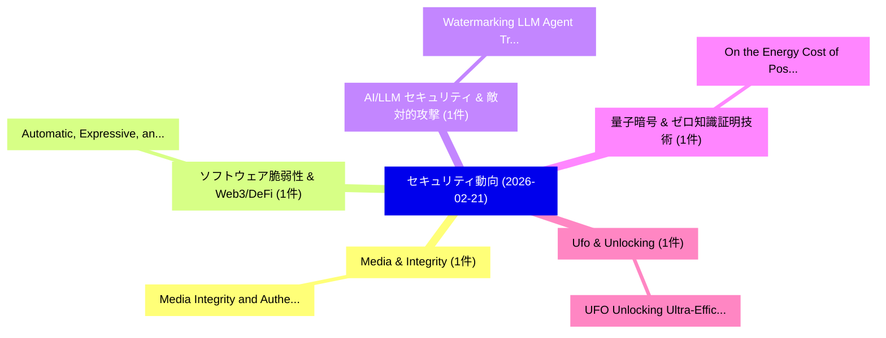

# 📅 02_daily: 日次エグゼクティブサマリー報告書 (2026-02-21)

**集計日時**: 2026-10-02 23:05:58 UTC  
**対象日付**: 2026-02-21  
**本日収集論文数**: 10 件  

---

## 💡 主要セキュリティ動向・脅威インサイト (Executive Insights)

本日の収集論文（計 10 件）において、以下の重点セキュリティ領域で活発な研究動向が確認されました：
- **Media & Integrity** (1 件): 注目論文として 「Media Integrity and Authentica...」 等が発表され、実務防御および攻撃検証の進展が見られます。
- **ソフトウェア脆弱性 & Web3/DeFi** (1 件): 注目論文として 「Automatic, Expressive, and Sca...」 等が発表され、実務防御および攻撃検証の進展が見られます。
- **AI/LLM セキュリティ & 敵対的攻撃** (1 件): 注目論文として 「Watermarking LLM Agent Traject...」 等が発表され、実務防御および攻撃検証の進展が見られます。
- **量子暗号 & ゼロ知識証明技術** (1 件): 注目論文として 「On the Energy Cost of Post-Qua...」 等が発表され、実務防御および攻撃検証の進展が見られます。
- **Ufo & Unlocking** (1 件): 注目論文として 「UFO: Unlocking Ultra-Efficient...」 等が発表され、実務防御および攻撃検証の進展が見られます。

### 🗺️ 技術・脅威トピックマインドマップ

---

## 📌 日次セキュリティ論文一覧 (日本語表形式)

| No | arXiv ID | 論文タイトル (日本語訳) | 重要キーワード | 構造化エグゼクティブ要約 (背景・提案・影響) | 脅威分類 | 詳細リンク |
|---|---|---|---|---|---|---|
| 1 | `2602.18681v1` | [Media Integrity and Authentication: Status, Directions, and Futures（セキュリティ分析論文）](../../okf/papers/2026-02-21/2602.18681.md) | `Media Integrity`, `Jessica Young`, `Sam Vaughan` | 【提案】概要 (Overview & Key Finding) 本論文「Media Integrity and Authentication: Status, Directions,...。実証評価により経営層・セキュリティ管理者向け推奨アクション (E... | `cs.ET` | [arXiv](https://arxiv.org/abs/2602.18681v1) &#124; [OKF](../../okf/papers/2026-02-21/2602.18681.md) |
| 2 | `2602.18689v1` | [Automatic, Expressive, and Scalable Fuzzing with Stitching（セキュリティ分析論文）](../../okf/papers/2026-02-21/2602.18689.md) | `Scalable Fuzzing`, `Claire Le Goues`, `Harrison Green` | 【提案】概要 (Overview & Key Finding) 本論文「Automatic, Expressive, and Scalable Fuzzing with Stitch...。実証評価により経営層・セキュリティ管理者向け推奨アクション (E... | `executive-summary` | [arXiv](https://arxiv.org/abs/2602.18689v1) &#124; [OKF](../../okf/papers/2026-02-21/2602.18689.md) |
| 3 | `2602.18700v2` | [Watermarking LLM Agent Trajectories（セキュリティ分析論文）](../../okf/papers/2026-02-21/2602.18700.md) | `Agent Trajectories`, `Terry Yue Zhuo`, `Wenlong Meng` | 【提案】概要 (Overview & Key Finding) 本論文「Watermarking LLM Agent Trajectories（セキュリティ分析論文）」（原題: Wa...。実証評価により経営層・セキュリティ管理者向け推奨アクション (E... | `executive-summary` | [arXiv](https://arxiv.org/abs/2602.18700v2) &#124; [OKF](../../okf/papers/2026-02-21/2602.18700.md) |
| 4 | `2602.18708v2` | [On the Energy Cost of Post-Quantum Key Establishment in Wireless Low-Power Personal Area Networks（セキュリティ分析論文）](../../okf/papers/2026-02-21/2602.18708.md) | `Power Personal Area Networks`, `Quantum Key Establishment`, `Energy Cost` | 【提案】概要 (Overview & Key Finding) 本論文「On the Energy Cost of Post-量子 Key Establishment in Wire...。実証評価により経営層・セキュリティ管理者向け推奨アクション (E... | `cybersecurity` | [arXiv](https://arxiv.org/abs/2602.18708v2) &#124; [OKF](../../okf/papers/2026-02-21/2602.18708.md) |
| 5 | `2602.18758v1` | [UFO: Unlocking Ultra-Efficient Quantized Private Inference with Protocol and Algorithm Co-Optimization（セキュリティ分析論文）](../../okf/papers/2026-02-21/2602.18758.md) | `Efficient Quantized Private Inference`, `Unlocking Ultra`, `Algorithm Co` | 【提案】概要 (Overview & Key Finding) 本論文「UFO: Unlocking Ultra-Efficient Quantized Private Infere...。実証評価により経営層・セキュリティ管理者向け推奨アクション (E... | `cs.AI` | [arXiv](https://arxiv.org/abs/2602.18758v1) &#124; [OKF](../../okf/papers/2026-02-21/2602.18758.md) |
| 6 | `2602.18782v1` | [MANATEE: Inference-Time Lightweight Diffusion Based Safety Defense for LLMs（セキュリティ分析論文）](../../okf/papers/2026-02-21/2602.18782.md) | `Time Lightweight Diffusion Based Safety Defense`, `Inference-Time Lightweight`, `Chun Yan Ryan Kan` | 【提案】概要 (Overview & Key Finding) 本論文「MANATEE: Inference-Time Lightweight Diffusion Based Saf...。実証評価により経営層・セキュリティ管理者向け推奨アクション (E... | `cs.AI` | [arXiv](https://arxiv.org/abs/2602.18782v1) &#124; [OKF](../../okf/papers/2026-02-21/2602.18782.md) |
| 7 | `2602.18834v1` | [When Friction Helps: Transaction Confirmation Improves Decision Quality in Blockchain Interactions（セキュリティ分析論文）](../../okf/papers/2026-02-21/2602.18834.md) | `Transaction Confirmation Improves Decision Quality`, `Blockchain Interactions`, `Eason Chen` | 【提案】概要 (Overview & Key Finding) 本論文「When Friction Helps: Transaction Confirmation Improves ...。実証評価により経営層・セキュリティ管理者向け推奨アクション (E... | `executive-summary` | [arXiv](https://arxiv.org/abs/2602.18834v1) &#124; [OKF](../../okf/papers/2026-02-21/2602.18834.md) |
| 8 | `2602.18900v2` | [PrivacyBench: Privacy Isn't Free in Hybrid Privacy-Preserving Vision Systems（セキュリティ分析論文）](../../okf/papers/2026-02-21/2602.18900.md) | `Preserving Vision Systems`, `Privacy Isn`, `Hybrid Privacy` | 【提案】概要 (Overview & Key Finding) 本論文「PrivacyBench: Privacy Isn't Free in Hybrid Privacy-Pres...。実証評価により経営層・セキュリティ管理者向け推奨アクション (E... | `cs.CV` | [arXiv](https://arxiv.org/abs/2602.18900v2) &#124; [OKF](../../okf/papers/2026-02-21/2602.18900.md) |
| 9 | `2602.18934v2` | [LoMime: Query-Efficient Membership Inference using Model Extraction in Label-Only Settings（セキュリティ分析論文）](../../okf/papers/2026-02-21/2602.18934.md) | `Efficient Membership Inference`, `Query-Efficient Membership`, `Model Extraction` | 【提案】概要 (Overview & Key Finding) 本論文「LoMime: Query-Efficient Membership Inference using Mode...。実証評価により経営層・セキュリティ管理者向け推奨アクション (E... | `executive-summary` | [arXiv](https://arxiv.org/abs/2602.18934v2) &#124; [OKF](../../okf/papers/2026-02-21/2602.18934.md) |
| 10 | `2602.20193v1` | [When Backdoors Go Beyond Triggers: Semantic Drift in Diffusion Models Under Encoder Attacks（セキュリティ分析論文）](../../okf/papers/2026-02-21/2602.20193.md) | `Semantic Drift`, `Diffusion Models Und`, `Shenyang Chen` | 【提案】概要 (Overview & Key Finding) 本論文「When Backdoors Go Beyond Triggers: Semantic Drift in Di...。実証評価により経営層・セキュリティ管理者向け推奨アクション (E... | `cs.AI` | [arXiv](https://arxiv.org/abs/2602.20193v1) &#124; [OKF](../../okf/papers/2026-02-21/2602.20193.md) |

