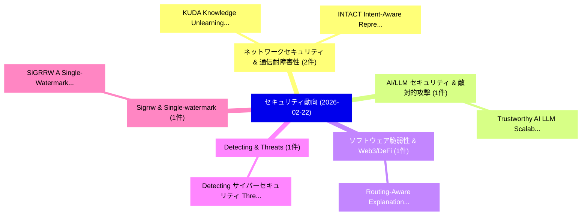

# 📅 02_daily: 日次エグゼクティブサマリー報告書 (2026-02-22)

**集計日時**: 2026-10-02 23:05:58 UTC  
**対象日付**: 2026-02-22  
**本日収集論文数**: 14 件  

---

## 💡 主要セキュリティ動向・脅威インサイト (Executive Insights)

本日の収集論文（計 14 件）において、以下の重点セキュリティ領域で活発な研究動向が確認されました：
- **ネットワークセキュリティ & 通信耐障害性** (2 件): 注目論文として 「KUDA: Knowledge Unlearning by ...」、「INTACT: Intent-Aware Represent...」 等が発表され、実務防御および攻撃検証の進展が見られます。
- **AI/LLM セキュリティ & 敵対的攻撃** (1 件): 注目論文として 「Trustworthy AI LLM Scalability...」 等が発表され、実務防御および攻撃検証の進展が見られます。
- **ソフトウェア脆弱性 & Web3/DeFi** (1 件): 注目論文として 「Routing-Aware Explanations for...」 等が発表され、実務防御および攻撃検証の進展が見られます。
- **Detecting & Threats** (1 件): 注目論文として 「Detecting サイバーセキュリティ Threats b...」 等が発表され、実務防御および攻撃検証の進展が見られます。
- **Sigrrw & Single-watermark** (1 件): 注目論文として 「SiGRRW: A Single-Watermark Rob...」 等が発表され、実務防御および攻撃検証の進展が見られます。

### 🗺️ 技術・脅威トピックマインドマップ

---

## 📌 日次セキュリティ論文一覧 (日本語表形式)

| No | arXiv ID | 論文タイトル (日本語訳) | 重要キーワード | 構造化エグゼクティブ要約 (背景・提案・影響) | 脅威分類 | 詳細リンク |
|---|---|---|---|---|---|---|
| 1 | `2602.19021v2` | [Trustworthy AI LLM Scalability Risk Index (LSRI): A サイバーセキュリティ Framework Assessing Agentic-AI Security & Software Model Supply Chain Safety Boosting AI-Generated Malware Defense & Explainability Mitigating Emerging Risks of Generative AI](../../okf/papers/2026-02-22/2602.19021.md) | `Software Model Supply Chain Safety Boosting`, `Explainability Mitigating Emerging Risks`, `Scalability Risk Index` | 【提案】概要 (Overview & Key Finding) 本論文「Trustworthy AI LLM Scalability Risk Index (LSRI): A サイバ...。実証評価により背景とセキュリティ上の課題 (Background... | `cybersecurity` | [arXiv](https://arxiv.org/abs/2602.19021v2) &#124; [OKF](../../okf/papers/2026-02-22/2602.19021.md) |
| 2 | `2602.19025v1` | [Routing-Aware Explanations for Mixture of Experts Graph Models in マルウェア検出](../../okf/papers/2026-02-22/2602.19025.md) | `Experts Graph Models`, `Aware Explanations`, `Routing-Aware Explanations` | 【提案】概要 (Overview & Key Finding) 本論文「Routing-Aware Explanations for Mixture of Experts Graph...。実証評価により経営層・セキュリティ管理者向け推奨アクション (E... | `cs.AI` | [arXiv](https://arxiv.org/abs/2602.19025v1) &#124; [OKF](../../okf/papers/2026-02-22/2602.19025.md) |
| 3 | `2602.19087v1` | [Detecting サイバーセキュリティ Threats by Integrating Explainable AI with SHAP Interpretability and Strategic Data Sampling](../../okf/papers/2026-02-22/2602.19087.md) | `Strategic Data Sampling`, `Integrating Explainable`, `Detecting Cybersecurity Threats` | 【提案】概要 (Overview & Key Finding) 本論文「Detecting サイバーセキュリティ Threats by Integrating Explainable...。実証評価により経営層・セキュリティ管理者向け推奨アクション (E... | `cs.AI` | [arXiv](https://arxiv.org/abs/2602.19087v1) &#124; [OKF](../../okf/papers/2026-02-22/2602.19087.md) |
| 4 | `2602.19097v1` | [SiGRRW: A Single-Watermark Robust Reversible Watermarking Framework with Guiding Strategy（セキュリティ分析論文）](../../okf/papers/2026-02-22/2602.19097.md) | `Single-Watermark Robust`, `Guiding Strategy`, `Watermark Robust Reversible` | 【提案】概要 (Overview & Key Finding) 本論文「SiGRRW: A Single-Watermark Robust Reversible Watermarki...。実証評価により経営層・セキュリティ管理者向け推奨アクション (E... | `cybersecurity` | [arXiv](https://arxiv.org/abs/2602.19097v1) &#124; [OKF](../../okf/papers/2026-02-22/2602.19097.md) |
| 5 | `2602.19149v3` | [ReVision : A Post-Hoc, Vision-Based Technique for Replacing Unacceptable Concepts in Image Generation Pipeline（セキュリティ分析論文）](../../okf/papers/2026-02-22/2602.19149.md) | `Replacing Unacceptable Concepts`, `Image Generation Pipeline`, `Based Technique` | 【提案】概要 (Overview & Key Finding) 本論文「ReVision : A Post-Hoc, Vision-Based Technique for Repla...。実証評価により経営層・セキュリティ管理者向け推奨アクション (E... | `cybersecurity` | [arXiv](https://arxiv.org/abs/2602.19149v3) &#124; [OKF](../../okf/papers/2026-02-22/2602.19149.md) |
| 6 | `2602.19199v2` | [Counted NFT Transfers（セキュリティ分析論文）](../../okf/papers/2026-02-22/2602.19199.md) | `Qin Wang`, `Minfeng Qi`, `Guangsheng Yu` | 【提案】概要 (Overview & Key Finding) 本論文「Counted NFT Transfers（セキュリティ分析論文）」（原題: Counted NFT Tran...。実証評価により経営層・セキュリティ管理者向け推奨アクション (E... | `cybersecurity` | [arXiv](https://arxiv.org/abs/2602.19199v2) &#124; [OKF](../../okf/papers/2026-02-22/2602.19199.md) |
| 7 | `2602.19270v1` | [Hagenberg Risk Management Process (Part 2): From Context-Sensitive Triage to Case Analysis With Bowtie and Bayesian Networks（セキュリティ分析論文）](../../okf/papers/2026-02-22/2602.19270.md) | `Hagenberg Risk Management Process`, `Sensitive Triage`, `Bayesian Networks` | 【提案】概要 (Overview & Key Finding) 本論文「Hagenberg Risk Management Process (Part 2): From Contex...。実証評価により経営層・セキュリティ管理者向け推奨アクション (E... | `cybersecurity` | [arXiv](https://arxiv.org/abs/2602.19270v1) &#124; [OKF](../../okf/papers/2026-02-22/2602.19270.md) |
| 8 | `2602.19275v2` | [KUDA: Knowledge Unlearning by Deviating Representation for 大規模言語モデル](../../okf/papers/2026-02-22/2602.19275.md) | `Knowledge Unlearning`, `Deviating Representation`, `Large Language Models` | 【提案】概要 (Overview & Key Finding) 本論文「KUDA: Knowledge Unlearning by Deviating Representation ...。実証評価により経営層・セキュリティ管理者向け推奨アクション (E... | `cybersecurity` | [arXiv](https://arxiv.org/abs/2602.19275v2) &#124; [OKF](../../okf/papers/2026-02-22/2602.19275.md) |
| 9 | `2602.19319v1` | [Health+: Empowering Individuals via Unifying Health Data（セキュリティ分析論文）](../../okf/papers/2026-02-22/2602.19319.md) | `Unifying Health Data`, `Empowering Individuals`, `Sujaya Maiyya` | 【提案】概要 (Overview & Key Finding) 本論文「Health+: Empowering Individuals via Unifying Health Dat...。実証評価により経営層・セキュリティ管理者向け推奨アクション (E... | `cs.DB` | [arXiv](https://arxiv.org/abs/2602.19319v1) &#124; [OKF](../../okf/papers/2026-02-22/2602.19319.md) |
| 10 | `2602.20196v1` | [OpenPort Protocol: A Security Governance Specification for AI Agent Tool Access（セキュリティ分析論文）](../../okf/papers/2026-02-22/2602.20196.md) | `Security Governance Specification`, `Agent Tool Access`, `Genliang Zhu` | 【提案】概要 (Overview & Key Finding) 本論文「OpenPort Protocol: A Security Governance Specification ...。実証評価により経営層・セキュリティ管理者向け推奨アクション (E... | `cs.AI` | [arXiv](https://arxiv.org/abs/2602.20196v1) &#124; [OKF](../../okf/papers/2026-02-22/2602.20196.md) |
| 11 | `2602.20202v1` | [Evaluating the Reliability of Digital Forensic Evidence Discovered by Large Language Model: A Case Study（セキュリティ分析論文）](../../okf/papers/2026-02-22/2602.20202.md) | `Digital Forensic Evidence Discovered`, `Large Language Model`, `Daniel Kwaku Ntiamoah Addai` | 【提案】概要 (Overview & Key Finding) 本論文「Evaluating the Reliability of Digital Forensic Evidence...。実証評価により経営層・セキュリティ管理者向け推奨アクション (E... | `cs.AI` | [arXiv](https://arxiv.org/abs/2602.20202v1) &#124; [OKF](../../okf/papers/2026-02-22/2602.20202.md) |
| 12 | `2602.21252v1` | [INTACT: Intent-Aware Representation Learning for Cryptographic Traffic Violation Detection（セキュリティ分析論文）](../../okf/papers/2026-02-22/2602.21252.md) | `Cryptographic Traffic Violation Detection`, `Aware Representation Learning`, `Intent-Aware Representation` | 【提案】概要 (Overview & Key Finding) 本論文「INTACT: Intent-Aware Representation Learning for Crypto...。実証評価により経営層・セキュリティ管理者向け推奨アクション (E... | `executive-summary` | [arXiv](https://arxiv.org/abs/2602.21252v1) &#124; [OKF](../../okf/papers/2026-02-22/2602.21252.md) |
| 13 | `2603.12277v6` | [Prompt Injection as Role Confusion（セキュリティ分析論文）](../../okf/papers/2026-02-22/2603.12277.md) | `Prompt Injection`, `Role Confusion`, `Charles Ye` | 【提案】概要 (Overview & Key Finding) 本論文「プロンプトインジェクション as Role Confusion（セキュリティ分析論文）」（原題: プロンプトイ...。実証評価により経営層・セキュリティ管理者向け推奨アクション (E... | `cs.AI` | [arXiv](https://arxiv.org/abs/2603.12277v6) &#124; [OKF](../../okf/papers/2026-02-22/2603.12277.md) |
| 14 | `2603.13247v1` | [ILION: Deterministic Pre-Execution Safety Gates for Agentic AI Systems（セキュリティ分析論文）](../../okf/papers/2026-02-22/2603.13247.md) | `Execution Safety Gates`, `Deterministic Pre`, `Pre-Execution Safety` | 【提案】概要 (Overview & Key Finding) 本論文「ILION: Deterministic Pre-Execution Safety Gates for Age...。実証評価により経営層・セキュリティ管理者向け推奨アクション (E... | `cs.AI` | [arXiv](https://arxiv.org/abs/2603.13247v1) &#124; [OKF](../../okf/papers/2026-02-22/2603.13247.md) |

