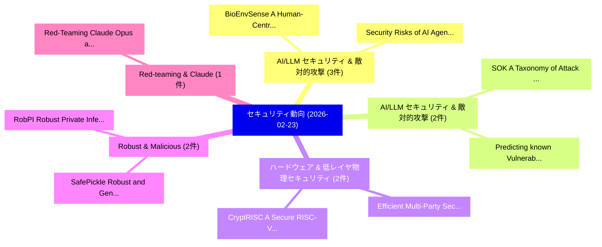

# 📅 02_daily: 日次エグゼクティブサマリー報告書 (2026-02-23)

**集計日時**: 2026-10-02 23:05:59 UTC  
**対象日付**: 2026-02-23  
**本日収集論文数**: 25 件  

---

## 💡 主要セキュリティ動向・脅威インサイト (Executive Insights)

本日の収集論文（計 25 件）において、以下の重点セキュリティ領域で活発な研究動向が確認されました：
- **AI/LLM セキュリティ & 敵対的攻撃** (3 件): 注目論文として 「BioEnvSense: A Human-Centred S...」、「Security Risks of AI Agents Hi...」 等が発表され、実務防御および攻撃検証の進展が見られます。
- **AI/LLM セキュリティ & 敵対的攻撃** (2 件): 注目論文として 「SOK: A Taxonomy of Attack Vect...」、「Predicting known Vulnerabiliti...」 等が発表され、実務防御および攻撃検証の進展が見られます。
- **ハードウェア & 低レイヤ物理セキュリティ** (2 件): 注目論文として 「Efficient Multi-Party Secure C...」、「CryptRISC: A Secure RISC-V Pro...」 等が発表され、実務防御および攻撃検証の進展が見られます。
- **Robust & Malicious** (2 件): 注目論文として 「SafePickle: Robust and Generic...」、「RobPI: Robust Private Inferenc...」 等が発表され、実務防御および攻撃検証の進展が見られます。
- **Red-teaming & Claude** (1 件): 注目論文として 「Red-Teaming Claude Opus and Ch...」 等が発表され、実務防御および攻撃検証の進展が見られます。

### 🗺️ 技術・脅威トピックマインドマップ

---

## 📌 日次セキュリティ論文一覧 (日本語表形式)

| No | arXiv ID | 論文タイトル (日本語訳) | 重要キーワード | 構造化エグゼクティブ要約 (背景・提案・影響) | 脅威分類 | 詳細リンク |
|---|---|---|---|---|---|---|
| 1 | `2602.19410v1` | [BioEnvSense: A Human-Centred Security Framework for Preventing Behaviour-Driven Cyber Incidents（セキュリティ分析論文）](../../okf/papers/2026-02-23/2602.19410.md) | `Driven Cyber Incidents`, `Preventing Behaviour`, `Human-Centred Security` | 【提案】概要 (Overview & Key Finding) 本論文「BioEnvSense: A Human-Centred Security Framework for Pre...。実証評価により経営層・セキュリティ管理者向け推奨アクション (E... | `executive-summary` | [arXiv](https://arxiv.org/abs/2602.19410v1) &#124; [OKF](../../okf/papers/2026-02-23/2602.19410.md) |
| 2 | `2602.19450v3` | [Red-Teaming Claude Opus and ChatGPT-based Security Advisors for Trusted Execution Environments（セキュリティ分析論文）](../../okf/papers/2026-02-23/2602.19450.md) | `Teaming Claude Opus`, `Trusted Execution Environments`, `Red-Teaming Claude` | 【提案】概要 (Overview & Key Finding) 本論文「Red-Teaming Claude Opus and ChatGPT-based Security Advi...。実証評価により経営層・セキュリティ管理者向け推奨アクション (E... | `cs.AI` | [arXiv](https://arxiv.org/abs/2602.19450v3) &#124; [OKF](../../okf/papers/2026-02-23/2602.19450.md) |
| 3 | `2602.19490v2` | [FuzzySQL: Uncovering Hidden Vulnerabilities in DBMS Special Features with LLM-Driven Fuzzing（セキュリティ分析論文）](../../okf/papers/2026-02-23/2602.19490.md) | `Uncovering Hidden Vulnerabilities`, `Special Features`, `Driven Fuzzing` | 【提案】概要 (Overview & Key Finding) 本論文「FuzzySQL: Uncovering Hidden Vulnerabilities in DBMS Spe...。実証評価により経営層・セキュリティ管理者向け推奨アクション (E... | `cs.DB` | [arXiv](https://arxiv.org/abs/2602.19490v2) &#124; [OKF](../../okf/papers/2026-02-23/2602.19490.md) |
| 4 | `2602.19514v1` | [Security Risks of AI Agents Hiring Humans: An Empirical Marketplace Study（セキュリティ分析論文）](../../okf/papers/2026-02-23/2602.19514.md) | `Agents Hiring Humans`, `Security Risks`, `Pulak Mehta` | 【提案】概要 (Overview & Key Finding) 本論文「Security Risks of AI Agents Hiring Humans: An Empirical...。実証評価により経営層・セキュリティ管理者向け推奨アクション (E... | `executive-summary` | [arXiv](https://arxiv.org/abs/2602.19514v1) &#124; [OKF](../../okf/papers/2026-02-23/2602.19514.md) |
| 5 | `2602.19539v1` | [Can a Teenager Fool an AI? Evaluating Low-Cost Cosmetic Attacks on Age Estimation Systems（セキュリティ分析論文）](../../okf/papers/2026-02-23/2602.19539.md) | `Cost Cosmetic Attacks`, `Age Estimation Systems`, `Teenager Fool` | 【提案】Evaluating Low-Cost Cosmetic Attacks on Age Estimation Systems ### (日本語題名: Can a Teenag...。実証評価により経営層・セキュリティ管理者向け推奨アクション (E... | `cs.CV` | [arXiv](https://arxiv.org/abs/2602.19539v1) &#124; [OKF](../../okf/papers/2026-02-23/2602.19539.md) |
| 6 | `2602.19547v1` | [CIBER: A Comprehensive Benchmark for Security Evaluation of Code Interpreter Agents（セキュリティ分析論文）](../../okf/papers/2026-02-23/2602.19547.md) | `Code Interpreter Agents`, `Comprehensive Benchmark`, `Lei Ba` | 【提案】概要 (Overview & Key Finding) 本論文「CIBER: A Comprehensive Benchmark for Security Evaluatio...。実証評価により経営層・セキュリティ管理者向け推奨アクション (E... | `cybersecurity` | [arXiv](https://arxiv.org/abs/2602.19547v1) &#124; [OKF](../../okf/papers/2026-02-23/2602.19547.md) |
| 7 | `2602.19550v1` | [Hardware-Friendly Randomization: Enabling Random-Access and Minimal Wiring in FHE Accelerators with Low Total Cost（セキュリティ分析論文）](../../okf/papers/2026-02-23/2602.19550.md) | `Low Total Cost`, `Friendly Randomization`, `Enabling Random` | 【提案】概要 (Overview & Key Finding) 本論文「Hardware-Friendly Randomization: Enabling Random-Access...。実証評価により経営層・セキュリティ管理者向け推奨アクション (E... | `executive-summary` | [arXiv](https://arxiv.org/abs/2602.19550v1) &#124; [OKF](../../okf/papers/2026-02-23/2602.19550.md) |
| 8 | `2602.19555v2` | [SOK: A Taxonomy of Attack Vectors and Defense Strategies for Agentic Supply Chain Runtime（セキュリティ分析論文）](../../okf/papers/2026-02-23/2602.19555.md) | `Agentic Supply Chain Runtime`, `Attack Vectors`, `Defense Strategies` | 【提案】概要 (Overview & Key Finding) 本論文「SOK: A Taxonomy of Attack Vectors and Defense Strategie...。実証評価により経営層・セキュリティ管理者向け推奨アクション (E... | `cs.AI` | [arXiv](https://arxiv.org/abs/2602.19555v2) &#124; [OKF](../../okf/papers/2026-02-23/2602.19555.md) |
| 9 | `2602.19604v1` | [Efficient Multi-Party Secure Comparison over Different Domains with Preprocessing Assistance（セキュリティ分析論文）](../../okf/papers/2026-02-23/2602.19604.md) | `Party Secure Comparison`, `Efficient Multi`, `Multi-Party Secure` | 【提案】概要 (Overview & Key Finding) 本論文「Efficient Multi-Party Secure Comparison over Different ...。実証評価により経営層・セキュリティ管理者向け推奨アクション (E... | `cybersecurity` | [arXiv](https://arxiv.org/abs/2602.19604v1) &#124; [OKF](../../okf/papers/2026-02-23/2602.19604.md) |
| 10 | `2602.19606v1` | [Predicting known Vulnerabilities from Attack News: A Transformer-Based Approach（セキュリティ分析論文）](../../okf/papers/2026-02-23/2602.19606.md) | `Attack News`, `Refat Othman`, `Diaeddin Rimawi` | 【提案】概要 (Overview & Key Finding) 本論文「Predicting known Vulnerabilities from Attack News: A Tr...。実証評価により経営層・セキュリティ管理者向け推奨アクション (E... | `cybersecurity` | [arXiv](https://arxiv.org/abs/2602.19606v1) &#124; [OKF](../../okf/papers/2026-02-23/2602.19606.md) |
| 11 | `2602.19777v1` | [AegisSat: AI-Enabled SoC FPGA Satellite Platformsのセキュリティ強化](../../okf/papers/2026-02-23/2602.19777.md) | `AI-Enabled SoC`, `Satellite Platforms`, `Huimin Li` | 【提案】概要 (Overview & Key Finding) 本論文「AegisSat: AI-Enabled SoC FPGA Satellite Platformsのセキュリテ...。実証評価により経営層・セキュリティ管理者向け推奨アクション (E... | `cybersecurity` | [arXiv](https://arxiv.org/abs/2602.19777v1) &#124; [OKF](../../okf/papers/2026-02-23/2602.19777.md) |
| 12 | `2602.19818v1` | [SafePickle: Robust and Generic ML Malicious Pickle-based ML Modelsの検出](../../okf/papers/2026-02-23/2602.19818.md) | `Malicious Pickle`, `Pickle-based ML`, `Hillel Ohayon` | 【提案】概要 (Overview & Key Finding) 本論文「SafePickle: Robust and Generic ML Malicious Pickle-base...。実証評価により経営層・セキュリティ管理者向け推奨アクション (E... | `cs.AI` | [arXiv](https://arxiv.org/abs/2602.19818v1) &#124; [OKF](../../okf/papers/2026-02-23/2602.19818.md) |
| 13 | `2602.19819v2` | [Quantum approaches to learning parity with noise（セキュリティ分析論文）](../../okf/papers/2026-02-23/2602.19819.md) | `Daniel Shiu`, `Raw Meta`, `Executive Summary` | 【提案】概要 (Overview & Key Finding) 本論文「量子 approaches to learning parity with noise（セキュリティ分析論文）...。実証評価により経営層・セキュリティ管理者向け推奨アクション (E... | `cybersecurity` | [arXiv](https://arxiv.org/abs/2602.19819v2) &#124; [OKF](../../okf/papers/2026-02-23/2602.19819.md) |
| 14 | `2602.19831v1` | [An Explainable Memory Forensics Approach for Malware Analysis（セキュリティ分析論文）](../../okf/papers/2026-02-23/2602.19831.md) | `Silvia Lucia Sanna`, `Davide Maiorca`, `Giorgio Giacinto` | 【提案】概要 (Overview & Key Finding) 本論文「An Explainable Memory Forensics Approach for マルウェア Anal...。実証評価により経営層・セキュリティ管理者向け推奨アクション (E... | `cybersecurity` | [arXiv](https://arxiv.org/abs/2602.19831v1) &#124; [OKF](../../okf/papers/2026-02-23/2602.19831.md) |
| 15 | `2602.19844v1` | [LLM-enabled Applications Require System-Level Threat Monitoring（セキュリティ分析論文）](../../okf/papers/2026-02-23/2602.19844.md) | `Applications Require System`, `Level Threat Monitoring`, `LLM-enabled Applications` | 【提案】概要 (Overview & Key Finding) 本論文「LLM-enabled Applications Require System-Level 脅威 Monito...。実証評価により経営層・セキュリティ管理者向け推奨アクション (E... | `cs.AI` | [arXiv](https://arxiv.org/abs/2602.19844v1) &#124; [OKF](../../okf/papers/2026-02-23/2602.19844.md) |
| 16 | `2602.19918v1` | [RobPI: Robust Private Inference against Malicious Client（セキュリティ分析論文）](../../okf/papers/2026-02-23/2602.19918.md) | `Robust Private Inference`, `Malicious Client`, `Jiaqi Xue` | 【提案】概要 (Overview & Key Finding) 本論文「RobPI: Robust Private Inference against Malicious Clien...。実証評価により経営層・セキュリティ管理者向け推奨アクション (E... | `executive-summary` | [arXiv](https://arxiv.org/abs/2602.19918v1) &#124; [OKF](../../okf/papers/2026-02-23/2602.19918.md) |
| 17 | `2602.19973v4` | [Misquoted No More: Securely Extracting F* Programs with IO（セキュリティ分析論文）](../../okf/papers/2026-02-23/2602.19973.md) | `Securely Extracting`, `Constantin Andrici`, `Abigail Pribisova` | 【提案】概要 (Overview & Key Finding) 本論文「Misquoted No More: Securely Extracting F* Programs with...。実証評価により経営層・セキュリティ管理者向け推奨アクション (E... | `cs.PL` | [arXiv](https://arxiv.org/abs/2602.19973v4) &#124; [OKF](../../okf/papers/2026-02-23/2602.19973.md) |
| 18 | `2602.20061v2` | [Can You Tell It's AI? Human Perception of Synthetic Voices in Vishing Scenarios（セキュリティ分析論文）](../../okf/papers/2026-02-23/2602.20061.md) | `Human Perception`, `Synthetic Voices`, `Vishing Scenarios` | 【提案】Human Perception of Synthetic Voices in Vishing Scenarios ### (日本語題名: Can You Tell It's...。実証評価により経営層・セキュリティ管理者向け推奨アクション (E... | `cybersecurity` | [arXiv](https://arxiv.org/abs/2602.20061v2) &#124; [OKF](../../okf/papers/2026-02-23/2602.20061.md) |
| 19 | `2602.20064v2` | [The LLMbda Calculus: AI Agents, Conversations, and Information Flow（セキュリティ分析論文）](../../okf/papers/2026-02-23/2602.20064.md) | `Information Flow`, `Zac Garby`, `David Sands` | 【提案】概要 (Overview & Key Finding) 本論文「The LLMbda Calculus: AI Agents, Conversations, and Info...。実証評価によりGordon, David Sand。 | `cs.PL` | [arXiv](https://arxiv.org/abs/2602.20064v2) &#124; [OKF](../../okf/papers/2026-02-23/2602.20064.md) |
| 20 | `2602.20156v3` | [Skill-Inject: Measuring Agent Vulnerability to Skill File Attacks（セキュリティ分析論文）](../../okf/papers/2026-02-23/2602.20156.md) | `Measuring Agent Vulnerability`, `Skill File Attacks`, `David Schmotz` | 【提案】概要 (Overview & Key Finding) 本論文「Skill-Inject: Measuring Agent 脆弱性 to Skill File Attacks...。実証評価により経営層・セキュリティ管理者向け推奨アクション (E... | `executive-summary` | [arXiv](https://arxiv.org/abs/2602.20156v3) &#124; [OKF](../../okf/papers/2026-02-23/2602.20156.md) |
| 21 | `2602.20213v2` | [CodeHacker: Automated Test Case Generation for Detecting Vulnerabilities in Competitive Programming Solutions（セキュリティ分析論文）](../../okf/papers/2026-02-23/2602.20213.md) | `Automated Test Case Generation`, `Competitive Programming Solutions`, `Detecting Vulnerabilities` | 【提案】概要 (Overview & Key Finding) 本論文「CodeHacker: Automated Test Case Generation for Detectin...。実証評価により経営層・セキュリティ管理者向け推奨アクション (E... | `cs.AI` | [arXiv](https://arxiv.org/abs/2602.20213v2) &#124; [OKF](../../okf/papers/2026-02-23/2602.20213.md) |
| 22 | `2602.20214v1` | [Right to History: A Sovereignty Kernel for Verifiable AI Agent Execution（セキュリティ分析論文）](../../okf/papers/2026-02-23/2602.20214.md) | `Sovereignty Kernel`, `Agent Execution`, `Jing Zhang` | 【提案】概要 (Overview & Key Finding) 本論文「Right to History: A Sovereignty Kernel for Verifiable A...。実証評価により経営層・セキュリティ管理者向け推奨アクション (E... | `cs.AI` | [arXiv](https://arxiv.org/abs/2602.20214v1) &#124; [OKF](../../okf/papers/2026-02-23/2602.20214.md) |
| 23 | `2602.20222v2` | [The TCF doesn't really A(A)ID -- Automatic Privacy Analysis and Legal Compliance of TCF-based Android Applications（セキュリティ分析論文）](../../okf/papers/2026-02-23/2602.20222.md) | `Legal Compliance`, `Android Applications`, `TCF-based Android` | 【提案】概要 (Overview & Key Finding) 本論文「The TCF doesn't really A(A)ID -- Automatic Privacy Anal...。実証評価により経営層・セキュリティ管理者向け推奨アクション (E... | `executive-summary` | [arXiv](https://arxiv.org/abs/2602.20222v2) &#124; [OKF](../../okf/papers/2026-02-23/2602.20222.md) |
| 24 | `2602.20285v1` | [CryptRISC: A Secure RISC-V Processor for High-Performance Cryptography with Power Side-Channel Protection（セキュリティ分析論文）](../../okf/papers/2026-02-23/2602.20285.md) | `Performance Cryptography`, `Power Side`, `RISC-V Processor` | 【提案】概要 (Overview & Key Finding) 本論文「CryptRISC: A Secure RISC-V Processor for High-Performan...。実証評価により経営層・セキュリティ管理者向け推奨アクション (E... | `cybersecurity` | [arXiv](https://arxiv.org/abs/2602.20285v1) &#124; [OKF](../../okf/papers/2026-02-23/2602.20285.md) |
| 25 | `2602.22237v1` | [Optimized Disaster Recovery for Distributed Storage Systems: Lightweight Metadata Architectures to Overcome Cryptographic Hashing Bottleneck（セキュリティ分析論文）](../../okf/papers/2026-02-23/2602.22237.md) | `Overcome Cryptographic Hashing Bottleneck`, `Optimized Disaster Recovery`, `Distributed Storage Systems` | 【提案】概要 (Overview & Key Finding) 本論文「Optimized Disaster Recovery for Distributed Storage Sys...。実証評価により経営層・セキュリティ管理者向け推奨アクション (E... | `cs.CE` | [arXiv](https://arxiv.org/abs/2602.22237v1) &#124; [OKF](../../okf/papers/2026-02-23/2602.22237.md) |

