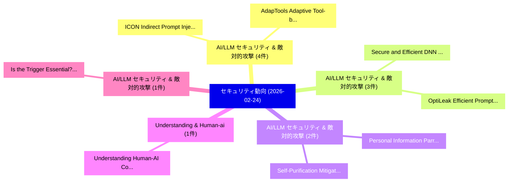

# 📅 02_daily: 日次エグゼクティブサマリー報告書 (2026-02-24)

**集計日時**: 2026-10-02 23:05:59 UTC  
**対象日付**: 2026-02-24  
**本日収集論文数**: 24 件  

---

## 💡 主要セキュリティ動向・脅威インサイト (Executive Insights)

本日の収集論文（計 24 件）において、以下の重点セキュリティ領域で活発な研究動向が確認されました：
- **AI/LLM セキュリティ & 敵対的攻撃** (4 件): 注目論文として 「ICON: Indirect Prompt Injectio...」、「AdapTools: Adaptive Tool-based...」 等が発表され、実務防御および攻撃検証の進展が見られます。
- **AI/LLM セキュリティ & 敵対的攻撃** (3 件): 注目論文として 「Secure and Efficient DNN Accel...」、「OptiLeak: Efficient Prompt Rec...」 等が発表され、実務防御および攻撃検証の進展が見られます。
- **AI/LLM セキュリティ & 敵対的攻撃** (2 件): 注目論文として 「Personal Information Parroting...」、「Self-Purification Mitigates Ba...」 等が発表され、実務防御および攻撃検証の進展が見られます。
- **Understanding & Human-ai** (1 件): 注目論文として 「Understanding Human-AI Collabo...」 等が発表され、実務防御および攻撃検証の進展が見られます。
- **AI/LLM セキュリティ & 敵対的攻撃** (1 件): 注目論文として 「Is the Trigger Essential? A Fe...」 等が発表され、実務防御および攻撃検証の進展が見られます。

### 🗺️ 技術・脅威トピックマインドマップ

---

## 📌 日次セキュリティ論文一覧 (日本語表形式)

| No | arXiv ID | 論文タイトル (日本語訳) | 重要キーワード | 構造化エグゼクティブ要約 (背景・提案・影響) | 脅威分類 | 詳細リンク |
|---|---|---|---|---|---|---|
| 1 | `2602.20446v1` | [Understanding Human-AI Collaboration in サイバーセキュリティ Competitions](../../okf/papers/2026-02-24/2602.20446.md) | `Understanding Human`, `Human-AI Collaboration`, `Cybersecurity Competitions` | 【提案】概要 (Overview & Key Finding) 本論文「Understanding Human-AI Collaboration in サイバーセキュリティ Comp...。実証評価により経営層・セキュリティ管理者向け推奨アクション (E... | `cybersecurity` | [arXiv](https://arxiv.org/abs/2602.20446v1) &#124; [OKF](../../okf/papers/2026-02-24/2602.20446.md) |
| 2 | `2602.20521v1` | [Secure and Efficient DNN Accelerators via Hardware-Software Co-Designに向けて](../../okf/papers/2026-02-24/2602.20521.md) | `Software Co`, `Hardware-Software Co`, `Towards Secure` | 【提案】概要 (Overview & Key Finding) 本論文「Secure and Efficient DNN Accelerators via Hardware-Soft...。実証評価により経営層・セキュリティ管理者向け推奨アクション (E... | `cybersecurity` | [arXiv](https://arxiv.org/abs/2602.20521v1) &#124; [OKF](../../okf/papers/2026-02-24/2602.20521.md) |
| 3 | `2602.20580v1` | [Personal Information Parroting in Language Models（セキュリティ分析論文）](../../okf/papers/2026-02-24/2602.20580.md) | `Personal Information Parroting`, `Language Models`, `Nishant Subramani` | 【提案】概要 (Overview & Key Finding) 本論文「Personal Information Parroting in Language Models（セキュリテ...。実証評価により経営層・セキュリティ管理者向け推奨アクション (E... | `cs.AI` | [arXiv](https://arxiv.org/abs/2602.20580v1) &#124; [OKF](../../okf/papers/2026-02-24/2602.20580.md) |
| 4 | `2602.20593v1` | [Is the Trigger Essential? A Feature-Based Triggerless Backdoor Attack in Vertical 連合学習](../../okf/papers/2026-02-24/2602.20593.md) | `Based Triggerless Backdoor Attack`, `Trigger Essential`, `Feature-Based Triggerless` | 【提案】A Feature-Based Triggerless Backdoor Attack in Vertical Federated Learning ### (日本語題名: ...。実証評価により経営層・セキュリティ管理者向け推奨アクション (E... | `executive-summary` | [arXiv](https://arxiv.org/abs/2602.20593v1) &#124; [OKF](../../okf/papers/2026-02-24/2602.20593.md) |
| 5 | `2602.20595v1` | [OptiLeak: Efficient Prompt Reconstruction via Reinforcement Learning in Multi-tenant LLM Services（セキュリティ分析論文）](../../okf/papers/2026-02-24/2602.20595.md) | `Efficient Prompt Reconstruction`, `Reinforcement Learning`, `Multi-tenant LLM` | 【提案】概要 (Overview & Key Finding) 本論文「OptiLeak: Efficient Prompt Reconstruction via Reinforce...。実証評価により経営層・セキュリティ管理者向け推奨アクション (E... | `cs.AI` | [arXiv](https://arxiv.org/abs/2602.20595v1) &#124; [OKF](../../okf/papers/2026-02-24/2602.20595.md) |
| 6 | `2602.20657v1` | [Post-Quantum Sanitizable Signatures from McEliece-Based Chameleon Hashing（セキュリティ分析論文）](../../okf/papers/2026-02-24/2602.20657.md) | `Quantum Sanitizable Signatures`, `Based Chameleon Hashing`, `Post-Quantum Sanitizable` | 【提案】概要 (Overview & Key Finding) 本論文「Post-量子 Sanitizable Signatures from McEliece-Based Cham...。実証評価により経営層・セキュリティ管理者向け推奨アクション (E... | `cybersecurity` | [arXiv](https://arxiv.org/abs/2602.20657v1) &#124; [OKF](../../okf/papers/2026-02-24/2602.20657.md) |
| 7 | `2602.20663v1` | [ICSSPulse: A Modular LLM-Assisted Platform for Industrial Control System Penetration Testing（セキュリティ分析論文）](../../okf/papers/2026-02-24/2602.20663.md) | `Industrial Control System Penetration Testing`, `Assisted Platform`, `LLM-Assisted Platform` | 【提案】概要 (Overview & Key Finding) 本論文「ICSSPulse: A Modular LLM-Assisted Platform for Industri...。実証評価により経営層・セキュリティ管理者向け推奨アクション (E... | `cybersecurity` | [arXiv](https://arxiv.org/abs/2602.20663v1) &#124; [OKF](../../okf/papers/2026-02-24/2602.20663.md) |
| 8 | `2602.20680v1` | [Vanishing Watermarks: Diffusion-Based Image Editing Undermines Robust Invisible Watermarking（セキュリティ分析論文）](../../okf/papers/2026-02-24/2602.20680.md) | `Based Image Editing Undermines Robust Invisible Watermarking`, `Vanishing Watermarks`, `Diffusion-Based Image` | 【提案】概要 (Overview & Key Finding) 本論文「Vanishing Watermarks: Diffusion-Based Image Editing Und...。実証評価により経営層・セキュリティ管理者向け推奨アクション (E... | `cybersecurity` | [arXiv](https://arxiv.org/abs/2602.20680v1) &#124; [OKF](../../okf/papers/2026-02-24/2602.20680.md) |
| 9 | `2602.20708v1` | [ICON: Indirect Prompt Injection Defense for Agents based on Inference-Time Correction（セキュリティ分析論文）](../../okf/papers/2026-02-24/2602.20708.md) | `Indirect Prompt Injection Defense`, `Time Correction`, `Inference-Time Correction` | 【提案】概要 (Overview & Key Finding) 本論文「ICON: Indirect プロンプトインジェクション Defense for Agents based o...。実証評価により経営層・セキュリティ管理者向け推奨アクション (E... | `cs.AI` | [arXiv](https://arxiv.org/abs/2602.20708v1) &#124; [OKF](../../okf/papers/2026-02-24/2602.20708.md) |
| 10 | `2602.20717v1` | [PackMonitor: Enabling Zero Package Hallucinations Through Decoding-Time Monitoring（セキュリティ分析論文）](../../okf/papers/2026-02-24/2602.20717.md) | `Time Monitoring`, `Decoding-Time Monitoring`, `Xiting Liu` | 【提案】概要 (Overview & Key Finding) 本論文「PackMonitor: Enabling Zero Package Hallucinations Throu...。実証評価により経営層・セキュリティ管理者向け推奨アクション (E... | `executive-summary` | [arXiv](https://arxiv.org/abs/2602.20717v1) &#124; [OKF](../../okf/papers/2026-02-24/2602.20717.md) |
| 11 | `2602.20720v1` | [AdapTools: Adaptive Tool-based Indirect Prompt Injection Attacks on Agentic LLMs（セキュリティ分析論文）](../../okf/papers/2026-02-24/2602.20720.md) | `Indirect Prompt Injection Attacks`, `Adaptive Tool`, `Tool-based Indirect` | 【提案】概要 (Overview & Key Finding) 本論文「AdapTools: Adaptive Tool-based Indirect プロンプトインジェクション A...。実証評価により経営層・セキュリティ管理者向け推奨アクション (E... | `cs.AI` | [arXiv](https://arxiv.org/abs/2602.20720v1) &#124; [OKF](../../okf/papers/2026-02-24/2602.20720.md) |
| 12 | `2602.20830v1` | [A Secure and Interoperable Architecture for Electronic Health Record Access Control and Sharing（セキュリティ分析論文）](../../okf/papers/2026-02-24/2602.20830.md) | `Electronic Health Record Access Control`, `Interoperable Architecture`, `Tayeb Kenaza` | 【提案】概要 (Overview & Key Finding) 本論文「A Secure and Interoperable Architecture for Electronic ...。実証評価により経営層・セキュリティ管理者向け推奨アクション (E... | `cybersecurity` | [arXiv](https://arxiv.org/abs/2602.20830v1) &#124; [OKF](../../okf/papers/2026-02-24/2602.20830.md) |
| 13 | `2602.20867v1` | [SoK: Agentic Skills -- Beyond Tool Use in LLMエージェント](../../okf/papers/2026-02-24/2602.20867.md) | `Beyond Tool Use`, `Agentic Skills`, `Yanna Jiang` | 【提案】概要 (Overview & Key Finding) 本論文「SoK: Agentic Skills -- Beyond Tool Use in LLMエージェント」（原題...。実証評価により経営層・セキュリティ管理者向け推奨アクション (E... | `cs.CE` | [arXiv](https://arxiv.org/abs/2602.20867v1) &#124; [OKF](../../okf/papers/2026-02-24/2602.20867.md) |
| 14 | `2602.21127v1` | ["Are You Sure?": Human Perception Vulnerability in LLM-Driven Agentic Systemsの実証研究](../../okf/papers/2026-02-24/2602.21127.md) | `Human Perception Vulnerability`, `LLM-Driven Agentic`, `Driven Agentic` | 【提案】概要 (Overview & Key Finding) 本論文「"Are You Sure?": Human Perception 脆弱性 in LLM-Driven Age...。実証評価により経営層・セキュリティ管理者向け推奨アクション (E... | `cs.AI` | [arXiv](https://arxiv.org/abs/2602.21127v1) &#124; [OKF](../../okf/papers/2026-02-24/2602.21127.md) |
| 15 | `2602.21267v1` | [A Systematic Review of Algorithmic Red Teaming Methodologies for Assurance and Security of AI Applications（セキュリティ分析論文）](../../okf/papers/2026-02-24/2602.21267.md) | `Algorithmic Red Teaming Methodologies`, `Systematic Review`, `Shruti Srivastava` | 【提案】概要 (Overview & Key Finding) 本論文「A Systematic Review of Algorithmic Red Teaming Methodol...。実証評価により経営層・セキュリティ管理者向け推奨アクション (E... | `cs.AI` | [arXiv](https://arxiv.org/abs/2602.21267v1) &#124; [OKF](../../okf/papers/2026-02-24/2602.21267.md) |
| 16 | `2602.21386v1` | [Evaluating the Indistinguishability of Logic Locking using K-Cut Enumeration and Boolean Matching（セキュリティ分析論文）](../../okf/papers/2026-02-24/2602.21386.md) | `Logic Locking`, `Cut Enumeration`, `Boolean Matching` | 【提案】概要 (Overview & Key Finding) 本論文「Evaluating the Indistinguishability of Logic Locking us...。実証評価により経営層・セキュリティ管理者向け推奨アクション (E... | `cybersecurity` | [arXiv](https://arxiv.org/abs/2602.21386v1) &#124; [OKF](../../okf/papers/2026-02-24/2602.21386.md) |
| 17 | `2602.21394v3` | [MemoPhishAgent: Memory-Augmented Multi-Modal LLM Agent for Phishing URL Detection（セキュリティ分析論文）](../../okf/papers/2026-02-24/2602.21394.md) | `Augmented Multi`, `Memory-Augmented Multi`, `Xuan Chen` | 【提案】概要 (Overview & Key Finding) 本論文「MemoPhishAgent: Memory-Augmented Multi-Modal LLM Agent ...。実証評価により経営層・セキュリティ管理者向け推奨アクション (E... | `cybersecurity` | [arXiv](https://arxiv.org/abs/2602.21394v3) &#124; [OKF](../../okf/papers/2026-02-24/2602.21394.md) |
| 18 | `2602.21447v1` | [Adversarial Intent is a Latent Variable: Stateful Trust Inference for Multimodal Agentic RAGのセキュリティ強化](../../okf/papers/2026-02-24/2602.21447.md) | `Stateful Trust Inference`, `Adversarial Intent`, `Latent Variable` | 【提案】概要 (Overview & Key Finding) 本論文「Adversarial Intent is a Latent Variable: Stateful Trust...。実証評価により経営層・セキュリティ管理者向け推奨アクション (E... | `cs.AI` | [arXiv](https://arxiv.org/abs/2602.21447v1) &#124; [OKF](../../okf/papers/2026-02-24/2602.21447.md) |
| 19 | `2602.22238v1` | [TT-SEAL: TTD-Aware Selective Encryption for Adversarially-Robust and Low-Latency Edge AI（セキュリティ分析論文）](../../okf/papers/2026-02-24/2602.22238.md) | `Aware Selective Encryption`, `TTD-Aware Selective`, `Latency Edge` | 【提案】概要 (Overview & Key Finding) 本論文「TT-SEAL: TTD-Aware Selective Encryption for Adversarial...。実証評価により経営層・セキュリティ管理者向け推奨アクション (E... | `cs.AI` | [arXiv](https://arxiv.org/abs/2602.22238v1) &#124; [OKF](../../okf/papers/2026-02-24/2602.22238.md) |
| 20 | `2602.22242v1` | [LLMs Against Prompt Injection and Jailbreak Attacksの分析](../../okf/papers/2026-02-24/2602.22242.md) | `Jailbreak Attacks`, `Piyush Jaiswal`, `Aaditya Pratap` | 【提案】概要 (Overview & Key Finding) 本論文「LLMs Against プロンプトインジェクション and ジェイルブレイク Attacksの分析」（原題:...。実証評価により経営層・セキュリティ管理者向け推奨アクション (E... | `cs.AI` | [arXiv](https://arxiv.org/abs/2602.22242v1) &#124; [OKF](../../okf/papers/2026-02-24/2602.22242.md) |
| 21 | `2602.22244v1` | [Accelerating Incident Response: A Hybrid Approach for Data Breach Reporting（セキュリティ分析論文）](../../okf/papers/2026-02-24/2602.22244.md) | `Accelerating Incident Response`, `Data Breach Reporting`, `Aurora Arrus` | 【提案】概要 (Overview & Key Finding) 本論文「Accelerating Incident Response: A Hybrid Approach for D...。実証評価により経営層・セキュリティ管理者向け推奨アクション (E... | `cybersecurity` | [arXiv](https://arxiv.org/abs/2602.22244v1) &#124; [OKF](../../okf/papers/2026-02-24/2602.22244.md) |
| 22 | `2602.22246v1` | [Self-Purification Mitigates Backdoors in Multimodal Diffusion Language Models（セキュリティ分析論文）](../../okf/papers/2026-02-24/2602.22246.md) | `Multimodal Diffusion Language Models`, `Purification Mitigates Backdoors`, `Self-Purification Mitigates` | 【提案】概要 (Overview & Key Finding) 本論文「Self-Purification Mitigates Backdoors in Multimodal Dif...。実証評価により経営層・セキュリティ管理者向け推奨アクション (E... | `executive-summary` | [arXiv](https://arxiv.org/abs/2602.22246v1) &#124; [OKF](../../okf/papers/2026-02-24/2602.22246.md) |
| 23 | `2602.22250v1` | [A Lightweight Defense Mechanism against Next Generation of Phishing Emails using Distilled Attention-Augmented BiLSTM（セキュリティ分析論文）](../../okf/papers/2026-02-24/2602.22250.md) | `Lightweight Defense Mechanism`, `Next Generation`, `Phishing Emails` | 【提案】概要 (Overview & Key Finding) 本論文「A Lightweight Defense Mechanism against Next Generation...。実証評価により経営層・セキュリティ管理者向け推奨アクション (E... | `cybersecurity` | [arXiv](https://arxiv.org/abs/2602.22250v1) &#124; [OKF](../../okf/papers/2026-02-24/2602.22250.md) |
| 24 | `2603.06632v1` | [Leakage Safe Graph Features for Interpretable Fraud Detection in Temporal Transaction Networks（セキュリティ分析論文）](../../okf/papers/2026-02-24/2603.06632.md) | `Leakage Safe Graph Features`, `Interpretable Fraud Detection`, `Temporal Transaction Networks` | 【提案】概要 (Overview & Key Finding) 本論文「Leakage Safe Graph Features for Interpretable Fraud Det...。実証評価により経営層・セキュリティ管理者向け推奨アクション (E... | `executive-summary` | [arXiv](https://arxiv.org/abs/2603.06632v1) &#124; [OKF](../../okf/papers/2026-02-24/2603.06632.md) |

