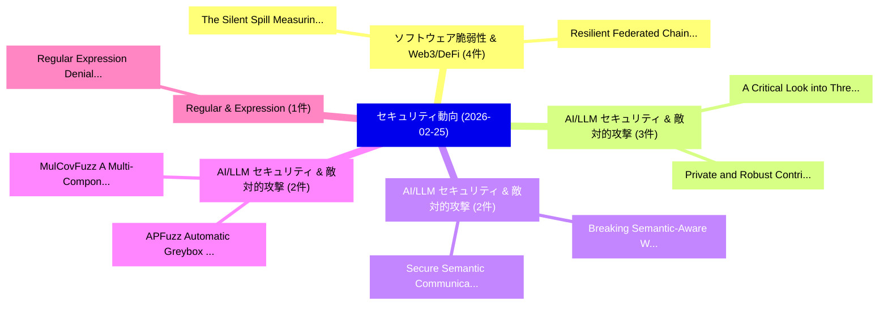

# 📅 02_daily: 日次エグゼクティブサマリー報告書 (2026-02-25)

**集計日時**: 2026-10-02 23:05:59 UTC  
**対象日付**: 2026-02-25  
**本日収集論文数**: 26 件  

---

## 💡 主要セキュリティ動向・脅威インサイト (Executive Insights)

本日の収集論文（計 26 件）において、以下の重点セキュリティ領域で活発な研究動向が確認されました：
- **ソフトウェア脆弱性 & Web3/DeFi** (4 件): 注目論文として 「The Silent Spill: Measuring Se...」、「Resilient Federated Chain: Tra...」 等が発表され、実務防御および攻撃検証の進展が見られます。
- **AI/LLM セキュリティ & 敵対的攻撃** (3 件): 注目論文として 「Private and Robust Contributio...」、「A Critical Look into Threshold...」 等が発表され、実務防御および攻撃検証の進展が見られます。
- **AI/LLM セキュリティ & 敵対的攻撃** (2 件): 注目論文として 「Breaking Semantic-Aware Waterm...」、「Secure Semantic Communications...」 等が発表され、実務防御および攻撃検証の進展が見られます。
- **AI/LLM セキュリティ & 敵対的攻撃** (2 件): 注目論文として 「MulCovFuzz: A Multi-Component ...」、「APFuzz: Automatic Greybox Prot...」 等が発表され、実務防御および攻撃検証の進展が見られます。
- **Regular & Expression** (1 件): 注目論文として 「Regular Expression Denial of S...」 等が発表され、実務防御および攻撃検証の進展が見られます。

### 🗺️ 技術・脅威トピックマインドマップ

---

## 📌 日次セキュリティ論文一覧 (日本語表形式)

| No | arXiv ID | 論文タイトル (日本語訳) | 重要キーワード | 構造化エグゼクティブ要約 (背景・提案・影響) | 脅威分類 | 詳細リンク |
|---|---|---|---|---|---|---|
| 1 | `2602.21459v1` | [Regular Expression Denial of Service Induced by Backreferences（セキュリティ分析論文）](../../okf/papers/2026-02-25/2602.21459.md) | `Regular Expression Denial`, `Service Induced`, `Yichen Liu` | 【提案】概要 (Overview & Key Finding) 本論文「Regular Expression サービス運用妨害 Induced by Backreferences（セ...。実証評価により経営層・セキュリティ管理者向け推奨アクション (E... | `executive-summary` | [arXiv](https://arxiv.org/abs/2602.21459v1) &#124; [OKF](../../okf/papers/2026-02-25/2602.21459.md) |
| 2 | `2602.21508v1` | [WaterVIB: Learning Minimal Sufficient Watermark Representations via Variational Information Bottleneck（セキュリティ分析論文）](../../okf/papers/2026-02-25/2602.21508.md) | `Learning Minimal Sufficient Watermark Representations`, `Variational Information Bottleneck`, `Yu Zheng` | 【提案】概要 (Overview & Key Finding) 本論文「WaterVIB: Learning Minimal Sufficient Watermark Represe...。実証評価により経営層・セキュリティ管理者向け推奨アクション (E... | `cs.CV` | [arXiv](https://arxiv.org/abs/2602.21508v1) &#124; [OKF](../../okf/papers/2026-02-25/2602.21508.md) |
| 3 | `2602.21524v2` | [Quantum Attacks Targeting Nuclear Power Plants: Threat Analysis, Defense and Mitigation Strategies（セキュリティ分析論文）](../../okf/papers/2026-02-25/2602.21524.md) | `Quantum Attacks Targeting Nuclear Power Plants`, `Mitigation Strategies`, `Quantum Attacks Targeting Nuclear Power` | 【提案】概要 (Overview & Key Finding) 本論文「量子 Attacks Targeting Nuclear Power Plants: 脅威 Analysis,...。実証評価により経営層・セキュリティ管理者向け推奨アクション (E... | `cybersecurity` | [arXiv](https://arxiv.org/abs/2602.21524v2) &#124; [OKF](../../okf/papers/2026-02-25/2602.21524.md) |
| 4 | `2602.21529v3` | [TMRugPull: A Temporally Sound Multimodal Dataset for Early RugPull Detection（セキュリティ分析論文）](../../okf/papers/2026-02-25/2602.21529.md) | `Temporally Sound Multimodal Dataset`, `Fatemeh Shoaei`, `Mohammad Pishdar` | 【提案】概要 (Overview & Key Finding) 本論文「TMRugPull: A Temporally Sound Multimodal Dataset for Ea...。実証評価により経営層・セキュリティ管理者向け推奨アクション (E... | `cybersecurity` | [arXiv](https://arxiv.org/abs/2602.21529v3) &#124; [OKF](../../okf/papers/2026-02-25/2602.21529.md) |
| 5 | `2602.21593v1` | [Breaking Semantic-Aware Watermarks via LLM-Guided Coherence-Preserving Semantic Injection（セキュリティ分析論文）](../../okf/papers/2026-02-25/2602.21593.md) | `Preserving Semantic Injection`, `Breaking Semantic`, `Aware Watermarks` | 【提案】概要 (Overview & Key Finding) 本論文「Breaking Semantic-Aware Watermarks via LLM-Guided Coher...。実証評価により経営層・セキュリティ管理者向け推奨アクション (E... | `cs.CV` | [arXiv](https://arxiv.org/abs/2602.21593v1) &#124; [OKF](../../okf/papers/2026-02-25/2602.21593.md) |
| 6 | `2602.21630v1` | [Type-Based Enforcement of Non-Interference for Choreographic Programming（セキュリティ分析論文）](../../okf/papers/2026-02-25/2602.21630.md) | `Based Enforcement`, `Choreographic Programming`, `Type-Based Enforcement` | 【提案】概要 (Overview & Key Finding) 本論文「Type-Based Enforcement of Non-Interference for Choreogr...。実証評価により経営層・セキュリティ管理者向け推奨アクション (E... | `cs.PL` | [arXiv](https://arxiv.org/abs/2602.21630v1) &#124; [OKF](../../okf/papers/2026-02-25/2602.21630.md) |
| 7 | `2602.21721v1` | [Private and Robust Contribution Evaluation in 連合学習](../../okf/papers/2026-02-25/2602.21721.md) | `Federated Learning`, `Delio Jaramillo Velez`, `Gergely Biczok` | 【提案】概要 (Overview & Key Finding) 本論文「Private and Robust Contribution Evaluation in 連合学習」（原題:...。実証評価により# Private and Robust Cont... | `executive-summary` | [arXiv](https://arxiv.org/abs/2602.21721v1) &#124; [OKF](../../okf/papers/2026-02-25/2602.21721.md) |
| 8 | `2602.21737v1` | [Implementation and transition to post-quantum cryptography of the Minimal IKE protocol（セキュリティ分析論文）](../../okf/papers/2026-02-25/2602.21737.md) | `post-quantum cryptography`, `Davide De Zuane`, `Paolo Santini` | 【提案】概要 (Overview & Key Finding) 本論文「Implementation and transition to ポスト量子暗号 of the Minimal...。実証評価により経営層・セキュリティ管理者向け推奨アクション (E... | `cs.NI` | [arXiv](https://arxiv.org/abs/2602.21737v1) &#124; [OKF](../../okf/papers/2026-02-25/2602.21737.md) |
| 9 | `2602.21794v1` | [MulCovFuzz: A Multi-Component Coverage-Guided Greybox Fuzzer for 5G Protocol Testing（セキュリティ分析論文）](../../okf/papers/2026-02-25/2602.21794.md) | `Guided Greybox Fuzzer`, `Component Coverage`, `Protocol Testing` | 【提案】概要 (Overview & Key Finding) 本論文「MulCovFuzz: A Multi-Component Coverage-Guided Greybox F...。実証評価により経営層・セキュリティ管理者向け推奨アクション (E... | `cybersecurity` | [arXiv](https://arxiv.org/abs/2602.21794v1) &#124; [OKF](../../okf/papers/2026-02-25/2602.21794.md) |
| 10 | `2602.21826v1` | [The Silent Spill: Measuring Sensitive Data Leaks Across Public URL Repositories（セキュリティ分析論文）](../../okf/papers/2026-02-25/2602.21826.md) | `Measuring Sensitive Data Leaks Across Public`, `Tarek Ramadan`, `Mohammad Mannan` | 【提案】概要 (Overview & Key Finding) 本論文「The Silent Spill: Measuring Sensitive Data Leaks Across...。実証評価により経営層・セキュリティ管理者向け推奨アクション (E... | `cybersecurity` | [arXiv](https://arxiv.org/abs/2602.21826v1) &#124; [OKF](../../okf/papers/2026-02-25/2602.21826.md) |
| 11 | `2602.21841v1` | [Resilient Federated Chain: Transforming Blockchain Consensus into an Active Defense Layer for 連合学習](../../okf/papers/2026-02-25/2602.21841.md) | `Resilient Federated Chain`, `Transforming Blockchain Consensus`, `Active Defense Layer` | 【提案】概要 (Overview & Key Finding) 本論文「Resilient Federated Chain: Transforming Blockchain Cons...。実証評価により経営層・セキュリティ管理者向け推奨アクション (E... | `cs.AI` | [arXiv](https://arxiv.org/abs/2602.21841v1) &#124; [OKF](../../okf/papers/2026-02-25/2602.21841.md) |
| 12 | `2602.21892v1` | [APFuzz: Automatic Greybox Protocol Fuzzingに向けて](../../okf/papers/2026-02-25/2602.21892.md) | `Towards Automatic Greybox Protocol Fuzzing`, `Automatic Greybox Protocol`, `Yu Wang` | 【提案】概要 (Overview & Key Finding) 本論文「APFuzz: Automatic Greybox Protocol Fuzzingに向けて」（原題: APF...。実証評価により経営層・セキュリティ管理者向け推奨アクション (E... | `cybersecurity` | [arXiv](https://arxiv.org/abs/2602.21892v1) &#124; [OKF](../../okf/papers/2026-02-25/2602.21892.md) |
| 13 | `2602.22037v1` | [A Critical Look into Threshold Homomorphic Encryption for Private Average Aggregation（セキュリティ分析論文）](../../okf/papers/2026-02-25/2602.22037.md) | `Threshold Homomorphic Encryption`, `Private Average Aggregation`, `Critical Look` | 【提案】概要 (Overview & Key Finding) 本論文「A Critical Look into Threshold 準同型暗号 for Private Averag...。実証評価により経営層・セキュリティ管理者向け推奨アクション (E... | `cybersecurity` | [arXiv](https://arxiv.org/abs/2602.22037v1) &#124; [OKF](../../okf/papers/2026-02-25/2602.22037.md) |
| 14 | `2602.22082v1` | [Enabling End-to-End APT Emulation in Industrial Environments: Design and Implementation of the SIMPLE-ICS Testbed（セキュリティ分析論文）](../../okf/papers/2026-02-25/2602.22082.md) | `Enabling End`, `Industrial Environments`, `SIMPLE-ICS Testbed` | 【提案】概要 (Overview & Key Finding) 本論文「Enabling End-to-End APT Emulation in Industrial Environ...。実証評価により経営層・セキュリティ管理者向け推奨アクション (E... | `cybersecurity` | [arXiv](https://arxiv.org/abs/2602.22082v1) &#124; [OKF](../../okf/papers/2026-02-25/2602.22082.md) |
| 15 | `2602.22134v2` | [Secure Semantic Communications via AI Defenses: Fundamentals, Solutions, and Future Directions（セキュリティ分析論文）](../../okf/papers/2026-02-25/2602.22134.md) | `Secure Semantic Communications`, `Future Directions`, `Lan Zhang` | 【提案】概要 (Overview & Key Finding) 本論文「Secure Semantic Communications via AI Defenses: Fundame...。実証評価により経営層・セキュリティ管理者向け推奨アクション (E... | `executive-summary` | [arXiv](https://arxiv.org/abs/2602.22134v2) &#124; [OKF](../../okf/papers/2026-02-25/2602.22134.md) |
| 16 | `2602.22187v3` | [UC-Secure Star DKG for Non-Exportable Key Shares with VSS-Free Enforcement（セキュリティ分析論文）](../../okf/papers/2026-02-25/2602.22187.md) | `Exportable Key Shares`, `Secure Star`, `Free Enforcement` | 【提案】概要 (Overview & Key Finding) 本論文「UC-Secure Star DKG for Non-Exportable Key Shares with V...。実証評価により経営層・セキュリティ管理者向け推奨アクション (E... | `cybersecurity` | [arXiv](https://arxiv.org/abs/2602.22187v3) &#124; [OKF](../../okf/papers/2026-02-25/2602.22187.md) |
| 17 | `2602.22258v1` | [Poisoned Acoustics（セキュリティ分析論文）](../../okf/papers/2026-02-25/2602.22258.md) | `Poisoned Acoustics`, `Harrison Dahme`, `Raw Meta` | 【提案】概要 (Overview & Key Finding) 本論文「Poisoned Acoustics（セキュリティ分析論文）」（原題: Poisoned Acoustics ...。実証評価により経営層・セキュリティ管理者向け推奨アクション (E... | `cs.AI` | [arXiv](https://arxiv.org/abs/2602.22258v1) &#124; [OKF](../../okf/papers/2026-02-25/2602.22258.md) |
| 18 | `2602.22282v1` | [Differentially Private Truncation of Unbounded Data via Public Second Moments（セキュリティ分析論文）](../../okf/papers/2026-02-25/2602.22282.md) | `Differentially Private Truncation`, `Public Second Moments`, `Unbounded Data` | 【提案】概要 (Overview & Key Finding) 本論文「Differentially Private Truncation of Unbounded Data via...。実証評価により経営層・セキュリティ管理者向け推奨アクション (E... | `stat.ME` | [arXiv](https://arxiv.org/abs/2602.22282v1) &#124; [OKF](../../okf/papers/2026-02-25/2602.22282.md) |
| 19 | `2602.22291v3` | [Manifold of Failure: Behavioral Attraction Basins in Language Models（セキュリティ分析論文）](../../okf/papers/2026-02-25/2602.22291.md) | `Behavioral Attraction Basins`, `Language Models`, `Vineeth Sai Narajala` | 【提案】概要 (Overview & Key Finding) 本論文「Manifold of Failure: Behavioral Attraction Basins in La...。実証評価により経営層・セキュリティ管理者向け推奨アクション (E... | `cs.AI` | [arXiv](https://arxiv.org/abs/2602.22291v3) &#124; [OKF](../../okf/papers/2026-02-25/2602.22291.md) |
| 20 | `2602.22427v2` | [Adversarial Hubness Detector: Detecting Hubness Poisoning in Retrieval-Augmented Generation Systems（セキュリティ分析論文）](../../okf/papers/2026-02-25/2602.22427.md) | `Adversarial Hubness Detector`, `Detecting Hubness Poisoning`, `Augmented Generation Systems` | 【提案】概要 (Overview & Key Finding) 本論文「Adversarial Hubness Detector: Detecting Hubness Poisoni...。実証評価により経営層・セキュリティ管理者向け推奨アクション (E... | `cs.AI` | [arXiv](https://arxiv.org/abs/2602.22427v2) &#124; [OKF](../../okf/papers/2026-02-25/2602.22427.md) |
| 21 | `2602.22433v1` | [Predicting Known Vulnerabilities from Attack Descriptions Using Sentence Transformers（セキュリティ分析論文）](../../okf/papers/2026-02-25/2602.22433.md) | `Attack Descriptions Using Sentence Transformers`, `Predicting Known Vulnerabilities`, `Refat Othman` | 【提案】概要 (Overview & Key Finding) 本論文「Predicting Known Vulnerabilities from Attack Descriptio...。実証評価により経営層・セキュリティ管理者向け推奨アクション (E... | `cybersecurity` | [arXiv](https://arxiv.org/abs/2602.22433v1) &#124; [OKF](../../okf/papers/2026-02-25/2602.22433.md) |
| 22 | `2602.22443v1` | [Differentially Private Data-Driven Markov Chain Modeling（セキュリティ分析論文）](../../okf/papers/2026-02-25/2602.22443.md) | `Driven Markov Chain Modeling`, `Differentially Private Data`, `Data-Driven Markov` | 【提案】概要 (Overview & Key Finding) 本論文「Differentially Private Data-Driven Markov Chain Modelin...。実証評価により経営層・セキュリティ管理者向け推奨アクション (E... | `executive-summary` | [arXiv](https://arxiv.org/abs/2602.22443v1) &#124; [OKF](../../okf/papers/2026-02-25/2602.22443.md) |
| 23 | `2602.22450v1` | [Silent Egress: When Implicit Prompt Injection Makes LLMエージェント Leak Without a Trace](../../okf/papers/2026-02-25/2602.22450.md) | `Silent Egress`, `Agents Leak Without`, `Leak Without` | 【提案】背景とセキュリティ上の課題 (Background & Problem) 本研究はサイバー脅威環境におけるセキュリティ構造・脆弱性の検証を目的としています。(主要検出項目: ...。実証評価により経営層・セキュリティ管理者向け推奨アクション (E... | `cs.AI` | [arXiv](https://arxiv.org/abs/2602.22450v1) &#124; [OKF](../../okf/papers/2026-02-25/2602.22450.md) |
| 24 | `2602.22470v1` | [Beyond performance-wise Contribution Evaluation in 連合学習](../../okf/papers/2026-02-25/2602.22470.md) | `performance-wise Contribution`, `Federated Learning`, `Balazs Pejo` | 【提案】概要 (Overview & Key Finding) 本論文「Beyond performance-wise Contribution Evaluation in 連合学習...。実証評価により経営層・セキュリティ管理者向け推奨アクション (E... | `executive-summary` | [arXiv](https://arxiv.org/abs/2602.22470v1) &#124; [OKF](../../okf/papers/2026-02-25/2602.22470.md) |
| 25 | `2602.22488v1` | [Explainability-Aware Evaluation of Transfer Learning Models for IoT DDoS Detection Under Resource Constraints（セキュリティ分析論文）](../../okf/papers/2026-02-25/2602.22488.md) | `Transfer Learning Models`, `Nelly Elsayed`, `Raw Meta` | 【提案】概要 (Overview & Key Finding) 本論文「Explainability-Aware Evaluation of Transfer Learning Mo...。実証評価により経営層・セキュリティ管理者向け推奨アクション (E... | `cs.AI` | [arXiv](https://arxiv.org/abs/2602.22488v1) &#124; [OKF](../../okf/papers/2026-02-25/2602.22488.md) |
| 26 | `2604.20856v1` | [CRED-1: An Open Multi-Signal Domain Credibility Dataset for Automated Pre-Bunking of Online Misinformation（セキュリティ分析論文）](../../okf/papers/2026-02-25/2604.20856.md) | `Signal Domain Credibility Dataset`, `Multi-Signal Domain`, `Automated Pre` | 【提案】概要 (Overview & Key Finding) 本論文「CRED-1: An Open Multi-Signal Domain Credibility Dataset...。実証評価により経営層・セキュリティ管理者向け推奨アクション (E... | `executive-summary` | [arXiv](https://arxiv.org/abs/2604.20856v1) &#124; [OKF](../../okf/papers/2026-02-25/2604.20856.md) |

