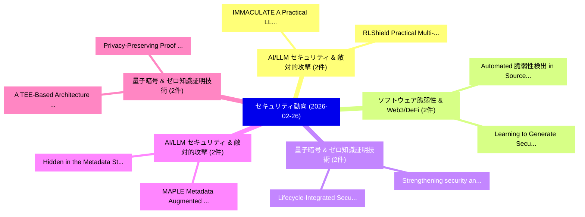

# 📅 02_daily: 日次エグゼクティブサマリー報告書 (2026-02-26)

**集計日時**: 2026-10-02 23:05:59 UTC  
**対象日付**: 2026-02-26  
**本日収集論文数**: 31 件  

---

## 💡 主要セキュリティ動向・脅威インサイト (Executive Insights)

本日の収集論文（計 31 件）において、以下の重点セキュリティ領域で活発な研究動向が確認されました：
- **AI/LLM セキュリティ & 敵対的攻撃** (2 件): 注目論文として 「IMMACULATE: A Practical LLM Au...」、「RLShield: Practical Multi-Agen...」 等が発表され、実務防御および攻撃検証の進展が見られます。
- **ソフトウェア脆弱性 & Web3/DeFi** (2 件): 注目論文として 「Automated 脆弱性検出 in Source Code...」、「Learning to Generate Secure Co...」 等が発表され、実務防御および攻撃検証の進展が見られます。
- **量子暗号 & ゼロ知識証明技術** (2 件): 注目論文として 「Strengthening security and noi...」、「Lifecycle-Integrated Security ...」 等が発表され、実務防御および攻撃検証の進展が見られます。
- **AI/LLM セキュリティ & 敵対的攻撃** (2 件): 注目論文として 「Hidden in the Metadata: Stealt...」、「MAPLE: Metadata Augmented Priv...」 等が発表され、実務防御および攻撃検証の進展が見られます。
- **量子暗号 & ゼロ知識証明技術** (2 件): 注目論文として 「A TEE-Based Architecture for C...」、「Privacy-Preserving Proof of Hu...」 等が発表され、実務防御および攻撃検証の進展が見られます。

### 🗺️ 技術・脅威トピックマインドマップ

---

## 📌 日次セキュリティ論文一覧 (日本語表形式)

| No | arXiv ID | 論文タイトル (日本語訳) | 重要キーワード | 構造化エグゼクティブ要約 (背景・提案・影響) | 脅威分類 | 詳細リンク |
|---|---|---|---|---|---|---|
| 1 | `2602.22525v2` | [Systems-Level Attack Surface of Edge Agent Deployments on IoT（セキュリティ分析論文）](../../okf/papers/2026-02-26/2602.22525.md) | `Level Attack Surface`, `Edge Agent Deployments`, `Systems-Level Attack` | 【提案】概要 (Overview & Key Finding) 本論文「Systems-Level Attack Surface of Edge Agent Deployments ...。実証評価により経営層・セキュリティ管理者向け推奨アクション (E... | `cybersecurity` | [arXiv](https://arxiv.org/abs/2602.22525v2) &#124; [OKF](../../okf/papers/2026-02-26/2602.22525.md) |
| 2 | `2602.22562v1` | [Layer-Targeted Multilingual Knowledge Erasure in 大規模言語モデル](../../okf/papers/2026-02-26/2602.22562.md) | `Targeted Multilingual Knowledge Erasure`, `Layer-Targeted Multilingual`, `Large Language Models` | 【提案】概要 (Overview & Key Finding) 本論文「Layer-Targeted Multilingual Knowledge Erasure in 大規模言語モ...。実証評価により経営層・セキュリティ管理者向け推奨アクション (E... | `cybersecurity` | [arXiv](https://arxiv.org/abs/2602.22562v1) &#124; [OKF](../../okf/papers/2026-02-26/2602.22562.md) |
| 3 | `2602.22689v1` | [No Caption, No Problem: Caption-Free Membership Inference via Model-Fitted Embeddings（セキュリティ分析論文）](../../okf/papers/2026-02-26/2602.22689.md) | `Free Membership Inference`, `Caption-Free Membership`, `Fitted Embeddings` | 【提案】概要 (Overview & Key Finding) 本論文「No Caption, No Problem: Caption-Free Membership Inferen...。実証評価により経営層・セキュリティ管理者向け推奨アクション (E... | `cs.CV` | [arXiv](https://arxiv.org/abs/2602.22689v1) &#124; [OKF](../../okf/papers/2026-02-26/2602.22689.md) |
| 4 | `2602.22699v2` | [DPSQL+: A Differentially Private SQL Library with a Minimum Frequency Rule（セキュリティ分析論文）](../../okf/papers/2026-02-26/2602.22699.md) | `Minimum Frequency Rule`, `Differentially Private`, `Tomoya Matsumoto` | 【提案】概要 (Overview & Key Finding) 本論文「DPSQL+: A Differentially Private SQL Library with a Min...。実証評価により経営層・セキュリティ管理者向け推奨アクション (E... | `cs.DB` | [arXiv](https://arxiv.org/abs/2602.22699v2) &#124; [OKF](../../okf/papers/2026-02-26/2602.22699.md) |
| 5 | `2602.22700v1` | [IMMACULATE: A Practical LLM Auditing Framework via Verifiable Computation（セキュリティ分析論文）](../../okf/papers/2026-02-26/2602.22700.md) | `Verifiable Computation`, `Yanpei Guo`, `Wenjie Qu` | 【提案】概要 (Overview & Key Finding) 本論文「IMMACULATE: A Practical LLM Auditing Framework via Veri...。実証評価により経営層・セキュリティ管理者向け推奨アクション (E... | `cs.AI` | [arXiv](https://arxiv.org/abs/2602.22700v1) &#124; [OKF](../../okf/papers/2026-02-26/2602.22700.md) |
| 6 | `2602.22724v1` | [AgentSentry: Temporal Causal Diagnostics and Context PurificationによるIndirect Prompt Injection in LLM Agentsの軽減](../../okf/papers/2026-02-26/2602.22724.md) | `Temporal Causal Diagnostics`, `Mitigating Indirect Prompt Injection`, `Context Purification` | 【提案】概要 (Overview & Key Finding) 本論文「AgentSentry: Temporal Causal Diagnostics and Context Pu...。実証評価により経営層・セキュリティ管理者向け推奨アクション (E... | `cs.AI` | [arXiv](https://arxiv.org/abs/2602.22724v1) &#124; [OKF](../../okf/papers/2026-02-26/2602.22724.md) |
| 7 | `2602.22729v1` | [RandSet: Randomized Corpus Reduction for Fuzzing Seed Scheduling（セキュリティ分析論文）](../../okf/papers/2026-02-26/2602.22729.md) | `Randomized Corpus Reduction`, `Fuzzing Seed Scheduling`, `Yuchong Xie` | 【提案】概要 (Overview & Key Finding) 本論文「RandSet: Randomized Corpus Reduction for Fuzzing Seed S...。実証評価により経営層・セキュリティ管理者向け推奨アクション (E... | `executive-summary` | [arXiv](https://arxiv.org/abs/2602.22729v1) &#124; [OKF](../../okf/papers/2026-02-26/2602.22729.md) |
| 8 | `2602.22983v3` | [Obscure but Effective: Classical Chinese Jailbreak Prompt Optimization via Bio-Inspired Search（セキュリティ分析論文）](../../okf/papers/2026-02-26/2602.22983.md) | `Classical Chinese Jailbreak Prompt Optimization`, `Inspired Search`, `Bio-Inspired Search` | 【提案】概要 (Overview & Key Finding) 本論文「Obscure but Effective: Classical Chinese ジェイルブレイク Promp...。実証評価により経営層・セキュリティ管理者向け推奨アクション (E... | `cs.AI` | [arXiv](https://arxiv.org/abs/2602.22983v3) &#124; [OKF](../../okf/papers/2026-02-26/2602.22983.md) |
| 9 | `2602.23067v2` | [A High-Throughput AES-GCM Implementation on GPUs for Secure, Policy-Based Access to Massive Astronomical Catalogs（セキュリティ分析論文）](../../okf/papers/2026-02-26/2602.23067.md) | `Massive Astronomical Catalogs`, `Based Access`, `High-Throughput AES` | 【提案】概要 (Overview & Key Finding) 本論文「A High-Throughput AES-GCM Implementation on GPUs for Se...。実証評価により経営層・セキュリティ管理者向け推奨アクション (E... | `astro-ph.IM` | [arXiv](https://arxiv.org/abs/2602.23067v2) &#124; [OKF](../../okf/papers/2026-02-26/2602.23067.md) |
| 10 | `2602.23079v1` | [Assessing Deanonymization Risks with Stylometry-Assisted LLM Agent（セキュリティ分析論文）](../../okf/papers/2026-02-26/2602.23079.md) | `Assessing Deanonymization Risks`, `Stylometry-Assisted LLM`, `Boyang Zhang` | 【提案】概要 (Overview & Key Finding) 本論文「Assessing Deanonymization Risks with Stylometry-Assiste...。実証評価により経営層・セキュリティ管理者向け推奨アクション (E... | `executive-summary` | [arXiv](https://arxiv.org/abs/2602.23079v1) &#124; [OKF](../../okf/papers/2026-02-26/2602.23079.md) |
| 11 | `2602.23121v1` | [Automated 脆弱性検出 in Source Code Using Deep Representation Learning](../../okf/papers/2026-02-26/2602.23121.md) | `Source Code Using Deep Representation Learning`, `Automated Vulnerability Detection`, `Raw Meta` | 【提案】概要 (Overview & Key Finding) 本論文「Automated 脆弱性検出 in Source Code Using Deep Representatio...。実証評価によりHamilton, M.。 | `cs.AI` | [arXiv](https://arxiv.org/abs/2602.23121v1) &#124; [OKF](../../okf/papers/2026-02-26/2602.23121.md) |
| 12 | `2602.23163v3` | [A Decision-Theoretic Formalisation of Steganography With Applications to LLM Monitoring（セキュリティ分析論文）](../../okf/papers/2026-02-26/2602.23163.md) | `Theoretic Formalisation`, `Decision-Theoretic Formalisation`, `Usman Anwar` | 【提案】概要 (Overview & Key Finding) 本論文「A Decision-Theoretic Formalisation of Steganography Wit...。実証評価により経営層・セキュリティ管理者向け推奨アクション (E... | `cs.AI` | [arXiv](https://arxiv.org/abs/2602.23163v3) &#124; [OKF](../../okf/papers/2026-02-26/2602.23163.md) |
| 13 | `2602.23167v1` | [SettleFL: Trustless and Scalable Reward Settlement Protocol for 連合学習 on Permissionless Blockchains (Extended version)](../../okf/papers/2026-02-26/2602.23167.md) | `Scalable Reward Settlement Protocol`, `Permissionless Blockchains`, `Federated Learning` | 【提案】概要 (Overview & Key Finding) 本論文「SettleFL: Trustless and Scalable Reward Settlement Prot...。実証評価により経営層・セキュリティ管理者向け推奨アクション (E... | `executive-summary` | [arXiv](https://arxiv.org/abs/2602.23167v1) &#124; [OKF](../../okf/papers/2026-02-26/2602.23167.md) |
| 14 | `2602.23261v3` | [Strengthening security and noise resistance in one-way quantum key distribution protocols through hypercube-based quantum walks（セキュリティ分析論文）](../../okf/papers/2026-02-26/2602.23261.md) | `one-way quantum`, `hypercube-based quantum`, `David Polzoni` | 【提案】概要 (Overview & Key Finding) 本論文「Strengthening security and noise resistance in one-way ...。実証評価により経営層・セキュリティ管理者向け推奨アクション (E... | `cybersecurity` | [arXiv](https://arxiv.org/abs/2602.23261v3) &#124; [OKF](../../okf/papers/2026-02-26/2602.23261.md) |
| 15 | `2602.23262v1` | [Decomposing Private Image Generation via Coarse-to-Fine Wavelet Modeling（セキュリティ分析論文）](../../okf/papers/2026-02-26/2602.23262.md) | `Decomposing Private Image Generation`, `Fine Wavelet Modeling`, `Jasmine Bayrooti` | 【提案】概要 (Overview & Key Finding) 本論文「Decomposing Private Image Generation via Coarse-to-Fine...。実証評価により経営層・セキュリティ管理者向け推奨アクション (E... | `cs.CV` | [arXiv](https://arxiv.org/abs/2602.23262v1) &#124; [OKF](../../okf/papers/2026-02-26/2602.23262.md) |
| 16 | `2602.23329v2` | [LLM Novice Uplift on Dual-Use, In Silico Biology Tasks（セキュリティ分析論文）](../../okf/papers/2026-02-26/2602.23329.md) | `Novice Uplift`, `Chen Bo Calvin Zhang`, `Andrew Bo Liu` | 【提案】概要 (Overview & Key Finding) 本論文「LLM Novice Uplift on Dual-Use, In Silico Biology Tasks（...。実証評価によりKnight, Nicholas Kruus, J... | `cs.AI` | [arXiv](https://arxiv.org/abs/2602.23329v2) &#124; [OKF](../../okf/papers/2026-02-26/2602.23329.md) |
| 17 | `2602.23397v1` | [Lifecycle-Integrated Security for AI-Cloud Convergence in Cyber-Physical Infrastructure（セキュリティ分析論文）](../../okf/papers/2026-02-26/2602.23397.md) | `Integrated Security`, `Lifecycle-Integrated Security`, `Cloud Convergence` | 【提案】概要 (Overview & Key Finding) 本論文「Lifecycle-Integrated Security for AI-Cloud Convergence ...。実証評価により経営層・セキュリティ管理者向け推奨アクション (E... | `executive-summary` | [arXiv](https://arxiv.org/abs/2602.23397v1) &#124; [OKF](../../okf/papers/2026-02-26/2602.23397.md) |
| 18 | `2602.23404v1` | [サイバーセキュリティ of Teleoperated Quadruped Robots: A Systematic Survey of Vulnerabilities, Threats, and Open Defense Gaps](../../okf/papers/2026-02-26/2602.23404.md) | `Teleoperated Quadruped Robots`, `Open Defense Gaps`, `Systematic Survey` | 【提案】概要 (Overview & Key Finding) 本論文「サイバーセキュリティ of Teleoperated Quadruped Robots: A Systemat...。実証評価により経営層・セキュリティ管理者向け推奨アクション (E... | `executive-summary` | [arXiv](https://arxiv.org/abs/2602.23404v1) &#124; [OKF](../../okf/papers/2026-02-26/2602.23404.md) |
| 19 | `2602.23407v1` | [Learning to Generate Secure Code via Token-Level Rewards（セキュリティ分析論文）](../../okf/papers/2026-02-26/2602.23407.md) | `Generate Secure Code`, `Level Rewards`, `Token-Level Rewards` | 【提案】概要 (Overview & Key Finding) 本論文「Learning to Generate Secure Code via Token-Level Reward...。実証評価により経営層・セキュリティ管理者向け推奨アクション (E... | `cs.AI` | [arXiv](https://arxiv.org/abs/2602.23407v1) &#124; [OKF](../../okf/papers/2026-02-26/2602.23407.md) |
| 20 | `2602.23464v2` | [2G2T: Constant-Size, Statistically Sound MSM Outsourcing（セキュリティ分析論文）](../../okf/papers/2026-02-26/2602.23464.md) | `Statistically Sound`, `Majid Khabbazian`, `Raw Meta` | 【提案】概要 (Overview & Key Finding) 本論文「2G2T: Constant-Size, Statistically Sound MSM Outsourcin...。実証評価により経営層・セキュリティ管理者向け推奨アクション (E... | `executive-summary` | [arXiv](https://arxiv.org/abs/2602.23464v2) &#124; [OKF](../../okf/papers/2026-02-26/2602.23464.md) |
| 21 | `2602.23513v1` | [A Software-Defined Testbed for Quantifying Deauthentication Resilience in Modern Wi-Fi Networks（セキュリティ分析論文）](../../okf/papers/2026-02-26/2602.23513.md) | `Quantifying Deauthentication Resilience`, `Defined Testbed`, `Software-Defined Testbed` | 【提案】概要 (Overview & Key Finding) 本論文「A Software-Defined Testbed for Quantifying Deauthentica...。実証評価により経営層・セキュリティ管理者向け推奨アクション (E... | `cs.NI` | [arXiv](https://arxiv.org/abs/2602.23513v1) &#124; [OKF](../../okf/papers/2026-02-26/2602.23513.md) |
| 22 | `2602.23516v3` | [Lap2: Revisiting Laplace DP-SGD for High Dimensions via Majorization Theory（セキュリティ分析論文）](../../okf/papers/2026-02-26/2602.23516.md) | `Revisiting Laplace`, `High Dimensions`, `Majorization Theory` | 【提案】概要 (Overview & Key Finding) 本論文「Lap2: Revisiting Laplace DP-SGD for High Dimensions via...。実証評価により経営層・セキュリティ管理者向け推奨アクション (E... | `executive-summary` | [arXiv](https://arxiv.org/abs/2602.23516v3) &#124; [OKF](../../okf/papers/2026-02-26/2602.23516.md) |
| 23 | `2603.00164v1` | [Reverse CAPTCHA: Evaluating LLM Susceptibility to Invisible Unicode Instruction Injection（セキュリティ分析論文）](../../okf/papers/2026-02-26/2603.00164.md) | `Invisible Unicode Instruction Injection`, `Marcus Graves`, `Raw Meta` | 【提案】概要 (Overview & Key Finding) 本論文「Reverse CAPTCHA: Evaluating LLM Susceptibility to Invis...。実証評価により経営層・セキュリティ管理者向け推奨アクション (E... | `cs.AI` | [arXiv](https://arxiv.org/abs/2603.00164v1) &#124; [OKF](../../okf/papers/2026-02-26/2603.00164.md) |
| 24 | `2603.00172v1` | [Hidden in the Metadata: Stealth Poisoning Attacks on Multimodal Retrieval-Augmented Generation（セキュリティ分析論文）](../../okf/papers/2026-02-26/2603.00172.md) | `Stealth Poisoning Attacks`, `Multimodal Retrieval`, `Augmented Generation` | 【提案】概要 (Overview & Key Finding) 本論文「Hidden in the Metadata: Stealth Poisoning Attacks on Mu...。実証評価により経営層・セキュリティ管理者向け推奨アクション (E... | `cs.AI` | [arXiv](https://arxiv.org/abs/2603.00172v1) &#124; [OKF](../../okf/papers/2026-02-26/2603.00172.md) |
| 25 | `2603.00177v3` | [Detecting Cognitive Signatures in Typing Behavior for Non-Intrusive Authorship Verification（セキュリティ分析論文）](../../okf/papers/2026-02-26/2603.00177.md) | `Detecting Cognitive Signatures`, `Intrusive Authorship Verification`, `Typing Behavior` | 【提案】概要 (Overview & Key Finding) 本論文「Detecting Cognitive Signatures in Typing Behavior for N...。実証評価により経営層・セキュリティ管理者向け推奨アクション (E... | `executive-summary` | [arXiv](https://arxiv.org/abs/2603.00177v3) &#124; [OKF](../../okf/papers/2026-02-26/2603.00177.md) |
| 26 | `2603.00178v3` | [A TEE-Based Architecture for Confidential and Dependable Process Attestation in Authorship Verification（セキュリティ分析論文）](../../okf/papers/2026-02-26/2603.00178.md) | `Dependable Process Attestation`, `Based Architecture`, `Authorship Verification` | 【提案】概要 (Overview & Key Finding) 本論文「A TEE-Based Architecture for Confidential and Dependabl...。実証評価により経営層・セキュリティ管理者向け推奨アクション (E... | `executive-summary` | [arXiv](https://arxiv.org/abs/2603.00178v3) &#124; [OKF](../../okf/papers/2026-02-26/2603.00178.md) |
| 27 | `2603.00179v3` | [Privacy-Preserving Proof of Human Authorship via Zero-Knowledge Process Attestation（セキュリティ分析論文）](../../okf/papers/2026-02-26/2603.00179.md) | `Knowledge Process Attestation`, `Preserving Proof`, `Human Authorship` | 【提案】概要 (Overview & Key Finding) 本論文「Privacy-Preserving Proof of Human Authorship via Zero-K...。実証評価により経営層・セキュリティ管理者向け推奨アクション (E... | `executive-summary` | [arXiv](https://arxiv.org/abs/2603.00179v3) &#124; [OKF](../../okf/papers/2026-02-26/2603.00179.md) |
| 28 | `2603.00185v1` | [ThreatFormer-IDS: Robust Transformer Intrusion Detection with Zero-Day Generalization and Explainable Attribution（セキュリティ分析論文）](../../okf/papers/2026-02-26/2603.00185.md) | `Robust Transformer Intrusion Detection`, `Day Generalization`, `Zero-Day Generalization` | 【提案】概要 (Overview & Key Finding) 本論文「ThreatFormer-IDS: Robust Transformer Intrusion Detectio...。実証評価により経営層・セキュリティ管理者向け推奨アクション (E... | `cs.AI` | [arXiv](https://arxiv.org/abs/2603.00185v1) &#124; [OKF](../../okf/papers/2026-02-26/2603.00185.md) |
| 29 | `2603.00186v1` | [RLShield: Practical Multi-Agent RL for Financial Cyber Defense with Attack-Surface MDPs and Real-Time Response Orchestration（セキュリティ分析論文）](../../okf/papers/2026-02-26/2603.00186.md) | `Financial Cyber Defense`, `Time Response Orchestration`, `Practical Multi` | 【提案】概要 (Overview & Key Finding) 本論文「RLShield: Practical Multi-Agent RL for Financial Cyber ...。実証評価により経営層・セキュリティ管理者向け推奨アクション (E... | `cs.AI` | [arXiv](https://arxiv.org/abs/2603.00186v1) &#124; [OKF](../../okf/papers/2026-02-26/2603.00186.md) |
| 30 | `2603.11054v1` | [A Survey on Quantitative Modeling of Trust in Online Social Networks（セキュリティ分析論文）](../../okf/papers/2026-02-26/2603.11054.md) | `Online Social Networks`, `Quantitative Modeling`, `Wenting Song` | 【提案】概要 (Overview & Key Finding) 本論文「A Survey on Quantitative Modeling of Trust in Online So...。実証評価によりSuzanne Barber - **公開日時**... | `cs.AI` | [arXiv](https://arxiv.org/abs/2603.11054v1) &#124; [OKF](../../okf/papers/2026-02-26/2603.11054.md) |
| 31 | `2603.19258v2` | [MAPLE: Metadata Augmented Private Language Evolution（セキュリティ分析論文）](../../okf/papers/2026-02-26/2603.19258.md) | `Metadata Augmented Private Language Evolution`, `Eli Chien`, `Yuzheng Hu` | 【提案】概要 (Overview & Key Finding) 本論文「MAPLE: Metadata Augmented Private Language Evolution（セキ...。実証評価により経営層・セキュリティ管理者向け推奨アクション (E... | `cs.AI` | [arXiv](https://arxiv.org/abs/2603.19258v2) &#124; [OKF](../../okf/papers/2026-02-26/2603.19258.md) |

