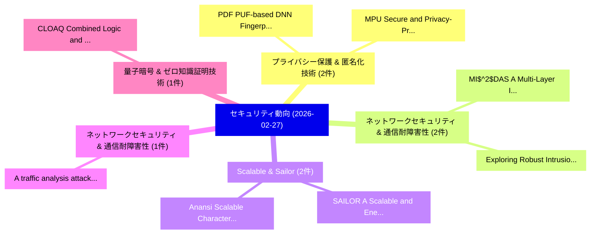

# 📅 02_daily: 日次エグゼクティブサマリー報告書 (2026-02-27)

**集計日時**: 2026-10-02 23:05:59 UTC  
**対象日付**: 2026-02-27  
**本日収集論文数**: 28 件  

---

## 💡 主要セキュリティ動向・脅威インサイト (Executive Insights)

本日の収集論文（計 28 件）において、以下の重点セキュリティ領域で活発な研究動向が確認されました：
- **プライバシー保護 & 匿名化技術** (2 件): 注目論文として 「PDF: PUF-based DNN Fingerprint...」、「MPU: Secure and Privacy-Preser...」 等が発表され、実務防御および攻撃検証の進展が見られます。
- **ネットワークセキュリティ & 通信耐障害性** (2 件): 注目論文として 「MI$^2$DAS: A Multi-Layer Intru...」、「Exploring Robust Intrusion Det...」 等が発表され、実務防御および攻撃検証の進展が見られます。
- **Scalable & Sailor** (2 件): 注目論文として 「SAILOR: A Scalable and Energy-...」、「Anansi: Scalable Characterizat...」 等が発表され、実務防御および攻撃検証の進展が見られます。
- **ネットワークセキュリティ & 通信耐障害性** (1 件): 注目論文として 「A traffic analysis attack agai...」 等が発表され、実務防御および攻撃検証の進展が見られます。
- **量子暗号 & ゼロ知識証明技術** (1 件): 注目論文として 「CLOAQ: Combined Logic and Angl...」 等が発表され、実務防御および攻撃検証の進展が見られます。

### 🗺️ 技術・脅威トピックマインドマップ

---

## 📌 日次セキュリティ論文一覧 (日本語表形式)

| No | arXiv ID | 論文タイトル (日本語訳) | 重要キーワード | 構造化エグゼクティブ要約 (背景・提案・影響) | 脅威分類 | 詳細リンク |
|---|---|---|---|---|---|---|
| 1 | `2602.23560v2` | [A traffic analysis attack against Introduction Protocol and Onion Services（セキュリティ分析論文）](../../okf/papers/2026-02-27/2602.23560.md) | `Introduction Protocol`, `Onion Services`, `Nicolas Constantinides` | 【提案】概要 (Overview & Key Finding) 本論文「A traffic analysis attack against Introduction Protocol...。実証評価により経営層・セキュリティ管理者向け推奨アクション (E... | `cybersecurity` | [arXiv](https://arxiv.org/abs/2602.23560v2) &#124; [OKF](../../okf/papers/2026-02-27/2602.23560.md) |
| 2 | `2602.23569v1` | [CLOAQ: Combined Logic and Angle Obfuscation for Quantum Circuits（セキュリティ分析論文）](../../okf/papers/2026-02-27/2602.23569.md) | `Combined Logic`, `Angle Obfuscation`, `Quantum Circuits` | 【提案】概要 (Overview & Key Finding) 本論文「CLOAQ: Combined Logic and Angle Obfuscation for 量子 Circ...。実証評価により経営層・セキュリティ管理者向け推奨アクション (E... | `cybersecurity` | [arXiv](https://arxiv.org/abs/2602.23569v1) &#124; [OKF](../../okf/papers/2026-02-27/2602.23569.md) |
| 3 | `2602.23587v1` | [PDF: PUF-based DNN Fingerprinting for Knowledge Distillation Traceability（セキュリティ分析論文）](../../okf/papers/2026-02-27/2602.23587.md) | `Knowledge Distillation Traceability`, `PUF-based DNN`, `Ning Lyu` | 【提案】概要 (Overview & Key Finding) 本論文「PDF: PUF-based DNN Fingerprinting for Knowledge Distill...。実証評価により経営層・セキュリティ管理者向け推奨アクション (E... | `executive-summary` | [arXiv](https://arxiv.org/abs/2602.23587v1) &#124; [OKF](../../okf/papers/2026-02-27/2602.23587.md) |
| 4 | `2602.23659v2` | [Central Bank Digital Currencies: Where is the Privacy, Technology, and Anonymity?（セキュリティ分析論文）](../../okf/papers/2026-02-27/2602.23659.md) | `Central Bank Digital Currencies`, `Jeff Nijsse`, `Andrea Pinto` | 【提案】### (日本語題名: Central Bank Digital Currencies: Where is the Privacy, Technology, and Anon...。実証評価により経営層・セキュリティ管理者向け推奨アクション (E... | `cybersecurity` | [arXiv](https://arxiv.org/abs/2602.23659v2) &#124; [OKF](../../okf/papers/2026-02-27/2602.23659.md) |
| 5 | `2602.23698v1` | [Privacy-Preserving Local Energy Trading Considering Network Fees（セキュリティ分析論文）](../../okf/papers/2026-02-27/2602.23698.md) | `Preserving Local Energy Trading Considering Network Fees`, `Privacy-Preserving Local`, `Eman Alqahtani` | 【提案】概要 (Overview & Key Finding) 本論文「Privacy-Preserving Local Energy Trading Considering Net...。実証評価によりMustafa - **公開日時**:。 | `cybersecurity` | [arXiv](https://arxiv.org/abs/2602.23698v1) &#124; [OKF](../../okf/papers/2026-02-27/2602.23698.md) |
| 6 | `2602.23760v1` | [PLA for Drone RID Frames via Motion Estimation and Consistency Verification（セキュリティ分析論文）](../../okf/papers/2026-02-27/2602.23760.md) | `Motion Estimation`, `Consistency Verification`, `Jie Li` | 【提案】概要 (Overview & Key Finding) 本論文「PLA for Drone RID Frames via Motion Estimation and Cons...。実証評価により経営層・セキュリティ管理者向け推奨アクション (E... | `cybersecurity` | [arXiv](https://arxiv.org/abs/2602.23760v1) &#124; [OKF](../../okf/papers/2026-02-27/2602.23760.md) |
| 7 | `2602.23772v2` | [Tilewise Domain-Separated Selective Encryption for Remote Sensing Imagery under Chosen-Plaintext Attacks（セキュリティ分析論文）](../../okf/papers/2026-02-27/2602.23772.md) | `Separated Selective Encryption`, `Remote Sensing Imagery`, `Tilewise Domain` | 【提案】概要 (Overview & Key Finding) 本論文「Tilewise Domain-Separated Selective Encryption for Remo...。実証評価により経営層・セキュリティ管理者向け推奨アクション (E... | `cybersecurity` | [arXiv](https://arxiv.org/abs/2602.23772v2) &#124; [OKF](../../okf/papers/2026-02-27/2602.23772.md) |
| 8 | `2602.23798v2` | [MPU: Secure and Privacy-Preserving Knowledge Unlearning for Large Language Modelsに向けて](../../okf/papers/2026-02-27/2602.23798.md) | `Preserving Knowledge Unlearning`, `Privacy-Preserving Knowledge`, `Towards Secure` | 【提案】概要 (Overview & Key Finding) 本論文「MPU: Secure and Privacy-Preserving Knowledge Unlearning...。実証評価により経営層・セキュリティ管理者向け推奨アクション (E... | `cs.AI` | [arXiv](https://arxiv.org/abs/2602.23798v2) &#124; [OKF](../../okf/papers/2026-02-27/2602.23798.md) |
| 9 | `2602.23834v1` | [Enhancing Continual Learning for Software Vulnerability Prediction: Addressing Catastrophic Forgetting via Hybrid-Confidence-Aware Selective Replay for Temporal LLM Fine-Tuning（セキュリティ分析論文）](../../okf/papers/2026-02-27/2602.23834.md) | `Enhancing Continual Learning`, `Software Vulnerability Prediction`, `Addressing Catastrophic Forgetting` | 【提案】概要 (Overview & Key Finding) 本論文「Enhancing Continual Learning for Software 脆弱性 Predictio...。実証評価により経営層・セキュリティ管理。 | `cs.AI` | [arXiv](https://arxiv.org/abs/2602.23834v1) &#124; [OKF](../../okf/papers/2026-02-27/2602.23834.md) |
| 10 | `2602.23846v1` | [MI$^2$DAS: A Multi-Layer Intrusion Detection Framework with Incremental Learning for Industrial IoT Networksのセキュリティ強化](../../okf/papers/2026-02-27/2602.23846.md) | `Multi-Layer Intrusion`, `Incremental Learning`, `Securing Industrial` | 【提案】概要 (Overview & Key Finding) 本論文「MI$^2$DAS: A Multi-Layer Intrusion Detection Framework ...。実証評価により経営層・セキュリティ管理者向け推奨アクション (E... | `cs.AI` | [arXiv](https://arxiv.org/abs/2602.23846v1) &#124; [OKF](../../okf/papers/2026-02-27/2602.23846.md) |
| 11 | `2602.23874v1` | [Exploring Robust Intrusion Detection: A Benchmark Study of Feature Transferability in IoT Botnet Attack Detection（セキュリティ分析論文）](../../okf/papers/2026-02-27/2602.23874.md) | `Exploring Robust Intrusion Detection`, `Botnet Attack Detection`, `Feature Transferability` | 【提案】概要 (Overview & Key Finding) 本論文「Exploring Robust Intrusion Detection: A Benchmark Study...。実証評価により経営層・セキュリティ管理者向け推奨アクション (E... | `cs.AI` | [arXiv](https://arxiv.org/abs/2602.23874v1) &#124; [OKF](../../okf/papers/2026-02-27/2602.23874.md) |
| 12 | `2602.24009v4` | [Jailbreak Foundry: From Papers to Runnable Attacks for Reproducible Benchmarking（セキュリティ分析論文）](../../okf/papers/2026-02-27/2602.24009.md) | `Jailbreak Foundry`, `Runnable Attacks`, `Reproducible Benchmarking` | 【提案】概要 (Overview & Key Finding) 本論文「ジェイルブレイク Foundry: From Papers to Runnable Attacks for R...。実証評価により経営層・セキュリティ管理者向け推奨アクション (E... | `cs.AI` | [arXiv](https://arxiv.org/abs/2602.24009v4) &#124; [OKF](../../okf/papers/2026-02-27/2602.24009.md) |
| 13 | `2602.24047v1` | [Unsupervised Baseline Clustering and Incremental Adaptation for IoT Device Traffic Profiling（セキュリティ分析論文）](../../okf/papers/2026-02-27/2602.24047.md) | `Unsupervised Baseline Clustering`, `Device Traffic Profiling`, `Incremental Adaptation` | 【提案】概要 (Overview & Key Finding) 本論文「Unsupervised Baseline Clustering and Incremental Adapta...。実証評価により経営層・セキュリティ管理者向け推奨アクション (E... | `cs.NI` | [arXiv](https://arxiv.org/abs/2602.24047v1) &#124; [OKF](../../okf/papers/2026-02-27/2602.24047.md) |
| 14 | `2602.24166v1` | [SAILOR: A Scalable and Energy-Efficient Ultra-Lightweight RISC-V for IoT Security（セキュリティ分析論文）](../../okf/papers/2026-02-27/2602.24166.md) | `Efficient Ultra`, `Energy-Efficient Ultra`, `Christian Ewert` | 【提案】概要 (Overview & Key Finding) 本論文「SAILOR: A Scalable and Energy-Efficient Ultra-Lightweig...。実証評価により経営層・セキュリティ管理者向け推奨アクション (E... | `executive-summary` | [arXiv](https://arxiv.org/abs/2602.24166v1) &#124; [OKF](../../okf/papers/2026-02-27/2602.24166.md) |
| 15 | `2602.24223v1` | [Anansi: Scalable Characterization of Message-Based Job Scams（セキュリティ分析論文）](../../okf/papers/2026-02-27/2602.24223.md) | `Based Job Scams`, `Scalable Characterization`, `Message-Based Job` | 【提案】概要 (Overview & Key Finding) 本論文「Anansi: Scalable Characterization of Message-Based Job ...。実証評価により経営層・セキュリティ管理者向け推奨アクション (E... | `cybersecurity` | [arXiv](https://arxiv.org/abs/2602.24223v1) &#124; [OKF](../../okf/papers/2026-02-27/2602.24223.md) |
| 16 | `2602.24271v1` | [NSHEDB: Noise-Sensitive Homomorphic Encrypted Database Query Engine（セキュリティ分析論文）](../../okf/papers/2026-02-27/2602.24271.md) | `Sensitive Homomorphic Encrypted Database Query Engine`, `Noise-Sensitive Homomorphic`, `Boram Jung` | 【提案】概要 (Overview & Key Finding) 本論文「NSHEDB: Noise-Sensitive Homomorphic Encrypted Database ...。実証評価により経営層・セキュリティ管理者向け推奨アクション (E... | `cs.DB` | [arXiv](https://arxiv.org/abs/2602.24271v1) &#124; [OKF](../../okf/papers/2026-02-27/2602.24271.md) |
| 17 | `2603.00194v1` | [SKeDA: A Generative Watermarking Framework for Text-to-video Diffusion Models（セキュリティ分析論文）](../../okf/papers/2026-02-27/2603.00194.md) | `Diffusion Models`, `Yang Yang`, `Xinze Zou` | 【提案】概要 (Overview & Key Finding) 本論文「SKeDA: A Generative Watermarking Framework for Text-to-...。実証評価により経営層・セキュリティ管理者向け推奨アクション (E... | `cs.AI` | [arXiv](https://arxiv.org/abs/2603.00194v1) &#124; [OKF](../../okf/papers/2026-02-27/2603.00194.md) |
| 18 | `2603.00195v2` | [Formal Analysis and Supply Chain Security for Agentic AI Skills（セキュリティ分析論文）](../../okf/papers/2026-02-27/2603.00195.md) | `Supply Chain Security`, `Varun Pratap Bhardwaj`, `Raw Meta` | 【提案】概要 (Overview & Key Finding) 本論文「Formal Analysis and Supply Chain Security for Agentic A...。実証評価により経営層・セキュリティ管理者向け推奨アクション (E... | `cs.AI` | [arXiv](https://arxiv.org/abs/2603.00195v2) &#124; [OKF](../../okf/papers/2026-02-27/2603.00195.md) |
| 19 | `2603.00196v1` | [Your Inference Request Will Become a Black Box: Confidential Inference for Cloud-based 大規模言語モデル](../../okf/papers/2026-02-27/2603.00196.md) | `Black Box`, `Confidential Inference`, `Large Language Models` | 【提案】概要 (Overview & Key Finding) 本論文「Your Inference Request Will Become a Black Box: Confide...。実証評価により経営層・セキュリティ管理者向け推奨アクション (E... | `cs.AI` | [arXiv](https://arxiv.org/abs/2603.00196v1) &#124; [OKF](../../okf/papers/2026-02-27/2603.00196.md) |
| 20 | `2603.00200v1` | [LiaisonAgent: An Multi-Agent Framework for Autonomous Risk Investigation and Governance（セキュリティ分析論文）](../../okf/papers/2026-02-27/2603.00200.md) | `Autonomous Risk Investigation`, `Chuanming Tang`, `Ling Qing` | 【提案】概要 (Overview & Key Finding) 本論文「LiaisonAgent: An Multi-Agent Framework for Autonomous R...。実証評価により経営層・セキュリティ管理者向け推奨アクション (E... | `cs.AI` | [arXiv](https://arxiv.org/abs/2603.00200v1) &#124; [OKF](../../okf/papers/2026-02-27/2603.00200.md) |
| 21 | `2603.00217v1` | [Physical Evaluation of Naturalistic Adversarial Patches for Camera-Based Traffic-Sign Detection（セキュリティ分析論文）](../../okf/papers/2026-02-27/2603.00217.md) | `Naturalistic Adversarial Patches`, `Based Traffic`, `Sign Detection` | 【提案】概要 (Overview & Key Finding) 本論文「Physical Evaluation of Naturalistic Adversarial Patches...。実証評価により経営層・セキュリティ管理者向け推奨アクション (E... | `cs.AI` | [arXiv](https://arxiv.org/abs/2603.00217v1) &#124; [OKF](../../okf/papers/2026-02-27/2603.00217.md) |
| 22 | `2603.00222v2` | [Empowering Future サイバーセキュリティ Leaders: Advancing Students through FINDS Education for Digital Forensic Excellence](../../okf/papers/2026-02-27/2603.00222.md) | `Digital Forensic Excellence`, `Advancing Students`, `Empowering Future Cybersecurity Leaders` | 【提案】概要 (Overview & Key Finding) 本論文「Empowering Future サイバーセキュリティ Leaders: Advancing Student...。実証評価により経営層・セキュリティ管理者向け推奨アクション (E... | `cs.AI` | [arXiv](https://arxiv.org/abs/2603.00222v2) &#124; [OKF](../../okf/papers/2026-02-27/2603.00222.md) |
| 23 | `2603.00311v1` | [the Systematic Testing of Regular Expression Enginesに向けて](../../okf/papers/2026-02-27/2603.00311.md) | `Systematic Testing`, `Regular Expression Engines`, `Regular Expression` | 【提案】概要 (Overview & Key Finding) 本論文「the Systematic Testing of Regular Expression Enginesに向け...。実証評価によりDavis - **公開日時**: `2026-0... | `executive-summary` | [arXiv](https://arxiv.org/abs/2603.00311v1) &#124; [OKF](../../okf/papers/2026-02-27/2603.00311.md) |
| 24 | `2603.00318v1` | [AESP: A Human-Sovereign Economic Protocol for AI Agents with Privacy-Preserving Settlement（セキュリティ分析論文）](../../okf/papers/2026-02-27/2603.00318.md) | `Sovereign Economic Protocol`, `Preserving Settlement`, `Human-Sovereign Economic` | 【提案】概要 (Overview & Key Finding) 本論文「AESP: A Human-Sovereign Economic Protocol for AI Agents...。実証評価により経営層・セキュリティ管理者向け推奨アクション (E... | `cs.AI` | [arXiv](https://arxiv.org/abs/2603.00318v1) &#124; [OKF](../../okf/papers/2026-02-27/2603.00318.md) |
| 25 | `2603.00342v1` | [Challenges in Enabling Private Data Valuation（セキュリティ分析論文）](../../okf/papers/2026-02-27/2603.00342.md) | `Enabling Private Data Valuation`, `Yiwei Fu`, `Tianhao Wang` | 【提案】概要 (Overview & Key Finding) 本論文「Challenges in Enabling Private Data Valuation（セキュリティ分析論...。実証評価により経営層・セキュリティ管理者向け推奨アクション (E... | `cs.AI` | [arXiv](https://arxiv.org/abs/2603.00342v1) &#124; [OKF](../../okf/papers/2026-02-27/2603.00342.md) |
| 26 | `2603.00345v1` | [CensorLess: Cost-Efficient Censorship Circumvention Through Serverless Cloud Functions（セキュリティ分析論文）](../../okf/papers/2026-02-27/2603.00345.md) | `Cost-Efficient Censorship`, `Dayeon Kang`, `Jade Sheffey` | 【提案】概要 (Overview & Key Finding) 本論文「CensorLess: Cost-Efficient Censorship Circumvention Thr...。実証評価により経営層・セキュリティ管理者向け推奨アクション (E... | `cs.NI` | [arXiv](https://arxiv.org/abs/2603.00345v1) &#124; [OKF](../../okf/papers/2026-02-27/2603.00345.md) |
| 27 | `2603.00381v1` | [Verifier-Bound Communication for LLMエージェント: Certified Bounds on Covert Signaling](../../okf/papers/2026-02-27/2603.00381.md) | `Bound Communication`, `Certified Bounds`, `Covert Signaling` | 【提案】概要 (Overview & Key Finding) 本論文「Verifier-Bound Communication for LLMエージェント: Certified B...。実証評価により経営層・セキュリティ管理者向け推奨アクション (E... | `cs.AI` | [arXiv](https://arxiv.org/abs/2603.00381v1) &#124; [OKF](../../okf/papers/2026-02-27/2603.00381.md) |
| 28 | `2603.11055v2` | [AIS-Based Maritime GNSS RFI Monitoring With Multi-Vessel Coherence and Communication-Integrity Artifact Mitigation（セキュリティ分析論文）](../../okf/papers/2026-02-27/2603.11055.md) | `Integrity Artifact Mitigation`, `Based Maritime`, `AIS-Based Maritime` | 【提案】概要 (Overview & Key Finding) 本論文「AIS-Based Maritime GNSS RFI Monitoring With Multi-Vesse...。実証評価により経営層・セキュリティ管理者向け推奨アクション (E... | `executive-summary` | [arXiv](https://arxiv.org/abs/2603.11055v2) &#124; [OKF](../../okf/papers/2026-02-27/2603.11055.md) |

