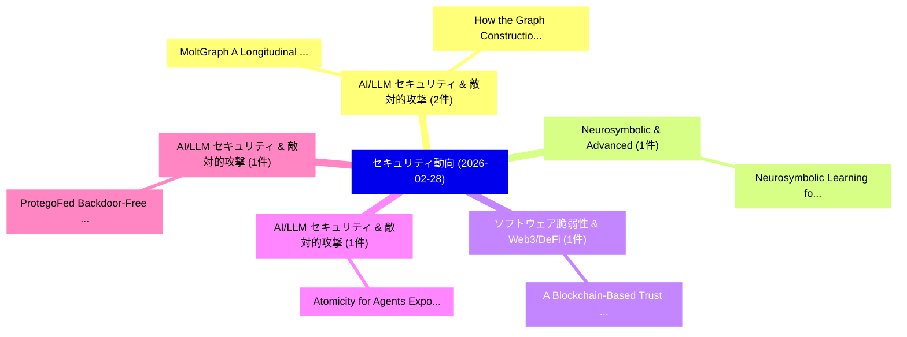

# 📅 02_daily: 日次エグゼクティブサマリー報告書 (2026-02-28)

**集計日時**: 2026-10-02 23:05:59 UTC  
**対象日付**: 2026-02-28  
**本日収集論文数**: 15 件  

---

## 💡 主要セキュリティ動向・脅威インサイト (Executive Insights)

本日の収集論文（計 15 件）において、以下の重点セキュリティ領域で活発な研究動向が確認されました：
- **AI/LLM セキュリティ & 敵対的攻撃** (2 件): 注目論文として 「MoltGraph: A Longitudinal Temp...」、「How the Graph Construction Tec...」 等が発表され、実務防御および攻撃検証の進展が見られます。
- **Neurosymbolic & Advanced** (1 件): 注目論文として 「Neurosymbolic Learning for Adv...」 等が発表され、実務防御および攻撃検証の進展が見られます。
- **ソフトウェア脆弱性 & Web3/DeFi** (1 件): 注目論文として 「A Blockchain-Based Trust Frame...」 等が発表され、実務防御および攻撃検証の進展が見られます。
- **AI/LLM セキュリティ & 敵対的攻撃** (1 件): 注目論文として 「Atomicity for Agents: Exposing...」 等が発表され、実務防御および攻撃検証の進展が見られます。
- **AI/LLM セキュリティ & 敵対的攻撃** (1 件): 注目論文として 「ProtegoFed: Backdoor-Free Fede...」 等が発表され、実務防御および攻撃検証の進展が見られます。

### 🗺️ 技術・脅威トピックマインドマップ

---

## 📌 日次セキュリティ論文一覧 (日本語表形式)

| No | arXiv ID | 論文タイトル (日本語訳) | 重要キーワード | 構造化エグゼクティブ要約 (背景・提案・影響) | 脅威分類 | 詳細リンク |
|---|---|---|---|---|---|---|
| 1 | `2603.00453v1` | [Neurosymbolic Learning for Advanced Persistent Threat Detection under Extreme Class Imbalance（セキュリティ分析論文）](../../okf/papers/2026-02-28/2603.00453.md) | `Advanced Persistent Threat Detection`, `Extreme Class Imbalance`, `Neurosymbolic Learning` | 【提案】概要 (Overview & Key Finding) 本論文「Neurosymbolic Learning for Advanced Persistent 脅威 Detec...。実証評価により経営層・セキュリティ管理者向け推奨アクション (E... | `cs.NI` | [arXiv](https://arxiv.org/abs/2603.00453v1) &#124; [OKF](../../okf/papers/2026-02-28/2603.00453.md) |
| 2 | `2603.00456v1` | [A Blockchain-Based Trust Framework for Resilient Cross-Domain UAV Service Orchestration（セキュリティ分析論文）](../../okf/papers/2026-02-28/2603.00456.md) | `Blockchain-Based Trust`, `Resilient Cross`, `Service Orchestration` | 【提案】概要 (Overview & Key Finding) 本論文「A Blockchain-Based Trust Framework for Resilient Cross-...。実証評価により経営層・セキュリティ管理者向け推奨アクション (E... | `cybersecurity` | [arXiv](https://arxiv.org/abs/2603.00456v1) &#124; [OKF](../../okf/papers/2026-02-28/2603.00456.md) |
| 3 | `2603.00476v1` | [Atomicity for Agents: Exposing, Exploiting, and Mitigating TOCTOU Vulnerabilities in Browser-Use Agents（セキュリティ分析論文）](../../okf/papers/2026-02-28/2603.00476.md) | `Use Agents`, `Browser-Use Agents`, `Linxi Jiang` | 【提案】概要 (Overview & Key Finding) 本論文「Atomicity for Agents: Exposing, Exploiting, and Mitigat...。実証評価により経営層・セキュリティ管理者向け推奨アクション (E... | `cs.AI` | [arXiv](https://arxiv.org/abs/2603.00476v1) &#124; [OKF](../../okf/papers/2026-02-28/2603.00476.md) |
| 4 | `2603.00516v1` | [ProtegoFed: Backdoor-Free Federated Instruction Tuning with Interspersed Poisoned Data（セキュリティ分析論文）](../../okf/papers/2026-02-28/2603.00516.md) | `Free Federated Instruction Tuning`, `Interspersed Poisoned Data`, `Backdoor-Free Federated` | 【提案】概要 (Overview & Key Finding) 本論文「ProtegoFed: Backdoor-Free Federated Instruction Tuning ...。実証評価により経営層・セキュリティ管理者向け推奨アクション (E... | `cybersecurity` | [arXiv](https://arxiv.org/abs/2603.00516v1) &#124; [OKF](../../okf/papers/2026-02-28/2603.00516.md) |
| 5 | `2603.00528v1` | [Time Stepped Cyber Physical Simulation of DoS, DoD, and FDI Attacks on the IEEE 14 Bus System（セキュリティ分析論文）](../../okf/papers/2026-02-28/2603.00528.md) | `Time Stepped Cyber Physical Simulation`, `Bus System`, `Manuella Christelle Tossa` | 【提案】概要 (Overview & Key Finding) 本論文「Time Stepped Cyber Physical Simulation of DoS, DoD, and...。実証評価により経営層・セキュリティ管理者向け推奨アクション (E... | `executive-summary` | [arXiv](https://arxiv.org/abs/2603.00528v1) &#124; [OKF](../../okf/papers/2026-02-28/2603.00528.md) |
| 6 | `2603.00544v1` | [On Best-Possible One-Time Programs（セキュリティ分析論文）](../../okf/papers/2026-02-28/2603.00544.md) | `Possible One`, `Time Programs`, `Best-Possible One` | 【提案】概要 (Overview & Key Finding) 本論文「On Best-Possible One-Time Programs（セキュリティ分析論文）」（原題: On ...。実証評価により経営層・セキュリティ管理者向け推奨アクション (E... | `executive-summary` | [arXiv](https://arxiv.org/abs/2603.00544v1) &#124; [OKF](../../okf/papers/2026-02-28/2603.00544.md) |
| 7 | `2603.00565v1` | [MIDAS: Multi-Image Dispersion and Semantic Reconstruction for Jailbreaking MLLMs（セキュリティ分析論文）](../../okf/papers/2026-02-28/2603.00565.md) | `Image Dispersion`, `Semantic Reconstruction`, `Multi-Image Dispersion` | 【提案】概要 (Overview & Key Finding) 本論文「MIDAS: Multi-Image Dispersion and Semantic Reconstructi...。実証評価により経営層・セキュリティ管理者向け推奨アクション (E... | `cs.AI` | [arXiv](https://arxiv.org/abs/2603.00565v1) &#124; [OKF](../../okf/papers/2026-02-28/2603.00565.md) |
| 8 | `2603.00646v2` | [MoltGraph: A Longitudinal Temporal Graph Dataset of Moltbook for Coordinated-Agent Detection（セキュリティ分析論文）](../../okf/papers/2026-02-28/2603.00646.md) | `Longitudinal Temporal Graph Dataset`, `Agent Detection`, `Coordinated-Agent Detection` | 【提案】概要 (Overview & Key Finding) 本論文「MoltGraph: A Longitudinal Temporal Graph Dataset of Mol...。実証評価により経営層・セキュリティ管理者向け推奨アクション (E... | `executive-summary` | [arXiv](https://arxiv.org/abs/2603.00646v2) &#124; [OKF](../../okf/papers/2026-02-28/2603.00646.md) |
| 9 | `2603.00708v1` | [The On-Chain and Off-Chain Mechanisms of DAO-to-DAO Voting（セキュリティ分析論文）](../../okf/papers/2026-02-28/2603.00708.md) | `Chain Mechanisms`, `Off-Chain Mechanisms`, `Thomas Lloyd` | 【提案】概要 (Overview & Key Finding) 本論文「The On-Chain and Off-Chain Mechanisms of DAO-to-DAO Vot...。実証評価により経営層・セキュリティ管理者向け推奨アクション (E... | `executive-summary` | [arXiv](https://arxiv.org/abs/2603.00708v1) &#124; [OKF](../../okf/papers/2026-02-28/2603.00708.md) |
| 10 | `2603.00711v1` | [IU: Imperceptible Universal Backdoor Attack（セキュリティ分析論文）](../../okf/papers/2026-02-28/2603.00711.md) | `Imperceptible Universal Backdoor Attack`, `Hsin Lin`, `Lun Chen` | 【提案】概要 (Overview & Key Finding) 本論文「IU: Imperceptible Universal Backdoor Attack（セキュリティ分析論文）...。実証評価により経営層・セキュリティ管理者向け推奨アクション (E... | `cs.CV` | [arXiv](https://arxiv.org/abs/2603.00711v1) &#124; [OKF](../../okf/papers/2026-02-28/2603.00711.md) |
| 11 | `2603.00841v1` | [Security Is Not Enough: Privacy in Encryption Regulation and Lawful-Surveillance Protocols（セキュリティ分析論文）](../../okf/papers/2026-02-28/2603.00841.md) | `Encryption Regulation`, `Surveillance Protocols`, `Lawful-Surveillance Protocols` | 【提案】背景とセキュリティ上の課題 (Background & Problem) 本研究はサイバー脅威環境におけるセキュリティ構造・脆弱性の検証を目的としています。(主要検出項目: ...。実証評価により経営層・セキュリティ管理者向け推奨アクション (E... | `executive-summary` | [arXiv](https://arxiv.org/abs/2603.00841v1) &#124; [OKF](../../okf/papers/2026-02-28/2603.00841.md) |
| 12 | `2603.02262v1` | [Silent Sabotage During Fine-Tuning: Few-Shot Rationale Poisoning of Compact Medical LLMs（セキュリティ分析論文）](../../okf/papers/2026-02-28/2603.02262.md) | `Shot Rationale Poisoning`, `Compact Medical`, `Few-Shot Rationale` | 【提案】概要 (Overview & Key Finding) 本論文「Silent Sabotage During Fine-Tuning: Few-Shot Rationale ...。実証評価により経営層・セキュリティ管理者向け推奨アクション (E... | `cs.AI` | [arXiv](https://arxiv.org/abs/2603.02262v1) &#124; [OKF](../../okf/papers/2026-02-28/2603.02262.md) |
| 13 | `2603.06654v1` | [How the Graph Construction Technique Shapes Performance in IoT Botnet Detection（セキュリティ分析論文）](../../okf/papers/2026-02-28/2603.06654.md) | `Graph Construction Technique Shapes Performance`, `Botnet Detection`, `Hassan Wasswa` | 【提案】概要 (Overview & Key Finding) 本論文「How the Graph Construction Technique Shapes Performance...。実証評価により経営層・セキュリティ管理者向け推奨アクション (E... | `cs.NI` | [arXiv](https://arxiv.org/abs/2603.06654v1) &#124; [OKF](../../okf/papers/2026-02-28/2603.06654.md) |
| 14 | `2603.13290v1` | [TAS-GNN: A Status-Aware Signed Graph Neural Network for Anomaly Detection in Bitcoin Trust Systems（セキュリティ分析論文）](../../okf/papers/2026-02-28/2603.13290.md) | `Aware Signed Graph Neural Network`, `Bitcoin Trust Systems`, `Anomaly Detection` | 【提案】概要 (Overview & Key Finding) 本論文「TAS-GNN: A Status-Aware Signed Graph Neural Network for...。実証評価により経営層・セキュリティ管理者向け推奨アクション (E... | `cs.AI` | [arXiv](https://arxiv.org/abs/2603.13290v1) &#124; [OKF](../../okf/papers/2026-02-28/2603.13290.md) |
| 15 | `2603.13293v2` | [A Robust Framework for Secure Cardiovascular Risk Prediction: An Architectural Case Study of Differentially Private 連合学習](../../okf/papers/2026-02-28/2603.13293.md) | `Secure Cardiovascular Risk Prediction`, `Differentially Private Federated Learning`, `Differentially Private` | 【提案】概要 (Overview & Key Finding) 本論文「A Robust Framework for Secure Cardiovascular Risk Predi...。実証評価により経営層・セキュリティ管理者向け推奨アクション (E... | `cs.AI` | [arXiv](https://arxiv.org/abs/2603.13293v2) &#124; [OKF](../../okf/papers/2026-02-28/2603.13293.md) |

