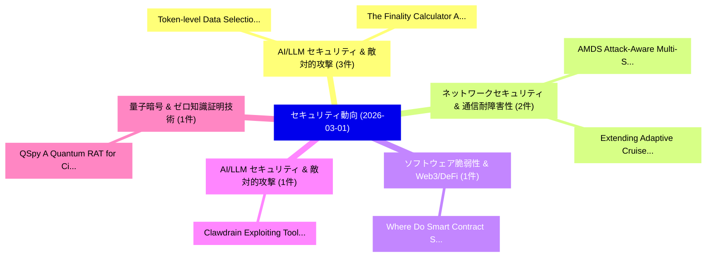

# 📅 02_daily: 日次エグゼクティブサマリー報告書 (2026-03-01)

**集計日時**: 2026-10-02 23:05:59 UTC  
**対象日付**: 2026-03-01  
**本日収集論文数**: 19 件  

---

## 💡 主要セキュリティ動向・脅威インサイト (Executive Insights)

本日の収集論文（計 19 件）において、以下の重点セキュリティ領域で活発な研究動向が確認されました：
- **AI/LLM セキュリティ & 敵対的攻撃** (3 件): 注目論文として 「Token-level Data Selection for...」、「The Finality Calculator: Analy...」 等が発表され、実務防御および攻撃検証の進展が見られます。
- **ネットワークセキュリティ & 通信耐障害性** (2 件): 注目論文として 「AMDS: Attack-Aware Multi-Stage...」、「Extending Adaptive Cruise Cont...」 等が発表され、実務防御および攻撃検証の進展が見られます。
- **ソフトウェア脆弱性 & Web3/DeFi** (1 件): 注目論文として 「Where Do Smart Contract Securi...」 等が発表され、実務防御および攻撃検証の進展が見られます。
- **AI/LLM セキュリティ & 敵対的攻撃** (1 件): 注目論文として 「Clawdrain: Exploiting Tool-Cal...」 等が発表され、実務防御および攻撃検証の進展が見られます。
- **量子暗号 & ゼロ知識証明技術** (1 件): 注目論文として 「QSpy: A Quantum RAT for Circui...」 等が発表され、実務防御および攻撃検証の進展が見られます。

### 🗺️ 技術・脅威トピックマインドマップ

---

## 📌 日次セキュリティ論文一覧 (日本語表形式)

| No | arXiv ID | 論文タイトル (日本語訳) | 重要キーワード | 構造化エグゼクティブ要約 (背景・提案・影響) | 脅威分類 | 詳細リンク |
|---|---|---|---|---|---|---|
| 1 | `2603.00859v1` | [AMDS: Attack-Aware Multi-Stage Defense System for Network Intrusion Detection with Two-Stage Adaptive Weight Learning（セキュリティ分析論文）](../../okf/papers/2026-03-01/2603.00859.md) | `Stage Defense System`, `Stage Adaptive Weight Learning`, `Network Intrusion Detection` | 【提案】概要 (Overview & Key Finding) 本論文「AMDS: Attack-Aware Multi-Stage Defense System for Netwo...。実証評価により経営層・セキュリティ管理者向け推奨アクション (E... | `cs.AI` | [arXiv](https://arxiv.org/abs/2603.00859v1) &#124; [OKF](../../okf/papers/2026-03-01/2603.00859.md) |
| 2 | `2603.00890v1` | [Where Do Smart Contract Security Analyzers Fall Short?（セキュリティ分析論文）](../../okf/papers/2026-03-01/2603.00890.md) | `Tamer Abdelaziz`, `Salma Alsaghir`, `Karim Ali` | 【提案】### (日本語題名: Where Do スマートコントラクト Security Analyzers Fall Short?（セキュリティ分析論文）)  > [!NOTE] ...。実証評価により経営層・セキュリティ管理者向け推奨アクション (E... | `executive-summary` | [arXiv](https://arxiv.org/abs/2603.00890v1) &#124; [OKF](../../okf/papers/2026-03-01/2603.00890.md) |
| 3 | `2603.00902v1` | [Clawdrain: Exploiting Tool-Calling Chains for Stealthy Token Exhaustion in OpenClaw Agents（セキュリティ分析論文）](../../okf/papers/2026-03-01/2603.00902.md) | `Stealthy Token Exhaustion`, `Exploiting Tool`, `Calling Chains` | 【提案】概要 (Overview & Key Finding) 本論文「Clawdrain: Exploiting Tool-Calling Chains for Stealthy ...。実証評価により経営層・セキュリティ管理者向け推奨アクション (E... | `executive-summary` | [arXiv](https://arxiv.org/abs/2603.00902v1) &#124; [OKF](../../okf/papers/2026-03-01/2603.00902.md) |
| 4 | `2603.00950v1` | [QSpy: A Quantum RAT for Circuit Spying and IP Theft（セキュリティ分析論文）](../../okf/papers/2026-03-01/2603.00950.md) | `Circuit Spying`, `Amal Raj`, `Vivek Balachandran` | 【提案】概要 (Overview & Key Finding) 本論文「QSpy: A 量子 RAT for Circuit Spying and IP Theft（セキュリティ分析...。実証評価により経営層・セキュリティ管理者向け推奨アクション (E... | `cybersecurity` | [arXiv](https://arxiv.org/abs/2603.00950v1) &#124; [OKF](../../okf/papers/2026-03-01/2603.00950.md) |
| 5 | `2603.00960v1` | [AWE: Adaptive Agents for Dynamic Web Penetration Testing（セキュリティ分析論文）](../../okf/papers/2026-03-01/2603.00960.md) | `Dynamic Web Penetration Testing`, `Adaptive Agents`, `Akshat Singh Jaswal` | 【提案】概要 (Overview & Key Finding) 本論文「AWE: Adaptive Agents for Dynamic Web Penetration Testin...。実証評価により経営層・セキュリティ管理者向け推奨アクション (E... | `cs.AI` | [arXiv](https://arxiv.org/abs/2603.00960v1) &#124; [OKF](../../okf/papers/2026-03-01/2603.00960.md) |
| 6 | `2603.01019v1` | [BadRSSD: Backdoor Attacks on Regularized Self-Supervised Diffusion Models（セキュリティ分析論文）](../../okf/papers/2026-03-01/2603.01019.md) | `Supervised Diffusion Models`, `Backdoor Attacks`, `Regularized Self` | 【提案】概要 (Overview & Key Finding) 本論文「BadRSSD: Backdoor Attacks on Regularized Self-Supervise...。実証評価により経営層・セキュリティ管理者向け推奨アクション (E... | `executive-summary` | [arXiv](https://arxiv.org/abs/2603.01019v1) &#124; [OKF](../../okf/papers/2026-03-01/2603.01019.md) |
| 7 | `2603.01053v1` | [Turning Black Box into White Box: Dataset Distillation Leaks（セキュリティ分析論文）](../../okf/papers/2026-03-01/2603.01053.md) | `Turning Black Box`, `Dataset Distillation Leaks`, `White Box` | 【提案】概要 (Overview & Key Finding) 本論文「Turning Black Box into White Box: Dataset Distillation ...。実証評価により経営層・セキュリティ管理者向け推奨アクション (E... | `cs.AI` | [arXiv](https://arxiv.org/abs/2603.01053v1) &#124; [OKF](../../okf/papers/2026-03-01/2603.01053.md) |
| 8 | `2603.01060v2` | [Power Network SCADA Quantum Communications: A Comparison of BB84, B92, E91, and SGS04 Quantum Key Distribution Protocols（セキュリティ分析論文）](../../okf/papers/2026-03-01/2603.01060.md) | `Quantum Key Distribution Protocols`, `Power Network`, `Quantum Communications` | 【提案】概要 (Overview & Key Finding) 本論文「Power Network SCADA 量子 Communications: A Comparison of ...。実証評価により経営層・セキュリティ管理者向け推奨アクション (E... | `executive-summary` | [arXiv](https://arxiv.org/abs/2603.01060v2) &#124; [OKF](../../okf/papers/2026-03-01/2603.01060.md) |
| 9 | `2603.01067v1` | [Hide&Seek: Remove Image Watermarks with Negligible Cost via Pixel-wise Reconstruction（セキュリティ分析論文）](../../okf/papers/2026-03-01/2603.01067.md) | `Remove Image Watermarks`, `Negligible Cost`, `Pixel-wise Reconstruction` | 【提案】概要 (Overview & Key Finding) 本論文「Hide&Seek: Remove Image Watermarks with Negligible Cost...。実証評価により経営層・セキュリティ管理者向け推奨アクション (E... | `cs.AI` | [arXiv](https://arxiv.org/abs/2603.01067v1) &#124; [OKF](../../okf/papers/2026-03-01/2603.01067.md) |
| 10 | `2603.01091v1` | [On the Practical Feasibility of Harvest-Now, Decrypt-Later Attacks（セキュリティ分析論文）](../../okf/papers/2026-03-01/2603.01091.md) | `Practical Feasibility`, `Later Attacks`, `Decrypt-Later Attacks` | 【提案】概要 (Overview & Key Finding) 本論文「On the Practical Feasibility of Harvest-Now, Decrypt-La...。実証評価により経営層・セキュリティ管理者向け推奨アクション (E... | `cybersecurity` | [arXiv](https://arxiv.org/abs/2603.01091v1) &#124; [OKF](../../okf/papers/2026-03-01/2603.01091.md) |
| 11 | `2603.01154v2` | [vEcho: A Paradigm Shift from Vulnerability Verification to Proactive Discovery with 大規模言語モデル](../../okf/papers/2026-03-01/2603.01154.md) | `Paradigm Shift`, `Vulnerability Verification`, `Proactive Discovery` | 【提案】概要 (Overview & Key Finding) 本論文「vEcho: A Paradigm Shift from 脆弱性 Verification to Proact...。実証評価により経営層・セキュリティ管理者向け推奨アクション (E... | `cybersecurity` | [arXiv](https://arxiv.org/abs/2603.01154v2) &#124; [OKF](../../okf/papers/2026-03-01/2603.01154.md) |
| 12 | `2603.01170v2` | [ATLAS: AI-Assisted Threat-to-Assertion Learning for System-on-Chip Security Verification（セキュリティ分析論文）](../../okf/papers/2026-03-01/2603.01170.md) | `Chip Security Verification`, `Assisted Threat`, `Assertion Learning` | 【提案】概要 (Overview & Key Finding) 本論文「ATLAS: AI-Assisted 脅威-to-Assertion Learning for System-...。実証評価により経営層・セキュリティ管理者向け推奨アクション (E... | `cs.AI` | [arXiv](https://arxiv.org/abs/2603.01170v2) &#124; [OKF](../../okf/papers/2026-03-01/2603.01170.md) |
| 13 | `2603.01173v1` | [Extending Adaptive Cruise Control with Machine Learning Intrusion Detection Systems（セキュリティ分析論文）](../../okf/papers/2026-03-01/2603.01173.md) | `Extending Adaptive Cruise Control`, `Machine Learning Intrusion Detection Systems`, `Machine Learning Intrusion Detection` | 【提案】概要 (Overview & Key Finding) 本論文「Extending Adaptive Cruise Control with Machine Learning...。実証評価により経営層・セキュリティ管理者向け推奨アクション (E... | `executive-summary` | [arXiv](https://arxiv.org/abs/2603.01173v1) &#124; [OKF](../../okf/papers/2026-03-01/2603.01173.md) |
| 14 | `2603.01179v2` | [A402: Binding Cryptocurrency Payments to Service Execution for Agentic Commerce（セキュリティ分析論文）](../../okf/papers/2026-03-01/2603.01179.md) | `Binding Cryptocurrency Payments`, `Service Execution`, `Agentic Commerce` | 【提案】概要 (Overview & Key Finding) 本論文「A402: Binding Cryptocurrency Payments to Service Execut...。実証評価により経営層・セキュリティ管理者向け推奨アクション (E... | `executive-summary` | [arXiv](https://arxiv.org/abs/2603.01179v2) &#124; [OKF](../../okf/papers/2026-03-01/2603.01179.md) |
| 15 | `2603.01185v1` | [Token-level Data Selection for Safe LLM Fine-tuning（セキュリティ分析論文）](../../okf/papers/2026-03-01/2603.01185.md) | `Data Selection`, `Token-level Data`, `Yanping Li` | 【提案】概要 (Overview & Key Finding) 本論文「Token-level Data Selection for Safe LLM Fine-tuning（セキュ...。実証評価により経営層・セキュリティ管理者向け推奨アクション (E... | `cs.AI` | [arXiv](https://arxiv.org/abs/2603.01185v1) &#124; [OKF](../../okf/papers/2026-03-01/2603.01185.md) |
| 16 | `2603.01246v2` | [Defensive Refusal Bias: How Safety Alignment Fails Cyber Defenders（セキュリティ分析論文）](../../okf/papers/2026-03-01/2603.01246.md) | `Defensive Refusal Bias`, `Udari Madhushani Sehwag`, `David Campbell` | 【提案】概要 (Overview & Key Finding) 本論文「Defensive Refusal Bias: How Safety Alignment Fails Cybe...。実証評価により経営層・セキュリティ管理者向け推奨アクション (E... | `cs.AI` | [arXiv](https://arxiv.org/abs/2603.01246v2) &#124; [OKF](../../okf/papers/2026-03-01/2603.01246.md) |
| 17 | `2603.01257v1` | [A Systematic Study of LLM-Based Architectures for Automated Patching（セキュリティ分析論文）](../../okf/papers/2026-03-01/2603.01257.md) | `Based Architectures`, `Automated Patching`, `LLM-Based Architectures` | 【提案】概要 (Overview & Key Finding) 本論文「A Systematic Study of LLM-Based Architectures for Autom...。実証評価により経営層・セキュリティ管理者向け推奨アクション (E... | `executive-summary` | [arXiv](https://arxiv.org/abs/2603.01257v1) &#124; [OKF](../../okf/papers/2026-03-01/2603.01257.md) |
| 18 | `2603.01307v2` | [The Finality Calculator: Analyzing and Quantifying Filecoin's Finality Guarantees（セキュリティ分析論文）](../../okf/papers/2026-03-01/2603.01307.md) | `Quantifying Filecoin`, `Finality Guarantees`, `Guy Goren` | 【提案】概要 (Overview & Key Finding) 本論文「The Finality Calculator: Analyzing and Quantifying File...。実証評価により経営層・セキュリティ管理者向け推奨アクション (E... | `executive-summary` | [arXiv](https://arxiv.org/abs/2603.01307v2) &#124; [OKF](../../okf/papers/2026-03-01/2603.01307.md) |
| 19 | `2603.02277v3` | [Quantifying Frontier LLM Capabilities for Container Sandbox Escape（セキュリティ分析論文）](../../okf/papers/2026-03-01/2603.02277.md) | `Container Sandbox Escape`, `Quantifying Frontier`, `Philippos Maximos Giavridis` | 【提案】概要 (Overview & Key Finding) 本論文「Quantifying Frontier LLM Capabilities for Container San...。実証評価により経営層・セキュリティ管理者向け推奨アクション (E... | `cs.AI` | [arXiv](https://arxiv.org/abs/2603.02277v3) &#124; [OKF](../../okf/papers/2026-03-01/2603.02277.md) |

