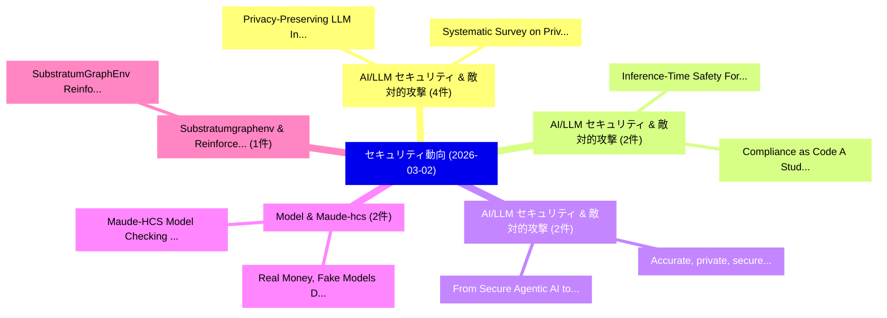

# 📅 02_daily: 日次エグゼクティブサマリー報告書 (2026-03-02)

**集計日時**: 2026-10-02 23:05:59 UTC  
**対象日付**: 2026-03-02  
**本日収集論文数**: 27 件  

---

## 💡 主要セキュリティ動向・脅威インサイト (Executive Insights)

本日の収集論文（計 27 件）において、以下の重点セキュリティ領域で活発な研究動向が確認されました：
- **AI/LLM セキュリティ & 敵対的攻撃** (4 件): 注目論文として 「Privacy-Preserving LLM Inferen...」、「Systematic Survey on Privacy-P...」 等が発表され、実務防御および攻撃検証の進展が見られます。
- **AI/LLM セキュリティ & 敵対的攻撃** (2 件): 注目論文として 「Inference-Time Safety For Code...」、「Compliance as Code: A Study of...」 等が発表され、実務防御および攻撃検証の進展が見られます。
- **AI/LLM セキュリティ & 敵対的攻撃** (2 件): 注目論文として 「From Secure Agentic AI to Secu...」、「Accurate, private, secure, fed...」 等が発表され、実務防御および攻撃検証の進展が見られます。
- **Model & Maude-hcs** (2 件): 注目論文として 「Real Money, Fake Models: Decep...」、「Maude-HCS: Model Checking the ...」 等が発表され、実務防御および攻撃検証の進展が見られます。
- **Substratumgraphenv & Reinforcement** (1 件): 注目論文として 「SubstratumGraphEnv: Reinforcem...」 等が発表され、実務防御および攻撃検証の進展が見られます。

### 🗺️ 技術・脅威トピックマインドマップ

---

## 📌 日次セキュリティ論文一覧 (日本語表形式)

| No | arXiv ID | 論文タイトル (日本語訳) | 重要キーワード | 構造化エグゼクティブ要約 (背景・提案・影響) | 脅威分類 | 詳細リンク |
|---|---|---|---|---|---|---|
| 1 | `2603.01340v1` | [SubstratumGraphEnv: Reinforcement Learning Environment (RLE) for Modeling System Attack Paths（セキュリティ分析論文）](../../okf/papers/2026-03-02/2603.01340.md) | `Modeling System Attack Paths`, `Reinforcement Learning Environment`, `Bahirah Adewunmi` | 【提案】概要 (Overview & Key Finding) 本論文「SubstratumGraphEnv: Reinforcement Learning Environment ...。実証評価により経営層・セキュリティ管理者向け推奨アクション (E... | `cs.AI` | [arXiv](https://arxiv.org/abs/2603.01340v1) &#124; [OKF](../../okf/papers/2026-03-02/2603.01340.md) |
| 2 | `2603.01393v1` | [NP-Completeness and Physical Zero-Knowledge Proof of Hotaru Beam（セキュリティ分析論文）](../../okf/papers/2026-03-02/2603.01393.md) | `Physical Zero`, `Knowledge Proof`, `Hotaru Beam` | 【提案】概要 (Overview & Key Finding) 本論文「NP-Completeness and Physical ゼロ知識証明 of Hotaru Beam（セキュリ...。実証評価により経営層・セキュリティ管理者向け推奨アクション (E... | `executive-summary` | [arXiv](https://arxiv.org/abs/2603.01393v1) &#124; [OKF](../../okf/papers/2026-03-02/2603.01393.md) |
| 3 | `2603.01494v1` | [Inference-Time Safety For Code LLMs Via Retrieval-Augmented Revision（セキュリティ分析論文）](../../okf/papers/2026-03-02/2603.01494.md) | `Via Retrieval`, `Augmented Revision`, `Inference-Time Safety` | 【提案】概要 (Overview & Key Finding) 本論文「Inference-Time Safety For Code LLMs Via Retrieval-Augme...。実証評価により経営層・セキュリティ管理者向け推奨アクション (E... | `cs.AI` | [arXiv](https://arxiv.org/abs/2603.01494v1) &#124; [OKF](../../okf/papers/2026-03-02/2603.01494.md) |
| 4 | `2603.01499v2` | [Privacy-Preserving LLM Inference via Covariant Obfuscation (Technical Report)に向けて](../../okf/papers/2026-03-02/2603.01499.md) | `Privacy-Preserving LLM`, `Covariant Obfuscation`, `Technical Report` | 【提案】概要 (Overview & Key Finding) 本論文「Privacy-Preserving LLM Inference via Covariant Obfuscat...。実証評価により経営層・セキュリティ管理者向け推奨アクション (E... | `cs.AI` | [arXiv](https://arxiv.org/abs/2603.01499v2) &#124; [OKF](../../okf/papers/2026-03-02/2603.01499.md) |
| 5 | `2603.01520v1` | [Compliance as Code: A Study of Linux Distributions and Beyond（セキュリティ分析論文）](../../okf/papers/2026-03-02/2603.01520.md) | `Linux Distributions`, `Esmot Ara Tuli`, `Jukka Ruohonen` | 【提案】概要 (Overview & Key Finding) 本論文「Compliance as Code: A Study of Linux Distributions and ...。実証評価により経営層・セキュリティ管理者向け推奨アクション (E... | `executive-summary` | [arXiv](https://arxiv.org/abs/2603.01520v1) &#124; [OKF](../../okf/papers/2026-03-02/2603.01520.md) |
| 6 | `2603.01564v1` | [From Secure Agentic AI to Secure Agentic Web: Challenges, Threats, and Future Directions（セキュリティ分析論文）](../../okf/papers/2026-03-02/2603.01564.md) | `Secure Agentic Web`, `Future Directions`, `Zhihang Deng` | 【提案】概要 (Overview & Key Finding) 本論文「From Secure Agentic AI to Secure Agentic Web: Challenge...。実証評価により経営層・セキュリティ管理者向け推奨アクション (E... | `cybersecurity` | [arXiv](https://arxiv.org/abs/2603.01564v1) &#124; [OKF](../../okf/papers/2026-03-02/2603.01564.md) |
| 7 | `2603.01574v1` | [DualSentinel: A Lightweight Framework for Detecting Targeted Attacks in Black-box LLM via Dual Entropy Lull Pattern（セキュリティ分析論文）](../../okf/papers/2026-03-02/2603.01574.md) | `Dual Entropy Lull Pattern`, `Detecting Targeted Attacks`, `Black-box LLM` | 【提案】概要 (Overview & Key Finding) 本論文「DualSentinel: A Lightweight Framework for Detecting Tar...。実証評価により経営層・セキュリティ管理者向け推奨アクション (E... | `cs.AI` | [arXiv](https://arxiv.org/abs/2603.01574v1) &#124; [OKF](../../okf/papers/2026-03-02/2603.01574.md) |
| 8 | `2603.01621v1` | [Information-Theoretic Digital Twins for Stealthy Attack Detection in Industrial Control Systems: A Closed-Form KL Divergence Approach（セキュリティ分析論文）](../../okf/papers/2026-03-02/2603.01621.md) | `Theoretic Digital Twins`, `Stealthy Attack Detection`, `Industrial Control Systems` | 【提案】概要 (Overview & Key Finding) 本論文「Information-Theoretic Digital Twins for Stealthy Attack...。実証評価により経営層・セキュリティ管理者向け推奨アクション (E... | `executive-summary` | [arXiv](https://arxiv.org/abs/2603.01621v1) &#124; [OKF](../../okf/papers/2026-03-02/2603.01621.md) |
| 9 | `2603.01784v1` | [Co-Evolutionary Multi-Modal Alignment via Structured Adversarial Evolution（セキュリティ分析論文）](../../okf/papers/2026-03-02/2603.01784.md) | `Structured Adversarial Evolution`, `Evolutionary Multi`, `Modal Alignment` | 【提案】概要 (Overview & Key Finding) 本論文「Co-Evolutionary Multi-Modal Alignment via Structured Ad...。実証評価により経営層・セキュリティ管理者向け推奨アクション (E... | `cs.AI` | [arXiv](https://arxiv.org/abs/2603.01784v1) &#124; [OKF](../../okf/papers/2026-03-02/2603.01784.md) |
| 10 | `2603.01789v1` | [Can LLMs Hack Enterprise Networks? -- Replicated Computational Results (RCR) Report（セキュリティ分析論文）](../../okf/papers/2026-03-02/2603.01789.md) | `Hack Enterprise Networks`, `Andreas Happe`, `Raw Meta` | 【提案】-- Replicated Computational Results (RCR) Report ### (日本語題名: Can LLMs Hack Enterprise N...。実証評価により経営層・セキュリティ管理者向け推奨アクション (E... | `cybersecurity` | [arXiv](https://arxiv.org/abs/2603.01789v1) &#124; [OKF](../../okf/papers/2026-03-02/2603.01789.md) |
| 11 | `2603.01874v1` | [Phishing the Phishers with SpecularNet: Hierarchical Graph Autoencoding for Reference-Free Web Phishing Detection（セキュリティ分析論文）](../../okf/papers/2026-03-02/2603.01874.md) | `Free Web Phishing Detection`, `Hierarchical Graph Autoencoding`, `Reference-Free Web` | 【提案】概要 (Overview & Key Finding) 本論文「Phishing the Phishers with SpecularNet: Hierarchical Gr...。実証評価により経営層・セキュリティ管理者向け推奨アクション (E... | `cs.AI` | [arXiv](https://arxiv.org/abs/2603.01874v1) &#124; [OKF](../../okf/papers/2026-03-02/2603.01874.md) |
| 12 | `2603.01876v2` | [Systematic Survey on Privacy-Preserving Architectures for IoT and Vehicular Data Sharing: Techniques, Challenges, and Future Directions（セキュリティ分析論文）](../../okf/papers/2026-03-02/2603.01876.md) | `Vehicular Data Sharing`, `Systematic Survey`, `Preserving Architectures` | 【提案】概要 (Overview & Key Finding) 本論文「Systematic Survey on Privacy-Preserving Architectures f...。実証評価により経営層・セキュリティ管理者向け推奨アクション (E... | `cybersecurity` | [arXiv](https://arxiv.org/abs/2603.01876v2) &#124; [OKF](../../okf/papers/2026-03-02/2603.01876.md) |
| 13 | `2603.01919v2` | [Real Money, Fake Models: Deceptive Model Claims in Shadow APIs（セキュリティ分析論文）](../../okf/papers/2026-03-02/2603.01919.md) | `Deceptive Model Claims`, `Real Money`, `Fake Models` | 【提案】概要 (Overview & Key Finding) 本論文「Real Money, Fake Models: Deceptive Model Claims in Shad...。実証評価により経営層・セキュリティ管理者向け推奨アクション (E... | `cs.AI` | [arXiv](https://arxiv.org/abs/2603.01919v2) &#124; [OKF](../../okf/papers/2026-03-02/2603.01919.md) |
| 14 | `2603.01958v1` | [SoK: Is Sustainable the New Usable? Debunking The Myth of Fundamental Incompatibility Between Security and Sustainability（セキュリティ分析論文）](../../okf/papers/2026-03-02/2603.01958.md) | `New Usable`, `Maxwell Keleher`, `David Barrera` | 【提案】Debunking The Myth of Fundamental Incompatibility Between Security and Sustainability #...。実証評価により経営層・セキュリティ管理者向け推奨アクション (E... | `executive-summary` | [arXiv](https://arxiv.org/abs/2603.01958v1) &#124; [OKF](../../okf/papers/2026-03-02/2603.01958.md) |
| 15 | `2603.01986v1` | [Accurate, private, secure, federated U-statistics with higher degree（セキュリティ分析論文）](../../okf/papers/2026-03-02/2603.01986.md) | `Quentin Sinh`, `Jan Ramon`, `Raw Meta` | 【提案】概要 (Overview & Key Finding) 本論文「Accurate, private, secure, federated U-statistics with ...。実証評価により経営層・セキュリティ管理者向け推奨アクション (E... | `executive-summary` | [arXiv](https://arxiv.org/abs/2603.01986v1) &#124; [OKF](../../okf/papers/2026-03-02/2603.01986.md) |
| 16 | `2603.02017v1` | [Protection against Source Inference Attacks in 連合学習](../../okf/papers/2026-03-02/2603.02017.md) | `Source Inference Attacks`, `Federated Learning`, `Andreas Athanasiou` | 【提案】概要 (Overview & Key Finding) 本論文「Protection against Source Inference Attacks in 連合学習」（原題...。実証評価により経営層・セキュリティ管理者向け推奨アクション (E... | `cybersecurity` | [arXiv](https://arxiv.org/abs/2603.02017v1) &#124; [OKF](../../okf/papers/2026-03-02/2603.02017.md) |
| 17 | `2603.02071v2` | [Subcubic Coin Tossing in Asynchrony without PKI（セキュリティ分析論文）](../../okf/papers/2026-03-02/2603.02071.md) | `Subcubic Coin Tossing`, `Mose Mizrahi`, `Roger Wattenhofer` | 【提案】背景とセキュリティ上の課題 (Background & Problem) 本研究はサイバー脅威環境におけるセキュリティ構造・脆弱性の検証を目的としています。(主要検出項目: ...。実証評価により経営層・セキュリティ管理者向け推奨アクション (E... | `executive-summary` | [arXiv](https://arxiv.org/abs/2603.02071v2) &#124; [OKF](../../okf/papers/2026-03-02/2603.02071.md) |
| 18 | `2603.02161v1` | [Boosting Device Utilization in Control Flow Auditing（セキュリティ分析論文）](../../okf/papers/2026-03-02/2603.02161.md) | `Boosting Device Utilization`, `Control Flow Auditing`, `Ivan De Oliveira Nunes` | 【提案】概要 (Overview & Key Finding) 本論文「Boosting Device Utilization in Control Flow Auditing（セキ...。実証評価により経営層・セキュリティ管理者向け推奨アクション (E... | `cybersecurity` | [arXiv](https://arxiv.org/abs/2603.02161v1) &#124; [OKF](../../okf/papers/2026-03-02/2603.02161.md) |
| 19 | `2603.02297v1` | [ZeroDayBench: Evaluating LLMエージェント on Unseen Zero-Day Vulnerabilities for Cyberdefense](../../okf/papers/2026-03-02/2603.02297.md) | `Unseen Zero`, `Day Vulnerabilities`, `Zero-Day Vulnerabilities` | 【提案】概要 (Overview & Key Finding) 本論文「ZeroDayBench: Evaluating LLMエージェント on Unseen Zero-Day V...。実証評価により経営層・セキュリティ管理者向け推奨アクション (E... | `cs.AI` | [arXiv](https://arxiv.org/abs/2603.02297v1) &#124; [OKF](../../okf/papers/2026-03-02/2603.02297.md) |
| 20 | `2603.02378v2` | [Authenticated Contradictions from Desynchronized Provenance and Watermarking（セキュリティ分析論文）](../../okf/papers/2026-03-02/2603.02378.md) | `Authenticated Contradictions`, `Desynchronized Provenance`, `Alexander Nemecek` | 【提案】概要 (Overview & Key Finding) 本論文「Authenticated Contradictions from Desynchronized Proven...。実証評価により経営層・セキュリティ管理者向け推奨アクション (E... | `cs.MM` | [arXiv](https://arxiv.org/abs/2603.02378v2) &#124; [OKF](../../okf/papers/2026-03-02/2603.02378.md) |
| 21 | `2603.02436v1` | [TraceGuard: Process-Guided Firewall against Reasoning Backdoors in 大規模言語モデル](../../okf/papers/2026-03-02/2603.02436.md) | `Guided Firewall`, `Reasoning Backdoors`, `Process-Guided Firewall` | 【提案】概要 (Overview & Key Finding) 本論文「TraceGuard: Process-Guided Firewall against Reasoning B...。実証評価により経営層・セキュリティ管理者向け推奨アクション (E... | `cybersecurity` | [arXiv](https://arxiv.org/abs/2603.02436v1) &#124; [OKF](../../okf/papers/2026-03-02/2603.02436.md) |
| 22 | `2603.02451v1` | [Composable Attestation: A Generalized Framework for Continuous and Incremental Trust in AI-Driven Distributed Systems（セキュリティ分析論文）](../../okf/papers/2026-03-02/2603.02451.md) | `Driven Distributed Systems`, `Composable Attestation`, `Incremental Trust` | 【提案】概要 (Overview & Key Finding) 本論文「Composable Attestation: A Generalized Framework for Con...。実証評価により経営層・セキュリティ管理者向け推奨アクション (E... | `cybersecurity` | [arXiv](https://arxiv.org/abs/2603.02451v1) &#124; [OKF](../../okf/papers/2026-03-02/2603.02451.md) |
| 23 | `2603.03369v1` | [Maude-HCS: Model Checking the Undetectability-Performance Tradeoffs of Hidden Communication Systems（セキュリティ分析論文）](../../okf/papers/2026-03-02/2603.03369.md) | `Hidden Communication Systems`, `Model Checking`, `Performance Tradeoffs` | 【提案】概要 (Overview & Key Finding) 本論文「Maude-HCS: Model Checking the Undetectability-Performan...。実証評価により経営層・セキュリティ管理者向け推奨アクション (E... | `cybersecurity` | [arXiv](https://arxiv.org/abs/2603.03369v1) &#124; [OKF](../../okf/papers/2026-03-02/2603.03369.md) |
| 24 | `2603.03371v1` | [Sleeper Cell: Injecting Latent Malice Temporal Backdoors into Tool-Using LLMs（セキュリティ分析論文）](../../okf/papers/2026-03-02/2603.03371.md) | `Injecting Latent Malice Temporal Backdoors`, `Sleeper Cell`, `Tool-Using LLMs` | 【提案】概要 (Overview & Key Finding) 本論文「Sleeper Cell: Injecting Latent Malice Temporal Backdoor...。実証評価により経営層・セキュリティ管理者向け推奨アクション (E... | `cs.AI` | [arXiv](https://arxiv.org/abs/2603.03371v1) &#124; [OKF](../../okf/papers/2026-03-02/2603.03371.md) |
| 25 | `2603.04456v1` | [How Effective Are Publicly Accessible Deepfake Detection Tools? A Comparative Evaluation of Open-Source and Free-to-Use Platforms（セキュリティ分析論文）](../../okf/papers/2026-03-02/2603.04456.md) | `Use Platforms`, `Michael Rettinger`, `Ben Beaumont` | 【提案】A Comparative Evaluation of Open-Source and Free-to-Use Platforms ### (日本語題名: How Effec...。実証評価によりA Comparative Evaluation ... | `cybersecurity` | [arXiv](https://arxiv.org/abs/2603.04456v1) &#124; [OKF](../../okf/papers/2026-03-02/2603.04456.md) |
| 26 | `2603.06668v3` | [SDN-SYN PoW: Adaptive Ingress-Aware Defense with Non-Interactive PoW Against Volumetric SYN Floods（セキュリティ分析論文）](../../okf/papers/2026-03-02/2603.06668.md) | `Adaptive Ingress`, `Aware Defense`, `SDN-SYN PoW` | 【提案】概要 (Overview & Key Finding) 本論文「SDN-SYN PoW: Adaptive Ingress-Aware Defense with Non-In...。実証評価により経営層・セキュリティ管理者向け推奨アクション (E... | `cs.NI` | [arXiv](https://arxiv.org/abs/2603.06668v3) &#124; [OKF](../../okf/papers/2026-03-02/2603.06668.md) |
| 27 | `2603.20208v1` | [RedacBench: Can AI Erase Your Secrets?（セキュリティ分析論文）](../../okf/papers/2026-03-02/2603.20208.md) | `Hyunjun Jeon`, `Kyuyoung Kim`, `Jinwoo Shin` | 【提案】### (日本語題名: RedacBench: Can AI Erase Your Secrets?（セキュリティ分析論文）)  > [!NOTE] > **OKF Meta...。実証評価により経営層・セキュリティ管理者向け推奨アクション (E... | `cs.AI` | [arXiv](https://arxiv.org/abs/2603.20208v1) &#124; [OKF](../../okf/papers/2026-03-02/2603.20208.md) |

