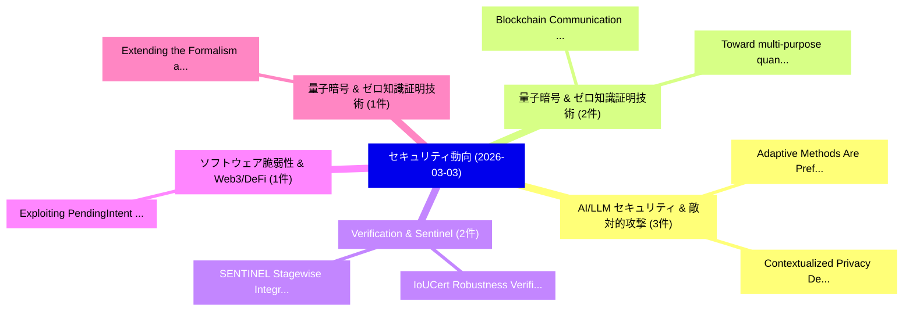

# 📅 02_daily: 日次エグゼクティブサマリー報告書 (2026-03-03)

**集計日時**: 2026-10-02 23:05:59 UTC  
**対象日付**: 2026-03-03  
**本日収集論文数**: 26 件  

---

## 💡 主要セキュリティ動向・脅威インサイト (Executive Insights)

本日の収集論文（計 26 件）において、以下の重点セキュリティ領域で活発な研究動向が確認されました：
- **AI/LLM セキュリティ & 敵対的攻撃** (3 件): 注目論文として 「Contextualized Privacy Defense...」、「Adaptive Methods Are Preferabl...」 等が発表され、実務防御および攻撃検証の進展が見られます。
- **量子暗号 & ゼロ知識証明技術** (2 件): 注目論文として 「Blockchain Communication Vulne...」、「Toward multi-purpose quantum c...」 等が発表され、実務防御および攻撃検証の進展が見られます。
- **Verification & Sentinel** (2 件): 注目論文として 「IoUCert: Robustness Verificati...」、「SENTINEL: Stagewise Integrity ...」 等が発表され、実務防御および攻撃検証の進展が見られます。
- **ソフトウェア脆弱性 & Web3/DeFi** (1 件): 注目論文として 「Exploiting PendingIntent Prove...」 等が発表され、実務防御および攻撃検証の進展が見られます。
- **量子暗号 & ゼロ知識証明技術** (1 件): 注目論文として 「Extending the Formalism and Th...」 等が発表され、実務防御および攻撃検証の進展が見られます。

### 🗺️ 技術・脅威トピックマインドマップ

---

## 📌 日次セキュリティ論文一覧 (日本語表形式)

| No | arXiv ID | 論文タイトル (日本語訳) | 重要キーワード | 構造化エグゼクティブ要約 (背景・提案・影響) | 脅威分類 | 詳細リンク |
|---|---|---|---|---|---|---|
| 1 | `2603.02539v1` | [Exploiting PendingIntent Provenance Confusion to Spoof Android SDK Authentication（セキュリティ分析論文）](../../okf/papers/2026-03-03/2603.02539.md) | `Provenance Confusion`, `Spoof Android`, `Ramanpreet Singh Khinda` | 【提案】概要 (Overview & Key Finding) 本論文「Exploiting PendingIntent Provenance Confusion to Spoof ...。実証評価により経営層・セキュリティ管理者向け推奨アクション (E... | `cybersecurity` | [arXiv](https://arxiv.org/abs/2603.02539v1) &#124; [OKF](../../okf/papers/2026-03-03/2603.02539.md) |
| 2 | `2603.02590v1` | [Extending the Formalism and Theoretical Foundations of Cryptography to AI（セキュリティ分析論文）](../../okf/papers/2026-03-03/2603.02590.md) | `Theoretical Foundations`, `Federico Villa`, `Tadayoshi Kohno` | 【提案】概要 (Overview & Key Finding) 本論文「Extending the Formalism and Theoretical Foundations of ...。実証評価により経営層・セキュリティ管理者向け推奨アクション (E... | `cybersecurity` | [arXiv](https://arxiv.org/abs/2603.02590v1) &#124; [OKF](../../okf/papers/2026-03-03/2603.02590.md) |
| 3 | `2603.02661v1` | [Blockchain Communication Vulnerabilities（セキュリティ分析論文）](../../okf/papers/2026-03-03/2603.02661.md) | `Blockchain Communication Vulnerabilities`, `Andrei Lebedev`, `Vincent Gramoli` | 【提案】概要 (Overview & Key Finding) 本論文「Blockchain Communication Vulnerabilities（セキュリティ分析論文）」（原...。実証評価により経営層・セキュリティ管理者向け推奨アクション (E... | `executive-summary` | [arXiv](https://arxiv.org/abs/2603.02661v1) &#124; [OKF](../../okf/papers/2026-03-03/2603.02661.md) |
| 4 | `2603.02690v1` | [VA-DAR: A PQC-Ready, Vendor-Agnostic Deterministic Artifact Resolution for Serverless, Enumeration-Resistant Wallet Recovery（セキュリティ分析論文）](../../okf/papers/2026-03-03/2603.02690.md) | `Agnostic Deterministic Artifact Resolution`, `Resistant Wallet Recovery`, `Vendor-Agnostic Deterministic` | 【提案】概要 (Overview & Key Finding) 本論文「VA-DAR: A PQC-Ready, Vendor-Agnostic Deterministic Arti...。実証評価により経営層・セキュリティ管理者向け推奨アクション (E... | `cybersecurity` | [arXiv](https://arxiv.org/abs/2603.02690v1) &#124; [OKF](../../okf/papers/2026-03-03/2603.02690.md) |
| 5 | `2603.02781v1` | [Scores Know Bobs Voice: Speaker Impersonation Attack（セキュリティ分析論文）](../../okf/papers/2026-03-03/2603.02781.md) | `Scores Know Bobs Voice`, `Speaker Impersonation Attack`, `Khin Mi Mi Aung` | 【提案】概要 (Overview & Key Finding) 本論文「Scores Know Bobs Voice: Speaker Impersonation Attack（セキ...。実証評価により経営層・セキュリティ管理者向け推奨アクション (E... | `cs.AI` | [arXiv](https://arxiv.org/abs/2603.02781v1) &#124; [OKF](../../okf/papers/2026-03-03/2603.02781.md) |
| 6 | `2603.02799v1` | [Understanding the Resource Cost of Fully Homomorphic Encryption in Quantum 連合学習](../../okf/papers/2026-03-03/2603.02799.md) | `Fully Homomorphic Encryption`, `Resource Cost`, `Quantum Federated Learning` | 【提案】概要 (Overview & Key Finding) 本論文「Understanding the Resource Cost of Fully 準同型暗号 in 量子 連合...。実証評価により経営層・セキュリティ管理者向け推奨アクション (E... | `cybersecurity` | [arXiv](https://arxiv.org/abs/2603.02799v1) &#124; [OKF](../../okf/papers/2026-03-03/2603.02799.md) |
| 7 | `2603.02849v1` | [DSBA: Dynamic Stealthy Backdoor Attack with Collaborative Optimization in Self-Supervised Learning（セキュリティ分析論文）](../../okf/papers/2026-03-03/2603.02849.md) | `Dynamic Stealthy Backdoor Attack`, `Collaborative Optimization`, `Supervised Learning` | 【提案】概要 (Overview & Key Finding) 本論文「DSBA: Dynamic Stealthy Backdoor Attack with Collaborati...。実証評価により経営層・セキュリティ管理者向け推奨アクション (E... | `cybersecurity` | [arXiv](https://arxiv.org/abs/2603.02849v1) &#124; [OKF](../../okf/papers/2026-03-03/2603.02849.md) |
| 8 | `2603.02891v3` | [Kraken: Higher-order EM Side-Channel Attacks on DNNs in Near and Far Field（セキュリティ分析論文）](../../okf/papers/2026-03-03/2603.02891.md) | `Channel Attacks`, `Far Field`, `Higher-order EM` | 【提案】概要 (Overview & Key Finding) 本論文「Kraken: Higher-order EM サイドチャネル攻撃 Attacks on DNNs in Ne...。実証評価により経営層・セキュリティ管理者向け推奨アクション (E... | `cybersecurity` | [arXiv](https://arxiv.org/abs/2603.02891v3) &#124; [OKF](../../okf/papers/2026-03-03/2603.02891.md) |
| 9 | `2603.02923v1` | [Toward multi-purpose quantum communication networks: from theory to protocol implementation（セキュリティ分析論文）](../../okf/papers/2026-03-03/2603.02923.md) | `multi-purpose quantum`, `Lucas Hanouz`, `Marc Kaplan` | 【提案】概要 (Overview & Key Finding) 本論文「Toward multi-purpose 量子 communication networks: from th...。実証評価により経営層・セキュリティ管理者向け推奨アクション (E... | `executive-summary` | [arXiv](https://arxiv.org/abs/2603.02923v1) &#124; [OKF](../../okf/papers/2026-03-03/2603.02923.md) |
| 10 | `2603.02963v1` | [Multi-Agent Honeypot-Based Request-Response Context Dataset for Improved SQL Injection Detection Performance（セキュリティ分析論文）](../../okf/papers/2026-03-03/2603.02963.md) | `Response Context Dataset`, `Injection Detection Performance`, `Agent Honeypot` | 【提案】概要 (Overview & Key Finding) 本論文「Multi-Agent Honeypot-Based Request-Response Context Dat...。実証評価により経営層・セキュリティ管理者向け推奨アクション (E... | `cybersecurity` | [arXiv](https://arxiv.org/abs/2603.02963v1) &#124; [OKF](../../okf/papers/2026-03-03/2603.02963.md) |
| 11 | `2603.02983v1` | [Contextualized Privacy Defense for LLMエージェント](../../okf/papers/2026-03-03/2603.02983.md) | `Contextualized Privacy Defense`, `Yule Wen`, `Yanzhe Zhang` | 【提案】概要 (Overview & Key Finding) 本論文「Contextualized Privacy Defense for LLMエージェント」（原題: Conte...。実証評価により経営層・セキュリティ管理者向け推奨アクション (E... | `cs.AI` | [arXiv](https://arxiv.org/abs/2603.02983v1) &#124; [OKF](../../okf/papers/2026-03-03/2603.02983.md) |
| 12 | `2603.03043v3` | [IoUCert: Robustness Verification for Anchor-based Object Detectors（セキュリティ分析論文）](../../okf/papers/2026-03-03/2603.03043.md) | `Robustness Verification`, `Object Detectors`, `Anchor-based Object` | 【提案】概要 (Overview & Key Finding) 本論文「IoUCert: Robustness Verification for Anchor-based Objec...。実証評価によりMercado, Yanghao Zhang,。 | `cs.AI` | [arXiv](https://arxiv.org/abs/2603.03043v3) &#124; [OKF](../../okf/papers/2026-03-03/2603.03043.md) |
| 13 | `2603.03108v1` | [RAIN: Secure and Robust Aggregation under Shuffle Model of Differential Privacy（セキュリティ分析論文）](../../okf/papers/2026-03-03/2603.03108.md) | `Robust Aggregation`, `Shuffle Model`, `Differential Privacy` | 【提案】概要 (Overview & Key Finding) 本論文「RAIN: Secure and Robust Aggregation under Shuffle Model...。実証評価により経営層・セキュリティ管理者向け推奨アクション (E... | `cybersecurity` | [arXiv](https://arxiv.org/abs/2603.03108v1) &#124; [OKF](../../okf/papers/2026-03-03/2603.03108.md) |
| 14 | `2603.03225v1` | [Multiparty Quantum Key Agreement: Architectures, State-of-the-art, and Open Problems（セキュリティ分析論文）](../../okf/papers/2026-03-03/2603.03225.md) | `Multiparty Quantum Key Agreement`, `Open Problems`, `Malik Mouaji` | 【提案】背景とセキュリティ上の課題 (Background & Problem) 本研究はサイバー脅威環境におけるセキュリティ構造・脆弱性の検証を目的としています。(主要検出項目: ...。実証評価により経営層・セキュリティ管理者向け推奨アクション (E... | `math-ph` | [arXiv](https://arxiv.org/abs/2603.03225v1) &#124; [OKF](../../okf/papers/2026-03-03/2603.03225.md) |
| 15 | `2603.03226v1` | [Adaptive Methods Are Preferable in High Privacy Settings: An SDE Perspective（セキュリティ分析論文）](../../okf/papers/2026-03-03/2603.03226.md) | `High Privacy Settings`, `Enea Monzio Compagnoni`, `Alessandro Stanghellini` | 【提案】概要 (Overview & Key Finding) 本論文「Adaptive Methods Are Preferable in High Privacy Setting...。実証評価により経営層・セキュリティ管理者向け推奨アクション (E... | `executive-summary` | [arXiv](https://arxiv.org/abs/2603.03226v1) &#124; [OKF](../../okf/papers/2026-03-03/2603.03226.md) |
| 16 | `2603.03270v1` | [Gravity Falls: A Comparative Domain-Generation Algorithm (DGA) Detection Methods for Mobile Device Spearphishingの分析](../../okf/papers/2026-03-03/2603.03270.md) | `Gravity Falls`, `Generation Algorithm`, `Domain-Generation Algorithm` | 【提案】概要 (Overview & Key Finding) 本論文「Gravity Falls: A Comparative Domain-Generation Algorith...。実証評価により経営層・セキュリティ管理者向け推奨アクション (E... | `cs.NI` | [arXiv](https://arxiv.org/abs/2603.03270v1) &#124; [OKF](../../okf/papers/2026-03-03/2603.03270.md) |
| 17 | `2603.03376v1` | [Comparison of Credential Management Systems Based on the Standards of IEEE, ETSI, and YD/T 3957-2021（セキュリティ分析論文）](../../okf/papers/2026-03-03/2603.03376.md) | `Credential Management Systems Based`, `Raw Meta`, `Executive Summary` | 【提案】概要 (Overview & Key Finding) 本論文「Comparison of Credential Management Systems Based on th...。実証評価により経営層・セキュリティ管理者向け推奨アクション (E... | `cs.NI` | [arXiv](https://arxiv.org/abs/2603.03376v1) &#124; [OKF](../../okf/papers/2026-03-03/2603.03376.md) |
| 18 | `2603.03398v1` | [Zero-Knowledge 連合学習 with Lattice-Based Hybrid Encryption for Quantum-Resilient Medical AI](../../okf/papers/2026-03-03/2603.03398.md) | `Based Hybrid Encryption`, `Resilient Medical`, `Lattice-Based Hybrid` | 【提案】概要 (Overview & Key Finding) 本論文「Zero-Knowledge 連合学習 with Lattice-Based Hybrid Encryptio...。実証評価により経営層・セキュリティ管理者向け推奨アクション (E... | `cs.AI` | [arXiv](https://arxiv.org/abs/2603.03398v1) &#124; [OKF](../../okf/papers/2026-03-03/2603.03398.md) |
| 19 | `2603.03403v2` | [Sharing is caring: Attestable and Trusted Workflows out of Distrustful Components（セキュリティ分析論文）](../../okf/papers/2026-03-03/2603.03403.md) | `Trusted Workflows`, `Distrustful Components`, `Amir Al Sadi` | 【提案】概要 (Overview & Key Finding) 本論文「Sharing is caring: Attestable and Trusted Workflows out...。実証評価により経営層・セキュリティ管理者向け推奨アクション (E... | `executive-summary` | [arXiv](https://arxiv.org/abs/2603.03403v2) &#124; [OKF](../../okf/papers/2026-03-03/2603.03403.md) |
| 20 | `2603.03410v2` | [On Google's SynthID-Text LLM Watermarking System: Theoretical Analysis and Empirical Validation（セキュリティ分析論文）](../../okf/papers/2026-03-03/2603.03410.md) | `SynthID-Text LLM`, `Watermarking System`, `Empirical Validation` | 【提案】概要 (Overview & Key Finding) 本論文「On Google's SynthID-Text LLM Watermarking System: Theor...。実証評価により経営層・セキュリティ管理者向け推奨アクション (E... | `cs.AI` | [arXiv](https://arxiv.org/abs/2603.03410v2) &#124; [OKF](../../okf/papers/2026-03-03/2603.03410.md) |
| 21 | `2603.03412v1` | [PRIVATEEDIT: A Privacy-Preserving Pipeline for Face-Centric Generative Image Editing（セキュリティ分析論文）](../../okf/papers/2026-03-03/2603.03412.md) | `Centric Generative Image Editing`, `Preserving Pipeline`, `Privacy-Preserving Pipeline` | 【提案】概要 (Overview & Key Finding) 本論文「PRIVATEEDIT: A Privacy-Preserving Pipeline for Face-Cen...。実証評価により経営層・セキュリティ管理者向け推奨アクション (E... | `cs.AI` | [arXiv](https://arxiv.org/abs/2603.03412v1) &#124; [OKF](../../okf/papers/2026-03-03/2603.03412.md) |
| 22 | `2603.03417v2` | [Parallel Test-Time Scaling with Multi-Sequence Verifiers（セキュリティ分析論文）](../../okf/papers/2026-03-03/2603.03417.md) | `Parallel Test`, `Time Scaling`, `Sequence Verifiers` | 【提案】概要 (Overview & Key Finding) 本論文「Parallel Test-Time Scaling with Multi-Sequence Verifier...。実証評価により経営層・セキュリティ管理者向け推奨アクション (E... | `cs.AI` | [arXiv](https://arxiv.org/abs/2603.03417v2) &#124; [OKF](../../okf/papers/2026-03-03/2603.03417.md) |
| 23 | `2603.03462v1` | [Analyzing the Impact of C-V2X-Enabled Road Safety: An Age of Information Perspectiveに対する敵対的攻撃](../../okf/papers/2026-03-03/2603.03462.md) | `Enabled Road Safety`, `Adversarial Attacks`, `Information Perspective` | 【提案】概要 (Overview & Key Finding) 本論文「Analyzing the Impact of C-V2X-Enabled Road Safety: An A...。実証評価により経営層・セキュリティ管理者向け推奨アクション (E... | `cs.NI` | [arXiv](https://arxiv.org/abs/2603.03462v1) &#124; [OKF](../../okf/papers/2026-03-03/2603.03462.md) |
| 24 | `2603.03486v1` | [DKD-KAN: A Lightweight knowledge-distilled KAN intrusion detection framework, based on MLP and KAN（セキュリティ分析論文）](../../okf/papers/2026-03-03/2603.03486.md) | `knowledge-distilled KAN`, `Mohammad Alikhani`, `Raw Meta` | 【提案】概要 (Overview & Key Finding) 本論文「DKD-KAN: A Lightweight knowledge-distilled KAN intrusio...。実証評価により経営層・セキュリティ管理者向け推奨アクション (E... | `executive-summary` | [arXiv](https://arxiv.org/abs/2603.03486v1) &#124; [OKF](../../okf/papers/2026-03-03/2603.03486.md) |
| 25 | `2603.03592v1` | [SENTINEL: Stagewise Integrity Verification for Pipeline Parallel Decentralized Training（セキュリティ分析論文）](../../okf/papers/2026-03-03/2603.03592.md) | `Pipeline Parallel Decentralized Training`, `Stagewise Integrity Verification`, `Hadi Mohaghegh Dolatabadi` | 【提案】概要 (Overview & Key Finding) 本論文「SENTINEL: Stagewise Integrity Verification for Pipeline...。実証評価により経営層・セキュリティ管理者向け推奨アクション (E... | `executive-summary` | [arXiv](https://arxiv.org/abs/2603.03592v1) &#124; [OKF](../../okf/papers/2026-03-03/2603.03592.md) |
| 26 | `2603.04459v3` | [Benchmark of Benchmarks: Unpacking Influence and Code Repository Quality in LLM Safety Benchmarks（セキュリティ分析論文）](../../okf/papers/2026-03-03/2603.04459.md) | `Code Repository Quality`, `Unpacking Influence`, `Safety Benchmarks` | 【提案】概要 (Overview & Key Finding) 本論文「Benchmark of Benchmarks: Unpacking Influence and Code R...。実証評価により経営層・セキュリティ管理者向け推奨アクション (E... | `cs.AI` | [arXiv](https://arxiv.org/abs/2603.04459v3) &#124; [OKF](../../okf/papers/2026-03-03/2603.04459.md) |

