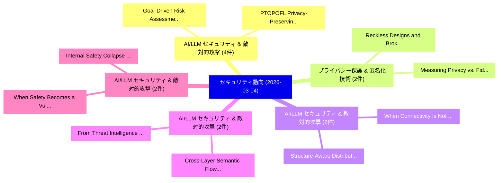

# 📅 02_daily: 日次エグゼクティブサマリー報告書 (2026-03-04)

**集計日時**: 2026-10-02 23:06:00 UTC  
**対象日付**: 2026-03-04  
**本日収集論文数**: 26 件  

---

## 💡 主要セキュリティ動向・脅威インサイト (Executive Insights)

本日の収集論文（計 26 件）において、以下の重点セキュリティ領域で活発な研究動向が確認されました：
- **AI/LLM セキュリティ & 敵対的攻撃** (4 件): 注目論文として 「Goal-Driven Risk Assessment fo...」、「PTOPOFL: Privacy-Preserving Pe...」 等が発表され、実務防御および攻撃検証の進展が見られます。
- **プライバシー保護 & 匿名化技術** (2 件): 注目論文として 「Reckless Designs and Broken Pr...」、「Measuring Privacy vs. Fidelity...」 等が発表され、実務防御および攻撃検証の進展が見られます。
- **AI/LLM セキュリティ & 敵対的攻撃** (2 件): 注目論文として 「Structure-Aware Distributed Ba...」、「When Connectivity Is Not Enoug...」 等が発表され、実務防御および攻撃検証の進展が見られます。
- **AI/LLM セキュリティ & 敵対的攻撃** (2 件): 注目論文として 「From Threat Intelligence to Fi...」、「Cross-Layer Semantic Flow Reco...」 等が発表され、実務防御および攻撃検証の進展が見られます。
- **AI/LLM セキュリティ & 敵対的攻撃** (2 件): 注目論文として 「When Safety Becomes a Vulnerab...」、「Internal Safety Collapse in Fr...」 等が発表され、実務防御および攻撃検証の進展が見られます。

### 🗺️ 技術・脅威トピックマインドマップ

---

## 📌 日次セキュリティ論文一覧 (日本語表形式)

| No | arXiv ID | 論文タイトル (日本語訳) | 重要キーワード | 構造化エグゼクティブ要約 (背景・提案・影響) | 脅威分類 | 詳細リンク |
|---|---|---|---|---|---|---|
| 1 | `2603.03624v2` | [Scrambler: Mixed Boolean Arithmetic Obfuscation Tool Using E-graph and Equality Expansion（セキュリティ分析論文）](../../okf/papers/2026-03-04/2603.03624.md) | `Mixed Boolean Arithmetic Obfuscation Tool Using`, `Equality Expansion`, `Seoksu Lee` | 【提案】概要 (Overview & Key Finding) 本論文「Scrambler: Mixed Boolean Arithmetic Obfuscation Tool Us...。実証評価により経営層・セキュリティ管理者向け推奨アクション (E... | `cybersecurity` | [arXiv](https://arxiv.org/abs/2603.03624v2) &#124; [OKF](../../okf/papers/2026-03-04/2603.03624.md) |
| 2 | `2603.03633v1` | [Goal-Driven Risk Assessment for LLM-Powered Systems: A Healthcare Case Study（セキュリティ分析論文）](../../okf/papers/2026-03-04/2603.03633.md) | `Driven Risk Assessment`, `Powered Systems`, `Goal-Driven Risk` | 【提案】概要 (Overview & Key Finding) 本論文「Goal-Driven Risk Assessment for LLM-Powered Systems: A ...。実証評価により経営層・セキュリティ管理者向け推奨アクション (E... | `cs.AI` | [arXiv](https://arxiv.org/abs/2603.03633v1) &#124; [OKF](../../okf/papers/2026-03-04/2603.03633.md) |
| 3 | `2603.03637v1` | [Image-based Prompt Injection: Hijacking Multimodal LLMs through Visually Embedded Adversarial Instructions（セキュリティ分析論文）](../../okf/papers/2026-03-04/2603.03637.md) | `Visually Embedded Adversarial Instructions`, `Prompt Injection`, `Image-based Prompt` | 【提案】概要 (Overview & Key Finding) 本論文「Image-based プロンプトインジェクション: Hijacking Multimodal LLMs th...。実証評価により経営層・セキュリティ管理者向け推奨アクション (E... | `cs.AI` | [arXiv](https://arxiv.org/abs/2603.03637v1) &#124; [OKF](../../okf/papers/2026-03-04/2603.03637.md) |
| 4 | `2603.03659v2` | [Reckless Designs and Broken Promises: Privacy Implications of Targeted Interactive Advertisements on Social Media Platforms（セキュリティ分析論文）](../../okf/papers/2026-03-04/2603.03659.md) | `Targeted Interactive Advertisements`, `Social Media Platforms`, `Reckless Designs` | 【提案】概要 (Overview & Key Finding) 本論文「Reckless Designs and Broken Promises: Privacy Implicati...。実証評価により経営層・セキュリティ管理者向け推奨アクション (E... | `executive-summary` | [arXiv](https://arxiv.org/abs/2603.03659v2) &#124; [OKF](../../okf/papers/2026-03-04/2603.03659.md) |
| 5 | `2603.03712v1` | [Internet malware propagation: Dynamics and control through SEIRV epidemic model with relapse and intervention（セキュリティ分析論文）](../../okf/papers/2026-03-04/2603.03712.md) | `Samiran Ghosh`, `Anil Kumar`, `Raw Meta` | 【提案】概要 (Overview & Key Finding) 本論文「Internet マルウェア propagation: Dynamics and control throug...。実証評価により経営層・セキュリティ管理者向け推奨アクション (E... | `math.DS` | [arXiv](https://arxiv.org/abs/2603.03712v1) &#124; [OKF](../../okf/papers/2026-03-04/2603.03712.md) |
| 6 | `2603.03804v2` | [Zero-Knowledge Proof (ZKP) Authentication for Offline CBDC Payment System Using IoT Devices（セキュリティ分析論文）](../../okf/papers/2026-03-04/2603.03804.md) | `Payment System Using`, `Knowledge Proof`, `Zero-Knowledge Proof` | 【提案】概要 (Overview & Key Finding) 本論文「ゼロ知識証明 (ZKP) Authentication for Offline CBDC Payment Sy...。実証評価により経営層・セキュリティ管理者向け推奨アクション (E... | `cs.CE` | [arXiv](https://arxiv.org/abs/2603.03804v2) &#124; [OKF](../../okf/papers/2026-03-04/2603.03804.md) |
| 7 | `2603.03865v1` | [Structure-Aware Distributed Backdoor Attacks in 連合学習](../../okf/papers/2026-03-04/2603.03865.md) | `Aware Distributed Backdoor Attacks`, `Structure-Aware Distributed`, `Federated Learning` | 【提案】概要 (Overview & Key Finding) 本論文「Structure-Aware Distributed Backdoor Attacks in 連合学習」（原...。実証評価により経営層・セキュリティ管理者向け推奨アクション (E... | `cs.AI` | [arXiv](https://arxiv.org/abs/2603.03865v1) &#124; [OKF](../../okf/papers/2026-03-04/2603.03865.md) |
| 8 | `2603.03881v1` | [On the Suitability of LLM-Driven Agents for Dark Pattern Audits（セキュリティ分析論文）](../../okf/papers/2026-03-04/2603.03881.md) | `Dark Pattern Audits`, `Driven Agents`, `LLM-Driven Agents` | 【提案】概要 (Overview & Key Finding) 本論文「On the Suitability of LLM-Driven Agents for Dark Patter...。実証評価により経営層・セキュリティ管理者向け推奨アクション (E... | `cs.AI` | [arXiv](https://arxiv.org/abs/2603.03881v1) &#124; [OKF](../../okf/papers/2026-03-04/2603.03881.md) |
| 9 | `2603.03906v2` | [Measuring Privacy vs. Fidelity in Synthetic Social Media Datasets（セキュリティ分析論文）](../../okf/papers/2026-03-04/2603.03906.md) | `Synthetic Social Media Datasets`, `Measuring Privacy`, `Henry Tari` | 【提案】概要 (Overview & Key Finding) 本論文「Measuring Privacy vs. Fidelity in Synthetic Social Medi...。実証評価により経営層・セキュリティ管理者向け推奨アクション (E... | `cybersecurity` | [arXiv](https://arxiv.org/abs/2603.03906v2) &#124; [OKF](../../okf/papers/2026-03-04/2603.03906.md) |
| 10 | `2603.03911v1` | [From Threat Intelligence to Firewall Rules: Semantic Relations in Hybrid AI Agent and Expert System Architectures（セキュリティ分析論文）](../../okf/papers/2026-03-04/2603.03911.md) | `Expert System Architectures`, `Firewall Rules`, `Semantic Relations` | 【提案】概要 (Overview & Key Finding) 本論文「From 脅威 Intelligence to Firewall Rules: Semantic Relati...。実証評価により経営層・セキュリティ管理者向け推奨アクション (E... | `cs.AI` | [arXiv](https://arxiv.org/abs/2603.03911v1) &#124; [OKF](../../okf/papers/2026-03-04/2603.03911.md) |
| 11 | `2603.03919v2` | [When Safety Becomes a Vulnerability: Exploiting LLM Alignment Homogeneity for Transferable Blocking in RAG（セキュリティ分析論文）](../../okf/papers/2026-03-04/2603.03919.md) | `Alignment Homogeneity`, `Transferable Blocking`, `Junchen Li` | 【提案】概要 (Overview & Key Finding) 本論文「When Safety Becomes a 脆弱性: Exploiting LLM Alignment Hom...。実証評価により経営層・セキュリティ管理者向け推奨アクション (E... | `cybersecurity` | [arXiv](https://arxiv.org/abs/2603.03919v2) &#124; [OKF](../../okf/papers/2026-03-04/2603.03919.md) |
| 12 | `2603.04028v1` | [A Multi-Dimensional Quality Scoring Framework for Decentralized LLM Inference with Proof of Quality（セキュリティ分析論文）](../../okf/papers/2026-03-04/2603.04028.md) | `Multi-Dimensional Quality`, `Arther Tian`, `Alex Ding` | 【提案】概要 (Overview & Key Finding) 本論文「A Multi-Dimensional Quality Scoring Framework for Decen...。実証評価により経営層・セキュリティ管理者向け推奨アクション (E... | `cs.AI` | [arXiv](https://arxiv.org/abs/2603.04028v1) &#124; [OKF](../../okf/papers/2026-03-04/2603.04028.md) |
| 13 | `2603.04168v1` | [OMNIINTENT: A Trusted Intent-Centric Framework for User-Friendly Web3（セキュリティ分析論文）](../../okf/papers/2026-03-04/2603.04168.md) | `Trusted Intent`, `Friendly Web3`, `User-Friendly Web3` | 【提案】概要 (Overview & Key Finding) 本論文「OMNIINTENT: A Trusted Intent-Centric Framework for User...。実証評価により経営層・セキュリティ管理者向け推奨アクション (E... | `cybersecurity` | [arXiv](https://arxiv.org/abs/2603.04168v1) &#124; [OKF](../../okf/papers/2026-03-04/2603.04168.md) |
| 14 | `2603.04186v1` | [CAM-LDS: Cyber Attack Manifestations for Automatic Interpretation of System Logs and Security Alerts（セキュリティ分析論文）](../../okf/papers/2026-03-04/2603.04186.md) | `Cyber Attack Manifestations`, `Automatic Interpretation`, `System Logs` | 【提案】概要 (Overview & Key Finding) 本論文「CAM-LDS: Cyber Attack Manifestations for Automatic Inte...。実証評価により経営層・セキュリティ管理者向け推奨アクション (E... | `cs.AI` | [arXiv](https://arxiv.org/abs/2603.04186v1) &#124; [OKF](../../okf/papers/2026-03-04/2603.04186.md) |
| 15 | `2603.04199v1` | [Bayesian Adversarial Privacy（セキュリティ分析論文）](../../okf/papers/2026-03-04/2603.04199.md) | `Bayesian Adversarial Privacy`, `Cameron Bell`, `Timothy Johnston` | 【提案】概要 (Overview & Key Finding) 本論文「Bayesian Adversarial Privacy（セキュリティ分析論文）」（原題: Bayesian ...。実証評価により経営層・セキュリティ管理者向け推奨アクション (E... | `stat.ME` | [arXiv](https://arxiv.org/abs/2603.04199v1) &#124; [OKF](../../okf/papers/2026-03-04/2603.04199.md) |
| 16 | `2603.04261v2` | [Statistical Effort Modelling of Game Resource Localisation Attacks（セキュリティ分析論文）](../../okf/papers/2026-03-04/2603.04261.md) | `Game Resource Localisation Attacks`, `Statistical Effort Modelling`, `Bjorn De Sutter` | 【提案】概要 (Overview & Key Finding) 本論文「Statistical Effort Modelling of Game Resource Localisat...。実証評価により経営層・セキュリティ管理者向け推奨アクション (E... | `cybersecurity` | [arXiv](https://arxiv.org/abs/2603.04261v2) &#124; [OKF](../../okf/papers/2026-03-04/2603.04261.md) |
| 17 | `2603.04323v1` | [PTOPOFL: Privacy-Preserving Personalised 連合学習 via Persistent Homology](../../okf/papers/2026-03-04/2603.04323.md) | `Persistent Homology`, `Privacy-Preserving Personalised`, `Preserving Personalised Federated Learning` | 【提案】概要 (Overview & Key Finding) 本論文「PTOPOFL: Privacy-Preserving Personalised 連合学習 via Persi...。実証評価により経営層・セキュリティ管理者向け推奨アクション (E... | `executive-summary` | [arXiv](https://arxiv.org/abs/2603.04323v1) &#124; [OKF](../../okf/papers/2026-03-04/2603.04323.md) |
| 18 | `2603.04324v1` | [Breaking Bad Email Habits: Bounding the Impact of Simulated Phishing Campaigns（セキュリティ分析論文）](../../okf/papers/2026-03-04/2603.04324.md) | `Breaking Bad Email Habits`, `Simulated Phishing Campaigns`, `Muhammad Zia Hydari` | 【提案】概要 (Overview & Key Finding) 本論文「Breaking Bad Email Habits: Bounding the Impact of Simul...。実証評価により経営層・セキュリティ管理者向け推奨アクション (E... | `executive-summary` | [arXiv](https://arxiv.org/abs/2603.04324v1) &#124; [OKF](../../okf/papers/2026-03-04/2603.04324.md) |
| 19 | `2603.04378v1` | [Robustness of Agentic AI Systems via Adversarially-Aligned Jacobian Regularization（セキュリティ分析論文）](../../okf/papers/2026-03-04/2603.04378.md) | `Aligned Jacobian Regularization`, `Adversarially-Aligned Jacobian`, `Furkan Mumcu` | 【提案】概要 (Overview & Key Finding) 本論文「Robustness of Agentic AI Systems via Adversarially-Alig...。実証評価により経営層・セキュリティ管理者向け推奨アクション (E... | `cs.AI` | [arXiv](https://arxiv.org/abs/2603.04378v1) &#124; [OKF](../../okf/papers/2026-03-04/2603.04378.md) |
| 20 | `2603.04383v2` | [Turning Trust to Transactions: Tracking Affiliate Marketing and FTC Compliance in YouTube's Influencer Economy（セキュリティ分析論文）](../../okf/papers/2026-03-04/2603.04383.md) | `Tracking Affiliate Marketing`, `Turning Trust`, `Influencer Economy` | 【提案】概要 (Overview & Key Finding) 本論文「Turning Trust to Transactions: Tracking Affiliate Marke...。実証評価により経営層・セキュリティ管理者向け推奨アクション (E... | `executive-summary` | [arXiv](https://arxiv.org/abs/2603.04383v2) &#124; [OKF](../../okf/papers/2026-03-04/2603.04383.md) |
| 21 | `2603.04469v2` | [Cross-Layer Semantic Flow Reconstruction for Attack Detection in Agentic Systems（セキュリティ分析論文）](../../okf/papers/2026-03-04/2603.04469.md) | `Layer Semantic Flow Reconstruction`, `Attack Detection`, `Agentic Systems` | 【提案】概要 (Overview & Key Finding) 本論文「Cross-Layer Semantic Flow Reconstruction for Attack Det...。実証評価により経営層・セキュリティ管理者向け推奨アクション (E... | `executive-summary` | [arXiv](https://arxiv.org/abs/2603.04469v2) &#124; [OKF](../../okf/papers/2026-03-04/2603.04469.md) |
| 22 | `2603.04662v4` | [When Connectivity Is Not Enough: Cross-Layer Attacks on UAV C2 over 5G（セキュリティ分析論文）](../../okf/papers/2026-03-04/2603.04662.md) | `Layer Attacks`, `Cross-Layer Attacks`, `Wagner Comin Sonaglio` | 【提案】背景とセキュリティ上の課題 (Background & Problem) 本研究はサイバー脅威環境におけるセキュリティ構造・脆弱性の検証を目的としています。(主要検出項目: ...。実証評価により経営層・セキュリティ管理者向け推奨アクション (E... | `cybersecurity` | [arXiv](https://arxiv.org/abs/2603.04662v4) &#124; [OKF](../../okf/papers/2026-03-04/2603.04662.md) |
| 23 | `2603.05541v1` | [Privacy-Preserving Collaborative Medical Image Segmentation Using Latent Transform Networks（セキュリティ分析論文）](../../okf/papers/2026-03-04/2603.05541.md) | `Preserving Collaborative Medical Image Segmentation Using Latent Transform Networks`, `Privacy-Preserving Collaborative`, `Saheed Ademola Bello` | 【提案】概要 (Overview & Key Finding) 本論文「Privacy-Preserving Collaborative Medical Image Segmenta...。実証評価により経営層・セキュリティ管理者向け推奨アクション (E... | `executive-summary` | [arXiv](https://arxiv.org/abs/2603.05541v1) &#124; [OKF](../../okf/papers/2026-03-04/2603.05541.md) |
| 24 | `2603.16899v1` | [Capability-Priced Micro-Markets: A Micro-Economic Framework for the Agentic Web over HTTP 402（セキュリティ分析論文）](../../okf/papers/2026-03-04/2603.16899.md) | `Priced Micro`, `Agentic Web`, `Capability-Priced Micro` | 【提案】概要 (Overview & Key Finding) 本論文「Capability-Priced Micro-Markets: A Micro-Economic Frame...。実証評価により経営層・セキュリティ管理者向け推奨アクション (E... | `cs.ET` | [arXiv](https://arxiv.org/abs/2603.16899v1) &#124; [OKF](../../okf/papers/2026-03-04/2603.16899.md) |
| 25 | `2603.23509v1` | [Internal Safety Collapse in Frontier 大規模言語モデル](../../okf/papers/2026-03-04/2603.23509.md) | `Internal Safety Collapse`, `Frontier Large Language Models`, `Yutao Wu` | 【提案】概要 (Overview & Key Finding) 本論文「Internal Safety Collapse in Frontier 大規模言語モデル」（原題: Inte...。実証評価により経営層・セキュリティ管理者向け推奨アクション (E... | `cs.AI` | [arXiv](https://arxiv.org/abs/2603.23509v1) &#124; [OKF](../../okf/papers/2026-03-04/2603.23509.md) |
| 26 | `2604.08551v1` | [Self-Sovereign Agent（セキュリティ分析論文）](../../okf/papers/2026-03-04/2604.08551.md) | `Sovereign Agent`, `Self-Sovereign Agent`, `Wenjie Qu` | 【提案】概要 (Overview & Key Finding) 本論文「Self-Sovereign Agent（セキュリティ分析論文）」（原題: Self-Sovereign Ag...。実証評価により経営層・セキュリティ管理者向け推奨アクション (E... | `executive-summary` | [arXiv](https://arxiv.org/abs/2604.08551v1) &#124; [OKF](../../okf/papers/2026-03-04/2604.08551.md) |

