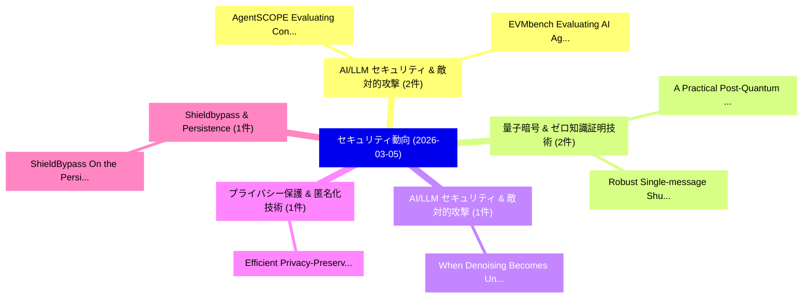

# 📅 02_daily: 日次エグゼクティブサマリー報告書 (2026-03-05)

**集計日時**: 2026-10-02 23:06:00 UTC  
**対象日付**: 2026-03-05  
**本日収集論文数**: 15 件  

---

## 💡 主要セキュリティ動向・脅威インサイト (Executive Insights)

本日の収集論文（計 15 件）において、以下の重点セキュリティ領域で活発な研究動向が確認されました：
- **AI/LLM セキュリティ & 敵対的攻撃** (2 件): 注目論文として 「AgentSCOPE: Evaluating Context...」、「EVMbench: Evaluating AI Agents...」 等が発表され、実務防御および攻撃検証の進展が見られます。
- **量子暗号 & ゼロ知識証明技術** (2 件): 注目論文として 「A Practical Post-Quantum Distr...」、「Robust Single-message Shuffle ...」 等が発表され、実務防御および攻撃検証の進展が見られます。
- **AI/LLM セキュリティ & 敵対的攻撃** (1 件): 注目論文として 「When Denoising Becomes Unsigni...」 等が発表され、実務防御および攻撃検証の進展が見られます。
- **プライバシー保護 & 匿名化技術** (1 件): 注目論文として 「Efficient Privacy-Preserving S...」 等が発表され、実務防御および攻撃検証の進展が見られます。
- **Shieldbypass & Persistence** (1 件): 注目論文として 「ShieldBypass: On the Persisten...」 等が発表され、実務防御および攻撃検証の進展が見られます。

### 🗺️ 技術・脅威トピックマインドマップ

---

## 📌 日次セキュリティ論文一覧 (日本語表形式)

| No | arXiv ID | 論文タイトル (日本語訳) | 重要キーワード | 構造化エグゼクティブ要約 (背景・提案・影響) | 脅威分類 | 詳細リンク |
|---|---|---|---|---|---|---|
| 1 | `2603.04696v1` | [When Denoising Becomes Unsigning: Theoretical and Empirical Watermark Fragility Under Diffusion-Based Image Editingの分析](../../okf/papers/2026-03-05/2603.04696.md) | `Diffusion-Based Image`, `Based Image Editing`, `Based Image` | 【提案】概要 (Overview & Key Finding) 本論文「When Denoising Becomes Unsigning: Theoretical and Empir...。実証評価により経営層・セキュリティ管理者向け推奨アクション (E... | `cs.MM` | [arXiv](https://arxiv.org/abs/2603.04696v1) &#124; [OKF](../../okf/papers/2026-03-05/2603.04696.md) |
| 2 | `2603.04742v1` | [Efficient Privacy-Preserving Sparse Matrix-Vector Multiplication Using Homomorphic Encryption（セキュリティ分析論文）](../../okf/papers/2026-03-05/2603.04742.md) | `Vector Multiplication Using Homomorphic Encryption`, `Preserving Sparse Matrix`, `Efficient Privacy` | 【提案】概要 (Overview & Key Finding) 本論文「Efficient Privacy-Preserving Sparse Matrix-Vector Multi...。実証評価により経営層・セキュリティ管理者向け推奨アクション (E... | `cybersecurity` | [arXiv](https://arxiv.org/abs/2603.04742v1) &#124; [OKF](../../okf/papers/2026-03-05/2603.04742.md) |
| 3 | `2603.04801v4` | [ShieldBypass: On the Persistence of Impedance Leakage Beyond EM Shielding（セキュリティ分析論文）](../../okf/papers/2026-03-05/2603.04801.md) | `Impedance Leakage Beyond`, `Md Sadik Awal`, `Md Tauhidur Rahman` | 【提案】概要 (Overview & Key Finding) 本論文「ShieldBypass: On the Persistence of Impedance Leakage B...。実証評価により経営層・セキュリティ管理者向け推奨アクション (E... | `cs.ET` | [arXiv](https://arxiv.org/abs/2603.04801v4) &#124; [OKF](../../okf/papers/2026-03-05/2603.04801.md) |
| 4 | `2603.04859v1` | [Osmosis Distillation: Model Hijacking with the Fewest Samples（セキュリティ分析論文）](../../okf/papers/2026-03-05/2603.04859.md) | `Osmosis Distillation`, `Model Hijacking`, `Fewest Samples` | 【提案】概要 (Overview & Key Finding) 本論文「Osmosis Distillation: Model Hijacking with the Fewest S...。実証評価により経営層・セキュリティ管理者向け推奨アクション (E... | `executive-summary` | [arXiv](https://arxiv.org/abs/2603.04859v1) &#124; [OKF](../../okf/papers/2026-03-05/2603.04859.md) |
| 5 | `2603.04902v1` | [AgentSCOPE: Evaluating Contextual Privacy Across Agentic Workflows（セキュリティ分析論文）](../../okf/papers/2026-03-05/2603.04902.md) | `Evaluating Contextual Privacy Across Agentic Workflows`, `Karthikeyan Natesan Ramamurthy`, `Keerthiram Murugesan` | 【提案】概要 (Overview & Key Finding) 本論文「AgentSCOPE: Evaluating Contextual Privacy Across Agenti...。実証評価によりNgong, Keerthiram Muruges... | `cs.AI` | [arXiv](https://arxiv.org/abs/2603.04902v1) &#124; [OKF](../../okf/papers/2026-03-05/2603.04902.md) |
| 6 | `2603.04915v1` | [EVMbench: Evaluating AI Agents on Smart Contract Security（セキュリティ分析論文）](../../okf/papers/2026-03-05/2603.04915.md) | `Smart Contract Security`, `Justin Wang`, `Andreas Bigger` | 【提案】概要 (Overview & Key Finding) 本論文「EVMbench: Evaluating AI Agents on スマートコントラクト Security（セ...。実証評価によりLin, Andy Applebaum, Tej。 | `cs.AI` | [arXiv](https://arxiv.org/abs/2603.04915v1) &#124; [OKF](../../okf/papers/2026-03-05/2603.04915.md) |
| 7 | `2603.04952v1` | [Modification to Fully Homomorphic Modified Rivest Scheme（セキュリティ分析論文）](../../okf/papers/2026-03-05/2603.04952.md) | `Fully Homomorphic Modified Rivest Scheme`, `Sona Alex`, `Bian Yang` | 【提案】概要 (Overview & Key Finding) 本論文「Modification to Fully Homomorphic Modified Rivest Schem...。実証評価により経営層・セキュリティ管理者向け推奨アクション (E... | `cybersecurity` | [arXiv](https://arxiv.org/abs/2603.04952v1) &#124; [OKF](../../okf/papers/2026-03-05/2603.04952.md) |
| 8 | `2603.05005v1` | [A Practical Post-Quantum Distributed Ledger Protocol for Financial Institutions（セキュリティ分析論文）](../../okf/papers/2026-03-05/2603.05005.md) | `Quantum Distributed Ledger Protocol`, `Practical Post`, `Financial Institutions` | 【提案】概要 (Overview & Key Finding) 本論文「A Practical Post-量子 Distributed Ledger Protocol for Fin...。実証評価により経営層・セキュリティ管理者向け推奨アクション (E... | `cybersecurity` | [arXiv](https://arxiv.org/abs/2603.05005v1) &#124; [OKF](../../okf/papers/2026-03-05/2603.05005.md) |
| 9 | `2603.05035v3` | [Good-Enough LLM Obfuscation (GELO)（セキュリティ分析論文）](../../okf/papers/2026-03-05/2603.05035.md) | `Good-Enough LLM`, `Anatoly Belikov`, `Ilya Fedotov` | 【提案】概要 (Overview & Key Finding) 本論文「Good-Enough LLM Obfuscation (GELO)（セキュリティ分析論文）」（原題: Goo...。実証評価により経営層・セキュリティ管理者向け推奨アクション (E... | `executive-summary` | [arXiv](https://arxiv.org/abs/2603.05035v3) &#124; [OKF](../../okf/papers/2026-03-05/2603.05035.md) |
| 10 | `2603.05068v1` | [Cyber Threat Intelligence for Artificial Intelligence Systems（セキュリティ分析論文）](../../okf/papers/2026-03-05/2603.05068.md) | `Cyber Threat Intelligence`, `Artificial Intelligence Systems`, `Natalia Krawczyk` | 【提案】概要 (Overview & Key Finding) 本論文「Cyber 脅威 Intelligence for Artificial Intelligence Syste...。実証評価により経営層・セキュリティ管理者向け推奨アクション (E... | `cs.AI` | [arXiv](https://arxiv.org/abs/2603.05068v1) &#124; [OKF](../../okf/papers/2026-03-05/2603.05068.md) |
| 11 | `2603.05073v1` | [Robust Single-message Shuffle Differential Privacy Protocol for Accurate Distribution Estimation（セキュリティ分析論文）](../../okf/papers/2026-03-05/2603.05073.md) | `Shuffle Differential Privacy Protocol`, `Accurate Distribution Estimation`, `Robust Single` | 【提案】概要 (Overview & Key Finding) 本論文「Robust Single-message Shuffle 差分プライバシー Protocol for Acc...。実証評価により経営層・セキュリティ管理者向け推奨アクション (E... | `cybersecurity` | [arXiv](https://arxiv.org/abs/2603.05073v1) &#124; [OKF](../../okf/papers/2026-03-05/2603.05073.md) |
| 12 | `2603.05261v1` | [Lambda-randomization: multi-dimensional randomized response made easy（セキュリティ分析論文）](../../okf/papers/2026-03-05/2603.05261.md) | `multi-dimensional randomized`, `Nicolas Ruiz`, `Raw Meta` | 【提案】概要 (Overview & Key Finding) 本論文「Lambda-randomization: multi-dimensional randomized resp...。実証評価により経営層・セキュリティ管理者向け推奨アクション (E... | `cybersecurity` | [arXiv](https://arxiv.org/abs/2603.05261v1) &#124; [OKF](../../okf/papers/2026-03-05/2603.05261.md) |
| 13 | `2603.05689v1` | [SecureRAG-RTL: A Retrieval-Augmented, Multi-Agent, Zero-Shot LLM-Driven Framework for Hardware 脆弱性検出](../../okf/papers/2026-03-05/2603.05689.md) | `Zero-Shot LLM`, `Hardware Vulnerability Detection`, `Touseef Hasan` | 【提案】概要 (Overview & Key Finding) 本論文「SecureRAG-RTL: A Retrieval-Augmented, Multi-Agent, Zero...。実証評価により経営層・セキュリティ管理者向け推奨アクション (E... | `cs.AI` | [arXiv](https://arxiv.org/abs/2603.05689v1) &#124; [OKF](../../okf/papers/2026-03-05/2603.05689.md) |
| 14 | `2603.05725v1` | [Challenges and Design Considerations for Finding CUDA Bugs Through GPU-Native Fuzzing（セキュリティ分析論文）](../../okf/papers/2026-03-05/2603.05725.md) | `Design Considerations`, `Native Fuzzing`, `GPU-Native Fuzzing` | 【提案】概要 (Overview & Key Finding) 本論文「Challenges and Design Considerations for Finding CUDA B...。実証評価により経営層・セキュリティ管理者向け推奨アクション (E... | `cybersecurity` | [arXiv](https://arxiv.org/abs/2603.05725v1) &#124; [OKF](../../okf/papers/2026-03-05/2603.05725.md) |
| 15 | `2603.15649v1` | [Quantum Key Distribution Secured 連合学習 for Channel Estimation and Radar Spectrum Sensing in 6G Networks](../../okf/papers/2026-03-05/2603.15649.md) | `Radar Spectrum Sensing`, `Channel Estimation`, `Quantum Key Distribution Secured` | 【提案】概要 (Overview & Key Finding) 本論文「量子鍵配送 Secured 連合学習 for Channel Estimation and Radar Spe...。実証評価により経営層・セキュリティ管理者向け推奨アクション (E... | `executive-summary` | [arXiv](https://arxiv.org/abs/2603.15649v1) &#124; [OKF](../../okf/papers/2026-03-05/2603.15649.md) |

