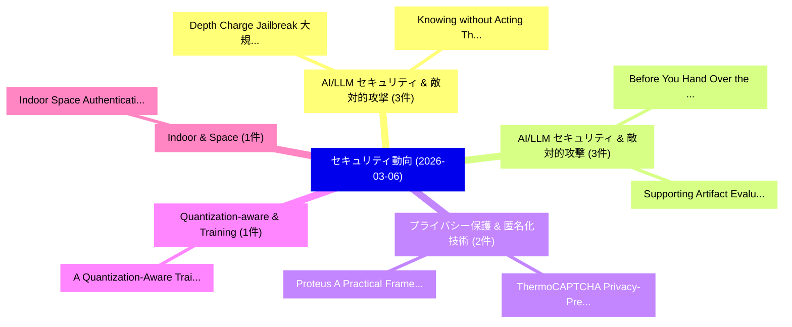

# 📅 02_daily: 日次エグゼクティブサマリー報告書 (2026-03-06)

**集計日時**: 2026-10-02 23:06:00 UTC  
**対象日付**: 2026-03-06  
**本日収集論文数**: 26 件  

---

## 💡 主要セキュリティ動向・脅威インサイト (Executive Insights)

本日の収集論文（計 26 件）において、以下の重点セキュリティ領域で活発な研究動向が確認されました：
- **AI/LLM セキュリティ & 敵対的攻撃** (3 件): 注目論文として 「Depth Charge: Jailbreak 大規模言語モ...」、「Knowing without Acting: The Di...」 等が発表され、実務防御および攻撃検証の進展が見られます。
- **AI/LLM セキュリティ & 敵対的攻撃** (3 件): 注目論文として 「Before You Hand Over the Wheel...」、「Supporting Artifact Evaluation...」 等が発表され、実務防御および攻撃検証の進展が見られます。
- **プライバシー保護 & 匿名化技術** (2 件): 注目論文として 「ThermoCAPTCHA: Privacy-Preserv...」、「Proteus: A Practical Framework...」 等が発表され、実務防御および攻撃検証の進展が見られます。
- **Quantization-aware & Training** (1 件): 注目論文として 「A Quantization-Aware Training ...」 等が発表され、実務防御および攻撃検証の進展が見られます。
- **Indoor & Space** (1 件): 注目論文として 「Indoor Space Authentication by...」 等が発表され、実務防御および攻撃検証の進展が見られます。

### 🗺️ 技術・脅威トピックマインドマップ

---

## 📌 日次セキュリティ論文一覧 (日本語表形式)

| No | arXiv ID | 論文タイトル (日本語訳) | 重要キーワード | 構造化エグゼクティブ要約 (背景・提案・影響) | 脅威分類 | 詳細リンク |
|---|---|---|---|---|---|---|
| 1 | `2603.05772v2` | [Depth Charge: Jailbreak 大規模言語モデル from Deep Safety Attention Heads](../../okf/papers/2026-03-06/2603.05772.md) | `Deep Safety Attention Heads`, `Depth Charge`, `Jailbreak Large Language Models` | 【提案】概要 (Overview & Key Finding) 本論文「Depth Charge: ジェイルブレイク 大規模言語モデル from Deep Safety Attent...。実証評価により経営層・セキュリティ管理者向け推奨アクション (E... | `cs.AI` | [arXiv](https://arxiv.org/abs/2603.05772v2) &#124; [OKF](../../okf/papers/2026-03-06/2603.05772.md) |
| 2 | `2603.05773v2` | [Knowing without Acting: The Disentangled Geometry of Safety Mechanisms in 大規模言語モデル](../../okf/papers/2026-03-06/2603.05773.md) | `Safety Mechanisms`, `Large Language Models`, `Jinman Wu` | 【提案】背景とセキュリティ上の課題 (Background & Problem) 本研究はサイバー脅威環境におけるセキュリティ構造・脆弱性の検証を目的としています。(主要検出項目: ...。実証評価により経営層・セキュリティ管理者向け推奨アクション (E... | `cs.AI` | [arXiv](https://arxiv.org/abs/2603.05773v2) &#124; [OKF](../../okf/papers/2026-03-06/2603.05773.md) |
| 3 | `2603.05786v2` | [Proof-of-Guardrail in AI Agents and What (Not) to Trust from It（セキュリティ分析論文）](../../okf/papers/2026-03-06/2603.05786.md) | `Xisen Jin`, `Michael Duan`, `Qin Lin` | 【提案】背景とセキュリティ上の課題 (Background & Problem) 本研究はサイバー脅威環境におけるセキュリティ構造・脆弱性の検証を目的としています。(主要検出項目: ...。実証評価により経営層・セキュリティ管理者向け推奨アクション (E... | `cs.AI` | [arXiv](https://arxiv.org/abs/2603.05786v2) &#124; [OKF](../../okf/papers/2026-03-06/2603.05786.md) |
| 4 | `2603.05791v1` | [A Quantization-Aware Training Based Lightweight Method for Neural Distinguishers（セキュリティ分析論文）](../../okf/papers/2026-03-06/2603.05791.md) | `Neural Distinguishers`, `Quantization-Aware Training`, `Guangwei Xiong` | 【提案】概要 (Overview & Key Finding) 本論文「A Quantization-Aware Training Based Lightweight Method ...。実証評価により経営層・セキュリティ管理者向け推奨アクション (E... | `cybersecurity` | [arXiv](https://arxiv.org/abs/2603.05791v1) &#124; [OKF](../../okf/papers/2026-03-06/2603.05791.md) |
| 5 | `2603.05858v1` | [Indoor Space Authentication by ISS-based Keypoint Extraction from 3D Point Clouds（セキュリティ分析論文）](../../okf/papers/2026-03-06/2603.05858.md) | `Indoor Space Authentication`, `Keypoint Extraction`, `ISS-based Keypoint` | 【提案】概要 (Overview & Key Finding) 本論文「Indoor Space Authentication by ISS-based Keypoint Extra...。実証評価により経営層・セキュリティ管理者向け推奨アクション (E... | `cybersecurity` | [arXiv](https://arxiv.org/abs/2603.05858v1) &#124; [OKF](../../okf/papers/2026-03-06/2603.05858.md) |
| 6 | `2603.05872v2` | [Evolving Deception: When Agents Evolve, Deception Wins（セキュリティ分析論文）](../../okf/papers/2026-03-06/2603.05872.md) | `Evolving Deception`, `Deception Wins`, `Zonghao Ying` | 【提案】概要 (Overview & Key Finding) 本論文「Evolving Deception: When Agents Evolve, Deception Wins（...。実証評価により経営層・セキュリティ管理者向け推奨アクション (E... | `cybersecurity` | [arXiv](https://arxiv.org/abs/2603.05872v2) &#124; [OKF](../../okf/papers/2026-03-06/2603.05872.md) |
| 7 | `2603.05915v1` | [ThermoCAPTCHA: Privacy-Preserving Human Verification with Farm-Resistant Traceable Tokens（セキュリティ分析論文）](../../okf/papers/2026-03-06/2603.05915.md) | `Preserving Human Verification`, `Resistant Traceable Tokens`, `Privacy-Preserving Human` | 【提案】概要 (Overview & Key Finding) 本論文「ThermoCAPTCHA: Privacy-Preserving Human Verification wi...。実証評価により経営層・セキュリティ管理者向け推奨アクション (E... | `cybersecurity` | [arXiv](https://arxiv.org/abs/2603.05915v1) &#124; [OKF](../../okf/papers/2026-03-06/2603.05915.md) |
| 8 | `2603.05978v1` | [Statistical Analysis and Optimization of the MFA Protecting Private Keys（セキュリティ分析論文）](../../okf/papers/2026-03-06/2603.05978.md) | `Protecting Private Keys`, `Bertrand Francis Cambou`, `Mahafujul Alam` | 【提案】概要 (Overview & Key Finding) 本論文「Statistical Analysis and Optimization of the MFA Protec...。実証評価により経営層・セキュリティ管理者向け推奨アクション (E... | `cybersecurity` | [arXiv](https://arxiv.org/abs/2603.05978v1) &#124; [OKF](../../okf/papers/2026-03-06/2603.05978.md) |
| 9 | `2603.05989v1` | [SemFuzz: A Semantics-Aware Fuzzing Framework for Network Protocol Implementations（セキュリティ分析論文）](../../okf/papers/2026-03-06/2603.05989.md) | `Network Protocol Implementations`, `Semantics-Aware Fuzzing`, `Yanbang Sun` | 【提案】概要 (Overview & Key Finding) 本論文「SemFuzz: A Semantics-Aware Fuzzing Framework for Networ...。実証評価により経営層・セキュリティ管理者向け推奨アクション (E... | `executive-summary` | [arXiv](https://arxiv.org/abs/2603.05989v1) &#124; [OKF](../../okf/papers/2026-03-06/2603.05989.md) |
| 10 | `2603.06029v1` | [When Specifications Meet Reality: Uncovering API Inconsistencies in Ethereum Infrastructure（セキュリティ分析論文）](../../okf/papers/2026-03-06/2603.06029.md) | `Ethereum Infrastructure`, `Jie Ma`, `Jinwen Xi` | 【提案】概要 (Overview & Key Finding) 本論文「When Specifications Meet Reality: Uncovering API Incons...。実証評価により経営層・セキュリティ管理者向け推奨アクション (E... | `executive-summary` | [arXiv](https://arxiv.org/abs/2603.06029v1) &#124; [OKF](../../okf/papers/2026-03-06/2603.06029.md) |
| 11 | `2603.06051v1` | [A LINDDUN-based Privacy Threat Modeling Framework for GenAI（セキュリティ分析論文）](../../okf/papers/2026-03-06/2603.06051.md) | `LINDDUN-based Privacy`, `Dimitri Van Landuyt`, `Qianying Liao` | 【提案】概要 (Overview & Key Finding) 本論文「A LINDDUN-based Privacy 脅威 Modeling Framework for GenAI...。実証評価により経営層・セキュリティ管理者向け推奨アクション (E... | `executive-summary` | [arXiv](https://arxiv.org/abs/2603.06051v1) &#124; [OKF](../../okf/papers/2026-03-06/2603.06051.md) |
| 12 | `2603.06149v1` | [PQC-LEO: An Evaluation Framework for Post-Quantum Cryptographic Algorithms（セキュリティ分析論文）](../../okf/papers/2026-03-06/2603.06149.md) | `Quantum Cryptographic Algorithms`, `Post-Quantum Cryptographic`, `Callum Turino` | 【提案】概要 (Overview & Key Finding) 本論文「PQC-LEO: An Evaluation Framework for Post-量子 Cryptograp...。実証評価により経営層・セキュリティ管理者向け推奨アクション (E... | `cybersecurity` | [arXiv](https://arxiv.org/abs/2603.06149v1) &#124; [OKF](../../okf/papers/2026-03-06/2603.06149.md) |
| 13 | `2603.06169v1` | [Alkaid: Resilience to Edit Errors in Provably Secure Steganography via Distance-Constrained Encoding（セキュリティ分析論文）](../../okf/papers/2026-03-06/2603.06169.md) | `Provably Secure Steganography`, `Edit Errors`, `Constrained Encoding` | 【提案】概要 (Overview & Key Finding) 本論文「Alkaid: Resilience to Edit Errors in Provably Secure St...。実証評価により経営層・セキュリティ管理者向け推奨アクション (E... | `cs.MM` | [arXiv](https://arxiv.org/abs/2603.06169v1) &#124; [OKF](../../okf/papers/2026-03-06/2603.06169.md) |
| 14 | `2603.06263v1` | [SPOILER: TEE-Shielded DNN Partitioning of On-Device Secure Inference with Poison Learning（セキュリティ分析論文）](../../okf/papers/2026-03-06/2603.06263.md) | `Device Secure Inference`, `TEE-Shielded DNN`, `Poison Learning` | 【提案】概要 (Overview & Key Finding) 本論文「SPOILER: TEE-Shielded DNN Partitioning of On-Device Sec...。実証評価により経営層・セキュリティ管理者向け推奨アクション (E... | `cybersecurity` | [arXiv](https://arxiv.org/abs/2603.06263v1) &#124; [OKF](../../okf/papers/2026-03-06/2603.06263.md) |
| 15 | `2603.06299v1` | [An Integrated Failure and Threat Mode and Effect Analysis (FTMEA) Framework with Quantified Cross-Domain Correlation Factors for Automotive Semiconductors（セキュリティ分析論文）](../../okf/papers/2026-03-06/2603.06299.md) | `Domain Correlation Factors`, `Threat Mode`, `Quantified Cross` | 【提案】概要 (Overview & Key Finding) 本論文「An Integrated Failure and 脅威 Mode and Effect Analysis (...。実証評価により経営層・セキュリティ管理者向け推奨アクション (E... | `executive-summary` | [arXiv](https://arxiv.org/abs/2603.06299v1) &#124; [OKF](../../okf/papers/2026-03-06/2603.06299.md) |
| 16 | `2603.06326v1` | [Designing Trustworthy Layered Attestations（セキュリティ分析論文）](../../okf/papers/2026-03-06/2603.06326.md) | `Designing Trustworthy Layered Attestations`, `Will Thomas`, `Logan Schmalz` | 【提案】概要 (Overview & Key Finding) 本論文「Designing Trustworthy Layered Attestations（セキュリティ分析論文）」...。実証評価によりRowe, James Carter - **公開... | `cybersecurity` | [arXiv](https://arxiv.org/abs/2603.06326v1) &#124; [OKF](../../okf/papers/2026-03-06/2603.06326.md) |
| 17 | `2603.06359v1` | [Tiny, Hardware-Independent, Compression-based Classification（セキュリティ分析論文）](../../okf/papers/2026-03-06/2603.06359.md) | `Compression-based Classification`, `Charles Meyers`, `Erik Elmroth` | 【提案】概要 (Overview & Key Finding) 本論文「Tiny, Hardware-Independent, Compression-based Classific...。実証評価により経営層・セキュリティ管理者向け推奨アクション (E... | `executive-summary` | [arXiv](https://arxiv.org/abs/2603.06359v1) &#124; [OKF](../../okf/papers/2026-03-06/2603.06359.md) |
| 18 | `2603.06365v1` | [ESAA-Security: An Event-Sourced, Verifiable Architecture for Agent-Assisted Security Audits of AI-Generated Code（セキュリティ分析論文）](../../okf/papers/2026-03-06/2603.06365.md) | `Assisted Security Audits`, `Verifiable Architecture`, `Generated Code` | 【提案】概要 (Overview & Key Finding) 本論文「ESAA-Security: An Event-Sourced, Verifiable Architectur...。実証評価により経営層・セキュリティ管理者向け推奨アクション (E... | `cs.AI` | [arXiv](https://arxiv.org/abs/2603.06365v1) &#124; [OKF](../../okf/papers/2026-03-06/2603.06365.md) |
| 19 | `2603.06388v1` | [Comparative Cross-Chain Token Standardsの分析](../../okf/papers/2026-03-06/2603.06388.md) | `Cross-Chain Token`, `Chain Token Standards`, `Comparative Cross` | 【提案】概要 (Overview & Key Finding) 本論文「Comparative Cross-Chain Token Standardsの分析」（原題: Compara...。実証評価により経営層・セキュリティ管理者向け推奨アクション (E... | `executive-summary` | [arXiv](https://arxiv.org/abs/2603.06388v1) &#124; [OKF](../../okf/papers/2026-03-06/2603.06388.md) |
| 20 | `2603.06422v1` | [Before You Hand Over the Wheel: Evaluating LLMs for Security Incident Analysis（セキュリティ分析論文）](../../okf/papers/2026-03-06/2603.06422.md) | `Sourov Jajodia`, `Madeena Sultana`, `Suryadipta Majumdar` | 【提案】概要 (Overview & Key Finding) 本論文「Before You Hand Over the Wheel: Evaluating LLMs for Sec...。実証評価により経営層・セキュリティ管理者向け推奨アクション (E... | `cybersecurity` | [arXiv](https://arxiv.org/abs/2603.06422v1) &#124; [OKF](../../okf/papers/2026-03-06/2603.06422.md) |
| 21 | `2603.06540v1` | [Proteus: A Practical Framework for Privacy-Preserving Device Logs（セキュリティ分析論文）](../../okf/papers/2026-03-06/2603.06540.md) | `Preserving Device Logs`, `Privacy-Preserving Device`, `Sanket Goutam` | 【提案】概要 (Overview & Key Finding) 本論文「Proteus: A Practical Framework for Privacy-Preserving D...。実証評価により経営層・セキュリティ管理者向け推奨アクション (E... | `cybersecurity` | [arXiv](https://arxiv.org/abs/2603.06540v1) &#124; [OKF](../../okf/papers/2026-03-06/2603.06540.md) |
| 22 | `2603.06562v1` | [Radio-Frequency Side-Channel a Trapped-Ion Quantum Computerの分析](../../okf/papers/2026-03-06/2603.06562.md) | `Frequency Side`, `Radio-Frequency Side`, `Trapped-Ion Quantum` | 【提案】概要 (Overview & Key Finding) 本論文「Radio-Frequency サイドチャネル攻撃 a Trapped-Ion 量子 Computerの分析」...。実証評価により経営層・セキュリティ管理者向け推奨アクション (E... | `executive-summary` | [arXiv](https://arxiv.org/abs/2603.06562v1) &#124; [OKF](../../okf/papers/2026-03-06/2603.06562.md) |
| 23 | `2603.06862v1` | [Supporting Artifact Evaluation with LLMs: A Study with Published Security Research Papers（セキュリティ分析論文）](../../okf/papers/2026-03-06/2603.06862.md) | `Published Security Research Papers`, `David Heye`, `Karl Kindermann` | 【提案】概要 (Overview & Key Finding) 本論文「Supporting Artifact Evaluation with LLMs: A Study with ...。実証評価により経営層・セキュリティ管理者向け推奨アクション (E... | `cs.AI` | [arXiv](https://arxiv.org/abs/2603.06862v1) &#124; [OKF](../../okf/papers/2026-03-06/2603.06862.md) |
| 24 | `2603.06896v2` | [SoK: Self-Sovereign Digital Identities（セキュリティ分析論文）](../../okf/papers/2026-03-06/2603.06896.md) | `Sovereign Digital Identities`, `Self-Sovereign Digital`, `Sushanth Ambati` | 【提案】概要 (Overview & Key Finding) 本論文「SoK: Self-Sovereign Digital Identities（セキュリティ分析論文）」（原題:...。実証評価により経営層・セキュリティ管理者向け推奨アクション (E... | `cs.ET` | [arXiv](https://arxiv.org/abs/2603.06896v2) &#124; [OKF](../../okf/papers/2026-03-06/2603.06896.md) |
| 25 | `2603.06951v2` | [Space-Control: Process-Level Isolation for Sharing CXL-based Disaggregated Memory（セキュリティ分析論文）](../../okf/papers/2026-03-06/2603.06951.md) | `Level Isolation`, `Process-Level Isolation`, `Disaggregated Memory` | 【提案】概要 (Overview & Key Finding) 本論文「Space-Control: Process-Level Isolation for Sharing CXL-...。実証評価により経営層・セキュリティ管理者向け推奨アクション (E... | `executive-summary` | [arXiv](https://arxiv.org/abs/2603.06951v2) &#124; [OKF](../../okf/papers/2026-03-06/2603.06951.md) |
| 26 | `2603.10041v1` | [Evaluating Generalization Mechanisms in Autonomous Cyber Attack Agents（セキュリティ分析論文）](../../okf/papers/2026-03-06/2603.10041.md) | `Autonomous Cyber Attack Agents`, `Evaluating Generalization Mechanisms`, `Evaluating Generalization Mechanis` | 【提案】概要 (Overview & Key Finding) 本論文「Evaluating Generalization Mechanisms in Autonomous Cybe...。実証評価により経営層・セキュリティ管理者向け推奨アクション (E... | `executive-summary` | [arXiv](https://arxiv.org/abs/2603.10041v1) &#124; [OKF](../../okf/papers/2026-03-06/2603.10041.md) |

