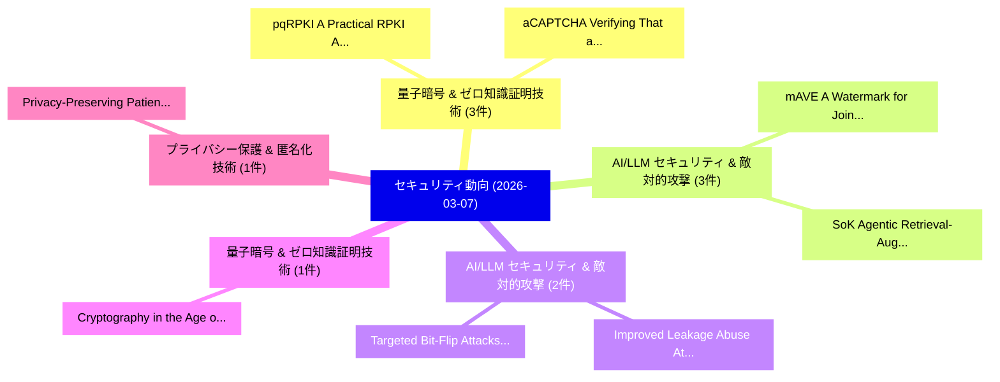

# 📅 02_daily: 日次エグゼクティブサマリー報告書 (2026-03-07)

**集計日時**: 2026-10-02 23:06:00 UTC  
**対象日付**: 2026-03-07  
**本日収集論文数**: 17 件  

---

## 💡 主要セキュリティ動向・脅威インサイト (Executive Insights)

本日の収集論文（計 17 件）において、以下の重点セキュリティ領域で活発な研究動向が確認されました：
- **量子暗号 & ゼロ知識証明技術** (3 件): 注目論文として 「pqRPKI: A Practical RPKI Archi...」、「aCAPTCHA: Verifying That an En...」 等が発表され、実務防御および攻撃検証の進展が見られます。
- **AI/LLM セキュリティ & 敵対的攻撃** (3 件): 注目論文として 「mAVE: A Watermark for Joint Au...」、「SoK: Agentic Retrieval-Augment...」 等が発表され、実務防御および攻撃検証の進展が見られます。
- **AI/LLM セキュリティ & 敵対的攻撃** (2 件): 注目論文として 「Improved Leakage Abuse Attacks...」、「Targeted Bit-Flip Attacks on L...」 等が発表され、実務防御および攻撃検証の進展が見られます。
- **量子暗号 & ゼロ知識証明技術** (1 件): 注目論文として 「Cryptography in the Age of Qua...」 等が発表され、実務防御および攻撃検証の進展が見られます。
- **プライバシー保護 & 匿名化技術** (1 件): 注目論文として 「Privacy-Preserving Patient Ide...」 等が発表され、実務防御および攻撃検証の進展が見られます。

### 🗺️ 技術・脅威トピックマインドマップ

---

## 📌 日次セキュリティ論文一覧 (日本語表形式)

| No | arXiv ID | 論文タイトル (日本語訳) | 重要キーワード | 構造化エグゼクティブ要約 (背景・提案・影響) | 脅威分類 | 詳細リンク |
|---|---|---|---|---|---|---|
| 1 | `2603.06968v1` | [pqRPKI: A Practical RPKI Architecture for the Post-Quantum Era（セキュリティ分析論文）](../../okf/papers/2026-03-07/2603.06968.md) | `Quantum Era`, `Post-Quantum Era`, `Weitong Li` | 【提案】概要 (Overview & Key Finding) 本論文「pqRPKI: A Practical RPKI Architecture for the Post-量子 E...。実証評価により経営層・セキュリティ管理者向け推奨アクション (E... | `cs.NI` | [arXiv](https://arxiv.org/abs/2603.06968v1) &#124; [OKF](../../okf/papers/2026-03-07/2603.06968.md) |
| 2 | `2603.06969v1` | [Cryptography in the Age of Quantum Computing and AI: Threats, Implementations, and Strategic Responseのセキュリティ強化](../../okf/papers/2026-03-07/2603.06969.md) | `Quantum Computing`, `Securing Cryptography`, `Strategic Response` | 【提案】概要 (Overview & Key Finding) 本論文「暗号技術 in the Age of 量子 Computing and AI: Threats, Implem...。実証評価により経営層・セキュリティ管理者向け推奨アクション (E... | `cybersecurity` | [arXiv](https://arxiv.org/abs/2603.06969v1) &#124; [OKF](../../okf/papers/2026-03-07/2603.06969.md) |
| 3 | `2603.07001v1` | [Privacy-Preserving Patient Identity Management Framework for Secure Healthcare Access（セキュリティ分析論文）](../../okf/papers/2026-03-07/2603.07001.md) | `Secure Healthcare Access`, `Privacy-Preserving Patient`, `Nasif Muslim` | 【提案】概要 (Overview & Key Finding) 本論文「Privacy-Preserving Patient Identity Management Framewor...。実証評価により経営層・セキュリティ管理者向け推奨アクション (E... | `cybersecurity` | [arXiv](https://arxiv.org/abs/2603.07001v1) &#124; [OKF](../../okf/papers/2026-03-07/2603.07001.md) |
| 4 | `2603.07004v1` | [An Extended Consent-Based Access Control Framework: Pre-Commit Validation and Emergency Access（セキュリティ分析論文）](../../okf/papers/2026-03-07/2603.07004.md) | `Consent-Based Access`, `Commit Validation`, `Emergency Access` | 【提案】概要 (Overview & Key Finding) 本論文「An Extended Consent-Based アクセス制御 Framework: Pre-Commit ...。実証評価により経営層・セキュリティ管理者向け推奨アクション (E... | `cybersecurity` | [arXiv](https://arxiv.org/abs/2603.07004v1) &#124; [OKF](../../okf/papers/2026-03-07/2603.07004.md) |
| 5 | `2603.07028v1` | [Two Frames Matter: A Temporal Attack for Text-to-Video Model Jailbreaking（セキュリティ分析論文）](../../okf/papers/2026-03-07/2603.07028.md) | `Two Frames Matter`, `Video Model Jailbreaking`, `Temporal Attack` | 【提案】概要 (Overview & Key Finding) 本論文「Two Frames Matter: A Temporal Attack for Text-to-Video ...。実証評価により経営層・セキュリティ管理者向け推奨アクション (E... | `cs.CV` | [arXiv](https://arxiv.org/abs/2603.07028v1) &#124; [OKF](../../okf/papers/2026-03-07/2603.07028.md) |
| 6 | `2603.07030v1` | [Improved Leakage Abuse Attacks in Searchable Symmetric Encryption with eBPF Monitoring（セキュリティ分析論文）](../../okf/papers/2026-03-07/2603.07030.md) | `Improved Leakage Abuse Attacks`, `Searchable Symmetric Encryption`, `Chinecherem Dimobi` | 【提案】概要 (Overview & Key Finding) 本論文「Improved Leakage Abuse Attacks in Searchable Symmetric ...。実証評価により経営層・セキュリティ管理者向け推奨アクション (E... | `executive-summary` | [arXiv](https://arxiv.org/abs/2603.07030v1) &#124; [OKF](../../okf/papers/2026-03-07/2603.07030.md) |
| 7 | `2603.07090v1` | [mAVE: A Watermark for Joint Audio-Visual Generation Models（セキュリティ分析論文）](../../okf/papers/2026-03-07/2603.07090.md) | `Visual Generation Models`, `Joint Audio`, `Audio-Visual Generation` | 【提案】概要 (Overview & Key Finding) 本論文「mAVE: A Watermark for Joint Audio-Visual Generation Mod...。実証評価により経営層・セキュリティ管理者向け推奨アクション (E... | `cs.AI` | [arXiv](https://arxiv.org/abs/2603.07090v1) &#124; [OKF](../../okf/papers/2026-03-07/2603.07090.md) |
| 8 | `2603.07116v1` | [aCAPTCHA: Verifying That an Entity Is a Capable Agent via Asymmetric Hardness（セキュリティ分析論文）](../../okf/papers/2026-03-07/2603.07116.md) | `Capable Agent`, `Asymmetric Hardness`, `Zuyao Xu` | 【提案】概要 (Overview & Key Finding) 本論文「aCAPTCHA: Verifying That an Entity Is a Capable Agent v...。実証評価により経営層・セキュリティ管理者向け推奨アクション (E... | `cs.AI` | [arXiv](https://arxiv.org/abs/2603.07116v1) &#124; [OKF](../../okf/papers/2026-03-07/2603.07116.md) |
| 9 | `2603.07191v2` | [Governance Architecture for Autonomous Agent Systems: Threats, Framework, and Engineering Practice（セキュリティ分析論文）](../../okf/papers/2026-03-07/2603.07191.md) | `Autonomous Agent Systems`, `Governance Architecture`, `Engineering Practice` | 【提案】概要 (Overview & Key Finding) 本論文「Governance Architecture for Autonomous Agent Systems: T...。実証評価により経営層・セキュリティ管理者向け推奨アクション (E... | `cs.AI` | [arXiv](https://arxiv.org/abs/2603.07191v2) &#124; [OKF](../../okf/papers/2026-03-07/2603.07191.md) |
| 10 | `2603.07204v1` | [Detecting Cryptographically Relevant Software Packages with Collaborative LLMs（セキュリティ分析論文）](../../okf/papers/2026-03-07/2603.07204.md) | `Detecting Cryptographically Relevant Software Packages`, `Eduard Hirsch`, `Kristina Raab` | 【提案】概要 (Overview & Key Finding) 本論文「Detecting Cryptographically Relevant Software Packages ...。実証評価により経営層・セキュリティ管理者向け推奨アクション (E... | `executive-summary` | [arXiv](https://arxiv.org/abs/2603.07204v1) &#124; [OKF](../../okf/papers/2026-03-07/2603.07204.md) |
| 11 | `2603.07267v2` | [How to Steal Reasoning Without Reasoning Traces（セキュリティ分析論文）](../../okf/papers/2026-03-07/2603.07267.md) | `Steal Reasoning Without Reasoning Traces`, `Tingwei Zhang`, `Vitaly Shmatikov` | 【提案】背景とセキュリティ上の課題 (Background & Problem) 本研究はサイバー脅威環境におけるセキュリティ構造・脆弱性の検証を目的としています。(主要検出項目: ...。実証評価によりMorris, Vitaly Shmatikov ... | `cybersecurity` | [arXiv](https://arxiv.org/abs/2603.07267v2) &#124; [OKF](../../okf/papers/2026-03-07/2603.07267.md) |
| 12 | `2603.07274v1` | [Worst--Case to Average--Case Reductions for SIS over integers（セキュリティ分析論文）](../../okf/papers/2026-03-07/2603.07274.md) | `Case Reductions`, `Myrto Eleftheria Gkogkou`, `Raw Meta` | 【提案】概要 (Overview & Key Finding) 本論文「Worst--Case to Average--Case Reductions for SIS over in...。実証評価によりDraziotis, Myrto Elefther... | `cybersecurity` | [arXiv](https://arxiv.org/abs/2603.07274v1) &#124; [OKF](../../okf/papers/2026-03-07/2603.07274.md) |
| 13 | `2603.07292v1` | [TopRank-Based Delivery Rate Optimization for Coded Caching under Non-Uniform Demands（セキュリティ分析論文）](../../okf/papers/2026-03-07/2603.07292.md) | `Based Delivery Rate Optimization`, `Coded Caching`, `TopRank-Based Delivery` | 【提案】概要 (Overview & Key Finding) 本論文「TopRank-Based Delivery Rate Optimization for Coded Cach...。実証評価により経営層・セキュリティ管理者向け推奨アクション (E... | `cybersecurity` | [arXiv](https://arxiv.org/abs/2603.07292v1) &#124; [OKF](../../okf/papers/2026-03-07/2603.07292.md) |
| 14 | `2603.07336v1` | [Explainable and Hardware-Efficient Jamming Detection for 5G Networks Using the Convolutional Tsetlin Machine（セキュリティ分析論文）](../../okf/papers/2026-03-07/2603.07336.md) | `Efficient Jamming Detection`, `Convolutional Tsetlin Machine`, `Networks Using` | 【提案】概要 (Overview & Key Finding) 本論文「Explainable and Hardware-Efficient Jamming Detection fo...。実証評価により経営層・セキュリティ管理者向け推奨アクション (E... | `cs.NI` | [arXiv](https://arxiv.org/abs/2603.07336v1) &#124; [OKF](../../okf/papers/2026-03-07/2603.07336.md) |
| 15 | `2603.07379v1` | [SoK: Agentic Retrieval-Augmented Generation (RAG): Taxonomy, Architectures, Evaluation, and Research Directions（セキュリティ分析論文）](../../okf/papers/2026-03-07/2603.07379.md) | `Agentic Retrieval`, `Augmented Generation`, `Research Directions` | 【提案】概要 (Overview & Key Finding) 本論文「SoK: Agentic Retrieval-Augmented Generation (RAG): Taxo...。実証評価により経営層・セキュリティ管理者向け推奨アクション (E... | `cs.AI` | [arXiv](https://arxiv.org/abs/2603.07379v1) &#124; [OKF](../../okf/papers/2026-03-07/2603.07379.md) |
| 16 | `2603.07381v2` | [SoK: Evolution, Security, and Fundamental Properties of Transactional Systems（セキュリティ分析論文）](../../okf/papers/2026-03-07/2603.07381.md) | `Fundamental Properties`, `Transactional Systems`, `Sky Pelletier Waterpeace` | 【提案】概要 (Overview & Key Finding) 本論文「SoK: Evolution, Security, and Fundamental Properties of...。実証評価により経営層・セキュリティ管理者向け推奨アクション (E... | `cybersecurity` | [arXiv](https://arxiv.org/abs/2603.07381v2) &#124; [OKF](../../okf/papers/2026-03-07/2603.07381.md) |
| 17 | `2603.10042v1` | [Targeted Bit-Flip Attacks on LLM-Based Agents（セキュリティ分析論文）](../../okf/papers/2026-03-07/2603.10042.md) | `Targeted Bit`, `Flip Attacks`, `Based Agents` | 【提案】概要 (Overview & Key Finding) 本論文「Targeted Bit-Flip Attacks on LLM-Based Agents（セキュリティ分析論...。実証評価により経営層・セキュリティ管理者向け推奨アクション (E... | `cs.AI` | [arXiv](https://arxiv.org/abs/2603.10042v1) &#124; [OKF](../../okf/papers/2026-03-07/2603.10042.md) |

