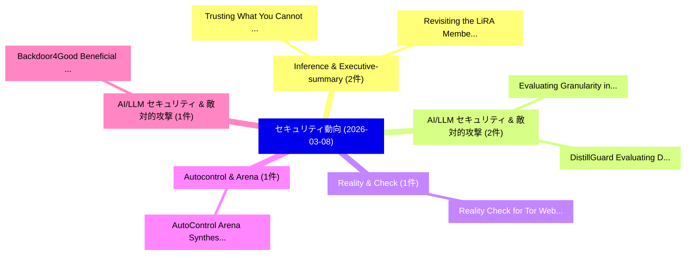

# 📅 02_daily: 日次エグゼクティブサマリー報告書 (2026-03-08)

**集計日時**: 2026-10-02 23:06:00 UTC  
**対象日付**: 2026-03-08  
**本日収集論文数**: 17 件  

---

## 💡 主要セキュリティ動向・脅威インサイト (Executive Insights)

本日の収集論文（計 17 件）において、以下の重点セキュリティ領域で活発な研究動向が確認されました：
- **Inference & Executive-summary** (2 件): 注目論文として 「Trusting What You Cannot See: ...」、「Revisiting the LiRA Membership...」 等が発表され、実務防御および攻撃検証の進展が見られます。
- **AI/LLM セキュリティ & 敵対的攻撃** (2 件): 注目論文として 「Evaluating Granularity in Mark...」、「DistillGuard: Evaluating Defen...」 等が発表され、実務防御および攻撃検証の進展が見られます。
- **Reality & Check** (1 件): 注目論文として 「Reality Check for Tor Website ...」 等が発表され、実務防御および攻撃検証の進展が見られます。
- **Autocontrol & Arena** (1 件): 注目論文として 「AutoControl Arena: Synthesizin...」 等が発表され、実務防御および攻撃検証の進展が見られます。
- **AI/LLM セキュリティ & 敵対的攻撃** (1 件): 注目論文として 「Backdoor4Good: Beneficial Uses...」 等が発表され、実務防御および攻撃検証の進展が見られます。

### 🗺️ 技術・脅威トピックマインドマップ

---

## 📌 日次セキュリティ論文一覧 (日本語表形式)

| No | arXiv ID | 論文タイトル (日本語訳) | 重要キーワード | 構造化エグゼクティブ要約 (背景・提案・影響) | 脅威分類 | 詳細リンク |
|---|---|---|---|---|---|---|
| 1 | `2603.07412v1` | [Reality Check for Tor Website Fingerprinting in the Open World（セキュリティ分析論文）](../../okf/papers/2026-03-08/2603.07412.md) | `Tor Website Fingerprinting`, `Reality Check`, `Open World` | 【提案】概要 (Overview & Key Finding) 本論文「Reality Check for Tor Website Fingerprinting in the Ope...。実証評価により経営層・セキュリティ管理者向け推奨アクション (E... | `cybersecurity` | [arXiv](https://arxiv.org/abs/2603.07412v1) &#124; [OKF](../../okf/papers/2026-03-08/2603.07412.md) |
| 2 | `2603.07427v2` | [AutoControl Arena: Synthesizing Executable Test Environments for Frontier AI Risk Evaluation（セキュリティ分析論文）](../../okf/papers/2026-03-08/2603.07427.md) | `Synthesizing Executable Test Environments`, `Changyi Li`, `Pengfei Lu` | 【提案】概要 (Overview & Key Finding) 本論文「AutoControl Arena: Synthesizing Executable Test Environ...。実証評価により経営層・セキュリティ管理者向け推奨アクション (E... | `cs.AI` | [arXiv](https://arxiv.org/abs/2603.07427v2) &#124; [OKF](../../okf/papers/2026-03-08/2603.07427.md) |
| 3 | `2603.07452v1` | [Backdoor4Good: Beneficial Uses of Backdoors in LLMsのベンチマーク評価](../../okf/papers/2026-03-08/2603.07452.md) | `Benchmarking Beneficial Uses`, `Beneficial Uses`, `Nay Myat Min` | 【提案】概要 (Overview & Key Finding) 本論文「Backdoor4Good: Beneficial Uses of Backdoors in LLMsのベンチ...。実証評価により経営層・セキュリティ管理者向け推奨アクション (E... | `cs.AI` | [arXiv](https://arxiv.org/abs/2603.07452v1) &#124; [OKF](../../okf/papers/2026-03-08/2603.07452.md) |
| 4 | `2603.07460v1` | [Where Do LLM-based Systems Break? A System-Level Security Framework for Risk Assessment and Treatment（セキュリティ分析論文）](../../okf/papers/2026-03-08/2603.07460.md) | `Systems Break`, `Risk Assessment`, `LLM-based Systems` | 【提案】A System-Level Security Framework for Risk Assessment and Treatment ### (日本語題名: Where D...。実証評価により経営層・セキュリティ管理者向け推奨アクション (E... | `cs.AI` | [arXiv](https://arxiv.org/abs/2603.07460v1) &#124; [OKF](../../okf/papers/2026-03-08/2603.07460.md) |
| 5 | `2603.07466v2` | [Trusting What You Cannot See: Auditable Fine-Tuning and Inference for Proprietary AI（セキュリティ分析論文）](../../okf/papers/2026-03-08/2603.07466.md) | `Auditable Fine`, `Heng Jin`, `Chaoyu Zhang` | 【提案】背景とセキュリティ上の課題 (Background & Problem) 本研究はサイバー脅威環境におけるセキュリティ構造・脆弱性の検証を目的としています。(主要検出項目: ...。実証評価により経営層・セキュリティ管理者向け推奨アクション (E... | `executive-summary` | [arXiv](https://arxiv.org/abs/2603.07466v2) &#124; [OKF](../../okf/papers/2026-03-08/2603.07466.md) |
| 6 | `2603.07473v2` | [Give Them an Inch and They Will Take a Mile:Understanding and Measuring Caller Identity Confusion in MCP-Based AI Systems（セキュリティ分析論文）](../../okf/papers/2026-03-08/2603.07473.md) | `Measuring Caller Identity Confusion`, `MCP-Based AI`, `Yuhang Huang` | 【提案】概要 (Overview & Key Finding) 本論文「Give Them an Inch and They Will Take a Mile:Understandi...。実証評価により経営層・セキュリティ管理者向け推奨アクション (E... | `cs.AI` | [arXiv](https://arxiv.org/abs/2603.07473v2) &#124; [OKF](../../okf/papers/2026-03-08/2603.07473.md) |
| 7 | `2603.07496v2` | [From Thinker to Society: Security in Hierarchical Autonomy Evolution of AI Agents（セキュリティ分析論文）](../../okf/papers/2026-03-08/2603.07496.md) | `Hierarchical Autonomy Evolution`, `Xiaolei Zhang`, `Lu Zhou` | 【提案】概要 (Overview & Key Finding) 本論文「From Thinker to Society: Security in Hierarchical Auton...。実証評価により経営層・セキュリティ管理者向け推奨アクション (E... | `cs.AI` | [arXiv](https://arxiv.org/abs/2603.07496v2) &#124; [OKF](../../okf/papers/2026-03-08/2603.07496.md) |
| 8 | `2603.07560v2` | [Learning the APT Kill Chain: Temporal Reasoning over Provenance Data for Attack Stage Estimation（セキュリティ分析論文）](../../okf/papers/2026-03-08/2603.07560.md) | `Attack Stage Estimation`, `Kill Chain`, `Temporal Reasoning` | 【提案】概要 (Overview & Key Finding) 本論文「Learning the APT Kill Chain: Temporal Reasoning over Pr...。実証評価により経営層・セキュリティ管理者向け推奨アクション (E... | `cs.NI` | [arXiv](https://arxiv.org/abs/2603.07560v2) &#124; [OKF](../../okf/papers/2026-03-08/2603.07560.md) |
| 9 | `2603.07567v1` | [Revisiting the LiRA Membership Inference Attack Under Realistic Assumptions（セキュリティ分析論文）](../../okf/papers/2026-03-08/2603.07567.md) | `Najeeb Jebreel`, `Mona Khalil`, `Josep Domingo` | 【提案】概要 (Overview & Key Finding) 本論文「Revisiting the LiRA Membership Inference Attack Under R...。実証評価により経営層・セキュリティ管理者向け推奨アクション (E... | `executive-summary` | [arXiv](https://arxiv.org/abs/2603.07567v1) &#124; [OKF](../../okf/papers/2026-03-08/2603.07567.md) |
| 10 | `2603.07632v2` | [PoEW:Encryption as Consensus and Enabling Data Compression Services?（セキュリティ分析論文）](../../okf/papers/2026-03-08/2603.07632.md) | `Enabling Data Compression Services`, `Chong Guan`, `Raw Meta` | 【提案】### (日本語題名: PoEW:Encryption as Consensus and Enabling Data Compression Services?（セキュリティ...。実証評価により経営層・セキュリティ管理者向け推奨アクション (E... | `cybersecurity` | [arXiv](https://arxiv.org/abs/2603.07632v2) &#124; [OKF](../../okf/papers/2026-03-08/2603.07632.md) |
| 11 | `2603.07646v1` | [Registered Attribute-Based Encryption with Publicly Verifiable Certified Deletion, Everlasting Security, and More（セキュリティ分析論文）](../../okf/papers/2026-03-08/2603.07646.md) | `Publicly Verifiable Certified Deletion`, `Registered Attribute`, `Based Encryption` | 【提案】概要 (Overview & Key Finding) 本論文「Registered Attribute-Based Encryption with Publicly Ver...。実証評価により経営層・セキュリティ管理者向け推奨アクション (E... | `cybersecurity` | [arXiv](https://arxiv.org/abs/2603.07646v1) &#124; [OKF](../../okf/papers/2026-03-08/2603.07646.md) |
| 12 | `2603.07716v1` | [SoK: The Evolution of Maximal Extractable Value, From Miners to Cross-Chain（セキュリティ分析論文）](../../okf/papers/2026-03-08/2603.07716.md) | `Maximal Extractable Value`, `Hasret Ozan Sevim`, `Davide Mancino` | 【提案】概要 (Overview & Key Finding) 本論文「SoK: The Evolution of Maximal Extractable Value, From M...。実証評価により経営層・セキュリティ管理者向け推奨アクション (E... | `cybersecurity` | [arXiv](https://arxiv.org/abs/2603.07716v1) &#124; [OKF](../../okf/papers/2026-03-08/2603.07716.md) |
| 13 | `2603.07724v1` | [Evaluating Granularity in Markov Chain-Based Trust Models for Vehicular Ad Hoc Networks (VANETs)（セキュリティ分析論文）](../../okf/papers/2026-03-08/2603.07724.md) | `Vehicular Ad Hoc Networks`, `Based Trust Models`, `Evaluating Granularity` | 【提案】概要 (Overview & Key Finding) 本論文「Evaluating Granularity in Markov Chain-Based Trust Mode...。実証評価により経営層・セキュリティ管理者向け推奨アクション (E... | `cybersecurity` | [arXiv](https://arxiv.org/abs/2603.07724v1) &#124; [OKF](../../okf/papers/2026-03-08/2603.07724.md) |
| 14 | `2603.07726v1` | [Post-quantum 連合学習: Secure And Scalable Threat Intelligence For Collaborative Cyber Defense](../../okf/papers/2026-03-08/2603.07726.md) | `Federated Learning`, `Post-quantum Federated`, `Prabhudarshi Nayak` | 【提案】概要 (Overview & Key Finding) 本論文「Post-量子 連合学習: Secure And Scalable 脅威 Intelligence For C...。実証評価により経営層・セキュリティ管理者向け推奨アクション (E... | `cybersecurity` | [arXiv](https://arxiv.org/abs/2603.07726v1) &#124; [OKF](../../okf/papers/2026-03-08/2603.07726.md) |
| 15 | `2603.07820v1` | [Broken Access: On the Challenges of Screen Reader Assisted Two-Factor and Passwordless Authentication（セキュリティ分析論文）](../../okf/papers/2026-03-08/2603.07820.md) | `Screen Reader Assisted Two`, `Broken Access`, `Passwordless Authentication` | 【提案】概要 (Overview & Key Finding) 本論文「Broken Access: On the Challenges of Screen Reader Assis...。実証評価により経営層・セキュリティ管理者向け推奨アクション (E... | `executive-summary` | [arXiv](https://arxiv.org/abs/2603.07820v1) &#124; [OKF](../../okf/papers/2026-03-08/2603.07820.md) |
| 16 | `2603.07835v1` | [DistillGuard: Evaluating Defenses Against LLM Knowledge Distillation（セキュリティ分析論文）](../../okf/papers/2026-03-08/2603.07835.md) | `Knowledge Distillation`, `Bo Jiang`, `Raw Meta` | 【提案】概要 (Overview & Key Finding) 本論文「DistillGuard: Evaluating Defenses Against LLM Knowledge...。実証評価により経営層・セキュリティ管理者向け推奨アクション (E... | `cs.AI` | [arXiv](https://arxiv.org/abs/2603.07835v1) &#124; [OKF](../../okf/papers/2026-03-08/2603.07835.md) |
| 17 | `2603.08760v1` | [Clear, Compelling Arguments: Rethinking the Foundations of Frontier AI Safety Cases（セキュリティ分析論文）](../../okf/papers/2026-03-08/2603.08760.md) | `Compelling Arguments`, `Safety Cases`, `Shaun Feakins` | 【提案】概要 (Overview & Key Finding) 本論文「Clear, Compelling Arguments: Rethinking the Foundations...。実証評価により経営層・セキュリティ管理者向け推奨アクション (E... | `cs.AI` | [arXiv](https://arxiv.org/abs/2603.08760v1) &#124; [OKF](../../okf/papers/2026-03-08/2603.08760.md) |

