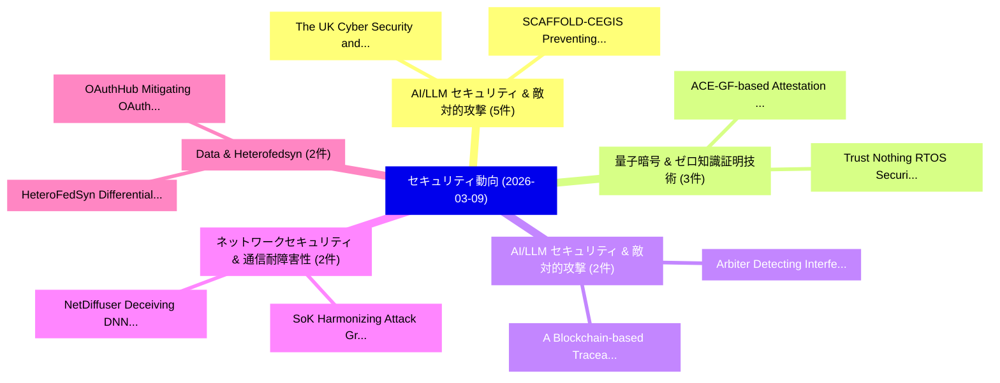

# 📅 02_daily: 日次エグゼクティブサマリー報告書 (2026-03-09)

**集計日時**: 2026-10-02 23:06:00 UTC  
**対象日付**: 2026-03-09  
**本日収集論文数**: 35 件  

---

## 💡 主要セキュリティ動向・脅威インサイト (Executive Insights)

本日の収集論文（計 35 件）において、以下の重点セキュリティ領域で活発な研究動向が確認されました：
- **AI/LLM セキュリティ & 敵対的攻撃** (5 件): 注目論文として 「The UK Cyber Security and Resi...」、「SCAFFOLD-CEGIS: Preventing Lat...」 等が発表され、実務防御および攻撃検証の進展が見られます。
- **量子暗号 & ゼロ知識証明技術** (3 件): 注目論文として 「ACE-GF-based Attestation Relay...」、「Trust Nothing: RTOS Security w...」 等が発表され、実務防御および攻撃検証の進展が見られます。
- **AI/LLM セキュリティ & 敵対的攻撃** (2 件): 注目論文として 「A Blockchain-based Traceabilit...」、「Arbiter: Detecting Interferenc...」 等が発表され、実務防御および攻撃検証の進展が見られます。
- **ネットワークセキュリティ & 通信耐障害性** (2 件): 注目論文として 「SoK: Harmonizing Attack Graphs...」、「NetDiffuser: Deceiving DNN-Bas...」 等が発表され、実務防御および攻撃検証の進展が見られます。
- **Data & Heterofedsyn** (2 件): 注目論文として 「HeteroFedSyn: Differentially P...」、「OAuthHub: Mitigating OAuth Dat...」 等が発表され、実務防御および攻撃検証の進展が見られます。

### 🗺️ 技術・脅威トピックマインドマップ

---

## 📌 日次セキュリティ論文一覧 (日本語表形式)

| No | arXiv ID | 論文タイトル (日本語訳) | 重要キーワード | 構造化エグゼクティブ要約 (背景・提案・影響) | 脅威分類 | 詳細リンク |
|---|---|---|---|---|---|---|
| 1 | `2603.07861v1` | [The UK Cyber Security and Resilience Bill: A Practitioner's Guide to Legislative Reform, Compliance, and Organisational Readiness（セキュリティ分析論文）](../../okf/papers/2026-03-09/2603.07861.md) | `Cyber Security`, `Resilience Bill`, `Legislative Reform` | 【提案】概要 (Overview & Key Finding) 本論文「The UK Cyber Security and Resilience Bill: A Practition...。実証評価により経営層・セキュリティ管理者向け推奨アクション (E... | `cybersecurity` | [arXiv](https://arxiv.org/abs/2603.07861v1) &#124; [OKF](../../okf/papers/2026-03-09/2603.07861.md) |
| 2 | `2603.07933v1` | [Condition-Triggered Cryptographic Asset Control via Dormant Authorization Paths（セキュリティ分析論文）](../../okf/papers/2026-03-09/2603.07933.md) | `Triggered Cryptographic Asset Control`, `Dormant Authorization Paths`, `Condition-Triggered Cryptographic` | 【提案】概要 (Overview & Key Finding) 本論文「Condition-Triggered Cryptographic Asset Control via Dor...。実証評価により経営層・セキュリティ管理者向け推奨アクション (E... | `cybersecurity` | [arXiv](https://arxiv.org/abs/2603.07933v1) &#124; [OKF](../../okf/papers/2026-03-09/2603.07933.md) |
| 3 | `2603.07947v1` | [Lattice: A Post-Quantum Settlement Layer（セキュリティ分析論文）](../../okf/papers/2026-03-09/2603.07947.md) | `Quantum Settlement Layer`, `Post-Quantum Settlement`, `David Alejandro Trejo Pizzo` | 【提案】概要 (Overview & Key Finding) 本論文「Lattice: A Post-量子 Settlement Layer（セキュリティ分析論文）」（原題: La...。実証評価により経営層・セキュリティ管理者向け推奨アクション (E... | `executive-summary` | [arXiv](https://arxiv.org/abs/2603.07947v1) &#124; [OKF](../../okf/papers/2026-03-09/2603.07947.md) |
| 4 | `2603.07974v3` | [ZK-ACE: Identity-Centric Zero-Knowledge Authorization for Post-Quantum Blockchain Systems（セキュリティ分析論文）](../../okf/papers/2026-03-09/2603.07974.md) | `Quantum Blockchain Systems`, `Centric Zero`, `Knowledge Authorization` | 【提案】概要 (Overview & Key Finding) 本論文「ZK-ACE: Identity-Centric Zero-Knowledge Authorization f...。実証評価により経営層・セキュリティ管理者向け推奨アクション (E... | `executive-summary` | [arXiv](https://arxiv.org/abs/2603.07974v3) &#124; [OKF](../../okf/papers/2026-03-09/2603.07974.md) |
| 5 | `2603.07982v1` | [ACE-GF-based Attestation Relay for PQC - Lightweight Mempool Propagation Without On-Path Proofs（セキュリティ分析論文）](../../okf/papers/2026-03-09/2603.07982.md) | `Attestation Relay`, `Path Proofs`, `On-Path Proofs` | 【提案】背景とセキュリティ上の課題 (Background & Problem) 本研究はサイバー脅威環境におけるセキュリティ構造・脆弱性の検証を目的としています。(主要検出項目: ...。実証評価により経営層・セキュリティ管理者向け推奨アクション (E... | `executive-summary` | [arXiv](https://arxiv.org/abs/2603.07982v1) &#124; [OKF](../../okf/papers/2026-03-09/2603.07982.md) |
| 6 | `2603.07996v1` | [More to Extract: Discovering MEV by Token Contract Analysis（セキュリティ分析論文）](../../okf/papers/2026-03-09/2603.07996.md) | `Jiaqi Chen`, `Yuzhe Tang`, `Yue Duan` | 【提案】概要 (Overview & Key Finding) 本論文「More to Extract: Discovering MEV by Token Contract Anal...。実証評価により経営層・セキュリティ管理者向け推奨アクション (E... | `cybersecurity` | [arXiv](https://arxiv.org/abs/2603.07996v1) &#124; [OKF](../../okf/papers/2026-03-09/2603.07996.md) |
| 7 | `2603.08200v1` | [Experience on Automatically Converting a C++ Monolith to Java EE（セキュリティ分析論文）](../../okf/papers/2026-03-09/2603.08200.md) | `Automatically Converting`, `Andre Vehreschild`, `Lexi Pimenidis` | 【提案】概要 (Overview & Key Finding) 本論文「Experience on Automatically Converting a C++ Monolith t...。実証評価により経営層・セキュリティ管理者向け推奨アクション (E... | `cybersecurity` | [arXiv](https://arxiv.org/abs/2603.08200v1) &#124; [OKF](../../okf/papers/2026-03-09/2603.08200.md) |
| 8 | `2603.08204v1` | [A Bipartite Quantum Key Distribution Protocol Based on Indefinite Causal Order（セキュリティ分析論文）](../../okf/papers/2026-03-09/2603.08204.md) | `Bipartite Quantum Key Distribution Protocol Based`, `Indefinite Causal Order`, `Ryszard Kukulski` | 【提案】概要 (Overview & Key Finding) 本論文「A Bipartite 量子鍵配送 Protocol Based on Indefinite Causal O...。実証評価により経営層・セキュリティ管理者向け推奨アクション (E... | `executive-summary` | [arXiv](https://arxiv.org/abs/2603.08204v1) &#124; [OKF](../../okf/papers/2026-03-09/2603.08204.md) |
| 9 | `2603.08218v1` | [A Comparative Study of Recent Advances in Internet of Intrusion Detection Things（セキュリティ分析論文）](../../okf/papers/2026-03-09/2603.08218.md) | `Intrusion Detection Things`, `Recent Advances`, `Marianna Rezk` | 【提案】概要 (Overview & Key Finding) 本論文「A Comparative Study of Recent Advances in Internet of I...。実証評価により経営層・セキュリティ管理者向け推奨アクション (E... | `cs.NI` | [arXiv](https://arxiv.org/abs/2603.08218v1) &#124; [OKF](../../okf/papers/2026-03-09/2603.08218.md) |
| 10 | `2603.08221v1` | [SplitAgent: A Privacy-Preserving Distributed Architecture for Enterprise-Cloud Agent Collaboration（セキュリティ分析論文）](../../okf/papers/2026-03-09/2603.08221.md) | `Preserving Distributed Architecture`, `Cloud Agent Collaboration`, `Privacy-Preserving Distributed` | 【提案】概要 (Overview & Key Finding) 本論文「SplitAgent: A Privacy-Preserving Distributed Architectu...。実証評価により経営層・セキュリティ管理者向け推奨アクション (E... | `cs.AI` | [arXiv](https://arxiv.org/abs/2603.08221v1) &#124; [OKF](../../okf/papers/2026-03-09/2603.08221.md) |
| 11 | `2603.08225v3` | [Practical Type Inference: High-Throughput Recovery of Real-World Structures and Function Signatures（セキュリティ分析論文）](../../okf/papers/2026-03-09/2603.08225.md) | `Practical Type Inference`, `Throughput Recovery`, `World Structures` | 【提案】概要 (Overview & Key Finding) 本論文「Practical Type Inference: High-Throughput Recovery of R...。実証評価により経営層・セキュリティ管理者向け推奨アクション (E... | `cybersecurity` | [arXiv](https://arxiv.org/abs/2603.08225v3) &#124; [OKF](../../okf/papers/2026-03-09/2603.08225.md) |
| 12 | `2603.08288v1` | [A Blockchain-based Traceability System for AI-Driven Engine Blade Inspection（セキュリティ分析論文）](../../okf/papers/2026-03-09/2603.08288.md) | `Driven Engine Blade Inspection`, `Traceability System`, `Blockchain-based Traceability` | 【提案】概要 (Overview & Key Finding) 本論文「A Blockchain-based Traceability System for AI-Driven En...。実証評価により経営層・セキュリティ管理者向け推奨アクション (E... | `cs.AI` | [arXiv](https://arxiv.org/abs/2603.08288v1) &#124; [OKF](../../okf/papers/2026-03-09/2603.08288.md) |
| 13 | `2603.08295v1` | [SoK: Harmonizing Attack Graphs and Intrusion Detection Systems（セキュリティ分析論文）](../../okf/papers/2026-03-09/2603.08295.md) | `Harmonizing Attack Graphs`, `Intrusion Detection Systems`, `Andrea Agiollo` | 【提案】概要 (Overview & Key Finding) 本論文「SoK: Harmonizing Attack Graphs and Intrusion Detection ...。実証評価により経営層・セキュリティ管理者向け推奨アクション (E... | `cybersecurity` | [arXiv](https://arxiv.org/abs/2603.08295v1) &#124; [OKF](../../okf/papers/2026-03-09/2603.08295.md) |
| 14 | `2603.08316v3` | [SlowBA: An efficiency backdoor attack VLM-based GUI agentsに向けて](../../okf/papers/2026-03-09/2603.08316.md) | `VLM-based GUI`, `Junxian Li`, `Tu Lan` | 【提案】概要 (Overview & Key Finding) 本論文「SlowBA: An efficiency backdoor attack VLM-based GUI age...。実証評価により経営層・セキュリティ管理者向け推奨アクション (E... | `cs.CV` | [arXiv](https://arxiv.org/abs/2603.08316v3) &#124; [OKF](../../okf/papers/2026-03-09/2603.08316.md) |
| 15 | `2603.08400v1` | [Trust Nothing: RTOS Security without Run-Time Software TCB (Extended Version)（セキュリティ分析論文）](../../okf/papers/2026-03-09/2603.08400.md) | `Trust Nothing`, `Time Software`, `Extended Version` | 【提案】背景とセキュリティ上の課題 (Background & Problem) 本研究はサイバー脅威環境におけるセキュリティ構造・脆弱性の検証を目的としています。(主要検出項目: ...。実証評価により経営層・セキュリティ管理者向け推奨アクション (E... | `executive-summary` | [arXiv](https://arxiv.org/abs/2603.08400v1) &#124; [OKF](../../okf/papers/2026-03-09/2603.08400.md) |
| 16 | `2603.08421v1` | [Client-Cooperative Split Learning（セキュリティ分析論文）](../../okf/papers/2026-03-09/2603.08421.md) | `Cooperative Split Learning`, `Client-Cooperative Split`, `Ren Ping Liu` | 【提案】概要 (Overview & Key Finding) 本論文「Client-Cooperative Split Learning（セキュリティ分析論文）」（原題: Clie...。実証評価により経営層・セキュリティ管理者向け推奨アクション (E... | `cybersecurity` | [arXiv](https://arxiv.org/abs/2603.08421v1) &#124; [OKF](../../okf/papers/2026-03-09/2603.08421.md) |
| 17 | `2603.08484v1` | [Modeling Cybersecurity Behavior of Humans in Organizationsに向けて](../../okf/papers/2026-03-09/2603.08484.md) | `Towards Modeling Cybersecurity Behavior`, `Modeling Cybersecurity Behavior`, `Klaas Ole` | 【提案】概要 (Overview & Key Finding) 本論文「Modeling Cybersecurity Behavior of Humans in Organizati...。実証評価により経営層・セキュリティ管理者向け推奨アクション (E... | `cybersecurity` | [arXiv](https://arxiv.org/abs/2603.08484v1) &#124; [OKF](../../okf/papers/2026-03-09/2603.08484.md) |
| 18 | `2603.08520v1` | [SCAFFOLD-CEGIS: Preventing Latent Security Degradation in LLM-Driven Iterative Code Refinement（セキュリティ分析論文）](../../okf/papers/2026-03-09/2603.08520.md) | `Preventing Latent Security Degradation`, `Driven Iterative Code Refinement`, `LLM-Driven Iterative` | 【提案】概要 (Overview & Key Finding) 本論文「SCAFFOLD-CEGIS: Preventing Latent Security Degradation ...。実証評価により経営層・セキュリティ管理者向け推奨アクション (E... | `executive-summary` | [arXiv](https://arxiv.org/abs/2603.08520v1) &#124; [OKF](../../okf/papers/2026-03-09/2603.08520.md) |
| 19 | `2603.08566v2` | [OSS-CRS: Liberating AIxCC Cyber Reasoning Systems for Real-World Open-Source Security（セキュリティ分析論文）](../../okf/papers/2026-03-09/2603.08566.md) | `Cyber Reasoning Systems`, `World Open`, `Source Security` | 【提案】概要 (Overview & Key Finding) 本論文「OSS-CRS: Liberating AIxCC Cyber Reasoning Systems for R...。実証評価により経営層・セキュリティ管理者向け推奨アクション (E... | `cs.AI` | [arXiv](https://arxiv.org/abs/2603.08566v2) &#124; [OKF](../../okf/papers/2026-03-09/2603.08566.md) |
| 20 | `2603.08580v2` | [SmartGraphical: A Human-in-the-Loop Framework for Detecting Smart Contract Logical Vulnerabilities via Pattern-Driven Static Analysis and Visual Abstraction（セキュリティ分析論文）](../../okf/papers/2026-03-09/2603.08580.md) | `Detecting Smart Contract Logical Vulnerabilities`, `Visual Abstraction`, `Pattern-Driven Static` | 【提案】概要 (Overview & Key Finding) 本論文「SmartGraphical: A Human-in-the-Loop Framework for Detec...。実証評価により経営層・セキュリティ管理者向け推奨アクション (E... | `cybersecurity` | [arXiv](https://arxiv.org/abs/2603.08580v2) &#124; [OKF](../../okf/papers/2026-03-09/2603.08580.md) |
| 21 | `2603.08616v1` | [Coverage-Guided Multi-Agent Harness Generation for Java Library Fuzzing（セキュリティ分析論文）](../../okf/papers/2026-03-09/2603.08616.md) | `Agent Harness Generation`, `Java Library Fuzzing`, `Guided Multi` | 【提案】概要 (Overview & Key Finding) 本論文「Coverage-Guided Multi-Agent Harness Generation for Java...。実証評価により経営層・セキュリティ管理者向け推奨アクション (E... | `executive-summary` | [arXiv](https://arxiv.org/abs/2603.08616v1) &#124; [OKF](../../okf/papers/2026-03-09/2603.08616.md) |
| 22 | `2603.08629v1` | [Why No Consensus on Consensus? A Deep Dive into Blockchain Consensus Protocols（セキュリティ分析論文）](../../okf/papers/2026-03-09/2603.08629.md) | `Blockchain Consensus Protocols`, `Deep Dive`, `Mohammad Pishdar` | 【提案】A Deep Dive into Blockchain Consensus Protocols ### (日本語題名: Why No Consensus on Consensus?。実証評価により経営層・セキュリティ管理者向け推奨アクション (E... | `cybersecurity` | [arXiv](https://arxiv.org/abs/2603.08629v1) &#124; [OKF](../../okf/papers/2026-03-09/2603.08629.md) |
| 23 | `2603.08665v2` | [サイバーセキュリティ AI: Hacking Consumer Robots in the AI Era](../../okf/papers/2026-03-09/2603.08665.md) | `Hacking Consumer Robots`, `Unai Ayucar`, `Olivier Laflamme` | 【提案】概要 (Overview & Key Finding) 本論文「サイバーセキュリティ AI: Hacking Consumer Robots in the AI Era」（原...。実証評価により経営層・セキュリティ管理者向け推奨アクション (E... | `cybersecurity` | [arXiv](https://arxiv.org/abs/2603.08665v2) &#124; [OKF](../../okf/papers/2026-03-09/2603.08665.md) |
| 24 | `2603.08832v1` | [HeteroFedSyn: Differentially Private Tabular Data Synthesis for Heterogeneous Federated Settings（セキュリティ分析論文）](../../okf/papers/2026-03-09/2603.08832.md) | `Differentially Private Tabular Data Synthesis`, `Heterogeneous Federated Settings`, `Heterogeneous Federated Sett` | 【提案】概要 (Overview & Key Finding) 本論文「HeteroFedSyn: Differentially Private Tabular Data Synth...。実証評価により経営層・セキュリティ管理者向け推奨アクション (E... | `cybersecurity` | [arXiv](https://arxiv.org/abs/2603.08832v1) &#124; [OKF](../../okf/papers/2026-03-09/2603.08832.md) |
| 25 | `2603.08854v1` | [DeZent: Decentralized z-Anonymity with Privacy-Preserving Coordination（セキュリティ分析論文）](../../okf/papers/2026-03-09/2603.08854.md) | `Preserving Coordination`, `Privacy-Preserving Coordination`, `Carolin Brunn` | 【提案】概要 (Overview & Key Finding) 本論文「DeZent: Decentralized z-Anonymity with Privacy-Preservi...。実証評価により経営層・セキュリティ管理者向け推奨アクション (E... | `executive-summary` | [arXiv](https://arxiv.org/abs/2603.08854v1) &#124; [OKF](../../okf/papers/2026-03-09/2603.08854.md) |
| 26 | `2603.08901v1` | [NetDiffuser: Deceiving DNN-Based Network Attack Detection Systems with Diffusion-Generated Adversarial Traffic（セキュリティ分析論文）](../../okf/papers/2026-03-09/2603.08901.md) | `Based Network Attack Detection Systems`, `Generated Adversarial Traffic`, `DNN-Based Network` | 【提案】概要 (Overview & Key Finding) 本論文「NetDiffuser: Deceiving DNN-Based Network Attack Detecti...。実証評価により経営層・セキュリティ管理者向け推奨アクション (E... | `cs.AI` | [arXiv](https://arxiv.org/abs/2603.08901v1) &#124; [OKF](../../okf/papers/2026-03-09/2603.08901.md) |
| 27 | `2603.08913v2` | [Quantifying Memorization and Privacy Risks in Genomic Language Models（セキュリティ分析論文）](../../okf/papers/2026-03-09/2603.08913.md) | `Genomic Language Models`, `Quantifying Memorization`, `Privacy Risks` | 【提案】概要 (Overview & Key Finding) 本論文「Quantifying Memorization and Privacy Risks in Genomic L...。実証評価により経営層・セキュリティ管理者向け推奨アクション (E... | `Privacy & Provenance` | [arXiv](https://arxiv.org/abs/2603.08913v2) &#124; [OKF](../../okf/papers/2026-03-09/2603.08913.md) |
| 28 | `2603.08993v1` | [Arbiter: Detecting Interference in LLM Agent System Prompts（セキュリティ分析論文）](../../okf/papers/2026-03-09/2603.08993.md) | `Agent System Prompts`, `Detecting Interference`, `Tony Mason` | 【提案】概要 (Overview & Key Finding) 本論文「Arbiter: Detecting Interference in LLM Agent System Pro...。実証評価により経営層・セキュリティ管理者向け推奨アクション (E... | `cs.PL` | [arXiv](https://arxiv.org/abs/2603.08993v1) &#124; [OKF](../../okf/papers/2026-03-09/2603.08993.md) |
| 29 | `2603.09002v2` | [Security Considerations for Multi-agent Systems（セキュリティ分析論文）](../../okf/papers/2026-03-09/2603.09002.md) | `Security Considerations`, `Multi-agent Systems`, `Tam Nguyen` | 【提案】概要 (Overview & Key Finding) 本論文「Security Considerations for Multi-agent Systems（セキュリティ分...。実証評価により経営層・セキュリティ管理者向け推奨アクション (E... | `cs.AI` | [arXiv](https://arxiv.org/abs/2603.09002v2) &#124; [OKF](../../okf/papers/2026-03-09/2603.09002.md) |
| 30 | `2603.09025v1` | [Lockbox -- A Zero Trust Architecture for Secure Processing of Sensitive Cloud Workloads（セキュリティ分析論文）](../../okf/papers/2026-03-09/2603.09025.md) | `Zero Trust Architecture`, `Sensitive Cloud Workloads`, `Secure Processing` | 【提案】概要 (Overview & Key Finding) 本論文「Lockbox -- A ゼロトラスト Architecture for Secure Processing ...。実証評価により経営層・セキュリティ管理者向け推奨アクション (E... | `executive-summary` | [arXiv](https://arxiv.org/abs/2603.09025v1) &#124; [OKF](../../okf/papers/2026-03-09/2603.09025.md) |
| 31 | `2603.10051v2` | [Where Do Flow Semantics Reside? A Protocol-Native Tabular Pretraining Paradigm for Encrypted Traffic Classification（セキュリティ分析論文）](../../okf/papers/2026-03-09/2603.10051.md) | `Native Tabular Pretraining Paradigm`, `Encrypted Traffic Classification`, `Protocol-Native Tabular` | 【提案】A Protocol-Native Tabular Pretraining Paradigm for Encrypted Traffic Classification ###...。実証評価により経営層・セキュリティ管理者向け推奨アクション (E... | `cs.NI` | [arXiv](https://arxiv.org/abs/2603.10051v2) &#124; [OKF](../../okf/papers/2026-03-09/2603.10051.md) |
| 32 | `2603.10056v1` | [OAuthHub: Mitigating OAuth Data Overaccess through a Local Data Hub（セキュリティ分析論文）](../../okf/papers/2026-03-09/2603.10056.md) | `Local Data Hub`, `Data Overaccess`, `Qiyu Li` | 【提案】概要 (Overview & Key Finding) 本論文「OAuthHub: Mitigating OAuth Data Overaccess through a Lo...。実証評価により経営層・セキュリティ管理者向け推奨アクション (E... | `cs.NI` | [arXiv](https://arxiv.org/abs/2603.10056v1) &#124; [OKF](../../okf/papers/2026-03-09/2603.10056.md) |
| 33 | `2603.10057v1` | [SBOMs into Agentic AIBOMs: Schema Extensions, Agentic Orchestration, and Reproducibility Evaluation（セキュリティ分析論文）](../../okf/papers/2026-03-09/2603.10057.md) | `Schema Extensions`, `Agentic Orchestration`, `Petar Radanliev` | 【提案】概要 (Overview & Key Finding) 本論文「SBOMs into Agentic AIBOMs: Schema Extensions, Agentic O...。実証評価により経営層・セキュリティ管理者向け推奨アクション (E... | `cs.AI` | [arXiv](https://arxiv.org/abs/2603.10057v1) &#124; [OKF](../../okf/papers/2026-03-09/2603.10057.md) |
| 34 | `2603.10060v1` | [Tool Receipts, Not Zero-Knowledge Proofs: Practical Hallucination Detection for AI Agents（セキュリティ分析論文）](../../okf/papers/2026-03-09/2603.10060.md) | `Practical Hallucination Detection`, `Tool Receipts`, `Knowledge Proofs` | 【提案】背景とセキュリティ上の課題 (Background & Problem) 本研究はサイバー脅威環境におけるセキュリティ構造・脆弱性の検証を目的としています。(主要検出項目: ...。実証評価により経営層・セキュリティ管理者向け推奨アクション (E... | `cs.AI` | [arXiv](https://arxiv.org/abs/2603.10060v1) &#124; [OKF](../../okf/papers/2026-03-09/2603.10060.md) |
| 35 | `2603.10063v1` | [Building Privacy-and-Security-Focused 連合学習 Infrastructure for Global Multi-Centre Healthcare Research](../../okf/papers/2026-03-09/2603.10063.md) | `Centre Healthcare Research`, `Building Privacy`, `Global Multi` | 【提案】概要 (Overview & Key Finding) 本論文「Building Privacy-and-Security-Focused 連合学習 Infrastructu...。実証評価により経営層・セキュリティ管理者向け推奨アクション (E... | `executive-summary` | [arXiv](https://arxiv.org/abs/2603.10063v1) &#124; [OKF](../../okf/papers/2026-03-09/2603.10063.md) |

