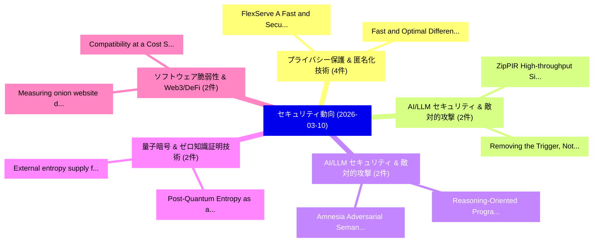

# 📅 02_daily: 日次エグゼクティブサマリー報告書 (2026-03-10)

**集計日時**: 2026-10-02 23:06:00 UTC  
**対象日付**: 2026-03-10  
**本日収集論文数**: 43 件  

---

## 💡 主要セキュリティ動向・脅威インサイト (Executive Insights)

本日の収集論文（計 43 件）において、以下の重点セキュリティ領域で活発な研究動向が確認されました：
- **プライバシー保護 & 匿名化技術** (4 件): 注目論文として 「FlexServe: A Fast and Secure L...」、「Fast and Optimal Differentiall...」 等が発表され、実務防御および攻撃検証の進展が見られます。
- **AI/LLM セキュリティ & 敵対的攻撃** (2 件): 注目論文として 「ZipPIR: High-throughput Single...」、「Removing the Trigger, Not the ...」 等が発表され、実務防御および攻撃検証の進展が見られます。
- **AI/LLM セキュリティ & 敵対的攻撃** (2 件): 注目論文として 「Reasoning-Oriented Programming...」、「Amnesia: Adversarial Semantic ...」 等が発表され、実務防御および攻撃検証の進展が見られます。
- **量子暗号 & ゼロ知識証明技術** (2 件): 注目論文として 「External entropy supply for Io...」、「Post-Quantum Entropy as a Serv...」 等が発表され、実務防御および攻撃検証の進展が見られます。
- **ソフトウェア脆弱性 & Web3/DeFi** (2 件): 注目論文として 「Measuring onion website discov...」、「Compatibility at a Cost: Syste...」 等が発表され、実務防御および攻撃検証の進展が見られます。

### 🗺️ 技術・脅威トピックマインドマップ

---

## 📌 日次セキュリティ論文一覧 (日本語表形式)

| No | arXiv ID | 論文タイトル (日本語訳) | 重要キーワード | 構造化エグゼクティブ要約 (背景・提案・影響) | 脅威分類 | 詳細リンク |
|---|---|---|---|---|---|---|
| 1 | `2603.09044v1` | [Synergistic Directed Execution and LLM-Driven Analysis for Zero-Day AI-Generated マルウェア検出](../../okf/papers/2026-03-10/2603.09044.md) | `Synergistic Directed Execution`, `Zero-Day AI`, `Generated Malware Detection` | 【提案】概要 (Overview & Key Finding) 本論文「Synergistic Directed Execution and LLM-Driven Analysis ...。実証評価により経営層・セキュリティ管理者向け推奨アクション (E... | `executive-summary` | [arXiv](https://arxiv.org/abs/2603.09044v1) &#124; [OKF](../../okf/papers/2026-03-10/2603.09044.md) |
| 2 | `2603.09046v3` | [FlexServe: A Fast and Secure LLM Serving System for Mobile Devices with Flexible Resource Isolation（セキュリティ分析論文）](../../okf/papers/2026-03-10/2603.09046.md) | `Flexible Resource Isolation`, `Serving System`, `Mobile Devices` | 【提案】概要 (Overview & Key Finding) 本論文「FlexServe: A Fast and Secure LLM Serving System for Mob...。実証評価により経営層・セキュリティ管理者向け推奨アクション (E... | `executive-summary` | [arXiv](https://arxiv.org/abs/2603.09046v3) &#124; [OKF](../../okf/papers/2026-03-10/2603.09046.md) |
| 3 | `2603.09134v1` | [AgenticCyOps: Multi-Agentic AI Integration in Enterprise Cyber Operationsのセキュリティ強化](../../okf/papers/2026-03-10/2603.09134.md) | `Multi-Agentic AI`, `Enterprise Cyber Operations`, `Securing Multi` | 【提案】概要 (Overview & Key Finding) 本論文「AgenticCyOps: Multi-Agentic AI Integration in Enterpris...。実証評価により経営層・セキュリティ管理者向け推奨アクション (E... | `executive-summary` | [arXiv](https://arxiv.org/abs/2603.09134v1) &#124; [OKF](../../okf/papers/2026-03-10/2603.09134.md) |
| 4 | `2603.09166v1` | [Fast and Optimal Differentially Private Frequent-Substring Mining（セキュリティ分析論文）](../../okf/papers/2026-03-10/2603.09166.md) | `Optimal Differentially Private Frequent`, `Substring Mining`, `Frequent-Substring Mining` | 【提案】概要 (Overview & Key Finding) 本論文「Fast and Optimal Differentially Private Frequent-Substr...。実証評価により経営層・セキュリティ管理者向け推奨アクション (E... | `executive-summary` | [arXiv](https://arxiv.org/abs/2603.09166v1) &#124; [OKF](../../okf/papers/2026-03-10/2603.09166.md) |
| 5 | `2603.09167v2` | [Optimal partition selection with Rényi differential privacy（セキュリティ分析論文）](../../okf/papers/2026-03-10/2603.09167.md) | `Charlie Harrison`, `Pasin Manurangsi`, `Raw Meta` | 【提案】概要 (Overview & Key Finding) 本論文「Optimal partition selection with Rényi 差分プライバシー（セキュリティ分...。実証評価により経営層・セキュリティ管理者向け推奨アクション (E... | `cybersecurity` | [arXiv](https://arxiv.org/abs/2603.09167v2) &#124; [OKF](../../okf/papers/2026-03-10/2603.09167.md) |
| 6 | `2603.09190v1` | [ZipPIR: High-throughput Single-server PIR without Client-side Storage（セキュリティ分析論文）](../../okf/papers/2026-03-10/2603.09190.md) | `High-throughput Single`, `Client-side Storage`, `Rasoul Akhavan Mahdavi` | 【提案】背景とセキュリティ上の課題 (Background & Problem) 本研究はサイバー脅威環境におけるセキュリティ構造・脆弱性の検証を目的としています。(主要検出項目: ...。実証評価により経営層・セキュリティ管理者向け推奨アクション (E... | `cybersecurity` | [arXiv](https://arxiv.org/abs/2603.09190v1) &#124; [OKF](../../okf/papers/2026-03-10/2603.09190.md) |
| 7 | `2603.09246v1` | [Reasoning-Oriented Programming: Chaining Semantic Gadgets to Jailbreak Large Vision Language Models（セキュリティ分析論文）](../../okf/papers/2026-03-10/2603.09246.md) | `Jailbreak Large Vision Language Models`, `Chaining Semantic Gadgets`, `Oriented Programming` | 【提案】概要 (Overview & Key Finding) 本論文「Reasoning-Oriented Programming: Chaining Semantic Gadge...。実証評価により経営層・セキュリティ管理者向け推奨アクション (E... | `cybersecurity` | [arXiv](https://arxiv.org/abs/2603.09246v1) &#124; [OKF](../../okf/papers/2026-03-10/2603.09246.md) |
| 8 | `2603.09311v2` | [External entropy supply for IoT devices employing a RISC-V Trusted Execution Environment（セキュリティ分析論文）](../../okf/papers/2026-03-10/2603.09311.md) | `Trusted Execution Environment`, `RISC-V Trusted`, `Alejandro Cabrera Aldaya` | 【提案】概要 (Overview & Key Finding) 本論文「External entropy supply for IoT devices employing a RIS...。実証評価により経営層・セキュリティ管理者向け推奨アクション (E... | `cybersecurity` | [arXiv](https://arxiv.org/abs/2603.09311v2) &#124; [OKF](../../okf/papers/2026-03-10/2603.09311.md) |
| 9 | `2603.09329v1` | [Measuring onion website discovery and Tor users' interests with honeypots（セキュリティ分析論文）](../../okf/papers/2026-03-10/2603.09329.md) | `Arttu Paju`, `Waris Abdullah`, `Juha Nurmi` | 【提案】概要 (Overview & Key Finding) 本論文「Measuring onion website discovery and Tor users' intere...。実証評価により経営層・セキュリティ管理者向け推奨アクション (E... | `cybersecurity` | [arXiv](https://arxiv.org/abs/2603.09329v1) &#124; [OKF](../../okf/papers/2026-03-10/2603.09329.md) |
| 10 | `2603.09348v1` | [Robust Provably Secure Image Steganography via Latent Iterative Optimization（セキュリティ分析論文）](../../okf/papers/2026-03-10/2603.09348.md) | `Robust Provably Secure Image Steganography`, `Latent Iterative Optimization`, `Yanan Li` | 【提案】概要 (Overview & Key Finding) 本論文「Robust Provably Secure Image Steganography via Latent I...。実証評価により経営層・セキュリティ管理者向け推奨アクション (E... | `cs.CV` | [arXiv](https://arxiv.org/abs/2603.09348v1) &#124; [OKF](../../okf/papers/2026-03-10/2603.09348.md) |
| 11 | `2603.09356v1` | [Democratising Clinical AI through Dataset Condensation for Classical Clinical Models（セキュリティ分析論文）](../../okf/papers/2026-03-10/2603.09356.md) | `Classical Clinical Models`, `Democratising Clinical`, `Dataset Condensation` | 【提案】概要 (Overview & Key Finding) 本論文「Democratising Clinical AI through Dataset Condensation ...。実証評価により経営層・セキュリティ管理者向け推奨アクション (E... | `cs.AI` | [arXiv](https://arxiv.org/abs/2603.09356v1) &#124; [OKF](../../okf/papers/2026-03-10/2603.09356.md) |
| 12 | `2603.09358v1` | [ProvAgent: Threat Detection Based on Identity-Behavior Binding and Multi-Agent Collaborative Attack Investigation（セキュリティ分析論文）](../../okf/papers/2026-03-10/2603.09358.md) | `Agent Collaborative Attack Investigation`, `Threat Detection Based`, `Behavior Binding` | 【提案】概要 (Overview & Key Finding) 本論文「ProvAgent: 脅威 Detection Based on Identity-Behavior Bind...。実証評価により経営層・セキュリティ管理者向け推奨アクション (E... | `cybersecurity` | [arXiv](https://arxiv.org/abs/2603.09358v1) &#124; [OKF](../../okf/papers/2026-03-10/2603.09358.md) |
| 13 | `2603.09368v1` | [Verified delegated quantum computation requires techniques beyond cut-and-choose（セキュリティ分析論文）](../../okf/papers/2026-03-10/2603.09368.md) | `Fabian Wiesner`, `Anna Pappa`, `Raw Meta` | 【提案】概要 (Overview & Key Finding) 本論文「Verified delegated 量子 computation requires techniques b...。実証評価により経営層・セキュリティ管理者向け推奨アクション (E... | `executive-summary` | [arXiv](https://arxiv.org/abs/2603.09368v1) &#124; [OKF](../../okf/papers/2026-03-10/2603.09368.md) |
| 14 | `2603.09380v1` | [PixelConfig: Longitudinal Measurement and Reverse-Engineering of Meta Pixel Configurations（セキュリティ分析論文）](../../okf/papers/2026-03-10/2603.09380.md) | `Meta Pixel Configurations`, `Longitudinal Measurement`, `Abdullah Ghani` | 【提案】概要 (Overview & Key Finding) 本論文「PixelConfig: Longitudinal Measurement and Reverse-Engin...。実証評価により経営層・セキュリティ管理者向け推奨アクション (E... | `cs.NI` | [arXiv](https://arxiv.org/abs/2603.09380v1) &#124; [OKF](../../okf/papers/2026-03-10/2603.09380.md) |
| 15 | `2603.09426v1` | [An Modern Web Security Vulnerabilities Inside WebAssembly Applicationsの分析](../../okf/papers/2026-03-10/2603.09426.md) | `Modern Web Security Vulnerabilities Inside`, `Lorenzo Corrias`, `Lorenzo Pisu` | 【提案】概要 (Overview & Key Finding) 本論文「An Modern Web Security Vulnerabilities Inside WebAssemb...。実証評価により経営層・セキュリティ管理者向け推奨アクション (E... | `cybersecurity` | [arXiv](https://arxiv.org/abs/2603.09426v1) &#124; [OKF](../../okf/papers/2026-03-10/2603.09426.md) |
| 16 | `2603.09452v1` | [CyberThreat-Eval: Can 大規模言語モデル Automate Real-World Threat Research?](../../okf/papers/2026-03-10/2603.09452.md) | `World Threat Research`, `Real-World Threat`, `Can Large Language Models Automate Real` | 【提案】### (日本語題名: CyberThreat-Eval: Can 大規模言語モデル Automate Real-World 脅威 Research?)  > [!NOTE]...。実証評価により経営層・セキュリティ管理者向け推奨アクション (E... | `executive-summary` | [arXiv](https://arxiv.org/abs/2603.09452v1) &#124; [OKF](../../okf/papers/2026-03-10/2603.09452.md) |
| 17 | `2603.09454v1` | [ShapeMark: Robust and Diversity-Preserving Watermarking for Diffusion Models（セキュリティ分析論文）](../../okf/papers/2026-03-10/2603.09454.md) | `Preserving Watermarking`, `Diffusion Models`, `Diversity-Preserving Watermarking` | 【提案】概要 (Overview & Key Finding) 本論文「ShapeMark: Robust and Diversity-Preserving Watermarking...。実証評価により経営層・セキュリティ管理者向け推奨アクション (E... | `cybersecurity` | [arXiv](https://arxiv.org/abs/2603.09454v1) &#124; [OKF](../../okf/papers/2026-03-10/2603.09454.md) |
| 18 | `2603.09544v1` | [Compartmentalization-Aware Automated Program Repair（セキュリティ分析論文）](../../okf/papers/2026-03-10/2603.09544.md) | `Aware Automated Program Repair`, `Compartmentalization-Aware Automated`, `Jia Hu` | 【提案】概要 (Overview & Key Finding) 本論文「Compartmentalization-Aware Automated Program Repair（セキュ...。実証評価により経営層・セキュリティ管理者向け推奨アクション (E... | `cybersecurity` | [arXiv](https://arxiv.org/abs/2603.09544v1) &#124; [OKF](../../okf/papers/2026-03-10/2603.09544.md) |
| 19 | `2603.09550v1` | [Enabling Multi-Client Authorization in Dynamic SSE（セキュリティ分析論文）](../../okf/papers/2026-03-10/2603.09550.md) | `Enabling Multi`, `Client Authorization`, `Multi-Client Authorization` | 【提案】概要 (Overview & Key Finding) 本論文「Enabling Multi-Client Authorization in Dynamic SSE（セキュリ...。実証評価により経営層・セキュリティ管理者向け推奨アクション (E... | `cybersecurity` | [arXiv](https://arxiv.org/abs/2603.09550v1) &#124; [OKF](../../okf/papers/2026-03-10/2603.09550.md) |
| 20 | `2603.09577v1` | [Randomized Distributed Function Computation (RDFC): Ultra-Efficient Semantic Communication Applications to Privacy（セキュリティ分析論文）](../../okf/papers/2026-03-10/2603.09577.md) | `Randomized Distributed Function Computation`, `Efficient Semantic Communication Applications`, `Ultra-Efficient Semantic` | 【提案】概要 (Overview & Key Finding) 本論文「Randomized Distributed Function Computation (RDFC): Ult...。実証評価により経営層・セキュリティ管理者向け推奨アクション (E... | `executive-summary` | [arXiv](https://arxiv.org/abs/2603.09577v1) &#124; [OKF](../../okf/papers/2026-03-10/2603.09577.md) |
| 21 | `2603.09587v1` | [Game-Theoretic Modeling of Stealthy Intrusion Defense against MDP-Based Attackers（セキュリティ分析論文）](../../okf/papers/2026-03-10/2603.09587.md) | `Stealthy Intrusion Defense`, `Theoretic Modeling`, `Based Attackers` | 【提案】概要 (Overview & Key Finding) 本論文「Game-Theoretic Modeling of Stealthy Intrusion Defense a...。実証評価により経営層・セキュリティ管理者向け推奨アクション (E... | `executive-summary` | [arXiv](https://arxiv.org/abs/2603.09587v1) &#124; [OKF](../../okf/papers/2026-03-10/2603.09587.md) |
| 22 | `2603.09590v1` | [Dataset for Presence-Only Passive Reconnaissance in Wireless Smart-Grid Communicationsのベンチマーク評価](../../okf/papers/2026-03-10/2603.09590.md) | `Wireless Smart`, `Presence-Only Passive`, `Benchmarking Dataset` | 【提案】概要 (Overview & Key Finding) 本論文「Dataset for Presence-Only Passive Reconnaissance in Wir...。実証評価により経営層・セキュリティ管理者向け推奨アクション (E... | `executive-summary` | [arXiv](https://arxiv.org/abs/2603.09590v1) &#124; [OKF](../../okf/papers/2026-03-10/2603.09590.md) |
| 23 | `2603.09772v1` | [Removing the Trigger, Not the Backdoor: Alternative Triggers and Latent Backdoors（セキュリティ分析論文）](../../okf/papers/2026-03-10/2603.09772.md) | `Alternative Triggers`, `Latent Backdoors`, `Gorka Abad` | 【提案】背景とセキュリティ上の課題 (Background & Problem) 本研究はサイバー脅威環境におけるセキュリティ構造・脆弱性の検証を目的としています。(主要検出項目: ...。実証評価により経営層・セキュリティ管理者向け推奨アクション (E... | `cs.CV` | [arXiv](https://arxiv.org/abs/2603.09772v1) &#124; [OKF](../../okf/papers/2026-03-10/2603.09772.md) |
| 24 | `2603.09781v2` | [CLIOPATRA: Extracting Private Information from LLM Insights（セキュリティ分析論文）](../../okf/papers/2026-03-10/2603.09781.md) | `Extracting Private Information`, `Meenatchi Sundaram Muthu Selva Annamalai`, `Emiliano De Cristofaro` | 【提案】概要 (Overview & Key Finding) 本論文「CLIOPATRA: Extracting Private Information from LLM Insi...。実証評価により経営層・セキュリティ管理者向け推奨アクション (E... | `cybersecurity` | [arXiv](https://arxiv.org/abs/2603.09781v2) &#124; [OKF](../../okf/papers/2026-03-10/2603.09781.md) |
| 25 | `2603.09875v1` | [The Bureaucracy of Speed: Structural Equivalence Between Memory Consistency Models and Multi-Agent Authorization Revocation（セキュリティ分析論文）](../../okf/papers/2026-03-10/2603.09875.md) | `Agent Authorization Revocation`, `Multi-Agent Authorization`, `Vladyslav Parakhin` | 【提案】概要 (Overview & Key Finding) 本論文「The Bureaucracy of Speed: Structural Equivalence Betwee...。実証評価により経営層・セキュリティ管理者向け推奨アクション (E... | `executive-summary` | [arXiv](https://arxiv.org/abs/2603.09875v1) &#124; [OKF](../../okf/papers/2026-03-10/2603.09875.md) |
| 26 | `2603.09899v1` | [The SQInstructor: a guide to SQIsign and the Deuring Correspondence with level structures（セキュリティ分析論文）](../../okf/papers/2026-03-10/2603.09899.md) | `Deuring Correspondence`, `Luca De Feo`, `Guido Maria Lido` | 【提案】概要 (Overview & Key Finding) 本論文「The SQInstructor: a guide to SQIsign and the Deuring Co...。実証評価により経営層・セキュリティ管理者向け推奨アクション (E... | `executive-summary` | [arXiv](https://arxiv.org/abs/2603.09899v1) &#124; [OKF](../../okf/papers/2026-03-10/2603.09899.md) |
| 27 | `2603.09910v1` | [Role Classification of Hosts within Enterprise Networks Based on Connection Patterns（セキュリティ分析論文）](../../okf/papers/2026-03-10/2603.09910.md) | `Enterprise Networks Based`, `Role Classification`, `Connection Patterns` | 【提案】概要 (Overview & Key Finding) 本論文「Role Classification of Hosts within Enterprise Networks...。実証評価により経営層・セキュリティ管理者向け推奨アクション (E... | `cs.NI` | [arXiv](https://arxiv.org/abs/2603.09910v1) &#124; [OKF](../../okf/papers/2026-03-10/2603.09910.md) |
| 28 | `2603.10068v1` | [ADVERSA: Measuring Multi-Turn Guardrail Degradation and Judge Reliability in 大規模言語モデル](../../okf/papers/2026-03-10/2603.10068.md) | `Turn Guardrail Degradation`, `Measuring Multi`, `Judge Reliability` | 【提案】概要 (Overview & Key Finding) 本論文「ADVERSA: Measuring Multi-Turn Guardrail Degradation and...。実証評価により経営層・セキュリティ管理者向け推奨アクション (E... | `cs.AI` | [arXiv](https://arxiv.org/abs/2603.10068v1) &#124; [OKF](../../okf/papers/2026-03-10/2603.10068.md) |
| 29 | `2603.10072v1` | [Why LLMs Fail: A Failure Analysis and Partial Success Measurement for Automated Security Patch Generation（セキュリティ分析論文）](../../okf/papers/2026-03-10/2603.10072.md) | `Automated Security Patch Generation`, `Partial Success Measurement`, `Amir Al` | 【提案】概要 (Overview & Key Finding) 本論文「Why LLMs Fail: A Failure Analysis and Partial Success M...。実証評価により経営層・セキュリティ管理者向け推奨アクション (E... | `cs.AI` | [arXiv](https://arxiv.org/abs/2603.10072v1) &#124; [OKF](../../okf/papers/2026-03-10/2603.10072.md) |
| 30 | `2603.10075v1` | [TASER: Task-Aware Spectral Energy Refine for Backdoor Suppression in UAV Swarms Decentralized 連合学習](../../okf/papers/2026-03-10/2603.10075.md) | `Aware Spectral Energy Refine`, `Task-Aware Spectral`, `Backdoor Suppression` | 【提案】概要 (Overview & Key Finding) 本論文「TASER: Task-Aware Spectral Energy Refine for Backdoor S...。実証評価により経営層・セキュリティ管理者向け推奨アクション (E... | `cs.AI` | [arXiv](https://arxiv.org/abs/2603.10075v1) &#124; [OKF](../../okf/papers/2026-03-10/2603.10075.md) |
| 31 | `2603.10080v2` | [Amnesia: Adversarial Semantic Layer Specific Activation Steering in 大規模言語モデル](../../okf/papers/2026-03-10/2603.10080.md) | `Adversarial Semantic Layer Specific Activation Steering`, `Large Language Models`, `Ali Raza` | 【提案】概要 (Overview & Key Finding) 本論文「Amnesia: Adversarial Semantic Layer Specific Activation...。実証評価により経営層・セキュリティ管理者向け推奨アクション (E... | `cs.AI` | [arXiv](https://arxiv.org/abs/2603.10080v2) &#124; [OKF](../../okf/papers/2026-03-10/2603.10080.md) |
| 32 | `2603.10091v1` | [Multi-Stream Perturbation Attack: Breaking Safety Alignment of Thinking LLMs Through Concurrent Task Interference（セキュリティ分析論文）](../../okf/papers/2026-03-10/2603.10091.md) | `Stream Perturbation Attack`, `Breaking Safety Alignment`, `Multi-Stream Perturbation` | 【提案】概要 (Overview & Key Finding) 本論文「Multi-Stream Perturbation Attack: Breaking Safety Align...。実証評価により経営層・セキュリティ管理者向け推奨アクション (E... | `cs.AI` | [arXiv](https://arxiv.org/abs/2603.10091v1) &#124; [OKF](../../okf/papers/2026-03-10/2603.10091.md) |
| 33 | `2603.10092v1` | [Execution Is the New Attack Surface: Survivability-Aware Agentic Crypto Trading with OpenClaw-Style Local Executors（セキュリティ分析論文）](../../okf/papers/2026-03-10/2603.10092.md) | `Aware Agentic Crypto Trading`, `New Attack Surface`, `Style Local Executors` | 【提案】概要 (Overview & Key Finding) 本論文「Execution Is the New Attack Surface: Survivability-Awar...。実証評価により経営層・セキュリティ管理者向け推奨アクション (E... | `cs.AI` | [arXiv](https://arxiv.org/abs/2603.10092v1) &#124; [OKF](../../okf/papers/2026-03-10/2603.10092.md) |
| 34 | `2603.10094v3` | [Detecting Privilege Escalation with Temporal Braid Groups（セキュリティ分析論文）](../../okf/papers/2026-03-10/2603.10094.md) | `Detecting Privilege Escalation`, `Temporal Braid Groups`, `Christophe Parisel` | 【提案】概要 (Overview & Key Finding) 本論文「Detecting 権限昇格 with Temporal Braid Groups（セキュリティ分析論文）」（...。実証評価により経営層・セキュリティ管理者向け推奨アクション (E... | `cybersecurity` | [arXiv](https://arxiv.org/abs/2603.10094v3) &#124; [OKF](../../okf/papers/2026-03-10/2603.10094.md) |
| 35 | `2603.10099v1` | [Denoising the US Census: Succinct Block Hierarchical Regression（セキュリティ分析論文）](../../okf/papers/2026-03-10/2603.10099.md) | `Succinct Block Hierarchical Regression`, `Badih Ghazi`, `Pritish Kamath` | 【提案】概要 (Overview & Key Finding) 本論文「Denoising the US Census: Succinct Block Hierarchical Re...。実証評価により経営層・セキュリティ管理者向け推奨アクション (E... | `executive-summary` | [arXiv](https://arxiv.org/abs/2603.10099v1) &#124; [OKF](../../okf/papers/2026-03-10/2603.10099.md) |
| 36 | `2603.10163v1` | [Compatibility at a Cost: Systematic Discovery and Exploitation of MCP Clause-Compliance Vulnerabilities（セキュリティ分析論文）](../../okf/papers/2026-03-10/2603.10163.md) | `Systematic Discovery`, `Compliance Vulnerabilities`, `Clause-Compliance Vulnerabilities` | 【提案】概要 (Overview & Key Finding) 本論文「Compatibility at a Cost: Systematic Discovery and Explo...。実証評価により経営層・セキュリティ管理者向け推奨アクション (E... | `cs.AI` | [arXiv](https://arxiv.org/abs/2603.10163v1) &#124; [OKF](../../okf/papers/2026-03-10/2603.10163.md) |
| 37 | `2603.10194v1` | [MCP-in-SoS: Risk assessment framework for open-source MCP servers（セキュリティ分析論文）](../../okf/papers/2026-03-10/2603.10194.md) | `open-source MCP`, `Miguel Antonio Guirao Aguilera`, `Abu Saleh Md Tayeen` | 【提案】概要 (Overview & Key Finding) 本論文「MCP-in-SoS: Risk assessment framework for open-source M...。実証評価により経営層・セキュリティ管理者向け推奨アクション (E... | `cs.AI` | [arXiv](https://arxiv.org/abs/2603.10194v1) &#124; [OKF](../../okf/papers/2026-03-10/2603.10194.md) |
| 38 | `2603.10217v1` | [Multilingual AI-Driven Password Strength Estimation with Similarity-Based Detection（セキュリティ分析論文）](../../okf/papers/2026-03-10/2603.10217.md) | `Driven Password Strength Estimation`, `Based Detection`, `AI-Driven Password` | 【提案】概要 (Overview & Key Finding) 本論文「Multilingual AI-Driven Password Strength Estimation wit...。実証評価により経営層・セキュリティ管理者向け推奨アクション (E... | `cs.AI` | [arXiv](https://arxiv.org/abs/2603.10217v1) &#124; [OKF](../../okf/papers/2026-03-10/2603.10217.md) |
| 39 | `2603.10228v1` | [Paladin: A Policy Framework for Cloud APIs by Combining Application Context with Generative AIのセキュリティ強化](../../okf/papers/2026-03-10/2603.10228.md) | `Combining Application Context`, `Securing Cloud`, `Julian James Stephen` | 【提案】概要 (Overview & Key Finding) 本論文「Paladin: A Policy Framework for Cloud APIs by Combining...。実証評価により経営層・セキュリティ管理者向け推奨アクション (E... | `cybersecurity` | [arXiv](https://arxiv.org/abs/2603.10228v1) &#124; [OKF](../../okf/papers/2026-03-10/2603.10228.md) |
| 40 | `2603.10242v1` | [ACE Runtime - A ZKP-Native Blockchain Runtime with Sub-Second Cryptographic Finality（セキュリティ分析論文）](../../okf/papers/2026-03-10/2603.10242.md) | `Native Blockchain Runtime`, `Second Cryptographic Finality`, `ZKP-Native Blockchain` | 【提案】概要 (Overview & Key Finding) 本論文「ACE Runtime - A ZKP-Native Blockchain Runtime with Sub-...。実証評価により経営層・セキュリティ管理者向け推奨アクション (E... | `executive-summary` | [arXiv](https://arxiv.org/abs/2603.10242v1) &#124; [OKF](../../okf/papers/2026-03-10/2603.10242.md) |
| 41 | `2603.10274v1` | [Post-Quantum Entropy as a Service for Embedded Systems（セキュリティ分析論文）](../../okf/papers/2026-03-10/2603.10274.md) | `Quantum Entropy`, `Embedded Systems`, `Post-Quantum Entropy` | 【提案】概要 (Overview & Key Finding) 本論文「Post-量子 Entropy as a Service for Embedded Systems（セキュリテ...。実証評価により経営層・セキュリティ管理者向け推奨アクション (E... | `cybersecurity` | [arXiv](https://arxiv.org/abs/2603.10274v1) &#124; [OKF](../../okf/papers/2026-03-10/2603.10274.md) |
| 42 | `2603.18034v1` | [Semantic Chameleon: Corpus-Dependent Poisoning Attacks and Defenses in RAG Systems（セキュリティ分析論文）](../../okf/papers/2026-03-10/2603.18034.md) | `Dependent Poisoning Attacks`, `Semantic Chameleon`, `Corpus-Dependent Poisoning` | 【提案】概要 (Overview & Key Finding) 本論文「Semantic Chameleon: Corpus-Dependent Poisoning Attacks ...。実証評価により経営層・セキュリティ管理者向け推奨アクション (E... | `cs.AI` | [arXiv](https://arxiv.org/abs/2603.18034v1) &#124; [OKF](../../okf/papers/2026-03-10/2603.18034.md) |
| 43 | `2604.15338v1` | [Access Over Deception: Fighting Deceptive Patterns through Accessibility（セキュリティ分析論文）](../../okf/papers/2026-03-10/2604.15338.md) | `Fighting Deceptive Patterns`, `Tobias Pellkvist`, `Katie Seaborn` | 【提案】概要 (Overview & Key Finding) 本論文「Access Over Deception: Fighting Deceptive Patterns thro...。実証評価により経営層・セキュリティ管理者向け推奨アクション (E... | `executive-summary` | [arXiv](https://arxiv.org/abs/2604.15338v1) &#124; [OKF](../../okf/papers/2026-03-10/2604.15338.md) |

