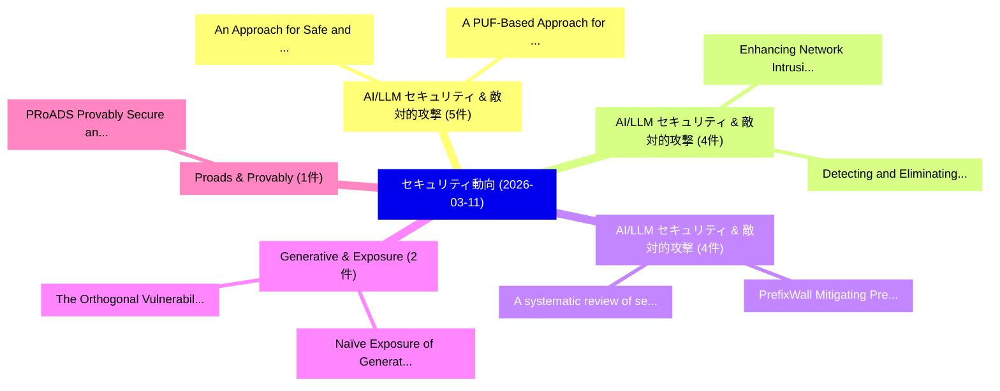

# 📅 02_daily: 日次エグゼクティブサマリー報告書 (2026-03-11)

**集計日時**: 2026-10-02 23:06:00 UTC  
**対象日付**: 2026-03-11  
**本日収集論文数**: 29 件  

---

## 💡 主要セキュリティ動向・脅威インサイト (Executive Insights)

本日の収集論文（計 29 件）において、以下の重点セキュリティ領域で活発な研究動向が確認されました：
- **AI/LLM セキュリティ & 敵対的攻撃** (5 件): 注目論文として 「An Approach for Safe and Secur...」、「A PUF-Based Approach for Copy ...」 等が発表され、実務防御および攻撃検証の進展が見られます。
- **AI/LLM セキュリティ & 敵対的攻撃** (4 件): 注目論文として 「Enhancing Network Intrusion De...」、「Detecting and Eliminating Neur...」 等が発表され、実務防御および攻撃検証の進展が見られます。
- **AI/LLM セキュリティ & 敵対的攻撃** (4 件): 注目論文として 「PrefixWall: Mitigating Prefix ...」、「A systematic review of secure ...」 等が発表され、実務防御および攻撃検証の進展が見られます。
- **Generative & Exposure** (2 件): 注目論文として 「The Orthogonal Vulnerabilities...」、「Naïve Exposure of Generative A...」 等が発表され、実務防御および攻撃検証の進展が見られます。
- **Proads & Provably** (1 件): 注目論文として 「PRoADS: Provably Secure and Ro...」 等が発表され、実務防御および攻撃検証の進展が見られます。

### 🗺️ 技術・脅威トピックマインドマップ

---

## 📌 日次セキュリティ論文一覧 (日本語表形式)

| No | arXiv ID | 論文タイトル (日本語訳) | 重要キーワード | 構造化エグゼクティブ要約 (背景・提案・影響) | 脅威分類 | 詳細リンク |
|---|---|---|---|---|---|---|
| 1 | `2603.10314v1` | [PRoADS: Provably Secure and Robust Audio Diffusion Steganography with latent optimization and backward Euler Inversion（セキュリティ分析論文）](../../okf/papers/2026-03-11/2603.10314.md) | `Robust Audio Diffusion Steganography`, `Provably Secure`, `Euler Inversion` | 【提案】概要 (Overview & Key Finding) 本論文「PRoADS: Provably Secure and Robust Audio Diffusion Steg...。実証評価により経営層・セキュリティ管理者向け推奨アクション (E... | `cs.MM` | [arXiv](https://arxiv.org/abs/2603.10314v1) &#124; [OKF](../../okf/papers/2026-03-11/2603.10314.md) |
| 2 | `2603.10323v2` | [The Orthogonal Vulnerabilities of Generative AI Watermarks: A Comparative Empirical Benchmark of Spatial and Latent Provenance（セキュリティ分析論文）](../../okf/papers/2026-03-11/2603.10323.md) | `Comparative Empirical Benchmark`, `Latent Provenance`, `Jesse Yu` | 【提案】概要 (Overview & Key Finding) 本論文「The Orthogonal Vulnerabilities of Generative AI Waterma...。実証評価により経営層・セキュリティ管理者向け推奨アクション (E... | `cs.CV` | [arXiv](https://arxiv.org/abs/2603.10323v2) &#124; [OKF](../../okf/papers/2026-03-11/2603.10323.md) |
| 3 | `2603.10387v1` | [Don't Let the Claw Grip Your Hand: A Security Analysis and Defense Framework for OpenClaw（セキュリティ分析論文）](../../okf/papers/2026-03-11/2603.10387.md) | `Zhengyang Shan`, `Jiayun Xin`, `Yue Zhang` | 【提案】概要 (Overview & Key Finding) 本論文「Don't Let the Claw Grip Your Hand: A Security Analysis ...。実証評価により経営層・セキュリティ管理者向け推奨アクション (E... | `cybersecurity` | [arXiv](https://arxiv.org/abs/2603.10387v1) &#124; [OKF](../../okf/papers/2026-03-11/2603.10387.md) |
| 4 | `2603.10388v1` | [Silent Subversion: Sensor Spoofing Attacks via Supply Chain Implants in Satellite Systems（セキュリティ分析論文）](../../okf/papers/2026-03-11/2603.10388.md) | `Sensor Spoofing Attacks`, `Supply Chain Implants`, `Silent Subversion` | 【提案】概要 (Overview & Key Finding) 本論文「Silent Subversion: Sensor Spoofing Attacks via Supply C...。実証評価により経営層・セキュリティ管理者向け推奨アクション (E... | `cybersecurity` | [arXiv](https://arxiv.org/abs/2603.10388v1) &#124; [OKF](../../okf/papers/2026-03-11/2603.10388.md) |
| 5 | `2603.10413v1` | [Enhancing Network Intrusion Detection Systems: A Multi-Layer Ensemble Approach to Mitigate Adversarial Attacks（セキュリティ分析論文）](../../okf/papers/2026-03-11/2603.10413.md) | `Enhancing Network Intrusion Detection Systems`, `Mitigate Adversarial Attacks`, `Multi-Layer Ensemble` | 【提案】概要 (Overview & Key Finding) 本論文「Enhancing Network Intrusion Detection Systems: A Multi-...。実証評価により経営層・セキュリティ管理者向け推奨アクション (E... | `cs.AI` | [arXiv](https://arxiv.org/abs/2603.10413v1) &#124; [OKF](../../okf/papers/2026-03-11/2603.10413.md) |
| 6 | `2603.10504v1` | [Naïve Exposure of Generative AI Capabilities Undermines Deepfake Detection（セキュリティ分析論文）](../../okf/papers/2026-03-11/2603.10504.md) | `Capabilities Undermines Deepfake Detection`, `Jae Hong Seo`, `Sunpill Kim` | 【提案】概要 (Overview & Key Finding) 本論文「Naïve Exposure of Generative AI Capabilities Undermines...。実証評価により経営層・セキュリティ管理者向け推奨アクション (E... | `cs.AI` | [arXiv](https://arxiv.org/abs/2603.10504v1) &#124; [OKF](../../okf/papers/2026-03-11/2603.10504.md) |
| 7 | `2603.10521v1` | [IH-Challenge: A Training Dataset to Improve Instruction Hierarchy on Frontier LLMs（セキュリティ分析論文）](../../okf/papers/2026-03-11/2603.10521.md) | `Improve Instruction Hierarchy`, `Training Dataset`, `Juan Felipe Ceron Uribe` | 【提案】概要 (Overview & Key Finding) 本論文「IH-Challenge: A Training Dataset to Improve Instruction...。実証評価により経営層・セキュリティ管理者向け推奨アクション (E... | `cs.AI` | [arXiv](https://arxiv.org/abs/2603.10521v1) &#124; [OKF](../../okf/papers/2026-03-11/2603.10521.md) |
| 8 | `2603.10608v1` | [An Approach for Safe and Secure Software Protection Supported by Symbolic Execution（セキュリティ分析論文）](../../okf/papers/2026-03-11/2603.10608.md) | `Secure Software Protection Supported`, `Symbolic Execution`, `Daniel Dorfmeister` | 【提案】概要 (Overview & Key Finding) 本論文「An Approach for Safe and Secure Software Protection Sup...。実証評価により経営層・セキュリティ管理者向け推奨アクション (E... | `cybersecurity` | [arXiv](https://arxiv.org/abs/2603.10608v1) &#124; [OKF](../../okf/papers/2026-03-11/2603.10608.md) |
| 9 | `2603.10641v1` | [Detecting and Eliminating Neural Network Backdoors Through Active Paths with Application to Intrusion Detection（セキュリティ分析論文）](../../okf/papers/2026-03-11/2603.10641.md) | `Intrusion Detection`, `Magnus Wiik Eckhoff`, `Gudmund Grov` | 【提案】概要 (Overview & Key Finding) 本論文「Detecting and Eliminating Neural Network Backdoors Thro...。実証評価により経営層・セキュリティ管理者向け推奨アクション (E... | `cs.AI` | [arXiv](https://arxiv.org/abs/2603.10641v1) &#124; [OKF](../../okf/papers/2026-03-11/2603.10641.md) |
| 10 | `2603.10692v1` | [Repurposing Backdoors for Good: Ephemeral Intrinsic Proofs for Verifiable Aggregation in Cross-silo 連合学習](../../okf/papers/2026-03-11/2603.10692.md) | `Ephemeral Intrinsic Proofs`, `Repurposing Backdoors`, `Verifiable Aggregation` | 【提案】概要 (Overview & Key Finding) 本論文「Repurposing Backdoors for Good: Ephemeral Intrinsic Pro...。実証評価により経営層・セキュリティ管理者向け推奨アクション (E... | `cs.AI` | [arXiv](https://arxiv.org/abs/2603.10692v1) &#124; [OKF](../../okf/papers/2026-03-11/2603.10692.md) |
| 11 | `2603.10726v2` | [PrefixWall: Mitigating Prefix Caching Side Channels in Shared LLM Systems（セキュリティ分析論文）](../../okf/papers/2026-03-11/2603.10726.md) | `Mitigating Prefix Caching Side Channels`, `Panagiotis Georgios Pennas`, `Thaleia Dimitra Doudali` | 【提案】概要 (Overview & Key Finding) 本論文「PrefixWall: Mitigating Prefix Caching Side Channels in ...。実証評価により経営層・セキュリティ管理者向け推奨アクション (E... | `executive-summary` | [arXiv](https://arxiv.org/abs/2603.10726v2) &#124; [OKF](../../okf/papers/2026-03-11/2603.10726.md) |
| 12 | `2603.10749v2` | [AttriGuard: Defeating Indirect Prompt Injection in LLMエージェント via Causal Attribution of Tool Invocations](../../okf/papers/2026-03-11/2603.10749.md) | `Defeating Indirect Prompt Injection`, `Causal Attribution`, `Tool Invocations` | 【提案】概要 (Overview & Key Finding) 本論文「AttriGuard: Defeating Indirect プロンプトインジェクション in LLMエージェ...。実証評価により経営層・セキュリティ管理者向け推奨アクション (E... | `cybersecurity` | [arXiv](https://arxiv.org/abs/2603.10749v2) &#124; [OKF](../../okf/papers/2026-03-11/2603.10749.md) |
| 13 | `2603.10753v1` | [A PUF-Based Approach for Copy Protection of Intellectual Property in Neural Network Models（セキュリティ分析論文）](../../okf/papers/2026-03-11/2603.10753.md) | `Neural Network Models`, `Copy Protection`, `Intellectual Property` | 【提案】概要 (Overview & Key Finding) 本論文「A PUF-Based Approach for Copy Protection of Intellectua...。実証評価により経営層・セキュリティ管理者向け推奨アクション (E... | `executive-summary` | [arXiv](https://arxiv.org/abs/2603.10753v1) &#124; [OKF](../../okf/papers/2026-03-11/2603.10753.md) |
| 14 | `2603.10776v2` | [Incremental 連合学習 for Intrusion Detection in IoT Networks under Evolving Threat Landscape](../../okf/papers/2026-03-11/2603.10776.md) | `Evolving Threat Landscape`, `Intrusion Detection`, `Incremental Federated Learning` | 【提案】概要 (Overview & Key Finding) 本論文「Incremental 連合学習 for Intrusion Detection in IoT Network...。実証評価により経営層・セキュリティ管理者向け推奨アクション (E... | `cybersecurity` | [arXiv](https://arxiv.org/abs/2603.10776v2) &#124; [OKF](../../okf/papers/2026-03-11/2603.10776.md) |
| 15 | `2603.10795v1` | [Re-Evaluating EVMBench: Are AI Agents Ready for Smart Contract Security?（セキュリティ分析論文）](../../okf/papers/2026-03-11/2603.10795.md) | `Smart Contract Security`, `Agents Ready`, `Re-Evaluating EVMBench` | 【提案】### (日本語題名: Re-Evaluating EVMBench: Are AI Agents Ready for スマートコントラクト Security?（セキュリティ...。実証評価により経営層・セキュリティ管理者向け推奨アクション (E... | `cs.ET` | [arXiv](https://arxiv.org/abs/2603.10795v1) &#124; [OKF](../../okf/papers/2026-03-11/2603.10795.md) |
| 16 | `2603.10806v1` | [Backdoor Directions in Vision Transformers（セキュリティ分析論文）](../../okf/papers/2026-03-11/2603.10806.md) | `Backdoor Directions`, `Vision Transformers`, `Sengim Karayalcin` | 【提案】概要 (Overview & Key Finding) 本論文「Backdoor Directions in Vision Transformers（セキュリティ分析論文）」...。実証評価により経営層・セキュリティ管理者向け推奨アクション (E... | `cs.CV` | [arXiv](https://arxiv.org/abs/2603.10806v1) &#124; [OKF](../../okf/papers/2026-03-11/2603.10806.md) |
| 17 | `2603.10840v1` | [MAD: Memory Allocation meets Software Diversity（セキュリティ分析論文）](../../okf/papers/2026-03-11/2603.10840.md) | `Memory Allocation`, `Software Diversity`, `Manuel Wiesinger` | 【提案】概要 (Overview & Key Finding) 本論文「MAD: Memory Allocation meets Software Diversity（セキュリティ分...。実証評価により経営層・セキュリティ管理者向け推奨アクション (E... | `cybersecurity` | [arXiv](https://arxiv.org/abs/2603.10840v1) &#124; [OKF](../../okf/papers/2026-03-11/2603.10840.md) |
| 18 | `2603.10969v2` | [TOSSS: a CVE-based Software Security Benchmark for 大規模言語モデル](../../okf/papers/2026-03-11/2603.10969.md) | `Software Security Benchmark`, `CVE-based Software`, `Large Language Models` | 【提案】概要 (Overview & Key Finding) 本論文「TOSSS: a CVE-based Software Security Benchmark for 大規模言...。実証評価により経営層・セキュリティ管理者向け推奨アクション (E... | `executive-summary` | [arXiv](https://arxiv.org/abs/2603.10969v2) &#124; [OKF](../../okf/papers/2026-03-11/2603.10969.md) |
| 19 | `2603.11006v2` | [Layered Performance TLS 1.3 Handshakes: Classical, Hybrid, and Pure Post-Quantum Key Exchangeの分析](../../okf/papers/2026-03-11/2603.11006.md) | `Pure Post`, `Post-Quantum Key`, `Layered Performance` | 【提案】概要 (Overview & Key Finding) 本論文「Layered Performance TLS 1.3 Handshakes: Classical, Hybr...。実証評価により経営層・セキュリティ管理者向け推奨アクション (E... | `cybersecurity` | [arXiv](https://arxiv.org/abs/2603.11006v2) &#124; [OKF](../../okf/papers/2026-03-11/2603.11006.md) |
| 20 | `2603.11029v2` | [Separating Oblivious and Adaptive Differential Privacy under Continual Observation（セキュリティ分析論文）](../../okf/papers/2026-03-11/2603.11029.md) | `Adaptive Differential Privacy`, `Separating Oblivious`, `Continual Observation` | 【提案】概要 (Overview & Key Finding) 本論文「Separating Oblivious and Adaptive 差分プライバシー under Contin...。実証評価により経営層・セキュリティ管理者向け推奨アクション (E... | `executive-summary` | [arXiv](https://arxiv.org/abs/2603.11029v2) &#124; [OKF](../../okf/papers/2026-03-11/2603.11029.md) |
| 21 | `2603.11088v1` | [The Attack and Defense Landscape of Agentic AI: A Comprehensive Survey（セキュリティ分析論文）](../../okf/papers/2026-03-11/2603.11088.md) | `Defense Landscape`, `Comprehensive Survey`, `Juhee Kim` | 【提案】概要 (Overview & Key Finding) 本論文「The Attack and Defense Landscape of Agentic AI: A Compr...。実証評価により経営層・セキュリティ管理者向け推奨アクション (E... | `cs.AI` | [arXiv](https://arxiv.org/abs/2603.11088v1) &#124; [OKF](../../okf/papers/2026-03-11/2603.11088.md) |
| 22 | `2603.11132v2` | [WebWeaver: Breaking Topology Confidentiality in LLM Multi-Agent Systems with Stealthy Context-Based Inference（セキュリティ分析論文）](../../okf/papers/2026-03-11/2603.11132.md) | `Breaking Topology Confidentiality`, `Agent Systems`, `Stealthy Context` | 【提案】概要 (Overview & Key Finding) 本論文「WebWeaver: Breaking Topology Confidentiality in LLM Mul...。実証評価により経営層・セキュリティ管理者向け推奨アクション (E... | `cs.AI` | [arXiv](https://arxiv.org/abs/2603.11132v2) &#124; [OKF](../../okf/papers/2026-03-11/2603.11132.md) |
| 23 | `2603.11145v1` | [A systematic review of secure coded caching（セキュリティ分析論文）](../../okf/papers/2026-03-11/2603.11145.md) | `Raw Meta`, `Executive Summary`, `Key Finding` | 【提案】概要 (Overview & Key Finding) 本論文「A systematic review of secure coded caching（セキュリティ分析論文）...。実証評価によりQuaglia - **公開日時**: `2026... | `executive-summary` | [arXiv](https://arxiv.org/abs/2603.11145v1) &#124; [OKF](../../okf/papers/2026-03-11/2603.11145.md) |
| 24 | `2603.11149v2` | [Systematic Scaling Jailbreak Attacks in Large Language Modelsの分析](../../okf/papers/2026-03-11/2603.11149.md) | `Systematic Scaling Jailbreak Attacks`, `Large Language Models`, `Jailbreak Attacks` | 【提案】概要 (Overview & Key Finding) 本論文「Systematic Scaling ジェイルブレイク Attacks in Large Language M...。実証評価により経営層・セキュリティ管理者向け推奨アクション (E... | `executive-summary` | [arXiv](https://arxiv.org/abs/2603.11149v2) &#124; [OKF](../../okf/papers/2026-03-11/2603.11149.md) |
| 25 | `2603.11196v8` | [Primitive-root determinant densities: extremal order, dimension-zero, Fourier decay, and a lattice-smoothing no-go（セキュリティ分析論文）](../../okf/papers/2026-03-11/2603.11196.md) | `Primitive-root determinant`, `Vipin Singh Sehrawat`, `Raw Meta` | 【提案】概要 (Overview & Key Finding) 本論文「Primitive-root determinant densities: extremal order, d...。実証評価により経営層・セキュリティ管理者向け推奨アクション (E... | `executive-summary` | [arXiv](https://arxiv.org/abs/2603.11196v8) &#124; [OKF](../../okf/papers/2026-03-11/2603.11196.md) |
| 26 | `2603.11200v1` | [DNS-GT: A Graph-based Transformer Approach to Learn Embeddings of Domain Names from DNS Queries（セキュリティ分析論文）](../../okf/papers/2026-03-11/2603.11200.md) | `Learn Embeddings`, `Domain Names`, `Graph-based Transformer` | 【提案】概要 (Overview & Key Finding) 本論文「DNS-GT: A Graph-based Transformer Approach to Learn Emb...。実証評価により経営層・セキュリティ管理者向け推奨アクション (E... | `executive-summary` | [arXiv](https://arxiv.org/abs/2603.11200v1) &#124; [OKF](../../okf/papers/2026-03-11/2603.11200.md) |
| 27 | `2603.11212v1` | [Security-by-Design for LLM-Based Code Generation: Leveraging Internal Representations for Concept-Driven Steering Mechanisms（セキュリティ分析論文）](../../okf/papers/2026-03-11/2603.11212.md) | `Based Code Generation`, `Leveraging Internal Representations`, `Driven Steering Mechanisms` | 【提案】概要 (Overview & Key Finding) 本論文「Security-by-Design for LLM-Based Code Generation: Lever...。実証評価により経営層・セキュリティ管理者向け推奨アクション (E... | `executive-summary` | [arXiv](https://arxiv.org/abs/2603.11212v1) &#124; [OKF](../../okf/papers/2026-03-11/2603.11212.md) |
| 28 | `2603.11324v1` | [LROO Rug Pull Detector: A Leakage-Resistant Framework Based on On-Chain and OSINT Signals（セキュリティ分析論文）](../../okf/papers/2026-03-11/2603.11324.md) | `Rug Pull Detector`, `Fatemeh Shoaei`, `Mohammad Pishdar` | 【提案】概要 (Overview & Key Finding) 本論文「LROO Rug Pull Detector: A Leakage-Resistant Framework B...。実証評価により経営層・セキュリティ管理者向け推奨アクション (E... | `cybersecurity` | [arXiv](https://arxiv.org/abs/2603.11324v1) &#124; [OKF](../../okf/papers/2026-03-11/2603.11324.md) |
| 29 | `2603.13385v1` | [VisualLeakBench: Auditing the Fragility of Large Vision-Language Models against PII Leakage and Social Engineering（セキュリティ分析論文）](../../okf/papers/2026-03-11/2603.13385.md) | `Large Vision`, `Language Models`, `Social Engineering` | 【提案】概要 (Overview & Key Finding) 本論文「VisualLeakBench: Auditing the Fragility of Large Vision...。実証評価により経営層・セキュリティ管理者向け推奨アクション (E... | `cs.AI` | [arXiv](https://arxiv.org/abs/2603.13385v1) &#124; [OKF](../../okf/papers/2026-03-11/2603.13385.md) |

