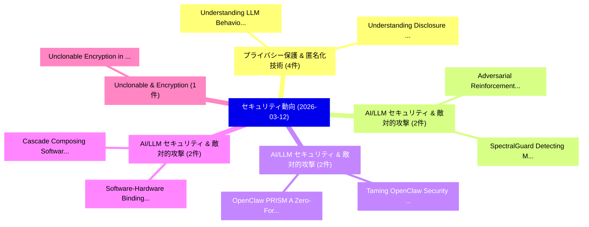

# 📅 02_daily: 日次エグゼクティブサマリー報告書 (2026-03-12)

**集計日時**: 2026-10-02 23:06:01 UTC  
**対象日付**: 2026-03-12  
**本日収集論文数**: 33 件  

---

## 💡 主要セキュリティ動向・脅威インサイト (Executive Insights)

本日の収集論文（計 33 件）において、以下の重点セキュリティ領域で活発な研究動向が確認されました：
- **プライバシー保護 & 匿名化技術** (4 件): 注目論文として 「Understanding LLM Behavior Whe...」、「Understanding Disclosure Risk ...」 等が発表され、実務防御および攻撃検証の進展が見られます。
- **AI/LLM セキュリティ & 敵対的攻撃** (2 件): 注目論文として 「Adversarial Reinforcement Lear...」、「SpectralGuard: Detecting Memor...」 等が発表され、実務防御および攻撃検証の進展が見られます。
- **AI/LLM セキュリティ & 敵対的攻撃** (2 件): 注目論文として 「Taming OpenClaw: Security Anal...」、「OpenClaw PRISM: A Zero-Fork, D...」 等が発表され、実務防御および攻撃検証の進展が見られます。
- **AI/LLM セキュリティ & 敵対的攻撃** (2 件): 注目論文として 「Software-Hardware Binding for ...」、「Cascade: Composing Software-Ha...」 等が発表され、実務防御および攻撃検証の進展が見られます。
- **Unclonable & Encryption** (1 件): 注目論文として 「Unclonable Encryption in the H...」 等が発表され、実務防御および攻撃検証の進展が見られます。

### 🗺️ 技術・脅威トピックマインドマップ

---

## 📌 日次セキュリティ論文一覧 (日本語表形式)

| No | arXiv ID | 論文タイトル (日本語訳) | 重要キーワード | 構造化エグゼクティブ要約 (背景・提案・影響) | 脅威分類 | 詳細リンク |
|---|---|---|---|---|---|---|
| 1 | `2603.11433v1` | [Adversarial Reinforcement Learning for Detecting False Data Injection Attacks in Vehicular Routing（セキュリティ分析論文）](../../okf/papers/2026-03-12/2603.11433.md) | `Detecting False Data Injection Attacks`, `Adversarial Reinforcement Learning`, `Vehicular Routing` | 【提案】概要 (Overview & Key Finding) 本論文「Adversarial Reinforcement Learning for Detecting False ...。実証評価により経営層・セキュリティ管理者向け推奨アクション (E... | `cs.AI` | [arXiv](https://arxiv.org/abs/2603.11433v1) &#124; [OKF](../../okf/papers/2026-03-12/2603.11433.md) |
| 2 | `2603.11437v2` | [Unclonable Encryption in the Haar Random Oracle Model（セキュリティ分析論文）](../../okf/papers/2026-03-12/2603.11437.md) | `Haar Random Oracle Model`, `Unclonable Encryption`, `James Bartusek` | 【提案】概要 (Overview & Key Finding) 本論文「Unclonable Encryption in the Haar Random Oracle Model（セ...。実証評価により経営層・セキュリティ管理者向け推奨アクション (E... | `executive-summary` | [arXiv](https://arxiv.org/abs/2603.11437v2) &#124; [OKF](../../okf/papers/2026-03-12/2603.11437.md) |
| 3 | `2603.11501v2` | [KEPo: Knowledge Evolution Poison on Graph-based Retrieval-Augmented Generation（セキュリティ分析論文）](../../okf/papers/2026-03-12/2603.11501.md) | `Knowledge Evolution Poison`, `Augmented Generation`, `Graph-based Retrieval` | 【提案】概要 (Overview & Key Finding) 本論文「KEPo: Knowledge Evolution Poison on Graph-based Retriev...。実証評価により経営層・セキュリティ管理者向け推奨アクション (E... | `cs.AI` | [arXiv](https://arxiv.org/abs/2603.11501v2) &#124; [OKF](../../okf/papers/2026-03-12/2603.11501.md) |
| 4 | `2603.11523v2` | [Strict Optimality of Frequency and Distribution Estimation Under Local Differential Privacy（セキュリティ分析論文）](../../okf/papers/2026-03-12/2603.11523.md) | `Strict Optimality`, `Mingen Pan`, `Raw Meta` | 【提案】概要 (Overview & Key Finding) 本論文「Strict Optimality of Frequency and Distribution Estimat...。実証評価により経営層・セキュリティ管理者向け推奨アクション (E... | `executive-summary` | [arXiv](https://arxiv.org/abs/2603.11523v2) &#124; [OKF](../../okf/papers/2026-03-12/2603.11523.md) |
| 5 | `2603.11619v1` | [Taming OpenClaw: Security Analysis and Mitigation of Autonomous LLM Agent Threats（セキュリティ分析論文）](../../okf/papers/2026-03-12/2603.11619.md) | `Agent Threats`, `Xinhao Deng`, `Yixiang Zhang` | 【提案】概要 (Overview & Key Finding) 本論文「Taming OpenClaw: Security Analysis and Mitigation of Au...。実証評価により経営層・セキュリティ管理者向け推奨アクション (E... | `cs.AI` | [arXiv](https://arxiv.org/abs/2603.11619v1) &#124; [OKF](../../okf/papers/2026-03-12/2603.11619.md) |
| 6 | `2603.11727v1` | [Software-Hardware Binding for Protection of Sensitive Data in Embedded Software（セキュリティ分析論文）](../../okf/papers/2026-03-12/2603.11727.md) | `Hardware Binding`, `Sensitive Data`, `Embedded Software` | 【提案】概要 (Overview & Key Finding) 本論文「Software-Hardware Binding for Protection of Sensitive D...。実証評価により経営層・セキュリティ管理者向け推奨アクション (E... | `cybersecurity` | [arXiv](https://arxiv.org/abs/2603.11727v1) &#124; [OKF](../../okf/papers/2026-03-12/2603.11727.md) |
| 7 | `2603.11799v2` | [Exponential-Family Membership Inference: From LiRA and RMIA to BaVarIA（セキュリティ分析論文）](../../okf/papers/2026-03-12/2603.11799.md) | `Family Membership Inference`, `Exponential-Family Membership`, `Raw Meta` | 【提案】概要 (Overview & Key Finding) 本論文「Exponential-Family Membership Inference: From LiRA and ...。実証評価により経営層・セキュリティ管理者向け推奨アクション (E... | `AI/ML Security` | [arXiv](https://arxiv.org/abs/2603.11799v2) &#124; [OKF](../../okf/papers/2026-03-12/2603.11799.md) |
| 8 | `2603.11853v1` | [OpenClaw PRISM: A Zero-Fork, Defense-in-Depth Runtime Security Layer for Tool-Augmented LLMエージェント](../../okf/papers/2026-03-12/2603.11853.md) | `Depth Runtime Security Layer`, `Tool-Augmented LLM`, `Frank Li` | 【提案】概要 (Overview & Key Finding) 本論文「OpenClaw PRISM: A Zero-Fork, Defense-in-Depth Runtime S...。実証評価により経営層・セキュリティ管理者向け推奨アクション (E... | `cybersecurity` | [arXiv](https://arxiv.org/abs/2603.11853v1) &#124; [OKF](../../okf/papers/2026-03-12/2603.11853.md) |
| 9 | `2603.11861v1` | [Automatic Attack Script Generation: a MDA Approach（セキュリティ分析論文）](../../okf/papers/2026-03-12/2603.11861.md) | `Automatic Attack Script Generation`, `Quentin Goux`, `Nadira Lammari` | 【提案】概要 (Overview & Key Finding) 本論文「Automatic Attack Script Generation: a MDA Approach（セキュリ...。実証評価により経営層・セキュリティ管理者向け推奨アクション (E... | `executive-summary` | [arXiv](https://arxiv.org/abs/2603.11861v1) &#124; [OKF](../../okf/papers/2026-03-12/2603.11861.md) |
| 10 | `2603.11862v1` | [You Told Me to Do It: Measuring Instructional Text-induced Private Data Leakage in LLMエージェント](../../okf/papers/2026-03-12/2603.11862.md) | `Measuring Instructional Text`, `Private Data Leakage`, `Text-induced Private` | 【提案】概要 (Overview & Key Finding) 本論文「You Told Me to Do It: Measuring Instructional Text-indu...。実証評価により経営層・セキュリティ管理者向け推奨アクション (E... | `cs.AI` | [arXiv](https://arxiv.org/abs/2603.11862v1) &#124; [OKF](../../okf/papers/2026-03-12/2603.11862.md) |
| 11 | `2603.11875v2` | [The Mirror Design Pattern: Strict Data Geometry over Model Scale for Prompt Injection Detection（セキュリティ分析論文）](../../okf/papers/2026-03-12/2603.11875.md) | `Strict Data Geometry`, `Prompt Injection Detection`, `Model Scale` | 【提案】概要 (Overview & Key Finding) 本論文「The Mirror Design Pattern: Strict Data Geometry over Mo...。実証評価により経営層・セキュリティ管理者向け推奨アクション (E... | `cs.AI` | [arXiv](https://arxiv.org/abs/2603.11875v2) &#124; [OKF](../../okf/papers/2026-03-12/2603.11875.md) |
| 12 | `2603.11876v1` | [On the Possible Detectability of Image-in-Image Steganography（セキュリティ分析論文）](../../okf/papers/2026-03-12/2603.11876.md) | `Possible Detectability`, `Image Steganography`, `Antoine Mallet` | 【提案】概要 (Overview & Key Finding) 本論文「On the Possible Detectability of Image-in-Image Stegano...。実証評価により経営層・セキュリティ管理者向け推奨アクション (E... | `cs.MM` | [arXiv](https://arxiv.org/abs/2603.11876v1) &#124; [OKF](../../okf/papers/2026-03-12/2603.11876.md) |
| 13 | `2603.11914v1` | [Understanding LLM Behavior When Encountering User-Supplied Harmful Content in Harmless Tasks（セキュリティ分析論文）](../../okf/papers/2026-03-12/2603.11914.md) | `Supplied Harmful Content`, `User-Supplied Harmful`, `Harmless Tasks` | 【提案】概要 (Overview & Key Finding) 本論文「Understanding LLM Behavior When Encountering User-Suppl...。実証評価により経営層・セキュリティ管理者向け推奨アクション (E... | `cs.AI` | [arXiv](https://arxiv.org/abs/2603.11914v1) &#124; [OKF](../../okf/papers/2026-03-12/2603.11914.md) |
| 14 | `2603.11949v1` | [Delayed Backdoor Attacks: Exploring the Temporal Dimension as a New Attack Surface in Pre-Trained Models（セキュリティ分析論文）](../../okf/papers/2026-03-12/2603.11949.md) | `Delayed Backdoor Attacks`, `New Attack Surface`, `Temporal Dimension` | 【提案】概要 (Overview & Key Finding) 本論文「Delayed Backdoor Attacks: Exploring the Temporal Dimens...。実証評価により経営層・セキュリティ管理者向け推奨アクション (E... | `cs.AI` | [arXiv](https://arxiv.org/abs/2603.11949v1) &#124; [OKF](../../okf/papers/2026-03-12/2603.11949.md) |
| 15 | `2603.11975v2` | [HomeSafe-Bench: Evaluating Vision-Language Models on Unsafe Action Detection for Embodied Agents in Household Scenarios（セキュリティ分析論文）](../../okf/papers/2026-03-12/2603.11975.md) | `Unsafe Action Detection`, `Evaluating Vision`, `Language Models` | 【提案】概要 (Overview & Key Finding) 本論文「HomeSafe-Bench: Evaluating Vision-Language Models on Un...。実証評価により経営層・セキュリティ管理者向け推奨アクション (E... | `cs.AI` | [arXiv](https://arxiv.org/abs/2603.11975v2) &#124; [OKF](../../okf/papers/2026-03-12/2603.11975.md) |
| 16 | `2603.12000v1` | [Credibility Matters: Motivations, Characteristics, and Influence Mechanisms of Crypto Key Opinion Leaders（セキュリティ分析論文）](../../okf/papers/2026-03-12/2603.12000.md) | `Crypto Key Opinion Leaders`, `Credibility Matters`, `Influence Mechanisms` | 【提案】概要 (Overview & Key Finding) 本論文「Credibility Matters: Motivations, Characteristics, and ...。実証評価により経営層・セキュリティ管理者向け推奨アクション (E... | `executive-summary` | [arXiv](https://arxiv.org/abs/2603.12000v1) &#124; [OKF](../../okf/papers/2026-03-12/2603.12000.md) |
| 17 | `2603.12023v1` | [Cascade: Composing Software-Hardware Attack Gadgets for Adversarial Threat Amplification in Compound AI Systems（セキュリティ分析論文）](../../okf/papers/2026-03-12/2603.12023.md) | `Hardware Attack Gadgets`, `Adversarial Threat Amplification`, `Composing Software` | 【提案】概要 (Overview & Key Finding) 本論文「Cascade: Composing Software-Hardware Attack Gadgets for...。実証評価により経営層・セキュリティ管理者向け推奨アクション (E... | `cs.AI` | [arXiv](https://arxiv.org/abs/2603.12023v1) &#124; [OKF](../../okf/papers/2026-03-12/2603.12023.md) |
| 18 | `2603.12062v1` | [Systematic Security the Iridium Satellite Radio Linkの分析](../../okf/papers/2026-03-12/2603.12062.md) | `Iridium Satellite Radio Link`, `Iridium Satellite Radio`, `Systematic Security` | 【提案】概要 (Overview & Key Finding) 本論文「Systematic Security the Iridium Satellite Radio Linkの分析...。実証評価により経営層・セキュリティ管理者向け推奨アクション (E... | `cybersecurity` | [arXiv](https://arxiv.org/abs/2603.12062v1) &#124; [OKF](../../okf/papers/2026-03-12/2603.12062.md) |
| 19 | `2603.12089v1` | [EmbTracker: Traceable Black-box Watermarking for Federated Language Models（セキュリティ分析論文）](../../okf/papers/2026-03-12/2603.12089.md) | `Federated Language Models`, `Traceable Black`, `Black-box Watermarking` | 【提案】概要 (Overview & Key Finding) 本論文「EmbTracker: Traceable Black-box Watermarking for Federa...。実証評価により経営層・セキュリティ管理者向け推奨アクション (E... | `cybersecurity` | [arXiv](https://arxiv.org/abs/2603.12089v1) &#124; [OKF](../../okf/papers/2026-03-12/2603.12089.md) |
| 20 | `2603.12142v1` | [Understanding Disclosure Risk in Differential Privacy with Applications to Noise Calibration and Auditing (Extended Version)（セキュリティ分析論文）](../../okf/papers/2026-03-12/2603.12142.md) | `Understanding Disclosure Risk`, `Differential Privacy`, `Noise Calibration` | 【提案】概要 (Overview & Key Finding) 本論文「Understanding Disclosure Risk in 差分プライバシー with Applicat...。実証評価により経営層・セキュリティ管理者向け推奨アクション (E... | `executive-summary` | [arXiv](https://arxiv.org/abs/2603.12142v1) &#124; [OKF](../../okf/papers/2026-03-12/2603.12142.md) |
| 21 | `2603.12195v1` | [Privacy in ERP Systems: Behavioral Models of Developers and Consultants（セキュリティ分析論文）](../../okf/papers/2026-03-12/2603.12195.md) | `Behavioral Models`, `Alicia Pang`, `Katsiaryna Labunets` | 【提案】概要 (Overview & Key Finding) 本論文「Privacy in ERP Systems: Behavioral Models of Developers...。実証評価により経営層・セキュリティ管理者向け推奨アクション (E... | `cybersecurity` | [arXiv](https://arxiv.org/abs/2603.12195v1) &#124; [OKF](../../okf/papers/2026-03-12/2603.12195.md) |
| 22 | `2603.12230v2` | [Security Considerations for Artificial Intelligence Agents（セキュリティ分析論文）](../../okf/papers/2026-03-12/2603.12230.md) | `Artificial Intelligence Agents`, `Security Considerations`, `Ninghui Li` | 【提案】概要 (Overview & Key Finding) 本論文「Security Considerations for Artificial Intelligence Age...。実証評価により経営層・セキュリティ管理者向け推奨アクション (E... | `cs.AI` | [arXiv](https://arxiv.org/abs/2603.12230v2) &#124; [OKF](../../okf/papers/2026-03-12/2603.12230.md) |
| 23 | `2603.12237v1` | [STAMP: Selective Task-Aware Mechanism for Text Privacy（セキュリティ分析論文）](../../okf/papers/2026-03-12/2603.12237.md) | `Selective Task`, `Aware Mechanism`, `Text Privacy` | 【提案】概要 (Overview & Key Finding) 本論文「STAMP: Selective Task-Aware Mechanism for Text Privacy（...。実証評価によりLo, Ravi Tandon - **公開日時*... | `executive-summary` | [arXiv](https://arxiv.org/abs/2603.12237v1) &#124; [OKF](../../okf/papers/2026-03-12/2603.12237.md) |
| 24 | `2603.12300v1` | [Internet-Scale Measurement of React2Shell Exploitation Using an Active Network Telescope（セキュリティ分析論文）](../../okf/papers/2026-03-12/2603.12300.md) | `Active Network Telescope`, `Scale Measurement`, `Internet-Scale Measurement` | 【提案】概要 (Overview & Key Finding) 本論文「Internet-Scale Measurement of React2Shell Exploitation ...。実証評価により経営層・セキュリティ管理者向け推奨アクション (E... | `cs.NI` | [arXiv](https://arxiv.org/abs/2603.12300v1) &#124; [OKF](../../okf/papers/2026-03-12/2603.12300.md) |
| 25 | `2603.12414v1` | [SpectralGuard: Detecting Memory Collapse Attacks in State Space Models（セキュリティ分析論文）](../../okf/papers/2026-03-12/2603.12414.md) | `Detecting Memory Collapse Attacks`, `State Space Models`, `Davi Bonetto` | 【提案】概要 (Overview & Key Finding) 本論文「SpectralGuard: Detecting Memory Collapse Attacks in Sta...。実証評価により経営層・セキュリティ管理者向け推奨アクション (E... | `executive-summary` | [arXiv](https://arxiv.org/abs/2603.12414v1) &#124; [OKF](../../okf/papers/2026-03-12/2603.12414.md) |
| 26 | `2603.12435v1` | [DiscoRD: An Experimental Methodology for Quickly Discovering the Reliable Read Disturbance Threshold of Real DRAM Chips（セキュリティ分析論文）](../../okf/papers/2026-03-12/2603.12435.md) | `Reliable Read Disturbance Threshold`, `Quickly Discovering`, `Ismail Emir Yuksel` | 【提案】概要 (Overview & Key Finding) 本論文「DiscoRD: An Experimental Methodology for Quickly Discov...。実証評価により経営層・セキュリティ管理者向け推奨アクション (E... | `executive-summary` | [arXiv](https://arxiv.org/abs/2603.12435v1) &#124; [OKF](../../okf/papers/2026-03-12/2603.12435.md) |
| 27 | `2603.12450v1` | [Bridging the Gap Between Security Metrics and Key Risk Indicators: An Empirical Framework for Vulnerability Prioritization（セキュリティ分析論文）](../../okf/papers/2026-03-12/2603.12450.md) | `Key Risk Indicators`, `Vulnerability Prioritization`, `Emad Sherif` | 【提案】概要 (Overview & Key Finding) 本論文「Bridging the Gap Between Security Metrics and Key Risk ...。実証評価により経営層・セキュリティ管理者向け推奨アクション (E... | `executive-summary` | [arXiv](https://arxiv.org/abs/2603.12450v1) &#124; [OKF](../../okf/papers/2026-03-12/2603.12450.md) |
| 28 | `2603.12455v1` | [Operationalising Cyber Risk Management Using AI: Connecting Cyber Incidents to MITRE ATT&CK Techniques, Security Controls, and Metrics（セキュリティ分析論文）](../../okf/papers/2026-03-12/2603.12455.md) | `Operationalising Cyber Risk Management Using`, `Connecting Cyber Incidents`, `Security Controls` | 【提案】概要 (Overview & Key Finding) 本論文「Operationalising Cyber Risk Management Using AI: Connec...。実証評価により経営層・セキュリティ管理者向け推奨アクション (E... | `cs.AI` | [arXiv](https://arxiv.org/abs/2603.12455v1) &#124; [OKF](../../okf/papers/2026-03-12/2603.12455.md) |
| 29 | `2603.12485v1` | [Hunting CUDA Bugs at Scale with cuFuzz（セキュリティ分析論文）](../../okf/papers/2026-03-12/2603.12485.md) | `Mohamed Tarek Ibn`, `Christos Kozyrakis`, `Raw Meta` | 【提案】概要 (Overview & Key Finding) 本論文「Hunting CUDA Bugs at Scale with cuFuzz（セキュリティ分析論文）」（原題:...。実証評価により経営層・セキュリティ管理者向け推奨アクション (E... | `executive-summary` | [arXiv](https://arxiv.org/abs/2603.12485v1) &#124; [OKF](../../okf/papers/2026-03-12/2603.12485.md) |
| 30 | `2603.12498v2` | [Keys on Doormats: Exposed API Credentials on the Web（セキュリティ分析論文）](../../okf/papers/2026-03-12/2603.12498.md) | `Nurullah Demir`, `Yash Vekaria`, `Georgios Smaragdakis` | 【提案】概要 (Overview & Key Finding) 本論文「Keys on Doormats: Exposed API Credentials on the Web（セキ...。実証評価により経営層・セキュリティ管理者向け推奨アクション (E... | `cs.NI` | [arXiv](https://arxiv.org/abs/2603.12498v2) &#124; [OKF](../../okf/papers/2026-03-12/2603.12498.md) |
| 31 | `2603.13420v2` | [Accelerating Suffix Jailbreak attacks with Prefix-Shared KV-cache（セキュリティ分析論文）](../../okf/papers/2026-03-12/2603.13420.md) | `Accelerating Suffix Jailbreak`, `Prefix-Shared KV`, `Xinhai Wang` | 【提案】概要 (Overview & Key Finding) 本論文「Accelerating Suffix ジェイルブレイク attacks with Prefix-Shared...。実証評価により経営層・セキュリティ管理者向け推奨アクション (E... | `cs.AI` | [arXiv](https://arxiv.org/abs/2603.13420v2) &#124; [OKF](../../okf/papers/2026-03-12/2603.13420.md) |
| 32 | `2603.15668v1` | [Quantum-Secure-By-Construction (QSC): A Paradigm Shift For Post-Quantum Agentic Intelligence（セキュリティ分析論文）](../../okf/papers/2026-03-12/2603.15668.md) | `Quantum Agentic Intelligence`, `Post-Quantum Agentic`, `Arit Kumar Bishwas` | 【提案】概要 (Overview & Key Finding) 本論文「量子-Secure-By-Construction (QSC): A Paradigm Shift For P...。実証評価により経営層・セキュリティ管理者向け推奨アクション (E... | `cs.AI` | [arXiv](https://arxiv.org/abs/2603.15668v1) &#124; [OKF](../../okf/papers/2026-03-12/2603.15668.md) |
| 33 | `2604.03264v1` | [SafeScreen: A Safety-First Screening Framework for Personalized Video Retrieval for Vulnerable Users（セキュリティ分析論文）](../../okf/papers/2026-03-12/2604.03264.md) | `Personalized Video Retrieval`, `Safety-First Screening`, `Vulnerable Users` | 【提案】概要 (Overview & Key Finding) 本論文「SafeScreen: A Safety-First Screening Framework for Pers...。実証評価により経営層・セキュリティ管理者向け推奨アクション (E... | `cs.AI` | [arXiv](https://arxiv.org/abs/2604.03264v1) &#124; [OKF](../../okf/papers/2026-03-12/2604.03264.md) |

