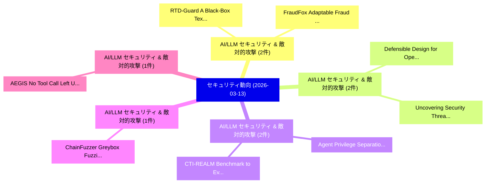

# 📅 02_daily: 日次エグゼクティブサマリー報告書 (2026-03-13)

**集計日時**: 2026-10-02 23:06:01 UTC  
**対象日付**: 2026-03-13  
**本日収集論文数**: 28 件  

---

## 💡 主要セキュリティ動向・脅威インサイト (Executive Insights)

本日の収集論文（計 28 件）において、以下の重点セキュリティ領域で活発な研究動向が確認されました：
- **AI/LLM セキュリティ & 敵対的攻撃** (2 件): 注目論文として 「RTD-Guard: A Black-Box Textual...」、「FraudFox: Adaptable Fraud Dete...」 等が発表され、実務防御および攻撃検証の進展が見られます。
- **AI/LLM セキュリティ & 敵対的攻撃** (2 件): 注目論文として 「Uncovering Security Threats an...」、「Defensible Design for OpenClaw...」 等が発表され、実務防御および攻撃検証の進展が見られます。
- **AI/LLM セキュリティ & 敵対的攻撃** (2 件): 注目論文として 「Agent Privilege Separation in ...」、「CTI-REALM: Benchmark to Evalua...」 等が発表され、実務防御および攻撃検証の進展が見られます。
- **AI/LLM セキュリティ & 敵対的攻撃** (1 件): 注目論文として 「ChainFuzzer: Greybox Fuzzing f...」 等が発表され、実務防御および攻撃検証の進展が見られます。
- **AI/LLM セキュリティ & 敵対的攻撃** (1 件): 注目論文として 「AEGIS: No Tool Call Left Unche...」 等が発表され、実務防御および攻撃検証の進展が見られます。

### 🗺️ 技術・脅威トピックマインドマップ

---

## 📌 日次セキュリティ論文一覧 (日本語表形式)

| No | arXiv ID | 論文タイトル (日本語訳) | 重要キーワード | 構造化エグゼクティブ要約 (背景・提案・影響) | 脅威分類 | 詳細リンク |
|---|---|---|---|---|---|---|
| 1 | `2603.12582v1` | [RTD-Guard: A Black-Box Textual Adversarial Detection Framework via Replacement Token Detection（セキュリティ分析論文）](../../okf/papers/2026-03-13/2603.12582.md) | `Replacement Token Detection`, `Black-Box Textual`, `Yanshu Li` | 【提案】概要 (Overview & Key Finding) 本論文「RTD-Guard: A Black-Box Textual Adversarial Detection Fr...。実証評価により経営層・セキュリティ管理者向け推奨アクション (E... | `executive-summary` | [arXiv](https://arxiv.org/abs/2603.12582v1) &#124; [OKF](../../okf/papers/2026-03-13/2603.12582.md) |
| 2 | `2603.12614v1` | [ChainFuzzer: Greybox Fuzzing for Workflow-Level Multi-Tool Vulnerabilities in LLMエージェント](../../okf/papers/2026-03-13/2603.12614.md) | `Greybox Fuzzing`, `Level Multi`, `Tool Vulnerabilities` | 【提案】概要 (Overview & Key Finding) 本論文「ChainFuzzer: Greybox Fuzzing for Workflow-Level Multi-T...。実証評価により経営層・セキュリティ管理者向け推奨アクション (E... | `executive-summary` | [arXiv](https://arxiv.org/abs/2603.12614v1) &#124; [OKF](../../okf/papers/2026-03-13/2603.12614.md) |
| 3 | `2603.12621v1` | [AEGIS: No Tool Call Left Unchecked -- A Pre-Execution Firewall and Audit Layer for AI Agents（セキュリティ分析論文）](../../okf/papers/2026-03-13/2603.12621.md) | `Execution Firewall`, `Pre-Execution Firewall`, `Audit Layer` | 【提案】概要 (Overview & Key Finding) 本論文「AEGIS: No Tool Call Left Unchecked -- A Pre-Execution F...。実証評価により経営層・セキュリティ管理者向け推奨アクション (E... | `cybersecurity` | [arXiv](https://arxiv.org/abs/2603.12621v1) &#124; [OKF](../../okf/papers/2026-03-13/2603.12621.md) |
| 4 | `2603.12637v1` | [ExpanderGraph-128: A Novel Graph-Theoretic Block Cipher with Formal Security Analysis and Hardware Implementation（セキュリティ分析論文）](../../okf/papers/2026-03-13/2603.12637.md) | `Theoretic Block Cipher`, `Graph-Theoretic Block`, `Hardware Implementation` | 【提案】概要 (Overview & Key Finding) 本論文「ExpanderGraph-128: A Novel Graph-Theoretic Block Cipher...。実証評価により経営層・セキュリティ管理者向け推奨アクション (E... | `executive-summary` | [arXiv](https://arxiv.org/abs/2603.12637v1) &#124; [OKF](../../okf/papers/2026-03-13/2603.12637.md) |
| 5 | `2603.12644v1` | [Uncovering Security Threats and Architecting Defenses in Autonomous Agents: A Case Study of OpenClaw（セキュリティ分析論文）](../../okf/papers/2026-03-13/2603.12644.md) | `Uncovering Security Threats`, `Architecting Defenses`, `Autonomous Agents` | 【提案】概要 (Overview & Key Finding) 本論文「Uncovering Security Threats and Architecting Defenses i...。実証評価により経営層・セキュリティ管理者向け推奨アクション (E... | `cybersecurity` | [arXiv](https://arxiv.org/abs/2603.12644v1) &#124; [OKF](../../okf/papers/2026-03-13/2603.12644.md) |
| 6 | `2603.12679v1` | [Why Neural Structural Obfuscation Can't Kill White-Box Watermarks for Good!（セキュリティ分析論文）](../../okf/papers/2026-03-13/2603.12679.md) | `Kill White`, `Box Watermarks`, `White-Box Watermarks` | 【提案】/ arXiv: 2603.12679v1）は、cs.CR 分野における最新セキュリティ研究成果を取り扱っています。  **概要**: 本研究はサイバー脅威環境におけるセキュ...。実証評価により経営層・セキュリティ管理者向け推奨アクション (E... | `cybersecurity` | [arXiv](https://arxiv.org/abs/2603.12679v1) &#124; [OKF](../../okf/papers/2026-03-13/2603.12679.md) |
| 7 | `2603.12681v2` | [Colluding LoRA: A Compositional Vulnerability in LLM Safety Alignment（セキュリティ分析論文）](../../okf/papers/2026-03-13/2603.12681.md) | `Compositional Vulnerability`, `Safety Alignment`, `Sihao Ding` | 【提案】概要 (Overview & Key Finding) 本論文「Colluding LoRA: A Compositional 脆弱性 in LLM Safety Align...。実証評価により経営層・セキュリティ管理者向け推奨アクション (E... | `executive-summary` | [arXiv](https://arxiv.org/abs/2603.12681v2) &#124; [OKF](../../okf/papers/2026-03-13/2603.12681.md) |
| 8 | `2603.12749v1` | [SLICE: Semantic Latent Injection via Compartmentalized Embedding for Image Watermarking（セキュリティ分析論文）](../../okf/papers/2026-03-13/2603.12749.md) | `Semantic Latent Injection`, `Compartmentalized Embedding`, `Image Watermarking` | 【提案】概要 (Overview & Key Finding) 本論文「SLICE: Semantic Latent Injection via Compartmentalized ...。実証評価により経営層・セキュリティ管理者向け推奨アクション (E... | `cs.CV` | [arXiv](https://arxiv.org/abs/2603.12749v1) &#124; [OKF](../../okf/papers/2026-03-13/2603.12749.md) |
| 9 | `2603.12753v1` | [Balancing the privacy-utility trade-off: How to draw reliable conclusions from private data（セキュリティ分析論文）](../../okf/papers/2026-03-13/2603.12753.md) | `privacy-utility trade`, `Raw Meta`, `Executive Summary` | 【提案】概要 (Overview & Key Finding) 本論文「Balancing the privacy-utility trade-off: How to draw re...。実証評価により経営層・セキュリティ管理者向け推奨アクション (E... | `stat.ME` | [arXiv](https://arxiv.org/abs/2603.12753v1) &#124; [OKF](../../okf/papers/2026-03-13/2603.12753.md) |
| 10 | `2603.12871v1` | [FoSAM: Forward Secret Messaging in Ad-Hoc Networks（セキュリティ分析論文）](../../okf/papers/2026-03-13/2603.12871.md) | `Forward Secret Messaging`, `Hoc Networks`, `Ad-Hoc Networks` | 【提案】概要 (Overview & Key Finding) 本論文「FoSAM: Forward Secret Messaging in Ad-Hoc Networks（セキュリ...。実証評価により経営層・セキュリティ管理者向け推奨アクション (E... | `cybersecurity` | [arXiv](https://arxiv.org/abs/2603.12871v1) &#124; [OKF](../../okf/papers/2026-03-13/2603.12871.md) |
| 11 | `2603.12946v1` | [Almost-Free Queue Jumping for Prior Inputs in Private Neural Inference（セキュリティ分析論文）](../../okf/papers/2026-03-13/2603.12946.md) | `Free Queue Jumping`, `Private Neural Inference`, `Prior Inputs` | 【提案】概要 (Overview & Key Finding) 本論文「Almost-Free Queue Jumping for Prior Inputs in Private N...。実証評価により経営層・セキュリティ管理者向け推奨アクション (E... | `cybersecurity` | [arXiv](https://arxiv.org/abs/2603.12946v1) &#124; [OKF](../../okf/papers/2026-03-13/2603.12946.md) |
| 12 | `2603.12949v1` | [Editing Away the Evidence: Diffusion-Based Image Manipulation and the Failure Modes of Robust Watermarking（セキュリティ分析論文）](../../okf/papers/2026-03-13/2603.12949.md) | `Based Image Manipulation`, `Editing Away`, `Failure Modes` | 【提案】概要 (Overview & Key Finding) 本論文「Editing Away the Evidence: Diffusion-Based Image Manipu...。実証評価により経営層・セキュリティ管理者向け推奨アクション (E... | `cs.MM` | [arXiv](https://arxiv.org/abs/2603.12949v1) &#124; [OKF](../../okf/papers/2026-03-13/2603.12949.md) |
| 13 | `2603.12968v1` | [A Requirement-Based Framework for Engineering Adaptive Authentication（セキュリティ分析論文）](../../okf/papers/2026-03-13/2603.12968.md) | `Engineering Adaptive Authentication`, `Alzubair Hassan`, `Alkabashi Alnour` | 【提案】概要 (Overview & Key Finding) 本論文「A Requirement-Based Framework for Engineering Adaptive ...。実証評価により経営層・セキュリティ管理者向け推奨アクション (E... | `executive-summary` | [arXiv](https://arxiv.org/abs/2603.12968v1) &#124; [OKF](../../okf/papers/2026-03-13/2603.12968.md) |
| 14 | `2603.12989v1` | [Test-Time Attention Purification for Backdoored Large Vision Language Models（セキュリティ分析論文）](../../okf/papers/2026-03-13/2603.12989.md) | `Backdoored Large Vision Language Models`, `Time Attention Purification`, `Test-Time Attention` | 【提案】概要 (Overview & Key Finding) 本論文「Test-Time Attention Purification for Backdoored Large V...。実証評価により経営層・セキュリティ管理者向け推奨アクション (E... | `cs.CV` | [arXiv](https://arxiv.org/abs/2603.12989v1) &#124; [OKF](../../okf/papers/2026-03-13/2603.12989.md) |
| 15 | `2603.12990v1` | [Mitigating Collusion in Proofs of Liabilities（セキュリティ分析論文）](../../okf/papers/2026-03-13/2603.12990.md) | `Mitigating Collusion`, `Malcom Mohamed`, `Ghassan Karame` | 【提案】概要 (Overview & Key Finding) 本論文「Mitigating Collusion in Proofs of Liabilities（セキュリティ分析論...。実証評価により経営層・セキュリティ管理者向け推奨アクション (E... | `cybersecurity` | [arXiv](https://arxiv.org/abs/2603.12990v1) &#124; [OKF](../../okf/papers/2026-03-13/2603.12990.md) |
| 16 | `2603.13014v1` | [FraudFox: Adaptable Fraud Detection in the Real World（セキュリティ分析論文）](../../okf/papers/2026-03-13/2603.13014.md) | `Adaptable Fraud Detection`, `Real World`, `Matthew Butler` | 【提案】概要 (Overview & Key Finding) 本論文「FraudFox: Adaptable Fraud Detection in the Real World（セ...。実証評価により経営層・セキュリティ管理者向け推奨アクション (E... | `executive-summary` | [arXiv](https://arxiv.org/abs/2603.13014v1) &#124; [OKF](../../okf/papers/2026-03-13/2603.13014.md) |
| 17 | `2603.13026v2` | [PISmith: Reinforcement Learning-based Red Teaming for Prompt Injection Defenses（セキュリティ分析論文）](../../okf/papers/2026-03-13/2603.13026.md) | `Prompt Injection Defenses`, `Reinforcement Learning`, `Red Teaming` | 【提案】概要 (Overview & Key Finding) 本論文「PISmith: Reinforcement Learning-based Red Teaming for プ...。実証評価により経営層・セキュリティ管理者向け推奨アクション (E... | `executive-summary` | [arXiv](https://arxiv.org/abs/2603.13026v2) &#124; [OKF](../../okf/papers/2026-03-13/2603.13026.md) |
| 18 | `2603.13028v1` | [Purify Once, Edit Freely: Breaking Image Protections under Model Mismatch（セキュリティ分析論文）](../../okf/papers/2026-03-13/2603.13028.md) | `Breaking Image Protections`, `Edit Freely`, `Model Mismatch` | 【提案】概要 (Overview & Key Finding) 本論文「Purify Once, Edit Freely: Breaking Image Protections un...。実証評価により経営層・セキュリティ管理者向け推奨アクション (E... | `cs.AI` | [arXiv](https://arxiv.org/abs/2603.13028v1) &#124; [OKF](../../okf/papers/2026-03-13/2603.13028.md) |
| 19 | `2603.13151v1` | [Defensible Design for OpenClaw: Autonomous Tool-Invoking Agentsのセキュリティ強化](../../okf/papers/2026-03-13/2603.13151.md) | `Defensible Design`, `Securing Autonomous Tool`, `Invoking Agents` | 【提案】概要 (Overview & Key Finding) 本論文「Defensible Design for OpenClaw: Autonomous Tool-Invokin...。実証評価により経営層・セキュリティ管理者向け推奨アクション (E... | `cybersecurity` | [arXiv](https://arxiv.org/abs/2603.13151v1) &#124; [OKF](../../okf/papers/2026-03-13/2603.13151.md) |
| 20 | `2603.13181v1` | [Verification of Robust Properties for Access Control Policies（セキュリティ分析論文）](../../okf/papers/2026-03-13/2603.13181.md) | `Access Control Policies`, `Robust Properties`, `Raw Meta` | 【提案】概要 (Overview & Key Finding) 本論文「Verification of Robust Properties for アクセス制御 Policies（セ...。実証評価によりGheorghiu - **公開日時**: `20... | `cs.LO` | [arXiv](https://arxiv.org/abs/2603.13181v1) &#124; [OKF](../../okf/papers/2026-03-13/2603.13181.md) |
| 21 | `2603.13186v1` | [Learnability and Privacy Vulnerability are Entangled in a Few Critical Weights（セキュリティ分析論文）](../../okf/papers/2026-03-13/2603.13186.md) | `Privacy Vulnerability`, `Xingli Fang`, `Eun Kim` | 【提案】概要 (Overview & Key Finding) 本論文「Learnability and Privacy 脆弱性 are Entangled in a Few Cri...。実証評価により経営層・セキュリティ管理者向け推奨アクション (E... | `cs.AI` | [arXiv](https://arxiv.org/abs/2603.13186v1) &#124; [OKF](../../okf/papers/2026-03-13/2603.13186.md) |
| 22 | `2603.13424v1` | [Agent Privilege Separation in OpenClaw: A Structural Defense Against Prompt Injection（セキュリティ分析論文）](../../okf/papers/2026-03-13/2603.13424.md) | `Agent Privilege Separation`, `Darren Cheng`, `Kwang Tsao` | 【提案】概要 (Overview & Key Finding) 本論文「Agent Privilege Separation in OpenClaw: A Structural De...。実証評価により経営層・セキュリティ管理者向け推奨アクション (E... | `cs.AI` | [arXiv](https://arxiv.org/abs/2603.13424v1) &#124; [OKF](../../okf/papers/2026-03-13/2603.13424.md) |
| 23 | `2603.13435v1` | [CtrlAttack: A Unified Attack on World-Model Control in Diffusion Models（セキュリティ分析論文）](../../okf/papers/2026-03-13/2603.13435.md) | `Unified Attack`, `Model Control`, `Diffusion Models` | 【提案】概要 (Overview & Key Finding) 本論文「CtrlAttack: A Unified Attack on World-Model Control in ...。実証評価により経営層・セキュリティ管理者向け推奨アクション (E... | `cs.AI` | [arXiv](https://arxiv.org/abs/2603.13435v1) &#124; [OKF](../../okf/papers/2026-03-13/2603.13435.md) |
| 24 | `2603.13444v1` | [Technical Case Study of Privacy-Enhancing Technologies (PETs) for Public Health（セキュリティ分析論文）](../../okf/papers/2026-03-13/2603.13444.md) | `Enhancing Technologies`, `Public Health`, `Privacy-Enhancing Technologies` | 【提案】概要 (Overview & Key Finding) 本論文「Technical Case Study of Privacy-Enhancing Technologies ...。実証評価により経営層・セキュリティ管理者向け推奨アクション (E... | `cs.AI` | [arXiv](https://arxiv.org/abs/2603.13444v1) &#124; [OKF](../../okf/papers/2026-03-13/2603.13444.md) |
| 25 | `2603.13461v1` | [Purifying Generative LLMs from Backdoors without Prior Knowledge or Clean Reference（セキュリティ分析論文）](../../okf/papers/2026-03-13/2603.13461.md) | `Purifying Generative`, `Prior Knowledge`, `Clean Reference` | 【提案】背景とセキュリティ上の課題 (Background & Problem) 本研究はサイバー脅威環境におけるセキュリティ構造・脆弱性の検証を目的としています。(主要検出項目: ...。実証評価により経営層・セキュリティ管理者向け推奨アクション (E... | `cs.AI` | [arXiv](https://arxiv.org/abs/2603.13461v1) &#124; [OKF](../../okf/papers/2026-03-13/2603.13461.md) |
| 26 | `2603.13472v1` | [An Ideal Random Number Generator Based on Quantum Fluctuations and Rotating Wheel for Secure Image Encryption（セキュリティ分析論文）](../../okf/papers/2026-03-13/2603.13472.md) | `Secure Image Encryption`, `Quantum Fluctuations`, `Rotating Wheel` | 【提案】概要 (Overview & Key Finding) 本論文「An Ideal Random Number Generator Based on 量子 Fluctuatio...。実証評価により経営層・セキュリティ管理者向け推奨アクション (E... | `executive-summary` | [arXiv](https://arxiv.org/abs/2603.13472v1) &#124; [OKF](../../okf/papers/2026-03-13/2603.13472.md) |
| 27 | `2603.13517v2` | [CTI-REALM: Benchmark to Evaluate Agent Performance on Security Detection Rule Generation Capabilities（セキュリティ分析論文）](../../okf/papers/2026-03-13/2603.13517.md) | `Security Detection Rule Generation Capabilities`, `Security Detection Rule Generation Capabiliti`, `Arjun Chakraborty` | 【提案】概要 (Overview & Key Finding) 本論文「CTI-REALM: Benchmark to Evaluate Agent Performance on S...。実証評価により経営層・セキュリティ管理者向け推奨アクション (E... | `cybersecurity` | [arXiv](https://arxiv.org/abs/2603.13517v2) &#124; [OKF](../../okf/papers/2026-03-13/2603.13517.md) |
| 28 | `2603.13570v3` | [Privacy-Preserving Machine Learning for IoT: A Cross-Paradigm Survey and Future Roadmap（セキュリティ分析論文）](../../okf/papers/2026-03-13/2603.13570.md) | `Preserving Machine Learning`, `Privacy-Preserving Machine`, `Paradigm Survey` | 【提案】概要 (Overview & Key Finding) 本論文「Privacy-Preserving Machine Learning for IoT: A Cross-Pa...。実証評価により経営層・セキュリティ管理者向け推奨アクション (E... | `executive-summary` | [arXiv](https://arxiv.org/abs/2603.13570v3) &#124; [OKF](../../okf/papers/2026-03-13/2603.13570.md) |

