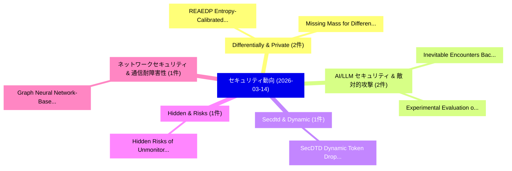

# 📅 02_daily: 日次エグゼクティブサマリー報告書 (2026-03-14)

**集計日時**: 2026-10-02 23:06:01 UTC  
**対象日付**: 2026-03-14  
**本日収集論文数**: 21 件  

---

## 💡 主要セキュリティ動向・脅威インサイト (Executive Insights)

本日の収集論文（計 21 件）において、以下の重点セキュリティ領域で活発な研究動向が確認されました：
- **Differentially & Private** (2 件): 注目論文として 「REAEDP: Entropy-Calibrated Dif...」、「Missing Mass for Differentiall...」 等が発表され、実務防御および攻撃検証の進展が見られます。
- **AI/LLM セキュリティ & 敵対的攻撃** (2 件): 注目論文として 「Inevitable Encounters: Backdoo...」、「Experimental Evaluation of Sec...」 等が発表され、実務防御および攻撃検証の進展が見られます。
- **Secdtd & Dynamic** (1 件): 注目論文として 「SecDTD: Dynamic Token Drop for...」 等が発表され、実務防御および攻撃検証の進展が見られます。
- **Hidden & Risks** (1 件): 注目論文として 「Hidden Risks of Unmonitored GP...」 等が発表され、実務防御および攻撃検証の進展が見られます。
- **ネットワークセキュリティ & 通信耐障害性** (1 件): 注目論文として 「Graph Neural Network-Based DDo...」 等が発表され、実務防御および攻撃検証の進展が見られます。

### 🗺️ 技術・脅威トピックマインドマップ

---

## 📌 日次セキュリティ論文一覧 (日本語表形式)

| No | arXiv ID | 論文タイトル (日本語訳) | 重要キーワード | 構造化エグゼクティブ要約 (背景・提案・影響) | 脅威分類 | 詳細リンク |
|---|---|---|---|---|---|---|
| 1 | `2603.13670v1` | [SecDTD: Dynamic Token Drop for Secure Transformers Inference（セキュリティ分析論文）](../../okf/papers/2026-03-14/2603.13670.md) | `Dynamic Token Drop`, `Secure Transformers Inference`, `Yifei Cai` | 【提案】概要 (Overview & Key Finding) 本論文「SecDTD: Dynamic Token Drop for Secure Transformers Infe...。実証評価により経営層・セキュリティ管理者向け推奨アクション (E... | `cybersecurity` | [arXiv](https://arxiv.org/abs/2603.13670v1) &#124; [OKF](../../okf/papers/2026-03-14/2603.13670.md) |
| 2 | `2603.13675v1` | [Hidden Risks of Unmonitored GPUs in Intelligent Transportation Systems（セキュリティ分析論文）](../../okf/papers/2026-03-14/2603.13675.md) | `Intelligent Transportation Systems`, `Hidden Risks`, `Noor Puspa` | 【提案】概要 (Overview & Key Finding) 本論文「Hidden Risks of Unmonitored GPUs in Intelligent Transpo...。実証評価により経営層・セキュリティ管理者向け推奨アクション (E... | `executive-summary` | [arXiv](https://arxiv.org/abs/2603.13675v1) &#124; [OKF](../../okf/papers/2026-03-14/2603.13675.md) |
| 3 | `2603.13694v1` | [Graph Neural Network-Based DDoS Protection for Data Center Infrastructure（セキュリティ分析論文）](../../okf/papers/2026-03-14/2603.13694.md) | `Graph Neural Network`, `Data Center Infrastructure`, `Network-Based DDoS` | 【提案】概要 (Overview & Key Finding) 本論文「Graph Neural Network-Based DDoS Protection for Data Cen...。実証評価により経営層・セキュリティ管理者向け推奨アクション (E... | `cybersecurity` | [arXiv](https://arxiv.org/abs/2603.13694v1) &#124; [OKF](../../okf/papers/2026-03-14/2603.13694.md) |
| 4 | `2603.13709v1` | [REAEDP: Entropy-Calibrated Differentially Private Data Release with Formal Guarantees and Attack-Based Evaluation（セキュリティ分析論文）](../../okf/papers/2026-03-14/2603.13709.md) | `Calibrated Differentially Private Data Release`, `Entropy-Calibrated Differentially`, `Formal Guarantees` | 【提案】概要 (Overview & Key Finding) 本論文「REAEDP: Entropy-Calibrated Differentially Private Data ...。実証評価により経営層・セキュリティ管理者向け推奨アクション (E... | `cs.CV` | [arXiv](https://arxiv.org/abs/2603.13709v1) &#124; [OKF](../../okf/papers/2026-03-14/2603.13709.md) |
| 5 | `2603.13722v1` | [TableMark: A Multi-bit Watermark for Synthetic Tabular Data（セキュリティ分析論文）](../../okf/papers/2026-03-14/2603.13722.md) | `Synthetic Tabular Data`, `Multi-bit Watermark`, `Yuyang Xia` | 【提案】概要 (Overview & Key Finding) 本論文「TableMark: A Multi-bit Watermark for Synthetic Tabular ...。実証評価により経営層・セキュリティ管理者向け推奨アクション (E... | `cs.DB` | [arXiv](https://arxiv.org/abs/2603.13722v1) &#124; [OKF](../../okf/papers/2026-03-14/2603.13722.md) |
| 6 | `2603.13728v2` | [Bodhi VLM: Privacy-Alignment Modeling for Hierarchical Visual Representations in Vision Backbones and VLM Encoders via Bottom-Up and Top-Down Feature Search（セキュリティ分析論文）](../../okf/papers/2026-03-14/2603.13728.md) | `Hierarchical Visual Representations`, `Alignment Modeling`, `Vision Backbones` | 【提案】概要 (Overview & Key Finding) 本論文「Bodhi VLM: Privacy-Alignment Modeling for Hierarchical ...。実証評価により経営層・セキュリティ管理者向け推奨アクション (E... | `cs.CV` | [arXiv](https://arxiv.org/abs/2603.13728v2) &#124; [OKF](../../okf/papers/2026-03-14/2603.13728.md) |
| 7 | `2603.13734v1` | [Ransomware and Artificial Intelligence: A Comprehensive Systematic Review of Reviews（セキュリティ分析論文）](../../okf/papers/2026-03-14/2603.13734.md) | `Comprehensive Systematic Review`, `Artificial Intelligence`, `Therdpong Daengsi` | 【提案】概要 (Overview & Key Finding) 本論文「ランサムウェア and Artificial Intelligence: A Comprehensive Sy...。実証評価により経営層・セキュリティ管理者向け推奨アクション (E... | `executive-summary` | [arXiv](https://arxiv.org/abs/2603.13734v1) &#124; [OKF](../../okf/papers/2026-03-14/2603.13734.md) |
| 8 | `2603.13735v1` | [Unlinkability and History Preserving Bisimilarity（セキュリティ分析論文）](../../okf/papers/2026-03-14/2603.13735.md) | `History Preserving Bisimilarity`, `Ross Horne`, `Christian Johansen` | 【提案】概要 (Overview & Key Finding) 本論文「Unlinkability and History Preserving Bisimilarity（セキュリテ...。実証評価により経営層・セキュリティ管理者向け推奨アクション (E... | `cybersecurity` | [arXiv](https://arxiv.org/abs/2603.13735v1) &#124; [OKF](../../okf/papers/2026-03-14/2603.13735.md) |
| 9 | `2603.13812v1` | [Switching Coordinator: An SDN Application for Flexible QKD-Networks（セキュリティ分析論文）](../../okf/papers/2026-03-14/2603.13812.md) | `Switching Coordinator`, `Hang Fred Fung`, `Hamid Taramit` | 【提案】概要 (Overview & Key Finding) 本論文「Switching Coordinator: An SDN Application for Flexible ...。実証評価によりBrito, Hamid Taramit, Chi-H。 | `cybersecurity` | [arXiv](https://arxiv.org/abs/2603.13812v1) &#124; [OKF](../../okf/papers/2026-03-14/2603.13812.md) |
| 10 | `2603.13830v1` | [Early Rug Pull Warning for BSC Meme Tokens via Multi-Granularity Wash-Trading Pattern Profiling（セキュリティ分析論文）](../../okf/papers/2026-03-14/2603.13830.md) | `Early Rug Pull Warning`, `Trading Pattern Profiling`, `Meme Tokens` | 【提案】概要 (Overview & Key Finding) 本論文「Early Rug Pull Warning for BSC Meme Tokens via Multi-Gr...。実証評価により経営層・セキュリティ管理者向け推奨アクション (E... | `cs.AI` | [arXiv](https://arxiv.org/abs/2603.13830v1) &#124; [OKF](../../okf/papers/2026-03-14/2603.13830.md) |
| 11 | `2603.13847v1` | [Sirens' Whisper: Inaudible Near-Ultrasonic Jailbreaks of Speech-Driven LLMs（セキュリティ分析論文）](../../okf/papers/2026-03-14/2603.13847.md) | `Inaudible Near`, `Ultrasonic Jailbreaks`, `Near-Ultrasonic Jailbreaks` | 【提案】概要 (Overview & Key Finding) 本論文「Sirens' Whisper: Inaudible Near-Ultrasonic ジェイルブレイクs of...。実証評価により経営層・セキュリティ管理者向け推奨アクション (E... | `cs.AI` | [arXiv](https://arxiv.org/abs/2603.13847v1) &#124; [OKF](../../okf/papers/2026-03-14/2603.13847.md) |
| 12 | `2603.13864v2` | [Inevitable Encounters: Backdoor Attacks Involving Lossy Compression（セキュリティ分析論文）](../../okf/papers/2026-03-14/2603.13864.md) | `Backdoor Attacks Involving Lossy Compression`, `Inevitable Encounters`, `Qian Li` | 【提案】概要 (Overview & Key Finding) 本論文「Inevitable Encounters: Backdoor Attacks Involving Lossy...。実証評価により経営層・セキュリティ管理者向け推奨アクション (E... | `cs.CV` | [arXiv](https://arxiv.org/abs/2603.13864v2) &#124; [OKF](../../okf/papers/2026-03-14/2603.13864.md) |
| 13 | `2603.13900v2` | [CONFETTY: A Tool for Enforcement and Data Confidentiality on Blockchain-Based Processes（セキュリティ分析論文）](../../okf/papers/2026-03-14/2603.13900.md) | `Data Confidentiality`, `Based Processes`, `Blockchain-Based Processes` | 【提案】概要 (Overview & Key Finding) 本論文「CONFETTY: A Tool for Enforcement and Data Confidentiali...。実証評価により経営層・セキュリティ管理者向け推奨アクション (E... | `cybersecurity` | [arXiv](https://arxiv.org/abs/2603.13900v2) &#124; [OKF](../../okf/papers/2026-03-14/2603.13900.md) |
| 14 | `2603.14009v3` | [On secret sharing from extended norm-trace curves（セキュリティ分析論文）](../../okf/papers/2026-03-14/2603.14009.md) | `norm-trace curves`, `Olav Geil`, `Raw Meta` | 【提案】概要 (Overview & Key Finding) 本論文「On secret sharing from extended norm-trace curves（セキュリテ...。実証評価により経営層・セキュリティ管理者向け推奨アクション (E... | `cybersecurity` | [arXiv](https://arxiv.org/abs/2603.14009v3) &#124; [OKF](../../okf/papers/2026-03-14/2603.14009.md) |
| 15 | `2603.14011v1` | [Sovereign-OS: A Charter-Governed Operating System for Autonomous AI Agents with Verifiable Fiscal Discipline（セキュリティ分析論文）](../../okf/papers/2026-03-14/2603.14011.md) | `Governed Operating System`, `Verifiable Fiscal Discipline`, `Charter-Governed Operating` | 【提案】概要 (Overview & Key Finding) 本論文「Sovereign-OS: A Charter-Governed Operating System for A...。実証評価により経営層・セキュリティ管理者向け推奨アクション (E... | `cybersecurity` | [arXiv](https://arxiv.org/abs/2603.14011v1) &#124; [OKF](../../okf/papers/2026-03-14/2603.14011.md) |
| 16 | `2603.14016v1` | [Missing Mass for Differentially Private Domain Discovery（セキュリティ分析論文）](../../okf/papers/2026-03-14/2603.14016.md) | `Differentially Private Domain Discovery`, `Missing Mass`, `Travis Dick` | 【提案】概要 (Overview & Key Finding) 本論文「Missing Mass for Differentially Private Domain Discover...。実証評価により経営層・セキュリティ管理者向け推奨アクション (E... | `cybersecurity` | [arXiv](https://arxiv.org/abs/2603.14016v1) &#124; [OKF](../../okf/papers/2026-03-14/2603.14016.md) |
| 17 | `2603.14122v1` | [Agentic Honeynet Configurationに向けて](../../okf/papers/2026-03-14/2603.14122.md) | `Towards Agentic Honeynet Configuration`, `Agentic Honeynet`, `Federico Mirra` | 【提案】概要 (Overview & Key Finding) 本論文「Agentic Honeynet Configurationに向けて」（原題: Towards Agentic...。実証評価により経営層・セキュリティ管理者向け推奨アクション (E... | `cs.AI` | [arXiv](https://arxiv.org/abs/2603.14122v1) &#124; [OKF](../../okf/papers/2026-03-14/2603.14122.md) |
| 18 | `2603.14124v1` | [Experimental Evaluation of Security Attacks on Self-Driving Car Platforms（セキュリティ分析論文）](../../okf/papers/2026-03-14/2603.14124.md) | `Driving Car Platforms`, `Security Attacks`, `Self-Driving Car` | 【提案】概要 (Overview & Key Finding) 本論文「Experimental Evaluation of Security Attacks on Self-Dri...。実証評価によりNguyen, Nathan Lee, Moham... | `executive-summary` | [arXiv](https://arxiv.org/abs/2603.14124v1) &#124; [OKF](../../okf/papers/2026-03-14/2603.14124.md) |
| 19 | `2603.15679v1` | [IdentityGuard: Context-Aware Restriction and Provenance for Personalized Synthesis（セキュリティ分析論文）](../../okf/papers/2026-03-14/2603.15679.md) | `Aware Restriction`, `Personalized Synthesis`, `Context-Aware Restriction` | 【提案】概要 (Overview & Key Finding) 本論文「IdentityGuard: Context-Aware Restriction and Provenance...。実証評価により経営層・セキュリティ管理者向け推奨アクション (E... | `cs.AI` | [arXiv](https://arxiv.org/abs/2603.15679v1) &#124; [OKF](../../okf/papers/2026-03-14/2603.15679.md) |
| 20 | `2603.16928v1` | [Noticing the Watcher: LLMエージェント Can Infer CoT Monitoring from Blocking Feedback](../../okf/papers/2026-03-14/2603.16928.md) | `Blocking Feedback`, `Agents Can Infer`, `Can Infer` | 【提案】概要 (Overview & Key Finding) 本論文「Noticing the Watcher: LLMエージェント Can Infer CoT Monitorin...。実証評価により経営層・セキュリティ管理者向け推奨アクション (E... | `executive-summary` | [arXiv](https://arxiv.org/abs/2603.16928v1) &#124; [OKF](../../okf/papers/2026-03-14/2603.16928.md) |
| 21 | `2603.19314v1` | [DPxFin: Adaptive Differential Privacy for Anti-Money Laundering Detection via Reputation-Weighted 連合学習](../../okf/papers/2026-03-14/2603.19314.md) | `Adaptive Differential Privacy`, `Money Laundering Detection`, `Anti-Money Laundering` | 【提案】概要 (Overview & Key Finding) 本論文「DPxFin: Adaptive 差分プライバシー for Anti-Money Laundering Det...。実証評価により経営層・セキュリティ管理者向け推奨アクション (E... | `executive-summary` | [arXiv](https://arxiv.org/abs/2603.19314v1) &#124; [OKF](../../okf/papers/2026-03-14/2603.19314.md) |

