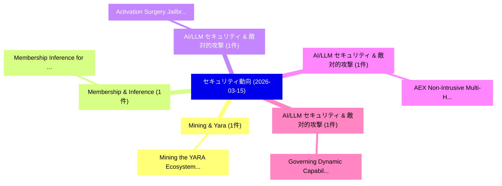

# 📅 02_daily: 日次エグゼクティブサマリー報告書 (2026-03-15)

**集計日時**: 2026-10-02 23:06:01 UTC  
**対象日付**: 2026-03-15  
**本日収集論文数**: 14 件  

---

## 💡 主要セキュリティ動向・脅威インサイト (Executive Insights)

本日の収集論文（計 14 件）において、以下の重点セキュリティ領域で活発な研究動向が確認されました：
- **Mining & Yara** (1 件): 注目論文として 「Mining the YARA Ecosystem: Fro...」 等が発表され、実務防御および攻撃検証の進展が見られます。
- **Membership & Inference** (1 件): 注目論文として 「Membership Inference for Contr...」 等が発表され、実務防御および攻撃検証の進展が見られます。
- **AI/LLM セキュリティ & 敵対的攻撃** (1 件): 注目論文として 「Activation Surgery: Jailbreaki...」 等が発表され、実務防御および攻撃検証の進展が見られます。
- **AI/LLM セキュリティ & 敵対的攻撃** (1 件): 注目論文として 「AEX: Non-Intrusive Multi-Hop A...」 等が発表され、実務防御および攻撃検証の進展が見られます。
- **AI/LLM セキュリティ & 敵対的攻撃** (1 件): 注目論文として 「Governing Dynamic Capabilities...」 等が発表され、実務防御および攻撃検証の進展が見られます。

### 🗺️ 技術・脅威トピックマインドマップ

---

## 📌 日次セキュリティ論文一覧 (日本語表形式)

| No | arXiv ID | 論文タイトル (日本語訳) | 重要キーワード | 構造化エグゼクティブ要約 (背景・提案・影響) | 脅威分類 | 詳細リンク |
|---|---|---|---|---|---|---|
| 1 | `2603.14191v1` | [Mining the YARA Ecosystem: From Ad-Hoc Sharing to Data-Driven Threat Intelligence（セキュリティ分析論文）](../../okf/papers/2026-03-15/2603.14191.md) | `Driven Threat Intelligence`, `Hoc Sharing`, `Ad-Hoc Sharing` | 【提案】概要 (Overview & Key Finding) 本論文「Mining the YARA Ecosystem: From Ad-Hoc Sharing to Data-...。実証評価により経営層・セキュリティ管理者向け推奨アクション (E... | `executive-summary` | [arXiv](https://arxiv.org/abs/2603.14191v1) &#124; [OKF](../../okf/papers/2026-03-15/2603.14191.md) |
| 2 | `2603.14222v2` | [Membership Inference for Contrastive Pre-training Models with Text-only PII Queries（セキュリティ分析論文）](../../okf/papers/2026-03-15/2603.14222.md) | `Membership Inference`, `Contrastive Pre`, `Pre-training Models` | 【提案】概要 (Overview & Key Finding) 本論文「Membership Inference for Contrastive Pre-training Model...。実証評価により経営層・セキュリティ管理者向け推奨アクション (E... | `cs.AI` | [arXiv](https://arxiv.org/abs/2603.14222v2) &#124; [OKF](../../okf/papers/2026-03-15/2603.14222.md) |
| 3 | `2603.14278v1` | [Activation Surgery: Jailbreaking White-box LLMs without Touching the Prompt（セキュリティ分析論文）](../../okf/papers/2026-03-15/2603.14278.md) | `Activation Surgery`, `Jailbreaking White`, `White-box LLMs` | 【提案】背景とセキュリティ上の課題 (Background & Problem) 本研究はサイバー脅威環境におけるセキュリティ構造・脆弱性の検証を目的としています。(主要検出項目: ...。実証評価により経営層・セキュリティ管理者向け推奨アクション (E... | `cybersecurity` | [arXiv](https://arxiv.org/abs/2603.14278v1) &#124; [OKF](../../okf/papers/2026-03-15/2603.14278.md) |
| 4 | `2603.14283v1` | [AEX: Non-Intrusive Multi-Hop Attestation and Provenance for LLM APIs（セキュリティ分析論文）](../../okf/papers/2026-03-15/2603.14283.md) | `Intrusive Multi`, `Hop Attestation`, `Non-Intrusive Multi` | 【提案】概要 (Overview & Key Finding) 本論文「AEX: Non-Intrusive Multi-Hop Attestation and Provenance...。実証評価により経営層・セキュリティ管理者向け推奨アクション (E... | `cs.AI` | [arXiv](https://arxiv.org/abs/2603.14283v1) &#124; [OKF](../../okf/papers/2026-03-15/2603.14283.md) |
| 5 | `2603.14332v2` | [Governing Dynamic Capabilities: Cryptographic Binding and Reproducibility Verification for AI Agent Tool Use（セキュリティ分析論文）](../../okf/papers/2026-03-15/2603.14332.md) | `Governing Dynamic Capabilities`, `Agent Tool Use`, `Cryptographic Binding` | 【提案】概要 (Overview & Key Finding) 本論文「Governing Dynamic Capabilities: Cryptographic Binding a...。実証評価により経営層・セキュリティ管理者向け推奨アクション (E... | `cybersecurity` | [arXiv](https://arxiv.org/abs/2603.14332v2) &#124; [OKF](../../okf/papers/2026-03-15/2603.14332.md) |
| 6 | `2603.14341v1` | [Generation of Human Comprehensible Access Control Policies from Audit Logs（セキュリティ分析論文）](../../okf/papers/2026-03-15/2603.14341.md) | `Human Comprehensible Access Control Policies`, `Audit Logs`, `Gautam Kumar` | 【提案】概要 (Overview & Key Finding) 本論文「Generation of Human Comprehensible アクセス制御 Policies from...。実証評価により経営層・セキュリティ管理者向け推奨アクション (E... | `executive-summary` | [arXiv](https://arxiv.org/abs/2603.14341v1) &#124; [OKF](../../okf/papers/2026-03-15/2603.14341.md) |
| 7 | `2603.14365v1` | [Toward Secure Web to ERP Payment Flows: A Case Study of HTTP Header Trust Failures in SAP Based Systems（セキュリティ分析論文）](../../okf/papers/2026-03-15/2603.14365.md) | `Toward Secure Web`, `Header Trust Failures`, `Payment Flows` | 【提案】概要 (Overview & Key Finding) 本論文「Toward Secure Web to ERP Payment Flows: A Case Study of...。実証評価により経営層・セキュリティ管理者向け推奨アクション (E... | `executive-summary` | [arXiv](https://arxiv.org/abs/2603.14365v1) &#124; [OKF](../../okf/papers/2026-03-15/2603.14365.md) |
| 8 | `2603.14492v1` | [Oblivis: A Framework for Delegated and Efficient Oblivious Transfer（セキュリティ分析論文）](../../okf/papers/2026-03-15/2603.14492.md) | `Efficient Oblivious Transfer`, `Aydin Abadi`, `Yvo Desmedt` | 【提案】概要 (Overview & Key Finding) 本論文「Oblivis: A Framework for Delegated and Efficient Oblivi...。実証評価により経営層・セキュリティ管理者向け推奨アクション (E... | `cs.DB` | [arXiv](https://arxiv.org/abs/2603.14492v1) &#124; [OKF](../../okf/papers/2026-03-15/2603.14492.md) |
| 9 | `2603.14592v1` | [A Multi-Scale Graph Learning Framework with Temporal Consistency Constraints for Financial Fraud Detection in Transaction Networks under Non-Stationary Conditions（セキュリティ分析論文）](../../okf/papers/2026-03-15/2603.14592.md) | `Temporal Consistency Constraints`, `Financial Fraud Detection`, `Transaction Networks` | 【提案】概要 (Overview & Key Finding) 本論文「A Multi-Scale Graph Learning Framework with Temporal Co...。実証評価により経営層・セキュリティ管理者向け推奨アクション (E... | `executive-summary` | [arXiv](https://arxiv.org/abs/2603.14592v1) &#124; [OKF](../../okf/papers/2026-03-15/2603.14592.md) |
| 10 | `2603.14628v2` | [s2n-bignum-bench: A practical benchmark for evaluating low-level code reasoning of LLMs（セキュリティ分析論文）](../../okf/papers/2026-03-15/2603.14628.md) | `low-level code`, `Balaji Rao`, `John Harrison` | 【提案】概要 (Overview & Key Finding) 本論文「s2n-bignum-bench: A practical benchmark for evaluating ...。実証評価により経営層・セキュリティ管理者向け推奨アクション (E... | `cs.PL` | [arXiv](https://arxiv.org/abs/2603.14628v2) &#124; [OKF](../../okf/papers/2026-03-15/2603.14628.md) |
| 11 | `2603.14633v1` | [When Scanners Lie: Evaluator Instability in LLM Red-Teaming（セキュリティ分析論文）](../../okf/papers/2026-03-15/2603.14633.md) | `Evaluator Instability`, `Lidor Erez`, `Omer Hofman` | 【提案】概要 (Overview & Key Finding) 本論文「When Scanners Lie: Evaluator Instability in LLM Red-Tea...。実証評価により経営層・セキュリティ管理者向け推奨アクション (E... | `executive-summary` | [arXiv](https://arxiv.org/abs/2603.14633v1) &#124; [OKF](../../okf/papers/2026-03-15/2603.14633.md) |
| 12 | `2603.15684v2` | [State-Dependent Safety Failures in Multi-Turn Language Model Interaction（セキュリティ分析論文）](../../okf/papers/2026-03-15/2603.15684.md) | `Turn Language Model Interaction`, `Dependent Safety Failures`, `State-Dependent Safety` | 【提案】概要 (Overview & Key Finding) 本論文「State-Dependent Safety Failures in Multi-Turn Language ...。実証評価により経営層・セキュリティ管理者向け推奨アクション (E... | `cs.AI` | [arXiv](https://arxiv.org/abs/2603.15684v2) &#124; [OKF](../../okf/papers/2026-03-15/2603.15684.md) |
| 13 | `2603.16938v1` | [Cryptographic Runtime Governance for Autonomous AI Systems: The Aegis Architecture for Verifiable Policy Enforcement（セキュリティ分析論文）](../../okf/papers/2026-03-15/2603.16938.md) | `Cryptographic Runtime Governance`, `Verifiable Policy Enforcement`, `Adam Massimo Mazzocchetti` | 【提案】概要 (Overview & Key Finding) 本論文「Cryptographic Runtime Governance for Autonomous AI Syst...。実証評価により経営層・セキュリティ管理者向け推奨アクション (E... | `cs.AI` | [arXiv](https://arxiv.org/abs/2603.16938v1) &#124; [OKF](../../okf/papers/2026-03-15/2603.16938.md) |
| 14 | `2605.00828v1` | [Canonical LST: A Protocol-Native Liquid Staking Solution for Tezos（セキュリティ分析論文）](../../okf/papers/2026-03-15/2605.00828.md) | `Native Liquid Staking Solution`, `Protocol-Native Liquid`, `Mathias Bourgoin` | 【提案】概要 (Overview & Key Finding) 本論文「Canonical LST: A Protocol-Native Liquid Staking Solutio...。実証評価により経営層・セキュリティ管理者向け推奨アクション (E... | `executive-summary` | [arXiv](https://arxiv.org/abs/2605.00828v1) &#124; [OKF](../../okf/papers/2026-03-15/2605.00828.md) |

