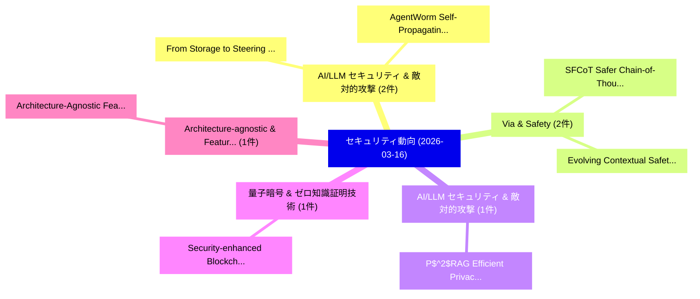

# 📅 02_daily: 日次エグゼクティブサマリー報告書 (2026-03-16)

**集計日時**: 2026-10-02 23:06:01 UTC  
**対象日付**: 2026-03-16  
**本日収集論文数**: 26 件  

---

## 💡 主要セキュリティ動向・脅威インサイト (Executive Insights)

本日の収集論文（計 26 件）において、以下の重点セキュリティ領域で活発な研究動向が確認されました：
- **AI/LLM セキュリティ & 敵対的攻撃** (2 件): 注目論文として 「From Storage to Steering: Memo...」、「AgentWorm: Self-Propagating At...」 等が発表され、実務防御および攻撃検証の進展が見られます。
- **Via & Safety** (2 件): 注目論文として 「SFCoT: Safer Chain-of-Thought ...」、「Evolving Contextual Safety in ...」 等が発表され、実務防御および攻撃検証の進展が見られます。
- **AI/LLM セキュリティ & 敵対的攻撃** (1 件): 注目論文として 「P$^2$RAG: Efficient Privacy-Pr...」 等が発表され、実務防御および攻撃検証の進展が見られます。
- **量子暗号 & ゼロ知識証明技術** (1 件): 注目論文として 「Security-enhanced Blockchain w...」 等が発表され、実務防御および攻撃検証の進展が見られます。
- **Architecture-agnostic & Feature** (1 件): 注目論文として 「Architecture-Agnostic Feature ...」 等が発表され、実務防御および攻撃検証の進展が見られます。

### 🗺️ 技術・脅威トピックマインドマップ

---

## 📌 日次セキュリティ論文一覧 (日本語表形式)

| No | arXiv ID | 論文タイトル (日本語訳) | 重要キーワード | 構造化エグゼクティブ要約 (背景・提案・影響) | 脅威分類 | 詳細リンク |
|---|---|---|---|---|---|---|
| 1 | `2603.14778v2` | [P$^2$RAG: Efficient Privacy-Preserving RAG Service Supporting Arbitrary Top-$k$ Retrieval（セキュリティ分析論文）](../../okf/papers/2026-03-16/2603.14778.md) | `Service Supporting Arbitrary Top`, `Efficient Privacy`, `Privacy-Preserving RAG` | 【提案】概要 (Overview & Key Finding) 本論文「P$^2$RAG: Efficient Privacy-Preserving RAG Service Supp...。実証評価により経営層・セキュリティ管理者向け推奨アクション (E... | `cs.AI` | [arXiv](https://arxiv.org/abs/2603.14778v2) &#124; [OKF](../../okf/papers/2026-03-16/2603.14778.md) |
| 2 | `2603.14826v3` | [Security-enhanced Blockchain with Twin-Field Quantum Key Distribution: A Physical Layer enabled Architecture（セキュリティ分析論文）](../../okf/papers/2026-03-16/2603.14826.md) | `Field Quantum Key Distribution`, `Security-enhanced Blockchain`, `Twin-Field Quantum` | 【提案】概要 (Overview & Key Finding) 本論文「Security-enhanced Blockchain with Twin-Field 量子鍵配送: A P...。実証評価により経営層・セキュリティ管理者向け推奨アクション (E... | `executive-summary` | [arXiv](https://arxiv.org/abs/2603.14826v3) &#124; [OKF](../../okf/papers/2026-03-16/2603.14826.md) |
| 3 | `2603.14860v1` | [Architecture-Agnostic Feature Synergy for Universal Defense Against Heterogeneous Generative Threats（セキュリティ分析論文）](../../okf/papers/2026-03-16/2603.14860.md) | `Agnostic Feature Synergy`, `Architecture-Agnostic Feature`, `Bingxue Zhang` | 【提案】概要 (Overview & Key Finding) 本論文「Architecture-Agnostic Feature Synergy for Universal Def...。実証評価により経営層・セキュリティ管理者向け推奨アクション (E... | `cs.AI` | [arXiv](https://arxiv.org/abs/2603.14860v1) &#124; [OKF](../../okf/papers/2026-03-16/2603.14860.md) |
| 4 | `2603.14911v1` | [Fine-tuning RoBERTa for CVE-to-CWE Classification: A 125M Parameter Model Competitive with LLMs（セキュリティ分析論文）](../../okf/papers/2026-03-16/2603.14911.md) | `Parameter Model Competitive`, `Fine-tuning RoBERTa`, `Nikita Mosievskiy` | 【提案】概要 (Overview & Key Finding) 本論文「Fine-tuning RoBERTa for CVE-to-CWE Classification: A 12...。実証評価により経営層・セキュリティ管理者向け推奨アクション (E... | `executive-summary` | [arXiv](https://arxiv.org/abs/2603.14911v1) &#124; [OKF](../../okf/papers/2026-03-16/2603.14911.md) |
| 5 | `2603.14968v2` | [Rethinking LLM Watermark Detection in Black-Box Settings: A Non-Intrusive Third-Party Framework（セキュリティ分析論文）](../../okf/papers/2026-03-16/2603.14968.md) | `Watermark Detection`, `Box Settings`, `Intrusive Third` | 【提案】概要 (Overview & Key Finding) 本論文「Rethinking LLM Watermark Detection in Black-Box Setting...。実証評価により経営層・セキュリティ管理者向け推奨アクション (E... | `executive-summary` | [arXiv](https://arxiv.org/abs/2603.14968v2) &#124; [OKF](../../okf/papers/2026-03-16/2603.14968.md) |
| 6 | `2603.14994v2` | [DP-S4S: Accurate and Scalable Select-Join-Aggregate Query Processing with User-Level Differential Privacy（セキュリティ分析論文）](../../okf/papers/2026-03-16/2603.14994.md) | `Aggregate Query Processing`, `Level Differential Privacy`, `Scalable Select` | 【提案】概要 (Overview & Key Finding) 本論文「DP-S4S: Accurate and Scalable Select-Join-Aggregate Que...。実証評価により経営層・セキュリティ管理者向け推奨アクション (E... | `cs.DB` | [arXiv](https://arxiv.org/abs/2603.14994v2) &#124; [OKF](../../okf/papers/2026-03-16/2603.14994.md) |
| 7 | `2603.15125v3` | [From Storage to Steering: Memory Control Flow Attacks on LLMエージェント](../../okf/papers/2026-03-16/2603.15125.md) | `Memory Control Flow Attacks`, `Zhenlin Xu`, `Xiaogang Zhu` | 【提案】概要 (Overview & Key Finding) 本論文「From Storage to Steering: Memory Control Flow Attacks o...。実証評価により経営層・セキュリティ管理者向け推奨アクション (E... | `cybersecurity` | [arXiv](https://arxiv.org/abs/2603.15125v3) &#124; [OKF](../../okf/papers/2026-03-16/2603.15125.md) |
| 8 | `2603.15146v1` | [Infinite families of APN permutations in constrained trivariate classes over $\mathbb{F}_{2^m}$（セキュリティ分析論文）](../../okf/papers/2026-03-16/2603.15146.md) | `Daniele Bartoli`, `Pantelimon Stanica`, `Raw Meta` | 【提案】概要 (Overview & Key Finding) 本論文「Infinite families of APN permutations in constrained tr...。実証評価により経営層・セキュリティ管理者向け推奨アクション (E... | `executive-summary` | [arXiv](https://arxiv.org/abs/2603.15146v1) &#124; [OKF](../../okf/papers/2026-03-16/2603.15146.md) |
| 9 | `2603.15216v1` | [vCause: Efficient and Verifiable Causality Analysis for Cloud-based Endpoint Auditing（セキュリティ分析論文）](../../okf/papers/2026-03-16/2603.15216.md) | `Endpoint Auditing`, `Cloud-based Endpoint`, `Qiyang Song` | 【提案】概要 (Overview & Key Finding) 本論文「vCause: Efficient and Verifiable Causality Analysis for...。実証評価により経営層・セキュリティ管理者向け推奨アクション (E... | `cybersecurity` | [arXiv](https://arxiv.org/abs/2603.15216v1) &#124; [OKF](../../okf/papers/2026-03-16/2603.15216.md) |
| 10 | `2603.15259v1` | [Directional Embedding Smoothing for Robust Vision Language Models（セキュリティ分析論文）](../../okf/papers/2026-03-16/2603.15259.md) | `Robust Vision Language Models`, `Directional Embedding Smoothing`, `Ye Wang` | 【提案】概要 (Overview & Key Finding) 本論文「Directional Embedding Smoothing for Robust Vision Langu...。実証評価により経営層・セキュリティ管理者向け推奨アクション (E... | `cs.AI` | [arXiv](https://arxiv.org/abs/2603.15259v1) &#124; [OKF](../../okf/papers/2026-03-16/2603.15259.md) |
| 11 | `2603.15320v1` | [Comparative SRAM PUF Temperature Susceptibility on Embedded Systemsの分析](../../okf/papers/2026-03-16/2603.15320.md) | `Temperature Susceptibility`, `Embedded Systems`, `Martina Zeinzinger` | 【提案】概要 (Overview & Key Finding) 本論文「Comparative SRAM PUF Temperature Susceptibility on Embe...。実証評価により経営層・セキュリティ管理者向け推奨アクション (E... | `cybersecurity` | [arXiv](https://arxiv.org/abs/2603.15320v1) &#124; [OKF](../../okf/papers/2026-03-16/2603.15320.md) |
| 12 | `2603.15344v2` | [Unsupervised Cross-Protocol Anomaly Analysis in Mobile Core Networks via Multi-Embedding Models Consensus（セキュリティ分析論文）](../../okf/papers/2026-03-16/2603.15344.md) | `Mobile Core Networks`, `Embedding Models Consensus`, `Unsupervised Cross` | 【提案】概要 (Overview & Key Finding) 本論文「Unsupervised Cross-Protocol Anomaly Analysis in Mobile ...。実証評価により経営層・セキュリティ管理者向け推奨アクション (E... | `cybersecurity` | [arXiv](https://arxiv.org/abs/2603.15344v2) &#124; [OKF](../../okf/papers/2026-03-16/2603.15344.md) |
| 13 | `2603.15372v1` | [SKILLS: Structured Knowledge Injection for LLM-Driven Telecommunications Operations（セキュリティ分析論文）](../../okf/papers/2026-03-16/2603.15372.md) | `Structured Knowledge Injection`, `Driven Telecommunications Operations`, `LLM-Driven Telecommunications` | 【提案】概要 (Overview & Key Finding) 本論文「SKILLS: Structured Knowledge Injection for LLM-Driven T...。実証評価により経営層・セキュリティ管理者向け推奨アクション (E... | `cs.AI` | [arXiv](https://arxiv.org/abs/2603.15372v1) &#124; [OKF](../../okf/papers/2026-03-16/2603.15372.md) |
| 14 | `2603.15397v1` | [SFCoT: Safer Chain-of-Thought via Active Safety Evaluation and Calibration（セキュリティ分析論文）](../../okf/papers/2026-03-16/2603.15397.md) | `Safer Chain`, `Yu Pan`, `Wenlong Yu` | 【提案】概要 (Overview & Key Finding) 本論文「SFCoT: Safer Chain-of-Thought via Active Safety Evaluat...。実証評価により経営層・セキュリティ管理者向け推奨アクション (E... | `cs.AI` | [arXiv](https://arxiv.org/abs/2603.15397v1) &#124; [OKF](../../okf/papers/2026-03-16/2603.15397.md) |
| 15 | `2603.15408v1` | [TrinityGuard: A Unified Framework for Safeguarding Multi-Agent Systems（セキュリティ分析論文）](../../okf/papers/2026-03-16/2603.15408.md) | `Safeguarding Multi`, `Agent Systems`, `Multi-Agent Systems` | 【提案】概要 (Overview & Key Finding) 本論文「TrinityGuard: A Unified Framework for Safeguarding Mult...。実証評価により経営層・セキュリティ管理者向け推奨アクション (E... | `cs.AI` | [arXiv](https://arxiv.org/abs/2603.15408v1) &#124; [OKF](../../okf/papers/2026-03-16/2603.15408.md) |
| 16 | `2603.15417v1` | [Amplification Effects in Test-Time Reinforcement Learning: Safety and Reasoning Vulnerabilities（セキュリティ分析論文）](../../okf/papers/2026-03-16/2603.15417.md) | `Time Reinforcement Learning`, `Amplification Effects`, `Reasoning Vulnerabilities` | 【提案】概要 (Overview & Key Finding) 本論文「Amplification Effects in Test-Time Reinforcement Learni...。実証評価により経営層・セキュリティ管理者向け推奨アクション (E... | `cs.AI` | [arXiv](https://arxiv.org/abs/2603.15417v1) &#124; [OKF](../../okf/papers/2026-03-16/2603.15417.md) |
| 17 | `2603.15457v1` | [Evasive Intelligence: Lessons from Malware Analysis for Evaluating AI Agents（セキュリティ分析論文）](../../okf/papers/2026-03-16/2603.15457.md) | `Evasive Intelligence`, `Simone Aonzo`, `Merve Sahin` | 【提案】概要 (Overview & Key Finding) 本論文「Evasive Intelligence: Lessons from マルウェア Analysis for E...。実証評価により経営層・セキュリティ管理者向け推奨アクション (E... | `cs.AI` | [arXiv](https://arxiv.org/abs/2603.15457v1) &#124; [OKF](../../okf/papers/2026-03-16/2603.15457.md) |
| 18 | `2603.15609v1` | [Differential Privacy for Network Connectedness Indices（セキュリティ分析論文）](../../okf/papers/2026-03-16/2603.15609.md) | `Network Connectedness Indices`, `Differential Privacy`, `Yuxin Liu` | 【提案】概要 (Overview & Key Finding) 本論文「差分プライバシー for Network Connectedness Indices（セキュリティ分析論文）」...。実証評価によりAmin Rahimian - **公開日時**:... | `executive-summary` | [arXiv](https://arxiv.org/abs/2603.15609v1) &#124; [OKF](../../okf/papers/2026-03-16/2603.15609.md) |
| 19 | `2603.15692v1` | [BadLLM-TG: A Backdoor Defender powered by LLM Trigger Generator（セキュリティ分析論文）](../../okf/papers/2026-03-16/2603.15692.md) | `Backdoor Defender`, `Trigger Generator`, `Ruyi Zhang` | 【提案】概要 (Overview & Key Finding) 本論文「BadLLM-TG: A Backdoor Defender powered by LLM Trigger G...。実証評価により経営層・セキュリティ管理者向け推奨アクション (E... | `cs.AI` | [arXiv](https://arxiv.org/abs/2603.15692v1) &#124; [OKF](../../okf/papers/2026-03-16/2603.15692.md) |
| 20 | `2603.15705v1` | [Remarks on the Relevance of Privacy Expectations for Default Opt-out Settings（セキュリティ分析論文）](../../okf/papers/2026-03-16/2603.15705.md) | `Privacy Expectations`, `Default Opt`, `Opt-out Settings` | 【提案】概要 (Overview & Key Finding) 本論文「Remarks on the Relevance of Privacy Expectations for De...。実証評価により経営層・セキュリティ管理者向け推奨アクション (E... | `executive-summary` | [arXiv](https://arxiv.org/abs/2603.15705v1) &#124; [OKF](../../okf/papers/2026-03-16/2603.15705.md) |
| 21 | `2603.15714v1` | [How Vulnerable Are AI Agents to Indirect Prompt Injections? Insights from a Large-Scale Public Competition（セキュリティ分析論文）](../../okf/papers/2026-03-16/2603.15714.md) | `Indirect Prompt Injections`, `Scale Public Competition`, `Large-Scale Public` | 【提案】Insights from a Large-Scale Public Competition ### (日本語題名: How Vulnerable Are AI Agents...。実証評価により経営層・セキュリティ管理者向け推奨アクション (E... | `cs.AI` | [arXiv](https://arxiv.org/abs/2603.15714v1) &#124; [OKF](../../okf/papers/2026-03-16/2603.15714.md) |
| 22 | `2603.15721v1` | [Grant, Verify, Revoke: A User-Centric Pattern for Blockchain Compliance（セキュリティ分析論文）](../../okf/papers/2026-03-16/2603.15721.md) | `Centric Pattern`, `Blockchain Compliance`, `User-Centric Pattern` | 【提案】概要 (Overview & Key Finding) 本論文「Grant, Verify, Revoke: A User-Centric Pattern for Block...。実証評価により経営層・セキュリティ管理者向け推奨アクション (E... | `executive-summary` | [arXiv](https://arxiv.org/abs/2603.15721v1) &#124; [OKF](../../okf/papers/2026-03-16/2603.15721.md) |
| 23 | `2603.15727v3` | [AgentWorm: Self-Propagating Attacks Across LLM Agent Ecosystems（セキュリティ分析論文）](../../okf/papers/2026-03-16/2603.15727.md) | `Propagating Attacks Across`, `Self-Propagating Attacks`, `Agent Ecosystems` | 【提案】概要 (Overview & Key Finding) 本論文「AgentWorm: Self-Propagating Attacks Across LLM Agent Ec...。実証評価により経営層・セキュリティ管理者向け推奨アクション (E... | `cs.AI` | [arXiv](https://arxiv.org/abs/2603.15727v3) &#124; [OKF](../../okf/papers/2026-03-16/2603.15727.md) |
| 24 | `2603.15800v1` | [Evolving Contextual Safety in Multi-Modal 大規模言語モデル via Inference-Time Self-Reflective Memory](../../okf/papers/2026-03-16/2603.15800.md) | `Evolving Contextual Safety`, `Time Self`, `Reflective Memory` | 【提案】概要 (Overview & Key Finding) 本論文「Evolving Contextual Safety in Multi-Modal 大規模言語モデル via ...。実証評価により経営層・セキュリティ管理者向け推奨アクション (E... | `cs.CV` | [arXiv](https://arxiv.org/abs/2603.15800v1) &#124; [OKF](../../okf/papers/2026-03-16/2603.15800.md) |
| 25 | `2603.15940v1` | [Do Not Leave a Gap: Hallucination-Free Object Concealment in Vision-Language Models（セキュリティ分析論文）](../../okf/papers/2026-03-16/2603.15940.md) | `Free Object Concealment`, `Language Models`, `Hallucination-Free Object` | 【提案】背景とセキュリティ上の課題 (Background & Problem) 本研究はサイバー脅威環境におけるセキュリティ構造・脆弱性の検証を目的としています。(主要検出項目: ...。実証評価により経営層・セキュリティ管理者向け推奨アクション (E... | `cs.CV` | [arXiv](https://arxiv.org/abs/2603.15940v1) &#124; [OKF](../../okf/papers/2026-03-16/2603.15940.md) |
| 26 | `2604.09618v2` | [HearthNet: Edge Multi-Agent Orchestration for Smart Homes（セキュリティ分析論文）](../../okf/papers/2026-03-16/2604.09618.md) | `Edge Multi`, `Agent Orchestration`, `Smart Homes` | 【提案】概要 (Overview & Key Finding) 本論文「HearthNet: Edge Multi-Agent Orchestration for Smart Hom...。実証評価により経営層・セキュリティ管理者向け推奨アクション (E... | `cs.AI` | [arXiv](https://arxiv.org/abs/2604.09618v2) &#124; [OKF](../../okf/papers/2026-03-16/2604.09618.md) |

