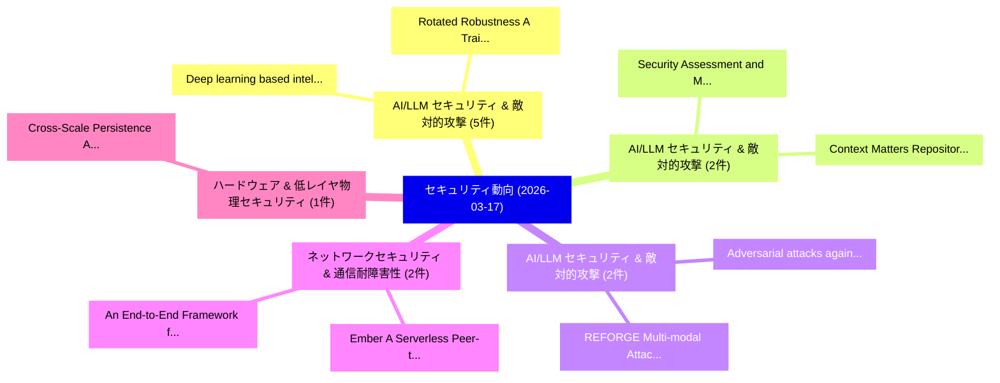

# 📅 02_daily: 日次エグゼクティブサマリー報告書 (2026-03-17)

**集計日時**: 2026-10-02 23:06:01 UTC  
**対象日付**: 2026-03-17  
**本日収集論文数**: 31 件  

---

## 💡 主要セキュリティ動向・脅威インサイト (Executive Insights)

本日の収集論文（計 31 件）において、以下の重点セキュリティ領域で活発な研究動向が確認されました：
- **AI/LLM セキュリティ & 敵対的攻撃** (5 件): 注目論文として 「Deep learning based intelligen...」、「Rotated Robustness: A Training...」 等が発表され、実務防御および攻撃検証の進展が見られます。
- **AI/LLM セキュリティ & 敵対的攻撃** (2 件): 注目論文として 「Context Matters: Repository-Aw...」、「Security Assessment and Mitiga...」 等が発表され、実務防御および攻撃検証の進展が見られます。
- **AI/LLM セキュリティ & 敵対的攻撃** (2 件): 注目論文として 「REFORGE: Multi-modal Attacks R...」、「Adversarial attacks against Mo...」 等が発表され、実務防御および攻撃検証の進展が見られます。
- **ネットワークセキュリティ & 通信耐障害性** (2 件): 注目論文として 「Ember: A Serverless Peer-to-Pe...」、「An End-to-End Framework for Fu...」 等が発表され、実務防御および攻撃検証の進展が見られます。
- **ハードウェア & 低レイヤ物理セキュリティ** (1 件): 注目論文として 「Cross-Scale Persistence Analys...」 等が発表され、実務防御および攻撃検証の進展が見られます。

### 🗺️ 技術・脅威トピックマインドマップ

---

## 📌 日次セキュリティ論文一覧 (日本語表形式)

| No | arXiv ID | 論文タイトル (日本語訳) | 重要キーワード | 構造化エグゼクティブ要約 (背景・提案・影響) | 脅威分類 | 詳細リンク |
|---|---|---|---|---|---|---|
| 1 | `2603.16058v1` | [Cross-Scale Persistence Analysis of EM Side-Channels for Reference-Free Always-On Hardware Trojansの検出](../../okf/papers/2026-03-17/2603.16058.md) | `Cross-Scale Persistence`, `Free Always`, `Reference-Free Always` | 【提案】概要 (Overview & Key Finding) 本論文「Cross-Scale Persistence Analysis of EM サイドチャネル攻撃s for R...。実証評価により経営層・セキュリティ管理者向け推奨アクション (E... | `cybersecurity` | [arXiv](https://arxiv.org/abs/2603.16058v1) &#124; [OKF](../../okf/papers/2026-03-17/2603.16058.md) |
| 2 | `2603.16068v3` | [Resource Consumption Threats in 大規模言語モデル](../../okf/papers/2026-03-17/2603.16068.md) | `Resource Consumption Threats`, `Large Language Models`, `Yuanhe Zhang` | 【提案】概要 (Overview & Key Finding) 本論文「Resource Consumption Threats in 大規模言語モデル」（原題: Resource ...。実証評価により経営層・セキュリティ管理者向け推奨アクション (E... | `cs.AI` | [arXiv](https://arxiv.org/abs/2603.16068v3) &#124; [OKF](../../okf/papers/2026-03-17/2603.16068.md) |
| 3 | `2603.16117v1` | [Ciphertext-Policy ABE for $\mathsf{NC}^1$ Circuits with Constant-Size Ciphertexts from Succinct LWE（セキュリティ分析論文）](../../okf/papers/2026-03-17/2603.16117.md) | `Size Ciphertexts`, `Ciphertext-Policy ABE`, `Constant-Size Ciphertexts` | 【提案】概要 (Overview & Key Finding) 本論文「Ciphertext-Policy ABE for $\mathsf{NC}^1$ Circuits with...。実証評価により経営層・セキュリティ管理者向け推奨アクション (E... | `cybersecurity` | [arXiv](https://arxiv.org/abs/2603.16117v1) &#124; [OKF](../../okf/papers/2026-03-17/2603.16117.md) |
| 4 | `2603.16181v1` | [KidsNanny: A Two-Stage Multimodal Content Moderation Pipeline Integrating Visual Classification, Object Detection, OCR, and Contextual Reasoning for Child Safety（セキュリティ分析論文）](../../okf/papers/2026-03-17/2603.16181.md) | `Stage Multimodal Content Moderation Pipeline Integrating Visual Classification`, `Object Detection`, `Contextual Reasoning` | 【提案】概要 (Overview & Key Finding) 本論文「KidsNanny: A Two-Stage Multimodal Content Moderation Pi...。実証評価により経営層・セキュリティ管理者向け推奨アクション (E... | `cs.CV` | [arXiv](https://arxiv.org/abs/2603.16181v1) &#124; [OKF](../../okf/papers/2026-03-17/2603.16181.md) |
| 5 | `2603.16267v1` | [Novel CRT-based Asymptotically Ideal Disjunctive Hierarchical Secret Sharing Scheme（セキュリティ分析論文）](../../okf/papers/2026-03-17/2603.16267.md) | `Asymptotically Ideal Disjunctive Hierarchical Secret Sharing Scheme`, `CRT-based Asymptotically`, `Asymptotically Ideal Disjunctive Hierarchical Secret` | 【提案】概要 (Overview & Key Finding) 本論文「Novel CRT-based Asymptotically Ideal Disjunctive Hierar...。実証評価により経営層・セキュリティ管理者向け推奨アクション (E... | `executive-summary` | [arXiv](https://arxiv.org/abs/2603.16267v1) &#124; [OKF](../../okf/papers/2026-03-17/2603.16267.md) |
| 6 | `2603.16274v1` | [From Torsors to Topoi: An Introduction with a View Toward $Σ$-Protocols in Cryptography（セキュリティ分析論文）](../../okf/papers/2026-03-17/2603.16274.md) | `View Toward`, `Raw Meta`, `Executive Summary` | 【提案】概要 (Overview & Key Finding) 本論文「From Torsors to Topoi: An Introduction with a View Towa...。実証評価により経営層・セキュリティ管理者向け推奨アクション (E... | `executive-summary` | [arXiv](https://arxiv.org/abs/2603.16274v1) &#124; [OKF](../../okf/papers/2026-03-17/2603.16274.md) |
| 7 | `2603.16320v1` | [Systematization of Knowledge: The Design Space of Digital Payment Systems with Potential for CBDC（セキュリティ分析論文）](../../okf/papers/2026-03-17/2603.16320.md) | `Digital Payment Systems`, `Judith Senn`, `Aljosha Judmayer` | 【提案】概要 (Overview & Key Finding) 本論文「Systematization of Knowledge: The Design Space of Digit...。実証評価により経営層・セキュリティ管理者向け推奨アクション (E... | `cybersecurity` | [arXiv](https://arxiv.org/abs/2603.16320v1) &#124; [OKF](../../okf/papers/2026-03-17/2603.16320.md) |
| 8 | `2603.16342v2` | [Deep learning based intelligent IDS for Large-scale IoT networks（セキュリティ分析論文）](../../okf/papers/2026-03-17/2603.16342.md) | `Large-scale IoT`, `Isha Andrade`, `Mithun Mukherjee` | 【提案】概要 (Overview & Key Finding) 本論文「Deep learning based intelligent IDS for Large-scale IoT...。実証評価により経営層・セキュリティ管理者向け推奨アクション (E... | `cs.AI` | [arXiv](https://arxiv.org/abs/2603.16342v2) &#124; [OKF](../../okf/papers/2026-03-17/2603.16342.md) |
| 9 | `2603.16349v1` | [SseRex: Practical Symbolic Execution of Solana Smart Contracts（セキュリティ分析論文）](../../okf/papers/2026-03-17/2603.16349.md) | `Practical Symbolic Execution`, `Solana Smart Contracts`, `Tobias Cloosters` | 【提案】概要 (Overview & Key Finding) 本論文「SseRex: Practical Symbolic Execution of Solana スマートコントラ...。実証評価により経営層・セキュリティ管理者向け推奨アクション (E... | `executive-summary` | [arXiv](https://arxiv.org/abs/2603.16349v1) &#124; [OKF](../../okf/papers/2026-03-17/2603.16349.md) |
| 10 | `2603.16364v1` | [Impact of File-Open Hook Points on Backup Ratio in ROFBS on XFS（セキュリティ分析論文）](../../okf/papers/2026-03-17/2603.16364.md) | `Open Hook Points`, `Backup Ratio`, `File-Open Hook` | 【提案】概要 (Overview & Key Finding) 本論文「Impact of File-Open Hook Points on Backup Ratio in ROFB...。実証評価により経営層・セキュリティ管理者向け推奨アクション (E... | `cybersecurity` | [arXiv](https://arxiv.org/abs/2603.16364v1) &#124; [OKF](../../okf/papers/2026-03-17/2603.16364.md) |
| 11 | `2603.16382v1` | [Rotated Robustness: A Training-Free Defense against Bit-Flip Attacks on 大規模言語モデル](../../okf/papers/2026-03-17/2603.16382.md) | `Rotated Robustness`, `Free Defense`, `Flip Attacks` | 【提案】概要 (Overview & Key Finding) 本論文「Rotated Robustness: A Training-Free Defense against Bit...。実証評価により経営層・セキュリティ管理者向け推奨アクション (E... | `cybersecurity` | [arXiv](https://arxiv.org/abs/2603.16382v1) &#124; [OKF](../../okf/papers/2026-03-17/2603.16382.md) |
| 12 | `2603.16403v2` | [The Decentralisation Paradox in Digital Identity: Centralising Decentralisation with Digital Wallets?（セキュリティ分析論文）](../../okf/papers/2026-03-17/2603.16403.md) | `Digital Identity`, `Centralising Decentralisation`, `Digital Wallets` | 【提案】### (日本語題名: The Decentralisation Paradox in Digital Identity: Centralising Decentralisa...。実証評価により経営層・セキュリティ管理者向け推奨アクション (E... | `cybersecurity` | [arXiv](https://arxiv.org/abs/2603.16403v2) &#124; [OKF](../../okf/papers/2026-03-17/2603.16403.md) |
| 13 | `2603.16405v1` | [Poisoning the Pixels: Revisiting Backdoor Attacks on Semantic Segmentation（セキュリティ分析論文）](../../okf/papers/2026-03-17/2603.16405.md) | `Revisiting Backdoor Attacks`, `Semantic Segmentation`, `Guangsheng Zhang` | 【提案】概要 (Overview & Key Finding) 本論文「Poisoning the Pixels: Revisiting Backdoor Attacks on Se...。実証評価により経営層・セキュリティ管理者向け推奨アクション (E... | `cybersecurity` | [arXiv](https://arxiv.org/abs/2603.16405v1) &#124; [OKF](../../okf/papers/2026-03-17/2603.16405.md) |
| 14 | `2603.16548v2` | [SAMSEM -- A Generic and Scalable Approach for IC Metal Line Segmentation（セキュリティ分析論文）](../../okf/papers/2026-03-17/2603.16548.md) | `Metal Line Segmentation`, `Christian Gehrmann`, `Jonas Ricker` | 【提案】概要 (Overview & Key Finding) 本論文「SAMSEM -- A Generic and Scalable Approach for IC Metal ...。実証評価により経営層・セキュリティ管理者向け推奨アクション (E... | `cs.CV` | [arXiv](https://arxiv.org/abs/2603.16548v2) &#124; [OKF](../../okf/papers/2026-03-17/2603.16548.md) |
| 15 | `2603.16572v2` | [Context Matters: Repository-Aware Security the Agent Skill Ecosystemの分析](../../okf/papers/2026-03-17/2603.16572.md) | `Context Matters`, `Repository-Aware Security`, `Agent Skill Ecosystem` | 【提案】概要 (Overview & Key Finding) 本論文「Context Matters: Repository-Aware Security the Agent Sk...。実証評価により経営層・セキュリティ管理者向け推奨アクション (E... | `cs.AI` | [arXiv](https://arxiv.org/abs/2603.16572v2) &#124; [OKF](../../okf/papers/2026-03-17/2603.16572.md) |
| 16 | `2603.16576v1` | [REFORGE: Multi-modal Attacks Reveal Vulnerable Concept Unlearning in Image Generation Models（セキュリティ分析論文）](../../okf/papers/2026-03-17/2603.16576.md) | `Attacks Reveal Vulnerable Concept Unlearning`, `Image Generation Models`, `Multi-modal Attacks` | 【提案】概要 (Overview & Key Finding) 本論文「REFORGE: Multi-modal Attacks Reveal Vulnerable Concept ...。実証評価により経営層・セキュリティ管理者向け推奨アクション (E... | `cs.AI` | [arXiv](https://arxiv.org/abs/2603.16576v1) &#124; [OKF](../../okf/papers/2026-03-17/2603.16576.md) |
| 17 | `2603.16694v1` | [SynthChain: A Synthetic Benchmark and Forensic Advanced and Stealthy Software Supply Chain Attacksの分析](../../okf/papers/2026-03-17/2603.16694.md) | `Synthetic Benchmark`, `Stealthy Software Supply Chain Attacks`, `Stealthy Software Supply Chain` | 【提案】概要 (Overview & Key Finding) 本論文「SynthChain: A Synthetic Benchmark and Forensic Advanced...。実証評価により経営層・セキュリティ管理者向け推奨アクション (E... | `cybersecurity` | [arXiv](https://arxiv.org/abs/2603.16694v1) &#124; [OKF](../../okf/papers/2026-03-17/2603.16694.md) |
| 18 | `2603.16735v2` | [Ember: A Serverless Peer-to-Peer End-to-End Encrypted Messaging System over an IPv6 Mesh Network（セキュリティ分析論文）](../../okf/papers/2026-03-17/2603.16735.md) | `End Encrypted Messaging System`, `Serverless Peer`, `Peer End` | 【提案】概要 (Overview & Key Finding) 本論文「Ember: A Serverless Peer-to-Peer End-to-End Encrypted M...。実証評価により経営層・セキュリティ管理者向け推奨アクション (E... | `cybersecurity` | [arXiv](https://arxiv.org/abs/2603.16735v2) &#124; [OKF](../../okf/papers/2026-03-17/2603.16735.md) |
| 19 | `2603.16745v1` | [Persistent Device Identity for Network Access Control in the Era of MAC Address Randomization: A RADIUS-Based Framework（セキュリティ分析論文）](../../okf/papers/2026-03-17/2603.16745.md) | `Persistent Device Identity`, `Network Access Control`, `Address Randomization` | 【提案】概要 (Overview & Key Finding) 本論文「Persistent Device Identity for Network アクセス制御 in the Er...。実証評価により経営層・セキュリティ管理者向け推奨アクション (E... | `cs.NI` | [arXiv](https://arxiv.org/abs/2603.16745v1) &#124; [OKF](../../okf/papers/2026-03-17/2603.16745.md) |
| 20 | `2603.16960v2` | [Adversarial attacks against Modern Vision-Language Models（セキュリティ分析論文）](../../okf/papers/2026-03-17/2603.16960.md) | `Modern Vision`, `Language Models`, `Vision-Language Models` | 【提案】概要 (Overview & Key Finding) 本論文「敵対的攻撃s against Modern Vision-Language Models（セキュリティ分析論文...。実証評価により経営層・セキュリティ管理者向け推奨アクション (E... | `cs.AI` | [arXiv](https://arxiv.org/abs/2603.16960v2) &#124; [OKF](../../okf/papers/2026-03-17/2603.16960.md) |
| 21 | `2603.16969v2` | [DeepStage: Learning Autonomous Defense Policies Against Multi-Stage APT Campaigns（セキュリティ分析論文）](../../okf/papers/2026-03-17/2603.16969.md) | `Multi-Stage APT`, `Tri Gia Nguyen`, `Thomas Bauschert` | 【提案】概要 (Overview & Key Finding) 本論文「DeepStage: Learning Autonomous Defense Policies Against...。実証評価により経営層・セキュリティ管理者向け推奨アクション (E... | `cs.AI` | [arXiv](https://arxiv.org/abs/2603.16969v2) &#124; [OKF](../../okf/papers/2026-03-17/2603.16969.md) |
| 22 | `2603.17100v1` | [An End-to-End Framework for Functionality-Embedded Provenance Graph Construction and Threat Interpretation（セキュリティ分析論文）](../../okf/papers/2026-03-17/2603.17100.md) | `Embedded Provenance Graph Construction`, `Threat Interpretation`, `Functionality-Embedded Provenance` | 【提案】概要 (Overview & Key Finding) 本論文「An End-to-End Framework for Functionality-Embedded Prov...。実証評価により経営層・セキュリティ管理者向け推奨アクション (E... | `executive-summary` | [arXiv](https://arxiv.org/abs/2603.17100v1) &#124; [OKF](../../okf/papers/2026-03-17/2603.17100.md) |
| 23 | `2603.17123v1` | [Security Assessment and Mitigation Strategies for 大規模言語モデル: A Comprehensive Defensive Framework](../../okf/papers/2026-03-17/2603.17123.md) | `Security Assessment`, `Mitigation Strategies`, `Large Language Models` | 【提案】概要 (Overview & Key Finding) 本論文「Security Assessment and Mitigation Strategies for 大規模言語...。実証評価により経営層・セキュリティ管理者向け推奨アクション (E... | `cs.AI` | [arXiv](https://arxiv.org/abs/2603.17123v1) &#124; [OKF](../../okf/papers/2026-03-17/2603.17123.md) |
| 24 | `2603.17133v1` | [A Longitudinal Study of Usability in Identity-Based Software Signing（セキュリティ分析論文）](../../okf/papers/2026-03-17/2603.17133.md) | `Based Software Signing`, `Identity-Based Software`, `Hieu Tran` | 【提案】概要 (Overview & Key Finding) 本論文「A Longitudinal Study of Usability in Identity-Based Sof...。実証評価によりKalu, Hieu Tran, Santiago... | `executive-summary` | [arXiv](https://arxiv.org/abs/2603.17133v1) &#124; [OKF](../../okf/papers/2026-03-17/2603.17133.md) |
| 25 | `2603.17149v1` | [Synchronized DNA sources for unconditionally secure cryptography（セキュリティ分析論文）](../../okf/papers/2026-03-17/2603.17149.md) | `Soo Hyeon Kim`, `Sandra Jaudou`, `Elias Boudjella` | 【提案】概要 (Overview & Key Finding) 本論文「Synchronized DNA sources for unconditionally secure 暗号技...。実証評価により経営層・セキュリティ管理者向け推奨アクション (E... | `executive-summary` | [arXiv](https://arxiv.org/abs/2603.17149v1) &#124; [OKF](../../okf/papers/2026-03-17/2603.17149.md) |
| 26 | `2603.17170v1` | [PAuth - Precise Task-Scoped Authorization For Agents（セキュリティ分析論文）](../../okf/papers/2026-03-17/2603.17170.md) | `Precise Task`, `Task-Scoped Authorization`, `Linxi Jiang` | 【提案】概要 (Overview & Key Finding) 本論文「PAuth - Precise Task-Scoped Authorization For Agents（セキ...。実証評価により経営層・セキュリティ管理者向け推奨アクション (E... | `cs.PL` | [arXiv](https://arxiv.org/abs/2603.17170v1) &#124; [OKF](../../okf/papers/2026-03-17/2603.17170.md) |
| 27 | `2603.17174v1` | [Detecting Data Poisoning in Code Generation LLMs via Black-Box, Vulnerability-Oriented Scanning（セキュリティ分析論文）](../../okf/papers/2026-03-17/2603.17174.md) | `Detecting Data Poisoning`, `Code Generation`, `Oriented Scanning` | 【提案】概要 (Overview & Key Finding) 本論文「Detecting Data Poisoning in Code Generation LLMs via Bl...。実証評価により経営層・セキュリティ管理者向け推奨アクション (E... | `cs.AI` | [arXiv](https://arxiv.org/abs/2603.17174v1) &#124; [OKF](../../okf/papers/2026-03-17/2603.17174.md) |
| 28 | `2603.17176v1` | [Unsupervised Adversarial Document Detection in Retrieval Augmented Generation Systemsに向けて](../../okf/papers/2026-03-17/2603.17176.md) | `Towards Unsupervised Adversarial Document Detection`, `Retrieval Augmented Generation Systems`, `Unsupervised Adversarial Document Detection` | 【提案】概要 (Overview & Key Finding) 本論文「Unsupervised Adversarial Document Detection in Retrieva...。実証評価により経営層・セキュリティ管理者向け推奨アクション (E... | `cs.AI` | [arXiv](https://arxiv.org/abs/2603.17176v1) &#124; [OKF](../../okf/papers/2026-03-17/2603.17176.md) |
| 29 | `2603.18046v2` | [NanoZK: Privacy-Preserving Verifiable Inference for 大規模言語モデル via Layerwise Zero-Knowledge Proofs](../../okf/papers/2026-03-17/2603.18046.md) | `Preserving Verifiable Inference`, `Privacy-Preserving Verifiable`, `Layerwise Zero` | 【提案】概要 (Overview & Key Finding) 本論文「NanoZK: Privacy-Preserving Verifiable Inference for 大規模...。実証評価により経営層・セキュリティ管理者向け推奨アクション (E... | `cs.AI` | [arXiv](https://arxiv.org/abs/2603.18046v2) &#124; [OKF](../../okf/papers/2026-03-17/2603.18046.md) |
| 30 | `2603.20279v1` | [Learning Communication Between Heterogeneous Agents in Multi-Agent Reinforcement Learning for Autonomous Cyber Defence（セキュリティ分析論文）](../../okf/papers/2026-03-17/2603.20279.md) | `Agent Reinforcement Learning`, `Autonomous Cyber Defence`, `Multi-Agent Reinforcement` | 【提案】概要 (Overview & Key Finding) 本論文「Learning Communication Between Heterogeneous Agents in ...。実証評価により経営層・セキュリティ管理者向け推奨アクション (E... | `cs.AI` | [arXiv](https://arxiv.org/abs/2603.20279v1) &#124; [OKF](../../okf/papers/2026-03-17/2603.20279.md) |
| 31 | `2605.19755v1` | [Operationalising Artificial Intelligence Bills of Materials (AIBOMs) for Verifiable AI Provenance and Lifecycle Assurance（セキュリティ分析論文）](../../okf/papers/2026-03-17/2605.19755.md) | `Operationalising Artificial Intelligence Bills`, `Lifecycle Assurance`, `Petar Radanliev` | 【提案】概要 (Overview & Key Finding) 本論文「Operationalising Artificial Intelligence Bills of Mater...。実証評価により経営層・セキュリティ管理者向け推奨アクション (E... | `cs.AI` | [arXiv](https://arxiv.org/abs/2605.19755v1) &#124; [OKF](../../okf/papers/2026-03-17/2605.19755.md) |

