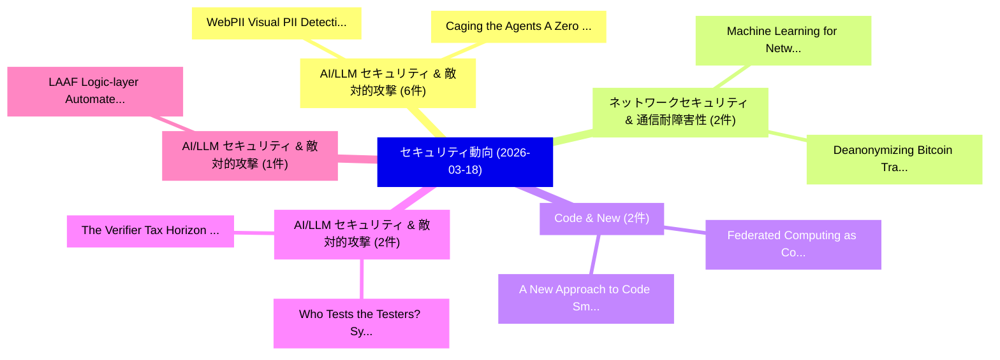

# 📅 02_daily: 日次エグゼクティブサマリー報告書 (2026-03-18)

**集計日時**: 2026-10-02 23:06:01 UTC  
**対象日付**: 2026-03-18  
**本日収集論文数**: 32 件  

---

## 💡 主要セキュリティ動向・脅威インサイト (Executive Insights)

本日の収集論文（計 32 件）において、以下の重点セキュリティ領域で活発な研究動向が確認されました：
- **AI/LLM セキュリティ & 敵対的攻撃** (6 件): 注目論文として 「WebPII: Visual PII Detection f...」、「Caging the Agents: A Zero Trus...」 等が発表され、実務防御および攻撃検証の進展が見られます。
- **ネットワークセキュリティ & 通信耐障害性** (2 件): 注目論文として 「Deanonymizing Bitcoin Transact...」、「Machine Learning for Network A...」 等が発表され、実務防御および攻撃検証の進展が見られます。
- **Code & New** (2 件): 注目論文として 「Federated Computing as Code (F...」、「A New Approach to Code Smoothi...」 等が発表され、実務防御および攻撃検証の進展が見られます。
- **AI/LLM セキュリティ & 敵対的攻撃** (2 件): 注目論文として 「Who Tests the Testers? Systema...」、「The Verifier Tax: Horizon Depe...」 等が発表され、実務防御および攻撃検証の進展が見られます。
- **AI/LLM セキュリティ & 敵対的攻撃** (1 件): 注目論文として 「LAAF: Logic-layer Automated At...」 等が発表され、実務防御および攻撃検証の進展が見られます。

### 🗺️ 技術・脅威トピックマインドマップ

---

## 📌 日次セキュリティ論文一覧 (日本語表形式)

| No | arXiv ID | 論文タイトル (日本語訳) | 重要キーワード | 構造化エグゼクティブ要約 (背景・提案・影響) | 脅威分類 | 詳細リンク |
|---|---|---|---|---|---|---|
| 1 | `2603.17239v1` | [LAAF: Logic-layer Automated Attack Framework A Systematic Red-Teaming Methodology for LPCI Vulnerabilities in Agentic Large Language Model Systems（セキュリティ分析論文）](../../okf/papers/2026-03-18/2603.17239.md) | `Agentic Large Language Model Systems`, `Systematic Red`, `Teaming Methodology` | 【提案】概要 (Overview & Key Finding) 本論文「LAAF: Logic-layer Automated Attack Framework A Systemat...。実証評価により経営層・セキュリティ管理者向け推奨アクション (E... | `cybersecurity` | [arXiv](https://arxiv.org/abs/2603.17239v1) &#124; [OKF](../../okf/papers/2026-03-18/2603.17239.md) |
| 2 | `2603.17261v1` | [Deanonymizing Bitcoin Transactions via Network Traffic Analysis with Semi-supervised Learning（セキュリティ分析論文）](../../okf/papers/2026-03-18/2603.17261.md) | `Deanonymizing Bitcoin Transactions`, `Semi-supervised Learning`, `Shihan Zhang` | 【提案】概要 (Overview & Key Finding) 本論文「Deanonymizing Bitcoin Transactions via Network Traffic ...。実証評価により経営層・セキュリティ管理者向け推奨アクション (E... | `cybersecurity` | [arXiv](https://arxiv.org/abs/2603.17261v1) &#124; [OKF](../../okf/papers/2026-03-18/2603.17261.md) |
| 3 | `2603.17266v1` | [Revisiting Vulnerability Patch Identification on Data in the Wild（セキュリティ分析論文）](../../okf/papers/2026-03-18/2603.17266.md) | `Revisiting Vulnerability Patch Identification`, `Ivana Clairine Irsan`, `Lwin Khin Shar` | 【提案】概要 (Overview & Key Finding) 本論文「Revisiting 脆弱性 Patch Identification on Data in the Wild...。実証評価により経営層・セキュリティ管理者向け推奨アクション (E... | `executive-summary` | [arXiv](https://arxiv.org/abs/2603.17266v1) &#124; [OKF](../../okf/papers/2026-03-18/2603.17266.md) |
| 4 | `2603.17272v2` | [Network and Device Level Cyber Deception for Contested Environments Using RL and LLMs（セキュリティ分析論文）](../../okf/papers/2026-03-18/2603.17272.md) | `Device Level Cyber Deception`, `Contested Environments Using`, `Abhijeet Sahu` | 【提案】概要 (Overview & Key Finding) 本論文「Network and Device Level Cyber Deception for Contested ...。実証評価により経営層・セキュリティ管理者向け推奨アクション (E... | `cs.ET` | [arXiv](https://arxiv.org/abs/2603.17272v2) &#124; [OKF](../../okf/papers/2026-03-18/2603.17272.md) |
| 5 | `2603.17292v1` | [SEAL-Tag: Self-Tag Evidence Aggregation with Probabilistic Circuits for PII-Safe Retrieval-Augmented Generation（セキュリティ分析論文）](../../okf/papers/2026-03-18/2603.17292.md) | `Tag Evidence Aggregation`, `Probabilistic Circuits`, `Self-Tag Evidence` | 【提案】概要 (Overview & Key Finding) 本論文「SEAL-Tag: Self-Tag Evidence Aggregation with Probabilis...。実証評価により経営層・セキュリティ管理者向け推奨アクション (E... | `cybersecurity` | [arXiv](https://arxiv.org/abs/2603.17292v1) &#124; [OKF](../../okf/papers/2026-03-18/2603.17292.md) |
| 6 | `2603.17331v1` | [Federated Computing as Code (FCaC): Sovereignty-aware Systems by Design（セキュリティ分析論文）](../../okf/papers/2026-03-18/2603.17331.md) | `Federated Computing`, `Sovereignty-aware Systems`, `Enzo Fenoglio` | 【提案】概要 (Overview & Key Finding) 本論文「Federated Computing as Code (FCaC): Sovereignty-aware S...。実証評価により経営層・セキュリティ管理者向け推奨アクション (E... | `cybersecurity` | [arXiv](https://arxiv.org/abs/2603.17331v1) &#124; [OKF](../../okf/papers/2026-03-18/2603.17331.md) |
| 7 | `2603.17357v1` | [WebPII: Visual PII Detection for Computer-Use Agentsのベンチマーク評価](../../okf/papers/2026-03-18/2603.17357.md) | `Benchmarking Visual`, `Use Agents`, `Computer-Use Agents` | 【提案】概要 (Overview & Key Finding) 本論文「WebPII: Visual PII Detection for Computer-Use Agentsのベン...。実証評価により経営層・セキュリティ管理者向け推奨アクション (E... | `cs.AI` | [arXiv](https://arxiv.org/abs/2603.17357v1) &#124; [OKF](../../okf/papers/2026-03-18/2603.17357.md) |
| 8 | `2603.17419v1` | [Caging the Agents: A Zero Trust Security Architecture for Autonomous AI in Healthcare（セキュリティ分析論文）](../../okf/papers/2026-03-18/2603.17419.md) | `Zero Trust Security Architecture`, `Saikat Maiti`, `Raw Meta` | 【提案】概要 (Overview & Key Finding) 本論文「Caging the Agents: A ゼロトラスト Security Architecture for A...。実証評価により経営層・セキュリティ管理者向け推奨アクション (E... | `cs.AI` | [arXiv](https://arxiv.org/abs/2603.17419v1) &#124; [OKF](../../okf/papers/2026-03-18/2603.17419.md) |
| 9 | `2603.17453v1` | [DDH-based schemes for multi-party Function Secret Sharing（セキュリティ分析論文）](../../okf/papers/2026-03-18/2603.17453.md) | `Function Secret Sharing`, `DDH-based schemes`, `multi-party Function` | 【提案】概要 (Overview & Key Finding) 本論文「DDH-based schemes for multi-party Function Secret Shari...。実証評価により経営層・セキュリティ管理者向け推奨アクション (E... | `cybersecurity` | [arXiv](https://arxiv.org/abs/2603.17453v1) &#124; [OKF](../../okf/papers/2026-03-18/2603.17453.md) |
| 10 | `2603.17513v1` | [Proof-of-Authorship for Diffusion-based AI Generated Content（セキュリティ分析論文）](../../okf/papers/2026-03-18/2603.17513.md) | `Generated Content`, `Diffusion-based AI`, `De Zhang Lee` | 【提案】概要 (Overview & Key Finding) 本論文「Proof-of-Authorship for Diffusion-based AI Generated Co...。実証評価により経営層・セキュリティ管理者向け推奨アクション (E... | `cybersecurity` | [arXiv](https://arxiv.org/abs/2603.17513v1) &#124; [OKF](../../okf/papers/2026-03-18/2603.17513.md) |
| 11 | `2603.17531v2` | [Rel-Zero: Harnessing Patch-Pair Invariance for Robust Zero-Watermarking Against AI Editing（セキュリティ分析論文）](../../okf/papers/2026-03-18/2603.17531.md) | `Harnessing Patch`, `Pair Invariance`, `Robust Zero` | 【提案】概要 (Overview & Key Finding) 本論文「Rel-Zero: Harnessing Patch-Pair Invariance for Robust Z...。実証評価により経営層・セキュリティ管理者向け推奨アクション (E... | `cs.AI` | [arXiv](https://arxiv.org/abs/2603.17531v2) &#124; [OKF](../../okf/papers/2026-03-18/2603.17531.md) |
| 12 | `2603.17623v1` | [ARES: Scalable and Practical Gradient Inversion Attack in 連合学習 through Activation Recovery](../../okf/papers/2026-03-18/2603.17623.md) | `Practical Gradient Inversion Attack`, `Activation Recovery`, `Federated Learning` | 【提案】概要 (Overview & Key Finding) 本論文「ARES: Scalable and Practical Gradient Inversion Attack ...。実証評価により経営層・セキュリティ管理者向け推奨アクション (E... | `executive-summary` | [arXiv](https://arxiv.org/abs/2603.17623v1) &#124; [OKF](../../okf/papers/2026-03-18/2603.17623.md) |
| 13 | `2603.17673v2` | [Reliable Local Security Agents: Verifiable Post-Training for Linux Privilege Escalationに向けて](../../okf/papers/2026-03-18/2603.17673.md) | `Verifiable Post`, `Towards Reliable Local Security Agents`, `Reliable Local Security Agents` | 【提案】概要 (Overview & Key Finding) 本論文「Reliable Local Security Agents: Verifiable Post-Trainin...。実証評価により経営層・セキュリティ管理者向け推奨アクション (E... | `cs.AI` | [arXiv](https://arxiv.org/abs/2603.17673v2) &#124; [OKF](../../okf/papers/2026-03-18/2603.17673.md) |
| 14 | `2603.17717v4` | [Machine Learning for Network Attacks Classification and Statistical Evaluation of Adversarial Learning Methodologies for Synthetic Data Generation（セキュリティ分析論文）](../../okf/papers/2026-03-18/2603.17717.md) | `Network Attacks Classification`, `Adversarial Learning Methodologies`, `Synthetic Data Generation` | 【提案】概要 (Overview & Key Finding) 本論文「Machine Learning for Network Attacks Classification and...。実証評価により経営層・セキュリティ管理者向け推奨アクション (E... | `cs.AI` | [arXiv](https://arxiv.org/abs/2603.17717v4) &#124; [OKF](../../okf/papers/2026-03-18/2603.17717.md) |
| 15 | `2603.17725v1` | [Data Obfuscation for Secure Use of Classical Values in Quantum Computation（セキュリティ分析論文）](../../okf/papers/2026-03-18/2603.17725.md) | `Data Obfuscation`, `Secure Use`, `Classical Values` | 【提案】概要 (Overview & Key Finding) 本論文「Data Obfuscation for Secure Use of Classical Values in ...。実証評価により経営層・セキュリティ管理者向け推奨アクション (E... | `cybersecurity` | [arXiv](https://arxiv.org/abs/2603.17725v1) &#124; [OKF](../../okf/papers/2026-03-18/2603.17725.md) |
| 16 | `2603.17757v1` | [On the Software Development Lifecycle in IoT RISC-V Trusted Execution Environmentsのセキュリティ強化](../../okf/papers/2026-03-18/2603.17757.md) | `Software Development Lifecycle`, `RISC-V Trusted`, `Trusted Execution` | 【提案】概要 (Overview & Key Finding) 本論文「On the Software Development Lifecycle in IoT RISC-V Tru...。実証評価により経営層・セキュリティ管理者向け推奨アクション (E... | `cybersecurity` | [arXiv](https://arxiv.org/abs/2603.17757v1) &#124; [OKF](../../okf/papers/2026-03-18/2603.17757.md) |
| 17 | `2603.17883v2` | [SoK: From Silicon to Netlist and Beyond $-$ Two Decades of Hardware Reverse Engineering Research（セキュリティ分析論文）](../../okf/papers/2026-03-18/2603.17883.md) | `Hardware Reverse Engineering Research`, `Two Decades`, `Software Security` | 【提案】概要 (Overview & Key Finding) 本論文「SoK: From Silicon to Netlist and Beyond $-$ Two Decades...。実証評価により経営層・セキュリティ管理者向け推奨アクション (E... | `Software Security` | [arXiv](https://arxiv.org/abs/2603.17883v2) &#124; [OKF](../../okf/papers/2026-03-18/2603.17883.md) |
| 18 | `2603.17902v1` | [Differential Privacy in Generative AI Agents: Analysis and Optimal Tradeoffs（セキュリティ分析論文）](../../okf/papers/2026-03-18/2603.17902.md) | `Differential Privacy`, `Optimal Tradeoffs`, `Ting Yang` | 【提案】概要 (Overview & Key Finding) 本論文「差分プライバシー in Generative AI Agents: Analysis and Optimal ...。実証評価により経営層・セキュリティ管理者向け推奨アクション (E... | `cs.AI` | [arXiv](https://arxiv.org/abs/2603.17902v1) &#124; [OKF](../../okf/papers/2026-03-18/2603.17902.md) |
| 19 | `2603.18059v1` | [Guardrails as Infrastructure: Policy-First Control for Tool-Orchestrated Workflows（セキュリティ分析論文）](../../okf/papers/2026-03-18/2603.18059.md) | `First Control`, `Orchestrated Workflows`, `Policy-First Control` | 【提案】概要 (Overview & Key Finding) 本論文「Guardrails as Infrastructure: Policy-First Control for ...。実証評価により経営層・セキュリティ管理者向け推奨アクション (E... | `executive-summary` | [arXiv](https://arxiv.org/abs/2603.18059v1) &#124; [OKF](../../okf/papers/2026-03-18/2603.18059.md) |
| 20 | `2603.18063v1` | [MCP-38: A Comprehensive Threat Taxonomy for Model Context Protocol Systems (v1.0)（セキュリティ分析論文）](../../okf/papers/2026-03-18/2603.18063.md) | `Model Context Protocol Systems`, `Comprehensive Threat Taxonomy`, `Yi Ting Shen` | 【提案】概要 (Overview & Key Finding) 本論文「MCP-38: A Comprehensive 脅威 Taxonomy for Model Context P...。実証評価により経営層・セキュリティ管理者向け推奨アクション (E... | `cs.AI` | [arXiv](https://arxiv.org/abs/2603.18063v1) &#124; [OKF](../../okf/papers/2026-03-18/2603.18063.md) |
| 21 | `2603.18071v4` | [Engineering Lessons from Authorized YouTube-to-Blockchain Content Replication at Scale（セキュリティ分析論文）](../../okf/papers/2026-03-18/2603.18071.md) | `Blockchain Content Replication`, `Engineering Lessons`, `Muhammad Zeeshan Akram` | 【提案】概要 (Overview & Key Finding) 本論文「Engineering Lessons from Authorized YouTube-to-Blockcha...。実証評価により経営層・セキュリティ管理者向け推奨アクション (E... | `executive-summary` | [arXiv](https://arxiv.org/abs/2603.18071v4) &#124; [OKF](../../okf/papers/2026-03-18/2603.18071.md) |
| 22 | `2603.18077v3` | [A New Approach to Code Smoothing Bounds（セキュリティ分析論文）](../../okf/papers/2026-03-18/2603.18077.md) | `Code Smoothing Bounds`, `Tsuyoshi Miezaki`, `Yusaku Nishimura` | 【提案】概要 (Overview & Key Finding) 本論文「A New Approach to Code Smoothing Bounds（セキュリティ分析論文）」（原題...。実証評価により経営層・セキュリティ管理者向け推奨アクション (E... | `executive-summary` | [arXiv](https://arxiv.org/abs/2603.18077v3) &#124; [OKF](../../okf/papers/2026-03-18/2603.18077.md) |
| 23 | `2603.18097v1` | [One Key Good, L Keys Better: List Decoding Meets Quantum Privacy Amplification（セキュリティ分析論文）](../../okf/papers/2026-03-18/2603.18097.md) | `List Decoding Meets Quantum Privacy Amplification`, `One Key Good`, `Keys Better` | 【提案】概要 (Overview & Key Finding) 本論文「One Key Good, L Keys Better: List Decoding Meets 量子 Pri...。実証評価により経営層・セキュリティ管理者向け推奨アクション (E... | `executive-summary` | [arXiv](https://arxiv.org/abs/2603.18097v1) &#124; [OKF](../../okf/papers/2026-03-18/2603.18097.md) |
| 24 | `2603.18103v1` | [STEP: Detecting Audio Backdoor Attacks via Stability-based Trigger Exposure Profiling（セキュリティ分析論文）](../../okf/papers/2026-03-18/2603.18103.md) | `Detecting Audio Backdoor Attacks`, `Trigger Exposure Profiling`, `Stability-based Trigger` | 【提案】概要 (Overview & Key Finding) 本論文「STEP: Detecting Audio Backdoor Attacks via Stability-ba...。実証評価により経営層・セキュリティ管理者向け推奨アクション (E... | `executive-summary` | [arXiv](https://arxiv.org/abs/2603.18103v1) &#124; [OKF](../../okf/papers/2026-03-18/2603.18103.md) |
| 25 | `2603.18105v1` | [Adaptive Fuzzy Logic-Based Steganographic Encryption Framework: A Comprehensive Experimental Evaluation（セキュリティ分析論文）](../../okf/papers/2026-03-18/2603.18105.md) | `Adaptive Fuzzy Logic`, `Logic-Based Steganographic`, `Aadi Joshi` | 【提案】概要 (Overview & Key Finding) 本論文「Adaptive Fuzzy Logic-Based Steganographic Encryption Fr...。実証評価により経営層・セキュリティ管理者向け推奨アクション (E... | `cybersecurity` | [arXiv](https://arxiv.org/abs/2603.18105v1) &#124; [OKF](../../okf/papers/2026-03-18/2603.18105.md) |
| 26 | `2603.18120v1` | [MAED: Mathematical Activation Error Detection for Mitigating Physical Fault Attacks in DNN Inference（セキュリティ分析論文）](../../okf/papers/2026-03-18/2603.18120.md) | `Mathematical Activation Error Detection`, `Mitigating Physical Fault Attacks`, `Mehran Mozaffari Kermani` | 【提案】概要 (Overview & Key Finding) 本論文「MAED: Mathematical Activation Error Detection for Mitig...。実証評価により経営層・セキュリティ管理者向け推奨アクション (E... | `executive-summary` | [arXiv](https://arxiv.org/abs/2603.18120v1) &#124; [OKF](../../okf/papers/2026-03-18/2603.18120.md) |
| 27 | `2603.18196v3` | [Retrieval-Augmented LLMs for Security Incident Analysis（セキュリティ分析論文）](../../okf/papers/2026-03-18/2603.18196.md) | `Retrieval-Augmented LLMs`, `Aditya Vikram Singh`, `Dirk Van Bruggen` | 【提案】概要 (Overview & Key Finding) 本論文「Retrieval-Augmented LLMs for Security Incident Analysis...。実証評価により経営層・セキュリティ管理者向け推奨アクション (E... | `cs.AI` | [arXiv](https://arxiv.org/abs/2603.18196v3) &#124; [OKF](../../okf/papers/2026-03-18/2603.18196.md) |
| 28 | `2603.18197v1` | [Access Controlled Website Interaction for Agentic AI with Delegated Critical Tasks（セキュリティ分析論文）](../../okf/papers/2026-03-18/2603.18197.md) | `Access Controlled Website Interaction`, `Delegated Critical Tasks`, `Sunyoung Kim` | 【提案】概要 (Overview & Key Finding) 本論文「アクセス制御led Website Interaction for Agentic AI with Deleg...。実証評価により経営層・セキュリティ管理者向け推奨アクション (E... | `cs.NI` | [arXiv](https://arxiv.org/abs/2603.18197v1) &#124; [OKF](../../okf/papers/2026-03-18/2603.18197.md) |
| 29 | `2603.18235v1` | [Toward Reliable, Safe, and Secure LLMs for Scientific Applications（セキュリティ分析論文）](../../okf/papers/2026-03-18/2603.18235.md) | `Toward Reliable`, `Scientific Applications`, `Saket Sanjeev Chaturvedi` | 【提案】概要 (Overview & Key Finding) 本論文「Toward Reliable, Safe, and Secure LLMs for Scientific A...。実証評価により経営層・セキュリティ管理者向け推奨アクション (E... | `cs.CV` | [arXiv](https://arxiv.org/abs/2603.18235v1) &#124; [OKF](../../okf/papers/2026-03-18/2603.18235.md) |
| 30 | `2603.18245v2` | [Who Tests the Testers? Systematic Enumeration and Coverage Audit of LLM Agent Tool Call Safety（セキュリティ分析論文）](../../okf/papers/2026-03-18/2603.18245.md) | `Agent Tool Call Safety`, `Systematic Enumeration`, `Coverage Audit` | 【提案】Systematic Enumeration and Coverage Audit of LLM Agent Tool Call Safety ### (日本語題名: Who...。実証評価により経営層・セキュリティ管理者向け推奨アクション (E... | `AI/ML Security` | [arXiv](https://arxiv.org/abs/2603.18245v2) &#124; [OKF](../../okf/papers/2026-03-18/2603.18245.md) |
| 31 | `2603.18355v1` | [Pushan: Trace-Free Deobfuscation of Virtualization-Obfuscated Binaries（セキュリティ分析論文）](../../okf/papers/2026-03-18/2603.18355.md) | `Free Deobfuscation`, `Trace-Free Deobfuscation`, `Obfuscated Binaries` | 【提案】概要 (Overview & Key Finding) 本論文「Pushan: Trace-Free Deobfuscation of Virtualization-Obfu...。実証評価により経営層・セキュリティ管理者向け推奨アクション (E... | `cybersecurity` | [arXiv](https://arxiv.org/abs/2603.18355v1) &#124; [OKF](../../okf/papers/2026-03-18/2603.18355.md) |
| 32 | `2603.19328v1` | [The Verifier Tax: Horizon Dependent Safety Success Tradeoffs in Tool Using LLMエージェント](../../okf/papers/2026-03-18/2603.19328.md) | `Horizon Dependent Safety Success Tradeoffs`, `Tool Using`, `Tanmay Sah` | 【提案】概要 (Overview & Key Finding) 本論文「The Verifier Tax: Horizon Dependent Safety Success Trad...。実証評価により経営層・セキュリティ管理者向け推奨アクション (E... | `cybersecurity` | [arXiv](https://arxiv.org/abs/2603.19328v1) &#124; [OKF](../../okf/papers/2026-03-18/2603.19328.md) |

