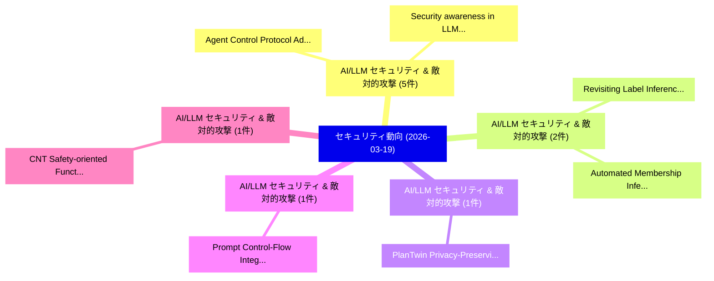

# 📅 02_daily: 日次エグゼクティブサマリー報告書 (2026-03-19)

**集計日時**: 2026-10-02 23:06:02 UTC  
**対象日付**: 2026-03-19  
**本日収集論文数**: 35 件  

---

## 💡 主要セキュリティ動向・脅威インサイト (Executive Insights)

本日の収集論文（計 35 件）において、以下の重点セキュリティ領域で活発な研究動向が確認されました：
- **AI/LLM セキュリティ & 敵対的攻撃** (5 件): 注目論文として 「Agent Control Protocol: Admiss...」、「Security awareness in LLMエージェン...」 等が発表され、実務防御および攻撃検証の進展が見られます。
- **AI/LLM セキュリティ & 敵対的攻撃** (2 件): 注目論文として 「Revisiting Label Inference Att...」、「Automated Membership Inference...」 等が発表され、実務防御および攻撃検証の進展が見られます。
- **AI/LLM セキュリティ & 敵対的攻撃** (1 件): 注目論文として 「PlanTwin: Privacy-Preserving P...」 等が発表され、実務防御および攻撃検証の進展が見られます。
- **AI/LLM セキュリティ & 敵対的攻撃** (1 件): 注目論文として 「Prompt Control-Flow Integrity:...」 等が発表され、実務防御および攻撃検証の進展が見られます。
- **AI/LLM セキュリティ & 敵対的攻撃** (1 件): 注目論文として 「CNT: Safety-oriented Function ...」 等が発表され、実務防御および攻撃検証の進展が見られます。

### 🗺️ 技術・脅威トピックマインドマップ

---

## 📌 日次セキュリティ論文一覧 (日本語表形式)

| No | arXiv ID | 論文タイトル (日本語訳) | 重要キーワード | 構造化エグゼクティブ要約 (背景・提案・影響) | 脅威分類 | 詳細リンク |
|---|---|---|---|---|---|---|
| 1 | `2603.18377v2` | [PlanTwin: Privacy-Preserving Planning Abstractions for Cloud-Assisted LLMエージェント](../../okf/papers/2026-03-19/2603.18377.md) | `Preserving Planning Abstractions`, `Privacy-Preserving Planning`, `Cloud-Assisted LLM` | 【提案】概要 (Overview & Key Finding) 本論文「PlanTwin: Privacy-Preserving Planning Abstractions for ...。実証評価により経営層・セキュリティ管理者向け推奨アクション (E... | `cs.ET` | [arXiv](https://arxiv.org/abs/2603.18377v2) &#124; [OKF](../../okf/papers/2026-03-19/2603.18377.md) |
| 2 | `2603.18433v1` | [Prompt Control-Flow Integrity: A Priority-Aware Runtime Defense Against Prompt Injection in LLM Systems（セキュリティ分析論文）](../../okf/papers/2026-03-19/2603.18433.md) | `Prompt Control`, `Flow Integrity`, `Control-Flow Integrity` | 【提案】概要 (Overview & Key Finding) 本論文「Prompt Control-Flow Integrity: A Priority-Aware Runtime...。実証評価により経営層・セキュリティ管理者向け推奨アクション (E... | `cybersecurity` | [arXiv](https://arxiv.org/abs/2603.18433v1) &#124; [OKF](../../okf/papers/2026-03-19/2603.18433.md) |
| 3 | `2603.18449v1` | [CNT: Safety-oriented Function Reuse across LLMs via Cross-Model Neuron Transfer（セキュリティ分析論文）](../../okf/papers/2026-03-19/2603.18449.md) | `Model Neuron Transfer`, `Function Reuse`, `Safety-oriented Function` | 【提案】概要 (Overview & Key Finding) 本論文「CNT: Safety-oriented Function Reuse across LLMs via Cro...。実証評価により経営層・セキュリティ管理者向け推奨アクション (E... | `executive-summary` | [arXiv](https://arxiv.org/abs/2603.18449v1) &#124; [OKF](../../okf/papers/2026-03-19/2603.18449.md) |
| 4 | `2603.18455v1` | [Impact of Differentials in SIMON32 Algorithm for Lightweight Security of Internet of Things（セキュリティ分析論文）](../../okf/papers/2026-03-19/2603.18455.md) | `Lightweight Security`, `Jonathan Cook`, `Arif Khan` | 【提案】概要 (Overview & Key Finding) 本論文「Impact of Differentials in SIMON32 Algorithm for Lightw...。実証評価により経営層・セキュリティ管理者向け推奨アクション (E... | `cybersecurity` | [arXiv](https://arxiv.org/abs/2603.18455v1) &#124; [OKF](../../okf/papers/2026-03-19/2603.18455.md) |
| 5 | `2603.18549v1` | [Quantifying Memory Cells Vulnerability for DRAM Security（セキュリティ分析論文）](../../okf/papers/2026-03-19/2603.18549.md) | `Quantifying Memory Cells Vulnerability`, `Zilong Hu`, `Hongming Fei` | 【提案】概要 (Overview & Key Finding) 本論文「Quantifying Memory Cells 脆弱性 for DRAM Security（セキュリティ分析...。実証評価により経営層・セキュリティ管理者向け推奨アクション (E... | `cybersecurity` | [arXiv](https://arxiv.org/abs/2603.18549v1) &#124; [OKF](../../okf/papers/2026-03-19/2603.18549.md) |
| 6 | `2603.18570v1` | [Attack by Unlearning: Unlearning-Induced Graph Neural Networksに対する敵対的攻撃](../../okf/papers/2026-03-19/2603.18570.md) | `Induced Adversarial Attacks`, `Graph Neural Networks`, `Induced Graph Neural` | 【提案】概要 (Overview & Key Finding) 本論文「Attack by Unlearning: Unlearning-Induced Graph Neural N...。実証評価により経営層・セキュリティ管理者向け推奨アクション (E... | `executive-summary` | [arXiv](https://arxiv.org/abs/2603.18570v1) &#124; [OKF](../../okf/papers/2026-03-19/2603.18570.md) |
| 7 | `2603.18608v2` | [A Complexity Hierarchy of Shuffles in Card-Based Protocols（セキュリティ分析論文）](../../okf/papers/2026-03-19/2603.18608.md) | `Complexity Hierarchy`, `Based Protocols`, `Card-Based Protocols` | 【提案】概要 (Overview & Key Finding) 本論文「A Complexity Hierarchy of Shuffles in Card-Based Protoc...。実証評価により経営層・セキュリティ管理者向け推奨アクション (E... | `cybersecurity` | [arXiv](https://arxiv.org/abs/2603.18608v2) &#124; [OKF](../../okf/papers/2026-03-19/2603.18608.md) |
| 8 | `2603.18613v1` | [Cyber-Resilient Digital Twins: Discriminating Attacks for Safe Critical Infrastructure Control（セキュリティ分析論文）](../../okf/papers/2026-03-19/2603.18613.md) | `Safe Critical Infrastructure Control`, `Resilient Digital Twins`, `Discriminating Attacks` | 【提案】概要 (Overview & Key Finding) 本論文「Cyber-Resilient Digital Twins: Discriminating Attacks f...。実証評価により経営層・セキュリティ管理者向け推奨アクション (E... | `executive-summary` | [arXiv](https://arxiv.org/abs/2603.18613v1) &#124; [OKF](../../okf/papers/2026-03-19/2603.18613.md) |
| 9 | `2603.18637v1` | [MOSAIC: Multi-Objective Slice-Aware Iterative Curation for Alignment（セキュリティ分析論文）](../../okf/papers/2026-03-19/2603.18637.md) | `Aware Iterative Curation`, `Objective Slice`, `Multi-Objective Slice` | 【提案】概要 (Overview & Key Finding) 本論文「MOSAIC: Multi-Objective Slice-Aware Iterative Curation ...。実証評価により経営層・セキュリティ管理者向け推奨アクション (E... | `executive-summary` | [arXiv](https://arxiv.org/abs/2603.18637v1) &#124; [OKF](../../okf/papers/2026-03-19/2603.18637.md) |
| 10 | `2603.18647v1` | [Beyond TVLA: Anderson-Darling Leakage Assessment for Neural Network Side-Channel Leakage Detection（セキュリティ分析論文）](../../okf/papers/2026-03-19/2603.18647.md) | `Darling Leakage Assessment`, `Neural Network Side`, `Channel Leakage Detection` | 【提案】概要 (Overview & Key Finding) 本論文「Beyond TVLA: Anderson-Darling Leakage Assessment for Ne...。実証評価により経営層・セキュリティ管理者向け推奨アクション (E... | `cs.AI` | [arXiv](https://arxiv.org/abs/2603.18647v1) &#124; [OKF](../../okf/papers/2026-03-19/2603.18647.md) |
| 11 | `2603.18680v1` | [Revisiting Label Inference Attacks in Vertical 連合学習: Why They Are Vulnerable and How to Defend](../../okf/papers/2026-03-19/2603.18680.md) | `Revisiting Label Inference Attacks`, `Vertical Federated Learning`, `Revisiting Label Infere` | 【提案】概要 (Overview & Key Finding) 本論文「Revisiting Label Inference Attacks in Vertical 連合学習: Wh...。実証評価により経営層・セキュリティ管理者向け推奨アクション (E... | `executive-summary` | [arXiv](https://arxiv.org/abs/2603.18680v1) &#124; [OKF](../../okf/papers/2026-03-19/2603.18680.md) |
| 12 | `2603.18687v1` | [Secure Wi-Fi Ranging Today: Security and Adoption of IEEE 802.11az/bk（セキュリティ分析論文）](../../okf/papers/2026-03-19/2603.18687.md) | `Fi Ranging Today`, `Secure Wi`, `Wi-Fi Ranging` | 【提案】概要 (Overview & Key Finding) 本論文「Secure Wi-Fi Ranging Today: Security and Adoption of IE...。実証評価により経営層・セキュリティ管理者向け推奨アクション (E... | `cybersecurity` | [arXiv](https://arxiv.org/abs/2603.18687v1) &#124; [OKF](../../okf/papers/2026-03-19/2603.18687.md) |
| 13 | `2603.18693v2` | [Cross-Ecosystem Vulnerability Analysis for Python Applications（セキュリティ分析論文）](../../okf/papers/2026-03-19/2603.18693.md) | `Python Applications`, `Cross-Ecosystem Vulnerability`, `Georgios Alexopoulos` | 【提案】概要 (Overview & Key Finding) 本論文「Cross-Ecosystem 脆弱性 Analysis for Python Applications（セキ...。実証評価により経営層・セキュリティ管理者向け推奨アクション (E... | `executive-summary` | [arXiv](https://arxiv.org/abs/2603.18693v2) &#124; [OKF](../../okf/papers/2026-03-19/2603.18693.md) |
| 14 | `2603.18740v2` | [Measuring and Exploiting Contextual Bias in LLM-Assisted Security Code Review（セキュリティ分析論文）](../../okf/papers/2026-03-19/2603.18740.md) | `Assisted Security Code Review`, `Exploiting Contextual Bias`, `LLM-Assisted Security` | 【提案】概要 (Overview & Key Finding) 本論文「Measuring and Exploiting Contextual Bias in LLM-Assiste...。実証評価により経営層・セキュリティ管理者向け推奨アクション (E... | `cs.AI` | [arXiv](https://arxiv.org/abs/2603.18740v2) &#124; [OKF](../../okf/papers/2026-03-19/2603.18740.md) |
| 15 | `2603.18762v1` | [ClawTrap: A MITM-Based Red-Teaming Framework for Real-World OpenClaw Security Evaluation（セキュリティ分析論文）](../../okf/papers/2026-03-19/2603.18762.md) | `Based Red`, `MITM-Based Red`, `Real-World OpenClaw` | 【提案】概要 (Overview & Key Finding) 本論文「ClawTrap: A MITM-Based Red-Teaming Framework for Real-W...。実証評価により経営層・セキュリティ管理者向け推奨アクション (E... | `cs.AI` | [arXiv](https://arxiv.org/abs/2603.18762v1) &#124; [OKF](../../okf/papers/2026-03-19/2603.18762.md) |
| 16 | `2603.18779v3` | [SoK: Practical Aspects of Releasing Differentially Private Graphs（セキュリティ分析論文）](../../okf/papers/2026-03-19/2603.18779.md) | `Releasing Differentially Private Graphs`, `Practical Aspects`, `Surya Nepal` | 【提案】概要 (Overview & Key Finding) 本論文「SoK: Practical Aspects of Releasing Differentially Priv...。実証評価によりKanhere - **公開日時**: `2026... | `executive-summary` | [arXiv](https://arxiv.org/abs/2603.18779v3) &#124; [OKF](../../okf/papers/2026-03-19/2603.18779.md) |
| 17 | `2603.18789v1` | [Weaver: Fuzzing JavaScript Engines at the JavaScript-WebAssembly Boundary（セキュリティ分析論文）](../../okf/papers/2026-03-19/2603.18789.md) | `JavaScript-WebAssembly Boundary`, `Lingming Zhang`, `Binbin Zhao` | 【提案】概要 (Overview & Key Finding) 本論文「Weaver: Fuzzing JavaScript Engines at the JavaScript-We...。実証評価により経営層・セキュリティ管理者向け推奨アクション (E... | `cybersecurity` | [arXiv](https://arxiv.org/abs/2603.18789v1) &#124; [OKF](../../okf/papers/2026-03-19/2603.18789.md) |
| 18 | `2603.18793v1` | [Functional Subspace Watermarking for 大規模言語モデル](../../okf/papers/2026-03-19/2603.18793.md) | `Functional Subspace Watermarking`, `Large Language Models`, `Zikang Ding` | 【提案】概要 (Overview & Key Finding) 本論文「Functional Subspace Watermarking for 大規模言語モデル」（原題: Func...。実証評価により経営層・セキュリティ管理者向け推奨アクション (E... | `cs.AI` | [arXiv](https://arxiv.org/abs/2603.18793v1) &#124; [OKF](../../okf/papers/2026-03-19/2603.18793.md) |
| 19 | `2603.18829v10` | [Agent Control Protocol: Admission Control for Agent Actions（セキュリティ分析論文）](../../okf/papers/2026-03-19/2603.18829.md) | `Agent Control Protocol`, `Admission Control`, `Agent Actions` | 【提案】概要 (Overview & Key Finding) 本論文「Agent Control Protocol: Admission Control for Agent Act...。実証評価により経営層・セキュリティ管理者向け推奨アクション (E... | `cs.AI` | [arXiv](https://arxiv.org/abs/2603.18829v10) &#124; [OKF](../../okf/papers/2026-03-19/2603.18829.md) |
| 20 | `2603.18836v3` | [Accelerating Confidential Databases with Crypto-free Mappings（セキュリティ分析論文）](../../okf/papers/2026-03-19/2603.18836.md) | `Accelerating Confidential Databases`, `Crypto-free Mappings`, `Wenxuan Huang` | 【提案】概要 (Overview & Key Finding) 本論文「Accelerating Confidential Databases with Crypto-free Ma...。実証評価により経営層・セキュリティ管理者向け推奨アクション (E... | `cs.DB` | [arXiv](https://arxiv.org/abs/2603.18836v3) &#124; [OKF](../../okf/papers/2026-03-19/2603.18836.md) |
| 21 | `2603.18914v1` | [Security, privacy, and agentic AI in a regulatory view: From definitions and distinctions to provisions and reflections（セキュリティ分析論文）](../../okf/papers/2026-03-19/2603.18914.md) | `Shiliang Zhang`, `Sabita Maharjan`, `Raw Meta` | 【提案】概要 (Overview & Key Finding) 本論文「Security, privacy, and agentic AI in a regulatory view:...。実証評価により経営層・セキュリティ管理者向け推奨アクション (E... | `cs.AI` | [arXiv](https://arxiv.org/abs/2603.18914v1) &#124; [OKF](../../okf/papers/2026-03-19/2603.18914.md) |
| 22 | `2603.18939v1` | [Controller Datapath Aware Verification of Masked Hardware Generated via High Level Synthesis（セキュリティ分析論文）](../../okf/papers/2026-03-19/2603.18939.md) | `Controller Datapath Aware Verification`, `Masked Hardware Generated`, `High Level Synthesis` | 【提案】概要 (Overview & Key Finding) 本論文「Controller Datapath Aware Verification of Masked Hardwa...。実証評価により経営層・セキュリティ管理者向け推奨アクション (E... | `cybersecurity` | [arXiv](https://arxiv.org/abs/2603.18939v1) &#124; [OKF](../../okf/papers/2026-03-19/2603.18939.md) |
| 23 | `2603.19011v1` | [Security awareness in LLMエージェント: the NDAI zone case](../../okf/papers/2026-03-19/2603.19011.md) | `Enrico Bottazzi`, `Pia Park`, `Raw Meta` | 【提案】概要 (Overview & Key Finding) 本論文「Security awareness in LLMエージェント: the NDAI zone case」（原題...。実証評価により経営層・セキュリティ管理者向け推奨アクション (E... | `cs.AI` | [arXiv](https://arxiv.org/abs/2603.19011v1) &#124; [OKF](../../okf/papers/2026-03-19/2603.19011.md) |
| 24 | `2603.19025v1` | [Verifiable AI with Lightweight Cryptographic Proofs of Inferenceに向けて](../../okf/papers/2026-03-19/2603.19025.md) | `Lightweight Cryptographic Proofs`, `Towards Verifiable`, `Pranay Anchuri` | 【提案】概要 (Overview & Key Finding) 本論文「Verifiable AI with Lightweight Cryptographic Proofs of ...。実証評価により経営層・セキュリティ管理者向け推奨アクション (E... | `executive-summary` | [arXiv](https://arxiv.org/abs/2603.19025v1) &#124; [OKF](../../okf/papers/2026-03-19/2603.19025.md) |
| 25 | `2603.19084v3` | [On The Effectiveness of the UK NIS Regulations as a Mandatory サイバーセキュリティ Reporting Regime](../../okf/papers/2026-03-19/2603.19084.md) | `Mandatory Cybersecurity Reporting Regime`, `Reporting Regime`, `Junade Ali` | 【提案】概要 (Overview & Key Finding) 本論文「On The Effectiveness of the UK NIS Regulations as a Man...。実証評価により経営層・セキュリティ管理者向け推奨アクション (E... | `executive-summary` | [arXiv](https://arxiv.org/abs/2603.19084v3) &#124; [OKF](../../okf/papers/2026-03-19/2603.19084.md) |
| 26 | `2603.19101v1` | [FedTrident: Resilient Road Condition Classification Against Poisoning Attacks in 連合学習](../../okf/papers/2026-03-19/2603.19101.md) | `Federated Learning`, `Sheng Liu`, `Panos Papadimitratos` | 【提案】概要 (Overview & Key Finding) 本論文「FedTrident: Resilient Road Condition Classification Aga...。実証評価により経営層・セキュリティ管理者向け推奨アクション (E... | `cs.AI` | [arXiv](https://arxiv.org/abs/2603.19101v1) &#124; [OKF](../../okf/papers/2026-03-19/2603.19101.md) |
| 27 | `2603.19110v1` | [Post-Quantum Cryptography from Quantum Stabilizer Decoding（セキュリティ分析論文）](../../okf/papers/2026-03-19/2603.19110.md) | `Quantum Stabilizer Decoding`, `Quantum Cryptography`, `Post-Quantum Cryptography` | 【提案】概要 (Overview & Key Finding) 本論文「ポスト量子暗号 from 量子 Stabilizer Decoding（セキュリティ分析論文）」（原題: ポス...。実証評価によりLu, Alexander Poremba, Yi... | `executive-summary` | [arXiv](https://arxiv.org/abs/2603.19110v1) &#124; [OKF](../../okf/papers/2026-03-19/2603.19110.md) |
| 28 | `2603.19138v1` | [Implicit Patterns in LLM-Based Binary Analysis（セキュリティ分析論文）](../../okf/papers/2026-03-19/2603.19138.md) | `Implicit Patterns`, `LLM-Based Binary`, `Qiang Li` | 【提案】概要 (Overview & Key Finding) 本論文「Implicit Patterns in LLM-Based Binary Analysis（セキュリティ分析...。実証評価により経営層・セキュリティ管理者向け推奨アクション (E... | `cs.AI` | [arXiv](https://arxiv.org/abs/2603.19138v1) &#124; [OKF](../../okf/papers/2026-03-19/2603.19138.md) |
| 29 | `2603.19150v2` | [Performance Testing of ChaCha20-Poly1305 for Internet of Things and Industrial Control System Devices（セキュリティ分析論文）](../../okf/papers/2026-03-19/2603.19150.md) | `Industrial Control System Devices`, `Performance Testing`, `Orri Ragnarsson` | 【提案】概要 (Overview & Key Finding) 本論文「Performance Testing of ChaCha20-Poly1305 for Internet o...。実証評価により経営層・セキュリティ管理者向け推奨アクション (E... | `cybersecurity` | [arXiv](https://arxiv.org/abs/2603.19150v2) &#124; [OKF](../../okf/papers/2026-03-19/2603.19150.md) |
| 30 | `2603.19340v6` | [NIST-Standardised ML-KEM and ML-DSA on ARM Cortex-M0+: Latency, Rejection-Sampling Variance, and Memory on the RP2040のベンチマーク評価](../../okf/papers/2026-03-19/2603.19340.md) | `Sampling Variance`, `NIST-Standardised ML`, `Rejection-Sampling Variance` | 【提案】概要 (Overview & Key Finding) 本論文「NIST-Standardised ML-KEM and ML-DSA on ARM Cortex-M0+: ...。実証評価により経営層・セキュリティ管理者向け推奨アクション (E... | `executive-summary` | [arXiv](https://arxiv.org/abs/2603.19340v6) &#124; [OKF](../../okf/papers/2026-03-19/2603.19340.md) |
| 31 | `2603.19350v1` | [A Novel Solution for Zero-Day Attack Detection in IDS using Self-Attention and Jensen-Shannon Divergence in WGAN-GP（セキュリティ分析論文）](../../okf/papers/2026-03-19/2603.19350.md) | `Day Attack Detection`, `Zero-Day Attack`, `Shannon Divergence` | 【提案】概要 (Overview & Key Finding) 本論文「A Novel Solution for Zero-Day Attack Detection in IDS u...。実証評価により経営層・セキュリティ管理者向け推奨アクション (E... | `cs.AI` | [arXiv](https://arxiv.org/abs/2603.19350v1) &#124; [OKF](../../okf/papers/2026-03-19/2603.19350.md) |
| 32 | `2603.19375v1` | [Automated Membership Inference Attacks: Discovering MIA Signal Computations using LLMエージェント](../../okf/papers/2026-03-19/2603.19375.md) | `Automated Membership Inference Attacks`, `Signal Computations`, `Toan Tran` | 【提案】概要 (Overview & Key Finding) 本論文「Automated Membership Inference Attacks: Discovering MIA...。実証評価により経営層・セキュリティ管理者向け推奨アクション (E... | `executive-summary` | [arXiv](https://arxiv.org/abs/2603.19375v1) &#124; [OKF](../../okf/papers/2026-03-19/2603.19375.md) |
| 33 | `2603.19423v2` | [The Autonomy Tax: Defense Training Breaks LLMエージェント](../../okf/papers/2026-03-19/2603.19423.md) | `Defense Training Breaks`, `Shawn Li`, `Yue Zhao` | 【提案】概要 (Overview & Key Finding) 本論文「The Autonomy Tax: Defense Training Breaks LLMエージェント」（原題...。実証評価により経営層・セキュリティ管理者向け推奨アクション (E... | `cs.AI` | [arXiv](https://arxiv.org/abs/2603.19423v2) &#124; [OKF](../../okf/papers/2026-03-19/2603.19423.md) |
| 34 | `2603.19450v1` | [Variational Encrypted Model Predictive Control（セキュリティ分析論文）](../../okf/papers/2026-03-19/2603.19450.md) | `Variational Encrypted Model Predictive Control`, `Jihoon Suh`, `Yeongjun Jang` | 【提案】概要 (Overview & Key Finding) 本論文「Variational Encrypted Model Predictive Control（セキュリティ分析...。実証評価により経営層・セキュリティ管理者向け推奨アクション (E... | `executive-summary` | [arXiv](https://arxiv.org/abs/2603.19450v1) &#124; [OKF](../../okf/papers/2026-03-19/2603.19450.md) |
| 35 | `2603.19469v1` | [A Framework for Formalizing LLM Agent Security（セキュリティ分析論文）](../../okf/papers/2026-03-19/2603.19469.md) | `Agent Security`, `Vincent Siu`, `Kyle Montgomery` | 【提案】概要 (Overview & Key Finding) 本論文「A Framework for Formalizing LLM Agent Security（セキュリティ分析...。実証評価により経営層・セキュリティ管理者向け推奨アクション (E... | `cs.AI` | [arXiv](https://arxiv.org/abs/2603.19469v1) &#124; [OKF](../../okf/papers/2026-03-19/2603.19469.md) |

