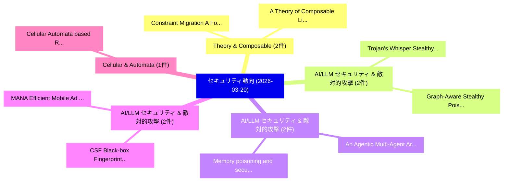

# 📅 02_daily: 日次エグゼクティブサマリー報告書 (2026-03-20)

**集計日時**: 2026-10-02 23:06:02 UTC  
**対象日付**: 2026-03-20  
**本日収集論文数**: 28 件  

---

## 💡 主要セキュリティ動向・脅威インサイト (Executive Insights)

本日の収集論文（計 28 件）において、以下の重点セキュリティ領域で活発な研究動向が確認されました：
- **Theory & Composable** (2 件): 注目論文として 「A Theory of Composable Lingos ...」、「Constraint Migration: A Formal...」 等が発表され、実務防御および攻撃検証の進展が見られます。
- **AI/LLM セキュリティ & 敵対的攻撃** (2 件): 注目論文として 「Trojan's Whisper: Stealthy Man...」、「Graph-Aware Stealthy Poison-Te...」 等が発表され、実務防御および攻撃検証の進展が見られます。
- **AI/LLM セキュリティ & 敵対的攻撃** (2 件): 注目論文として 「An Agentic Multi-Agent Archite...」、「Memory poisoning and secure mu...」 等が発表され、実務防御および攻撃検証の進展が見られます。
- **AI/LLM セキュリティ & 敵対的攻撃** (2 件): 注目論文として 「MANA: Efficient Mobile Ad Dete...」、「CSF: Black-box Fingerprinting ...」 等が発表され、実務防御および攻撃検証の進展が見られます。
- **Cellular & Automata** (1 件): 注目論文として 「Cellular Automata based Resour...」 等が発表され、実務防御および攻撃検証の進展が見られます。

### 🗺️ 技術・脅威トピックマインドマップ

---

## 📌 日次セキュリティ論文一覧 (日本語表形式)

| No | arXiv ID | 論文タイトル (日本語訳) | 重要キーワード | 構造化エグゼクティブ要約 (背景・提案・影響) | 脅威分類 | 詳細リンク |
|---|---|---|---|---|---|---|
| 1 | `2603.19656v1` | [Cellular Automata based Resource Efficient Maximally Equidistributed Pseudo-Random Number Generators（セキュリティ分析論文）](../../okf/papers/2026-03-20/2603.19656.md) | `Resource Efficient Maximally Equidistributed Pseudo`, `Random Number Generators`, `Cellular Automata` | 【提案】概要 (Overview & Key Finding) 本論文「Cellular Automata based Resource Efficient Maximally Eq...。実証評価により経営層・セキュリティ管理者向け推奨アクション (E... | `executive-summary` | [arXiv](https://arxiv.org/abs/2603.19656v1) &#124; [OKF](../../okf/papers/2026-03-20/2603.19656.md) |
| 2 | `2603.19658v1` | [ProHunter: A Comprehensive APT Hunting System Based on Whole-System Provenance（セキュリティ分析論文）](../../okf/papers/2026-03-20/2603.19658.md) | `Hunting System Based`, `System Provenance`, `Whole-System Provenance` | 【提案】概要 (Overview & Key Finding) 本論文「ProHunter: A Comprehensive APT Hunting System Based on ...。実証評価により経営層・セキュリティ管理者向け推奨アクション (E... | `cybersecurity` | [arXiv](https://arxiv.org/abs/2603.19658v1) &#124; [OKF](../../okf/papers/2026-03-20/2603.19658.md) |
| 3 | `2603.19671v1` | [Acyclic Graph Pattern Counting under Local Differential Privacy（セキュリティ分析論文）](../../okf/papers/2026-03-20/2603.19671.md) | `Acyclic Graph Pattern Counting`, `Local Differential Privacy`, `Yihua Hu` | 【提案】概要 (Overview & Key Finding) 本論文「Acyclic Graph Pattern Counting under Local 差分プライバシー（セキュ...。実証評価により経営層・セキュリティ管理者向け推奨アクション (E... | `cs.DB` | [arXiv](https://arxiv.org/abs/2603.19671v1) &#124; [OKF](../../okf/papers/2026-03-20/2603.19671.md) |
| 4 | `2603.19727v2` | [LiteAtt: A Peer-to-Peer Self-Attestation Framework and Handshake Protocol for Connected IoT Devices（セキュリティ分析論文）](../../okf/papers/2026-03-20/2603.19727.md) | `Peer Self`, `Handshake Protocol`, `Varun Kohli` | 【提案】概要 (Overview & Key Finding) 本論文「LiteAtt: A Peer-to-Peer Self-Attestation Framework and ...。実証評価により経営層・セキュリティ管理者向け推奨アクション (E... | `cybersecurity` | [arXiv](https://arxiv.org/abs/2603.19727v2) &#124; [OKF](../../okf/papers/2026-03-20/2603.19727.md) |
| 5 | `2603.19781v1` | [From Precise to Random: A Systematic Differential Fault the Lightweight Block Cipher Lilliputの分析](../../okf/papers/2026-03-20/2603.19781.md) | `Systematic Differential Fault`, `Lightweight Block Cipher`, `Lightweight Block Cipher Lilliput` | 【提案】概要 (Overview & Key Finding) 本論文「From Precise to Random: A Systematic Differential Fault...。実証評価により経営層・セキュリティ管理者向け推奨アクション (E... | `cybersecurity` | [arXiv](https://arxiv.org/abs/2603.19781v1) &#124; [OKF](../../okf/papers/2026-03-20/2603.19781.md) |
| 6 | `2603.19787v1` | [Kumo: A Security-Focused Serverless Cloud Simulator（セキュリティ分析論文）](../../okf/papers/2026-03-20/2603.19787.md) | `Focused Serverless Cloud Simulator`, `Security-Focused Serverless`, `Wei Shao` | 【提案】概要 (Overview & Key Finding) 本論文「Kumo: A Security-Focused Serverless Cloud Simulator（セキュ...。実証評価により経営層・セキュリティ管理者向け推奨アクション (E... | `executive-summary` | [arXiv](https://arxiv.org/abs/2603.19787v1) &#124; [OKF](../../okf/papers/2026-03-20/2603.19787.md) |
| 7 | `2603.19791v2` | [Text-Based Personas for Simulating User Privacy Decisions（セキュリティ分析論文）](../../okf/papers/2026-03-20/2603.19791.md) | `Simulating User Privacy Decisions`, `Based Personas`, `Text-Based Personas` | 【提案】概要 (Overview & Key Finding) 本論文「Text-Based Personas for Simulating User Privacy Decisio...。実証評価により経営層・セキュリティ管理者向け推奨アクション (E... | `cybersecurity` | [arXiv](https://arxiv.org/abs/2603.19791v2) &#124; [OKF](../../okf/papers/2026-03-20/2603.19791.md) |
| 8 | `2603.19811v1` | [Case Study: Horizontal Side-Channel Analysis Attack against Elliptic Curve Scalar Multiplication Accelerator under Laser Illumination（セキュリティ分析論文）](../../okf/papers/2026-03-20/2603.19811.md) | `Elliptic Curve Scalar Multiplication Accelerator`, `Horizontal Side`, `Laser Illumination` | 【提案】概要 (Overview & Key Finding) 本論文「Case Study: Horizontal サイドチャネル攻撃 Analysis Attack agains...。実証評価により経営層・セキュリティ管理者向け推奨アクション (E... | `executive-summary` | [arXiv](https://arxiv.org/abs/2603.19811v1) &#124; [OKF](../../okf/papers/2026-03-20/2603.19811.md) |
| 9 | `2603.19864v2` | [NASimJax: A GPU-Accelerated Policy Learning Framework for Penetration Testing（セキュリティ分析論文）](../../okf/papers/2026-03-20/2603.19864.md) | `Penetration Testing`, `GPU-Accelerated Policy`, `Raphael Simon` | 【提案】概要 (Overview & Key Finding) 本論文「NASimJax: A GPU-Accelerated Policy Learning Framework f...。実証評価により経営層・セキュリティ管理者向け推奨アクション (E... | `executive-summary` | [arXiv](https://arxiv.org/abs/2603.19864v2) &#124; [OKF](../../okf/papers/2026-03-20/2603.19864.md) |
| 10 | `2603.19908v2` | [A Theory of Composable Lingos for Protocol Dialects（セキュリティ分析論文）](../../okf/papers/2026-03-20/2603.19908.md) | `Composable Lingos`, `Protocol Dialects`, `Santiago Escobar` | 【提案】概要 (Overview & Key Finding) 本論文「A Theory of Composable Lingos for Protocol Dialects（セキュ...。実証評価により経営層・セキュリティ管理者向け推奨アクション (E... | `cybersecurity` | [arXiv](https://arxiv.org/abs/2603.19908v2) &#124; [OKF](../../okf/papers/2026-03-20/2603.19908.md) |
| 11 | `2603.19949v1` | [TAPAS: Efficient Two-Server Asymmetric Private Aggregation Beyond Prio(+)（セキュリティ分析論文）](../../okf/papers/2026-03-20/2603.19949.md) | `Server Asymmetric Private Aggregation Beyond Prio`, `Efficient Two`, `Two-Server Asymmetric` | 【提案】概要 (Overview & Key Finding) 本論文「TAPAS: Efficient Two-Server Asymmetric Private Aggregat...。実証評価により経営層・セキュリティ管理者向け推奨アクション (E... | `executive-summary` | [arXiv](https://arxiv.org/abs/2603.19949v1) &#124; [OKF](../../okf/papers/2026-03-20/2603.19949.md) |
| 12 | `2603.19962v1` | [Channel Prediction-Based Physical Layer Authentication under Consecutive Spoofing Attacks（セキュリティ分析論文）](../../okf/papers/2026-03-20/2603.19962.md) | `Based Physical Layer Authentication`, `Consecutive Spoofing Attacks`, `Channel Prediction` | 【提案】概要 (Overview & Key Finding) 本論文「Channel Prediction-Based Physical Layer Authentication ...。実証評価により経営層・セキュリティ管理者向け推奨アクション (E... | `executive-summary` | [arXiv](https://arxiv.org/abs/2603.19962v1) &#124; [OKF](../../okf/papers/2026-03-20/2603.19962.md) |
| 13 | `2603.19974v1` | [Trojan's Whisper: Stealthy Manipulation of OpenClaw through Injected Bootstrapped Guidance（セキュリティ分析論文）](../../okf/papers/2026-03-20/2603.19974.md) | `Injected Bootstrapped Guidance`, `Stealthy Manipulation`, `Fazhong Liu` | 【提案】概要 (Overview & Key Finding) 本論文「Trojan's Whisper: Stealthy Manipulation of OpenClaw thr...。実証評価により経営層・セキュリティ管理者向け推奨アクション (E... | `cs.AI` | [arXiv](https://arxiv.org/abs/2603.19974v1) &#124; [OKF](../../okf/papers/2026-03-20/2603.19974.md) |
| 14 | `2603.20107v1` | [Sharing The Secret: Distributed Privacy-Preserving Monitoring（セキュリティ分析論文）](../../okf/papers/2026-03-20/2603.20107.md) | `Distributed Privacy`, `Preserving Monitoring`, `Privacy-Preserving Monitoring` | 【提案】概要 (Overview & Key Finding) 本論文「Sharing The Secret: Distributed Privacy-Preserving Moni...。実証評価によりHenzinger - **公開。 | `executive-summary` | [arXiv](https://arxiv.org/abs/2603.20107v1) &#124; [OKF](../../okf/papers/2026-03-20/2603.20107.md) |
| 15 | `2603.20108v1` | [Trojan horse hunt in deep forecasting models: Insights from the European Space Agency competition（セキュリティ分析論文）](../../okf/papers/2026-03-20/2603.20108.md) | `European Space Agency`, `Lalit Chandra Routhu`, `Krzysztof Kotowski` | 【提案】概要 (Overview & Key Finding) 本論文「Trojan horse hunt in deep forecasting models: Insights ...。実証評価により経営層・セキュリティ管理者向け推奨アクション (E... | `executive-summary` | [arXiv](https://arxiv.org/abs/2603.20108v1) &#124; [OKF](../../okf/papers/2026-03-20/2603.20108.md) |
| 16 | `2603.20122v1` | [Evolving Jailbreaks: Automated Multi-Objective Long-Tail Attacks on 大規模言語モデル](../../okf/papers/2026-03-20/2603.20122.md) | `Evolving Jailbreaks`, `Automated Multi`, `Objective Long` | 【提案】概要 (Overview & Key Finding) 本論文「Evolving ジェイルブレイクs: Automated Multi-Objective Long-Tail...。実証評価により経営層・セキュリティ管理者向け推奨アクション (E... | `cs.AI` | [arXiv](https://arxiv.org/abs/2603.20122v1) &#124; [OKF](../../okf/papers/2026-03-20/2603.20122.md) |
| 17 | `2603.20131v2` | [An Agentic Multi-Agent Architecture for サイバーセキュリティ Risk Management](../../okf/papers/2026-03-20/2603.20131.md) | `Agent Architecture`, `Multi-Agent Architecture`, `Cybersecurity Risk Management` | 【提案】概要 (Overview & Key Finding) 本論文「An Agentic Multi-Agent Architecture for サイバーセキュリティ Risk...。実証評価により経営層・セキュリティ管理者向け推奨アクション (E... | `cs.AI` | [arXiv](https://arxiv.org/abs/2603.20131v2) &#124; [OKF](../../okf/papers/2026-03-20/2603.20131.md) |
| 18 | `2603.20156v1` | [HQC Post-Quantum Cryptography Decryption with Generalized Minimum-Distance Reed-Solomon Decoder（セキュリティ分析論文）](../../okf/papers/2026-03-20/2603.20156.md) | `Quantum Cryptography Decryption`, `Post-Quantum Cryptography`, `Generalized Minimum` | 【提案】概要 (Overview & Key Finding) 本論文「HQC ポスト量子暗号 Decryption with Generalized Minimum-Distanc...。実証評価により経営層・セキュリティ管理者向け推奨アクション (E... | `executive-summary` | [arXiv](https://arxiv.org/abs/2603.20156v1) &#124; [OKF](../../okf/papers/2026-03-20/2603.20156.md) |
| 19 | `2603.20181v1` | [Improving Generalization on サイバーセキュリティ Tasks with Multi-Modal Contrastive Learning](../../okf/papers/2026-03-20/2603.20181.md) | `Modal Contrastive Learning`, `Improving Generalization`, `Multi-Modal Contrastive` | 【提案】概要 (Overview & Key Finding) 本論文「Improving Generalization on サイバーセキュリティ Tasks with Multi...。実証評価により経営層・セキュリティ管理者向け推奨アクション (E... | `cs.AI` | [arXiv](https://arxiv.org/abs/2603.20181v1) &#124; [OKF](../../okf/papers/2026-03-20/2603.20181.md) |
| 20 | `2603.20339v2` | [Graph-Aware Stealthy Poison-Text Backdoors for Text-Attributed Graphs（セキュリティ分析論文）](../../okf/papers/2026-03-20/2603.20339.md) | `Aware Stealthy Poison`, `Text Backdoors`, `Attributed Graphs` | 【提案】概要 (Overview & Key Finding) 本論文「Graph-Aware Stealthy Poison-Text Backdoors for Text-Att...。実証評価により経営層・セキュリティ管理者向け推奨アクション (E... | `executive-summary` | [arXiv](https://arxiv.org/abs/2603.20339v2) &#124; [OKF](../../okf/papers/2026-03-20/2603.20339.md) |
| 21 | `2603.20347v1` | [Byte-level Object Bounds Protection（セキュリティ分析論文）](../../okf/papers/2026-03-20/2603.20347.md) | `Object Bounds Protection`, `Byte-level Object`, `Piyus Kedia` | 【提案】概要 (Overview & Key Finding) 本論文「Byte-level Object Bounds Protection（セキュリティ分析論文）」（原題: By...。実証評価により経営層・セキュリティ管理者向け推奨アクション (E... | `executive-summary` | [arXiv](https://arxiv.org/abs/2603.20347v1) &#124; [OKF](../../okf/papers/2026-03-20/2603.20347.md) |
| 22 | `2603.20351v1` | [MANA: Efficient Mobile Ad Detection via Multimodal Agentic UI Navigationに向けて](../../okf/papers/2026-03-20/2603.20351.md) | `Multimodal Agentic`, `Towards Efficient Mobile Ad Detection`, `Efficient Mobile Ad Detection` | 【提案】概要 (Overview & Key Finding) 本論文「MANA: Efficient Mobile Ad Detection via Multimodal Agen...。実証評価により経営層・セキュリティ管理者向け推奨アクション (E... | `cs.AI` | [arXiv](https://arxiv.org/abs/2603.20351v1) &#124; [OKF](../../okf/papers/2026-03-20/2603.20351.md) |
| 23 | `2603.20356v1` | [Agentproof: Static Verification of Agent Workflow Graphs（セキュリティ分析論文）](../../okf/papers/2026-03-20/2603.20356.md) | `Agent Workflow Graphs`, `Static Verification`, `Melwin Xavier` | 【提案】概要 (Overview & Key Finding) 本論文「Agentproof: Static Verification of Agent Workflow Graph...。実証評価により経営層・セキュリティ管理者向け推奨アクション (E... | `cs.LO` | [arXiv](https://arxiv.org/abs/2603.20356v1) &#124; [OKF](../../okf/papers/2026-03-20/2603.20356.md) |
| 24 | `2603.20357v1` | [Memory poisoning and secure multi-agent systems（セキュリティ分析論文）](../../okf/papers/2026-03-20/2603.20357.md) | `multi-agent systems`, `Maria Bras`, `Raw Meta` | 【提案】概要 (Overview & Key Finding) 本論文「Memory poisoning and secure multi-agent systems（セキュリティ分...。実証評価により経営層・セキュリティ管理者向け推奨アクション (E... | `cs.AI` | [arXiv](https://arxiv.org/abs/2603.20357v1) &#124; [OKF](../../okf/papers/2026-03-20/2603.20357.md) |
| 25 | `2603.20421v2` | [Hawkeye: Reproducing GPU-Level Non-Determinism（セキュリティ分析論文）](../../okf/papers/2026-03-20/2603.20421.md) | `Level Non`, `GPU-Level Non`, `Erez Badash` | 【提案】概要 (Overview & Key Finding) 本論文「Hawkeye: Reproducing GPU-Level Non-Determinism（セキュリティ分析...。実証評価により経営層・セキュリティ管理者向け推奨アクション (E... | `executive-summary` | [arXiv](https://arxiv.org/abs/2603.20421v2) &#124; [OKF](../../okf/papers/2026-03-20/2603.20421.md) |
| 26 | `2603.20504v1` | [Meeting in the Middle: A Co-Design Paradigm for FHE and AI Inference（セキュリティ分析論文）](../../okf/papers/2026-03-20/2603.20504.md) | `Design Paradigm`, `Co-Design Paradigm`, `Bernardo Magri` | 【提案】概要 (Overview & Key Finding) 本論文「Meeting in the Middle: A Co-Design Paradigm for FHE and...。実証評価により経営層・セキュリティ管理者向け推奨アクション (E... | `cs.AI` | [arXiv](https://arxiv.org/abs/2603.20504v1) &#124; [OKF](../../okf/papers/2026-03-20/2603.20504.md) |
| 27 | `2603.26733v1` | [Constraint Migration: A Formal Theory of Throughput in AI サイバーセキュリティ Pipelines](../../okf/papers/2026-03-20/2603.26733.md) | `Constraint Migration`, `Formal Theory`, `Cybersecurity Pipelines` | 【提案】概要 (Overview & Key Finding) 本論文「Constraint Migration: A Formal Theory of Throughput in ...。実証評価により経営層・セキュリティ管理者向け推奨アクション (E... | `cybersecurity` | [arXiv](https://arxiv.org/abs/2603.26733v1) &#124; [OKF](../../okf/papers/2026-03-20/2603.26733.md) |
| 28 | `2604.16363v1` | [CSF: Black-box Fingerprinting via Compositional Semantics for Text-to-Image Models（セキュリティ分析論文）](../../okf/papers/2026-03-20/2604.16363.md) | `Compositional Semantics`, `Image Models`, `Black-box Fingerprinting` | 【提案】概要 (Overview & Key Finding) 本論文「CSF: Black-box Fingerprinting via Compositional Semanti...。実証評価により経営層・セキュリティ管理者向け推奨アクション (E... | `cs.AI` | [arXiv](https://arxiv.org/abs/2604.16363v1) &#124; [OKF](../../okf/papers/2026-03-20/2604.16363.md) |

