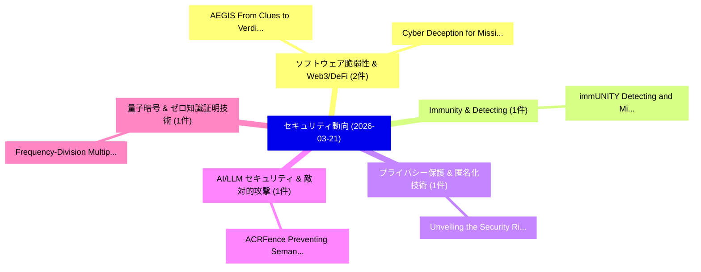

# 📅 02_daily: 日次エグゼクティブサマリー報告書 (2026-03-21)

**集計日時**: 2026-10-02 23:06:02 UTC  
**対象日付**: 2026-03-21  
**本日収集論文数**: 13 件  

---

## 💡 主要セキュリティ動向・脅威インサイト (Executive Insights)

本日の収集論文（計 13 件）において、以下の重点セキュリティ領域で活発な研究動向が確認されました：
- **ソフトウェア脆弱性 & Web3/DeFi** (2 件): 注目論文として 「AEGIS: From Clues to Verdicts ...」、「Cyber Deception for Mission Su...」 等が発表され、実務防御および攻撃検証の進展が見られます。
- **Immunity & Detecting** (1 件): 注目論文として 「immUNITY: Detecting and Mitiga...」 等が発表され、実務防御および攻撃検証の進展が見られます。
- **プライバシー保護 & 匿名化技術** (1 件): 注目論文として 「Unveiling the Security Risks o...」 等が発表され、実務防御および攻撃検証の進展が見られます。
- **AI/LLM セキュリティ & 敵対的攻撃** (1 件): 注目論文として 「ACRFence: Preventing Semantic ...」 等が発表され、実務防御および攻撃検証の進展が見られます。
- **量子暗号 & ゼロ知識証明技術** (1 件): 注目論文として 「Frequency-Division Multiplexed...」 等が発表され、実務防御および攻撃検証の進展が見られます。

### 🗺️ 技術・脅威トピックマインドマップ

---

## 📌 日次セキュリティ論文一覧 (日本語表形式)

| No | arXiv ID | 論文タイトル (日本語訳) | 重要キーワード | 構造化エグゼクティブ要約 (背景・提案・影響) | 脅威分類 | 詳細リンク |
|---|---|---|---|---|---|---|
| 1 | `2603.20573v1` | [immUNITY: Detecting and Mitigating Low Volume & Slow Attacks with Programmable Switches and SmartNICs（セキュリティ分析論文）](../../okf/papers/2026-03-21/2603.20573.md) | `Mitigating Low Volume`, `Slow Attacks`, `Programmable Switches` | 【提案】概要 (Overview & Key Finding) 本論文「immUNITY: Detecting and Mitigating Low Volume & Slow At...。実証評価により経営層・セキュリティ管理者向け推奨アクション (E... | `cs.NI` | [arXiv](https://arxiv.org/abs/2603.20573v1) &#124; [OKF](../../okf/papers/2026-03-21/2603.20573.md) |
| 2 | `2603.20615v1` | [Unveiling the Security Risks of 連合学習 in the Wild: From Research to Practice](../../okf/papers/2026-03-21/2603.20615.md) | `Security Risks`, `Federated Learning`, `Jiahao Chen` | 【提案】概要 (Overview & Key Finding) 本論文「Unveiling the Security Risks of 連合学習 in the Wild: From ...。実証評価により経営層・セキュリティ管理者向け推奨アクション (E... | `cybersecurity` | [arXiv](https://arxiv.org/abs/2603.20615v1) &#124; [OKF](../../okf/papers/2026-03-21/2603.20615.md) |
| 3 | `2603.20625v1` | [ACRFence: Preventing Semantic Rollback Attacks in Agent Checkpoint-Restore（セキュリティ分析論文）](../../okf/papers/2026-03-21/2603.20625.md) | `Preventing Semantic Rollback Attacks`, `Agent Checkpoint`, `Yusheng Zheng` | 【提案】概要 (Overview & Key Finding) 本論文「ACRFence: Preventing Semantic Rollback Attacks in Agent...。実証評価により経営層・セキュリティ管理者向け推奨アクション (E... | `cybersecurity` | [arXiv](https://arxiv.org/abs/2603.20625v1) &#124; [OKF](../../okf/papers/2026-03-21/2603.20625.md) |
| 4 | `2603.20637v1` | [AEGIS: From Clues to Verdicts -- Graph-Guided Deep Vulnerability Reasoning via Dialectics and Meta-Auditing（セキュリティ分析論文）](../../okf/papers/2026-03-21/2603.20637.md) | `Guided Deep Vulnerability Reasoning`, `Graph-Guided Deep`, `Sen Fang` | 【提案】概要 (Overview & Key Finding) 本論文「AEGIS: From Clues to Verdicts -- Graph-Guided Deep 脆弱性 ...。実証評価により経営層・セキュリティ管理者向け推奨アクション (E... | `cs.AI` | [arXiv](https://arxiv.org/abs/2603.20637v1) &#124; [OKF](../../okf/papers/2026-03-21/2603.20637.md) |
| 5 | `2603.20718v3` | [Frequency-Division Multiplexed CV-QKD System（セキュリティ分析論文）](../../okf/papers/2026-03-21/2603.20718.md) | `Division Multiplexed`, `Frequency-Division Multiplexed`, `CV-QKD System` | 【提案】概要 (Overview & Key Finding) 本論文「Frequency-Division Multiplexed CV-QKD System（セキュリティ分析論文...。実証評価により経営層・セキュリティ管理者向け推奨アクション (E... | `executive-summary` | [arXiv](https://arxiv.org/abs/2603.20718v3) &#124; [OKF](../../okf/papers/2026-03-21/2603.20718.md) |
| 6 | `2603.20746v1` | [Locally Private Graph Neural Networksに対する敵対的攻撃](../../okf/papers/2026-03-21/2603.20746.md) | `Locally Private Graph Neural Networks`, `Locally Private Graph Neural`, `Adversarial Attacks` | 【提案】概要 (Overview & Key Finding) 本論文「Locally Private Graph Neural Networksに対する敵対的攻撃」（原題: 敵対的...。実証評価により経営層・セキュリティ管理者向け推奨アクション (E... | `executive-summary` | [arXiv](https://arxiv.org/abs/2603.20746v1) &#124; [OKF](../../okf/papers/2026-03-21/2603.20746.md) |
| 7 | `2603.20769v1` | [ChainGuards: Verification of Sensed Data using Permissioned Blockchain Technology（セキュリティ分析論文）](../../okf/papers/2026-03-21/2603.20769.md) | `Permissioned Blockchain Technology`, `Sensed Data`, `Permissioned Blockchain Tec` | 【提案】概要 (Overview & Key Finding) 本論文「ChainGuards: Verification of Sensed Data using Permissi...。実証評価により経営層・セキュリティ管理者向け推奨アクション (E... | `cs.ET` | [arXiv](https://arxiv.org/abs/2603.20769v1) &#124; [OKF](../../okf/papers/2026-03-21/2603.20769.md) |
| 8 | `2603.20933v1` | [AC4A: Access Control for Agents（セキュリティ分析論文）](../../okf/papers/2026-03-21/2603.20933.md) | `Access Control`, `Dan Grossman`, `Raw Meta` | 【提案】概要 (Overview & Key Finding) 本論文「AC4A: アクセス制御 for Agents（セキュリティ分析論文）」（原題: AC4A: アクセス制御 f...。実証評価により経営層・セキュリティ管理者向け推奨アクション (E... | `cs.PL` | [arXiv](https://arxiv.org/abs/2603.20933v1) &#124; [OKF](../../okf/papers/2026-03-21/2603.20933.md) |
| 9 | `2603.20937v1` | [A chaotic flux cipher based on the random cubic family $f_{c_n}(z)=z^3+c_n z$（セキュリティ分析論文）](../../okf/papers/2026-03-21/2603.20937.md) | `Alexandre Miranda Alves`, `Pouya Mehdipour`, `Gerardo Honorato` | 【提案】概要 (Overview & Key Finding) 本論文「A chaotic flux cipher based on the random cubic family ...。実証評価により経営層・セキュリティ管理者向け推奨アクション (E... | `cybersecurity` | [arXiv](https://arxiv.org/abs/2603.20937v1) &#124; [OKF](../../okf/papers/2026-03-21/2603.20937.md) |
| 10 | `2603.20953v1` | [Before the Tool Call: Deterministic Pre-Action Authorization for Autonomous AI Agents（セキュリティ分析論文）](../../okf/papers/2026-03-21/2603.20953.md) | `Tool Call`, `Deterministic Pre`, `Action Authorization` | 【提案】概要 (Overview & Key Finding) 本論文「Before the Tool Call: Deterministic Pre-Action Authoriz...。実証評価により経営層・セキュリティ管理者向け推奨アクション (E... | `cs.AI` | [arXiv](https://arxiv.org/abs/2603.20953v1) &#124; [OKF](../../okf/papers/2026-03-21/2603.20953.md) |
| 11 | `2603.20968v2` | [Composition Theorems for Multiple Differential Privacy Constraints（セキュリティ分析論文）](../../okf/papers/2026-03-21/2603.20968.md) | `Multiple Differential Privacy Constraints`, `Composition Theorems`, `Cemre Cadir` | 【提案】概要 (Overview & Key Finding) 本論文「Composition Theorems for Multiple 差分プライバシー Constraints（...。実証評価によりShkel - **公開日時**: `2026-0... | `executive-summary` | [arXiv](https://arxiv.org/abs/2603.20968v2) &#124; [OKF](../../okf/papers/2026-03-21/2603.20968.md) |
| 12 | `2603.20981v1` | [Cyber Deception for Mission Surveillance via Hypergame-Theoretic Deep Reinforcement Learning（セキュリティ分析論文）](../../okf/papers/2026-03-21/2603.20981.md) | `Theoretic Deep Reinforcement Learning`, `Cyber Deception`, `Mission Surveillance` | 【提案】概要 (Overview & Key Finding) 本論文「Cyber Deception for Mission Surveillance via Hypergame-...。実証評価により経営層・セキュリティ管理者向け推奨アクション (E... | `cs.AI` | [arXiv](https://arxiv.org/abs/2603.20981v1) &#124; [OKF](../../okf/papers/2026-03-21/2603.20981.md) |
| 13 | `2603.22341v1` | [T-MAP: Red-Teaming LLMエージェント with Trajectory-aware Evolutionary Search](../../okf/papers/2026-03-21/2603.22341.md) | `Evolutionary Search`, `Trajectory-aware Evolutionary`, `Red-Teaming LLM` | 【提案】概要 (Overview & Key Finding) 本論文「T-MAP: Red-Teaming LLMエージェント with Trajectory-aware Evol...。実証評価により経営層・セキュリティ管理者向け推奨アクション (E... | `cs.AI` | [arXiv](https://arxiv.org/abs/2603.22341v1) &#124; [OKF](../../okf/papers/2026-03-21/2603.22341.md) |

