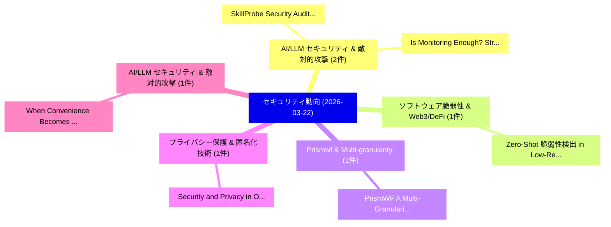

# 📅 02_daily: 日次エグゼクティブサマリー報告書 (2026-03-22)

**集計日時**: 2026-10-02 23:06:02 UTC  
**対象日付**: 2026-03-22  
**本日収集論文数**: 12 件  

---

## 💡 主要セキュリティ動向・脅威インサイト (Executive Insights)

本日の収集論文（計 12 件）において、以下の重点セキュリティ領域で活発な研究動向が確認されました：
- **AI/LLM セキュリティ & 敵対的攻撃** (2 件): 注目論文として 「SkillProbe: Security Auditing ...」、「Is Monitoring Enough? Strategi...」 等が発表され、実務防御および攻撃検証の進展が見られます。
- **ソフトウェア脆弱性 & Web3/DeFi** (1 件): 注目論文として 「Zero-Shot 脆弱性検出 in Low-Resourc...」 等が発表され、実務防御および攻撃検証の進展が見られます。
- **Prismwf & Multi-granularity** (1 件): 注目論文として 「PrismWF: A Multi-Granularity P...」 等が発表され、実務防御および攻撃検証の進展が見られます。
- **プライバシー保護 & 匿名化技術** (1 件): 注目論文として 「Security and Privacy in O-RAN ...」 等が発表され、実務防御および攻撃検証の進展が見られます。
- **AI/LLM セキュリティ & 敵対的攻撃** (1 件): 注目論文として 「When Convenience Becomes Risk:...」 等が発表され、実務防御および攻撃検証の進展が見られます。

### 🗺️ 技術・脅威トピックマインドマップ

---

## 📌 日次セキュリティ論文一覧 (日本語表形式)

| No | arXiv ID | 論文タイトル (日本語訳) | 重要キーワード | 構造化エグゼクティブ要約 (背景・提案・影響) | 脅威分類 | 詳細リンク |
|---|---|---|---|---|---|---|
| 1 | `2603.21019v1` | [SkillProbe: Security Auditing for Emerging Agent Skill Marketplaces via Multi-Agent Collaboration（セキュリティ分析論文）](../../okf/papers/2026-03-22/2603.21019.md) | `Emerging Agent Skill Marketplaces`, `Security Auditing`, `Agent Collaboration` | 【提案】概要 (Overview & Key Finding) 本論文「SkillProbe: Security Auditing for Emerging Agent Skill ...。実証評価により経営層・セキュリティ管理者向け推奨アクション (E... | `executive-summary` | [arXiv](https://arxiv.org/abs/2603.21019v1) &#124; [OKF](../../okf/papers/2026-03-22/2603.21019.md) |
| 2 | `2603.21058v3` | [Zero-Shot 脆弱性検出 in Low-Resource Smart Contracts Through Solidity-Only Training](../../okf/papers/2026-03-22/2603.21058.md) | `Low-Resource Smart`, `Solidity-Only Training`, `Shot Vulnerability Detection` | 【提案】概要 (Overview & Key Finding) 本論文「Zero-Shot 脆弱性検出 in Low-Resource スマートコントラクトs Through Sol...。実証評価により経営層・セキュリティ管理者向け推奨アクション (E... | `executive-summary` | [arXiv](https://arxiv.org/abs/2603.21058v3) &#124; [OKF](../../okf/papers/2026-03-22/2603.21058.md) |
| 3 | `2603.21117v1` | [PrismWF: A Multi-Granularity Patch-Based Transformer for Robust Website Fingerprinting Attack（セキュリティ分析論文）](../../okf/papers/2026-03-22/2603.21117.md) | `Robust Website Fingerprinting Attack`, `Granularity Patch`, `Based Transformer` | 【提案】概要 (Overview & Key Finding) 本論文「PrismWF: A Multi-Granularity Patch-Based Transformer fo...。実証評価により経営層・セキュリティ管理者向け推奨アクション (E... | `cybersecurity` | [arXiv](https://arxiv.org/abs/2603.21117v1) &#124; [OKF](../../okf/papers/2026-03-22/2603.21117.md) |
| 4 | `2603.21194v2` | [Is Monitoring Enough? Strategic Agent Selection For Stealthy Attack in Multi-Agent Discussions（セキュリティ分析論文）](../../okf/papers/2026-03-22/2603.21194.md) | `Agent Discussions`, `Multi-Agent Discussions`, `Qiuchi Xiang` | 【提案】Strategic Agent Selection For Stealthy Attack in Multi-Agent Discussions ### (日本語題名: Is...。実証評価により経営層・セキュリティ管理者向け推奨アクション (E... | `cs.AI` | [arXiv](https://arxiv.org/abs/2603.21194v2) &#124; [OKF](../../okf/papers/2026-03-22/2603.21194.md) |
| 5 | `2603.21211v1` | [Security and Privacy in O-RAN for 6G: A Comprehensive Review of Threats and Mitigation Approaches（セキュリティ分析論文）](../../okf/papers/2026-03-22/2603.21211.md) | `Comprehensive Review`, `Mitigation Approaches`, `Lujia Liang` | 【提案】概要 (Overview & Key Finding) 本論文「Security and Privacy in O-RAN for 6G: A Comprehensive R...。実証評価により経営層・セキュリティ管理者向け推奨アクション (E... | `cs.NI` | [arXiv](https://arxiv.org/abs/2603.21211v1) &#124; [OKF](../../okf/papers/2026-03-22/2603.21211.md) |
| 6 | `2603.21231v1` | [When Convenience Becomes Risk: A Semantic View of Under-Specification in Host-Acting Agents（セキュリティ分析論文）](../../okf/papers/2026-03-22/2603.21231.md) | `Semantic View`, `Acting Agents`, `Host-Acting Agents` | 【提案】概要 (Overview & Key Finding) 本論文「When Convenience Becomes Risk: A Semantic View of Under...。実証評価により経営層・セキュリティ管理者向け推奨アクション (E... | `cs.AI` | [arXiv](https://arxiv.org/abs/2603.21231v1) &#124; [OKF](../../okf/papers/2026-03-22/2603.21231.md) |
| 7 | `2603.21270v1` | [Estimating the Social Cost of Corporate Data Breaches（セキュリティ分析論文）](../../okf/papers/2026-03-22/2603.21270.md) | `Corporate Data Breaches`, `Social Cost`, `Lina Alkarmi` | 【提案】概要 (Overview & Key Finding) 本論文「Estimating the Social Cost of Corporate Data Breaches（セ...。実証評価により経営層・セキュリティ管理者向け推奨アクション (E... | `executive-summary` | [arXiv](https://arxiv.org/abs/2603.21270v1) &#124; [OKF](../../okf/papers/2026-03-22/2603.21270.md) |
| 8 | `2603.21294v2` | [Hardware Trojans from Invisible Inversions: On the Trojanizability of Standard Cell Libraries（セキュリティ分析論文）](../../okf/papers/2026-03-22/2603.21294.md) | `Standard Cell Libraries`, `Hardware Trojans`, `Invisible Inversions` | 【提案】概要 (Overview & Key Finding) 本論文「Hardware Trojans from Invisible Inversions: On the Troj...。実証評価により経営層・セキュリティ管理者向け推奨アクション (E... | `cybersecurity` | [arXiv](https://arxiv.org/abs/2603.21294v2) &#124; [OKF](../../okf/papers/2026-03-22/2603.21294.md) |
| 9 | `2603.21296v3` | [DeepXplain: XAI-Guided Autonomous Defense Against Multi-Stage APT Campaigns（セキュリティ分析論文）](../../okf/papers/2026-03-22/2603.21296.md) | `XAI-Guided Autonomous`, `Multi-Stage APT`, `Thomas Bauschert` | 【提案】概要 (Overview & Key Finding) 本論文「DeepXplain: XAI-Guided Autonomous Defense Against Multi...。実証評価によりPhan, Thomas。 | `cs.AI` | [arXiv](https://arxiv.org/abs/2603.21296v3) &#124; [OKF](../../okf/papers/2026-03-22/2603.21296.md) |
| 10 | `2603.21411v1` | [Fingerprinting Deep Neural Networks for Ownership Protection: An Analytical Approach（セキュリティ分析論文）](../../okf/papers/2026-03-22/2603.21411.md) | `Fingerprinting Deep Neural Networks`, `Ownership Protection`, `Guang Yang` | 【提案】概要 (Overview & Key Finding) 本論文「Fingerprinting Deep Neural Networks for Ownership Prote...。実証評価により経営層・セキュリティ管理者向け推奨アクション (E... | `cs.AI` | [arXiv](https://arxiv.org/abs/2603.21411v1) &#124; [OKF](../../okf/papers/2026-03-22/2603.21411.md) |
| 11 | `2603.21415v1` | [Silent Commitment Failure in Instruction-Tuned Language Models: Evidence of Governability Divergence Across Architectures（セキュリティ分析論文）](../../okf/papers/2026-03-22/2603.21415.md) | `Silent Commitment Failure`, `Governability Divergence Across Architectures`, `Tuned Language Models` | 【提案】概要 (Overview & Key Finding) 本論文「Silent Commitment Failure in Instruction-Tuned Language...。実証評価により経営層・セキュリティ管理者向け推奨アクション (E... | `cs.AI` | [arXiv](https://arxiv.org/abs/2603.21415v1) &#124; [OKF](../../okf/papers/2026-03-22/2603.21415.md) |
| 12 | `2603.22350v1` | [Session Risk Memory (SRM): Temporal Authorization for Deterministic Pre-Execution Safety Gates（セキュリティ分析論文）](../../okf/papers/2026-03-22/2603.22350.md) | `Session Risk Memory`, `Execution Safety Gates`, `Temporal Authorization` | 【提案】概要 (Overview & Key Finding) 本論文「Session Risk Memory (SRM): Temporal Authorization for D...。実証評価により経営層・セキュリティ管理者向け推奨アクション (E... | `cs.AI` | [arXiv](https://arxiv.org/abs/2603.22350v1) &#124; [OKF](../../okf/papers/2026-03-22/2603.22350.md) |

