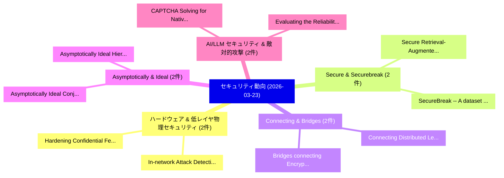

# 📅 02_daily: 日次エグゼクティブサマリー報告書 (2026-03-23)

**集計日時**: 2026-10-02 23:06:02 UTC  
**対象日付**: 2026-03-23  
**本日収集論文数**: 35 件  

---

## 💡 主要セキュリティ動向・脅威インサイト (Executive Insights)

本日の収集論文（計 35 件）において、以下の重点セキュリティ領域で活発な研究動向が確認されました：
- **ハードウェア & 低レイヤ物理セキュリティ** (2 件): 注目論文として 「Hardening Confidential Federat...」、「In-network Attack Detection wi...」 等が発表され、実務防御および攻撃検証の進展が見られます。
- **Secure & Securebreak** (2 件): 注目論文として 「Secure Retrieval-Augmented Gen...」、「SecureBreak -- A dataset safe ...」 等が発表され、実務防御および攻撃検証の進展が見られます。
- **Connecting & Bridges** (2 件): 注目論文として 「Bridges connecting Encryption ...」、「Connecting Distributed Ledgers...」 等が発表され、実務防御および攻撃検証の進展が見られます。
- **Asymptotically & Ideal** (2 件): 注目論文として 「Asymptotically Ideal Conjuncti...」、「Asymptotically Ideal Hierarchi...」 等が発表され、実務防御および攻撃検証の進展が見られます。
- **AI/LLM セキュリティ & 敵対的攻撃** (2 件): 注目論文として 「Evaluating the Reliability and...」、「CAPTCHA Solving for Native GUI...」 等が発表され、実務防御および攻撃検証の進展が見られます。

### 🗺️ 技術・脅威トピックマインドマップ

---

## 📌 日次セキュリティ論文一覧 (日本語表形式)

| No | arXiv ID | 論文タイトル (日本語訳) | 重要キーワード | 構造化エグゼクティブ要約 (背景・提案・影響) | 脅威分類 | 詳細リンク |
|---|---|---|---|---|---|---|
| 1 | `2603.21469v1` | [Hardening Confidential Federated Compute against Side-channel Attacks（セキュリティ分析論文）](../../okf/papers/2026-03-23/2603.21469.md) | `Hardening Confidential Federated Compute`, `Side-channel Attacks`, `James Bell` | 【提案】概要 (Overview & Key Finding) 本論文「Hardening Confidential Federated Compute against サイドチャネ...。実証評価により経営層・セキュリティ管理者向け推奨アクション (E... | `executive-summary` | [arXiv](https://arxiv.org/abs/2603.21469v1) &#124; [OKF](../../okf/papers/2026-03-23/2603.21469.md) |
| 2 | `2603.21515v1` | [When the Abyss Looks Back: Unveiling Evolving Dark Patterns in Cookie Consent Banners（セキュリティ分析論文）](../../okf/papers/2026-03-23/2603.21515.md) | `Unveiling Evolving Dark Patterns`, `Abyss Looks Back`, `Cookie Consent Banners` | 【提案】概要 (Overview & Key Finding) 本論文「When the Abyss Looks Back: Unveiling Evolving Dark Patt...。実証評価により経営層・セキュリティ管理者向け推奨アクション (E... | `cybersecurity` | [arXiv](https://arxiv.org/abs/2603.21515v1) &#124; [OKF](../../okf/papers/2026-03-23/2603.21515.md) |
| 3 | `2603.21556v1` | [A Survey of Web Application Security Tutorials（セキュリティ分析論文）](../../okf/papers/2026-03-23/2603.21556.md) | `Web Application Security Tutorials`, `Bhagya Chembakottu`, `Raw Meta` | 【提案】概要 (Overview & Key Finding) 本論文「A Survey of Web Application Security Tutorials（セキュリティ分析...。実証評価によりRobillard - **公開日時**: `20... | `executive-summary` | [arXiv](https://arxiv.org/abs/2603.21556v1) &#124; [OKF](../../okf/papers/2026-03-23/2603.21556.md) |
| 4 | `2603.21596v1` | [In-network Attack Detection with Federated Deep Learning in IoT Networks: Real Implementation and Analysis（セキュリティ分析論文）](../../okf/papers/2026-03-23/2603.21596.md) | `Federated Deep Learning`, `Attack Detection`, `In-network Attack` | 【提案】概要 (Overview & Key Finding) 本論文「In-network Attack Detection with Federated Deep Learnin...。実証評価により経営層・セキュリティ管理者向け推奨アクション (E... | `executive-summary` | [arXiv](https://arxiv.org/abs/2603.21596v1) &#124; [OKF](../../okf/papers/2026-03-23/2603.21596.md) |
| 5 | `2603.21641v1` | [Auditing MCP Servers for Over-Privileged Tool Capabilities（セキュリティ分析論文）](../../okf/papers/2026-03-23/2603.21641.md) | `Privileged Tool Capabilities`, `Over-Privileged Tool`, `Amin Milani Fard` | 【提案】概要 (Overview & Key Finding) 本論文「Auditing MCP Servers for Over-Privileged Tool Capabilit...。実証評価により経営層・セキュリティ管理者向け推奨アクション (E... | `executive-summary` | [arXiv](https://arxiv.org/abs/2603.21641v1) &#124; [OKF](../../okf/papers/2026-03-23/2603.21641.md) |
| 6 | `2603.21642v1` | [Are AI-assisted Development Tools Immune to Prompt Injection?（セキュリティ分析論文）](../../okf/papers/2026-03-23/2603.21642.md) | `Development Tools Immune`, `Prompt Injection`, `AI-assisted Development` | 【提案】### (日本語題名: Are AI-assisted Development Tools Immune to プロンプトインジェクション?（セキュリティ分析論文）)  > ...。実証評価により経営層・セキュリティ管理者向け推奨アクション (E... | `executive-summary` | [arXiv](https://arxiv.org/abs/2603.21642v1) &#124; [OKF](../../okf/papers/2026-03-23/2603.21642.md) |
| 7 | `2603.21652v2` | [TLS Certificate and Domain Feature Phishing Domains in the Danish .dk Namespaceの分析](../../okf/papers/2026-03-23/2603.21652.md) | `Domain Feature Phishing Domains`, `Phishing Domains`, `Epameinondas Bolis` | 【提案】概要 (Overview & Key Finding) 本論文「TLS Certificate and Domain Feature Phishing Domains in ...。実証評価により経営層・セキュリティ管理者向け推奨アクション (E... | `cybersecurity` | [arXiv](https://arxiv.org/abs/2603.21652v2) &#124; [OKF](../../okf/papers/2026-03-23/2603.21652.md) |
| 8 | `2603.21654v1` | [Secure Retrieval-Augmented Generation: A Comprehensive Review of Threats, Defenses and Benchmarksに向けて](../../okf/papers/2026-03-23/2603.21654.md) | `Augmented Generation`, `Comprehensive Review`, `Retrieval-Augmented Generation` | 【提案】概要 (Overview & Key Finding) 本論文「Secure Retrieval-Augmented Generation: A Comprehensive ...。実証評価により経営層・セキュリティ管理者向け推奨アクション (E... | `cs.AI` | [arXiv](https://arxiv.org/abs/2603.21654v1) &#124; [OKF](../../okf/papers/2026-03-23/2603.21654.md) |
| 9 | `2603.21694v1` | [Bridges connecting Encryption Schemes（セキュリティ分析論文）](../../okf/papers/2026-03-23/2603.21694.md) | `Encryption Schemes`, `Mugurel Barcau`, `Cristian Lupascu` | 【提案】概要 (Overview & Key Finding) 本論文「Bridges connecting Encryption Schemes（セキュリティ分析論文）」（原題: ...。実証評価によりTurcas - **公開日時**: `2026-... | `cybersecurity` | [arXiv](https://arxiv.org/abs/2603.21694v1) &#124; [OKF](../../okf/papers/2026-03-23/2603.21694.md) |
| 10 | `2603.21697v2` | [Structured Visual Narratives Undermine Safety Alignment in Multimodal 大規模言語モデル](../../okf/papers/2026-03-23/2603.21697.md) | `Structured Visual Narratives Undermine Safety Alignment`, `Multimodal Large Language Models`, `Rui Yang Tan` | 【提案】概要 (Overview & Key Finding) 本論文「Structured Visual Narratives Undermine Safety Alignment...。実証評価により経営層・セキュリティ管理者向け推奨アクション (E... | `cs.AI` | [arXiv](https://arxiv.org/abs/2603.21697v2) &#124; [OKF](../../okf/papers/2026-03-23/2603.21697.md) |
| 11 | `2603.21703v1` | [サイバーセキュリティ Guidance for Smart Homes: A Cross-National Review of Government Sources](../../okf/papers/2026-03-23/2603.21703.md) | `Smart Homes`, `National Review`, `Government Sources` | 【提案】概要 (Overview & Key Finding) 本論文「サイバーセキュリティ Guidance for Smart Homes: A Cross-National R...。実証評価により経営層・セキュリティ管理者向け推奨アクション (E... | `executive-summary` | [arXiv](https://arxiv.org/abs/2603.21703v1) &#124; [OKF](../../okf/papers/2026-03-23/2603.21703.md) |
| 12 | `2603.21797v1` | [Connecting Distributed Ledgers: Surveying Novel Interoperability Solutions in On-chain Finance（セキュリティ分析論文）](../../okf/papers/2026-03-23/2603.21797.md) | `Connecting Distributed Ledgers`, `On-chain Finance`, `Hasret Ozan Sevim` | 【提案】概要 (Overview & Key Finding) 本論文「Connecting Distributed Ledgers: Surveying Novel Interop...。実証評価により経営層・セキュリティ管理者向け推奨アクション (E... | `cs.ET` | [arXiv](https://arxiv.org/abs/2603.21797v1) &#124; [OKF](../../okf/papers/2026-03-23/2603.21797.md) |
| 13 | `2603.21833v1` | [Publicly Understandable Electronic Voting: A Non-Cryptographic, End-to-End Verifiable Scheme（セキュリティ分析論文）](../../okf/papers/2026-03-23/2603.21833.md) | `Publicly Understandable Electronic Voting`, `End Verifiable Scheme`, `Alon Gat` | 【提案】概要 (Overview & Key Finding) 本論文「Publicly Understandable Electronic Voting: A Non-Crypto...。実証評価により経営層・セキュリティ管理者向け推奨アクション (E... | `cybersecurity` | [arXiv](https://arxiv.org/abs/2603.21833v1) &#124; [OKF](../../okf/papers/2026-03-23/2603.21833.md) |
| 14 | `2603.21894v1` | [Albank -- a case study on the use of ethereum blockchain technology and smart contracts for secure decentralized bank application（セキュリティ分析論文）](../../okf/papers/2026-03-23/2603.21894.md) | `Shkelqim Sherifi`, `Raw Meta`, `Executive Summary` | 【提案】概要 (Overview & Key Finding) 本論文「Albank -- a case study on the use of ethereum blockchai...。実証評価により経営層・セキュリティ管理者向け推奨アクション (E... | `executive-summary` | [arXiv](https://arxiv.org/abs/2603.21894v1) &#124; [OKF](../../okf/papers/2026-03-23/2603.21894.md) |
| 15 | `2603.21975v1` | [SecureBreak -- A dataset safe and secure modelsに向けて](../../okf/papers/2026-03-23/2603.21975.md) | `Vignesh Kumar Kembu`, `Marco Arazzi`, `Antonino Nocera` | 【提案】概要 (Overview & Key Finding) 本論文「SecureBreak -- A dataset safe and secure modelsに向けて」（原題...。実証評価により経営層・セキュリティ管理者向け推奨アクション (E... | `cs.AI` | [arXiv](https://arxiv.org/abs/2603.21975v1) &#124; [OKF](../../okf/papers/2026-03-23/2603.21975.md) |
| 16 | `2603.22001v1` | [Asymptotically Ideal Conjunctive Hierarchical Secret Sharing Scheme Based on CRT for Polynomial Ring（セキュリティ分析論文）](../../okf/papers/2026-03-23/2603.22001.md) | `Asymptotically Ideal Conjunctive Hierarchical Secret Sharing Scheme Based`, `Polynomial Ring`, `Jian Ding` | 【提案】概要 (Overview & Key Finding) 本論文「Asymptotically Ideal Conjunctive Hierarchical Secret Sh...。実証評価により経営層・セキュリティ管理者向け推奨アクション (E... | `executive-summary` | [arXiv](https://arxiv.org/abs/2603.22001v1) &#124; [OKF](../../okf/papers/2026-03-23/2603.22001.md) |
| 17 | `2603.22011v2` | [Asymptotically Ideal Hierarchical Secret Sharing Based on CRT for Integer Ring（セキュリティ分析論文）](../../okf/papers/2026-03-23/2603.22011.md) | `Asymptotically Ideal Hierarchical Secret Sharing Based`, `Integer Ring`, `Jian Ding` | 【提案】概要 (Overview & Key Finding) 本論文「Asymptotically Ideal Hierarchical Secret Sharing Based ...。実証評価により経営層・セキュリティ管理者向け推奨アクション (E... | `executive-summary` | [arXiv](https://arxiv.org/abs/2603.22011v2) &#124; [OKF](../../okf/papers/2026-03-23/2603.22011.md) |
| 18 | `2603.22109v5` | [TALUS: FIPS-204-Exact Threshold ML-DSA via Boundary Clearance（セキュリティ分析論文）](../../okf/papers/2026-03-23/2603.22109.md) | `Exact Threshold`, `Boundary Clearance`, `ML-DSA via` | 【提案】概要 (Overview & Key Finding) 本論文「TALUS: FIPS-204-Exact Threshold ML-DSA via Boundary Cle...。実証評価により経営層・セキュリティ管理者向け推奨アクション (E... | `cybersecurity` | [arXiv](https://arxiv.org/abs/2603.22109v5) &#124; [OKF](../../okf/papers/2026-03-23/2603.22109.md) |
| 19 | `2603.22191v1` | [Framework for Risk-Based IoT サイバーセキュリティ Audit Engagements](../../okf/papers/2026-03-23/2603.22191.md) | `Risk-Based IoT`, `Cybersecurity Audit Engagements`, `Audit Engagements` | 【提案】概要 (Overview & Key Finding) 本論文「Framework for Risk-Based IoT サイバーセキュリティ Audit Engagemen...。実証評価により経営層・セキュリティ管理者向け推奨アクション (E... | `cybersecurity` | [arXiv](https://arxiv.org/abs/2603.22191v1) &#124; [OKF](../../okf/papers/2026-03-23/2603.22191.md) |
| 20 | `2603.22214v1` | [Evaluating the Reliability and Fidelity of Automated Judgment Systems of 大規模言語モデル](../../okf/papers/2026-03-23/2603.22214.md) | `Automated Judgment Systems`, `Large Language Models`, `Tom Biskupski` | 【提案】概要 (Overview & Key Finding) 本論文「Evaluating the Reliability and Fidelity of Automated Ju...。実証評価により経営層・セキュリティ管理者向け推奨アクション (E... | `cs.AI` | [arXiv](https://arxiv.org/abs/2603.22214v1) &#124; [OKF](../../okf/papers/2026-03-23/2603.22214.md) |
| 21 | `2603.22365v1` | [Q-AGNN: Quantum-Enhanced Attentive Graph Neural Network for Intrusion Detection（セキュリティ分析論文）](../../okf/papers/2026-03-23/2603.22365.md) | `Enhanced Attentive Graph Neural Network`, `Intrusion Detection`, `Quantum-Enhanced Attentive` | 【提案】概要 (Overview & Key Finding) 本論文「Q-AGNN: 量子-Enhanced Attentive Graph Neural Network for ...。実証評価により経営層・セキュリティ管理者向け推奨アクション (E... | `cs.AI` | [arXiv](https://arxiv.org/abs/2603.22365v1) &#124; [OKF](../../okf/papers/2026-03-23/2603.22365.md) |
| 22 | `2603.22437v1` | [mmFHE: mmWave Sensing with End-to-End Fully Homomorphic Encryption（セキュリティ分析論文）](../../okf/papers/2026-03-23/2603.22437.md) | `End Fully Homomorphic Encryption`, `Tanvir Ahmed`, `Yixuan Gao` | 【提案】概要 (Overview & Key Finding) 本論文「mmFHE: mmWave Sensing with End-to-End Fully 準同型暗号（セキュリテ...。実証評価により経営層・セキュリティ管理者向け推奨アクション (E... | `executive-summary` | [arXiv](https://arxiv.org/abs/2603.22437v1) &#124; [OKF](../../okf/papers/2026-03-23/2603.22437.md) |
| 23 | `2603.22442v2` | [Architecture-Derived CBOMs for Cryptographic Migration: A Security-Aware Architecture Tradeoff Method（セキュリティ分析論文）](../../okf/papers/2026-03-23/2603.22442.md) | `Cryptographic Migration`, `Architecture-Derived CBOMs`, `Security-Aware Architecture` | 【提案】概要 (Overview & Key Finding) 本論文「Architecture-Derived CBOMs for Cryptographic Migration:...。実証評価により経営層・セキュリティ管理者向け推奨アクション (E... | `executive-summary` | [arXiv](https://arxiv.org/abs/2603.22442v2) &#124; [OKF](../../okf/papers/2026-03-23/2603.22442.md) |
| 24 | `2603.22489v1` | [Model Context Protocol Threat Modeling and Analyzing Vulnerabilities to Prompt Injection with Tool Poisoning（セキュリティ分析論文）](../../okf/papers/2026-03-23/2603.22489.md) | `Model Context Protocol Threat Modeling`, `Analyzing Vulnerabilities`, `Prompt Injection` | 【提案】概要 (Overview & Key Finding) 本論文「Model Context Protocol 脅威 Modeling and Analyzing Vulner...。実証評価により経営層・セキュリティ管理者向け推奨アクション (E... | `executive-summary` | [arXiv](https://arxiv.org/abs/2603.22489v1) &#124; [OKF](../../okf/papers/2026-03-23/2603.22489.md) |
| 25 | `2603.22499v1` | [OrgForge-IT: A Verifiable Synthetic Benchmark for LLM-Based Insider Threat Detection（セキュリティ分析論文）](../../okf/papers/2026-03-23/2603.22499.md) | `Based Insider Threat Detection`, `Verifiable Synthetic Benchmark`, `LLM-Based Insider` | 【提案】概要 (Overview & Key Finding) 本論文「OrgForge-IT: A Verifiable Synthetic Benchmark for LLM-B...。実証評価により経営層・セキュリティ管理者向け推奨アクション (E... | `executive-summary` | [arXiv](https://arxiv.org/abs/2603.22499v1) &#124; [OKF](../../okf/papers/2026-03-23/2603.22499.md) |
| 26 | `2603.22511v3` | [CTF as a Service: A reproducible and scalable infrastructure for サイバーセキュリティ training](../../okf/papers/2026-03-23/2603.22511.md) | `Carlos Jimeno Miguel`, `Mikel Izal`, `Raw Meta` | 【提案】概要 (Overview & Key Finding) 本論文「CTF as a Service: A reproducible and scalable infrastru...。実証評価により経営層・セキュリティ管理者向け推奨アクション (E... | `cybersecurity` | [arXiv](https://arxiv.org/abs/2603.22511v3) &#124; [OKF](../../okf/papers/2026-03-23/2603.22511.md) |
| 27 | `2603.22525v1` | [Adversarial Vulnerabilities in Neural Operator Digital Twins: Gradient-Free Attacks on Nuclear Thermal-Hydraulic Surrogates（セキュリティ分析論文）](../../okf/papers/2026-03-23/2603.22525.md) | `Neural Operator Digital Twins`, `Adversarial Vulnerabilities`, `Free Attacks` | 【提案】概要 (Overview & Key Finding) 本論文「Adversarial Vulnerabilities in Neural Operator Digital ...。実証評価により経営層・セキュリティ管理者向け推奨アクション (E... | `executive-summary` | [arXiv](https://arxiv.org/abs/2603.22525v1) &#124; [OKF](../../okf/papers/2026-03-23/2603.22525.md) |
| 28 | `2603.22577v1` | [STRIATUM-CTF: A Protocol-Driven Agentic Framework for General-Purpose CTF Solving（セキュリティ分析論文）](../../okf/papers/2026-03-23/2603.22577.md) | `Protocol-Driven Agentic`, `General-Purpose CTF`, `Samuel Jacob Chacko` | 【提案】概要 (Overview & Key Finding) 本論文「STRIATUM-CTF: A Protocol-Driven Agentic Framework for G...。実証評価により経営層・セキュリティ管理者向け推奨アクション (E... | `cs.AI` | [arXiv](https://arxiv.org/abs/2603.22577v1) &#124; [OKF](../../okf/papers/2026-03-23/2603.22577.md) |
| 29 | `2603.22585v1` | [Tock: From Research to 10 Million Computersのセキュリティ強化](../../okf/papers/2026-03-23/2603.22585.md) | `Million Computers`, `Leon Schuermann`, `Brad Campbell` | 【提案】概要 (Overview & Key Finding) 本論文「Tock: From Research to 10 Million Computersのセキュリティ強化」（原...。実証評価により経営層・セキュリティ管理者向け推奨アクション (E... | `executive-summary` | [arXiv](https://arxiv.org/abs/2603.22585v1) &#124; [OKF](../../okf/papers/2026-03-23/2603.22585.md) |
| 30 | `2603.22590v2` | [Precision-Varying Prediction (PVP): Robustifying ASR systems against adversarial attacks（セキュリティ分析論文）](../../okf/papers/2026-03-23/2603.22590.md) | `Varying Prediction`, `Precision-Varying Prediction`, `Raghavan Narasimhan` | 【提案】概要 (Overview & Key Finding) 本論文「Precision-Varying Prediction (PVP): Robustifying ASR sy...。実証評価により経営層・セキュリティ管理者向け推奨アクション (E... | `executive-summary` | [arXiv](https://arxiv.org/abs/2603.22590v2) &#124; [OKF](../../okf/papers/2026-03-23/2603.22590.md) |
| 31 | `2603.22603v1` | [Semi-Automated Threat Modeling of Cloud-Based Systems Through Extracting Software Architecture from Configuration and Network Flow（セキュリティ分析論文）](../../okf/papers/2026-03-23/2603.22603.md) | `Automated Threat Modeling`, `Network Flow`, `Semi-Automated Threat` | 【提案】概要 (Overview & Key Finding) 本論文「Semi-Automated 脅威 Modeling of Cloud-Based Systems Throu...。実証評価により経営層・セキュリティ管理者向け推奨アクション (E... | `cybersecurity` | [arXiv](https://arxiv.org/abs/2603.22603v1) &#124; [OKF](../../okf/papers/2026-03-23/2603.22603.md) |
| 32 | `2603.22612v1` | [BioShield: A Context-Aware Firewall for Bio-LLMsのセキュリティ強化](../../okf/papers/2026-03-23/2603.22612.md) | `Aware Firewall`, `Context-Aware Firewall`, `Securing Bio` | 【提案】概要 (Overview & Key Finding) 本論文「BioShield: A Context-Aware Firewall for Bio-LLMsのセキュリティ...。実証評価により経営層・セキュリティ管理者向け推奨アクション (E... | `executive-summary` | [arXiv](https://arxiv.org/abs/2603.22612v1) &#124; [OKF](../../okf/papers/2026-03-23/2603.22612.md) |
| 33 | `2603.23559v2` | [CAPTCHA Solving for Native GUI Agents: Automated Reasoning-Action Data Generation and Self-Corrective Training（セキュリティ分析論文）](../../okf/papers/2026-03-23/2603.23559.md) | `Action Data Generation`, `Automated Reasoning`, `Corrective Training` | 【提案】概要 (Overview & Key Finding) 本論文「CAPTCHA Solving for Native GUI Agents: Automated Reason...。実証評価により経営層・セキュリティ管理者向け推奨アクション (E... | `cs.AI` | [arXiv](https://arxiv.org/abs/2603.23559v2) &#124; [OKF](../../okf/papers/2026-03-23/2603.23559.md) |
| 34 | `2604.03274v2` | [Financial Dynamics and Interconnected Risk of Liquid Restaking（セキュリティ分析論文）](../../okf/papers/2026-03-23/2604.03274.md) | `Financial Dynamics`, `Interconnected Risk`, `Liquid Restaking` | 【提案】概要 (Overview & Key Finding) 本論文「Financial Dynamics and Interconnected Risk of Liquid Re...。実証評価により経営層・セキュリティ管理者向け推奨アクション (E... | `q-fin.RM` | [arXiv](https://arxiv.org/abs/2604.03274v2) &#124; [OKF](../../okf/papers/2026-03-23/2604.03274.md) |
| 35 | `2605.12508v2` | [Interoperability Effects: Extending DeFi Lending Risk Models to Multi-Chain Environments（セキュリティ分析論文）](../../okf/papers/2026-03-23/2605.12508.md) | `Lending Risk Models`, `Interoperability Effects`, `Chain Environments` | 【提案】概要 (Overview & Key Finding) 本論文「Interoperability Effects: Extending DeFi Lending Risk M...。実証評価により経営層・セキュリティ管理者向け推奨アクション (E... | `q-fin.RM` | [arXiv](https://arxiv.org/abs/2605.12508v2) &#124; [OKF](../../okf/papers/2026-03-23/2605.12508.md) |

