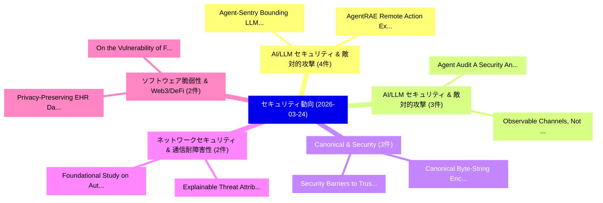

# 📅 02_daily: 日次エグゼクティブサマリー報告書 (2026-03-24)

**集計日時**: 2026-10-02 23:06:02 UTC  
**対象日付**: 2026-03-24  
**本日収集論文数**: 41 件  

---

## 💡 主要セキュリティ動向・脅威インサイト (Executive Insights)

本日の収集論文（計 41 件）において、以下の重点セキュリティ領域で活発な研究動向が確認されました：
- **AI/LLM セキュリティ & 敵対的攻撃** (4 件): 注目論文として 「Agent-Sentry: Bounding LLMエージェ...」、「AgentRAE: Remote Action Execut...」 等が発表され、実務防御および攻撃検証の進展が見られます。
- **AI/LLM セキュリティ & 敵対的攻撃** (3 件): 注目論文として 「Observable Channels, Not Just ...」、「Agent Audit: A Security Analys...」 等が発表され、実務防御および攻撃検証の進展が見られます。
- **Canonical & Security** (3 件): 注目論文として 「Security Barriers to Trustwort...」、「Canonical Byte-String Encoding...」 等が発表され、実務防御および攻撃検証の進展が見られます。
- **ネットワークセキュリティ & 通信耐障害性** (2 件): 注目論文として 「Explainable Threat Attribution...」、「Foundational Study on Authorsh...」 等が発表され、実務防御および攻撃検証の進展が見られます。
- **ソフトウェア脆弱性 & Web3/DeFi** (2 件): 注目論文として 「Privacy-Preserving EHR Data Tr...」、「On the Vulnerability of FHE Co...」 等が発表され、実務防御および攻撃検証の進展が見られます。

### 🗺️ 技術・脅威トピックマインドマップ

---

## 📌 日次セキュリティ論文一覧 (日本語表形式)

| No | arXiv ID | 論文タイトル (日本語訳) | 重要キーワード | 構造化エグゼクティブ要約 (背景・提案・影響) | 脅威分類 | 詳細リンク |
|---|---|---|---|---|---|---|
| 1 | `2603.22685v1` | [BlindMarket: Enabling Verifiable, Confidential, and Traceable IP Core Distribution in Zero-Trust Settings（セキュリティ分析論文）](../../okf/papers/2026-03-24/2603.22685.md) | `Enabling Verifiable`, `Core Distribution`, `Trust Settings` | 【提案】概要 (Overview & Key Finding) 本論文「BlindMarket: Enabling Verifiable, Confidential, and Tra...。実証評価により経営層・セキュリティ管理者向け推奨アクション (E... | `cs.LO` | [arXiv](https://arxiv.org/abs/2603.22685v1) &#124; [OKF](../../okf/papers/2026-03-24/2603.22685.md) |
| 2 | `2603.22717v1` | [Does Teaming-Up LLMs Improve Secure Code Generation? A Comprehensive Evaluation with Multi-LLMSecCodeEval（セキュリティ分析論文）](../../okf/papers/2026-03-24/2603.22717.md) | `Improve Secure Code Generation`, `Teaming-Up LLMs`, `Seung Ick Jang` | 【提案】A Comprehensive Evaluation with Multi-LLMSecCodeEval ### (日本語題名: Does Teaming-Up LLMs I...。実証評価により経営層・セキュリティ管理者向け推奨アクション (E... | `executive-summary` | [arXiv](https://arxiv.org/abs/2603.22717v1) &#124; [OKF](../../okf/papers/2026-03-24/2603.22717.md) |
| 3 | `2603.22751v2` | [Observable Channels, Not Just Storage: Evaluating Privacy Leakage in LLM Agent Pipelines（セキュリティ分析論文）](../../okf/papers/2026-03-24/2603.22751.md) | `Evaluating Privacy Leakage`, `Observable Channels`, `Agent Pipelines` | 【提案】背景とセキュリティ上の課題 (Background & Problem) 本研究はサイバー脅威環境におけるセキュリティ構造・脆弱性の検証を目的としています。(主要検出項目: ...。実証評価により経営層・セキュリティ管理者向け推奨アクション (E... | `cybersecurity` | [arXiv](https://arxiv.org/abs/2603.22751v2) &#124; [OKF](../../okf/papers/2026-03-24/2603.22751.md) |
| 4 | `2603.22753v1` | [Digital Twin Enabled Simultaneous Learning and Modeling for UAV-assisted Secure Communications with Eavesdropping Attacks（セキュリティ分析論文）](../../okf/papers/2026-03-24/2603.22753.md) | `Digital Twin Enabled Simultaneous Learning`, `Secure Communications`, `Eavesdropping Attacks` | 【提案】概要 (Overview & Key Finding) 本論文「Digital Twin Enabled Simultaneous Learning and Modeling...。実証評価により経営層・セキュリティ管理者向け推奨アクション (E... | `cs.NI` | [arXiv](https://arxiv.org/abs/2603.22753v1) &#124; [OKF](../../okf/papers/2026-03-24/2603.22753.md) |
| 5 | `2603.22771v1` | [Explainable Threat Attribution for IoT Networks Using Conditional SHAP and Flow Behavior Modelling（セキュリティ分析論文）](../../okf/papers/2026-03-24/2603.22771.md) | `Explainable Threat Attribution`, `Networks Using Conditional`, `Flow Behavior Modelling` | 【提案】概要 (Overview & Key Finding) 本論文「Explainable 脅威 Attribution for IoT Networks Using Condi...。実証評価により経営層・セキュリティ管理者向け推奨アクション (E... | `executive-summary` | [arXiv](https://arxiv.org/abs/2603.22771v1) &#124; [OKF](../../okf/papers/2026-03-24/2603.22771.md) |
| 6 | `2603.22808v4` | [Combinatorial Privacy: Private Multi-Party Bitstream Grand Sum by Hiding in Birkhoff Polytopes（セキュリティ分析論文）](../../okf/papers/2026-03-24/2603.22808.md) | `Party Bitstream Grand Sum`, `Combinatorial Privacy`, `Private Multi` | 【提案】概要 (Overview & Key Finding) 本論文「Combinatorial Privacy: Private Multi-Party Bitstream Gr...。実証評価により経営層・セキュリティ管理者向け推奨アクション (E... | `executive-summary` | [arXiv](https://arxiv.org/abs/2603.22808v4) &#124; [OKF](../../okf/papers/2026-03-24/2603.22808.md) |
| 7 | `2603.22853v1` | [Agent Audit: A Security Analysis System for LLM Agent Applications（セキュリティ分析論文）](../../okf/papers/2026-03-24/2603.22853.md) | `Agent Audit`, `Agent Applications`, `Haiyue Zhang` | 【提案】概要 (Overview & Key Finding) 本論文「Agent Audit: A Security Analysis System for LLM Agent A...。実証評価により経営層・セキュリティ管理者向け推奨アクション (E... | `cs.AI` | [arXiv](https://arxiv.org/abs/2603.22853v1) &#124; [OKF](../../okf/papers/2026-03-24/2603.22853.md) |
| 8 | `2603.22857v2` | [Secure Two-Party Matrix Multiplication from Lattices and Its Application to Encrypted Control（セキュリティ分析論文）](../../okf/papers/2026-03-24/2603.22857.md) | `Party Matrix Multiplication`, `Secure Two`, `Two-Party Matrix` | 【提案】概要 (Overview & Key Finding) 本論文「Secure Two-Party Matrix Multiplication from Lattices an...。実証評価により経営層・セキュリティ管理者向け推奨アクション (E... | `executive-summary` | [arXiv](https://arxiv.org/abs/2603.22857v2) &#124; [OKF](../../okf/papers/2026-03-24/2603.22857.md) |
| 9 | `2603.22868v2` | [Agent-Sentry: Bounding LLMエージェント via Execution Provenance](../../okf/papers/2026-03-24/2603.22868.md) | `Execution Provenance`, `Rohan Sequeira`, `Stavros Damianakis` | 【提案】概要 (Overview & Key Finding) 本論文「Agent-Sentry: Bounding LLMエージェント via Execution Provenan...。実証評価により経営層・セキュリティ管理者向け推奨アクション (E... | `cs.AI` | [arXiv](https://arxiv.org/abs/2603.22868v2) &#124; [OKF](../../okf/papers/2026-03-24/2603.22868.md) |
| 10 | `2603.22928v2` | [SoK: The Attack Surface of Agentic AI - Tools and Autonomy（セキュリティ分析論文）](../../okf/papers/2026-03-24/2603.22928.md) | `Ali Dehghantanha`, `Sajad Homayoun`, `Raw Meta` | 【提案】概要 (Overview & Key Finding) 本論文「SoK: The Attack Surface of Agentic AI - Tools and Auton...。実証評価により経営層・セキュリティ管理者向け推奨アクション (E... | `cybersecurity` | [arXiv](https://arxiv.org/abs/2603.22928v2) &#124; [OKF](../../okf/papers/2026-03-24/2603.22928.md) |
| 11 | `2603.22954v1` | [Privacy-Preserving EHR Data Transformation via Geometric Operators: A Human-AI Co-Design Technical Report（セキュリティ分析論文）](../../okf/papers/2026-03-24/2603.22954.md) | `Design Technical Report`, `Data Transformation`, `Geometric Operators` | 【提案】概要 (Overview & Key Finding) 本論文「Privacy-Preserving EHR Data Transformation via Geometri...。実証評価により経営層・セキュリティ管理者向け推奨アクション (E... | `executive-summary` | [arXiv](https://arxiv.org/abs/2603.22954v1) &#124; [OKF](../../okf/papers/2026-03-24/2603.22954.md) |
| 12 | `2603.22968v1` | [Beyond Theoretical Bounds: Empirical Privacy Loss Calibration for Text Rewriting Under Local Differential Privacy（セキュリティ分析論文）](../../okf/papers/2026-03-24/2603.22968.md) | `Empirical Privacy Loss Calibration`, `Beyond Theoretical Bounds`, `Weijun Li` | 【提案】概要 (Overview & Key Finding) 本論文「Beyond Theoretical Bounds: Empirical Privacy Loss Calib...。実証評価により経営層・セキュリティ管理者向け推奨アクション (E... | `executive-summary` | [arXiv](https://arxiv.org/abs/2603.22968v1) &#124; [OKF](../../okf/papers/2026-03-24/2603.22968.md) |
| 13 | `2603.22982v1` | [How Far Should We Need to Go : Evaluate Provenance-based Intrusion Detection Systems in Industrial Scenarios（セキュリティ分析論文）](../../okf/papers/2026-03-24/2603.22982.md) | `Intrusion Detection Systems`, `Industrial Scenarios`, `Provenance-based Intrusion` | 【提案】概要 (Overview & Key Finding) 本論文「How Far Should We Need to Go : Evaluate Provenance-base...。実証評価により経営層・セキュリティ管理者向け推奨アクション (E... | `cybersecurity` | [arXiv](https://arxiv.org/abs/2603.22982v1) &#124; [OKF](../../okf/papers/2026-03-24/2603.22982.md) |
| 14 | `2603.22987v1` | [A Critical Review on the Effectiveness and Privacy Threats of Membership Inference Attacks（セキュリティ分析論文）](../../okf/papers/2026-03-24/2603.22987.md) | `Membership Inference Attacks`, `Critical Review`, `Privacy Threats` | 【提案】概要 (Overview & Key Finding) 本論文「A Critical Review on the Effectiveness and Privacy Thre...。実証評価により経営層・セキュリティ管理者向け推奨アクション (E... | `executive-summary` | [arXiv](https://arxiv.org/abs/2603.22987v1) &#124; [OKF](../../okf/papers/2026-03-24/2603.22987.md) |
| 15 | `2603.23005v1` | [Multi-User Multi-Key Image Steganography with Key Isolation（セキュリティ分析論文）](../../okf/papers/2026-03-24/2603.23005.md) | `Key Image Steganography`, `User Multi`, `Key Isolation` | 【提案】概要 (Overview & Key Finding) 本論文「Multi-User Multi-Key Image Steganography with Key Isola...。実証評価により経営層・セキュリティ管理者向け推奨アクション (E... | `cybersecurity` | [arXiv](https://arxiv.org/abs/2603.23005v1) &#124; [OKF](../../okf/papers/2026-03-24/2603.23005.md) |
| 16 | `2603.23007v1` | [AgentRAE: Remote Action Execution through Notification-based Visual Backdoors against Screenshots-based Mobile GUI Agents（セキュリティ分析論文）](../../okf/papers/2026-03-24/2603.23007.md) | `Remote Action Execution`, `Visual Backdoors`, `Notification-based Visual` | 【提案】概要 (Overview & Key Finding) 本論文「AgentRAE: Remote Action Execution through Notification-...。実証評価により経営層・セキュリティ管理者向け推奨アクション (E... | `cs.AI` | [arXiv](https://arxiv.org/abs/2603.23007v1) &#124; [OKF](../../okf/papers/2026-03-24/2603.23007.md) |
| 17 | `2603.23012v1` | [RTS-ABAC: Real-Time Server-Aided Attribute-Based Authorization & Access Control for Substation Automation Systems（セキュリティ分析論文）](../../okf/papers/2026-03-24/2603.23012.md) | `Substation Automation Systems`, `Time Server`, `Aided Attribute` | 【提案】概要 (Overview & Key Finding) 本論文「RTS-ABAC: Real-Time Server-Aided Attribute-Based Author...。実証評価により経営層・セキュリティ管理者向け推奨アクション (E... | `cybersecurity` | [arXiv](https://arxiv.org/abs/2603.23012v1) &#124; [OKF](../../okf/papers/2026-03-24/2603.23012.md) |
| 18 | `2603.23064v3` | [Mind Your HEARTBEAT! Claw Background Execution Inherently Enables Silent Memory Pollution（セキュリティ分析論文）](../../okf/papers/2026-03-24/2603.23064.md) | `Claw Background Execution Inherently Enables Silent Memory Pollution`, `Claw Background Execution Inherently`, `Yechao Zhang` | 【提案】Claw Background Execution Inherently Enables Silent Memory Pollution ### (日本語題名: Mind Y...。実証評価により経営層・セキュリティ管理者向け推奨アクション (E... | `cs.AI` | [arXiv](https://arxiv.org/abs/2603.23064v3) &#124; [OKF](../../okf/papers/2026-03-24/2603.23064.md) |
| 19 | `2603.23117v2` | [TRAP: Hijacking VLA CoT-Reasoning via Adversarial Patches（セキュリティ分析論文）](../../okf/papers/2026-03-24/2603.23117.md) | `Adversarial Patches`, `CoT-Reasoning via`, `Zhengxian Huang` | 【提案】概要 (Overview & Key Finding) 本論文「TRAP: Hijacking VLA CoT-Reasoning via Adversarial Patch...。実証評価により経営層・セキュリティ管理者向け推奨アクション (E... | `cs.AI` | [arXiv](https://arxiv.org/abs/2603.23117v2) &#124; [OKF](../../okf/papers/2026-03-24/2603.23117.md) |
| 20 | `2603.23171v3` | [Adaptively Robust LLM Monitoring via Activation Watermarking（セキュリティ分析論文）](../../okf/papers/2026-03-24/2603.23171.md) | `Adaptively Robust`, `Activation Watermarking`, `Toluwani Aremu` | 【提案】概要 (Overview & Key Finding) 本論文「Adaptively Robust LLM Monitoring via Activation Waterma...。実証評価により経営層・セキュリティ管理者向け推奨アクション (E... | `cs.AI` | [arXiv](https://arxiv.org/abs/2603.23171v3) &#124; [OKF](../../okf/papers/2026-03-24/2603.23171.md) |
| 21 | `2603.23197v1` | [Privacy-Aware Smart Cameras: View Coverage via Socially Responsible Coordination（セキュリティ分析論文）](../../okf/papers/2026-03-24/2603.23197.md) | `Aware Smart Cameras`, `Socially Responsible Coordination`, `View Coverage` | 【提案】概要 (Overview & Key Finding) 本論文「Privacy-Aware Smart Cameras: View Coverage via Socially...。実証評価により経営層・セキュリティ管理者向け推奨アクション (E... | `executive-summary` | [arXiv](https://arxiv.org/abs/2603.23197v1) &#124; [OKF](../../okf/papers/2026-03-24/2603.23197.md) |
| 22 | `2603.23221v1` | [PRETTINESS -- Privacy pResErving aTTrIbute maNagEment SyStem（セキュリティ分析論文）](../../okf/papers/2026-03-24/2603.23221.md) | `Jelizaveta Vakarjuk`, `Alisa Pankova`, `Raw Meta` | 【提案】概要 (Overview & Key Finding) 本論文「PRETTINESS -- Privacy pResErving aTTrIbute maNagEment S...。実証評価により経営層・セキュリティ管理者向け推奨アクション (E... | `cybersecurity` | [arXiv](https://arxiv.org/abs/2603.23221v1) &#124; [OKF](../../okf/papers/2026-03-24/2603.23221.md) |
| 23 | `2603.23226v1` | [Gyokuro: Source-assisted Private Membership Testing using Trusted Execution Environments（セキュリティ分析論文）](../../okf/papers/2026-03-24/2603.23226.md) | `Private Membership Testing`, `Trusted Execution Environments`, `Source-assisted Private` | 【提案】概要 (Overview & Key Finding) 本論文「Gyokuro: Source-assisted Private Membership Testing usi...。実証評価により経営層・セキュリティ管理者向け推奨アクション (E... | `cybersecurity` | [arXiv](https://arxiv.org/abs/2603.23226v1) &#124; [OKF](../../okf/papers/2026-03-24/2603.23226.md) |
| 24 | `2603.23230v2` | [The Power of Power Codes: New Classes of Easy Instances for the Linear Equivalence Problem（セキュリティ分析論文）](../../okf/papers/2026-03-24/2603.23230.md) | `Linear Equivalence Problem`, `Power Codes`, `New Classes` | 【提案】概要 (Overview & Key Finding) 本論文「The Power of Power Codes: New Classes of Easy Instances...。実証評価により経営層・セキュリティ管理者向け推奨アクション (E... | `executive-summary` | [arXiv](https://arxiv.org/abs/2603.23230v2) &#124; [OKF](../../okf/papers/2026-03-24/2603.23230.md) |
| 25 | `2603.23253v1` | [On the Vulnerability of FHE Computation to Silent Data Corruption（セキュリティ分析論文）](../../okf/papers/2026-03-24/2603.23253.md) | `Silent Data Corruption`, `Jianan Mu`, `Ge Yu` | 【提案】概要 (Overview & Key Finding) 本論文「On the 脆弱性 of FHE Computation to Silent Data Corruption...。実証評価により経営層・セキュリティ管理者向け推奨アクション (E... | `executive-summary` | [arXiv](https://arxiv.org/abs/2603.23253v1) &#124; [OKF](../../okf/papers/2026-03-24/2603.23253.md) |
| 26 | `2603.23269v1` | [Not All Tokens Are Created Equal: Query-Efficient Jailbreak Fuzzing for LLMs（セキュリティ分析論文）](../../okf/papers/2026-03-24/2603.23269.md) | `Efficient Jailbreak Fuzzing`, `Query-Efficient Jailbreak`, `Wenyu Chen` | 【提案】背景とセキュリティ上の課題 (Background & Problem) 本研究はサイバー脅威環境におけるセキュリティ構造・脆弱性の検証を目的としています。(主要検出項目: ...。実証評価により経営層・セキュリティ管理者向け推奨アクション (E... | `cs.AI` | [arXiv](https://arxiv.org/abs/2603.23269v1) &#124; [OKF](../../okf/papers/2026-03-24/2603.23269.md) |
| 27 | `2603.23304v1` | [Security Barriers to Trustworthy AI-Driven Cyber Threat Intelligence in Finance: Evidence from Practitioners（セキュリティ分析論文）](../../okf/papers/2026-03-24/2603.23304.md) | `Driven Cyber Threat Intelligence`, `Security Barriers`, `AI-Driven Cyber` | 【提案】概要 (Overview & Key Finding) 本論文「Security Barriers to Trustworthy AI-Driven Cyber 脅威 Int...。実証評価により経営層・セキュリティ管理者向け推奨アクション (E... | `cybersecurity` | [arXiv](https://arxiv.org/abs/2603.23304v1) &#124; [OKF](../../okf/papers/2026-03-24/2603.23304.md) |
| 28 | `2603.23352v1` | [What a Mesh: Formal Security WPA3 SAE Wireless Authenticationの分析](../../okf/papers/2026-03-24/2603.23352.md) | `Wireless Authentication`, `Formal Security`, `Roberto Metere` | 【提案】概要 (Overview & Key Finding) 本論文「What a Mesh: Formal Security WPA3 SAE Wireless Authenti...。実証評価により経営層・セキュリティ管理者向け推奨アクション (E... | `cs.NI` | [arXiv](https://arxiv.org/abs/2603.23352v1) &#124; [OKF](../../okf/papers/2026-03-24/2603.23352.md) |
| 29 | `2603.23364v2` | [Canonical Byte-String Encoding for Finite-Ring Cryptosystems（セキュリティ分析論文）](../../okf/papers/2026-03-24/2603.23364.md) | `Canonical Byte`, `String Encoding`, `Ring Cryptosystems` | 【提案】概要 (Overview & Key Finding) 本論文「Canonical Byte-String Encoding for Finite-Ring Cryptosy...。実証評価により経営層・セキュリティ管理者向け推奨アクション (E... | `executive-summary` | [arXiv](https://arxiv.org/abs/2603.23364v2) &#124; [OKF](../../okf/papers/2026-03-24/2603.23364.md) |
| 30 | `2603.23416v1` | [An Experimental Study of Machine Learning-Based Intrusion Detection for OPC UA over Industrial Private 5G Networks（セキュリティ分析論文）](../../okf/papers/2026-03-24/2603.23416.md) | `Based Intrusion Detection`, `Machine Learning`, `Industrial Private` | 【提案】概要 (Overview & Key Finding) 本論文「An Experimental Study of Machine Learning-Based Intrusi...。実証評価により経営層・セキュリティ管理者向け推奨アクション (E... | `cybersecurity` | [arXiv](https://arxiv.org/abs/2603.23416v1) &#124; [OKF](../../okf/papers/2026-03-24/2603.23416.md) |
| 31 | `2603.23438v1` | [Targeted Adversarial Traffic Generation : Black-box Approach to Evade Intrusion Detection Systems in IoT Networks（セキュリティ分析論文）](../../okf/papers/2026-03-24/2603.23438.md) | `Targeted Adversarial Traffic Generation`, `Evade Intrusion Detection Systems`, `Islam Debicha` | 【提案】概要 (Overview & Key Finding) 本論文「Targeted Adversarial Traffic Generation : Black-box App...。実証評価により経営層・セキュリティ管理者向け推奨アクション (E... | `cs.AI` | [arXiv](https://arxiv.org/abs/2603.23438v1) &#124; [OKF](../../okf/papers/2026-03-24/2603.23438.md) |
| 32 | `2603.23459v2` | [CSTS: A Canonical Security Telemetry Substrate for AI-Native Cyber Detection（セキュリティ分析論文）](../../okf/papers/2026-03-24/2603.23459.md) | `Canonical Security Telemetry Substrate`, `Native Cyber Detection`, `AI-Native Cyber` | 【提案】概要 (Overview & Key Finding) 本論文「CSTS: A Canonical Security Telemetry Substrate for AI-N...。実証評価により経営層・セキュリティ管理者向け推奨アクション (E... | `executive-summary` | [arXiv](https://arxiv.org/abs/2603.23459v2) &#124; [OKF](../../okf/papers/2026-03-24/2603.23459.md) |
| 33 | `2603.23472v2` | [Byzantine-Robust and Differentially Private Federated Optimization under Weaker Assumptions（セキュリティ分析論文）](../../okf/papers/2026-03-24/2603.23472.md) | `Differentially Private Federated Optimization`, `Weaker Assumptions`, `Differentially Private Federated Optimiz` | 【提案】概要 (Overview & Key Finding) 本論文「Byzantine-Robust and Differentially Private Federated O...。実証評価により経営層・セキュリティ管理者向け推奨アクション (E... | `executive-summary` | [arXiv](https://arxiv.org/abs/2603.23472v2) &#124; [OKF](../../okf/papers/2026-03-24/2603.23472.md) |
| 34 | `2603.23670v1` | [n-VM: A Multi-VM Layer-1 Architecture with Shared Identity and Token State（セキュリティ分析論文）](../../okf/papers/2026-03-24/2603.23670.md) | `Shared Identity`, `Token State`, `Multi-VM Layer` | 【提案】概要 (Overview & Key Finding) 本論文「n-VM: A Multi-VM Layer-1 Architecture with Shared Ident...。実証評価により経営層・セキュリティ管理者向け推奨アクション (E... | `executive-summary` | [arXiv](https://arxiv.org/abs/2603.23670v1) &#124; [OKF](../../okf/papers/2026-03-24/2603.23670.md) |
| 35 | `2603.23745v1` | [Space Fabric: A Satellite-Enhanced Trusted Execution Architecture（セキュリティ分析論文）](../../okf/papers/2026-03-24/2603.23745.md) | `Enhanced Trusted Execution Architecture`, `Space Fabric`, `Satellite-Enhanced Trusted` | 【提案】概要 (Overview & Key Finding) 本論文「Space Fabric: A Satellite-Enhanced Trusted Execution Ar...。実証評価により経営層・セキュリティ管理者向け推奨アクション (E... | `cybersecurity` | [arXiv](https://arxiv.org/abs/2603.23745v1) &#124; [OKF](../../okf/papers/2026-03-24/2603.23745.md) |
| 36 | `2603.23781v2` | [Leveraging 大規模言語モデル for Trustworthiness Assessment of Web Applications](../../okf/papers/2026-03-24/2603.23781.md) | `Trustworthiness Assessment`, `Web Applications`, `Leveraging Large Language Models` | 【提案】概要 (Overview & Key Finding) 本論文「Leveraging 大規模言語モデル for Trustworthiness Assessment of W...。実証評価により経営層・セキュリティ管理者向け推奨アクション (E... | `cybersecurity` | [arXiv](https://arxiv.org/abs/2603.23781v2) &#124; [OKF](../../okf/papers/2026-03-24/2603.23781.md) |
| 37 | `2603.23791v1` | [The Cognitive Firewall:Browser Based AI Agents Against Indirect Prompt Injection Via Hybrid Edge Cloud Defenseのセキュリティ強化](../../okf/papers/2026-03-24/2603.23791.md) | `Browser Based`, `Securing Browser Based`, `Qianlong Lan` | 【提案】概要 (Overview & Key Finding) 本論文「The Cognitive Firewall:Browser Based AI Agents Against ...。実証評価により経営層・セキュリティ管理者向け推奨アクション (E... | `cs.AI` | [arXiv](https://arxiv.org/abs/2603.23791v1) &#124; [OKF](../../okf/papers/2026-03-24/2603.23791.md) |
| 38 | `2603.23793v1` | [AetherWeave: Sybil-Resistant Robust Peer Discovery with Stake（セキュリティ分析論文）](../../okf/papers/2026-03-24/2603.23793.md) | `Resistant Robust Peer Discovery`, `Sybil-Resistant Robust`, `Kaya Alpturer` | 【提案】概要 (Overview & Key Finding) 本論文「AetherWeave: Sybil-Resistant Robust Peer Discovery with...。実証評価により経営層・セキュリティ管理者向け推奨アクション (E... | `executive-summary` | [arXiv](https://arxiv.org/abs/2603.23793v1) &#124; [OKF](../../okf/papers/2026-03-24/2603.23793.md) |
| 39 | `2604.02366v1` | [Out-of-Domain Stress Test for Temporal Braid Group Privilege Escalation Detection（セキュリティ分析論文）](../../okf/papers/2026-03-24/2604.02366.md) | `Temporal Braid Group Privilege Escalation Detection`, `Domain Stress Test`, `Christophe Parisel` | 【提案】概要 (Overview & Key Finding) 本論文「Out-of-Domain Stress Test for Temporal Braid Group 権限昇格...。実証評価により経営層・セキュリティ管理者向け推奨アクション (E... | `executive-summary` | [arXiv](https://arxiv.org/abs/2604.02366v1) &#124; [OKF](../../okf/papers/2026-03-24/2604.02366.md) |
| 40 | `2604.16376v1` | [Foundational Study on Authorship Attribution of Japanese Web Reviews for Actor Analysis（セキュリティ分析論文）](../../okf/papers/2026-03-24/2604.16376.md) | `Japanese Web Reviews`, `Authorship Attribution`, `Hiroshi Matsubara` | 【提案】概要 (Overview & Key Finding) 本論文「Foundational Study on Authorship Attribution of Japanes...。実証評価により経営層・セキュリティ管理者向け推奨アクション (E... | `executive-summary` | [arXiv](https://arxiv.org/abs/2604.16376v1) &#124; [OKF](../../okf/papers/2026-03-24/2604.16376.md) |
| 41 | `2605.16265v1` | [AgentWall: A Runtime Safety Layer for Local AI Agents（セキュリティ分析論文）](../../okf/papers/2026-03-24/2605.16265.md) | `Runtime Safety Layer`, `Ashwin Aravind`, `Raw Meta` | 【提案】概要 (Overview & Key Finding) 本論文「AgentWall: A Runtime Safety Layer for Local AI Agents（セ...。実証評価により経営層・セキュリティ管理者向け推奨アクション (E... | `cs.AI` | [arXiv](https://arxiv.org/abs/2605.16265v1) &#124; [OKF](../../okf/papers/2026-03-24/2605.16265.md) |

