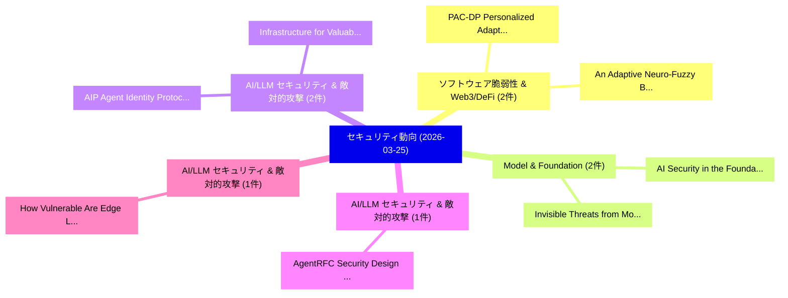

# 📅 02_daily: 日次エグゼクティブサマリー報告書 (2026-03-25)

**集計日時**: 2026-10-02 23:06:02 UTC  
**対象日付**: 2026-03-25  
**本日収集論文数**: 30 件  

---

## 💡 主要セキュリティ動向・脅威インサイト (Executive Insights)

本日の収集論文（計 30 件）において、以下の重点セキュリティ領域で活発な研究動向が確認されました：
- **ソフトウェア脆弱性 & Web3/DeFi** (2 件): 注目論文として 「An Adaptive Neuro-Fuzzy Blockc...」、「PAC-DP: Personalized Adaptive ...」 等が発表され、実務防御および攻撃検証の進展が見られます。
- **Model & Foundation** (2 件): 注目論文として 「Invisible Threats from Model C...」、「AI Security in the Foundation ...」 等が発表され、実務防御および攻撃検証の進展が見られます。
- **AI/LLM セキュリティ & 敵対的攻撃** (2 件): 注目論文として 「Infrastructure for Valuable, T...」、「AIP: Agent Identity Protocol f...」 等が発表され、実務防御および攻撃検証の進展が見られます。
- **AI/LLM セキュリティ & 敵対的攻撃** (1 件): 注目論文として 「AgentRFC: Security Design Prin...」 等が発表され、実務防御および攻撃検証の進展が見られます。
- **AI/LLM セキュリティ & 敵対的攻撃** (1 件): 注目論文として 「How Vulnerable Are Edge LLMs?（...」 等が発表され、実務防御および攻撃検証の進展が見られます。

### 🗺️ 技術・脅威トピックマインドマップ

---

## 📌 日次セキュリティ論文一覧 (日本語表形式)

| No | arXiv ID | 論文タイトル (日本語訳) | 重要キーワード | 構造化エグゼクティブ要約 (背景・提案・影響) | 脅威分類 | 詳細リンク |
|---|---|---|---|---|---|---|
| 1 | `2603.23801v1` | [AgentRFC: Security Design Principles and Conformance Testing for Agent Protocols（セキュリティ分析論文）](../../okf/papers/2026-03-25/2603.23801.md) | `Security Design Principles`, `Conformance Testing`, `Agent Protocols` | 【提案】概要 (Overview & Key Finding) 本論文「AgentRFC: Security Design Principles and Conformance Te...。実証評価により経営層・セキュリティ管理者向け推奨アクション (E... | `cybersecurity` | [arXiv](https://arxiv.org/abs/2603.23801v1) &#124; [OKF](../../okf/papers/2026-03-25/2603.23801.md) |
| 2 | `2603.23822v1` | [How Vulnerable Are Edge LLMs?（セキュリティ分析論文）](../../okf/papers/2026-03-25/2603.23822.md) | `Ao Ding`, `Hongzong Li`, `Zi Liang` | 【提案】### (日本語題名: How Vulnerable Are Edge LLMs?（セキュリティ分析論文）)  > [!NOTE] > **OKF Metadata**: T...。実証評価により経営層・セキュリティ管理者向け推奨アクション (E... | `executive-summary` | [arXiv](https://arxiv.org/abs/2603.23822v1) &#124; [OKF](../../okf/papers/2026-03-25/2603.23822.md) |
| 3 | `2603.23829v1` | [An Adaptive Neuro-Fuzzy Blockchain-AI Framework for Secure and Intelligent FinTech Transactions（セキュリティ分析論文）](../../okf/papers/2026-03-25/2603.23829.md) | `Fuzzy Blockchain`, `Neuro-Fuzzy Blockchain`, `Gunjan Mishra` | 【提案】概要 (Overview & Key Finding) 本論文「An Adaptive Neuro-Fuzzy Blockchain-AI Framework for Sec...。実証評価により経営層・セキュリティ管理者向け推奨アクション (E... | `cybersecurity` | [arXiv](https://arxiv.org/abs/2603.23829v1) &#124; [OKF](../../okf/papers/2026-03-25/2603.23829.md) |
| 4 | `2603.23935v1` | [An Empirical Google Play Data Safety Disclosures: A Consistency Study of Privacy Indicators in Mobile Gaming Appsの分析](../../okf/papers/2026-03-25/2603.23935.md) | `Privacy Indicators`, `Google Play Data Safety Disclosures`, `Mobile Gaming Apps` | 【提案】概要 (Overview & Key Finding) 本論文「An Empirical Google Play Data Safety Disclosures: A Con...。実証評価により経営層・セキュリティ管理者向け推奨アクション (E... | `cybersecurity` | [arXiv](https://arxiv.org/abs/2603.23935v1) &#124; [OKF](../../okf/papers/2026-03-25/2603.23935.md) |
| 5 | `2603.23966v3` | [Policy-Guided Threat Hunting: An LLM enabled Framework with Splunk SOC Triage（セキュリティ分析論文）](../../okf/papers/2026-03-25/2603.23966.md) | `Guided Threat Hunting`, `Policy-Guided Threat`, `Md Rasel Al Mamun` | 【提案】概要 (Overview & Key Finding) 本論文「Policy-Guided 脅威 Hunting: An LLM enabled Framework with...。実証評価により経営層・セキュリティ管理者向け推奨アクション (E... | `cs.AI` | [arXiv](https://arxiv.org/abs/2603.23966v3) &#124; [OKF](../../okf/papers/2026-03-25/2603.23966.md) |
| 6 | `2603.23996v1` | [Forensic Implications of Localized AI: Artifact Ollama, LM Studio, and llama.cppの分析](../../okf/papers/2026-03-25/2603.23996.md) | `Forensic Implications`, `Artifact Ollama`, `Shariq Murtuza` | 【提案】概要 (Overview & Key Finding) 本論文「Forensic Implications of Localized AI: Artifact Ollama,...。実証評価により経営層・セキュリティ管理者向け推奨アクション (E... | `cybersecurity` | [arXiv](https://arxiv.org/abs/2603.23996v1) &#124; [OKF](../../okf/papers/2026-03-25/2603.23996.md) |
| 7 | `2603.24003v1` | [PAC-DP: Personalized Adaptive Clipping for Differentially Private 連合学習](../../okf/papers/2026-03-25/2603.24003.md) | `Personalized Adaptive Clipping`, `Differentially Private Federated Learning`, `Differentially Private` | 【提案】概要 (Overview & Key Finding) 本論文「PAC-DP: Personalized Adaptive Clipping for Differential...。実証評価により経営層・セキュリティ管理者向け推奨アクション (E... | `cybersecurity` | [arXiv](https://arxiv.org/abs/2603.24003v1) &#124; [OKF](../../okf/papers/2026-03-25/2603.24003.md) |
| 8 | `2603.24079v1` | [When Understanding Becomes a Risk: Authenticity and Safety Risks in the Emerging Image Generation Paradigm（セキュリティ分析論文）](../../okf/papers/2026-03-25/2603.24079.md) | `Emerging Image Generation Paradigm`, `Safety Risks`, `Ye Leng` | 【提案】概要 (Overview & Key Finding) 本論文「When Understanding Becomes a Risk: Authenticity and Saf...。実証評価により経営層・セキュリティ管理者向け推奨アクション (E... | `cs.AI` | [arXiv](https://arxiv.org/abs/2603.24079v1) &#124; [OKF](../../okf/papers/2026-03-25/2603.24079.md) |
| 9 | `2603.24111v3` | [Toward a Multi-Layer ML-Based Security Framework for Industrial IoT（セキュリティ分析論文）](../../okf/papers/2026-03-25/2603.24111.md) | `Multi-Layer ML`, `Aymen Bouferroum`, `Valeria Loscri` | 【提案】概要 (Overview & Key Finding) 本論文「Toward a Multi-Layer ML-Based Security Framework for In...。実証評価により経営層・セキュリティ管理者向け推奨アクション (E... | `executive-summary` | [arXiv](https://arxiv.org/abs/2603.24111v3) &#124; [OKF](../../okf/papers/2026-03-25/2603.24111.md) |
| 10 | `2603.24167v2` | [Walma: Learning to See Memory Corruption in WebAssembly（セキュリティ分析論文）](../../okf/papers/2026-03-25/2603.24167.md) | `See Memory Corruption`, `Oussama Draissi`, `Reza Sadeghi` | 【提案】概要 (Overview & Key Finding) 本論文「Walma: Learning to See Memory Corruption in WebAssembly...。実証評価により経営層・セキュリティ管理者向け推奨アクション (E... | `executive-summary` | [arXiv](https://arxiv.org/abs/2603.24167v2) &#124; [OKF](../../okf/papers/2026-03-25/2603.24167.md) |
| 11 | `2603.24172v2` | [Remote Attestation of Microarchitectural Attacks: The Case of Rowhammerに向けて](../../okf/papers/2026-03-25/2603.24172.md) | `Microarchitectural Attacks`, `Towards Remote Attestation`, `Remote Attestation` | 【提案】概要 (Overview & Key Finding) 本論文「Remote Attestation of Microarchitectural Attacks: The C...。実証評価により経営層・セキュリティ管理者向け推奨アクション (E... | `cybersecurity` | [arXiv](https://arxiv.org/abs/2603.24172v2) &#124; [OKF](../../okf/papers/2026-03-25/2603.24172.md) |
| 12 | `2603.24203v1` | [Invisible Threats from Model Context Protocol: Generating Stealthy Injection Payload via Tree-based Adaptive Search（セキュリティ分析論文）](../../okf/papers/2026-03-25/2603.24203.md) | `Generating Stealthy Injection Payload`, `Model Context Protocol`, `Invisible Threats` | 【提案】概要 (Overview & Key Finding) 本論文「Invisible Threats from Model Context Protocol: Generati...。実証評価により経営層・セキュリティ管理者向け推奨アクション (E... | `cs.AI` | [arXiv](https://arxiv.org/abs/2603.24203v1) &#124; [OKF](../../okf/papers/2026-03-25/2603.24203.md) |
| 13 | `2603.24232v1` | [Attack Assessment and Augmented Identity Recognition for Human Skeleton Data（セキュリティ分析論文）](../../okf/papers/2026-03-25/2603.24232.md) | `Augmented Identity Recognition`, `Human Skeleton Data`, `Attack Assessment` | 【提案】概要 (Overview & Key Finding) 本論文「Attack Assessment and Augmented Identity Recognition fo...。実証評価により経営層・セキュリティ管理者向け推奨アクション (E... | `cs.CV` | [arXiv](https://arxiv.org/abs/2603.24232v1) &#124; [OKF](../../okf/papers/2026-03-25/2603.24232.md) |
| 14 | `2603.24282v2` | [Software Supply Chain Smells: Lightweight Analysis for Secure Dependency Management（セキュリティ分析論文）](../../okf/papers/2026-03-25/2603.24282.md) | `Software Supply Chain Smells`, `Secure Dependency Management`, `Software Supply Chain Smell` | 【提案】概要 (Overview & Key Finding) 本論文「Software Supply Chain Smells: Lightweight Analysis for ...。実証評価により経営層・セキュリティ管理者向け推奨アクション (E... | `executive-summary` | [arXiv](https://arxiv.org/abs/2603.24282v2) &#124; [OKF](../../okf/papers/2026-03-25/2603.24282.md) |
| 15 | `2603.24302v2` | [A Large-Scale Study of Telegram Bots（セキュリティ分析論文）](../../okf/papers/2026-03-25/2603.24302.md) | `Telegram Bots`, `Taro Tsuchiya`, `Haoxiang Yu` | 【提案】概要 (Overview & Key Finding) 本論文「A Large-Scale Study of Telegram Bots（セキュリティ分析論文）」（原題: A...。実証評価により経営層・セキュリティ管理者向け推奨アクション (E... | `executive-summary` | [arXiv](https://arxiv.org/abs/2603.24302v2) &#124; [OKF](../../okf/papers/2026-03-25/2603.24302.md) |
| 16 | `2603.24414v1` | [ClawKeeper: Comprehensive Safety Protection for OpenClaw Agents Through Skills, Plugins, and Watchers（セキュリティ分析論文）](../../okf/papers/2026-03-25/2603.24414.md) | `Comprehensive Safety Protection`, `Songyang Liu`, `Chaozhuo Li` | 【提案】概要 (Overview & Key Finding) 本論文「ClawKeeper: Comprehensive Safety Protection for OpenCla...。実証評価により経営層・セキュリティ管理者向け推奨アクション (E... | `cs.AI` | [arXiv](https://arxiv.org/abs/2603.24414v1) &#124; [OKF](../../okf/papers/2026-03-25/2603.24414.md) |
| 17 | `2603.24426v1` | [IPsec based on Quantum Key Distribution: Adapting non-3GPP access to 5G Networks to the Quantum Era（セキュリティ分析論文）](../../okf/papers/2026-03-25/2603.24426.md) | `Quantum Key Distribution`, `Quantum Era`, `non-3GPP access` | 【提案】概要 (Overview & Key Finding) 本論文「IPsec based on 量子鍵配送: Adapting non-3GPP access to 5G Ne...。実証評価により経営層・セキュリティ管理者向け推奨アクション (E... | `cs.NI` | [arXiv](https://arxiv.org/abs/2603.24426v1) &#124; [OKF](../../okf/papers/2026-03-25/2603.24426.md) |
| 18 | `2603.24511v2` | [Claudini: Autoresearch Discovers State-of-the-Art Adversarial Attack Algorithms for LLMs（セキュリティ分析論文）](../../okf/papers/2026-03-25/2603.24511.md) | `Autoresearch Discovers State`, `Art Adversarial Attack Algorithms`, `the-Art Adversarial` | 【提案】背景とセキュリティ上の課題 (Background & Problem) 本研究はサイバー脅威環境におけるセキュリティ構造・脆弱性の検証を目的としています。(主要検出項目: ...。実証評価により経営層・セキュリティ管理者向け推奨アクション (E... | `cs.AI` | [arXiv](https://arxiv.org/abs/2603.24511v2) &#124; [OKF](../../okf/papers/2026-03-25/2603.24511.md) |
| 19 | `2603.24543v1` | [Analysing the Safety Pitfalls of Steering Vectors（セキュリティ分析論文）](../../okf/papers/2026-03-25/2603.24543.md) | `Safety Pitfalls`, `Steering Vectors`, `Yuxiao Li` | 【提案】概要 (Overview & Key Finding) 本論文「Analysing the Safety Pitfalls of Steering Vectors（セキュリテ...。実証評価により経営層・セキュリティ管理者向け推奨アクション (E... | `executive-summary` | [arXiv](https://arxiv.org/abs/2603.24543v1) &#124; [OKF](../../okf/papers/2026-03-25/2603.24543.md) |
| 20 | `2603.24564v1` | [Infrastructure for Valuable, Tradable, and Verifiable Agent Memory（セキュリティ分析論文）](../../okf/papers/2026-03-25/2603.24564.md) | `Verifiable Agent Memory`, `Mengyuan Li`, `Lei Gao` | 【提案】概要 (Overview & Key Finding) 本論文「Infrastructure for Valuable, Tradable, and Verifiable A...。実証評価により経営層・セキュリティ管理者向け推奨アクション (E... | `executive-summary` | [arXiv](https://arxiv.org/abs/2603.24564v1) &#124; [OKF](../../okf/papers/2026-03-25/2603.24564.md) |
| 21 | `2603.24625v2` | [From Hype to Collapse: Investigating Rug Pull Scams on Solana（セキュリティ分析論文）](../../okf/papers/2026-03-25/2603.24625.md) | `Investigating Rug Pull Scams`, `Jiaxin Chen`, `Ziwei Li` | 【提案】概要 (Overview & Key Finding) 本論文「From Hype to Collapse: Investigating Rug Pull Scams on ...。実証評価により経営層・セキュリティ管理者向け推奨アクション (E... | `executive-summary` | [arXiv](https://arxiv.org/abs/2603.24625v2) &#124; [OKF](../../okf/papers/2026-03-25/2603.24625.md) |
| 22 | `2603.24695v1` | [Amplified Patch-Level Differential Privacy for Free via Random Cropping（セキュリティ分析論文）](../../okf/papers/2026-03-25/2603.24695.md) | `Level Differential Privacy`, `Amplified Patch`, `Random Cropping` | 【提案】概要 (Overview & Key Finding) 本論文「Amplified Patch-Level 差分プライバシー for Free via Random Crop...。実証評価により経営層・セキュリティ管理者向け推奨アクション (E... | `cs.CV` | [arXiv](https://arxiv.org/abs/2603.24695v1) &#124; [OKF](../../okf/papers/2026-03-25/2603.24695.md) |
| 23 | `2603.24754v1` | [An Explainable Federated Framework for Zero Trust Micro-Segmentation in IIoT Networks（セキュリティ分析論文）](../../okf/papers/2026-03-25/2603.24754.md) | `Zero Trust Micro`, `Muhammad Liman Gambo`, `Ahmad Almulhem` | 【提案】概要 (Overview & Key Finding) 本論文「An Explainable Federated Framework for ゼロトラスト Micro-Seg...。実証評価により経営層・セキュリティ管理者向け推奨アクション (E... | `cybersecurity` | [arXiv](https://arxiv.org/abs/2603.24754v1) &#124; [OKF](../../okf/papers/2026-03-25/2603.24754.md) |
| 24 | `2603.24775v1` | [AIP: Agent Identity Protocol for Verifiable Delegation Across MCP and A2A（セキュリティ分析論文）](../../okf/papers/2026-03-25/2603.24775.md) | `Agent Identity Protocol`, `Verifiable Delegation Across`, `Sunil Prakash` | 【提案】概要 (Overview & Key Finding) 本論文「AIP: Agent Identity Protocol for Verifiable Delegation ...。実証評価により経営層・セキュリティ管理者向け推奨アクション (E... | `cs.AI` | [arXiv](https://arxiv.org/abs/2603.24775v1) &#124; [OKF](../../okf/papers/2026-03-25/2603.24775.md) |
| 25 | `2603.24837v1` | [Bridging Code Property Graphs and Language Models for Program Analysis（セキュリティ分析論文）](../../okf/papers/2026-03-25/2603.24837.md) | `Bridging Code Property Graphs`, `Language Models`, `Ahmed Lekssays` | 【提案】概要 (Overview & Key Finding) 本論文「Bridging Code Property Graphs and Language Models for P...。実証評価により経営層・セキュリティ管理者向け推奨アクション (E... | `cybersecurity` | [arXiv](https://arxiv.org/abs/2603.24837v1) &#124; [OKF](../../okf/papers/2026-03-25/2603.24837.md) |
| 26 | `2603.24857v1` | [AI Security in the Foundation Model Era: A Comprehensive Survey from a Unified Perspective（セキュリティ分析論文）](../../okf/papers/2026-03-25/2603.24857.md) | `Foundation Model Era`, `Comprehensive Survey`, `Unified Perspective` | 【提案】概要 (Overview & Key Finding) 本論文「AI Security in the Foundation Model Era: A Comprehensiv...。実証評価により経営層・セキュリティ管理者向け推奨アクション (E... | `cs.AI` | [arXiv](https://arxiv.org/abs/2603.24857v1) &#124; [OKF](../../okf/papers/2026-03-25/2603.24857.md) |
| 27 | `2603.24868v2` | [Quantum Spectral Authentication: Entity Authentication and Key Derivation from a Hidden Eigenstate of a Public Unitary Challenge（セキュリティ分析論文）](../../okf/papers/2026-03-25/2603.24868.md) | `Quantum Spectral Authentication`, `Public Unitary Challenge`, `Entity Authentication` | 【提案】概要 (Overview & Key Finding) 本論文「量子 Spectral Authentication: Entity Authentication and K...。実証評価により経営層・セキュリティ管理者向け推奨アクション (E... | `General Cyber Security` | [arXiv](https://arxiv.org/abs/2603.24868v2) &#124; [OKF](../../okf/papers/2026-03-25/2603.24868.md) |
| 28 | `2603.24878v1` | [Trusted-Execution Environment (TEE) for Solving the Replication Crisis in Academia（セキュリティ分析論文）](../../okf/papers/2026-03-25/2603.24878.md) | `Execution Environment`, `Replication Crisis`, `Trusted-Execution Environment` | 【提案】概要 (Overview & Key Finding) 本論文「Trusted-Execution Environment (TEE) for Solving the Rep...。実証評価により経営層・セキュリティ管理者向け推奨アクション (E... | `cybersecurity` | [arXiv](https://arxiv.org/abs/2603.24878v1) &#124; [OKF](../../okf/papers/2026-03-25/2603.24878.md) |
| 29 | `2603.26781v1` | [Efficient Encrypted Computation in Convolutional Spiking Neural Networks with TFHE（セキュリティ分析論文）](../../okf/papers/2026-03-25/2603.26781.md) | `Convolutional Spiking Neural Networks`, `Efficient Encrypted Computation`, `Longfei Guo` | 【提案】概要 (Overview & Key Finding) 本論文「Efficient Encrypted Computation in Convolutional Spikin...。実証評価により経営層・セキュリティ管理者向け推奨アクション (E... | `executive-summary` | [arXiv](https://arxiv.org/abs/2603.26781v1) &#124; [OKF](../../okf/papers/2026-03-25/2603.26781.md) |
| 30 | `2606.00003v1` | [Learning from Mistakes: Can LLM Self-Recover after Misalignment?（セキュリティ分析論文）](../../okf/papers/2026-03-25/2606.00003.md) | `Francesco Giarrusso`, `Vincenzo Suriani`, `Daniele Nardi` | 【提案】### (日本語題名: Learning from Mistakes: Can LLM Self-Recover after Misalignment?（セキュリティ分析論文...。実証評価によりSorokoletova, Francesco G... | `executive-summary` | [arXiv](https://arxiv.org/abs/2606.00003v1) &#124; [OKF](../../okf/papers/2026-03-25/2606.00003.md) |

