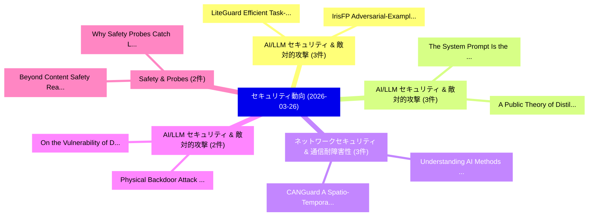

# 📅 02_daily: 日次エグゼクティブサマリー報告書 (2026-03-26)

**集計日時**: 2026-10-02 23:06:02 UTC  
**対象日付**: 2026-03-26  
**本日収集論文数**: 31 件  

---

## 💡 主要セキュリティ動向・脅威インサイト (Executive Insights)

本日の収集論文（計 31 件）において、以下の重点セキュリティ領域で活発な研究動向が確認されました：
- **AI/LLM セキュリティ & 敵対的攻撃** (3 件): 注目論文として 「LiteGuard: Efficient Task-Agno...」、「IrisFP: Adversarial-Example-ba...」 等が発表され、実務防御および攻撃検証の進展が見られます。
- **AI/LLM セキュリティ & 敵対的攻撃** (3 件): 注目論文として 「A Public Theory of Distillatio...」、「The System Prompt Is the Attac...」 等が発表され、実務防御および攻撃検証の進展が見られます。
- **ネットワークセキュリティ & 通信耐障害性** (3 件): 注目論文として 「CANGuard: A Spatio-Temporal CN...」、「Understanding AI Methods for I...」 等が発表され、実務防御および攻撃検証の進展が見られます。
- **AI/LLM セキュリティ & 敵対的攻撃** (2 件): 注目論文として 「Physical Backdoor Attack Again...」、「On the Vulnerability of Deep A...」 等が発表され、実務防御および攻撃検証の進展が見られます。
- **Safety & Probes** (2 件): 注目論文として 「Beyond Content Safety: Real-Ti...」、「Why Safety Probes Catch Liars ...」 等が発表され、実務防御および攻撃検証の進展が見られます。

### 🗺️ 技術・脅威トピックマインドマップ

---

## 📌 日次セキュリティ論文一覧 (日本語表形式)

| No | arXiv ID | 論文タイトル (日本語訳) | 重要キーワード | 構造化エグゼクティブ要約 (背景・提案・影響) | 脅威分類 | 詳細リンク |
|---|---|---|---|---|---|---|
| 1 | `2603.24888v1` | [An Approach to Generate Attack Graphs with a Case Study on Siemens PCS7 Blueprint for Water Treatment Plants（セキュリティ分析論文）](../../okf/papers/2026-03-26/2603.24888.md) | `Generate Attack Graphs`, `Water Treatment Plants`, `Lucas Miranda` | 【提案】概要 (Overview & Key Finding) 本論文「An Approach to Generate Attack Graphs with a Case Study...。実証評価により経営層・セキュリティ管理者向け推奨アクション (E... | `cybersecurity` | [arXiv](https://arxiv.org/abs/2603.24888v1) &#124; [OKF](../../okf/papers/2026-03-26/2603.24888.md) |
| 2 | `2603.24898v1` | [Sovereign AI at the Front Door of Care: A Physically Unidirectional Architecture for Secure Clinical Intelligence（セキュリティ分析論文）](../../okf/papers/2026-03-26/2603.24898.md) | `Physically Unidirectional Architecture`, `Secure Clinical Intelligence`, `Front Door` | 【提案】概要 (Overview & Key Finding) 本論文「Sovereign AI at the Front Door of Care: A Physically Un...。実証評価により経営層・セキュリティ管理者向け推奨アクション (E... | `cs.NI` | [arXiv](https://arxiv.org/abs/2603.24898v1) &#124; [OKF](../../okf/papers/2026-03-26/2603.24898.md) |
| 3 | `2603.24904v1` | [On the Foundations of Trustworthy Artificial Intelligence（セキュリティ分析論文）](../../okf/papers/2026-03-26/2603.24904.md) | `Trustworthy Artificial Intelligence`, `Raw Meta`, `Executive Summary` | 【提案】概要 (Overview & Key Finding) 本論文「On the Foundations of Trustworthy Artificial Intelligen...。実証評価により経営層・セキュリティ管理者向け推奨アクション (E... | `cs.AI` | [arXiv](https://arxiv.org/abs/2603.24904v1) &#124; [OKF](../../okf/papers/2026-03-26/2603.24904.md) |
| 4 | `2603.24982v1` | [LiteGuard: Efficient Task-Agnostic Model Fingerprinting with Enhanced Generalization（セキュリティ分析論文）](../../okf/papers/2026-03-26/2603.24982.md) | `Agnostic Model Fingerprinting`, `Efficient Task`, `Enhanced Generalization` | 【提案】概要 (Overview & Key Finding) 本論文「LiteGuard: Efficient Task-Agnostic Model Fingerprinting...。実証評価により経営層・セキュリティ管理者向け推奨アクション (E... | `cybersecurity` | [arXiv](https://arxiv.org/abs/2603.24982v1) &#124; [OKF](../../okf/papers/2026-03-26/2603.24982.md) |
| 5 | `2603.24996v2` | [IrisFP: Adversarial-Example-based Model Fingerprinting with Enhanced Uniqueness and Robustness（セキュリティ分析論文）](../../okf/papers/2026-03-26/2603.24996.md) | `Model Fingerprinting`, `Enhanced Uniqueness`, `Ziye Geng` | 【提案】概要 (Overview & Key Finding) 本論文「IrisFP: Adversarial-Example-based Model Fingerprinting ...。実証評価により経営層・セキュリティ管理者向け推奨アクション (E... | `cybersecurity` | [arXiv](https://arxiv.org/abs/2603.24996v2) &#124; [OKF](../../okf/papers/2026-03-26/2603.24996.md) |
| 6 | `2603.25022v1` | [A Public Theory of Distillation Resistance via Constraint-Coupled Reasoning Architectures（セキュリティ分析論文）](../../okf/papers/2026-03-26/2603.25022.md) | `Coupled Reasoning Architectures`, `Public Theory`, `Distillation Resistance` | 【提案】概要 (Overview & Key Finding) 本論文「A Public Theory of Distillation Resistance via Constrai...。実証評価により経営層・セキュリティ管理者向け推奨アクション (E... | `cs.AI` | [arXiv](https://arxiv.org/abs/2603.25022v1) &#124; [OKF](../../okf/papers/2026-03-26/2603.25022.md) |
| 7 | `2603.25043v2` | [Efficient ML-DSA Public Key Management Method with Identity for PKI and Its Application（セキュリティ分析論文）](../../okf/papers/2026-03-26/2603.25043.md) | `ML-DSA Public`, `Penghui Liu`, `Yi Niu` | 【提案】概要 (Overview & Key Finding) 本論文「Efficient ML-DSA Public Key Management Method with Iden...。実証評価により経営層・セキュリティ管理者向け推奨アクション (E... | `cybersecurity` | [arXiv](https://arxiv.org/abs/2603.25043v2) &#124; [OKF](../../okf/papers/2026-03-26/2603.25043.md) |
| 8 | `2603.25056v1` | [The System Prompt Is the Attack Surface: How LLM Agent Configuration Shapes Security and Creates Exploitable Vulnerabilities（セキュリティ分析論文）](../../okf/papers/2026-03-26/2603.25056.md) | `Agent Configuration Shapes Security`, `Creates Exploitable Vulnerabilities`, `Attack Surface` | 【提案】概要 (Overview & Key Finding) 本論文「The System Prompt Is the Attack Surface: How LLM Agent ...。実証評価により経営層・セキュリティ管理者向け推奨アクション (E... | `cs.AI` | [arXiv](https://arxiv.org/abs/2603.25056v1) &#124; [OKF](../../okf/papers/2026-03-26/2603.25056.md) |
| 9 | `2603.25100v1` | [From Logic Monopoly to Social Contract: Separation of Power and the Institutional Foundations for Autonomous Agent Economies（セキュリティ分析論文）](../../okf/papers/2026-03-26/2603.25100.md) | `Autonomous Agent Economies`, `Social Contract`, `Institutional Foundations` | 【提案】概要 (Overview & Key Finding) 本論文「From Logic Monopoly to Social Contract: Separation of P...。実証評価により経営層・セキュリティ管理者向け推奨アクション (E... | `cs.AI` | [arXiv](https://arxiv.org/abs/2603.25100v1) &#124; [OKF](../../okf/papers/2026-03-26/2603.25100.md) |
| 10 | `2603.25164v1` | [PIDP-Attack: Combining Prompt Injection with Database Poisoning Attacks on Retrieval-Augmented Generation Systems（セキュリティ分析論文）](../../okf/papers/2026-03-26/2603.25164.md) | `Combining Prompt Injection`, `Database Poisoning Attacks`, `Augmented Generation Systems` | 【提案】概要 (Overview & Key Finding) 本論文「PIDP-Attack: Combining プロンプトインジェクション with Database Pois...。実証評価により経営層・セキュリティ管理者向け推奨アクション (E... | `cs.AI` | [arXiv](https://arxiv.org/abs/2603.25164v1) &#124; [OKF](../../okf/papers/2026-03-26/2603.25164.md) |
| 11 | `2603.25190v2` | [zk-X509: Privacy-Preserving On-Chain Identity from Legacy PKI via Zero-Knowledge Proofs（セキュリティ分析論文）](../../okf/papers/2026-03-26/2603.25190.md) | `Chain Identity`, `Knowledge Proofs`, `Zero-Knowledge Proofs` | 【提案】概要 (Overview & Key Finding) 本論文「zk-X509: Privacy-Preserving On-Chain Identity from Lega...。実証評価により経営層・セキュリティ管理者向け推奨アクション (E... | `executive-summary` | [arXiv](https://arxiv.org/abs/2603.25190v2) &#124; [OKF](../../okf/papers/2026-03-26/2603.25190.md) |
| 12 | `2603.25257v1` | [Mitigating Evasion Attacks in Fog Computing Resource Provisioning Through Proactive Hardening（セキュリティ分析論文）](../../okf/papers/2026-03-26/2603.25257.md) | `Mitigating Evasion Attacks`, `Fog Computing Resource Provis`, `Younes Salmi` | 【提案】概要 (Overview & Key Finding) 本論文「Mitigating Evasion Attacks in Fog Computing Resource Pr...。実証評価により経営層・セキュリティ管理者向け推奨アクション (E... | `executive-summary` | [arXiv](https://arxiv.org/abs/2603.25257v1) &#124; [OKF](../../okf/papers/2026-03-26/2603.25257.md) |
| 13 | `2603.25290v1` | [Usability of Passwordless Authentication in Wi-Fi Networks: A Comparative Study of Passkeys and Passwords in Captive Portals（セキュリティ分析論文）](../../okf/papers/2026-03-26/2603.25290.md) | `Passwordless Authentication`, `Fi Networks`, `Captive Portals` | 【提案】概要 (Overview & Key Finding) 本論文「Usability of Passwordless Authentication in Wi-Fi Netwo...。実証評価により経営層・セキュリティ管理者向け推奨アクション (E... | `executive-summary` | [arXiv](https://arxiv.org/abs/2603.25290v1) &#124; [OKF](../../okf/papers/2026-03-26/2603.25290.md) |
| 14 | `2603.25304v1` | [Physical Backdoor Attack Against Deep Learning-Based Modulation Classification（セキュリティ分析論文）](../../okf/papers/2026-03-26/2603.25304.md) | `Based Modulation Classification`, `Learning-Based Modulation`, `Younes Salmi` | 【提案】概要 (Overview & Key Finding) 本論文「Physical Backdoor Attack Against Deep Learning-Based Mo...。実証評価により経営層・セキュリティ管理者向け推奨アクション (E... | `cybersecurity` | [arXiv](https://arxiv.org/abs/2603.25304v1) &#124; [OKF](../../okf/papers/2026-03-26/2603.25304.md) |
| 15 | `2603.25310v1` | [On the Vulnerability of Deep Automatic Modulation Classifiers to Explainable Backdoor Threats（セキュリティ分析論文）](../../okf/papers/2026-03-26/2603.25310.md) | `Deep Automatic Modulation Classifiers`, `Explainable Backdoor Threats`, `Younes Salmi` | 【提案】概要 (Overview & Key Finding) 本論文「On the 脆弱性 of Deep Automatic Modulation Classifiers to ...。実証評価により経営層・セキュリティ管理者向け推奨アクション (E... | `cybersecurity` | [arXiv](https://arxiv.org/abs/2603.25310v1) &#124; [OKF](../../okf/papers/2026-03-26/2603.25310.md) |
| 16 | `2603.25343v1` | [Second order Recurrences, quadratic number fields and cyclic codes（セキュリティ分析論文）](../../okf/papers/2026-03-26/2603.25343.md) | `Minjia Shi`, `Xuan Wang`, `Bouazzaoui Zakariae` | 【提案】概要 (Overview & Key Finding) 本論文「Second order Recurrences, quadratic number fields and c...。実証評価により経営層・セキュリティ管理者向け推奨アクション (E... | `executive-summary` | [arXiv](https://arxiv.org/abs/2603.25343v1) &#124; [OKF](../../okf/papers/2026-03-26/2603.25343.md) |
| 17 | `2603.25354v1` | [Multi-target Coverage-based Greybox Fuzzing（セキュリティ分析論文）](../../okf/papers/2026-03-26/2603.25354.md) | `Greybox Fuzzing`, `Multi-target Coverage`, `Masami Ichikawa` | 【提案】概要 (Overview & Key Finding) 本論文「Multi-target Coverage-based Greybox Fuzzing（セキュリティ分析論文）...。実証評価により経営層・セキュリティ管理者向け推奨アクション (E... | `cybersecurity` | [arXiv](https://arxiv.org/abs/2603.25354v1) &#124; [OKF](../../okf/papers/2026-03-26/2603.25354.md) |
| 18 | `2603.25374v1` | [Supercharging Federated Intelligence Retrieval（セキュリティ分析論文）](../../okf/papers/2026-03-26/2603.25374.md) | `Supercharging Federated Intelligence Retrieval`, `Chong Shen Ng`, `Daniel Janes Beutel` | 【提案】概要 (Overview & Key Finding) 本論文「Supercharging Federated Intelligence Retrieval（セキュリティ分析...。実証評価によりLane - **公開日時**: `2026-03... | `executive-summary` | [arXiv](https://arxiv.org/abs/2603.25374v1) &#124; [OKF](../../okf/papers/2026-03-26/2603.25374.md) |
| 19 | `2603.25393v1` | [ALPS: Automated Least-Privilege Enforcement for Serverless Functionsのセキュリティ強化](../../okf/papers/2026-03-26/2603.25393.md) | `Automated Least`, `Privilege Enforcement`, `Least-Privilege Enforcement` | 【提案】概要 (Overview & Key Finding) 本論文「ALPS: Automated Least-Privilege Enforcement for Serverl...。実証評価により経営層・セキュリティ管理者向け推奨アクション (E... | `cybersecurity` | [arXiv](https://arxiv.org/abs/2603.25393v1) &#124; [OKF](../../okf/papers/2026-03-26/2603.25393.md) |
| 20 | `2603.25403v2` | [Shape and Substance: Dual-Layer Side-Channel Attacks on Local Vision-Language Models（セキュリティ分析論文）](../../okf/papers/2026-03-26/2603.25403.md) | `Layer Side`, `Channel Attacks`, `Local Vision` | 【提案】概要 (Overview & Key Finding) 本論文「Shape and Substance: Dual-Layer サイドチャネル攻撃 Attacks on Lo...。実証評価により経営層・セキュリティ管理者向け推奨アクション (E... | `cs.AI` | [arXiv](https://arxiv.org/abs/2603.25403v2) &#124; [OKF](../../okf/papers/2026-03-26/2603.25403.md) |
| 21 | `2603.25412v2` | [Beyond Content Safety: Real-Time Monitoring for Reasoning Vulnerabilities in 大規模言語モデル](../../okf/papers/2026-03-26/2603.25412.md) | `Beyond Content Safety`, `Time Monitoring`, `Reasoning Vulnerabilities` | 【提案】概要 (Overview & Key Finding) 本論文「Beyond Content Safety: Real-Time Monitoring for Reasoni...。実証評価により経営層・セキュリティ管理者向け推奨アクション (E... | `cs.AI` | [arXiv](https://arxiv.org/abs/2603.25412v2) &#124; [OKF](../../okf/papers/2026-03-26/2603.25412.md) |
| 22 | `2603.25496v1` | [Send the Key in Cleartext: Halving Key Consumption while Preserving Unconditional Security in QKD Authentication（セキュリティ分析論文）](../../okf/papers/2026-03-26/2603.25496.md) | `Halving Key Consumption`, `Preserving Unconditional Security`, `Claudia De Lazzari` | 【提案】概要 (Overview & Key Finding) 本論文「Send the Key in Cleartext: Halving Key Consumption whil...。実証評価により経営層・セキュリティ管理者向け推奨アクション (E... | `executive-summary` | [arXiv](https://arxiv.org/abs/2603.25496v1) &#124; [OKF](../../okf/papers/2026-03-26/2603.25496.md) |
| 23 | `2603.25500v1` | [Unveiling the Resilience of LLM-Enhanced Search Engines against Black-Hat SEO Manipulation（セキュリティ分析論文）](../../okf/papers/2026-03-26/2603.25500.md) | `Enhanced Search Engines`, `LLM-Enhanced Search`, `Black-Hat SEO` | 【提案】概要 (Overview & Key Finding) 本論文「Unveiling the Resilience of LLM-Enhanced Search Engines...。実証評価により経営層・セキュリティ管理者向け推奨アクション (E... | `executive-summary` | [arXiv](https://arxiv.org/abs/2603.25500v1) &#124; [OKF](../../okf/papers/2026-03-26/2603.25500.md) |
| 24 | `2603.25570v1` | [TAAC: A gate into Trustable Audio Affective Computing（セキュリティ分析論文）](../../okf/papers/2026-03-26/2603.25570.md) | `Trustable Audio Affective Computing`, `Xintao Hu`, `Qi Cui` | 【提案】概要 (Overview & Key Finding) 本論文「TAAC: A gate into Trustable Audio Affective Computing（セ...。実証評価により経営層・セキュリティ管理者向け推奨アクション (E... | `cs.AI` | [arXiv](https://arxiv.org/abs/2603.25570v1) &#124; [OKF](../../okf/papers/2026-03-26/2603.25570.md) |
| 25 | `2603.25763v1` | [CANGuard: A Spatio-Temporal CNN-GRU-Attention Hybrid Architecture for Intrusion Detection in In-Vehicle CAN Networks（セキュリティ分析論文）](../../okf/papers/2026-03-26/2603.25763.md) | `Attention Hybrid Architecture`, `Intrusion Detection`, `Spatio-Temporal CNN` | 【提案】概要 (Overview & Key Finding) 本論文「CANGuard: A Spatio-Temporal CNN-GRU-Attention Hybrid Ar...。実証評価により経営層・セキュリティ管理者向け推奨アクション (E... | `cs.AI` | [arXiv](https://arxiv.org/abs/2603.25763v1) &#124; [OKF](../../okf/papers/2026-03-26/2603.25763.md) |
| 26 | `2603.25826v1` | [Understanding AI Methods for Intrusion Detection and Cryptographic Leakage（セキュリティ分析論文）](../../okf/papers/2026-03-26/2603.25826.md) | `Intrusion Detection`, `Cryptographic Leakage`, `Reza Zilouchian` | 【提案】概要 (Overview & Key Finding) 本論文「Understanding AI Methods for Intrusion Detection and Cr...。実証評価により経営層・セキュリティ管理者向け推奨アクション (E... | `cybersecurity` | [arXiv](https://arxiv.org/abs/2603.25826v1) &#124; [OKF](../../okf/papers/2026-03-26/2603.25826.md) |
| 27 | `2603.25861v1` | [Why Safety Probes Catch Liars But Miss Fanatics（セキュリティ分析論文）](../../okf/papers/2026-03-26/2603.25861.md) | `Kristiyan Haralambiev`, `Raw Meta`, `Executive Summary` | 【提案】概要 (Overview & Key Finding) 本論文「Why Safety Probes Catch Liars But Miss Fanatics（セキュリティ分...。実証評価により経営層・セキュリティ管理者向け推奨アクション (E... | `cs.AI` | [arXiv](https://arxiv.org/abs/2603.25861v1) &#124; [OKF](../../okf/papers/2026-03-26/2603.25861.md) |
| 28 | `2603.25904v1` | [Disguising Topology and Side-Channel Information through Covert Gate- and ML-Enabled IP Camouflaging（セキュリティ分析論文）](../../okf/papers/2026-03-26/2603.25904.md) | `Disguising Topology`, `Channel Information`, `Covert Gate` | 【提案】概要 (Overview & Key Finding) 本論文「Disguising Topology and サイドチャネル攻撃 Information through C...。実証評価により経営層・セキュリティ管理者向け推奨アクション (E... | `cybersecurity` | [arXiv](https://arxiv.org/abs/2603.25904v1) &#124; [OKF](../../okf/papers/2026-03-26/2603.25904.md) |
| 29 | `2603.25930v2` | [AVDA: Autonomous Vibe Detection Authoring for サイバーセキュリティ](../../okf/papers/2026-03-26/2603.25930.md) | `Autonomous Vibe Detection Authoring`, `Fatih Bulut`, `Raghav Batta` | 【提案】概要 (Overview & Key Finding) 本論文「AVDA: Autonomous Vibe Detection Authoring for サイバーセキュリテ...。実証評価により経営層・セキュリティ管理者向け推奨アクション (E... | `executive-summary` | [arXiv](https://arxiv.org/abs/2603.25930v2) &#124; [OKF](../../okf/papers/2026-03-26/2603.25930.md) |
| 30 | `2603.28798v1` | [Design and Development of an ML/DL Attack Resistance of RC-Based PUF for IoT Security（セキュリティ分析論文）](../../okf/papers/2026-03-26/2603.28798.md) | `Attack Resistance`, `RC-Based PUF`, `Joy Acharya` | 【提案】概要 (Overview & Key Finding) 本論文「Design and Development of an ML/DL Attack Resistance of...。実証評価により経営層・セキュリティ管理者向け推奨アクション (E... | `cs.AI` | [arXiv](https://arxiv.org/abs/2603.28798v1) &#124; [OKF](../../okf/papers/2026-03-26/2603.28798.md) |
| 31 | `2604.20867v1` | [Preserving Decision Sovereignty in Military AI: A Trade-Secret-Safe Architectural Framework for Model Replaceability, Human Authority, and State Control（セキュリティ分析論文）](../../okf/papers/2026-03-26/2604.20867.md) | `Preserving Decision Sovereignty`, `Model Replaceability`, `Human Authority` | 【提案】概要 (Overview & Key Finding) 本論文「Preserving Decision Sovereignty in Military AI: A Trade...。実証評価により経営層・セキュリティ管理者向け推奨アクション (E... | `cs.AI` | [arXiv](https://arxiv.org/abs/2604.20867v1) &#124; [OKF](../../okf/papers/2026-03-26/2604.20867.md) |

