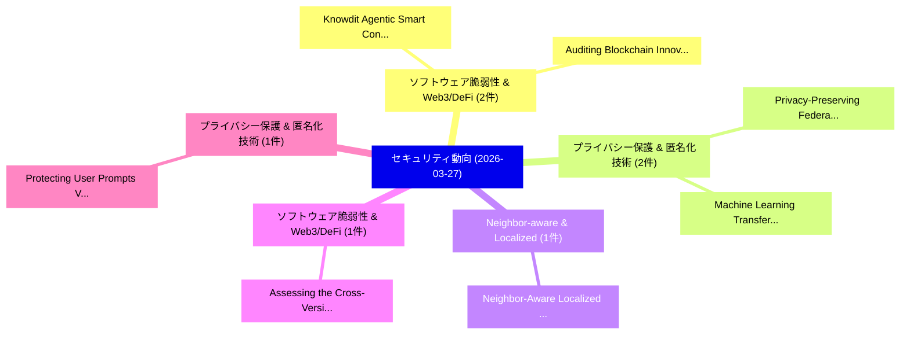

# 📅 02_daily: 日次エグゼクティブサマリー報告書 (2026-03-27)

**集計日時**: 2026-10-02 23:06:03 UTC  
**対象日付**: 2026-03-27  
**本日収集論文数**: 25 件  

---

## 💡 主要セキュリティ動向・脅威インサイト (Executive Insights)

本日の収集論文（計 25 件）において、以下の重点セキュリティ領域で活発な研究動向が確認されました：
- **ソフトウェア脆弱性 & Web3/DeFi** (2 件): 注目論文として 「Knowdit: Agentic Smart Contrac...」、「Auditing Blockchain Innovation...」 等が発表され、実務防御および攻撃検証の進展が見られます。
- **プライバシー保護 & 匿名化技術** (2 件): 注目論文として 「Privacy-Preserving Federated L...」、「Machine Learning Transferabili...」 等が発表され、実務防御および攻撃検証の進展が見られます。
- **Neighbor-aware & Localized** (1 件): 注目論文として 「Neighbor-Aware Localized Conce...」 等が発表され、実務防御および攻撃検証の進展が見られます。
- **ソフトウェア脆弱性 & Web3/DeFi** (1 件): 注目論文として 「Assessing the Cross-Version Ap...」 等が発表され、実務防御および攻撃検証の進展が見られます。
- **プライバシー保護 & 匿名化技術** (1 件): 注目論文として 「Protecting User Prompts Via Ch...」 等が発表され、実務防御および攻撃検証の進展が見られます。

### 🗺️ 技術・脅威トピックマインドマップ

---

## 📌 日次セキュリティ論文一覧 (日本語表形式)

| No | arXiv ID | 論文タイトル (日本語訳) | 重要キーワード | 構造化エグゼクティブ要約 (背景・提案・影響) | 脅威分類 | 詳細リンク |
|---|---|---|---|---|---|---|
| 1 | `2603.25994v1` | [Neighbor-Aware Localized Concept Erasure in Text-to-Image Diffusion Models（セキュリティ分析論文）](../../okf/papers/2026-03-27/2603.25994.md) | `Aware Localized Concept Erasure`, `Image Diffusion Models`, `Neighbor-Aware Localized` | 【提案】概要 (Overview & Key Finding) 本論文「Neighbor-Aware Localized Concept Erasure in Text-to-Ima...。実証評価により経営層・セキュリティ管理者向け推奨アクション (E... | `cs.CV` | [arXiv](https://arxiv.org/abs/2603.25994v1) &#124; [OKF](../../okf/papers/2026-03-27/2603.25994.md) |
| 2 | `2603.25997v2` | [Assessing the Cross-Version Applicability of Java Library Vulnerability Exploits（セキュリティ分析論文）](../../okf/papers/2026-03-27/2603.25997.md) | `Java Library Vulnerability Exploits`, `Version Applicability`, `Cross-Version Applicability` | 【提案】概要 (Overview & Key Finding) 本論文「Assessing the Cross-Version Applicability of Java Libra...。実証評価により経営層・セキュリティ管理者向け推奨アクション (E... | `executive-summary` | [arXiv](https://arxiv.org/abs/2603.25997v2) &#124; [OKF](../../okf/papers/2026-03-27/2603.25997.md) |
| 3 | `2603.26032v1` | [Protecting User Prompts Via Character-Level Differential Privacy（セキュリティ分析論文）](../../okf/papers/2026-03-27/2603.26032.md) | `Protecting User Prompts Via Character`, `Level Differential Privacy`, `Character-Level Differential` | 【提案】概要 (Overview & Key Finding) 本論文「Protecting User Prompts Via Character-Level 差分プライバシー（セキ...。実証評価により経営層・セキュリティ管理者向け推奨アクション (E... | `cybersecurity` | [arXiv](https://arxiv.org/abs/2603.26032v1) &#124; [OKF](../../okf/papers/2026-03-27/2603.26032.md) |
| 4 | `2603.26074v3` | [Not All Entities are Created Equal: A Dynamic Anonymization Framework for Privacy-Preserving RAG（セキュリティ分析論文）](../../okf/papers/2026-03-27/2603.26074.md) | `Created Equal`, `Privacy-Preserving RAG`, `Dynamic Anonymization Fr` | 【提案】背景とセキュリティ上の課題 (Background & Problem) 本研究はサイバー脅威環境におけるセキュリティ構造・脆弱性の検証を目的としています。(主要検出項目: ...。実証評価により経営層・セキュリティ管理者向け推奨アクション (E... | `cybersecurity` | [arXiv](https://arxiv.org/abs/2603.26074v3) &#124; [OKF](../../okf/papers/2026-03-27/2603.26074.md) |
| 5 | `2603.26093v2` | [ROAST: Risk-aware Outlier-exposure for Adversarial Selective Training of Anomaly Detectors Against Evasion Attacks（セキュリティ分析論文）](../../okf/papers/2026-03-27/2603.26093.md) | `Adversarial Selective Training`, `Risk-aware Outlier`, `Mohammed Elnawawy` | 【提案】概要 (Overview & Key Finding) 本論文「ROAST: Risk-aware Outlier-exposure for Adversarial Sele...。実証評価により経営層・セキュリティ管理者向け推奨アクション (E... | `cybersecurity` | [arXiv](https://arxiv.org/abs/2603.26093v2) &#124; [OKF](../../okf/papers/2026-03-27/2603.26093.md) |
| 6 | `2603.26167v2` | [Gaussian Shannon: High-Precision Diffusion Model Watermarking Based on Communication（セキュリティ分析論文）](../../okf/papers/2026-03-27/2603.26167.md) | `Precision Diffusion Model Watermarking Based`, `Gaussian Shannon`, `High-Precision Diffusion` | 【提案】概要 (Overview & Key Finding) 本論文「Gaussian Shannon: High-Precision Diffusion Model Waterm...。実証評価により経営層・セキュリティ管理者向け推奨アクション (E... | `cs.CV` | [arXiv](https://arxiv.org/abs/2603.26167v2) &#124; [OKF](../../okf/papers/2026-03-27/2603.26167.md) |
| 7 | `2603.26219v1` | [EPDQ: Efficient and Privacy-Preserving Exact Distance Query on Encrypted Graphs（セキュリティ分析論文）](../../okf/papers/2026-03-27/2603.26219.md) | `Preserving Exact Distance Query`, `Encrypted Graphs`, `Privacy-Preserving Exact` | 【提案】概要 (Overview & Key Finding) 本論文「EPDQ: Efficient and Privacy-Preserving Exact Distance Q...。実証評価により経営層・セキュリティ管理者向け推奨アクション (E... | `cybersecurity` | [arXiv](https://arxiv.org/abs/2603.26219v1) &#124; [OKF](../../okf/papers/2026-03-27/2603.26219.md) |
| 8 | `2603.26221v1` | [Clawed and Dangerous: Can We Trust Open Agentic Systems?（セキュリティ分析論文）](../../okf/papers/2026-03-27/2603.26221.md) | `Shiping Chen`, `Qin Wang`, `Guangsheng Yu` | 【提案】### (日本語題名: Clawed and Dangerous: Can We Trust Open Agentic Systems?（セキュリティ分析論文）)  > [!...。実証評価により経営層・セキュリティ管理者向け推奨アクション (E... | `cs.ET` | [arXiv](https://arxiv.org/abs/2603.26221v1) &#124; [OKF](../../okf/papers/2026-03-27/2603.26221.md) |
| 9 | `2603.26224v1` | [Privacy-Enhancing Encryption in Data Sharing: A Survey on Security, Performance and Functionality（セキュリティ分析論文）](../../okf/papers/2026-03-27/2603.26224.md) | `Enhancing Encryption`, `Data Sharing`, `Privacy-Enhancing Encryption` | 【提案】概要 (Overview & Key Finding) 本論文「Privacy-Enhancing Encryption in Data Sharing: A Survey ...。実証評価により経営層・セキュリティ管理者向け推奨アクション (E... | `cybersecurity` | [arXiv](https://arxiv.org/abs/2603.26224v1) &#124; [OKF](../../okf/papers/2026-03-27/2603.26224.md) |
| 10 | `2603.26270v2` | [Knowdit: Agentic Smart Contract 脆弱性検出 with Auditing Knowledge Summarization](../../okf/papers/2026-03-27/2603.26270.md) | `Auditing Knowledge Summarization`, `Agentic Smart Contract Vulnerability Detection`, `Agentic Smart Contract` | 【提案】概要 (Overview & Key Finding) 本論文「Knowdit: Agentic スマートコントラクト 脆弱性検出 with Auditing Knowled...。実証評価により経営層・セキュリティ管理者向け推奨アクション (E... | `cs.AI` | [arXiv](https://arxiv.org/abs/2603.26270v2) &#124; [OKF](../../okf/papers/2026-03-27/2603.26270.md) |
| 11 | `2603.26290v1` | [PEB Separation and State Migration: Unmasking the New Frontiers of DeFi AML Evasion（セキュリティ分析論文）](../../okf/papers/2026-03-27/2603.26290.md) | `State Migration`, `New Frontiers`, `Yixin Cao` | 【提案】概要 (Overview & Key Finding) 本論文「PEB Separation and State Migration: Unmasking the New F...。実証評価により経営層・セキュリティ管理者向け推奨アクション (E... | `q-fin.TR` | [arXiv](https://arxiv.org/abs/2603.26290v1) &#124; [OKF](../../okf/papers/2026-03-27/2603.26290.md) |
| 12 | `2603.26293v1` | [Bitcoin Smart Accounts: Trust-Minimized Native Bitcoin DeFi Infrastructure（セキュリティ分析論文）](../../okf/papers/2026-03-27/2603.26293.md) | `Bitcoin Smart Accounts`, `Minimized Native Bitcoin`, `Trust-Minimized Native` | 【提案】概要 (Overview & Key Finding) 本論文「Bitcoin Smart Accounts: Trust-Minimized Native Bitcoin ...。実証評価により経営層・セキュリティ管理者向け推奨アクション (E... | `cybersecurity` | [arXiv](https://arxiv.org/abs/2603.26293v1) &#124; [OKF](../../okf/papers/2026-03-27/2603.26293.md) |
| 13 | `2603.26343v1` | [Hermes Seal: Zero-Knowledge Assurance for Autonomous Vehicle Communications（セキュリティ分析論文）](../../okf/papers/2026-03-27/2603.26343.md) | `Autonomous Vehicle Communications`, `Hermes Seal`, `Knowledge Assurance` | 【提案】概要 (Overview & Key Finding) 本論文「Hermes Seal: Zero-Knowledge Assurance for Autonomous Ve...。実証評価により経営層・セキュリティ管理者向け推奨アクション (E... | `cybersecurity` | [arXiv](https://arxiv.org/abs/2603.26343v1) &#124; [OKF](../../okf/papers/2026-03-27/2603.26343.md) |
| 14 | `2603.26361v1` | [Auditing Blockchain Innovations: Technical Challenges Beyond Traditional Finance（セキュリティ分析論文）](../../okf/papers/2026-03-27/2603.26361.md) | `Technical Challenges Beyond Traditional Finance`, `Auditing Blockchain Innovations`, `Shayan Eskandari` | 【提案】概要 (Overview & Key Finding) 本論文「Auditing Blockchain Innovations: Technical Challenges B...。実証評価により経営層・セキュリティ管理者向け推奨アクション (E... | `cs.ET` | [arXiv](https://arxiv.org/abs/2603.26361v1) &#124; [OKF](../../okf/papers/2026-03-27/2603.26361.md) |
| 15 | `2603.26407v3` | [Hidden Elo: Private Matchmaking through Encrypted Rating Systems（セキュリティ分析論文）](../../okf/papers/2026-03-27/2603.26407.md) | `Encrypted Rating Systems`, `Hidden Elo`, `Private Matchmaking` | 【提案】概要 (Overview & Key Finding) 本論文「Hidden Elo: Private Matchmaking through Encrypted Ratin...。実証評価により経営層・セキュリティ管理者向け推奨アクション (E... | `cybersecurity` | [arXiv](https://arxiv.org/abs/2603.26407v3) &#124; [OKF](../../okf/papers/2026-03-27/2603.26407.md) |
| 16 | `2603.26409v1` | [Crypta PIR Scheme based on Linear Codes over Ringsの分析](../../okf/papers/2026-03-27/2603.26409.md) | `Linear Codes`, `Luana Kurmann`, `Svenja Lage` | 【提案】概要 (Overview & Key Finding) 本論文「Crypta PIR Scheme based on Linear Codes over Ringsの分析」（...。実証評価により経営層・セキュリティ管理者向け推奨アクション (E... | `executive-summary` | [arXiv](https://arxiv.org/abs/2603.26409v1) &#124; [OKF](../../okf/papers/2026-03-27/2603.26409.md) |
| 17 | `2603.26417v1` | [Privacy-Preserving Federated Learning using Hybrid Homomorphic Encryptionに向けて](../../okf/papers/2026-03-27/2603.26417.md) | `Preserving Federated Learning`, `Privacy-Preserving Federated`, `Hybrid Homomorphic Encryption` | 【提案】概要 (Overview & Key Finding) 本論文「Privacy-Preserving Federated Learning using Hybrid Homo...。実証評価により経営層・セキュリティ管理者向け推奨アクション (E... | `cybersecurity` | [arXiv](https://arxiv.org/abs/2603.26417v1) &#124; [OKF](../../okf/papers/2026-03-27/2603.26417.md) |
| 18 | `2603.26497v1` | [Reentrancy Detection in the Age of LLMs（セキュリティ分析論文）](../../okf/papers/2026-03-27/2603.26497.md) | `Reentrancy Detection`, `Dalila Ressi`, `Matteo Rizzo` | 【提案】概要 (Overview & Key Finding) 本論文「Reentrancy Detection in the Age of LLMs（セキュリティ分析論文）」（原題...。実証評価により経営層・セキュリティ管理者向け推奨アクション (E... | `executive-summary` | [arXiv](https://arxiv.org/abs/2603.26497v1) &#124; [OKF](../../okf/papers/2026-03-27/2603.26497.md) |
| 19 | `2603.26573v1` | [Evolution-Based Timed Opacity under a Universal Observation Model（セキュリティ分析論文）](../../okf/papers/2026-03-27/2603.26573.md) | `Based Timed Opacity`, `Universal Observation Model`, `Evolution-Based Timed` | 【提案】概要 (Overview & Key Finding) 本論文「Evolution-Based Timed Opacity under a Universal Observa...。実証評価により経営層・セキュリティ管理者向け推奨アクション (E... | `executive-summary` | [arXiv](https://arxiv.org/abs/2603.26573v1) &#124; [OKF](../../okf/papers/2026-03-27/2603.26573.md) |
| 20 | `2603.26632v1` | [Machine Learning Transferability for マルウェア検出](../../okf/papers/2026-03-27/2603.26632.md) | `Machine Learning Transferability`, `Malware Detection`, `Eva Maia` | 【提案】概要 (Overview & Key Finding) 本論文「Machine Learning Transferability for マルウェア検出」（原題: Machi...。実証評価により経営層・セキュリティ管理者向け推奨アクション (E... | `cs.AI` | [arXiv](https://arxiv.org/abs/2603.26632v1) &#124; [OKF](../../okf/papers/2026-03-27/2603.26632.md) |
| 21 | `2603.26833v1` | [SPARK: Secure Predictive Autoscaling for Robust Kubernetes（セキュリティ分析論文）](../../okf/papers/2026-03-27/2603.26833.md) | `Secure Predictive Autoscaling`, `Robust Kubernetes`, `Amin Milani Fard` | 【提案】概要 (Overview & Key Finding) 本論文「SPARK: Secure Predictive Autoscaling for Robust Kuberne...。実証評価により経営層・セキュリティ管理者向け推奨アクション (E... | `cybersecurity` | [arXiv](https://arxiv.org/abs/2603.26833v1) &#124; [OKF](../../okf/papers/2026-03-27/2603.26833.md) |
| 22 | `2603.26890v1` | [Privacy-Preserving Iris Recognition: Performance Challenges and Outlook（セキュリティ分析論文）](../../okf/papers/2026-03-27/2603.26890.md) | `Preserving Iris Recognition`, `Performance Challenges`, `Privacy-Preserving Iris` | 【提案】概要 (Overview & Key Finding) 本論文「Privacy-Preserving Iris Recognition: Performance Challe...。実証評価により経営層・セキュリティ管理者向け推奨アクション (E... | `cs.CV` | [arXiv](https://arxiv.org/abs/2603.26890v1) &#124; [OKF](../../okf/papers/2026-03-27/2603.26890.md) |
| 23 | `2603.26907v3` | [Information-Theoretic Solutions for Seedless QRNG Bootstrapping and Hybrid PQC-QKD Key Combination（セキュリティ分析論文）](../../okf/papers/2026-03-27/2603.26907.md) | `Theoretic Solutions`, `Key Combination`, `Information-Theoretic Solutions` | 【提案】概要 (Overview & Key Finding) 本論文「Information-Theoretic Solutions for Seedless QRNG Boots...。実証評価により経営層・セキュリティ管理者向け推奨アクション (E... | `executive-summary` | [arXiv](https://arxiv.org/abs/2603.26907v3) &#124; [OKF](../../okf/papers/2026-03-27/2603.26907.md) |
| 24 | `2603.26963v1` | [On the Optimal Number of Grids for Differentially Private Non-Interactive $K$-Means Clustering（セキュリティ分析論文）](../../okf/papers/2026-03-27/2603.26963.md) | `Differentially Private Non`, `Optimal Number`, `Means Clustering` | 【提案】概要 (Overview & Key Finding) 本論文「On the Optimal Number of Grids for Differentially Priva...。実証評価により経営層・セキュリティ管理者向け推奨アクション (E... | `executive-summary` | [arXiv](https://arxiv.org/abs/2603.26963v1) &#124; [OKF](../../okf/papers/2026-03-27/2603.26963.md) |
| 25 | `2603.26970v2` | [HFIPay: Privacy-Preserving, Cross-Chain Cryptocurrency Payments to Human-Friendly Identifiers（セキュリティ分析論文）](../../okf/papers/2026-03-27/2603.26970.md) | `Chain Cryptocurrency Payments`, `Cross-Chain Cryptocurrency`, `Friendly Identifiers` | 【提案】概要 (Overview & Key Finding) 本論文「HFIPay: Privacy-Preserving, Cross-Chain Cryptocurrency ...。実証評価により経営層・セキュリティ管理者向け推奨アクション (E... | `executive-summary` | [arXiv](https://arxiv.org/abs/2603.26970v2) &#124; [OKF](../../okf/papers/2026-03-27/2603.26970.md) |

