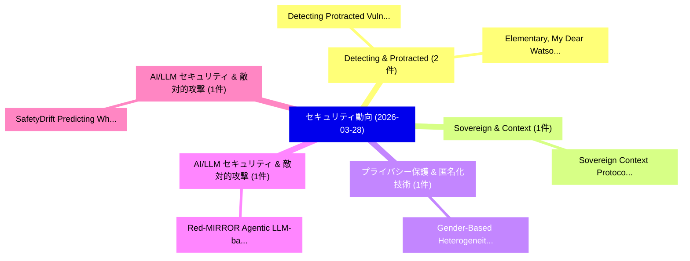

# 📅 02_daily: 日次エグゼクティブサマリー報告書 (2026-03-28)

**集計日時**: 2026-10-02 23:06:03 UTC  
**対象日付**: 2026-03-28  
**本日収集論文数**: 15 件  

---

## 💡 主要セキュリティ動向・脅威インサイト (Executive Insights)

本日の収集論文（計 15 件）において、以下の重点セキュリティ領域で活発な研究動向が確認されました：
- **Detecting & Protracted** (2 件): 注目論文として 「Detecting Protracted Vulnerabi...」、「"Elementary, My Dear Watson." ...」 等が発表され、実務防御および攻撃検証の進展が見られます。
- **Sovereign & Context** (1 件): 注目論文として 「Sovereign Context Protocol: An...」 等が発表され、実務防御および攻撃検証の進展が見られます。
- **プライバシー保護 & 匿名化技術** (1 件): 注目論文として 「Gender-Based Heterogeneity in ...」 等が発表され、実務防御および攻撃検証の進展が見られます。
- **AI/LLM セキュリティ & 敵対的攻撃** (1 件): 注目論文として 「Red-MIRROR: Agentic LLM-based ...」 等が発表され、実務防御および攻撃検証の進展が見られます。
- **AI/LLM セキュリティ & 敵対的攻撃** (1 件): 注目論文として 「SafetyDrift: Predicting When A...」 等が発表され、実務防御および攻撃検証の進展が見られます。

### 🗺️ 技術・脅威トピックマインドマップ

---

## 📌 日次セキュリティ論文一覧 (日本語表形式)

| No | arXiv ID | 論文タイトル (日本語訳) | 重要キーワード | 構造化エグゼクティブ要約 (背景・提案・影響) | 脅威分類 | 詳細リンク |
|---|---|---|---|---|---|---|
| 1 | `2603.27067v1` | [Detecting Protracted Vulnerabilities in Open Source Projects（セキュリティ分析論文）](../../okf/papers/2026-03-28/2603.27067.md) | `Detecting Protracted Vulnerabilities`, `Open Source Projects`, `Sara Al Hajj Ibrahim` | 【提案】概要 (Overview & Key Finding) 本論文「Detecting Protracted Vulnerabilities in Open Source Pro...。実証評価により経営層・セキュリティ管理者向け推奨アクション (E... | `executive-summary` | [arXiv](https://arxiv.org/abs/2603.27067v1) &#124; [OKF](../../okf/papers/2026-03-28/2603.27067.md) |
| 2 | `2603.27094v1` | [Sovereign Context Protocol: An Open Attribution Layer for Human-Generated Content in the Age of 大規模言語モデル](../../okf/papers/2026-03-28/2603.27094.md) | `Sovereign Context Protocol`, `Generated Content`, `Human-Generated Content` | 【提案】概要 (Overview & Key Finding) 本論文「Sovereign Context Protocol: An Open Attribution Layer f...。実証評価により経営層・セキュリティ管理者向け推奨アクション (E... | `cs.AI` | [arXiv](https://arxiv.org/abs/2603.27094v1) &#124; [OKF](../../okf/papers/2026-03-28/2603.27094.md) |
| 3 | `2603.27117v2` | [Gender-Based Heterogeneity in Youth Privacy-Protective Behavior for Smart Voice Assistants: Evidence from Multigroup PLS-SEM（セキュリティ分析論文）](../../okf/papers/2026-03-28/2603.27117.md) | `Smart Voice Assistants`, `Based Heterogeneity`, `Youth Privacy` | 【提案】概要 (Overview & Key Finding) 本論文「Gender-Based Heterogeneity in Youth Privacy-Protective ...。実証評価により経営層・セキュリティ管理者向け推奨アクション (E... | `cs.AI` | [arXiv](https://arxiv.org/abs/2603.27117v2) &#124; [OKF](../../okf/papers/2026-03-28/2603.27117.md) |
| 4 | `2603.27127v1` | [Red-MIRROR: Agentic LLM-based Autonomous Penetration Testing with Reflective Verification and Knowledge-augmented Interaction（セキュリティ分析論文）](../../okf/papers/2026-03-28/2603.27127.md) | `Autonomous Penetration Testing`, `Reflective Verification`, `LLM-based Autonomous` | 【提案】概要 (Overview & Key Finding) 本論文「Red-MIRROR: Agentic LLM-based Autonomous Penetration Te...。実証評価により経営層・セキュリティ管理者向け推奨アクション (E... | `cybersecurity` | [arXiv](https://arxiv.org/abs/2603.27127v1) &#124; [OKF](../../okf/papers/2026-03-28/2603.27127.md) |
| 5 | `2603.27148v1` | [SafetyDrift: Predicting When AI Agents Cross the Line Before They Actually Do（セキュリティ分析論文）](../../okf/papers/2026-03-28/2603.27148.md) | `Agents Cross`, `Aditya Dhodapkar`, `Farhaan Pishori` | 【提案】概要 (Overview & Key Finding) 本論文「SafetyDrift: Predicting When AI Agents Cross the Line B...。実証評価により経営層・セキュリティ管理者向け推奨アクション (E... | `cs.AI` | [arXiv](https://arxiv.org/abs/2603.27148v1) &#124; [OKF](../../okf/papers/2026-03-28/2603.27148.md) |
| 6 | `2603.27190v2` | [Spectral Method attacks Sparse LWE, Sparse LPN and Beyond（セキュリティ分析論文）](../../okf/papers/2026-03-28/2603.27190.md) | `Shashwat Agrawal`, `Amitabha Bagchi`, `Rajendra Kumar` | 【提案】概要 (Overview & Key Finding) 本論文「Spectral Method attacks Sparse LWE, Sparse LPN and Beyo...。実証評価により経営層・セキュリティ管理者向け推奨アクション (E... | `cybersecurity` | [arXiv](https://arxiv.org/abs/2603.27190v2) &#124; [OKF](../../okf/papers/2026-03-28/2603.27190.md) |
| 7 | `2603.27204v1` | ["Elementary, My Dear Watson." Detecting Malicious Skills via Neuro-Symbolic Reasoning across Heterogeneous Artifacts（セキュリティ分析論文）](../../okf/papers/2026-03-28/2603.27204.md) | `Detecting Malicious Skills`, `Symbolic Reasoning`, `Heterogeneous Artifacts` | 【提案】概要 (Overview & Key Finding) 本論文「"Elementary, My Dear Watson." Detecting Malicious Skill...。実証評価により経営層・セキュリティ管理者向け推奨アクション (E... | `executive-summary` | [arXiv](https://arxiv.org/abs/2603.27204v1) &#124; [OKF](../../okf/papers/2026-03-28/2603.27204.md) |
| 8 | `2603.27224v4` | [Finding Memory Leaks in C/C++ Programs via Neuro-Symbolic Augmented Static Analysis（セキュリティ分析論文）](../../okf/papers/2026-03-28/2603.27224.md) | `Finding Memory Leaks`, `Neuro-Symbolic Augmented`, `Symbolic Augmented Stat` | 【提案】概要 (Overview & Key Finding) 本論文「Finding Memory Leaks in C/C++ Programs via Neuro-Symbol...。実証評価により経営層・セキュリティ管理者向け推奨アクション (E... | `executive-summary` | [arXiv](https://arxiv.org/abs/2603.27224v4) &#124; [OKF](../../okf/papers/2026-03-28/2603.27224.md) |
| 9 | `2603.27278v1` | [Quantum Bit Error Rate Analysis in BB84 Quantum Key Distribution: Measurement, Statistical Estimation, and Eavesdropping Detection（セキュリティ分析論文）](../../okf/papers/2026-03-28/2603.27278.md) | `Quantum Key Distribution`, `Statistical Estimation`, `Eavesdropping Detection` | 【提案】概要 (Overview & Key Finding) 本論文「量子 Bit Error Rate Analysis in BB84 量子鍵配送: Measurement, ...。実証評価により経営層・セキュリティ管理者向け推奨アクション (E... | `executive-summary` | [arXiv](https://arxiv.org/abs/2603.27278v1) &#124; [OKF](../../okf/papers/2026-03-28/2603.27278.md) |
| 10 | `2603.27326v1` | [Context-Aware Phishing Email Detection Using Machine Learning and NLP（セキュリティ分析論文）](../../okf/papers/2026-03-28/2603.27326.md) | `Aware Phishing Email Detection Using Machine Learning`, `Context-Aware Phishing`, `Amitabh Chakravorty` | 【提案】概要 (Overview & Key Finding) 本論文「Context-Aware Phishing Email Detection Using Machine Le...。実証評価により経営層・セキュリティ管理者向け推奨アクション (E... | `cybersecurity` | [arXiv](https://arxiv.org/abs/2603.27326v1) &#124; [OKF](../../okf/papers/2026-03-28/2603.27326.md) |
| 11 | `2603.27439v1` | [Attacking AI Accelerators by Leveraging Arithmetic Properties of Addition（セキュリティ分析論文）](../../okf/papers/2026-03-28/2603.27439.md) | `Leveraging Arithmetic Properties`, `Biresh Kumar Joardar`, `Masoud Heidary` | 【提案】概要 (Overview & Key Finding) 本論文「Attacking AI Accelerators by Leveraging Arithmetic Prop...。実証評価により経営層・セキュリティ管理者向け推奨アクション (E... | `executive-summary` | [arXiv](https://arxiv.org/abs/2603.27439v1) &#124; [OKF](../../okf/papers/2026-03-28/2603.27439.md) |
| 12 | `2603.28807v1` | [SafeClaw-R: Safe and Secure Multi-Agent Personal Assistantsに向けて](../../okf/papers/2026-03-28/2603.28807.md) | `Secure Multi`, `Multi-Agent Personal`, `Agent Personal Assistants` | 【提案】概要 (Overview & Key Finding) 本論文「SafeClaw-R: Safe and Secure Multi-Agent Personal Assist...。実証評価によりPoskitt, Jun Sun -。 | `cybersecurity` | [arXiv](https://arxiv.org/abs/2603.28807v1) &#124; [OKF](../../okf/papers/2026-03-28/2603.28807.md) |
| 13 | `2603.28815v1` | [SkillTester: Utility and Security of Agent Skillsのベンチマーク評価](../../okf/papers/2026-03-28/2603.28815.md) | `Benchmarking Utility`, `Agent Skills`, `Leye Wang` | 【提案】概要 (Overview & Key Finding) 本論文「SkillTester: Utility and Security of Agent Skillsのベンチマー...。実証評価により経営層・セキュリティ管理者向け推奨アクション (E... | `cs.AI` | [arXiv](https://arxiv.org/abs/2603.28815v1) &#124; [OKF](../../okf/papers/2026-03-28/2603.28815.md) |
| 14 | `2603.28817v1` | [GUARD-SLM: Token Activation-Based Defense Against Jailbreak Attacks for Small Language Models（セキュリティ分析論文）](../../okf/papers/2026-03-28/2603.28817.md) | `Small Language Models`, `Token Activation`, `Activation-Based Defense` | 【提案】概要 (Overview & Key Finding) 本論文「GUARD-SLM: Token Activation-Based Defense Against ジェイルブ...。実証評価により経営層・セキュリティ管理者向け推奨アクション (E... | `cs.AI` | [arXiv](https://arxiv.org/abs/2603.28817v1) &#124; [OKF](../../okf/papers/2026-03-28/2603.28817.md) |
| 15 | `2605.02900v2` | [Safety in Embodied AI: A Survey of Risks, Attacks, and Defenses（セキュリティ分析論文）](../../okf/papers/2026-03-28/2605.02900.md) | `Xiao Li`, `Xiang Zheng`, `Yifeng Gao` | 【提案】概要 (Overview & Key Finding) 本論文「Safety in Embodied AI: A Survey of Risks, Attacks, and ...。実証評価により経営層・セキュリティ管理者向け推奨アクション (E... | `cs.AI` | [arXiv](https://arxiv.org/abs/2605.02900v2) &#124; [OKF](../../okf/papers/2026-03-28/2605.02900.md) |

