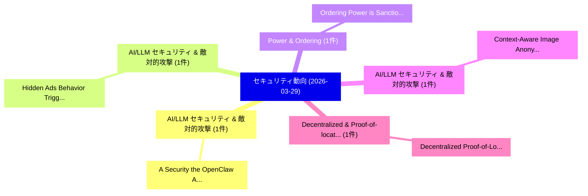

# 📅 02_daily: 日次エグゼクティブサマリー報告書 (2026-03-29)

**集計日時**: 2026-10-02 23:06:03 UTC  
**対象日付**: 2026-03-29  
**本日収集論文数**: 7 件  

---

## 💡 主要セキュリティ動向・脅威インサイト (Executive Insights)

本日の収集論文（計 7 件）において、以下の重点セキュリティ領域で活発な研究動向が確認されました：
- **AI/LLM セキュリティ & 敵対的攻撃** (1 件): 注目論文として 「A Security the OpenClaw AI Age...」 等が発表され、実務防御および攻撃検証の進展が見られます。
- **AI/LLM セキュリティ & 敵対的攻撃** (1 件): 注目論文として 「Hidden Ads: Behavior Triggered...」 等が発表され、実務防御および攻撃検証の進展が見られます。
- **Power & Ordering** (1 件): 注目論文として 「Ordering Power is Sanctioning ...」 等が発表され、実務防御および攻撃検証の進展が見られます。
- **AI/LLM セキュリティ & 敵対的攻撃** (1 件): 注目論文として 「Context-Aware Image Anonymizat...」 等が発表され、実務防御および攻撃検証の進展が見られます。
- **Decentralized & Proof-of-location** (1 件): 注目論文として 「Decentralized Proof-of-Locatio...」 等が発表され、実務防御および攻撃検証の進展が見られます。

### 🗺️ 技術・脅威トピックマインドマップ

---

## 📌 日次セキュリティ論文一覧 (日本語表形式)

| No | arXiv ID | 論文タイトル (日本語訳) | 重要キーワード | 構造化エグゼクティブ要約 (背景・提案・影響) | 脅威分類 | 詳細リンク |
|---|---|---|---|---|---|---|
| 1 | `2603.27517v3` | [A Security the OpenClaw AI Agent Frameworkの分析](../../okf/papers/2026-03-29/2603.27517.md) | `Surada Suwansathit`, `Yuxuan Zhang`, `Guofei Gu` | 【提案】概要 (Overview & Key Finding) 本論文「A Security the OpenClaw AI Agent Frameworkの分析」（原題: A Se...。実証評価により経営層・セキュリティ管理者向け推奨アクション (E... | `cs.AI` | [arXiv](https://arxiv.org/abs/2603.27517v3) &#124; [OKF](../../okf/papers/2026-03-29/2603.27517.md) |
| 2 | `2603.27522v1` | [Hidden Ads: Behavior Triggered Semantic Backdoors for Advertisement Injection in Vision Language Models（セキュリティ分析論文）](../../okf/papers/2026-03-29/2603.27522.md) | `Behavior Triggered Semantic Backdoors`, `Vision Language Models`, `Hidden Ads` | 【提案】概要 (Overview & Key Finding) 本論文「Hidden Ads: Behavior Triggered Semantic Backdoors for A...。実証評価により経営層・セキュリティ管理者向け推奨アクション (E... | `executive-summary` | [arXiv](https://arxiv.org/abs/2603.27522v1) &#124; [OKF](../../okf/papers/2026-03-29/2603.27522.md) |
| 3 | `2603.27739v2` | [Ordering Power is Sanctioning Power: Sanction Evasion-MEV and the Limits of On-Chain Enforcement（セキュリティ分析論文）](../../okf/papers/2026-03-29/2603.27739.md) | `Ordering Power`, `Sanctioning Power`, `Sanction Evasion` | 【提案】概要 (Overview & Key Finding) 本論文「Ordering Power is Sanctioning Power: Sanction Evasion-M...。実証評価により経営層・セキュリティ管理者向け推奨アクション (E... | `cybersecurity` | [arXiv](https://arxiv.org/abs/2603.27739v2) &#124; [OKF](../../okf/papers/2026-03-29/2603.27739.md) |
| 4 | `2603.27817v3` | [Context-Aware Image Anonymization with Multi-Agent Reasoningに向けて](../../okf/papers/2026-03-29/2603.27817.md) | `Aware Image Anonymization`, `Context-Aware Image`, `Towards Context` | 【提案】概要 (Overview & Key Finding) 本論文「Context-Aware Image Anonymization with Multi-Agent Reas...。実証評価により経営層・セキュリティ管理者向け推奨アクション (E... | `cs.AI` | [arXiv](https://arxiv.org/abs/2603.27817v3) &#124; [OKF](../../okf/papers/2026-03-29/2603.27817.md) |
| 5 | `2603.27883v1` | [Decentralized Proof-of-Location for Content Provenance: Capture-Time Authenticityに向けて](../../okf/papers/2026-03-29/2603.27883.md) | `Decentralized Proof`, `Content Provenance`, `Towards Capture` | 【提案】概要 (Overview & Key Finding) 本論文「Decentralized Proof-of-Location for Content Provenance:...。実証評価により経営層・セキュリティ管理者向け推奨アクション (E... | `cybersecurity` | [arXiv](https://arxiv.org/abs/2603.27883v1) &#124; [OKF](../../okf/papers/2026-03-29/2603.27883.md) |
| 6 | `2603.28824v1` | [SNEAKDOOR: Stealthy Backdoor Attacks against Distribution Matching-based Dataset Condensation（セキュリティ分析論文）](../../okf/papers/2026-03-29/2603.28824.md) | `Stealthy Backdoor Attacks`, `Distribution Matching`, `Dataset Condensation` | 【提案】概要 (Overview & Key Finding) 本論文「SNEAKDOOR: Stealthy Backdoor Attacks against Distributi...。実証評価により経営層・セキュリティ管理者向け推奨アクション (E... | `cs.AI` | [arXiv](https://arxiv.org/abs/2603.28824v1) &#124; [OKF](../../okf/papers/2026-03-29/2603.28824.md) |
| 7 | `2605.06669v2` | [Evaluating Prompt Injection Defenses for Educational LLM Tutors: Security-Usability-Latency Trade-offs（セキュリティ分析論文）](../../okf/papers/2026-03-29/2605.06669.md) | `Evaluating Prompt Injection Defenses`, `Latency Trade`, `Raw Meta` | 【提案】概要 (Overview & Key Finding) 本論文「Evaluating プロンプトインジェクション Defenses for Educational LLM T...。実証評価により経営層・セキュリティ管理者向け推奨アクション (E... | `cs.AI` | [arXiv](https://arxiv.org/abs/2605.06669v2) &#124; [OKF](../../okf/papers/2026-03-29/2605.06669.md) |

