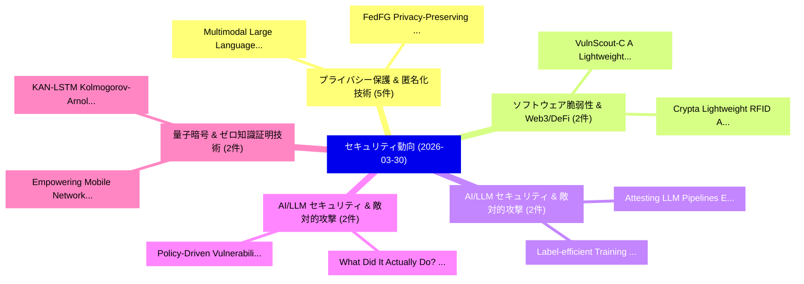

# 📅 02_daily: 日次エグゼクティブサマリー報告書 (2026-03-30)

**集計日時**: 2026-10-02 23:06:03 UTC  
**対象日付**: 2026-03-30  
**本日収集論文数**: 34 件  

---

## 💡 主要セキュリティ動向・脅威インサイト (Executive Insights)

本日の収集論文（計 34 件）において、以下の重点セキュリティ領域で活発な研究動向が確認されました：
- **プライバシー保護 & 匿名化技術** (5 件): 注目論文として 「Multimodal Large Language Mode...」、「FedFG: Privacy-Preserving and ...」 等が発表され、実務防御および攻撃検証の進展が見られます。
- **ソフトウェア脆弱性 & Web3/DeFi** (2 件): 注目論文として 「VulnScout-C: A Lightweight Tra...」、「Crypta Lightweight RFID Authen...」 等が発表され、実務防御および攻撃検証の進展が見られます。
- **AI/LLM セキュリティ & 敵対的攻撃** (2 件): 注目論文として 「Label-efficient Training Updat...」、「Attesting LLM Pipelines: Enfor...」 等が発表され、実務防御および攻撃検証の進展が見られます。
- **AI/LLM セキュリティ & 敵対的攻撃** (2 件): 注目論文として 「"What Did It Actually Do?": Un...」、「Policy-Driven Vulnerability Ri...」 等が発表され、実務防御および攻撃検証の進展が見られます。
- **量子暗号 & ゼロ知識証明技術** (2 件): 注目論文として 「Empowering Mobile Networks Sec...」、「KAN-LSTM: Kolmogorov-Arnold Ne...」 等が発表され、実務防御および攻撃検証の進展が見られます。

### 🗺️ 技術・脅威トピックマインドマップ

---

## 📌 日次セキュリティ論文一覧 (日本語表形式)

| No | arXiv ID | 論文タイトル (日本語訳) | 重要キーワード | 構造化エグゼクティブ要約 (背景・提案・影響) | 脅威分類 | 詳細リンク |
|---|---|---|---|---|---|---|
| 1 | `2603.27918v1` | [Multimodal Large Language Models: A Comprehensive Surveyに対する敵対的攻撃](../../okf/papers/2026-03-30/2603.27918.md) | `Multimodal Large Language Models`, `Adversarial Attacks`, `Comprehensive Survey` | 【提案】概要 (Overview & Key Finding) 本論文「Multimodal Large Language Models: A Comprehensive Surve...。実証評価により経営層・セキュリティ管理者向け推奨アクション (E... | `cs.AI` | [arXiv](https://arxiv.org/abs/2603.27918v1) &#124; [OKF](../../okf/papers/2026-03-30/2603.27918.md) |
| 2 | `2603.27986v1` | [FedFG: Privacy-Preserving and Robust 連合学習 via Flow-Matching Generation](../../okf/papers/2026-03-30/2603.27986.md) | `Matching Generation`, `Flow-Matching Generation`, `Robust Federated Learning` | 【提案】概要 (Overview & Key Finding) 本論文「FedFG: Privacy-Preserving and Robust 連合学習 via Flow-Matc...。実証評価により経営層・セキュリティ管理者向け推奨アクション (E... | `cs.AI` | [arXiv](https://arxiv.org/abs/2603.27986v1) &#124; [OKF](../../okf/papers/2026-03-30/2603.27986.md) |
| 3 | `2603.28013v3` | [Kill-Chain Canaries: Stage-Level Tracking of Prompt Injection Across Attack Surfaces and Model Safety Tiers（セキュリティ分析論文）](../../okf/papers/2026-03-30/2603.28013.md) | `Prompt Injection Across Attack Surfaces`, `Model Safety Tiers`, `Chain Canaries` | 【提案】概要 (Overview & Key Finding) 本論文「Kill-Chain Canaries: Stage-Level Tracking of プロンプトインジェク...。実証評価により経営層・セキュリティ管理者向け推奨アクション (E... | `cs.AI` | [arXiv](https://arxiv.org/abs/2603.28013v3) &#124; [OKF](../../okf/papers/2026-03-30/2603.28013.md) |
| 4 | `2603.28043v1` | [Seeing the Unseen: Rethinking Illicit Promotion Detection with In-Context Learning（セキュリティ分析論文）](../../okf/papers/2026-03-30/2603.28043.md) | `Rethinking Illicit Promotion Detection`, `Context Learning`, `In-Context Learning` | 【提案】概要 (Overview & Key Finding) 本論文「Seeing the Unseen: Rethinking Illicit Promotion Detecti...。実証評価により経営層・セキュリティ管理者向け推奨アクション (E... | `cybersecurity` | [arXiv](https://arxiv.org/abs/2603.28043v1) &#124; [OKF](../../okf/papers/2026-03-30/2603.28043.md) |
| 5 | `2603.28128v2` | [ORACAL: A Robust and Explainable Multimodal Framework for Smart Contract 脆弱性検出 with Causal Graph Enrichment](../../okf/papers/2026-03-30/2603.28128.md) | `Causal Graph Enrichment`, `Smart Contract Vulnerability Detection`, `Smart Contract` | 【提案】概要 (Overview & Key Finding) 本論文「ORACAL: A Robust and Explainable Multimodal Framework f...。実証評価により経営層・セキュリティ管理者向け推奨アクション (E... | `executive-summary` | [arXiv](https://arxiv.org/abs/2603.28128v2) &#124; [OKF](../../okf/papers/2026-03-30/2603.28128.md) |
| 6 | `2603.28143v1` | [Silent Guardians: Independent and Secure Decision Tree Evaluation Without Chatter（セキュリティ分析論文）](../../okf/papers/2026-03-30/2603.28143.md) | `Silent Guardians`, `Liang Feng Zhang`, `Jinyuan Li` | 【提案】背景とセキュリティ上の課題 (Background & Problem) 本研究はサイバー脅威環境におけるセキュリティ構造・脆弱性の検証を目的としています。(主要検出項目: ...。実証評価により経営層・セキュリティ管理者向け推奨アクション (E... | `cybersecurity` | [arXiv](https://arxiv.org/abs/2603.28143v1) &#124; [OKF](../../okf/papers/2026-03-30/2603.28143.md) |
| 7 | `2603.28166v2` | [Evaluating Privilege Usage of Agents with Real-World Tools（セキュリティ分析論文）](../../okf/papers/2026-03-30/2603.28166.md) | `Evaluating Privilege Usage`, `World Tools`, `Real-World Tools` | 【提案】概要 (Overview & Key Finding) 本論文「Evaluating Privilege Usage of Agents with Real-World To...。実証評価により経営層・セキュリティ管理者向け推奨アクション (E... | `cs.AI` | [arXiv](https://arxiv.org/abs/2603.28166v2) &#124; [OKF](../../okf/papers/2026-03-30/2603.28166.md) |
| 8 | `2603.28252v2` | [Secret Key Rate RIS-Assisted THz MIMO CV-QKD Systems under Access-Constrained Eavesdroppingの分析](../../okf/papers/2026-03-30/2603.28252.md) | `RIS-Assisted THz`, `CV-QKD Systems`, `Secret Key Rate` | 【提案】概要 (Overview & Key Finding) 本論文「Secret Key Rate RIS-Assisted THz MIMO CV-QKD Systems un...。実証評価により経営層・セキュリティ管理者向け推奨アクション (E... | `executive-summary` | [arXiv](https://arxiv.org/abs/2603.28252v2) &#124; [OKF](../../okf/papers/2026-03-30/2603.28252.md) |
| 9 | `2603.28309v1` | [VulnScout-C: A Lightweight Transformer for C Code 脆弱性検出](../../okf/papers/2026-03-30/2603.28309.md) | `Lightweight Transformer`, `Code Vulnerability Detection`, `Aymen Lassoued` | 【提案】概要 (Overview & Key Finding) 本論文「VulnScout-C: A Lightweight Transformer for C Code 脆弱性検出...。実証評価により経営層・セキュリティ管理者向け推奨アクション (E... | `cybersecurity` | [arXiv](https://arxiv.org/abs/2603.28309v1) &#124; [OKF](../../okf/papers/2026-03-30/2603.28309.md) |
| 10 | `2603.28313v1` | [Crypta Lightweight RFID Authentication Protocol Based on a Variable Matrix Encryption Algorithmの分析](../../okf/papers/2026-03-30/2603.28313.md) | `Authentication Protocol Based`, `Variable Matrix Encryption`, `Variable Matrix Encryption Algorithm` | 【提案】概要 (Overview & Key Finding) 本論文「Crypta Lightweight RFID Authentication Protocol Based o...。実証評価により経営層・セキュリティ管理者向け推奨アクション (E... | `cybersecurity` | [arXiv](https://arxiv.org/abs/2603.28313v1) &#124; [OKF](../../okf/papers/2026-03-30/2603.28313.md) |
| 11 | `2603.28396v1` | [Label-efficient Training Updates for マルウェア検出 over Time](../../okf/papers/2026-03-30/2603.28396.md) | `Training Updates`, `Label-efficient Training`, `Malware Detection` | 【提案】概要 (Overview & Key Finding) 本論文「Label-efficient Training Updates for マルウェア検出 over Time」...。実証評価により経営層・セキュリティ管理者向け推奨アクション (E... | `executive-summary` | [arXiv](https://arxiv.org/abs/2603.28396v1) &#124; [OKF](../../okf/papers/2026-03-30/2603.28396.md) |
| 12 | `2603.28434v1` | [Democratizing 連合学習 with Blockchain and Multi-Task Peer Prediction](../../okf/papers/2026-03-30/2603.28434.md) | `Task Peer Prediction`, `Multi-Task Peer`, `Democratizing Federated Learning` | 【提案】概要 (Overview & Key Finding) 本論文「Democratizing 連合学習 with Blockchain and Multi-Task Peer ...。実証評価により経営層・セキュリティ管理者向け推奨アクション (E... | `executive-summary` | [arXiv](https://arxiv.org/abs/2603.28434v1) &#124; [OKF](../../okf/papers/2026-03-30/2603.28434.md) |
| 13 | `2603.28546v2` | [Shy Guys: A Light-Weight Approach to Detecting Robots on Websites（セキュリティ分析論文）](../../okf/papers/2026-03-30/2603.28546.md) | `Shy Guys`, `Detecting Robots`, `Van Boxem` | 【提案】概要 (Overview & Key Finding) 本論文「Shy Guys: A Light-Weight Approach to Detecting Robots o...。実証評価により経営層・セキュリティ管理者向け推奨アクション (E... | `cs.NI` | [arXiv](https://arxiv.org/abs/2603.28546v2) &#124; [OKF](../../okf/papers/2026-03-30/2603.28546.md) |
| 14 | `2603.28551v2` | ["What Did It Actually Do?": Understanding Risk Awareness and Traceability for Computer-Use Agents（セキュリティ分析論文）](../../okf/papers/2026-03-30/2603.28551.md) | `Understanding Risk Awareness`, `Use Agents`, `Computer-Use Agents` | 【提案】概要 (Overview & Key Finding) 本論文「"What Did It Actually Do?": Understanding Risk Awarenes...。実証評価により経営層・セキュリティ管理者向け推奨アクション (E... | `cs.ET` | [arXiv](https://arxiv.org/abs/2603.28551v2) &#124; [OKF](../../okf/papers/2026-03-30/2603.28551.md) |
| 15 | `2603.28594v2` | [Adversarial Attacks in Robotic Perceptionの検出](../../okf/papers/2026-03-30/2603.28594.md) | `Adversarial Attacks`, `Robotic Perception`, `Sorin Mihai Grigorescu` | 【提案】概要 (Overview & Key Finding) 本論文「敵対的攻撃s in Robotic Perceptionの検出」（原題: Detection of 敵対的攻撃...。実証評価により経営層・セキュリティ管理者向け推奨アクション (E... | `cs.AI` | [arXiv](https://arxiv.org/abs/2603.28594v2) &#124; [OKF](../../okf/papers/2026-03-30/2603.28594.md) |
| 16 | `2603.28613v1` | [TGIF2: Extended Text-Guided Inpainting Forgery Dataset & Benchmark（セキュリティ分析論文）](../../okf/papers/2026-03-30/2603.28613.md) | `Guided Inpainting Forgery Dataset`, `Extended Text`, `Text-Guided Inpainting` | 【提案】概要 (Overview & Key Finding) 本論文「TGIF2: Extended Text-Guided Inpainting Forgery Dataset ...。実証評価により経営層・セキュリティ管理者向け推奨アクション (E... | `cs.AI` | [arXiv](https://arxiv.org/abs/2603.28613v1) &#124; [OKF](../../okf/papers/2026-03-30/2603.28613.md) |
| 17 | `2603.28626v1` | [Empowering Mobile Networks Security Resilience by using Post-Quantum Cryptography（セキュリティ分析論文）](../../okf/papers/2026-03-30/2603.28626.md) | `Empowering Mobile Networks Security Resilience`, `Quantum Cryptography`, `Post-Quantum Cryptography` | 【提案】概要 (Overview & Key Finding) 本論文「Empowering Mobile Networks Security Resilience by using...。実証評価により経営層・セキュリティ管理者向け推奨アクション (E... | `cybersecurity` | [arXiv](https://arxiv.org/abs/2603.28626v1) &#124; [OKF](../../okf/papers/2026-03-30/2603.28626.md) |
| 18 | `2603.28652v1` | [Mitigating Backdoor Attacks in 連合学習 Using PPA and MiniMax Game Theory](../../okf/papers/2026-03-30/2603.28652.md) | `Mitigating Backdoor Attacks`, `Game Theory`, `Federated Learning Using` | 【提案】概要 (Overview & Key Finding) 本論文「Mitigating Backdoor Attacks in 連合学習 Using PPA and MiniM...。実証評価により経営層・セキュリティ管理者向け推奨アクション (E... | `executive-summary` | [arXiv](https://arxiv.org/abs/2603.28652v1) &#124; [OKF](../../okf/papers/2026-03-30/2603.28652.md) |
| 19 | `2603.28654v1` | [Interpretable Ensemble Learning for Network Traffic Anomaly Detection: A SHAP-based Explainable AI Framework for Embedded Systems Security（セキュリティ分析論文）](../../okf/papers/2026-03-30/2603.28654.md) | `Network Traffic Anomaly Detection`, `Interpretable Ensemble Learning`, `Embedded Systems Security` | 【提案】概要 (Overview & Key Finding) 本論文「Interpretable Ensemble Learning for Network Traffic Ano...。実証評価により経営層・セキュリティ管理者向け推奨アクション (E... | `cybersecurity` | [arXiv](https://arxiv.org/abs/2603.28654v1) &#124; [OKF](../../okf/papers/2026-03-30/2603.28654.md) |
| 20 | `2603.28655v1` | [Safeguarding LLMs Against Misuse and AI-Driven Malware Using Steganographic Canaries（セキュリティ分析論文）](../../okf/papers/2026-03-30/2603.28655.md) | `Driven Malware Using Steganographic Canaries`, `AI-Driven Malware`, `Venkata Sai Charan Putrevu` | 【提案】概要 (Overview & Key Finding) 本論文「Safeguarding LLMs Against Misuse and AI-Driven マルウェア Us...。実証評価により経営層・セキュリティ管理者向け推奨アクション (E... | `cybersecurity` | [arXiv](https://arxiv.org/abs/2603.28655v1) &#124; [OKF](../../okf/papers/2026-03-30/2603.28655.md) |
| 21 | `2603.28673v1` | [FL-PBM: Pre-Training Backdoor Mitigation for 連合学習](../../okf/papers/2026-03-30/2603.28673.md) | `Training Backdoor Mitigation`, `Pre-Training Backdoor`, `Federated Learning` | 【提案】概要 (Overview & Key Finding) 本論文「FL-PBM: Pre-Training Backdoor Mitigation for 連合学習」（原題: ...。実証評価により経営層・セキュリティ管理者向け推奨アクション (E... | `executive-summary` | [arXiv](https://arxiv.org/abs/2603.28673v1) &#124; [OKF](../../okf/papers/2026-03-30/2603.28673.md) |
| 22 | `2603.28727v1` | [BitSov: A Composable Bitcoin-Native Architecture for Sovereign Internet Infrastructure（セキュリティ分析論文）](../../okf/papers/2026-03-30/2603.28727.md) | `Sovereign Internet Infrastructure`, `Composable Bitcoin`, `Native Architecture` | 【提案】概要 (Overview & Key Finding) 本論文「BitSov: A Composable Bitcoin-Native Architecture for So...。実証評価により経営層・セキュリティ管理者向け推奨アクション (E... | `cs.NI` | [arXiv](https://arxiv.org/abs/2603.28727v1) &#124; [OKF](../../okf/papers/2026-03-30/2603.28727.md) |
| 23 | `2603.28838v1` | [GMA-SAWGAN-GP: A Novel Data Generative Framework to Enhance IDS Detection Performance（セキュリティ分析論文）](../../okf/papers/2026-03-30/2603.28838.md) | `Detection Performance`, `Ziyu Mu`, `Xiyu Shi` | 【提案】概要 (Overview & Key Finding) 本論文「GMA-SAWGAN-GP: A Novel Data Generative Framework to Enh...。実証評価により経営層・セキュリティ管理者向け推奨アクション (E... | `cs.AI` | [arXiv](https://arxiv.org/abs/2603.28838v1) &#124; [OKF](../../okf/papers/2026-03-30/2603.28838.md) |
| 24 | `2603.28846v2` | [Elliptic Curve Cryptocurrencies against Quantum Vulnerabilities: Resource Estimates and Mitigationsのセキュリティ強化](../../okf/papers/2026-03-30/2603.28846.md) | `Quantum Vulnerabilities`, `Resource Estimates`, `Securing Elliptic Curve Cryptocurrencies` | 【提案】概要 (Overview & Key Finding) 本論文「Elliptic Curve Cryptocurrencies against 量子 Vulnerabilit...。実証評価により経営層・セキュリティ管理者向け推奨アクション (E... | `executive-summary` | [arXiv](https://arxiv.org/abs/2603.28846v2) &#124; [OKF](../../okf/papers/2026-03-30/2603.28846.md) |
| 25 | `2603.28903v1` | [Differential Privacy for Symbolic Trajectories via the Permute-and-Flip Mechanism（セキュリティ分析論文）](../../okf/papers/2026-03-30/2603.28903.md) | `Differential Privacy`, `Symbolic Trajectories`, `Flip Mechanism` | 【提案】概要 (Overview & Key Finding) 本論文「差分プライバシー for Symbolic Trajectories via the Permute-and-...。実証評価により経営層・セキュリティ管理者向け推奨アクション (E... | `cybersecurity` | [arXiv](https://arxiv.org/abs/2603.28903v1) &#124; [OKF](../../okf/papers/2026-03-30/2603.28903.md) |
| 26 | `2603.28942v3` | [ReproMIA: A Comprehensive Model Reprogramming for Proactive Membership Inference Attacksの分析](../../okf/papers/2026-03-30/2603.28942.md) | `Comprehensive Model Reprogramming`, `Proactive Membership Inference`, `Proactive Membership Inference Attacks` | 【提案】概要 (Overview & Key Finding) 本論文「ReproMIA: A Comprehensive Model Reprogramming for Proac...。実証評価により経営層・セキュリティ管理者向け推奨アクション (E... | `executive-summary` | [arXiv](https://arxiv.org/abs/2603.28942v3) &#124; [OKF](../../okf/papers/2026-03-30/2603.28942.md) |
| 27 | `2603.28972v1` | [Privacy Guard & Token Parsimony by Prompt and Context Handling and LLM Routing（セキュリティ分析論文）](../../okf/papers/2026-03-30/2603.28972.md) | `Privacy Guard`, `Token Parsimony`, `Context Handling` | 【提案】概要 (Overview & Key Finding) 本論文「Privacy Guard & Token Parsimony by Prompt and Context H...。実証評価により経営層・セキュリティ管理者向け推奨アクション (E... | `cs.AI` | [arXiv](https://arxiv.org/abs/2603.28972v1) &#124; [OKF](../../okf/papers/2026-03-30/2603.28972.md) |
| 28 | `2603.28985v1` | [KAN-LSTM: Kolmogorov-Arnold Networks for Cyber Security Threat Detection in IoT Networksのベンチマーク評価](../../okf/papers/2026-03-30/2603.28985.md) | `Cyber Security Threat Detection`, `Arnold Networks`, `Kolmogorov-Arnold Networks` | 【提案】概要 (Overview & Key Finding) 本論文「KAN-LSTM: Kolmogorov-Arnold Networks for Cyber Security...。実証評価により経営層・セキュリティ管理者向け推奨アクション (E... | `cybersecurity` | [arXiv](https://arxiv.org/abs/2603.28985v1) &#124; [OKF](../../okf/papers/2026-03-30/2603.28985.md) |
| 29 | `2603.28988v1` | [Attesting LLM Pipelines: Enforcing Verifiable Training and Release Claims（セキュリティ分析論文）](../../okf/papers/2026-03-30/2603.28988.md) | `Enforcing Verifiable Training`, `Release Claims`, `Zhuoran Tan` | 【提案】概要 (Overview & Key Finding) 本論文「Attesting LLM Pipelines: Enforcing Verifiable Training ...。実証評価により経営層・セキュリティ管理者向け推奨アクション (E... | `cybersecurity` | [arXiv](https://arxiv.org/abs/2603.28988v1) &#124; [OKF](../../okf/papers/2026-03-30/2603.28988.md) |
| 30 | `2603.28998v1` | [Design Principles for the Construction of a Benchmark Evaluating Security Operation Capabilities of Multi-agent AI Systems（セキュリティ分析論文）](../../okf/papers/2026-03-30/2603.28998.md) | `Benchmark Evaluating Security Operation Capabilities`, `Design Principles`, `Multi-agent AI` | 【提案】概要 (Overview & Key Finding) 本論文「Design Principles for the Construction of a Benchmark E...。実証評価により経営層・セキュリティ管理者向け推奨アクション (E... | `cs.AI` | [arXiv](https://arxiv.org/abs/2603.28998v1) &#124; [OKF](../../okf/papers/2026-03-30/2603.28998.md) |
| 31 | `2603.29038v1` | [Trojan-Speak: Bypassing Constitutional Classifiers with No Jailbreak Tax via Adversarial Finetuning（セキュリティ分析論文）](../../okf/papers/2026-03-30/2603.29038.md) | `Bypassing Constitutional Classifiers`, `Adversarial Finetuning`, `Bilgehan Sel` | 【提案】概要 (Overview & Key Finding) 本論文「Trojan-Speak: Bypassing Constitutional Classifiers with...。実証評価により経営層・セキュリティ管理者向け推奨アクション (E... | `cs.AI` | [arXiv](https://arxiv.org/abs/2603.29038v1) &#124; [OKF](../../okf/papers/2026-03-30/2603.29038.md) |
| 32 | `2603.29062v1` | [CivicShield: A Cross-Domain Defense-in-Depth Framework for Government-Facing AI Chatbots Against Multi-Turn Adversarial Attacksのセキュリティ強化](../../okf/papers/2026-03-30/2603.29062.md) | `Domain Defense`, `Cross-Domain Defense`, `Government-Facing AI` | 【提案】概要 (Overview & Key Finding) 本論文「CivicShield: A Cross-Domain Defense-in-Depth Framework ...。実証評価により経営層・セキュリティ管理者向け推奨アクション (E... | `cs.AI` | [arXiv](https://arxiv.org/abs/2603.29062v1) &#124; [OKF](../../okf/papers/2026-03-30/2603.29062.md) |
| 33 | `2603.29063v1` | [Uncovering Relationships between Android Developers, User Privacy, and Developer Willingness to Reduce Fingerprinting Risks（セキュリティ分析論文）](../../okf/papers/2026-03-30/2603.29063.md) | `Reduce Fingerprinting Risks`, `Uncovering Relationships`, `Android Developers` | 【提案】概要 (Overview & Key Finding) 本論文「Uncovering Relationships between Android Developers, Us...。実証評価により経営層・セキュリティ管理者向け推奨アクション (E... | `executive-summary` | [arXiv](https://arxiv.org/abs/2603.29063v1) &#124; [OKF](../../okf/papers/2026-03-30/2603.29063.md) |
| 34 | `2604.06252v1` | [Policy-Driven Vulnerability Risk Quantification framework for Large-Scale Cloud Infrastructure Data Security（セキュリティ分析論文）](../../okf/papers/2026-03-30/2604.06252.md) | `Scale Cloud Infrastructure Data Security`, `Driven Vulnerability Risk Quantification`, `Policy-Driven Vulnerability` | 【提案】概要 (Overview & Key Finding) 本論文「Policy-Driven 脆弱性 Risk Quantification framework for Lar...。実証評価により経営層・セキュリティ管理者向け推奨アクション (E... | `cybersecurity` | [arXiv](https://arxiv.org/abs/2604.06252v1) &#124; [OKF](../../okf/papers/2026-03-30/2604.06252.md) |

