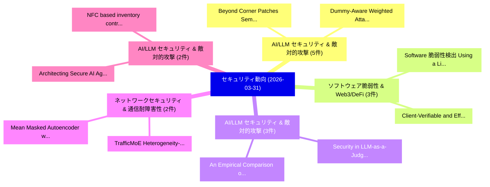

# 📅 02_daily: 日次エグゼクティブサマリー報告書 (2026-03-31)

**集計日時**: 2026-10-02 23:06:03 UTC  
**対象日付**: 2026-03-31  
**本日収集論文数**: 31 件  

---

## 💡 主要セキュリティ動向・脅威インサイト (Executive Insights)

本日の収集論文（計 31 件）において、以下の重点セキュリティ領域で活発な研究動向が確認されました：
- **AI/LLM セキュリティ & 敵対的攻撃** (5 件): 注目論文として 「Dummy-Aware Weighted Attack (D...」、「Beyond Corner Patches: Semanti...」 等が発表され、実務防御および攻撃検証の進展が見られます。
- **ソフトウェア脆弱性 & Web3/DeFi** (3 件): 注目論文として 「Software 脆弱性検出 Using a Lightwe...」、「Client-Verifiable and Efficien...」 等が発表され、実務防御および攻撃検証の進展が見られます。
- **AI/LLM セキュリティ & 敵対的攻撃** (3 件): 注目論文として 「Security in LLM-as-a-Judge: A ...」、「An Empirical Comparison of Sec...」 等が発表され、実務防御および攻撃検証の進展が見られます。
- **ネットワークセキュリティ & 通信耐障害性** (2 件): 注目論文として 「TrafficMoE: Heterogeneity-awar...」、「Mean Masked Autoencoder with F...」 等が発表され、実務防御および攻撃検証の進展が見られます。
- **AI/LLM セキュリティ & 敵対的攻撃** (2 件): 注目論文として 「Architecting Secure AI Agents:...」、「NFC based inventory control sy...」 等が発表され、実務防御および攻撃検証の進展が見られます。

### 🗺️ 技術・脅威トピックマインドマップ

---

## 📌 日次セキュリティ論文一覧 (日本語表形式)

| No | arXiv ID | 論文タイトル (日本語訳) | 重要キーワード | 構造化エグゼクティブ要約 (背景・提案・影響) | 脅威分類 | 詳細リンク |
|---|---|---|---|---|---|---|
| 1 | `2603.29182v1` | [Dummy-Aware Weighted Attack (DAWA): Breaking the Safe Sink in Dummy Class Defenses（セキュリティ分析論文）](../../okf/papers/2026-03-31/2603.29182.md) | `Aware Weighted Attack`, `Dummy Class Defenses`, `Safe Sink` | 【提案】概要 (Overview & Key Finding) 本論文「Dummy-Aware Weighted Attack (DAWA): Breaking the Safe S...。実証評価により経営層・セキュリティ管理者向け推奨アクション (E... | `executive-summary` | [arXiv](https://arxiv.org/abs/2603.29182v1) &#124; [OKF](../../okf/papers/2026-03-31/2603.29182.md) |
| 2 | `2603.29216v1` | [Software 脆弱性検出 Using a Lightweight Graph Neural Network](../../okf/papers/2026-03-31/2603.29216.md) | `Lightweight Graph Neural Network`, `Software Vulnerability Detection Using`, `Hialo Muniz Carvalho` | 【提案】概要 (Overview & Key Finding) 本論文「Software 脆弱性検出 Using a Lightweight Graph Neural Network...。実証評価により経営層・セキュリティ管理者向け推奨アクション (E... | `cs.AI` | [arXiv](https://arxiv.org/abs/2603.29216v1) &#124; [OKF](../../okf/papers/2026-03-31/2603.29216.md) |
| 3 | `2603.29278v2` | [A Regulatory Compliance Protocol for Asset Interoperability Between Traditional and Decentralized Finance in Tokenized Capital Markets（セキュリティ分析論文）](../../okf/papers/2026-03-31/2603.29278.md) | `Regulatory Compliance Protocol`, `Tokenized Capital Markets`, `Decentralized Finance` | 【提案】概要 (Overview & Key Finding) 本論文「A Regulatory Compliance Protocol for Asset Interoperabi...。実証評価により経営層・セキュリティ管理者向け推奨アクション (E... | `executive-summary` | [arXiv](https://arxiv.org/abs/2603.29278v2) &#124; [OKF](../../okf/papers/2026-03-31/2603.29278.md) |
| 4 | `2603.29289v1` | [Downsides of Smartness Across Edge-Cloud Continuum in Modern Industry（セキュリティ分析論文）](../../okf/papers/2026-03-31/2603.29289.md) | `Smartness Across Edge`, `Cloud Continuum`, `Modern Industry` | 【提案】概要 (Overview & Key Finding) 本論文「Downsides of Smartness Across Edge-Cloud Continuum in M...。実証評価により経営層・セキュリティ管理者向け推奨アクション (E... | `cs.AI` | [arXiv](https://arxiv.org/abs/2603.29289v1) &#124; [OKF](../../okf/papers/2026-03-31/2603.29289.md) |
| 5 | `2603.29328v3` | [Beyond Corner Patches: Semantics-Aware Backdoor Attack in 連合学習](../../okf/papers/2026-03-31/2603.29328.md) | `Beyond Corner Patches`, `Aware Backdoor Attack`, `Semantics-Aware Backdoor` | 【提案】概要 (Overview & Key Finding) 本論文「Beyond Corner Patches: Semantics-Aware Backdoor Attack ...。実証評価により経営層・セキュリティ管理者向け推奨アクション (E... | `cs.AI` | [arXiv](https://arxiv.org/abs/2603.29328v3) &#124; [OKF](../../okf/papers/2026-03-31/2603.29328.md) |
| 6 | `2603.29382v2` | [Deep Learning-Assisted Improved Differential Fault Attacks on Lightweight Stream Ciphers（セキュリティ分析論文）](../../okf/papers/2026-03-31/2603.29382.md) | `Assisted Improved Differential Fault Attacks`, `Lightweight Stream Ciphers`, `Deep Learning` | 【提案】概要 (Overview & Key Finding) 本論文「Deep Learning-Assisted Improved Differential Fault Atta...。実証評価により経営層・セキュリティ管理者向け推奨アクション (E... | `executive-summary` | [arXiv](https://arxiv.org/abs/2603.29382v2) &#124; [OKF](../../okf/papers/2026-03-31/2603.29382.md) |
| 7 | `2603.29403v2` | [Security in LLM-as-a-Judge: A Comprehensive SoK（セキュリティ分析論文）](../../okf/papers/2026-03-31/2603.29403.md) | `Aiman Al Masoud`, `Vignesh Kumar Kembu`, `Antony Anju` | 【提案】概要 (Overview & Key Finding) 本論文「Security in LLM-as-a-Judge: A Comprehensive SoK（セキュリティ分...。実証評価により経営層・セキュリティ管理者向け推奨アクション (E... | `cs.AI` | [arXiv](https://arxiv.org/abs/2603.29403v2) &#124; [OKF](../../okf/papers/2026-03-31/2603.29403.md) |
| 8 | `2603.29520v1` | [TrafficMoE: Heterogeneity-aware Mixture of Experts for Encrypted Traffic Classification（セキュリティ分析論文）](../../okf/papers/2026-03-31/2603.29520.md) | `Encrypted Traffic Classification`, `Heterogeneity-aware Mixture`, `Xiaowei Fu` | 【提案】概要 (Overview & Key Finding) 本論文「TrafficMoE: Heterogeneity-aware Mixture of Experts for ...。実証評価により経営層・セキュリティ管理者向け推奨アクション (E... | `cs.NI` | [arXiv](https://arxiv.org/abs/2603.29520v1) &#124; [OKF](../../okf/papers/2026-03-31/2603.29520.md) |
| 9 | `2603.29537v1` | [Mean Masked Autoencoder with Flow-Mixing for Encrypted Traffic Classification（セキュリティ分析論文）](../../okf/papers/2026-03-31/2603.29537.md) | `Mean Masked Autoencoder`, `Encrypted Traffic Classification`, `Xiao Liu` | 【提案】概要 (Overview & Key Finding) 本論文「Mean Masked Autoencoder with Flow-Mixing for Encrypted ...。実証評価により経営層・セキュリティ管理者向け推奨アクション (E... | `cs.NI` | [arXiv](https://arxiv.org/abs/2603.29537v1) &#124; [OKF](../../okf/papers/2026-03-31/2603.29537.md) |
| 10 | `2603.29545v2` | [Stand-Alone Complex or Vibercrime? Exploring the adoption and innovation of GenAI tools, coding assistants, and agents within cybercrime ecosystems（セキュリティ分析論文）](../../okf/papers/2026-03-31/2603.29545.md) | `Alone Complex`, `Stand-Alone Complex`, `Jack Hughes` | 【提案】Exploring the adoption and innovation of GenAI tools, coding assistants, and agents wit...。実証評価により経営層・セキュリティ管理者向け推奨アクション (E... | `executive-summary` | [arXiv](https://arxiv.org/abs/2603.29545v2) &#124; [OKF](../../okf/papers/2026-03-31/2603.29545.md) |
| 11 | `2603.29636v1` | [5G Puppeteer: Chaining Hidden Command and Control Channels in 5G Core Networks（セキュリティ分析論文）](../../okf/papers/2026-03-31/2603.29636.md) | `Chaining Hidden Command`, `Control Channels`, `Core Networks` | 【提案】概要 (Overview & Key Finding) 本論文「5G Puppeteer: Chaining Hidden Command and Control Chann...。実証評価により経営層・セキュリティ管理者向け推奨アクション (E... | `cybersecurity` | [arXiv](https://arxiv.org/abs/2603.29636v1) &#124; [OKF](../../okf/papers/2026-03-31/2603.29636.md) |
| 12 | `2603.29668v1` | [An Empirical Comparison of Security and Privacy Characteristics of Android Messaging Apps（セキュリティ分析論文）](../../okf/papers/2026-03-31/2603.29668.md) | `Android Messaging Apps`, `Privacy Characteristics`, `Foivos Timotheos Proestakis` | 【提案】概要 (Overview & Key Finding) 本論文「An Empirical Comparison of Security and Privacy Charact...。実証評価により経営層・セキュリティ管理者向け推奨アクション (E... | `cybersecurity` | [arXiv](https://arxiv.org/abs/2603.29668v1) &#124; [OKF](../../okf/papers/2026-03-31/2603.29668.md) |
| 13 | `2603.29669v1` | [The Manipulate-and-Observe Attack on Quantum Key Distribution（セキュリティ分析論文）](../../okf/papers/2026-03-31/2603.29669.md) | `Quantum Key Distribution`, `Observe Attack`, `William Tighe` | 【提案】概要 (Overview & Key Finding) 本論文「The Manipulate-and-Observe Attack on 量子鍵配送（セキュリティ分析論文）」...。実証評価により経営層・セキュリティ管理者向け推奨アクション (E... | `executive-summary` | [arXiv](https://arxiv.org/abs/2603.29669v1) &#124; [OKF](../../okf/papers/2026-03-31/2603.29669.md) |
| 14 | `2603.29688v1` | [Client-Verifiable and Efficient Federated Unlearning in Low-Altitude Wireless Networks（セキュリティ分析論文）](../../okf/papers/2026-03-31/2603.29688.md) | `Efficient Federated Unlearning`, `Altitude Wireless Networks`, `Low-Altitude Wireless` | 【提案】概要 (Overview & Key Finding) 本論文「Client-Verifiable and Efficient Federated Unlearning in...。実証評価により経営層・セキュリティ管理者向け推奨アクション (E... | `cybersecurity` | [arXiv](https://arxiv.org/abs/2603.29688v1) &#124; [OKF](../../okf/papers/2026-03-31/2603.29688.md) |
| 15 | `2603.29742v2` | [SHIFT: Stochastic Hidden-Trajectory Deflection for Removing Diffusion-based Watermark（セキュリティ分析論文）](../../okf/papers/2026-03-31/2603.29742.md) | `Stochastic Hidden`, `Trajectory Deflection`, `Removing Diffusion` | 【提案】概要 (Overview & Key Finding) 本論文「SHIFT: Stochastic Hidden-Trajectory Deflection for Remo...。実証評価により経営層・セキュリティ管理者向け推奨アクション (E... | `cs.CV` | [arXiv](https://arxiv.org/abs/2603.29742v2) &#124; [OKF](../../okf/papers/2026-03-31/2603.29742.md) |
| 16 | `2603.29749v1` | [HPCCFA: Leveraging Hardware Performance Counters for Control Flow Attestation（セキュリティ分析論文）](../../okf/papers/2026-03-31/2603.29749.md) | `Leveraging Hardware Performance Counters`, `Control Flow Attestation`, `Claudius Pott` | 【提案】概要 (Overview & Key Finding) 本論文「HPCCFA: Leveraging Hardware Performance Counters for Co...。実証評価により経営層・セキュリティ管理者向け推奨アクション (E... | `cybersecurity` | [arXiv](https://arxiv.org/abs/2603.29749v1) &#124; [OKF](../../okf/papers/2026-03-31/2603.29749.md) |
| 17 | `2603.29800v1` | [Detecting speculative leaks with compositional semantics（セキュリティ分析論文）](../../okf/papers/2026-03-31/2603.29800.md) | `Xaver Fabian`, `Marco Guarnieri`, `Marco Patrignani` | 【提案】概要 (Overview & Key Finding) 本論文「Detecting speculative leaks with compositional semantic...。実証評価によりMorales, Marco。 | `cybersecurity` | [arXiv](https://arxiv.org/abs/2603.29800v1) &#124; [OKF](../../okf/papers/2026-03-31/2603.29800.md) |
| 18 | `2603.29907v2` | [Security and Privacy in Virtual and Robotic Assistive Systems: A Comparative Framework（セキュリティ分析論文）](../../okf/papers/2026-03-31/2603.29907.md) | `Robotic Assistive Systems`, `Nelly Elsayed`, `Raw Meta` | 【提案】概要 (Overview & Key Finding) 本論文「Security and Privacy in Virtual and Robotic Assistive S...。実証評価により経営層・セキュリティ管理者向け推奨アクション (E... | `cybersecurity` | [arXiv](https://arxiv.org/abs/2603.29907v2) &#124; [OKF](../../okf/papers/2026-03-31/2603.29907.md) |
| 19 | `2603.30016v1` | [Architecting Secure AI Agents: Perspectives on System-Level Defenses Against Indirect Prompt Injection Attacks（セキュリティ分析論文）](../../okf/papers/2026-03-31/2603.30016.md) | `Architecting Secure`, `System-Level Defenses`, `Chong Xiang` | 【提案】概要 (Overview & Key Finding) 本論文「Architecting Secure AI Agents: Perspectives on System-L...。実証評価により経営層・セキュリティ管理者向け推奨アクション (E... | `cs.AI` | [arXiv](https://arxiv.org/abs/2603.30016v1) &#124; [OKF](../../okf/papers/2026-03-31/2603.30016.md) |
| 20 | `2603.30017v1` | [Refined Detection for Gumbel Watermarking（セキュリティ分析論文）](../../okf/papers/2026-03-31/2603.30017.md) | `Refined Detection`, `Gumbel Watermarking`, `Tor Lattimore` | 【提案】概要 (Overview & Key Finding) 本論文「Refined Detection for Gumbel Watermarking（セキュリティ分析論文）」（...。実証評価により経営層・セキュリティ管理者向け推奨アクション (E... | `executive-summary` | [arXiv](https://arxiv.org/abs/2603.30017v1) &#124; [OKF](../../okf/papers/2026-03-31/2603.30017.md) |
| 21 | `2603.30034v1` | [EnsembleSHAP: Faithful and Certifiably Robust Attribution for Random Subspace Method（セキュリティ分析論文）](../../okf/papers/2026-03-31/2603.30034.md) | `Certifiably Robust Attribution`, `Yanting Wang`, `Jinyuan Jia` | 【提案】概要 (Overview & Key Finding) 本論文「EnsembleSHAP: Faithful and Certifiably Robust Attributi...。実証評価により経営層・セキュリティ管理者向け推奨アクション (E... | `cybersecurity` | [arXiv](https://arxiv.org/abs/2603.30034v1) &#124; [OKF](../../okf/papers/2026-03-31/2603.30034.md) |
| 22 | `2604.00063v1` | [Cybercrime as a Service: A Scoping Review（セキュリティ分析論文）](../../okf/papers/2026-03-31/2604.00063.md) | `Scoping Review`, `Ema Mauko`, `Enrico Mariconti` | 【提案】概要 (Overview & Key Finding) 本論文「Cybercrime as a Service: A Scoping Review（セキュリティ分析論文）」（...。実証評価により経営層・セキュリティ管理者向け推奨アクション (E... | `cs.ET` | [arXiv](https://arxiv.org/abs/2604.00063v1) &#124; [OKF](../../okf/papers/2026-03-31/2604.00063.md) |
| 23 | `2604.00079v1` | [When Labels Are Scarce: A Systematic Mapping of Label-Efficient Code 脆弱性検出](../../okf/papers/2026-03-31/2604.00079.md) | `Systematic Mapping`, `Label-Efficient Code`, `Efficient Code Vulnerability Detection` | 【提案】概要 (Overview & Key Finding) 本論文「When Labels Are Scarce: A Systematic Mapping of Label-E...。実証評価により経営層・セキュリティ管理者向け推奨アクション (E... | `executive-summary` | [arXiv](https://arxiv.org/abs/2604.00079v1) &#124; [OKF](../../okf/papers/2026-03-31/2604.00079.md) |
| 24 | `2604.00112v1` | [Efficient Software 脆弱性検出 Using Transformer-based Models](../../okf/papers/2026-03-31/2604.00112.md) | `Transformer-based Models`, `Efficient Software Vulnerability Detection Using Transformer`, `Efficient Software` | 【提案】概要 (Overview & Key Finding) 本論文「Efficient Software 脆弱性検出 Using Transformer-based Models...。実証評価により経営層・セキュリティ管理者向け推奨アクション (E... | `executive-summary` | [arXiv](https://arxiv.org/abs/2604.00112v1) &#124; [OKF](../../okf/papers/2026-03-31/2604.00112.md) |
| 25 | `2604.00169v2` | [Beyond Latency: A System-Level Characterization of MPC and FHE for PPML（セキュリティ分析論文）](../../okf/papers/2026-03-31/2604.00169.md) | `Beyond Latency`, `Level Characterization`, `System-Level Characterization` | 【提案】概要 (Overview & Key Finding) 本論文「Beyond Latency: A System-Level Characterization of MPC ...。実証評価によりEdward Suh - **公開日時*。 | `cybersecurity` | [arXiv](https://arxiv.org/abs/2604.00169v2) &#124; [OKF](../../okf/papers/2026-03-31/2604.00169.md) |
| 26 | `2604.00181v1` | [NFC based inventory control system for secure and efficient communication（セキュリティ分析論文）](../../okf/papers/2026-03-31/2604.00181.md) | `Razi Iqbal`, `Awais Ahmad`, `Asfandyar Gillani` | 【提案】概要 (Overview & Key Finding) 本論文「NFC based inventory control system for secure and effic...。実証評価により経営層・セキュリティ管理者向け推奨アクション (E... | `cs.AI` | [arXiv](https://arxiv.org/abs/2604.00181v1) &#124; [OKF](../../okf/papers/2026-03-31/2604.00181.md) |
| 27 | `2604.00188v1` | [On the Necessity of Pre-agreed Secrets for Thwarting Last-minute Coercion: Vulnerabilities and Lessons From the Loki E-voting Protocol（セキュリティ分析論文）](../../okf/papers/2026-03-31/2604.00188.md) | `Thwarting Last`, `Pre-agreed Secrets`, `Last-minute Coercion` | 【提案】概要 (Overview & Key Finding) 本論文「On the Necessity of Pre-agreed Secrets for Thwarting La...。実証評価により経営層・セキュリティ管理者向け推奨アクション (E... | `cybersecurity` | [arXiv](https://arxiv.org/abs/2604.00188v1) &#124; [OKF](../../okf/papers/2026-03-31/2604.00188.md) |
| 28 | `2604.00303v1` | [サイバーセキュリティ Risk Assessment for CubeSat Missions: Adapting Established Frameworks for Resource-Constrained Environments](../../okf/papers/2026-03-31/2604.00303.md) | `Adapting Established Frameworks`, `Constrained Environments`, `Resource-Constrained Environments` | 【提案】概要 (Overview & Key Finding) 本論文「サイバーセキュリティ Risk Assessment for CubeSat Missions: Adapti...。実証評価により経営層・セキュリティ管理者向け推奨アクション (E... | `cybersecurity` | [arXiv](https://arxiv.org/abs/2604.00303v1) &#124; [OKF](../../okf/papers/2026-03-31/2604.00303.md) |
| 29 | `2604.02372v1` | [Backdoor Attacks on Decentralised Post-Training（セキュリティ分析論文）](../../okf/papers/2026-03-31/2604.02372.md) | `Backdoor Attacks`, `Decentralised Post`, `Nikolay Blagoev` | 【提案】概要 (Overview & Key Finding) 本論文「Backdoor Attacks on Decentralised Post-Training（セキュリティ分...。実証評価により経営層・セキュリティ管理者向け推奨アクション (E... | `executive-summary` | [arXiv](https://arxiv.org/abs/2604.02372v1) &#124; [OKF](../../okf/papers/2026-03-31/2604.02372.md) |
| 30 | `2604.19785v2` | [Can LLMs Infer Conversational Agent Users' Personality Traits from Chat History?（セキュリティ分析論文）](../../okf/papers/2026-03-31/2604.19785.md) | `Infer Conversational Agent Users`, `Personality Traits`, `Chat History` | 【提案】### (日本語題名: Can LLMs Infer Conversational Agent Users' Personality Traits from Chat His...。実証評価により経営層・セキュリティ管理者向け推奨アクション (E... | `cs.AI` | [arXiv](https://arxiv.org/abs/2604.19785v2) &#124; [OKF](../../okf/papers/2026-03-31/2604.19785.md) |
| 31 | `2605.21490v1` | [Temporal Contrastive Transformer for Financial Crime Detection: Self-Supervised Sequence Embeddings via Predictive Contrastive Coding（セキュリティ分析論文）](../../okf/papers/2026-03-31/2605.21490.md) | `Temporal Contrastive Transformer`, `Financial Crime Detection`, `Supervised Sequence Embeddings` | 【提案】概要 (Overview & Key Finding) 本論文「Temporal Contrastive Transformer for Financial Crime De...。実証評価により経営層・セキュリティ管理者向け推奨アクション (E... | `executive-summary` | [arXiv](https://arxiv.org/abs/2605.21490v1) &#124; [OKF](../../okf/papers/2026-03-31/2605.21490.md) |

