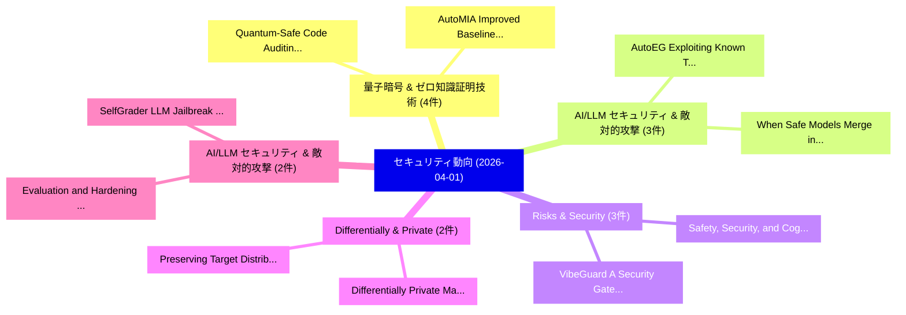

# 📅 02_daily: 日次エグゼクティブサマリー報告書 (2026-04-01)

**集計日時**: 2026-10-02 23:06:03 UTC  
**対象日付**: 2026-04-01  
**本日収集論文数**: 33 件  

---

## 💡 主要セキュリティ動向・脅威インサイト (Executive Insights)

本日の収集論文（計 33 件）において、以下の重点セキュリティ領域で活発な研究動向が確認されました：
- **量子暗号 & ゼロ知識証明技術** (4 件): 注目論文として 「Quantum-Safe Code Auditing: LL...」、「AutoMIA: Improved Baselines fo...」 等が発表され、実務防御および攻撃検証の進展が見られます。
- **AI/LLM セキュリティ & 敵対的攻撃** (3 件): 注目論文として 「When Safe Models Merge into Da...」、「AutoEG: Exploiting Known Third...」 等が発表され、実務防御および攻撃検証の進展が見られます。
- **Risks & Security** (3 件): 注目論文として 「VibeGuard: A Security Gate Fra...」、「Safety, Security, and Cognitiv...」 等が発表され、実務防御および攻撃検証の進展が見られます。
- **Differentially & Private** (2 件): 注目論文として 「Differentially Private Manifol...」、「Preserving Target Distribution...」 等が発表され、実務防御および攻撃検証の進展が見られます。
- **AI/LLM セキュリティ & 敵対的攻撃** (2 件): 注目論文として 「Evaluation and Hardening of LL...」、「SelfGrader: LLM Jailbreak Dete...」 等が発表され、実務防御および攻撃検証の進展が見られます。

### 🗺️ 技術・脅威トピックマインドマップ

---

## 📌 日次セキュリティ論文一覧 (日本語表形式)

| No | arXiv ID | 論文タイトル (日本語訳) | 重要キーワード | 構造化エグゼクティブ要約 (背景・提案・影響) | 脅威分類 | 詳細リンク |
|---|---|---|---|---|---|---|
| 1 | `2604.00387v2` | [RAGShield: Detecting Numerical Claim Manipulation in Government RAG Systems（セキュリティ分析論文）](../../okf/papers/2026-04-01/2604.00387.md) | `Detecting Numerical Claim Manipulation`, `Raw Meta`, `Executive Summary` | 【提案】概要 (Overview & Key Finding) 本論文「RAGShield: Detecting Numerical Claim Manipulation in Go...。実証評価により経営層・セキュリティ管理者向け推奨アクション (E... | `cs.AI` | [arXiv](https://arxiv.org/abs/2604.00387v2) &#124; [OKF](../../okf/papers/2026-04-01/2604.00387.md) |
| 2 | `2604.00411v1` | [Efficient DPF-based Error-Detecting Information-Theoretic Private Information Retrieval Over Rings（セキュリティ分析論文）](../../okf/papers/2026-04-01/2604.00411.md) | `Detecting Information`, `DPF-based Error`, `Information-Theoretic Private` | 【提案】概要 (Overview & Key Finding) 本論文「Efficient DPF-based Error-Detecting Information-Theoret...。実証評価により経営層・セキュリティ管理者向け推奨アクション (E... | `executive-summary` | [arXiv](https://arxiv.org/abs/2604.00411v1) &#124; [OKF](../../okf/papers/2026-04-01/2604.00411.md) |
| 3 | `2604.00430v1` | [Secure Forgetting: A Framework for Privacy-Driven Unlearning in Large Language Model (LLM)-Based Agents（セキュリティ分析論文）](../../okf/papers/2026-04-01/2604.00430.md) | `Large Language Model`, `Secure Forgetting`, `Driven Unlearning` | 【提案】概要 (Overview & Key Finding) 本論文「Secure Forgetting: A Framework for Privacy-Driven Unlea...。実証評価により経営層・セキュリティ管理者向け推奨アクション (E... | `executive-summary` | [arXiv](https://arxiv.org/abs/2604.00430v1) &#124; [OKF](../../okf/papers/2026-04-01/2604.00430.md) |
| 4 | `2604.00546v3` | [Lightweight, Practical Encrypted Face Recognition with GPU Support（セキュリティ分析論文）](../../okf/papers/2026-04-01/2604.00546.md) | `Practical Encrypted Face Recognition`, `Gabrielle De Micheli`, `Syed Mahbub Hafiz` | 【提案】概要 (Overview & Key Finding) 本論文「Lightweight, Practical Encrypted Face Recognition with ...。実証評価により経営層・セキュリティ管理者向け推奨アクション (E... | `cybersecurity` | [arXiv](https://arxiv.org/abs/2604.00546v3) &#124; [OKF](../../okf/papers/2026-04-01/2604.00546.md) |
| 5 | `2604.00560v1` | [Quantum-Safe Code Auditing: LLM-Assisted Static Analysis and Quantum-Aware Risk Scoring for Post-Quantum Cryptography Migration（セキュリティ分析論文）](../../okf/papers/2026-04-01/2604.00560.md) | `Safe Code Auditing`, `Aware Risk Scoring`, `Quantum Cryptography Migration` | 【提案】概要 (Overview & Key Finding) 本論文「量子-Safe Code Auditing: LLM-Assisted Static Analysis and...。実証評価により経営層・セキュリティ管理者向け推奨アクション (E... | `executive-summary` | [arXiv](https://arxiv.org/abs/2604.00560v1) &#124; [OKF](../../okf/papers/2026-04-01/2604.00560.md) |
| 6 | `2604.00627v1` | [When Safe Models Merge into Danger: Exploiting Latent Vulnerabilities in LLM Fusion（セキュリティ分析論文）](../../okf/papers/2026-04-01/2604.00627.md) | `Exploiting Latent Vulnerabilities`, `Exploiting Latent Vulne`, `Jiaqing Li` | 【提案】概要 (Overview & Key Finding) 本論文「When Safe Models Merge into Danger: Exploiting Latent V...。実証評価により経営層・セキュリティ管理者向け推奨アクション (E... | `cybersecurity` | [arXiv](https://arxiv.org/abs/2604.00627v1) &#124; [OKF](../../okf/papers/2026-04-01/2604.00627.md) |
| 7 | `2604.00657v1` | [LibScan: Smart Contract Library Misuse Detection with Iterative Feedback and Static Verification（セキュリティ分析論文）](../../okf/papers/2026-04-01/2604.00657.md) | `Smart Contract Library Misuse Detection`, `Iterative Feedback`, `Static Verification` | 【提案】概要 (Overview & Key Finding) 本論文「LibScan: スマートコントラクト Library Misuse Detection with Itera...。実証評価により経営層・セキュリティ管理者向け推奨アクション (E... | `executive-summary` | [arXiv](https://arxiv.org/abs/2604.00657v1) &#124; [OKF](../../okf/papers/2026-04-01/2604.00657.md) |
| 8 | `2604.00702v1` | [Enhancing REST API Fuzzing with Access Policy Violation Checks and Injection Attacks（セキュリティ分析論文）](../../okf/papers/2026-04-01/2604.00702.md) | `Access Policy Violation Checks`, `Injection Attacks`, `Omur Sahin` | 【提案】概要 (Overview & Key Finding) 本論文「Enhancing REST API Fuzzing with Access Policy Violation...。実証評価により経営層・セキュリティ管理者向け推奨アクション (E... | `executive-summary` | [arXiv](https://arxiv.org/abs/2604.00702v1) &#124; [OKF](../../okf/papers/2026-04-01/2604.00702.md) |
| 9 | `2604.00704v1` | [AutoEG: Exploiting Known Third-Party Vulnerabilities in Black-Box Web Applications（セキュリティ分析論文）](../../okf/papers/2026-04-01/2604.00704.md) | `Exploiting Known Third`, `Box Web Applications`, `Party Vulnerabilities` | 【提案】概要 (Overview & Key Finding) 本論文「AutoEG: Exploiting Known Third-Party Vulnerabilities in...。実証評価により経営層・セキュリティ管理者向け推奨アクション (E... | `cs.AI` | [arXiv](https://arxiv.org/abs/2604.00704v1) &#124; [OKF](../../okf/papers/2026-04-01/2604.00704.md) |
| 10 | `2604.00741v1` | [Engineering a Phase-Noise-Based Quantum Random Number Generator for Real-Time Secure Applications: Design, Validation, and Scalability（セキュリティ分析論文）](../../okf/papers/2026-04-01/2604.00741.md) | `Based Quantum Random Number Generator`, `Time Secure Applications`, `Real-Time Secure` | 【提案】概要 (Overview & Key Finding) 本論文「Engineering a Phase-Noise-Based 量子 Random Number Genera...。実証評価により経営層・セキュリティ管理者向け推奨アクション (E... | `executive-summary` | [arXiv](https://arxiv.org/abs/2604.00741v1) &#124; [OKF](../../okf/papers/2026-04-01/2604.00741.md) |
| 11 | `2604.00761v1` | [PrivHAR-Bench: A Graduated Privacy Benchmark Dataset for Video-Based Action Recognition（セキュリティ分析論文）](../../okf/papers/2026-04-01/2604.00761.md) | `Graduated Privacy Benchmark Dataset`, `Based Action Recognition`, `Video-Based Action` | 【提案】概要 (Overview & Key Finding) 本論文「PrivHAR-Bench: A Graduated Privacy Benchmark Dataset fo...。実証評価により経営層・セキュリティ管理者向け推奨アクション (E... | `cs.CV` | [arXiv](https://arxiv.org/abs/2604.00761v1) &#124; [OKF](../../okf/papers/2026-04-01/2604.00761.md) |
| 12 | `2604.00788v1` | [UK AISI Alignment Evaluation Case-Study（セキュリティ分析論文）](../../okf/papers/2026-04-01/2604.00788.md) | `Alexandra Souly`, `Robert Kirk`, `Jacob Merizian` | 【提案】概要 (Overview & Key Finding) 本論文「UK AISI Alignment Evaluation Case-Study（セキュリティ分析論文）」（原題...。実証評価により経営層・セキュリティ管理者向け推奨アクション (E... | `cs.AI` | [arXiv](https://arxiv.org/abs/2604.00788v1) &#124; [OKF](../../okf/papers/2026-04-01/2604.00788.md) |
| 13 | `2604.00887v3` | [Physically Realizable Adversarial Attenuation Patch against SAR Object Detectionに向けて](../../okf/papers/2026-04-01/2604.00887.md) | `Towards Physically Realizable Adversarial Attenuation Patch`, `Physically Realizable Adversarial Attenuation Patch`, `Object Detection` | 【提案】概要 (Overview & Key Finding) 本論文「Physically Realizable Adversarial Attenuation Patch aga...。実証評価により経営層・セキュリティ管理者向け推奨アクション (E... | `cs.CV` | [arXiv](https://arxiv.org/abs/2604.00887v3) &#124; [OKF](../../okf/papers/2026-04-01/2604.00887.md) |
| 14 | `2604.00942v1` | [Differentially Private Manifold Denoising（セキュリティ分析論文）](../../okf/papers/2026-04-01/2604.00942.md) | `Differentially Private Manifold Denoising`, `Jiaqi Wu`, `Yiqing Sun` | 【提案】概要 (Overview & Key Finding) 本論文「Differentially Private Manifold Denoising（セキュリティ分析論文）」（...。実証評価により経営層・セキュリティ管理者向け推奨アクション (E... | `executive-summary` | [arXiv](https://arxiv.org/abs/2604.00942v1) &#124; [OKF](../../okf/papers/2026-04-01/2604.00942.md) |
| 15 | `2604.00986v2` | [Do Phone-Use Agents Respect Your Privacy?（セキュリティ分析論文）](../../okf/papers/2026-04-01/2604.00986.md) | `Phone-Use Agents`, `Zhengyang Tang`, `Ke Ji` | 【提案】### (日本語題名: Do Phone-Use Agents Respect Your Privacy?（セキュリティ分析論文）)  > [!NOTE] > **OKF M...。実証評価により経営層・セキュリティ管理者向け推奨アクション (E... | `cs.AI` | [arXiv](https://arxiv.org/abs/2604.00986v2) &#124; [OKF](../../okf/papers/2026-04-01/2604.00986.md) |
| 16 | `2604.01014v1` | [AutoMIA: Improved Baselines for Membership Inference Attack via Agentic Self-Exploration（セキュリティ分析論文）](../../okf/papers/2026-04-01/2604.01014.md) | `Membership Inference Attack`, `Improved Baselines`, `Agentic Self` | 【提案】概要 (Overview & Key Finding) 本論文「AutoMIA: Improved Baselines for Membership Inference At...。実証評価により経営層・セキュリティ管理者向け推奨アクション (E... | `cs.CV` | [arXiv](https://arxiv.org/abs/2604.01014v1) &#124; [OKF](../../okf/papers/2026-04-01/2604.01014.md) |
| 17 | `2604.01039v4` | [Evaluation and Hardening of LLM System Instructions Against Extraction via Encoding Attacks（セキュリティ分析論文）](../../okf/papers/2026-04-01/2604.01039.md) | `Encoding Attacks`, `Anubhab Sahu`, `Diptisha Samanta` | 【提案】概要 (Overview & Key Finding) 本論文「Evaluation and Hardening of LLM System Instructions Aga...。実証評価により経営層・セキュリティ管理者向け推奨アクション (E... | `cs.AI` | [arXiv](https://arxiv.org/abs/2604.01039v4) &#124; [OKF](../../okf/papers/2026-04-01/2604.01039.md) |
| 18 | `2604.01052v1` | [VibeGuard: A Security Gate Framework for AI-Generated Code（セキュリティ分析論文）](../../okf/papers/2026-04-01/2604.01052.md) | `Generated Code`, `AI-Generated Code`, `Ying Xie` | 【提案】概要 (Overview & Key Finding) 本論文「VibeGuard: A Security Gate Framework for AI-Generated C...。実証評価により経営層・セキュリティ管理者向け推奨アクション (E... | `cs.AI` | [arXiv](https://arxiv.org/abs/2604.01052v1) &#124; [OKF](../../okf/papers/2026-04-01/2604.01052.md) |
| 19 | `2604.01079v1` | [Automated Generation of サイバーセキュリティ Exercise Scenarios](../../okf/papers/2026-04-01/2604.01079.md) | `Automated Generation`, `Cybersecurity Exercise Scenarios`, `Exercise Scenarios` | 【提案】概要 (Overview & Key Finding) 本論文「Automated Generation of サイバーセキュリティ Exercise Scenarios」（...。実証評価により経営層・セキュリティ管理者向け推奨アクション (E... | `executive-summary` | [arXiv](https://arxiv.org/abs/2604.01079v1) &#124; [OKF](../../okf/papers/2026-04-01/2604.01079.md) |
| 20 | `2604.01092v1` | [LightGuard: Transparent WiFi Security via Physical-Layer LiFi Key Bootstrapping（セキュリティ分析論文）](../../okf/papers/2026-04-01/2604.01092.md) | `Physical-Layer LiFi`, `Key Bootstrapping`, `Soung Chang Liew` | 【提案】概要 (Overview & Key Finding) 本論文「LightGuard: Transparent WiFi Security via Physical-Laye...。実証評価により経営層・セキュリティ管理者向け推奨アクション (E... | `cs.NI` | [arXiv](https://arxiv.org/abs/2604.01092v1) &#124; [OKF](../../okf/papers/2026-04-01/2604.01092.md) |
| 21 | `2604.01127v2` | [Multi-Agent LLM Governance for Safe Two-Timescale Reinforcement Learning in SDN-IoT Defense（セキュリティ分析論文）](../../okf/papers/2026-04-01/2604.01127.md) | `Timescale Reinforcement Learning`, `Multi-Agent LLM`, `Safe Two` | 【提案】概要 (Overview & Key Finding) 本論文「Multi-Agent LLM Governance for Safe Two-Timescale Reinf...。実証評価により経営層・セキュリティ管理者向け推奨アクション (E... | `cybersecurity` | [arXiv](https://arxiv.org/abs/2604.01127v2) &#124; [OKF](../../okf/papers/2026-04-01/2604.01127.md) |
| 22 | `2604.01131v1` | [Obfuscating Code Vulnerabilities against Static Analysis in JavaScript Code（セキュリティ分析論文）](../../okf/papers/2026-04-01/2604.01131.md) | `Obfuscating Code Vulnerabilities`, `Francesco Pagano`, `Lorenzo Pisu` | 【提案】概要 (Overview & Key Finding) 本論文「Obfuscating Code Vulnerabilities against Static Analysi...。実証評価により経営層・セキュリティ管理者向け推奨アクション (E... | `cybersecurity` | [arXiv](https://arxiv.org/abs/2604.01131v1) &#124; [OKF](../../okf/papers/2026-04-01/2604.01131.md) |
| 23 | `2604.01147v1` | [SERSEM: Selective Entropy-Weighted Scoring for Membership Inference in Code Language Models（セキュリティ分析論文）](../../okf/papers/2026-04-01/2604.01147.md) | `Code Language Models`, `Selective Entropy`, `Weighted Scoring` | 【提案】概要 (Overview & Key Finding) 本論文「SERSEM: Selective Entropy-Weighted Scoring for Membersh...。実証評価により経営層・セキュリティ管理者向け推奨アクション (E... | `executive-summary` | [arXiv](https://arxiv.org/abs/2604.01147v1) &#124; [OKF](../../okf/papers/2026-04-01/2604.01147.md) |
| 24 | `2604.01194v2` | [AgentWatcher: A Rule-based Prompt Injection Monitor（セキュリティ分析論文）](../../okf/papers/2026-04-01/2604.01194.md) | `Prompt Injection Monitor`, `Rule-based Prompt`, `Yanting Wang` | 【提案】概要 (Overview & Key Finding) 本論文「AgentWatcher: A Rule-based プロンプトインジェクション Monitor（セキュリティ...。実証評価により経営層・セキュリティ管理者向け推奨アクション (E... | `cybersecurity` | [arXiv](https://arxiv.org/abs/2604.01194v2) &#124; [OKF](../../okf/papers/2026-04-01/2604.01194.md) |
| 25 | `2604.01330v1` | [Evolutionary Multi-Objective Fusion of Deepfake Speech Detectors（セキュリティ分析論文）](../../okf/papers/2026-04-01/2604.01330.md) | `Deepfake Speech Detectors`, `Evolutionary Multi`, `Objective Fusion` | 【提案】概要 (Overview & Key Finding) 本論文「Evolutionary Multi-Objective Fusion of Deepfake Speech ...。実証評価により経営層・セキュリティ管理者向け推奨アクション (E... | `cs.AI` | [arXiv](https://arxiv.org/abs/2604.01330v1) &#124; [OKF](../../okf/papers/2026-04-01/2604.01330.md) |
| 26 | `2604.01346v2` | [Safety, Security, and Cognitive Risks in World Models（セキュリティ分析論文）](../../okf/papers/2026-04-01/2604.01346.md) | `Cognitive Risks`, `World Models`, `Manoj Parmar` | 【提案】概要 (Overview & Key Finding) 本論文「Safety, Security, and Cognitive Risks in World Models（セ...。実証評価により経営層・セキュリティ管理者向け推奨アクション (E... | `cs.AI` | [arXiv](https://arxiv.org/abs/2604.01346v2) &#124; [OKF](../../okf/papers/2026-04-01/2604.01346.md) |
| 27 | `2604.01350v1` | [No Attacker Needed: Unintentional Cross-User Contamination in Shared-State LLMエージェント](../../okf/papers/2026-04-01/2604.01350.md) | `Unintentional Cross`, `User Contamination`, `Cross-User Contamination` | 【提案】概要 (Overview & Key Finding) 本論文「No Attacker Needed: Unintentional Cross-User Contaminat...。実証評価により経営層・セキュリティ管理者向け推奨アクション (E... | `cs.AI` | [arXiv](https://arxiv.org/abs/2604.01350v1) &#124; [OKF](../../okf/papers/2026-04-01/2604.01350.md) |
| 28 | `2604.01370v2` | ["The System Will Choose Security Over Humanity Every Time": Understanding Security and Privacy for U.S. Incarcerated Users（セキュリティ分析論文）](../../okf/papers/2026-04-01/2604.01370.md) | `Understanding Security`, `Incarcerated Users`, `Yael Eiger` | 【提案】Incarcerated Users ### (日本語題名: "The System Will Choose Security Over Humanity Every Tim...。実証評価により経営層・セキュリティ管理者向け推奨アクション (E... | `cybersecurity` | [arXiv](https://arxiv.org/abs/2604.01370v2) &#124; [OKF](../../okf/papers/2026-04-01/2604.01370.md) |
| 29 | `2604.01444v2` | [Cooking Up Risks: and Reducing Food Safety Risks in Large Language Modelsのベンチマーク評価](../../okf/papers/2026-04-01/2604.01444.md) | `Reducing Food Safety Risks`, `Large Language`, `Large Language Models` | 【提案】概要 (Overview & Key Finding) 本論文「Cooking Up Risks: and Reducing Food Safety Risks in Lar...。実証評価により経営層・セキュリティ管理者向け推奨アクション (E... | `cybersecurity` | [arXiv](https://arxiv.org/abs/2604.01444v2) &#124; [OKF](../../okf/papers/2026-04-01/2604.01444.md) |
| 30 | `2604.01468v2` | [Preserving Target Distributions With Differentially Private Count Mechanisms（セキュリティ分析論文）](../../okf/papers/2026-04-01/2604.01468.md) | `Nitin Kohli`, `Paul Laskowski`, `Raw Meta` | 【提案】概要 (Overview & Key Finding) 本論文「Preserving Target Distributions With Differentially Pri...。実証評価により経営層・セキュリティ管理者向け推奨アクション (E... | `cybersecurity` | [arXiv](https://arxiv.org/abs/2604.01468v2) &#124; [OKF](../../okf/papers/2026-04-01/2604.01468.md) |
| 31 | `2604.01473v3` | [SelfGrader: LLM Jailbreak Detection via Anchored Token-Level Logits（セキュリティ分析論文）](../../okf/papers/2026-04-01/2604.01473.md) | `Jailbreak Detection`, `Anchored Token`, `Level Logits` | 【提案】概要 (Overview & Key Finding) 本論文「SelfGrader: LLM ジェイルブレイク Detection via Anchored Token-L...。実証評価により経営層・セキュリティ管理者向け推奨アクション (E... | `cs.AI` | [arXiv](https://arxiv.org/abs/2604.01473v3) &#124; [OKF](../../okf/papers/2026-04-01/2604.01473.md) |
| 32 | `2604.01483v1` | [Type-Checked Compliance: Deterministic Guardrails for Agentic Financial Systems Using Lean 4 Theorem Proving（セキュリティ分析論文）](../../okf/papers/2026-04-01/2604.01483.md) | `Agentic Financial Systems Using Lean`, `Checked Compliance`, `Deterministic Guardrails` | 【提案】概要 (Overview & Key Finding) 本論文「Type-Checked Compliance: Deterministic Guardrails for A...。実証評価により経営層・セキュリティ管理者向け推奨アクション (E... | `cs.AI` | [arXiv](https://arxiv.org/abs/2604.01483v1) &#124; [OKF](../../okf/papers/2026-04-01/2604.01483.md) |
| 33 | `2604.25921v2` | [One Word at a Time: Incremental Completion Decomposition Breaks LLM Safety（セキュリティ分析論文）](../../okf/papers/2026-04-01/2604.25921.md) | `Incremental Completion Decomposition Breaks`, `One Word`, `Samee Arif` | 【提案】概要 (Overview & Key Finding) 本論文「One Word at a Time: Incremental Completion Decompositio...。実証評価により経営層・セキュリティ管理者向け推奨アクション (E... | `executive-summary` | [arXiv](https://arxiv.org/abs/2604.25921v2) &#124; [OKF](../../okf/papers/2026-04-01/2604.25921.md) |

