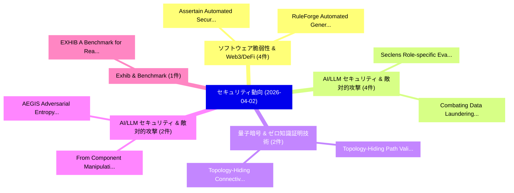

# 📅 02_daily: 日次エグゼクティブサマリー報告書 (2026-04-02)

**集計日時**: 2026-10-02 23:06:03 UTC  
**対象日付**: 2026-04-02  
**本日収集論文数**: 25 件  

---

## 💡 主要セキュリティ動向・脅威インサイト (Executive Insights)

本日の収集論文（計 25 件）において、以下の重点セキュリティ領域で活発な研究動向が確認されました：
- **ソフトウェア脆弱性 & Web3/DeFi** (4 件): 注目論文として 「Assertain: Automated Security ...」、「RuleForge: Automated Generatio...」 等が発表され、実務防御および攻撃検証の進展が見られます。
- **AI/LLM セキュリティ & 敵対的攻撃** (4 件): 注目論文として 「Seclens: Role-specific Evaluat...」、「Combating Data Laundering in L...」 等が発表され、実務防御および攻撃検証の進展が見られます。
- **量子暗号 & ゼロ知識証明技術** (2 件): 注目論文として 「Topology-Hiding Path Validatio...」、「Topology-Hiding Connectivity-A...」 等が発表され、実務防御および攻撃検証の進展が見られます。
- **AI/LLM セキュリティ & 敵対的攻撃** (2 件): 注目論文として 「From Component Manipulation to...」、「AEGIS: Adversarial Entropy-Gui...」 等が発表され、実務防御および攻撃検証の進展が見られます。
- **Exhib & Benchmark** (1 件): 注目論文として 「EXHIB: A Benchmark for Realist...」 等が発表され、実務防御および攻撃検証の進展が見られます。

### 🗺️ 技術・脅威トピックマインドマップ

---

## 📌 日次セキュリティ論文一覧 (日本語表形式)

| No | arXiv ID | 論文タイトル (日本語訳) | 重要キーワード | 構造化エグゼクティブ要約 (背景・提案・影響) | 脅威分類 | 詳細リンク |
|---|---|---|---|---|---|---|
| 1 | `2604.01554v1` | [EXHIB: A Benchmark for Realistic and Diverse Evaluation of Function Similarity in the Wild（セキュリティ分析論文）](../../okf/papers/2026-04-02/2604.01554.md) | `Function Similarity`, `Jun Yeon Won`, `Yiming Fan` | 【提案】概要 (Overview & Key Finding) 本論文「EXHIB: A Benchmark for Realistic and Diverse Evaluation...。実証評価により経営層・セキュリティ管理者向け推奨アクション (E... | `executive-summary` | [arXiv](https://arxiv.org/abs/2604.01554v1) &#124; [OKF](../../okf/papers/2026-04-02/2604.01554.md) |
| 2 | `2604.01572v1` | [AI-Assisted Hardware Security Verification: A Survey and AI Accelerator Case Study（セキュリティ分析論文）](../../okf/papers/2026-04-02/2604.01572.md) | `Assisted Hardware Security Verification`, `AI-Assisted Hardware`, `Assisted Hardware Security Verifica` | 【提案】概要 (Overview & Key Finding) 本論文「AI-Assisted Hardware Security Verification: A Survey an...。実証評価により経営層・セキュリティ管理者向け推奨アクション (E... | `cybersecurity` | [arXiv](https://arxiv.org/abs/2604.01572v1) &#124; [OKF](../../okf/papers/2026-04-02/2604.01572.md) |
| 3 | `2604.01583v1` | [Assertain: Automated Security Assertion Generation Using 大規模言語モデル](../../okf/papers/2026-04-02/2604.01583.md) | `Automated Security Assertion Generation Using Large Language Models`, `Automated Security Assertion Generation Using`, `Khan Thamid Hasan` | 【提案】概要 (Overview & Key Finding) 本論文「Assertain: Automated Security Assertion Generation Usin...。実証評価により経営層・セキュリティ管理者向け推奨アクション (E... | `cybersecurity` | [arXiv](https://arxiv.org/abs/2604.01583v1) &#124; [OKF](../../okf/papers/2026-04-02/2604.01583.md) |
| 4 | `2604.01627v1` | [RefinementEngine: Automating Intent-to-Device Filtering Policy Deployment under Network Constraints（セキュリティ分析論文）](../../okf/papers/2026-04-02/2604.01627.md) | `Device Filtering Policy Deployment`, `Automating Intent`, `Network Constraints` | 【提案】概要 (Overview & Key Finding) 本論文「RefinementEngine: Automating Intent-to-Device Filtering...。実証評価により経営層・セキュリティ管理者向け推奨アクション (E... | `cs.AI` | [arXiv](https://arxiv.org/abs/2604.01627v1) &#124; [OKF](../../okf/papers/2026-04-02/2604.01627.md) |
| 5 | `2604.01635v1` | [Diffusion-Guided Adversarial Perturbation Injection for Generalizable Defense Against Facial Manipulations（セキュリティ分析論文）](../../okf/papers/2026-04-02/2604.01635.md) | `Guided Adversarial Perturbation Injection`, `Diffusion-Guided Adversarial`, `Yue Li` | 【提案】概要 (Overview & Key Finding) 本論文「Diffusion-Guided Adversarial Perturbation Injection for...。実証評価により経営層・セキュリティ管理者向け推奨アクション (E... | `cybersecurity` | [arXiv](https://arxiv.org/abs/2604.01635v1) &#124; [OKF](../../okf/papers/2026-04-02/2604.01635.md) |
| 6 | `2604.01637v1` | [Seclens: Role-specific Evaluation of LLM's for security vulnerablity detection（セキュリティ分析論文）](../../okf/papers/2026-04-02/2604.01637.md) | `Kashinath Kadaba Shrish`, `Subho Halder`, `Siddharth Saxena` | 【提案】概要 (Overview & Key Finding) 本論文「Seclens: Role-specific Evaluation of LLM's for security...。実証評価により経営層・セキュリティ管理者向け推奨アクション (E... | `cs.AI` | [arXiv](https://arxiv.org/abs/2604.01637v1) &#124; [OKF](../../okf/papers/2026-04-02/2604.01637.md) |
| 7 | `2604.01645v3` | [Contextualizing Sink Knowledge for Java Vulnerability Discovery（セキュリティ分析論文）](../../okf/papers/2026-04-02/2604.01645.md) | `Contextualizing Sink Knowledge`, `Java Vulnerability Discovery`, `Fabian Fleischer` | 【提案】概要 (Overview & Key Finding) 本論文「Contextualizing Sink Knowledge for Java 脆弱性 Discovery（セ...。実証評価により経営層・セキュリティ管理者向け推奨アクション (E... | `cybersecurity` | [arXiv](https://arxiv.org/abs/2604.01645v3) &#124; [OKF](../../okf/papers/2026-04-02/2604.01645.md) |
| 8 | `2604.01750v1` | [Spike-PTSD: A Bio-Plausible Adversarial Example Attack on Spiking Neural Networks via PTSD-Inspired Spike Scaling（セキュリティ分析論文）](../../okf/papers/2026-04-02/2604.01750.md) | `Plausible Adversarial Example Attack`, `Spiking Neural Networks`, `Inspired Spike Scaling` | 【提案】概要 (Overview & Key Finding) 本論文「Spike-PTSD: A Bio-Plausible 敵対的サンプル Attack on Spiking N...。実証評価により経営層・セキュリティ管理者向け推奨アクション (E... | `cybersecurity` | [arXiv](https://arxiv.org/abs/2604.01750v1) &#124; [OKF](../../okf/papers/2026-04-02/2604.01750.md) |
| 9 | `2604.01831v1` | [Topology-Hiding Path Validation for Large-Scale Quantum Key Distribution Networks（セキュリティ分析論文）](../../okf/papers/2026-04-02/2604.01831.md) | `Scale Quantum Key Distribution Networks`, `Hiding Path Validation`, `Topology-Hiding Path` | 【提案】概要 (Overview & Key Finding) 本論文「Topology-Hiding Path Validation for Large-Scale 量子鍵配送 N...。実証評価により経営層・セキュリティ管理者向け推奨アクション (E... | `executive-summary` | [arXiv](https://arxiv.org/abs/2604.01831v1) &#124; [OKF](../../okf/papers/2026-04-02/2604.01831.md) |
| 10 | `2604.01876v1` | [Topology-Hiding Connectivity-Assurance for QKD Inter-Networking（セキュリティ分析論文）](../../okf/papers/2026-04-02/2604.01876.md) | `Hiding Connectivity`, `Topology-Hiding Connectivity`, `Margherita Cozzolino` | 【提案】概要 (Overview & Key Finding) 本論文「Topology-Hiding Connectivity-Assurance for QKD Inter-Ne...。実証評価により経営層・セキュリティ管理者向け推奨アクション (E... | `executive-summary` | [arXiv](https://arxiv.org/abs/2604.01876v1) &#124; [OKF](../../okf/papers/2026-04-02/2604.01876.md) |
| 11 | `2604.01904v3` | [Combating Data Laundering in LLM Training（セキュリティ分析論文）](../../okf/papers/2026-04-02/2604.01904.md) | `Combating Data Laundering`, `Muxing Li`, `Zesheng Ye` | 【提案】概要 (Overview & Key Finding) 本論文「Combating Data Laundering in LLM Training（セキュリティ分析論文）」（...。実証評価により経営層・セキュリティ管理者向け推奨アクション (E... | `cs.AI` | [arXiv](https://arxiv.org/abs/2604.01904v3) &#124; [OKF](../../okf/papers/2026-04-02/2604.01904.md) |
| 12 | `2604.01905v2` | [From Component Manipulation to System Compromise: Understanding and Detecting Malicious MCP Servers（セキュリティ分析論文）](../../okf/papers/2026-04-02/2604.01905.md) | `System Compromise`, `Detecting Malicious`, `Yiheng Huang` | 【提案】概要 (Overview & Key Finding) 本論文「From Component Manipulation to System Compromise: Under...。実証評価により経営層・セキュリティ管理者向け推奨アクション (E... | `executive-summary` | [arXiv](https://arxiv.org/abs/2604.01905v2) &#124; [OKF](../../okf/papers/2026-04-02/2604.01905.md) |
| 13 | `2604.01937v1` | [Architectural Implications of the UK Cyber Security and Resilience Bill（セキュリティ分析論文）](../../okf/papers/2026-04-02/2604.01937.md) | `Architectural Implications`, `Cyber Security`, `Resilience Bill` | 【提案】概要 (Overview & Key Finding) 本論文「Architectural Implications of the UK Cyber Security and...。実証評価により経営層・セキュリティ管理者向け推奨アクション (E... | `executive-summary` | [arXiv](https://arxiv.org/abs/2604.01937v1) &#124; [OKF](../../okf/papers/2026-04-02/2604.01937.md) |
| 14 | `2604.01977v1` | [RuleForge: Automated Generation and Validation for Web 脆弱性検出 at Scale](../../okf/papers/2026-04-02/2604.01977.md) | `Automated Generation`, `Web Vulnerability Detection`, `Ayush Garg` | 【提案】概要 (Overview & Key Finding) 本論文「RuleForge: Automated Generation and Validation for Web ...。実証評価により経営層・セキュリティ管理者向け推奨アクション (E... | `cs.AI` | [arXiv](https://arxiv.org/abs/2604.01977v1) &#124; [OKF](../../okf/papers/2026-04-02/2604.01977.md) |
| 15 | `2604.02023v1` | [APEX: Agent Payment Execution with Policy for Autonomous Agent API Access（セキュリティ分析論文）](../../okf/papers/2026-04-02/2604.02023.md) | `Agent Payment Execution`, `Autonomous Agent`, `Syed Badar Uddin Faizan` | 【提案】概要 (Overview & Key Finding) 本論文「APEX: Agent Payment Execution with Policy for Autonomou...。実証評価により経営層・セキュリティ管理者向け推奨アクション (E... | `cs.AI` | [arXiv](https://arxiv.org/abs/2604.02023v1) &#124; [OKF](../../okf/papers/2026-04-02/2604.02023.md) |
| 16 | `2604.02149v1` | [AEGIS: Adversarial Entropy-Guided Immune System -- Thermodynamic State Space Models for Zero-Day Network Evasion Detection（セキュリティ分析論文）](../../okf/papers/2026-04-02/2604.02149.md) | `Thermodynamic State Space Models`, `Day Network Evasion Detection`, `Guided Immune System` | 【提案】概要 (Overview & Key Finding) 本論文「AEGIS: Adversarial Entropy-Guided Immune System -- Ther...。実証評価により経営層・セキュリティ管理者向け推奨アクション (E... | `executive-summary` | [arXiv](https://arxiv.org/abs/2604.02149v1) &#124; [OKF](../../okf/papers/2026-04-02/2604.02149.md) |
| 17 | `2604.02299v1` | [PARD-SSM: Probabilistic Cyber-Attack Regime Detection via Variational Switching State-Space Models（セキュリティ分析論文）](../../okf/papers/2026-04-02/2604.02299.md) | `Attack Regime Detection`, `Variational Switching State`, `Probabilistic Cyber` | 【提案】概要 (Overview & Key Finding) 本論文「PARD-SSM: Probabilistic Cyber-Attack Regime Detection v...。実証評価により経営層・セキュリティ管理者向け推奨アクション (E... | `cybersecurity` | [arXiv](https://arxiv.org/abs/2604.02299v1) &#124; [OKF](../../okf/papers/2026-04-02/2604.02299.md) |
| 18 | `2604.02425v1` | [Evolution and Perspectives of the Keep IT Secure Ecosystem:A Six-Year Cybersecurity Experts Supporting Belgian SMEsの分析](../../okf/papers/2026-04-02/2604.02425.md) | `Secure Ecosystem`, `Year Cybersecurity Experts Supporting Belgian`, `Cybersecurity Experts Supporting Belgian` | 【提案】概要 (Overview & Key Finding) 本論文「Evolution and Perspectives of the Keep IT Secure Ecosys...。実証評価により経営層・セキュリティ管理者向け推奨アクション (E... | `cybersecurity` | [arXiv](https://arxiv.org/abs/2604.02425v1) &#124; [OKF](../../okf/papers/2026-04-02/2604.02425.md) |
| 19 | `2604.02457v1` | [Street-Legal Physical-World Adversarial Rim for License Plates（セキュリティ分析論文）](../../okf/papers/2026-04-02/2604.02457.md) | `World Adversarial Rim`, `Legal Physical`, `License Plates` | 【提案】概要 (Overview & Key Finding) 本論文「Street-Legal Physical-World Adversarial Rim for License...。実証評価により経営層・セキュリティ管理者向け推奨アクション (E... | `cs.CV` | [arXiv](https://arxiv.org/abs/2604.02457v1) &#124; [OKF](../../okf/papers/2026-04-02/2604.02457.md) |
| 20 | `2604.02490v1` | [Automated Malware Family Classification using Weighted Hierarchical Ensembles of 大規模言語モデル](../../okf/papers/2026-04-02/2604.02490.md) | `Automated Malware Family Classification`, `Weighted Hierarchical Ensembles`, `Large Language Models` | 【提案】概要 (Overview & Key Finding) 本論文「Automated マルウェア Family Classification using Weighted Hi...。実証評価により経営層・セキュリティ管理者向け推奨アクション (E... | `cs.AI` | [arXiv](https://arxiv.org/abs/2604.02490v1) &#124; [OKF](../../okf/papers/2026-04-02/2604.02490.md) |
| 21 | `2604.02522v1` | [Opal: Private Memory for Personal AI（セキュリティ分析論文）](../../okf/papers/2026-04-02/2604.02522.md) | `Private Memory`, `Alp Eren Ozdarendeli`, `Raluca Ada Popa` | 【提案】概要 (Overview & Key Finding) 本論文「Opal: Private Memory for Personal AI（セキュリティ分析論文）」（原題: O...。実証評価により経営層・セキュリティ管理者向け推奨アクション (E... | `cs.AI` | [arXiv](https://arxiv.org/abs/2604.02522v1) &#124; [OKF](../../okf/papers/2026-04-02/2604.02522.md) |
| 22 | `2604.02548v1` | [From Theory to Practice: Code Generation Using LLMs for CAPEC and CWE Frameworks（セキュリティ分析論文）](../../okf/papers/2026-04-02/2604.02548.md) | `Code Generation Using`, `Ibrahim Al Azher`, `Murtuza Shahzad` | 【提案】概要 (Overview & Key Finding) 本論文「From Theory to Practice: Code Generation Using LLMs for...。実証評価により経営層・セキュリティ管理者向け推奨アクション (E... | `cs.AI` | [arXiv](https://arxiv.org/abs/2604.02548v1) &#124; [OKF](../../okf/papers/2026-04-02/2604.02548.md) |
| 23 | `2604.02574v1` | [Understanding the Effects of Safety Unalignment on 大規模言語モデル](../../okf/papers/2026-04-02/2604.02574.md) | `Safety Unalignment`, `Large Language Models`, `Raw Meta` | 【提案】概要 (Overview & Key Finding) 本論文「Understanding the Effects of Safety Unalignment on 大規模言...。実証評価によりHalloran - **公開日時**: `202... | `cs.AI` | [arXiv](https://arxiv.org/abs/2604.02574v1) &#124; [OKF](../../okf/papers/2026-04-02/2604.02574.md) |
| 24 | `2604.04951v1` | [Synthetic Trust Attacks: Modeling How Generative AI Manipulates Human Decisions in Social Engineering Fraud（セキュリティ分析論文）](../../okf/papers/2026-04-02/2604.04951.md) | `Synthetic Trust Attacks`, `Manipulates Human Decisions`, `Social Engineering Fraud` | 【提案】概要 (Overview & Key Finding) 本論文「Synthetic Trust Attacks: Modeling How Generative AI Man...。実証評価により経営層・セキュリティ管理者向け推奨アクション (E... | `cs.AI` | [arXiv](https://arxiv.org/abs/2604.04951v1) &#124; [OKF](../../okf/papers/2026-04-02/2604.04951.md) |
| 25 | `2606.15573v2` | [QoS-Aware Token Scheduling and Private Data Valuation for Multi-Modal Agentic Networks（セキュリティ分析論文）](../../okf/papers/2026-04-02/2606.15573.md) | `Aware Token Scheduling`, `Private Data Valuation`, `Modal Agentic Networks` | 【提案】概要 (Overview & Key Finding) 本論文「QoS-Aware Token Scheduling and Private Data Valuation f...。実証評価により経営層・セキュリティ管理者向け推奨アクション (E... | `cs.AI` | [arXiv](https://arxiv.org/abs/2606.15573v2) &#124; [OKF](../../okf/papers/2026-04-02/2606.15573.md) |

