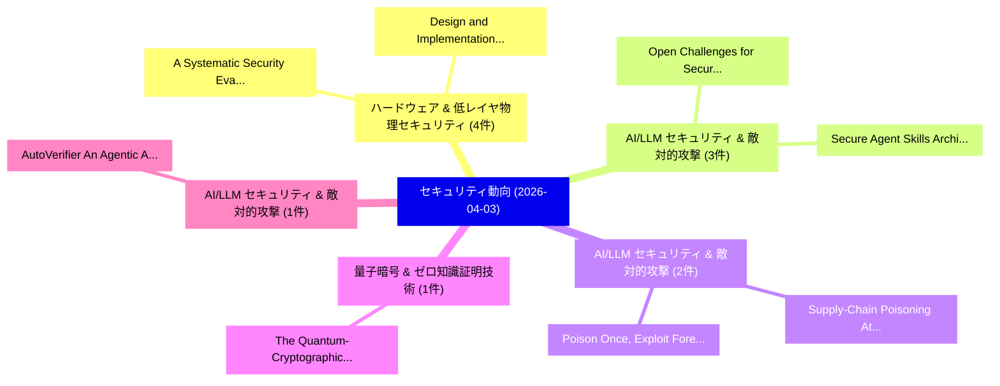

# 📅 02_daily: 日次エグゼクティブサマリー報告書 (2026-04-03)

**集計日時**: 2026-10-02 23:06:03 UTC  
**対象日付**: 2026-04-03  
**本日収集論文数**: 21 件  

---

## 💡 主要セキュリティ動向・脅威インサイト (Executive Insights)

本日の収集論文（計 21 件）において、以下の重点セキュリティ領域で活発な研究動向が確認されました：
- **ハードウェア & 低レイヤ物理セキュリティ** (4 件): 注目論文として 「A Systematic Security Evaluati...」、「Design and Implementation of a...」 等が発表され、実務防御および攻撃検証の進展が見られます。
- **AI/LLM セキュリティ & 敵対的攻撃** (3 件): 注目論文として 「Open Challenges for Secure and...」、「Secure Agent Skills: Architect...」 等が発表され、実務防御および攻撃検証の進展が見られます。
- **AI/LLM セキュリティ & 敵対的攻撃** (2 件): 注目論文として 「Poison Once, Exploit Forever: ...」、「Supply-Chain Poisoning Attacks...」 等が発表され、実務防御および攻撃検証の進展が見られます。
- **量子暗号 & ゼロ知識証明技術** (1 件): 注目論文として 「The Quantum-Cryptographic Co-e...」 等が発表され、実務防御および攻撃検証の進展が見られます。
- **AI/LLM セキュリティ & 敵対的攻撃** (1 件): 注目論文として 「AutoVerifier: An Agentic Autom...」 等が発表され、実務防御および攻撃検証の進展が見られます。

### 🗺️ 技術・脅威トピックマインドマップ

---

## 📌 日次セキュリティ論文一覧 (日本語表形式)

| No | arXiv ID | 論文タイトル (日本語訳) | 重要キーワード | 構造化エグゼクティブ要約 (背景・提案・影響) | 脅威分類 | 詳細リンク |
|---|---|---|---|---|---|---|
| 1 | `2604.02591v2` | [The Quantum-Cryptographic Co-evolution（セキュリティ分析論文）](../../okf/papers/2026-04-03/2604.02591.md) | `Cryptographic Co`, `Quantum-Cryptographic Co`, `Ashish Kundu` | 【提案】概要 (Overview & Key Finding) 本論文「The 量子-Cryptographic Co-evolution（セキュリティ分析論文）」（原題: The ...。実証評価により経営層・セキュリティ管理者向け推奨アクション (E... | `cybersecurity` | [arXiv](https://arxiv.org/abs/2604.02591v2) &#124; [OKF](../../okf/papers/2026-04-03/2604.02591.md) |
| 2 | `2604.02617v1` | [AutoVerifier: An Agentic Automated Verification Framework Using 大規模言語モデル](../../okf/papers/2026-04-03/2604.02617.md) | `Yuntao Du`, `Minh Dinh`, `Kaiyuan Zhang` | 【提案】概要 (Overview & Key Finding) 本論文「AutoVerifier: An Agentic Automated Verification Framewo...。実証評価により経営層・セキュリティ管理者向け推奨アクション (E... | `cs.AI` | [arXiv](https://arxiv.org/abs/2604.02617v1) &#124; [OKF](../../okf/papers/2026-04-03/2604.02617.md) |
| 3 | `2604.02623v2` | [Poison Once, Exploit Forever: Environment-Injected Memory Poisoning Attacks on Web Agents（セキュリティ分析論文）](../../okf/papers/2026-04-03/2604.02623.md) | `Injected Memory Poisoning Attacks`, `Exploit Forever`, `Web Agents` | 【提案】概要 (Overview & Key Finding) 本論文「Poison Once, エクスプロイト Forever: Environment-Injected Memo...。実証評価により経営層・セキュリティ管理者向け推奨アクション (E... | `cs.AI` | [arXiv](https://arxiv.org/abs/2604.02623v2) &#124; [OKF](../../okf/papers/2026-04-03/2604.02623.md) |
| 4 | `2604.02767v1` | [SentinelAgent: Intent-Verified Delegation Chains for Federal Multi-Agent AI Systemsのセキュリティ強化](../../okf/papers/2026-04-03/2604.02767.md) | `Verified Delegation Chains`, `Intent-Verified Delegation`, `Multi-Agent AI` | 【提案】概要 (Overview & Key Finding) 本論文「SentinelAgent: Intent-Verified Delegation Chains for Fe...。実証評価により経営層・セキュリティ管理者向け推奨アクション (E... | `cs.AI` | [arXiv](https://arxiv.org/abs/2604.02767v1) &#124; [OKF](../../okf/papers/2026-04-03/2604.02767.md) |
| 5 | `2604.02771v1` | [ContractShield: Bridging Semantic-Structural Gaps via Hierarchical Cross-Modal Fusion for Multi-Label 脆弱性検出 in Obfuscated Smart Contracts](../../okf/papers/2026-04-03/2604.02771.md) | `Obfuscated Smart Contracts`, `Bridging Semantic`, `Structural Gaps` | 【提案】概要 (Overview & Key Finding) 本論文「ContractShield: Bridging Semantic-Structural Gaps via H...。実証評価により経営層・セキュリティ管理者向け推奨アクション (E... | `cybersecurity` | [arXiv](https://arxiv.org/abs/2604.02771v1) &#124; [OKF](../../okf/papers/2026-04-03/2604.02771.md) |
| 6 | `2604.02774v1` | [Open Challenges for Secure and Scalable Wi-Fi Connectivity in Rural Areas（セキュリティ分析論文）](../../okf/papers/2026-04-03/2604.02774.md) | `Open Challenges`, `Scalable Wi`, `Fi Connectivity` | 【提案】概要 (Overview & Key Finding) 本論文「Open Challenges for Secure and Scalable Wi-Fi Connectiv...。実証評価により経営層・セキュリティ管理者向け推奨アクション (E... | `cs.NI` | [arXiv](https://arxiv.org/abs/2604.02774v1) &#124; [OKF](../../okf/papers/2026-04-03/2604.02774.md) |
| 7 | `2604.02837v1` | [Secure Agent Skills: Architecture, Threat Taxonomy, and Security Analysisに向けて](../../okf/papers/2026-04-03/2604.02837.md) | `Threat Taxonomy`, `Towards Secure Agent Skills`, `Secure Agent Skills` | 【提案】概要 (Overview & Key Finding) 本論文「Secure Agent Skills: Architecture, 脅威 Taxonomy, and Sec...。実証評価により経営層・セキュリティ管理者向け推奨アクション (E... | `cs.AI` | [arXiv](https://arxiv.org/abs/2604.02837v1) &#124; [OKF](../../okf/papers/2026-04-03/2604.02837.md) |
| 8 | `2604.03043v1` | [Analyzing Healthcare Interoperability Vulnerabilities: Formal Modeling and Graph-Theoretic Approach（セキュリティ分析論文）](../../okf/papers/2026-04-03/2604.03043.md) | `Analyzing Healthcare Interoperability Vulnerabilities`, `Formal Modeling`, `Jawad Mohammed` | 【提案】概要 (Overview & Key Finding) 本論文「Analyzing Healthcare Interoperability Vulnerabilities: ...。実証評価により経営層・セキュリティ管理者向け推奨アクション (E... | `cs.AI` | [arXiv](https://arxiv.org/abs/2604.03043v1) &#124; [OKF](../../okf/papers/2026-04-03/2604.03043.md) |
| 9 | `2604.03070v2` | [How Your Credentials Are Leaked by LLM Agent Skills: An Empirical Study（セキュリティ分析論文）](../../okf/papers/2026-04-03/2604.03070.md) | `Agent Skills`, `Leo Yu Zhang`, `Zhihao Chen` | 【提案】概要 (Overview & Key Finding) 本論文「How Your Credentials Are Leaked by LLM Agent Skills: An...。実証評価により経営層・セキュリティ管理者向け推奨アクション (E... | `cs.AI` | [arXiv](https://arxiv.org/abs/2604.03070v2) &#124; [OKF](../../okf/papers/2026-04-03/2604.03070.md) |
| 10 | `2604.03081v1` | [Supply-Chain Poisoning Attacks Against LLM Coding Agent Skill Ecosystems（セキュリティ分析論文）](../../okf/papers/2026-04-03/2604.03081.md) | `Coding Agent Skill Ecosystems`, `Supply-Chain Poisoning`, `Coding Agent Skill Ecosys` | 【提案】概要 (Overview & Key Finding) 本論文「Supply-Chain Poisoning Attacks Against LLM Coding Agent...。実証評価により経営層・セキュリティ管理者向け推奨アクション (E... | `cs.AI` | [arXiv](https://arxiv.org/abs/2604.03081v1) &#124; [OKF](../../okf/papers/2026-04-03/2604.03081.md) |
| 11 | `2604.03104v1` | [AlertStar: Path-Aware Alert Prediction on Hyper-Relational Knowledge Graphs（セキュリティ分析論文）](../../okf/papers/2026-04-03/2604.03104.md) | `Aware Alert Prediction`, `Relational Knowledge Graphs`, `Path-Aware Alert` | 【提案】概要 (Overview & Key Finding) 本論文「AlertStar: Path-Aware Alert Prediction on Hyper-Relatio...。実証評価により経営層・セキュリティ管理者向け推奨アクション (E... | `cs.AI` | [arXiv](https://arxiv.org/abs/2604.03104v1) &#124; [OKF](../../okf/papers/2026-04-03/2604.03104.md) |
| 12 | `2604.03121v1` | [An Independent Safety Evaluation of Kimi K2.5（セキュリティ分析論文）](../../okf/papers/2026-04-03/2604.03121.md) | `Kimi K2`, `Xin Yong`, `Parv Mahajan` | 【提案】概要 (Overview & Key Finding) 本論文「An Independent Safety Evaluation of Kimi K2.5（セキュリティ分析論...。実証評価により経営層・セキュリティ管理者向け推奨アクション (E... | `cs.AI` | [arXiv](https://arxiv.org/abs/2604.03121v1) &#124; [OKF](../../okf/papers/2026-04-03/2604.03121.md) |
| 13 | `2604.03131v1` | [A Systematic Security Evaluation of OpenClaw and Its Variants（セキュリティ分析論文）](../../okf/papers/2026-04-03/2604.03131.md) | `Yuhang Wang`, `Haichang Gao`, `Zhenxing Niu` | 【提案】概要 (Overview & Key Finding) 本論文「A Systematic Security Evaluation of OpenClaw and Its Va...。実証評価により経営層・セキュリティ管理者向け推奨アクション (E... | `cs.AI` | [arXiv](https://arxiv.org/abs/2604.03131v1) &#124; [OKF](../../okf/papers/2026-04-03/2604.03131.md) |
| 14 | `2604.03199v1` | [Learning the Signature of Memorization in Autoregressive Language Models（セキュリティ分析論文）](../../okf/papers/2026-04-03/2604.03199.md) | `Autoregressive Language Models`, `Kostadin Cvejoski`, `Evgeny Grigorenko` | 【提案】概要 (Overview & Key Finding) 本論文「Learning the Signature of Memorization in Autoregressiv...。実証評価により経営層・セキュリティ管理者向け推奨アクション (E... | `executive-summary` | [arXiv](https://arxiv.org/abs/2604.03199v1) &#124; [OKF](../../okf/papers/2026-04-03/2604.03199.md) |
| 15 | `2604.03205v1` | [A Tsetlin Machine-driven Intrusion Detection System for Next-Generation IoMT Security（セキュリティ分析論文）](../../okf/papers/2026-04-03/2604.03205.md) | `Intrusion Detection System`, `Tsetlin Machine`, `Machine-driven Intrusion` | 【提案】概要 (Overview & Key Finding) 本論文「A Tsetlin Machine-driven Intrusion Detection System for...。実証評価により経営層・セキュリティ管理者向け推奨アクション (E... | `executive-summary` | [arXiv](https://arxiv.org/abs/2604.03205v1) &#124; [OKF](../../okf/papers/2026-04-03/2604.03205.md) |
| 16 | `2604.03330v1` | [AICCE: AI Driven Compliance Checker Engine（セキュリティ分析論文）](../../okf/papers/2026-04-03/2604.03330.md) | `Driven Compliance Checker Engine`, `Mohammad Wali Ur Rahman`, `Martin Manuel Lopez` | 【提案】概要 (Overview & Key Finding) 本論文「AICCE: AI Driven Compliance Checker Engine（セキュリティ分析論文）」...。実証評価により経営層・セキュリティ管理者向け推奨アクション (E... | `cs.AI` | [arXiv](https://arxiv.org/abs/2604.03330v1) &#124; [OKF](../../okf/papers/2026-04-03/2604.03330.md) |
| 17 | `2604.03331v2` | [Design and Implementation of an Open-Source Security Framework for Cloud Infrastructure（セキュリティ分析論文）](../../okf/papers/2026-04-03/2604.03331.md) | `Cloud Infrastructure`, `Open-Source Security`, `Wanru Shao` | 【提案】概要 (Overview & Key Finding) 本論文「Design and Implementation of an Open-Source Security Fr...。実証評価により経営層・セキュリティ管理者向け推奨アクション (E... | `cybersecurity` | [arXiv](https://arxiv.org/abs/2604.03331v2) &#124; [OKF](../../okf/papers/2026-04-03/2604.03331.md) |
| 18 | `2604.03396v1` | [Security Universal Circuits as a Mechanism for Hardware Obfuscationの分析](../../okf/papers/2026-04-03/2604.03396.md) | `Security Universal Circuits`, `Universal Circuits`, `Hardware Obfuscation` | 【提案】概要 (Overview & Key Finding) 本論文「Security Universal Circuits as a Mechanism for Hardware...。実証評価により経営層・セキュリティ管理者向け推奨アクション (E... | `cybersecurity` | [arXiv](https://arxiv.org/abs/2604.03396v1) &#124; [OKF](../../okf/papers/2026-04-03/2604.03396.md) |
| 19 | `2604.03425v1` | [AEGIS: Scaling Long-Sequence Homomorphic Encrypted Transformer Inference via Hybrid Parallelism on Multi-GPU Systems（セキュリティ分析論文）](../../okf/papers/2026-04-03/2604.03425.md) | `Sequence Homomorphic Encrypted Transformer Inference`, `Scaling Long`, `Hybrid Parallelism` | 【提案】概要 (Overview & Key Finding) 本論文「AEGIS: Scaling Long-Sequence Homomorphic Encrypted Tran...。実証評価により経営層・セキュリティ管理者向け推奨アクション (E... | `cs.AI` | [arXiv](https://arxiv.org/abs/2604.03425v1) &#124; [OKF](../../okf/papers/2026-04-03/2604.03425.md) |
| 20 | `2604.03434v1` | [Trustless Provenance Trees: A Game-Theoretic Framework for Operator-Gated Blockchain Registries（セキュリティ分析論文）](../../okf/papers/2026-04-03/2604.03434.md) | `Trustless Provenance Trees`, `Gated Blockchain Registries`, `Operator-Gated Blockchain` | 【提案】概要 (Overview & Key Finding) 本論文「Trustless Provenance Trees: A Game-Theoretic Framework ...。実証評価により経営層・セキュリティ管理者向け推奨アクション (E... | `executive-summary` | [arXiv](https://arxiv.org/abs/2604.03434v1) &#124; [OKF](../../okf/papers/2026-04-03/2604.03434.md) |
| 21 | `2604.04952v7` | [ML Defender (aRGus NDR): An Open-Source Embedded ML NIDS for Botnet and Anomalous Traffic Detection in Resource-Constrained Organizations（セキュリティ分析論文）](../../okf/papers/2026-04-03/2604.04952.md) | `Anomalous Traffic Detection`, `Source Embedded`, `Constrained Organizations` | 【提案】概要 (Overview & Key Finding) 本論文「ML Defender (aRGus NDR): An Open-Source Embedded ML NID...。実証評価により経営層・セキュリティ管理者向け推奨アクション (E... | `cybersecurity` | [arXiv](https://arxiv.org/abs/2604.04952v7) &#124; [OKF](../../okf/papers/2026-04-03/2604.04952.md) |

