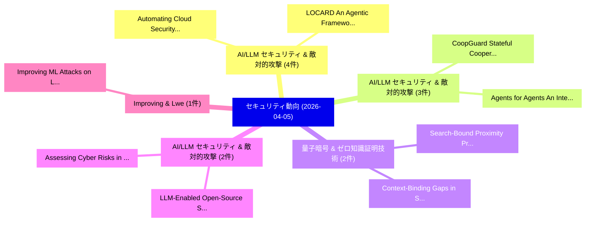

# 📅 02_daily: 日次エグゼクティブサマリー報告書 (2026-04-05)

**集計日時**: 2026-10-02 23:06:04 UTC  
**対象日付**: 2026-04-05  
**本日収集論文数**: 33 件  

---

## 💡 主要セキュリティ動向・脅威インサイト (Executive Insights)

本日の収集論文（計 33 件）において、以下の重点セキュリティ領域で活発な研究動向が確認されました：
- **AI/LLM セキュリティ & 敵対的攻撃** (4 件): 注目論文として 「Automating Cloud Security and ...」、「LOCARD: An Agentic Framework f...」 等が発表され、実務防御および攻撃検証の進展が見られます。
- **AI/LLM セキュリティ & 敵対的攻撃** (3 件): 注目論文として 「CoopGuard: Stateful Cooperativ...」、「Agents for Agents: An Interrog...」 等が発表され、実務防御および攻撃検証の進展が見られます。
- **量子暗号 & ゼロ知識証明技術** (2 件): 注目論文として 「Context-Binding Gaps in Statef...」、「Search-Bound Proximity Proofs:...」 等が発表され、実務防御および攻撃検証の進展が見られます。
- **AI/LLM セキュリティ & 敵対的攻撃** (2 件): 注目論文として 「Assessing Cyber Risks in Hydro...」、「LLM-Enabled Open-Source System...」 等が発表され、実務防御および攻撃検証の進展が見られます。
- **Improving & Lwe** (1 件): 注目論文として 「Improving ML Attacks on LWE wi...」 等が発表され、実務防御および攻撃検証の進展が見られます。

### 🗺️ 技術・脅威トピックマインドマップ

---

## 📌 日次セキュリティ論文一覧 (日本語表形式)

| No | arXiv ID | 論文タイトル (日本語訳) | 重要キーワード | 構造化エグゼクティブ要約 (背景・提案・影響) | 脅威分類 | 詳細リンク |
|---|---|---|---|---|---|---|
| 1 | `2604.03900v1` | [Context-Binding Gaps in Stateful Zero-Knowledge Proximity Proofs: Taxonomy, Separation, and Mitigation（セキュリティ分析論文）](../../okf/papers/2026-04-05/2604.03900.md) | `Knowledge Proximity Proofs`, `Binding Gaps`, `Context-Binding Gaps` | 【提案】概要 (Overview & Key Finding) 本論文「Context-Binding Gaps in Stateful Zero-Knowledge Proximi...。実証評価により経営層・セキュリティ管理者向け推奨アクション (E... | `cybersecurity` | [arXiv](https://arxiv.org/abs/2604.03900v1) &#124; [OKF](../../okf/papers/2026-04-05/2604.03900.md) |
| 2 | `2604.03902v1` | [Search-Bound Proximity Proofs: Binding Encrypted Geographic Search to Zero-Knowledge Verification（セキュリティ分析論文）](../../okf/papers/2026-04-05/2604.03902.md) | `Binding Encrypted Geographic Search`, `Bound Proximity Proofs`, `Search-Bound Proximity` | 【提案】概要 (Overview & Key Finding) 本論文「Search-Bound Proximity Proofs: Binding Encrypted Geogra...。実証評価により経営層・セキュリティ管理者向け推奨アクション (E... | `cs.NI` | [arXiv](https://arxiv.org/abs/2604.03902v1) &#124; [OKF](../../okf/papers/2026-04-05/2604.03902.md) |
| 3 | `2604.03903v1` | [Improving ML Attacks on LWE with Data Repetition and Stepwise Regression（セキュリティ分析論文）](../../okf/papers/2026-04-05/2604.03903.md) | `Data Repetition`, `Stepwise Regression`, `Alberto Alfarano` | 【提案】概要 (Overview & Key Finding) 本論文「Improving ML Attacks on LWE with Data Repetition and St...。実証評価により経営層・セキュリティ管理者向け推奨アクション (E... | `executive-summary` | [arXiv](https://arxiv.org/abs/2604.03903v1) &#124; [OKF](../../okf/papers/2026-04-05/2604.03903.md) |
| 4 | `2604.03912v1` | [Automating Cloud Security and Forensics Through a Secure-by-Design Generative AI Framework（セキュリティ分析論文）](../../okf/papers/2026-04-05/2604.03912.md) | `Automating Cloud Security`, `Design Generative`, `Ivan Roberto Kawaminami Garcia` | 【提案】概要 (Overview & Key Finding) 本論文「Automating Cloud Security and Forensics Through a Secur...。実証評価により経営層・セキュリティ管理者向け推奨アクション (E... | `cs.AI` | [arXiv](https://arxiv.org/abs/2604.03912v1) &#124; [OKF](../../okf/papers/2026-04-05/2604.03912.md) |
| 5 | `2604.03968v1` | [TraceGuard: Structured Multi-Dimensional Monitoring as a Collusion-Resistant Control Protocol（セキュリティ分析論文）](../../okf/papers/2026-04-05/2604.03968.md) | `Resistant Control Protocol`, `Structured Multi`, `Dimensional Monitoring` | 【提案】概要 (Overview & Key Finding) 本論文「TraceGuard: Structured Multi-Dimensional Monitoring as ...。実証評価により経営層・セキュリティ管理者向け推奨アクション (E... | `cs.AI` | [arXiv](https://arxiv.org/abs/2604.03968v1) &#124; [OKF](../../okf/papers/2026-04-05/2604.03968.md) |
| 6 | `2604.03994v1` | [Assessing Cyber Risks in Hydropower Systems Through HAZOP and Bow-Tie Analysis（セキュリティ分析論文）](../../okf/papers/2026-04-05/2604.03994.md) | `Assessing Cyber Risks`, `Md Rasel Al Mamun`, `Kwabena Opoku Frempong` | 【提案】概要 (Overview & Key Finding) 本論文「Assessing Cyber Risks in Hydropower Systems Through HAZ...。実証評価により経営層・セキュリティ管理者向け推奨アクション (E... | `cybersecurity` | [arXiv](https://arxiv.org/abs/2604.03994v1) &#124; [OKF](../../okf/papers/2026-04-05/2604.03994.md) |
| 7 | `2604.04015v1` | [Enabling Deterministic User-Level Interrupts in Real-Time Processors via Hardware Extension（セキュリティ分析論文）](../../okf/papers/2026-04-05/2604.04015.md) | `Enabling Deterministic User`, `Level Interrupts`, `User-Level Interrupts` | 【提案】概要 (Overview & Key Finding) 本論文「Enabling Deterministic User-Level Interrupts in Real-Ti...。実証評価により経営層・セキュリティ管理者向け推奨アクション (E... | `executive-summary` | [arXiv](https://arxiv.org/abs/2604.04015v1) &#124; [OKF](../../okf/papers/2026-04-05/2604.04015.md) |
| 8 | `2604.04030v1` | [Jellyfish: Zero-Shot Federated Unlearning Scheme with Knowledge Disentanglement（セキュリティ分析論文）](../../okf/papers/2026-04-05/2604.04030.md) | `Shot Federated Unlearning Scheme`, `Knowledge Disentanglement`, `Zero-Shot Federated` | 【提案】概要 (Overview & Key Finding) 本論文「Jellyfish: Zero-Shot Federated Unlearning Scheme with K...。実証評価により経営層・セキュリティ管理者向け推奨アクション (E... | `executive-summary` | [arXiv](https://arxiv.org/abs/2604.04030v1) &#124; [OKF](../../okf/papers/2026-04-05/2604.04030.md) |
| 9 | `2604.04035v1` | [Causality Laundering: Denial-Feedback Leakage in Tool-Calling LLMエージェント](../../okf/papers/2026-04-05/2604.04035.md) | `Causality Laundering`, `Feedback Leakage`, `Denial-Feedback Leakage` | 【提案】概要 (Overview & Key Finding) 本論文「Causality Laundering: Denial-Feedback Leakage in Tool-C...。実証評価により経営層・セキュリティ管理者向け推奨アクション (E... | `cs.AI` | [arXiv](https://arxiv.org/abs/2604.04035v1) &#124; [OKF](../../okf/papers/2026-04-05/2604.04035.md) |
| 10 | `2604.04060v1` | [CoopGuard: Stateful Cooperative Agents Safeguarding LLMs Against Evolving Multi-Round Attacks（セキュリティ分析論文）](../../okf/papers/2026-04-05/2604.04060.md) | `Stateful Cooperative Agents Safeguarding`, `Round Attacks`, `Multi-Round Attacks` | 【提案】概要 (Overview & Key Finding) 本論文「CoopGuard: Stateful Cooperative Agents Safeguarding LLM...。実証評価により経営層・セキュリティ管理者向け推奨アクション (E... | `cs.AI` | [arXiv](https://arxiv.org/abs/2604.04060v1) &#124; [OKF](../../okf/papers/2026-04-05/2604.04060.md) |
| 11 | `2604.04082v1` | [Styx: Collaborative and Private Data Processing With TEE-Enforced Sticky Policy（セキュリティ分析論文）](../../okf/papers/2026-04-05/2604.04082.md) | `Enforced Sticky Policy`, `TEE-Enforced Sticky`, `Shixuan Zhao` | 【提案】概要 (Overview & Key Finding) 本論文「Styx: Collaborative and Private Data Processing With TE...。実証評価により経営層・セキュリティ管理者向け推奨アクション (E... | `cybersecurity` | [arXiv](https://arxiv.org/abs/2604.04082v1) &#124; [OKF](../../okf/papers/2026-04-05/2604.04082.md) |
| 12 | `2604.04099v1` | [Invisible Adversaries: A Systematic Study of Session Manipulation Attacks on VPNs（セキュリティ分析論文）](../../okf/papers/2026-04-05/2604.04099.md) | `Session Manipulation Attacks`, `Invisible Adversaries`, `Yuxiang Yang` | 【提案】概要 (Overview & Key Finding) 本論文「Invisible Adversaries: A Systematic Study of Session Ma...。実証評価により経営層・セキュリティ管理者向け推奨アクション (E... | `cybersecurity` | [arXiv](https://arxiv.org/abs/2604.04099v1) &#124; [OKF](../../okf/papers/2026-04-05/2604.04099.md) |
| 13 | `2604.04102v1` | [Triggering and Detecting Exploitable Library Vulnerability from the Client by Directed Greybox Fuzzing（セキュリティ分析論文）](../../okf/papers/2026-04-05/2604.04102.md) | `Detecting Exploitable Library Vulnerability`, `Directed Greybox Fuzzing`, `Yukai Zhao` | 【提案】概要 (Overview & Key Finding) 本論文「Triggering and Detecting Exploitable Library 脆弱性 from t...。実証評価により経営層・セキュリティ管理者向け推奨アクション (E... | `executive-summary` | [arXiv](https://arxiv.org/abs/2604.04102v1) &#124; [OKF](../../okf/papers/2026-04-05/2604.04102.md) |
| 14 | `2604.04121v1` | [NetSecBed: A Container-Native Testbed for Reproducible サイバーセキュリティ Experimentation](../../okf/papers/2026-04-05/2604.04121.md) | `Native Testbed`, `Container-Native Testbed`, `Reproducible Cybersecurity Experimentation` | 【提案】概要 (Overview & Key Finding) 本論文「NetSecBed: A Container-Native Testbed for Reproducible ...。実証評価により経営層・セキュリティ管理者向け推奨アクション (E... | `cs.NI` | [arXiv](https://arxiv.org/abs/2604.04121v1) &#124; [OKF](../../okf/papers/2026-04-05/2604.04121.md) |
| 15 | `2604.04179v1` | [Beamforming Feedback as a Novel Attack Surface for Wi-Fi Physical-Layer Security（セキュリティ分析論文）](../../okf/papers/2026-04-05/2604.04179.md) | `Beamforming Feedback`, `Fi Physical`, `Layer Security` | 【提案】概要 (Overview & Key Finding) 本論文「Beamforming Feedback as a Novel Attack Surface for Wi-F...。実証評価により経営層・セキュリティ管理者向け推奨アクション (E... | `executive-summary` | [arXiv](https://arxiv.org/abs/2604.04179v1) &#124; [OKF](../../okf/papers/2026-04-05/2604.04179.md) |
| 16 | `2604.04191v1` | [Merkle Tree Certificate Post-Quantum PKI for Kubernetes and Cloud-Native 5G/B5G Core（セキュリティ分析論文）](../../okf/papers/2026-04-05/2604.04191.md) | `Merkle Tree Certificate Post`, `Post-Quantum PKI`, `Cloud-Native 5G` | 【提案】概要 (Overview & Key Finding) 本論文「Merkle Tree Certificate Post-量子 PKI for Kubernetes and ...。実証評価により経営層・セキュリティ管理者向け推奨アクション (E... | `cybersecurity` | [arXiv](https://arxiv.org/abs/2604.04191v1) &#124; [OKF](../../okf/papers/2026-04-05/2604.04191.md) |
| 17 | `2604.04193v2` | [Perils of Parallelism: Transaction Fee Mechanisms under Execution Uncertainty（セキュリティ分析論文）](../../okf/papers/2026-04-05/2604.04193.md) | `Transaction Fee Mechanisms`, `Execution Uncertainty`, `Sarisht Wadhwa` | 【提案】概要 (Overview & Key Finding) 本論文「Perils of Parallelism: Transaction Fee Mechanisms under...。実証評価により経営層・セキュリティ管理者向け推奨アクション (E... | `executive-summary` | [arXiv](https://arxiv.org/abs/2604.04193v2) &#124; [OKF](../../okf/papers/2026-04-05/2604.04193.md) |
| 18 | `2604.04211v2` | [LOCARD: An Agentic Framework for Blockchain Forensics（セキュリティ分析論文）](../../okf/papers/2026-04-05/2604.04211.md) | `Blockchain Forensics`, `Xiaohang Yu`, `William Knottenbelt` | 【提案】概要 (Overview & Key Finding) 本論文「LOCARD: An Agentic Framework for Blockchain Forensics（セ...。実証評価により経営層・セキュリティ管理者向け推奨アクション (E... | `cs.AI` | [arXiv](https://arxiv.org/abs/2604.04211v2) &#124; [OKF](../../okf/papers/2026-04-05/2604.04211.md) |
| 19 | `2604.04255v1` | [Unveiling Vulnerabilities of Large Reasoning Models in Machine Unlearningに向けて](../../okf/papers/2026-04-05/2604.04255.md) | `Large Reasoning Models`, `Towards Unveiling Vulnerabilities`, `Machine Unlearning` | 【提案】概要 (Overview & Key Finding) 本論文「Unveiling Vulnerabilities of Large Reasoning Models in ...。実証評価により経営層・セキュリティ管理者向け推奨アクション (E... | `executive-summary` | [arXiv](https://arxiv.org/abs/2604.04255v1) &#124; [OKF](../../okf/papers/2026-04-05/2604.04255.md) |
| 20 | `2604.04262v1` | [Agents for Agents: An Interrogator-Based Secure Framework for Autonomous Internet of Underwater Things（セキュリティ分析論文）](../../okf/papers/2026-04-05/2604.04262.md) | `Autonomous Internet`, `Underwater Things`, `Interrogator-Based Secure` | 【提案】概要 (Overview & Key Finding) 本論文「Agents for Agents: An Interrogator-Based Secure Framewo...。実証評価により経営層・セキュリティ管理者向け推奨アクション (E... | `cs.AI` | [arXiv](https://arxiv.org/abs/2604.04262v1) &#124; [OKF](../../okf/papers/2026-04-05/2604.04262.md) |
| 21 | `2604.04265v1` | [Governance-Constrained Agentic AI: Blockchain-Enforced Human Oversight for Safety-Critical Wildfire Monitoring（セキュリティ分析論文）](../../okf/papers/2026-04-05/2604.04265.md) | `Enforced Human Oversight`, `Critical Wildfire Monitoring`, `Constrained Agentic` | 【提案】概要 (Overview & Key Finding) 本論文「Governance-Constrained Agentic AI: Blockchain-Enforced ...。実証評価により経営層・セキュリティ管理者向け推奨アクション (E... | `cs.AI` | [arXiv](https://arxiv.org/abs/2604.04265v1) &#124; [OKF](../../okf/papers/2026-04-05/2604.04265.md) |
| 22 | `2604.04283v1` | [Semantics Over Syntax: Uncovering Pre-Authentication 5G Baseband Vulnerabilities（セキュリティ分析論文）](../../okf/papers/2026-04-05/2604.04283.md) | `Uncovering Pre`, `Baseband Vulnerabilities`, `Pre-Authentication 5G` | 【提案】概要 (Overview & Key Finding) 本論文「Semantics Over Syntax: Uncovering Pre-Authentication 5G...。実証評価により経営層・セキュリティ管理者向け推奨アクション (E... | `cybersecurity` | [arXiv](https://arxiv.org/abs/2604.04283v1) &#124; [OKF](../../okf/papers/2026-04-05/2604.04283.md) |
| 23 | `2604.04288v2` | [LLM-Enabled Open-Source Systems in the Wild: Vulnerabilities in GitHub Security Advisoriesの実証研究](../../okf/papers/2026-04-05/2604.04288.md) | `Enabled Open`, `Source Systems`, `LLM-Enabled Open` | 【提案】概要 (Overview & Key Finding) 本論文「LLM-Enabled Open-Source Systems in the Wild: Vulnerabil...。実証評価により経営層・セキュリティ管理者向け推奨アクション (E... | `executive-summary` | [arXiv](https://arxiv.org/abs/2604.04288v2) &#124; [OKF](../../okf/papers/2026-04-05/2604.04288.md) |
| 24 | `2604.04289v1` | [Poisoned Identifiers Survive LLM Deobfuscation: A Case Study on Claude Opus 4.6（セキュリティ分析論文）](../../okf/papers/2026-04-05/2604.04289.md) | `Poisoned Identifiers Survive`, `Claude Opus`, `Raw Meta` | 【提案】概要 (Overview & Key Finding) 本論文「Poisoned Identifiers Survive LLM Deobfuscation: A Case ...。実証評価により経営層・セキュリティ管理者向け推奨アクション (E... | `cs.AI` | [arXiv](https://arxiv.org/abs/2604.04289v1) &#124; [OKF](../../okf/papers/2026-04-05/2604.04289.md) |
| 25 | `2604.04293v1` | [Evaluating Future Air Traffic Management Security（セキュリティ分析論文）](../../okf/papers/2026-04-05/2604.04293.md) | `Evaluating Future Air Traffic Management Security`, `Konstantinos Spalas`, `Raw Meta` | 【提案】概要 (Overview & Key Finding) 本論文「Evaluating Future Air Traffic Management Security（セキュリテ...。実証評価により経営層・セキュリティ管理者向け推奨アクション (E... | `executive-summary` | [arXiv](https://arxiv.org/abs/2604.04293v1) &#124; [OKF](../../okf/papers/2026-04-05/2604.04293.md) |
| 26 | `2604.04989v1` | [SkillAttack: Automated Red Teaming of Agent Skills through Attack Path Refinement（セキュリティ分析論文）](../../okf/papers/2026-04-05/2604.04989.md) | `Automated Red Teaming`, `Attack Path Refinement`, `Agent Skills` | 【提案】概要 (Overview & Key Finding) 本論文「SkillAttack: Automated Red Teaming of Agent Skills thro...。実証評価により経営層・セキュリティ管理者向け推奨アクション (E... | `cybersecurity` | [arXiv](https://arxiv.org/abs/2604.04989v1) &#124; [OKF](../../okf/papers/2026-04-05/2604.04989.md) |
| 27 | `2604.04992v1` | [FreakOut-LLM: The Effect of Emotional Stimuli on Safety Alignment（セキュリティ分析論文）](../../okf/papers/2026-04-05/2604.04992.md) | `Emotional Stimuli`, `Safety Alignment`, `Daniel Kuznetsov` | 【提案】概要 (Overview & Key Finding) 本論文「FreakOut-LLM: The Effect of Emotional Stimuli on Safety...。実証評価により経営層・セキュリティ管理者向け推奨アクション (E... | `cs.AI` | [arXiv](https://arxiv.org/abs/2604.04992v1) &#124; [OKF](../../okf/papers/2026-04-05/2604.04992.md) |
| 28 | `2604.04993v1` | [The Hiremath Early Detection (HED) Score: A Measure-Theoretic Evaluation Standard for Temporal Intelligence（セキュリティ分析論文）](../../okf/papers/2026-04-05/2604.04993.md) | `Temporal Intelligence`, `Prakul Sunil Hiremath`, `Raw Meta` | 【提案】概要 (Overview & Key Finding) 本論文「The Hiremath Early Detection (HED) Score: A Measure-The...。実証評価により経営層・セキュリティ管理者向け推奨アクション (E... | `stat.ME` | [arXiv](https://arxiv.org/abs/2604.04993v1) &#124; [OKF](../../okf/papers/2026-04-05/2604.04993.md) |
| 29 | `2604.04995v1` | [Streaming Chain（セキュリティ分析論文）](../../okf/papers/2026-04-05/2604.04995.md) | `Streaming Chain`, `Yi Lyu`, `Raw Meta` | 【提案】概要 (Overview & Key Finding) 本論文「Streaming Chain（セキュリティ分析論文）」（原題: Streaming Chain / arXi...。実証評価により経営層・セキュリティ管理者向け推奨アクション (E... | `cybersecurity` | [arXiv](https://arxiv.org/abs/2604.04995v1) &#124; [OKF](../../okf/papers/2026-04-05/2604.04995.md) |
| 30 | `2604.06240v1` | [The Art of Building Verifiers for Computer Use Agents（セキュリティ分析論文）](../../okf/papers/2026-04-05/2604.06240.md) | `Computer Use Agents`, `Building Verifiers`, `Corby Rosset` | 【提案】概要 (Overview & Key Finding) 本論文「The Art of Building Verifiers for Computer Use Agents（セ...。実証評価により経営層・セキュリティ管理者向け推奨アクション (E... | `cs.AI` | [arXiv](https://arxiv.org/abs/2604.06240v1) &#124; [OKF](../../okf/papers/2026-04-05/2604.06240.md) |
| 31 | `2604.06241v1` | [ZitPit: Consumer-Side Admission Control for Agentic Software Intake（セキュリティ分析論文）](../../okf/papers/2026-04-05/2604.06241.md) | `Side Admission Control`, `Agentic Software Intake`, `Consumer-Side Admission` | 【提案】概要 (Overview & Key Finding) 本論文「ZitPit: Consumer-Side Admission Control for Agentic Sof...。実証評価により経営層・セキュリティ管理者向け推奨アクション (E... | `cybersecurity` | [arXiv](https://arxiv.org/abs/2604.06241v1) &#124; [OKF](../../okf/papers/2026-04-05/2604.06241.md) |
| 32 | `2604.16427v1` | [Refunded but Rewarded: The Double Dip Attack on Cashback Reward Engines（セキュリティ分析論文）](../../okf/papers/2026-04-05/2604.16427.md) | `Cashback Reward Engines`, `Zia Ur Rashid`, `Suman Rath` | 【提案】概要 (Overview & Key Finding) 本論文「Refunded but Rewarded: The Double Dip Attack on Cashbac...。実証評価により経営層・セキュリティ管理者向け推奨アクション (E... | `cs.CE` | [arXiv](https://arxiv.org/abs/2604.16427v1) &#124; [OKF](../../okf/papers/2026-04-05/2604.16427.md) |
| 33 | `2606.15650v1` | [AnonShield: Scalable On-Premise Pseudonymization for CSIRT Vulnerability Data（セキュリティ分析論文）](../../okf/papers/2026-04-05/2606.15650.md) | `Premise Pseudonymization`, `On-Premise Pseudonymization`, `Vulnerability Data` | 【提案】概要 (Overview & Key Finding) 本論文「AnonShield: Scalable On-Premise Pseudonymization for CS...。実証評価により経営層・セキュリティ管理者向け推奨アクション (E... | `cs.AI` | [arXiv](https://arxiv.org/abs/2606.15650v1) &#124; [OKF](../../okf/papers/2026-04-05/2606.15650.md) |

