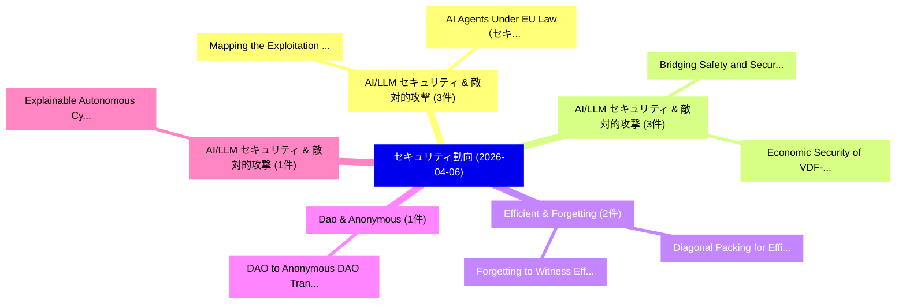

# 📅 02_daily: 日次エグゼクティブサマリー報告書 (2026-04-06)

**集計日時**: 2026-10-02 23:06:04 UTC  
**対象日付**: 2026-04-06  
**本日収集論文数**: 27 件  

---

## 💡 主要セキュリティ動向・脅威インサイト (Executive Insights)

本日の収集論文（計 27 件）において、以下の重点セキュリティ領域で活発な研究動向が確認されました：
- **AI/LLM セキュリティ & 敵対的攻撃** (3 件): 注目論文として 「Mapping the Exploitation Surfa...」、「AI Agents Under EU Law（セキュリティ分...」 等が発表され、実務防御および攻撃検証の進展が見られます。
- **AI/LLM セキュリティ & 敵対的攻撃** (3 件): 注目論文として 「Bridging Safety and Security i...」、「Economic Security of VDF-Based...」 等が発表され、実務防御および攻撃検証の進展が見られます。
- **Efficient & Forgetting** (2 件): 注目論文として 「Diagonal Packing for Efficient...」、「Forgetting to Witness: Efficie...」 等が発表され、実務防御および攻撃検証の進展が見られます。
- **Dao & Anonymous** (1 件): 注目論文として 「DAO to (Anonymous) DAO Transac...」 等が発表され、実務防御および攻撃検証の進展が見られます。
- **AI/LLM セキュリティ & 敵対的攻撃** (1 件): 注目論文として 「Explainable Autonomous Cyber D...」 等が発表され、実務防御および攻撃検証の進展が見られます。

### 🗺️ 技術・脅威トピックマインドマップ

---

## 📌 日次セキュリティ論文一覧 (日本語表形式)

| No | arXiv ID | 論文タイトル (日本語訳) | 重要キーワード | 構造化エグゼクティブ要約 (背景・提案・影響) | 脅威分類 | 詳細リンク |
|---|---|---|---|---|---|---|
| 1 | `2604.04369v2` | [DAO to (Anonymous) DAO Transactions（セキュリティ分析論文）](../../okf/papers/2026-04-06/2604.04369.md) | `Minfeng Qi`, `Lin Zhong`, `Qin Wang` | 【提案】概要 (Overview & Key Finding) 本論文「DAO to (Anonymous) DAO Transactions（セキュリティ分析論文）」（原題: DA...。実証評価により経営層・セキュリティ管理者向け推奨アクション (E... | `cs.ET` | [arXiv](https://arxiv.org/abs/2604.04369v2) &#124; [OKF](../../okf/papers/2026-04-06/2604.04369.md) |
| 2 | `2604.04442v1` | [Explainable Autonomous Cyber Defense using Adversarial Multi-Agent Reinforcement Learning（セキュリティ分析論文）](../../okf/papers/2026-04-06/2604.04442.md) | `Explainable Autonomous Cyber Defense`, `Agent Reinforcement Learning`, `Adversarial Multi` | 【提案】概要 (Overview & Key Finding) 本論文「Explainable Autonomous Cyber Defense using Adversarial ...。実証評価により経営層・セキュリティ管理者向け推奨アクション (E... | `executive-summary` | [arXiv](https://arxiv.org/abs/2604.04442v1) &#124; [OKF](../../okf/papers/2026-04-06/2604.04442.md) |
| 3 | `2604.04522v1` | [HDP: A Lightweight Cryptographic Protocol for Human Delegation Provenance in Agentic AI Systems（セキュリティ分析論文）](../../okf/papers/2026-04-06/2604.04522.md) | `Lightweight Cryptographic Protocol`, `Human Delegation Provenance`, `Human Delegation Prov` | 【提案】概要 (Overview & Key Finding) 本論文「HDP: A Lightweight Cryptographic Protocol for Human Del...。実証評価により経営層・セキュリティ管理者向け推奨アクション (E... | `executive-summary` | [arXiv](https://arxiv.org/abs/2604.04522v1) &#124; [OKF](../../okf/papers/2026-04-06/2604.04522.md) |
| 4 | `2604.04561v1` | [Mapping the Exploitation Surface: A 10,000-Trial Taxonomy of What Makes LLMエージェント Exploit Vulnerabilities](../../okf/papers/2026-04-06/2604.04561.md) | `Exploitation Surface`, `Trial Taxonomy`, `000-Trial Taxonomy` | 【提案】概要 (Overview & Key Finding) 本論文「Mapping the Exploitation Surface: A 10,000-Trial Taxono...。実証評価により経営層・セキュリティ管理者向け推奨アクション (E... | `cs.AI` | [arXiv](https://arxiv.org/abs/2604.04561v1) &#124; [OKF](../../okf/papers/2026-04-06/2604.04561.md) |
| 5 | `2604.04572v1` | [Digital Privacy in IoT: Exploring Challenges, Approaches and Open Issues（セキュリティ分析論文）](../../okf/papers/2026-04-06/2604.04572.md) | `Digital Privacy`, `Exploring Challenges`, `Open Issues` | 【提案】概要 (Overview & Key Finding) 本論文「Digital Privacy in IoT: Exploring Challenges, Approache...。実証評価により経営層・セキュリティ管理者向け推奨アクション (E... | `cybersecurity` | [arXiv](https://arxiv.org/abs/2604.04572v1) &#124; [OKF](../../okf/papers/2026-04-06/2604.04572.md) |
| 6 | `2604.04604v1` | [AI Agents Under EU Law（セキュリティ分析論文）](../../okf/papers/2026-04-06/2604.04604.md) | `Adam Leon Smith`, `Michele Joshua Maggini`, `Luca Nannini` | 【提案】概要 (Overview & Key Finding) 本論文「AI Agents Under EU Law（セキュリティ分析論文）」（原題: AI Agents Under...。実証評価により経営層・セキュリティ管理者向け推奨アクション (E... | `cs.AI` | [arXiv](https://arxiv.org/abs/2604.04604v1) &#124; [OKF](../../okf/papers/2026-04-06/2604.04604.md) |
| 7 | `2604.04611v2` | [Dynamic Free-Rider Detection in 連合学習 via Simulated Attack Patterns](../../okf/papers/2026-04-06/2604.04611.md) | `Simulated Attack Patterns`, `Dynamic Free`, `Rider Detection` | 【提案】概要 (Overview & Key Finding) 本論文「Dynamic Free-Rider Detection in 連合学習 via Simulated Atta...。実証評価により経営層・セキュリティ管理者向け推奨アクション (E... | `executive-summary` | [arXiv](https://arxiv.org/abs/2604.04611v2) &#124; [OKF](../../okf/papers/2026-04-06/2604.04611.md) |
| 8 | `2604.04683v2` | [Diagonal Packing for Efficient Homomorphic Sparse Matrix-Vector Multiplication（セキュリティ分析論文）](../../okf/papers/2026-04-06/2604.04683.md) | `Efficient Homomorphic Sparse Matrix`, `Diagonal Packing`, `Vector Multiplication` | 【提案】概要 (Overview & Key Finding) 本論文「Diagonal Packing for Efficient Homomorphic Sparse Matri...。実証評価により経営層・セキュリティ管理者向け推奨アクション (E... | `executive-summary` | [arXiv](https://arxiv.org/abs/2604.04683v2) &#124; [OKF](../../okf/papers/2026-04-06/2604.04683.md) |
| 9 | `2604.04696v2` | [GPIR: Enabling Practical Private Information Retrieval with GPUs（セキュリティ分析論文）](../../okf/papers/2026-04-06/2604.04696.md) | `Enabling Practical Private Information Retrieval`, `Jung Ho Ahn`, `Hyesung Ji` | 【提案】概要 (Overview & Key Finding) 本論文「GPIR: Enabling Practical Private Information Retrieval ...。実証評価によりEdward Suh。 | `executive-summary` | [arXiv](https://arxiv.org/abs/2604.04696v2) &#124; [OKF](../../okf/papers/2026-04-06/2604.04696.md) |
| 10 | `2604.04705v1` | [Bridging Safety and Security in Complex Systems: A Model-Based Approach with SAFT-GT Toolchain（セキュリティ分析論文）](../../okf/papers/2026-04-06/2604.04705.md) | `Bridging Safety`, `Complex Systems`, `SAFT-GT Toolchain` | 【提案】概要 (Overview & Key Finding) 本論文「Bridging Safety and Security in Complex Systems: A Mode...。実証評価により経営層・セキュリティ管理者向け推奨アクション (E... | `executive-summary` | [arXiv](https://arxiv.org/abs/2604.04705v1) &#124; [OKF](../../okf/papers/2026-04-06/2604.04705.md) |
| 11 | `2604.04712v1` | [Hardware-Level Governance of AI Compute: A Feasibility Taxonomy for Regulatory Compliance and Treaty Verification（セキュリティ分析論文）](../../okf/papers/2026-04-06/2604.04712.md) | `Level Governance`, `Feasibility Taxonomy`, `Regulatory Compliance` | 【提案】概要 (Overview & Key Finding) 本論文「Hardware-Level Governance of AI Compute: A Feasibility ...。実証評価により経営層・セキュリティ管理者向け推奨アクション (E... | `executive-summary` | [arXiv](https://arxiv.org/abs/2604.04712v1) &#124; [OKF](../../okf/papers/2026-04-06/2604.04712.md) |
| 12 | `2604.04738v2` | [Fine-Tuning Integrity for Modern Neural Networks: Structured Drift Proofs via Norm, Rank, and Sparsity Certificates（セキュリティ分析論文）](../../okf/papers/2026-04-06/2604.04738.md) | `Modern Neural Networks`, `Structured Drift Proofs`, `Tuning Integrity` | 【提案】概要 (Overview & Key Finding) 本論文「Fine-Tuning Integrity for Modern Neural Networks: Struc...。実証評価により経営層・セキュリティ管理者向け推奨アクション (E... | `executive-summary` | [arXiv](https://arxiv.org/abs/2604.04738v2) &#124; [OKF](../../okf/papers/2026-04-06/2604.04738.md) |
| 13 | `2604.04744v1` | [Economic Security of VDF-Based Randomness Beacons: Models, Thresholds, and Design Guidelines（セキュリティ分析論文）](../../okf/papers/2026-04-06/2604.04744.md) | `Based Randomness Beacons`, `Economic Security`, `VDF-Based Randomness` | 【提案】概要 (Overview & Key Finding) 本論文「Economic Security of VDF-Based Randomness Beacons: Mode...。実証評価により経営層・セキュリティ管理者向け推奨アクション (E... | `executive-summary` | [arXiv](https://arxiv.org/abs/2604.04744v1) &#124; [OKF](../../okf/papers/2026-04-06/2604.04744.md) |
| 14 | `2604.04748v1` | [RegGuard: Legitimacy and Fairness Enforcement for Optimistic Rollups（セキュリティ分析論文）](../../okf/papers/2026-04-06/2604.04748.md) | `Fairness Enforcement`, `Optimistic Rollups`, `Zhenhang Shang` | 【提案】概要 (Overview & Key Finding) 本論文「RegGuard: Legitimacy and Fairness Enforcement for Optim...。実証評価により経営層・セキュリティ管理者向け推奨アクション (E... | `executive-summary` | [arXiv](https://arxiv.org/abs/2604.04748v1) &#124; [OKF](../../okf/papers/2026-04-06/2604.04748.md) |
| 15 | `2604.04757v1` | [Undetectable Conversations Between AI Agents via Pseudorandom Noise-Resilient Key Exchange（セキュリティ分析論文）](../../okf/papers/2026-04-06/2604.04757.md) | `Resilient Key Exchange`, `Pseudorandom Noise`, `Noise-Resilient Key` | 【提案】概要 (Overview & Key Finding) 本論文「Undetectable Conversations Between AI Agents via Pseudo...。実証評価により経営層・セキュリティ管理者向け推奨アクション (E... | `cs.AI` | [arXiv](https://arxiv.org/abs/2604.04757v1) &#124; [OKF](../../okf/papers/2026-04-06/2604.04757.md) |
| 16 | `2604.04759v1` | [Your Agent, Their Asset: A Real-World Safety OpenClawの分析](../../okf/papers/2026-04-06/2604.04759.md) | `Real-World Safety`, `World Safety`, `Michael Qizhe Shieh` | 【提案】概要 (Overview & Key Finding) 本論文「Your Agent, Their Asset: A Real-World Safety OpenClawの分...。実証評価により経営層・セキュリティ管理者向け推奨アクション (E... | `cs.AI` | [arXiv](https://arxiv.org/abs/2604.04759v1) &#124; [OKF](../../okf/papers/2026-04-06/2604.04759.md) |
| 17 | `2604.04783v1` | [GPU Acceleration of TFHE-Based High-Precision Nonlinear Layers for Encrypted LLM Inference（セキュリティ分析論文）](../../okf/papers/2026-04-06/2604.04783.md) | `Precision Nonlinear Layers`, `Based High`, `TFHE-Based High` | 【提案】概要 (Overview & Key Finding) 本論文「GPU Acceleration of TFHE-Based High-Precision Nonlinear...。実証評価により経営層・セキュリティ管理者向け推奨アクション (E... | `executive-summary` | [arXiv](https://arxiv.org/abs/2604.04783v1) &#124; [OKF](../../okf/papers/2026-04-06/2604.04783.md) |
| 18 | `2604.04800v1` | [Forgetting to Witness: Efficient Federated Unlearning and Its Visible Evaluation（セキュリティ分析論文）](../../okf/papers/2026-04-06/2604.04800.md) | `Efficient Federated Unlearning`, `Houzhe Wang`, `Xiaojie Zhu` | 【提案】概要 (Overview & Key Finding) 本論文「Forgetting to Witness: Efficient Federated Unlearning a...。実証評価により経営層・セキュリティ管理者向け推奨アクション (E... | `executive-summary` | [arXiv](https://arxiv.org/abs/2604.04800v1) &#124; [OKF](../../okf/papers/2026-04-06/2604.04800.md) |
| 19 | `2604.04805v2` | [Unpacking .zip: A First Look at Domain and File Name Confusion（セキュリティ分析論文）](../../okf/papers/2026-04-06/2604.04805.md) | `File Name Confusion`, `First Look`, `Predrag Despotovic` | 【提案】概要 (Overview & Key Finding) 本論文「Unpacking .zip: A First Look at Domain and File Name Co...。実証評価により経営層・セキュリティ管理者向け推奨アクション (E... | `cybersecurity` | [arXiv](https://arxiv.org/abs/2604.04805v2) &#124; [OKF](../../okf/papers/2026-04-06/2604.04805.md) |
| 20 | `2604.04833v3` | [Cryptthe Legendre Pseudorandom Function over Extension Fieldsの分析](../../okf/papers/2026-04-06/2604.04833.md) | `Cryptthe Legendre Pseudorandom Function`, `Legendre Pseudorandom Function`, `Extension Fields` | 【提案】概要 (Overview & Key Finding) 本論文「Cryptthe Legendre Pseudorandom Function over Extension ...。実証評価により経営層・セキュリティ管理者向け推奨アクション (E... | `executive-summary` | [arXiv](https://arxiv.org/abs/2604.04833v3) &#124; [OKF](../../okf/papers/2026-04-06/2604.04833.md) |
| 21 | `2604.04852v1` | [Strengthening Human-Centric Chain-of-Thought Reasoning Integrity in LLMs via a Structured Prompt Framework（セキュリティ分析論文）](../../okf/papers/2026-04-06/2604.04852.md) | `Thought Reasoning Integrity`, `Strengthening Human`, `Centric Chain` | 【提案】概要 (Overview & Key Finding) 本論文「Strengthening Human-Centric Chain-of-Thought Reasoning ...。実証評価により経営層・セキュリティ管理者向け推奨アクション (E... | `cs.AI` | [arXiv](https://arxiv.org/abs/2604.04852v1) &#124; [OKF](../../okf/papers/2026-04-06/2604.04852.md) |
| 22 | `2604.04926v1` | [Comprehensive List of User Deception Techniques in Emails（セキュリティ分析論文）](../../okf/papers/2026-04-06/2604.04926.md) | `User Deception Techniques`, `Comprehensive List`, `Maxime Veit` | 【提案】概要 (Overview & Key Finding) 本論文「Comprehensive List of User Deception Techniques in Emai...。実証評価により経営層・セキュリティ管理者向け推奨アクション (E... | `executive-summary` | [arXiv](https://arxiv.org/abs/2604.04926v1) &#124; [OKF](../../okf/papers/2026-04-06/2604.04926.md) |
| 23 | `2604.05077v1` | [Feature-Aware Anisotropic Local Differential Privacy for Utility-Preserving Graph Representation Learning in Metal Additive Manufacturing（セキュリティ分析論文）](../../okf/papers/2026-04-06/2604.05077.md) | `Aware Anisotropic Local Differential Privacy`, `Preserving Graph Representation Learning`, `Metal Additive Manufacturing` | 【提案】概要 (Overview & Key Finding) 本論文「Feature-Aware Anisotropic Local 差分プライバシー for Utility-Pr...。実証評価により経営層・セキュリティ管理者向け推奨アクション (E... | `cs.AI` | [arXiv](https://arxiv.org/abs/2604.05077v1) &#124; [OKF](../../okf/papers/2026-04-06/2604.05077.md) |
| 24 | `2604.05147v1` | [Lightweight True In-Pixel Encryption with FeFET Enabled Pixel Design for Secure Imaging（セキュリティ分析論文）](../../okf/papers/2026-04-06/2604.05147.md) | `Enabled Pixel Design`, `Pixel Encryption`, `Secure Imaging` | 【提案】概要 (Overview & Key Finding) 本論文「Lightweight True In-Pixel Encryption with FeFET Enabled...。実証評価により経営層・セキュリティ管理者向け推奨アクション (E... | `cs.CV` | [arXiv](https://arxiv.org/abs/2604.05147v1) &#124; [OKF](../../okf/papers/2026-04-06/2604.05147.md) |
| 25 | `2604.05242v2` | [XMark: Reliable Multi-Bit Watermarking for LLM-Generated Texts（セキュリティ分析論文）](../../okf/papers/2026-04-06/2604.05242.md) | `Reliable Multi`, `Bit Watermarking`, `Generated Texts` | 【提案】概要 (Overview & Key Finding) 本論文「XMark: Reliable Multi-Bit Watermarking for LLM-Generate...。実証評価により経営層・セキュリティ管理者向け推奨アクション (E... | `cs.AI` | [arXiv](https://arxiv.org/abs/2604.05242v2) &#124; [OKF](../../okf/papers/2026-04-06/2604.05242.md) |
| 26 | `2604.06247v2` | [SALLIE: Generation-Free Hidden-State Jailbreaks and Prompt Injections Across Text and Visionの検出](../../okf/papers/2026-04-06/2604.06247.md) | `Prompt Injections Across Text`, `Free Hidden`, `Generation-Free Hidden` | 【提案】概要 (Overview & Key Finding) 本論文「SALLIE: Generation-Free Hidden-State ジェイルブレイクs and プロンプ...。実証評価により経営層・セキュリティ管理者向け推奨アクション (E... | `cs.AI` | [arXiv](https://arxiv.org/abs/2604.06247v2) &#124; [OKF](../../okf/papers/2026-04-06/2604.06247.md) |
| 27 | `2604.06254v1` | [SE-Enhanced ViT and BiLSTM-Based Intrusion Detection for Secure IIoT and IoMT Environments（セキュリティ分析論文）](../../okf/papers/2026-04-06/2604.06254.md) | `Based Intrusion Detection`, `SE-Enhanced ViT`, `BiLSTM-Based Intrusion` | 【提案】概要 (Overview & Key Finding) 本論文「SE-Enhanced ViT and BiLSTM-Based Intrusion Detection fo...。実証評価により経営層・セキュリティ管理者向け推奨アクション (E... | `cs.AI` | [arXiv](https://arxiv.org/abs/2604.06254v1) &#124; [OKF](../../okf/papers/2026-04-06/2604.06254.md) |

