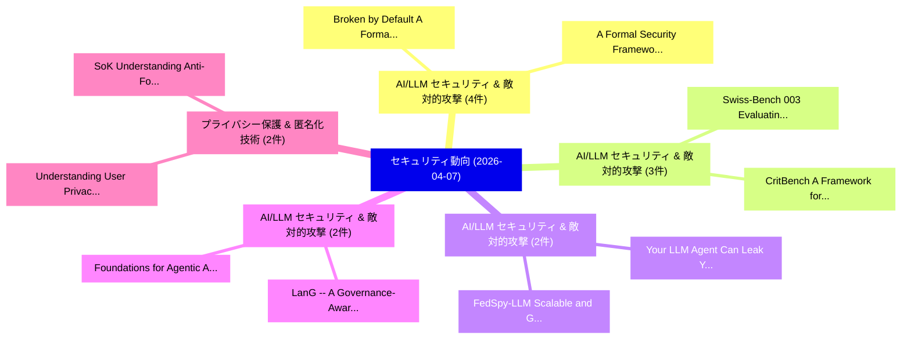

# 📅 02_daily: 日次エグゼクティブサマリー報告書 (2026-04-07)

**集計日時**: 2026-10-02 23:06:04 UTC  
**対象日付**: 2026-04-07  
**本日収集論文数**: 38 件  

---

## 💡 主要セキュリティ動向・脅威インサイト (Executive Insights)

本日の収集論文（計 38 件）において、以下の重点セキュリティ領域で活発な研究動向が確認されました：
- **AI/LLM セキュリティ & 敵対的攻撃** (4 件): 注目論文として 「Broken by Default: A Formal Ve...」、「A Formal Security Framework fo...」 等が発表され、実務防御および攻撃検証の進展が見られます。
- **AI/LLM セキュリティ & 敵対的攻撃** (3 件): 注目論文として 「Swiss-Bench 003: Evaluating LL...」、「CritBench: A Framework for Eva...」 等が発表され、実務防御および攻撃検証の進展が見られます。
- **AI/LLM セキュリティ & 敵対的攻撃** (2 件): 注目論文として 「Your LLM Agent Can Leak Your D...」、「FedSpy-LLM: Scalable and Gener...」 等が発表され、実務防御および攻撃検証の進展が見られます。
- **AI/LLM セキュリティ & 敵対的攻撃** (2 件): 注目論文として 「LanG -- A Governance-Aware Age...」、「Foundations for Agentic AI Inv...」 等が発表され、実務防御および攻撃検証の進展が見られます。
- **プライバシー保護 & 匿名化技術** (2 件): 注目論文として 「Understanding User Privacy Per...」、「SoK: Understanding Anti-Forens...」 等が発表され、実務防御および攻撃検証の進展が見られます。

### 🗺️ 技術・脅威トピックマインドマップ

---

## 📌 日次セキュリティ論文一覧 (日本語表形式)

| No | arXiv ID | 論文タイトル (日本語訳) | 重要キーワード | 構造化エグゼクティブ要約 (背景・提案・影響) | 脅威分類 | 詳細リンク |
|---|---|---|---|---|---|---|
| 1 | `2604.05292v2` | [Broken by Default: A Formal Verification Study of Security Vulnerabilities in AI-Generated Code（セキュリティ分析論文）](../../okf/papers/2026-04-07/2604.05292.md) | `Security Vulnerabilities`, `Generated Code`, `AI-Generated Code` | 【提案】概要 (Overview & Key Finding) 本論文「Broken by Default: A Formal Verification Study of Secur...。実証評価により経営層・セキュリティ管理者向け推奨アクション (E... | `cs.AI` | [arXiv](https://arxiv.org/abs/2604.05292v2) &#124; [OKF](../../okf/papers/2026-04-07/2604.05292.md) |
| 2 | `2604.05432v1` | [Your LLM Agent Can Leak Your Data: Data Exfiltration via Backdoored Tool Use（セキュリティ分析論文）](../../okf/papers/2026-04-07/2604.05432.md) | `Backdoored Tool Use`, `Data Exfiltration`, `Wuyang Zhang` | 【提案】概要 (Overview & Key Finding) 本論文「Your LLM Agent Can Leak Your Data: Data Exfiltration vi...。実証評価により経営層・セキュリティ管理者向け推奨アクション (E... | `cs.AI` | [arXiv](https://arxiv.org/abs/2604.05432v1) &#124; [OKF](../../okf/papers/2026-04-07/2604.05432.md) |
| 3 | `2604.05440v1` | [LanG -- A Governance-Aware Agentic AI Platform for Unified Security Operations（セキュリティ分析論文）](../../okf/papers/2026-04-07/2604.05440.md) | `Unified Security Operations`, `Aware Agentic`, `Governance-Aware Agentic` | 【提案】概要 (Overview & Key Finding) 本論文「LanG -- A Governance-Aware Agentic AI Platform for Unif...。実証評価により経営層・セキュリティ管理者向け推奨アクション (E... | `cs.AI` | [arXiv](https://arxiv.org/abs/2604.05440v1) &#124; [OKF](../../okf/papers/2026-04-07/2604.05440.md) |
| 4 | `2604.05458v1` | [MA-IDS: Multi-Agent RAG Framework for IoT Network Intrusion Detection with an Experience Library（セキュリティ分析論文）](../../okf/papers/2026-04-07/2604.05458.md) | `Network Intrusion Detection`, `Experience Library`, `Multi-Agent RAG` | 【提案】概要 (Overview & Key Finding) 本論文「MA-IDS: Multi-Agent RAG Framework for IoT Network Intru...。実証評価により経営層・セキュリティ管理者向け推奨アクション (E... | `cs.AI` | [arXiv](https://arxiv.org/abs/2604.05458v1) &#124; [OKF](../../okf/papers/2026-04-07/2604.05458.md) |
| 5 | `2604.05480v2` | [Can You Trust the Vectors in Your Vector Database? Black-Hole Attack from Embedding Space Defects（セキュリティ分析論文）](../../okf/papers/2026-04-07/2604.05480.md) | `Embedding Space Defects`, `Hole Attack`, `Black-Hole Attack` | 【提案】Black-Hole Attack from Embedding Space Defects ### (日本語題名: Can You Trust the Vectors in...。実証評価により経営層・セキュリティ管理者向け推奨アクション (E... | `cs.DB` | [arXiv](https://arxiv.org/abs/2604.05480v2) &#124; [OKF](../../okf/papers/2026-04-07/2604.05480.md) |
| 6 | `2604.05502v1` | [AttnDiff: Attention-based Differential Fingerprinting for 大規模言語モデル](../../okf/papers/2026-04-07/2604.05502.md) | `Differential Fingerprinting`, `Attention-based Differential`, `Large Language Models` | 【提案】概要 (Overview & Key Finding) 本論文「AttnDiff: Attention-based Differential Fingerprinting f...。実証評価により経営層・セキュリティ管理者向け推奨アクション (E... | `executive-summary` | [arXiv](https://arxiv.org/abs/2604.05502v1) &#124; [OKF](../../okf/papers/2026-04-07/2604.05502.md) |
| 7 | `2604.05571v1` | [Understanding User Privacy Perceptions of GenAI Smartphones（セキュリティ分析論文）](../../okf/papers/2026-04-07/2604.05571.md) | `Understanding User Privacy Perceptions`, `Ran Jin`, `Liu Wang` | 【提案】概要 (Overview & Key Finding) 本論文「Understanding User Privacy Perceptions of GenAI Smartph...。実証評価により経営層・セキュリティ管理者向け推奨アクション (E... | `executive-summary` | [arXiv](https://arxiv.org/abs/2604.05571v1) &#124; [OKF](../../okf/papers/2026-04-07/2604.05571.md) |
| 8 | `2604.05589v1` | [Foundations for Agentic AI Investigations from the Forensic OpenClawの分析](../../okf/papers/2026-04-07/2604.05589.md) | `Jan Gruber`, `Niclas Hilgert`, `Raw Meta` | 【提案】概要 (Overview & Key Finding) 本論文「Foundations for Agentic AI Investigations from the Fore...。実証評価により経営層・セキュリティ管理者向け推奨アクション (E... | `cs.AI` | [arXiv](https://arxiv.org/abs/2604.05589v1) &#124; [OKF](../../okf/papers/2026-04-07/2604.05589.md) |
| 9 | `2604.05599v1` | [PQC-Enhanced QKD Networks: A Layered Approach（セキュリティ分析論文）](../../okf/papers/2026-04-07/2604.05599.md) | `PQC-Enhanced QKD`, `Paul Spooren`, `Andreas Neuhold` | 【提案】概要 (Overview & Key Finding) 本論文「PQC-Enhanced QKD Networks: A Layered Approach（セキュリティ分析論...。実証評価により経営層・セキュリティ管理者向け推奨アクション (E... | `executive-summary` | [arXiv](https://arxiv.org/abs/2604.05599v1) &#124; [OKF](../../okf/papers/2026-04-07/2604.05599.md) |
| 10 | `2604.05642v1` | [T2T: Captioning Smartphone Activities Using Mobile Traffic（セキュリティ分析論文）](../../okf/papers/2026-04-07/2604.05642.md) | `Captioning Smartphone Activities Using Mobile Traffic`, `Jiyu Liu`, `Yong Huang` | 【提案】概要 (Overview & Key Finding) 本論文「T2T: Captioning Smartphone Activities Using Mobile Traf...。実証評価により経営層・セキュリティ管理者向け推奨アクション (E... | `cybersecurity` | [arXiv](https://arxiv.org/abs/2604.05642v1) &#124; [OKF](../../okf/papers/2026-04-07/2604.05642.md) |
| 11 | `2604.05674v1` | [From Incomplete Architecture to Quantified Risk: Multimodal LLM-Driven Security Assessment for Cyber-Physical Systems（セキュリティ分析論文）](../../okf/papers/2026-04-07/2604.05674.md) | `Driven Security Assessment`, `Quantified Risk`, `Physical Systems` | 【提案】概要 (Overview & Key Finding) 本論文「From Incomplete Architecture to Quantified Risk: Multim...。実証評価により経営層・セキュリティ管理者向け推奨アクション (E... | `cs.AI` | [arXiv](https://arxiv.org/abs/2604.05674v1) &#124; [OKF](../../okf/papers/2026-04-07/2604.05674.md) |
| 12 | `2604.05719v1` | [Hackers or Hallucinators? A Comprehensive LLM-Based Automated Penetration Testingの分析](../../okf/papers/2026-04-07/2604.05719.md) | `LLM-Based Automated`, `Based Automated Penetration Testing`, `Based Automated Penetration` | 【提案】A Comprehensive Analysis of LLM-Based Automated Penetration Testing ### (日本語題名: Hackers...。実証評価により経営層・セキュリティ管理者向け推奨アクション (E... | `cs.AI` | [arXiv](https://arxiv.org/abs/2604.05719v1) &#124; [OKF](../../okf/papers/2026-04-07/2604.05719.md) |
| 13 | `2604.05770v2` | [SoK: Understanding Anti-Forensics Concepts and Research Practices Across Forensic Subdomains（セキュリティ分析論文）](../../okf/papers/2026-04-07/2604.05770.md) | `Research Practices Across Forensic Subdomains`, `Understanding Anti`, `Forensics Concepts` | 【提案】概要 (Overview & Key Finding) 本論文「SoK: Understanding Anti-Forensics Concepts and Research...。実証評価により経営層・セキュリティ管理者向け推奨アクション (E... | `cybersecurity` | [arXiv](https://arxiv.org/abs/2604.05770v2) &#124; [OKF](../../okf/papers/2026-04-07/2604.05770.md) |
| 14 | `2604.05793v1` | [BodhiPromptShield: Pre-Inference Prompt Mediation for Suppressing Privacy Propagation in LLM/VLM Agents（セキュリティ分析論文）](../../okf/papers/2026-04-07/2604.05793.md) | `Inference Prompt Mediation`, `Suppressing Privacy Propagation`, `Pre-Inference Prompt` | 【提案】概要 (Overview & Key Finding) 本論文「BodhiPromptShield: Pre-Inference Prompt Mediation for S...。実証評価により経営層・セキュリティ管理者向け推奨アクション (E... | `cs.CV` | [arXiv](https://arxiv.org/abs/2604.05793v1) &#124; [OKF](../../okf/papers/2026-04-07/2604.05793.md) |
| 15 | `2604.05809v2` | [Adjustable Text-Guided Backdoor Attacks with Natural-Word Triggers on Multimodal Pretrained Models（セキュリティ分析論文）](../../okf/papers/2026-04-07/2604.05809.md) | `Guided Backdoor Attacks`, `Multimodal Pretrained Models`, `Adjustable Text` | 【提案】概要 (Overview & Key Finding) 本論文「Adjustable Text-Guided Backdoor Attacks with Natural-Wo...。実証評価により経営層・セキュリティ管理者向け推奨アクション (E... | `executive-summary` | [arXiv](https://arxiv.org/abs/2604.05809v2) &#124; [OKF](../../okf/papers/2026-04-07/2604.05809.md) |
| 16 | `2604.05872v1` | [Swiss-Bench 003: Evaluating LLM Reliability and Adversarial Security for Swiss Regulatory Contexts（セキュリティ分析論文）](../../okf/papers/2026-04-07/2604.05872.md) | `Swiss Regulatory Contexts`, `Swiss-Bench 003`, `Adversarial Security` | 【提案】概要 (Overview & Key Finding) 本論文「Swiss-Bench 003: Evaluating LLM Reliability and Adversa...。実証評価により経営層・セキュリティ管理者向け推奨アクション (E... | `cs.AI` | [arXiv](https://arxiv.org/abs/2604.05872v1) &#124; [OKF](../../okf/papers/2026-04-07/2604.05872.md) |
| 17 | `2604.05969v1` | [A Formal Security Framework for MCP-Based AI Agents: Threat Taxonomy, Verification Models, and Defense Mechanisms（セキュリティ分析論文）](../../okf/papers/2026-04-07/2604.05969.md) | `MCP-Based AI`, `Threat Taxonomy`, `Verification Models` | 【提案】概要 (Overview & Key Finding) 本論文「A Formal Security Framework for MCP-Based AI Agents: 脅威...。実証評価により経営層・セキュリティ管理者向け推奨アクション (E... | `cs.AI` | [arXiv](https://arxiv.org/abs/2604.05969v1) &#124; [OKF](../../okf/papers/2026-04-07/2604.05969.md) |
| 18 | `2604.06019v1` | [CritBench: A Framework for Evaluating Cybersecurity Capabilities of 大規模言語モデル in IEC 61850 Digital Substation Environments](../../okf/papers/2026-04-07/2604.06019.md) | `Evaluating Cybersecurity Capabilities`, `Digital Substation Environments`, `Large Language Models` | 【提案】概要 (Overview & Key Finding) 本論文「CritBench: A Framework for Evaluating Cybersecurity Cap...。実証評価により経営層・セキュリティ管理者向け推奨アクション (E... | `cs.AI` | [arXiv](https://arxiv.org/abs/2604.06019v1) &#124; [OKF](../../okf/papers/2026-04-07/2604.06019.md) |
| 19 | `2604.06092v2` | [Decentralized Equilibrium for Bitcoin Mining（セキュリティ分析論文）](../../okf/papers/2026-04-07/2604.06092.md) | `Decentralized Equilibrium`, `Bitcoin Mining`, `General Cyber Security` | 【提案】概要 (Overview & Key Finding) 本論文「Decentralized Equilibrium for Bitcoin Mining（セキュリティ分析論文...。実証評価により経営層・セキュリティ管理者向け推奨アクション (E... | `General Cyber Security` | [arXiv](https://arxiv.org/abs/2604.06092v2) &#124; [OKF](../../okf/papers/2026-04-07/2604.06092.md) |
| 20 | `2604.06095v1` | [LLM4CodeRE: Generative AI for Code Decompilation Analysis and Reverse Engineering（セキュリティ分析論文）](../../okf/papers/2026-04-07/2604.06095.md) | `Reverse Engineering`, `Tochukwu Emmanuel Nwankwo`, `Hamed Jelodar` | 【提案】概要 (Overview & Key Finding) 本論文「LLM4CodeRE: Generative AI for Code Decompilation Analys...。実証評価により経営層・セキュリティ管理者向け推奨アクション (E... | `cs.AI` | [arXiv](https://arxiv.org/abs/2604.06095v1) &#124; [OKF](../../okf/papers/2026-04-07/2604.06095.md) |
| 21 | `2604.06100v3` | [Signature Placement in Post-Quantum TLS Certificate Hierarchies: An Experimental Study of ML-DSA and SLH-DSA in TLS 1.3 Authentication（セキュリティ分析論文）](../../okf/papers/2026-04-07/2604.06100.md) | `Signature Placement`, `Certificate Hierarchies`, `Post-Quantum TLS` | 【提案】概要 (Overview & Key Finding) 本論文「Signature Placement in Post-量子 TLS Certificate Hierarch...。実証評価により経営層・セキュリティ管理者向け推奨アクション (E... | `cybersecurity` | [arXiv](https://arxiv.org/abs/2604.06100v3) &#124; [OKF](../../okf/papers/2026-04-07/2604.06100.md) |
| 22 | `2604.06101v1` | [Securing IIoT: An Innovative Privacy-Preserving Anomaly Detector Based on Federated Learningに向けて](../../okf/papers/2026-04-07/2604.06101.md) | `Preserving Anomaly Detector Based`, `Privacy-Preserving Anomaly`, `Towards Securing` | 【提案】概要 (Overview & Key Finding) 本論文「Securing IIoT: An Innovative Privacy-Preserving Anomaly...。実証評価により経営層・セキュリティ管理者向け推奨アクション (E... | `cybersecurity` | [arXiv](https://arxiv.org/abs/2604.06101v1) &#124; [OKF](../../okf/papers/2026-04-07/2604.06101.md) |
| 23 | `2604.06148v1` | [Who Governs the Machine? A Machine Identity Governance Taxonomy (MIGT) for AI Systems Operating Across Enterprise and Geopolitical Boundaries（セキュリティ分析論文）](../../okf/papers/2026-04-07/2604.06148.md) | `Machine Identity Governance Taxonomy`, `Systems Operating Across Enterprise`, `Geopolitical Boundaries` | 【提案】A Machine Identity Governance Taxonomy (MIGT) for AI Systems Operating Across Enterpris...。実証評価により経営層・セキュリティ管理者向け推奨アクション (E... | `cs.AI` | [arXiv](https://arxiv.org/abs/2604.06148v1) &#124; [OKF](../../okf/papers/2026-04-07/2604.06148.md) |
| 24 | `2604.06266v1` | [Attribution-Driven Explainable Intrusion Detection with Encoder-Based 大規模言語モデル](../../okf/papers/2026-04-07/2604.06266.md) | `Driven Explainable Intrusion Detection`, `Attribution-Driven Explainable`, `Based Large Language Models` | 【提案】概要 (Overview & Key Finding) 本論文「Attribution-Driven Explainable Intrusion Detection with...。実証評価により経営層・セキュリティ管理者向け推奨アクション (E... | `cs.AI` | [arXiv](https://arxiv.org/abs/2604.06266v1) &#124; [OKF](../../okf/papers/2026-04-07/2604.06266.md) |
| 25 | `2604.06272v1` | [Zero Trust in the Context of IoT: Industrial Literature Review, Trends, and Challenges（セキュリティ分析論文）](../../okf/papers/2026-04-07/2604.06272.md) | `Industrial Literature Review`, `Zero Trust`, `Laurent Bobelin` | 【提案】概要 (Overview & Key Finding) 本論文「ゼロトラスト in the Context of IoT: Industrial Literature Rev...。実証評価により経営層・セキュリティ管理者向け推奨アクション (E... | `cybersecurity` | [arXiv](https://arxiv.org/abs/2604.06272v1) &#124; [OKF](../../okf/papers/2026-04-07/2604.06272.md) |
| 26 | `2604.06274v1` | [the Development of an LLM-Based Methodology for Automated Security Profiling in Compliance with Ukrainian Cybersecurity Regulationsに向けて](../../okf/papers/2026-04-07/2604.06274.md) | `Automated Security Profiling`, `Based Methodology`, `LLM-Based Methodology` | 【提案】概要 (Overview & Key Finding) 本論文「the Development of an LLM-Based Methodology for Automat...。実証評価により経営層・セキュリティ管理者向け推奨アクション (E... | `cs.AI` | [arXiv](https://arxiv.org/abs/2604.06274v1) &#124; [OKF](../../okf/papers/2026-04-07/2604.06274.md) |
| 27 | `2604.06284v1` | [ClawLess: A Security Model of AI Agents（セキュリティ分析論文）](../../okf/papers/2026-04-07/2604.06284.md) | `Security Model`, `Hongyi Lu`, `Nian Liu` | 【提案】概要 (Overview & Key Finding) 本論文「ClawLess: A Security Model of AI Agents（セキュリティ分析論文）」（原題...。実証評価により経営層・セキュリティ管理者向け推奨アクション (E... | `cs.AI` | [arXiv](https://arxiv.org/abs/2604.06284v1) &#124; [OKF](../../okf/papers/2026-04-07/2604.06284.md) |
| 28 | `2604.06285v1` | [Harnessing Hyperbolic Geometry for Harmful Prompt Detection and Sanitization（セキュリティ分析論文）](../../okf/papers/2026-04-07/2604.06285.md) | `Harnessing Hyperbolic Geometry`, `Harmful Prompt Detection`, `Maria Rosaria Briglia` | 【提案】概要 (Overview & Key Finding) 本論文「Harnessing Hyperbolic Geometry for Harmful Prompt Detec...。実証評価により経営層・セキュリティ管理者向け推奨アクション (E... | `cs.AI` | [arXiv](https://arxiv.org/abs/2604.06285v1) &#124; [OKF](../../okf/papers/2026-04-07/2604.06285.md) |
| 29 | `2604.06289v1` | [Adversarial Robustness of Time-Series Classification for Crystal Collimator Alignment（セキュリティ分析論文）](../../okf/papers/2026-04-07/2604.06289.md) | `Crystal Collimator Alignment`, `Adversarial Robustness`, `Series Classification` | 【提案】概要 (Overview & Key Finding) 本論文「Adversarial Robustness of Time-Series Classification fo...。実証評価により経営層・セキュリティ管理者向け推奨アクション (E... | `executive-summary` | [arXiv](https://arxiv.org/abs/2604.06289v1) &#124; [OKF](../../okf/papers/2026-04-07/2604.06289.md) |
| 30 | `2604.06297v1` | [FedSpy-LLM: Scalable and Generalizable Data Reconstruction Attacks from Gradients on LLMsに向けて](../../okf/papers/2026-04-07/2604.06297.md) | `Generalizable Data Reconstruction Attacks`, `Towards Scalable`, `Syed Irfan Ali Meerza` | 【提案】概要 (Overview & Key Finding) 本論文「FedSpy-LLM: Scalable and Generalizable Data Reconstruct...。実証評価により経営層・セキュリティ管理者向け推奨アクション (E... | `executive-summary` | [arXiv](https://arxiv.org/abs/2604.06297v1) &#124; [OKF](../../okf/papers/2026-04-07/2604.06297.md) |
| 31 | `2604.06323v2` | [Blockchain and AI: Intelligent Networks for the Futureのセキュリティ強化](../../okf/papers/2026-04-07/2604.06323.md) | `Securing Intelligent Networks`, `Intelligent Networks`, `Tu Dac Ho` | 【提案】概要 (Overview & Key Finding) 本論文「Blockchain and AI: Intelligent Networks for the Futureの...。実証評価によりEldeeb, Tu Dac Ho - **公開日... | `cs.AI` | [arXiv](https://arxiv.org/abs/2604.06323v2) &#124; [OKF](../../okf/papers/2026-04-07/2604.06323.md) |
| 32 | `2604.06367v2` | [WebSP-Eval: Evaluating Web Agents on Website Security and Privacy Tasks（セキュリティ分析論文）](../../okf/papers/2026-04-07/2604.06367.md) | `Evaluating Web Agents`, `Website Security`, `Privacy Tasks` | 【提案】概要 (Overview & Key Finding) 本論文「WebSP-Eval: Evaluating Web Agents on Website Security a...。実証評価により経営層・セキュリティ管理者向け推奨アクション (E... | `cs.AI` | [arXiv](https://arxiv.org/abs/2604.06367v2) &#124; [OKF](../../okf/papers/2026-04-07/2604.06367.md) |
| 33 | `2604.06409v1` | [Say Something Else: Rethinking Contextual Privacy as Information Sufficiency（セキュリティ分析論文）](../../okf/papers/2026-04-07/2604.06409.md) | `Say Something Else`, `Rethinking Contextual Privacy`, `Information Sufficiency` | 【提案】概要 (Overview & Key Finding) 本論文「Say Something Else: Rethinking Contextual Privacy as In...。実証評価により経営層・セキュリティ管理者向け推奨アクション (E... | `cs.AI` | [arXiv](https://arxiv.org/abs/2604.06409v1) &#124; [OKF](../../okf/papers/2026-04-07/2604.06409.md) |
| 34 | `2604.06411v1` | [Resilient Intrusion Detection in CubeSats: Challenges, TinyML Solutions, and Future Directionsに向けて](../../okf/papers/2026-04-07/2604.06411.md) | `Resilient Intrusion Detection`, `Towards Resilient Intrusion Detection`, `Future Directions` | 【提案】概要 (Overview & Key Finding) 本論文「Resilient Intrusion Detection in CubeSats: Challenges, ...。実証評価により経営層・セキュリティ管理者向け推奨アクション (E... | `cs.AI` | [arXiv](https://arxiv.org/abs/2604.06411v1) &#124; [OKF](../../okf/papers/2026-04-07/2604.06411.md) |
| 35 | `2604.06436v3` | [The Defense Trilemma: Why Prompt Injection Defense Wrappers Fail?（セキュリティ分析論文）](../../okf/papers/2026-04-07/2604.06436.md) | `Vineeth Sai Narajala`, `Md Tamjidul Hoque`, `Manish Bhatt` | 【提案】### (日本語題名: The Defense Trilemma: Why プロンプトインジェクション Defense Wrappers Fail?（セキュリティ分析論文）)...。実証評価により経営層・セキュリティ管理者向け推奨アクション (E... | `cs.AI` | [arXiv](https://arxiv.org/abs/2604.06436v3) &#124; [OKF](../../okf/papers/2026-04-07/2604.06436.md) |
| 36 | `2604.06481v1` | [Hybrid ResNet-1D-BiGRU with Multi-Head Attention for Cyberattack Detection in Industrial IoT Environments（セキュリティ分析論文）](../../okf/papers/2026-04-07/2604.06481.md) | `Head Attention`, `Multi-Head Attention`, `Cyberattack Detection` | 【提案】概要 (Overview & Key Finding) 本論文「Hybrid ResNet-1D-BiGRU with Multi-Head Attention for Cy...。実証評価により経営層・セキュリティ管理者向け推奨アクション (E... | `cs.AI` | [arXiv](https://arxiv.org/abs/2604.06481v1) &#124; [OKF](../../okf/papers/2026-04-07/2604.06481.md) |
| 37 | `2604.06492v2` | [Optimal Rates for Pure $\varepsilon$-Differentially Private Stochastic Convex Optimization with Heavy Tails（セキュリティ分析論文）](../../okf/papers/2026-04-07/2604.06492.md) | `Differentially Private Stochastic Convex Optimization`, `Optimal Rates`, `Heavy Tails` | 【提案】概要 (Overview & Key Finding) 本論文「Optimal Rates for Pure $\varepsilon$-Differentially Pri...。実証評価により経営層・セキュリティ管理者向け推奨アクション (E... | `executive-summary` | [arXiv](https://arxiv.org/abs/2604.06492v2) &#124; [OKF](../../okf/papers/2026-04-07/2604.06492.md) |
| 38 | `2604.06506v1` | [Guiding Symbolic Execution with Static Analysis and LLMs for Vulnerability Discovery（セキュリティ分析論文）](../../okf/papers/2026-04-07/2604.06506.md) | `Guiding Symbolic Execution`, `Vulnerability Discovery`, `Md Shafiuzzaman` | 【提案】概要 (Overview & Key Finding) 本論文「Guiding Symbolic Execution with Static Analysis and LLM...。実証評価により経営層・セキュリティ管理者向け推奨アクション (E... | `executive-summary` | [arXiv](https://arxiv.org/abs/2604.06506v1) &#124; [OKF](../../okf/papers/2026-04-07/2604.06506.md) |

